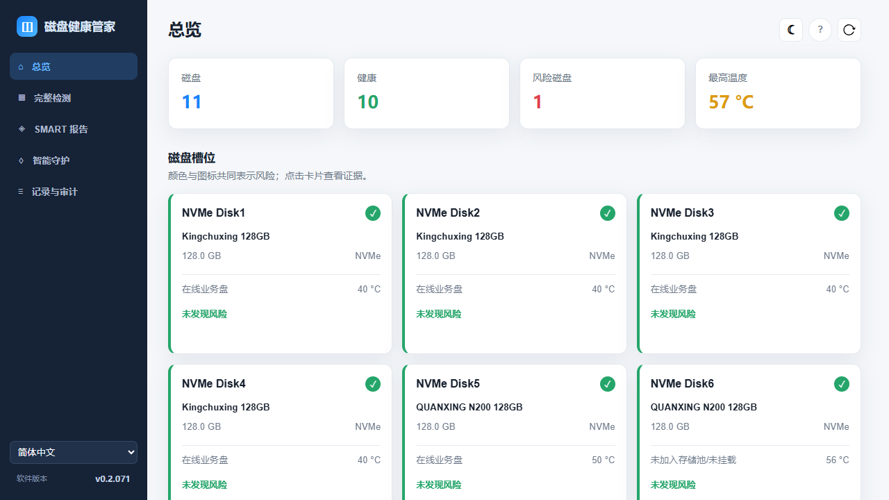
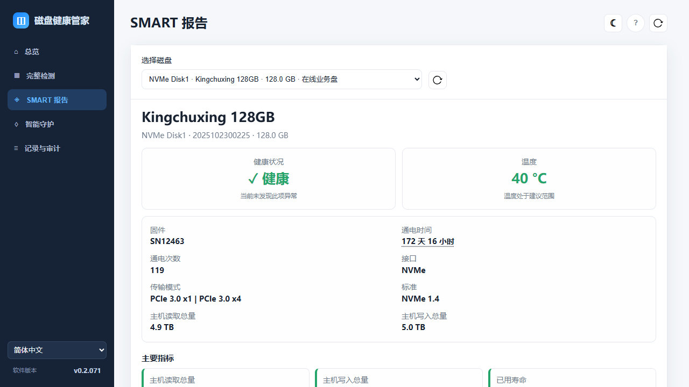
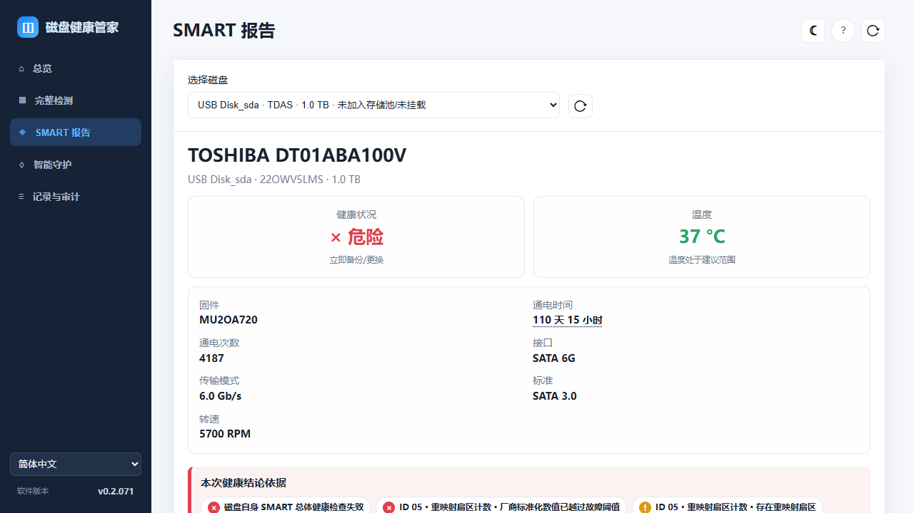
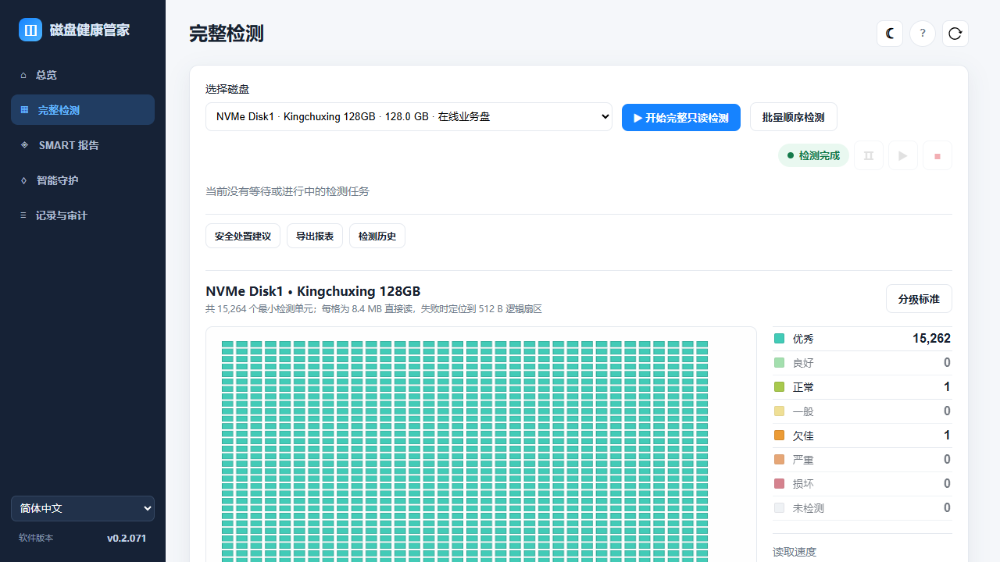
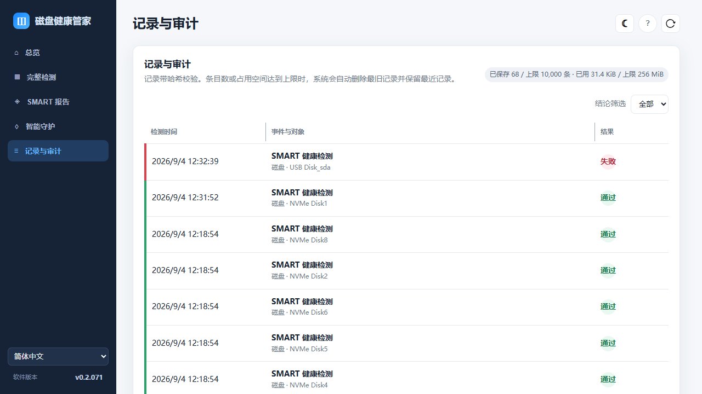
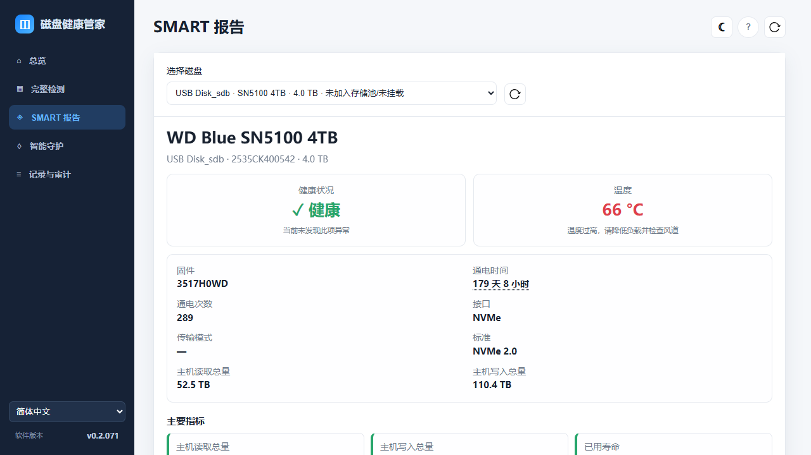
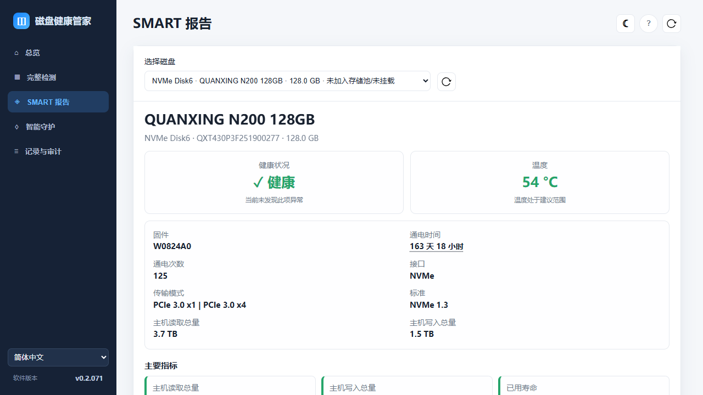

# 磁盘健康管家 vs smartmontools 对比报告

生成时间：2026-09-04 12:35（CST）  
检测目标：`10.18.15.135:9222`，远端 `hostname = TNAS`，TOS 用户 `test`  
应用：磁盘健康管家 `0.2.071`，commit `46febf67a690`  
参照工具：`smartmontools 7.5`，`smartctl` SVN `5714`

## 一、结论摘要

- 本次选择的主参照工具是 **smartmontools / `smartctl` 7.5**，理由是其直接读取 ATA/SATA、NVMe 与部分 USB 桥接设备的原始 SMART 数据，适合作为 NAS 的原始数据基准。
- 磁盘健康管家本身不内置 SMART 驱动，它由 Go 1.26.7 写成，实际调用 TOS 系统提供的 `smartctl`、`nvme`、`lsblk`、`systemd` 和 `ter_*` 工具。
- 本次共发现 11 块磁盘：应用判为 10 块健康、1 块风险；同源 `smartctl` 原始结果与其完全一致，唯一失败盘是 `/dev/sda`。
- `/dev/sda`（TOSHIBA DT01ABA100V）是当前唯一需要立即处理的风险盘：SMART 总体失败、ID 05 重映射扇区 1994、ID 199 CRC 7、错误日志约 39782 条，且历史自检有一次失败和一次被中断。
- 主要问题位于应用展示层：3 块 USB 盘的总览型号/固件/协议与 SMART 详情不一致；`/dev/sdc` 温度已超出应用自己的危险阈值，但摘要仍标为“健康”；总览温度与 SMART 接口温度不同步。

重要限制：本报告使用的 `smartctl 7.5` 与磁盘健康管家调用的都是同一台 NAS 上由 TOS 预装的 `/usr/sbin/smartctl`。因此，底层 SMART 原始数据必然同源，这不是“两个不同 SMART 引擎”的工具级对比；实际对比对象是“应用解析、健康规则、界面字段和完整只读扫描”与“`smartctl` 原始 SMART 数据”。如需真正独立的工具级交叉验证，应使用 `nvme-cli`、独立构建/不同版本的 `smartctl` 或 `sg3_utils` 等不同实现，而 GSmartControl、Scrutiny 底层仍调用 `smartctl`，不能作为独立引擎。

## 二、检测环境

```text
hostname: TNAS
kernel: Linux 6.12.63+ #15 SMP PREEMPT_DYNAMIC
arch: x86_64
smartctl: 7.5 2025-04-30 r5714
smartctl command: smartctl -a -j <device>
devices: /dev/sda /dev/sdb /dev/sdc /dev/nvme0..7
```

采集方式：通过 SSH 在远端执行只读 `smartctl -a -j`，结果保存为 JSON；通过 Web API 读取应用返回的 SMART 快照；通过 Playwright 独立会话打开应用并截取真实页面，未操作 Chrome、未修改 NAS 配置、未启动任何 SMART 自检。

## 三、开源工具调研与选择

| 候选工具 | 来源/许可证 | 已核实版本 | 适合本次对比的原因 |
|---|---|---|---|
| smartmontools / `smartctl` | [官网](https://www.smartmontools.org/) / [GitHub](https://github.com/smartmontools/smartmontools)，GPL-2.0 | 7.5 | 同时支持 ATA/SATA、SCSI/SAS、NVMe 及部分 USB/RAID，输出稳定、可脚本化 |
| GSmartControl | [官网](https://gsmartcontrol.shaduri.dev) / [GitHub](https://github.com/ashaduri/gsmartcontrol)，GPL-3.0 | 2.0.2 | 适合桌面图形化人工查看，不是无头 NAS 的唯一基准 |
| Scrutiny | [GitHub](https://github.com/AnalogJ/scrutiny)，MIT | 0.9.3 | 适合长期可视化监控，但引入了 Web/数据库/阈值逻辑，不适合做原始数据基准 |
| nvme-cli | [GitHub](https://github.com/linux-nvme/nvme-cli)，GPL-2.0 | 2.16 | 可作为 NVMe 专项补充，但只覆盖 NVMe |

选择结果：**主工具使用 `smartctl`**；如后续只做 NVMe 专项，可补充 `nvme-cli`。

## 四、应用本身使用的工具与能力

- 应用版本：`0.2.071`
- 应用类型：Go 静态编译二进制 + 自托管 Web UI
- 应用底层：`smartctl -a -j` 读取 SMART，`lsblk` 读取拓扑，`nvme` 读取 NVMe 信息，`systemd` 管理服务，`ter_*` 用于 TOS 集成
- 主要页面/能力：总览、完整只读检测、SMART 报告、智能守护、记录与审计、安全处置建议、导出报表、问题反馈
- 完整检测原理：按 8 MiB/8.4 MB 单元直接读取，失败后递归缩小到逻辑扇区；只读、不写盘、不消耗 SSD 写入寿命
- 智能守护：支持定时快照、风险趋势、通知；当前设置为每 72 小时，邮件关闭

本地 deb 包处理说明：`diskcheck_x86_64_v0.2.059.deb`、`v0.2.063.deb`、`v0.2.071.deb` 已全部解包并核对控制文件、systemd 服务、Go 二进制和 SBOM；当前 NAS 中已运行的应用版本与最新包一致，因此本次未执行热安装或替换，避免改变测试环境。

## 五、逐盘对比结果

应用健康状态以“应用页面/API 的 health”为准；同源 `smartctl` 健康状态以 JSON `smart_status.passed` / NVMe `Critical Warning=0` 为准。

| 设备 | 应用槽位 | 应用最终结论 | `smartctl` 结论 | 应用温度 | 底层/页面温度 | 关键差异 |
|---|---|---|---|---|---|---|
| /dev/sda | USB Disk_sda | 危险 | 失败 | 34 °C | 35 °C | 型号、固件不一致 |
| /dev/sdb | USB Disk_sdb | 通过 | 通过 | 36 °C | 36 °C | 协议/型号/固件不一致 |
| /dev/sdc | USB Disk_sdb | 通过 | 通过 | 65 °C | 66-74 °C | 温度风险与“健康”结论矛盾 |
| /dev/sdza | NVMe Disk1 | 通过 | 通过 | 40 °C | 40 °C | 一致 |
| /dev/sdzb | NVMe Disk7 | 通过 | 通过 | 46 °C | 46 °C | 一致 |
| /dev/sdzc | NVMe Disk3 | 通过 | 通过 | 40 °C | 40 °C | 一致 |
| /dev/sdzd | NVMe Disk4 | 通过 | 通过 | 40 °C | 40 °C | 一致 |
| /dev/sdze | NVMe Disk5 | 通过 | 通过 | 52-54 °C | 50-54 °C | 温度为动态值 |
| /dev/sdzf | NVMe Disk6 | 通过 | 通过 | 56-76 °C | 54-75 °C | 页面/API/`smartctl` 温度不同步 |
| /dev/sdzg | NVMe Disk2 | 通过 | 通过 | 40 °C | 40 °C | 一致 |
| /dev/sdzh | NVMe Disk8 | 通过 | 通过 | 45 °C | 45-46 °C | 一致 |

详细可核对数据：

- 应用设备列表：`evidence/diskcheck_devices.json`
- 应用每盘 SMART：`evidence/smart_*.json`
- 同源 `smartctl` 原始结果：`evidence/ssh_smart/smartctl_*.json`
- 对比汇总：`evidence/comparison_summary.json`

## 六、一句话问题反馈

1. 总览页将 `/dev/sda` 显示为 `TDAS / 固件 0`，而 SMART 页和 `smartctl` 显示为 `TOSHIBA DT01ABA100V / MU2OA720`，说明总览未使用同一份已验证的设备身份。
2. 总览页将两块 USB NVMe 盘 `/dev/sdb`、`/dev/sdc` 显示为 ATA，而 SMART 页和 `smartctl` 均显示为 NVMe，协议元数据需要统一。
3. `/dev/sdc` 在 SMART 报告中温度为 66 °C 且温度行标为“× 危险”，但页面顶部仍显示“✓ 健康”，总览也显示“未发现风险”，健康结论与自身判据冲突。
4. 总览页“最高温度”一度显示 57 °C，而应用 SMART 快照和独立 `smartctl` 显示 `/dev/sdc` 为 65-74 °C、`/dev/sdzf` 为 75-76 °C，说明总览温度可能存在旧快照或不同数据源。
5. 智能守护历史只覆盖 8 块内部 NVMe 盘，没有覆盖 `/dev/sda`、`/dev/sdb`、`/dev/sdc` 三块 USB 盘，需要明确这是“仅内部盘”的设计还是覆盖缺失。

## 七、建议点

1. 总览、SMART 页、守护快照应共享同一条已验证的设备身份记录（型号、固件、协议、序列号、WWN），避免人工排查时出现三套字段。
2. 当温度命中 55-59 °C 或 ≥60 °C 规则时，应同步影响卡片状态或至少明确显示“温度风险”，不能在同一页面把温度标红却把总体标绿。
3. 对高温度盘增加“采集时间/刷新提示”，并在总览与 SMART 页间自动同步或提供明确的刷新入口，避免用户看到过时温度。
4. 对 `/dev/sda` 的 SMART 详情增加错误日志总条数、最近自检失败记录、`when_failed` 字段和 CRC 增长提示，用户才能知道问题不止重映射扇区。
5. 完整检测的“性能分级（正常/欠佳/严重）”与“健康结论（通过/危险）”应分开命名，避免用户把一次欠佳响应误解为磁盘已经损坏。

## 八、截图















## 九、第二轮补充：现场可用 SMART 工具与 nvme-cli 交叉验证

补充采集时间：2026-09-04 14:22（CST）  
连接方式：只读 SSH 验证；未安装、未替换、未删除任何程序或配置。

### 9.1 现场工具探测结果

| 工具 | 命令 | 现场状态 |
|---|---|---|
| smartmontools / `smartctl` | `/usr/sbin/smartctl` | 已安装，`smartctl 7.5 2025-04-30 r5714` |
| nvme-cli / `nvme` | `/usr/sbin/nvme` | 已安装，`nvme version 1.16` |
| smartd | `/usr/sbin/smartd` | 已安装（与 smartctl 同属 smartmontools） |
| TOS CLI / `tos` | `/usr/bin/tos` | 已安装，`TOS CLI 1.0.12`，`TOS 7.0.1163 Build 20260716` |
| libatasmart / `skdump` | `skdump` | 未安装 |
| sg3_utils / `sg_inq`、`sg_sat_read_gplog` | `sg_inq`、`sg_sat_read_gplog` | 未安装 |
| openSeaChest / `openSeaChest_SMART` | `openSeaChest_SMART` | 未安装 |

系统包核实结果：

```text
ii  nvme-cli                          1.16-3ubuntu0.1   amd64   NVMe management tool
ii  smartmontools                     7.5-1build2       amd64   control and monitor storage systems using S.M.A.R.T.
```

### 9.2 nvme-cli 独立读取结果（内部 NVMe）

以下为通过 `nvme smart-log /dev/nvme0..7` 读取的独立结果，本次均为只读查询：

| 设备 | 温度 | `critical_warning` | `media_errors` | `available_spare` | `percentage_used` | `power_on_hours` | `unsafe_shutdowns` |
|---|---:|---:|---:|---:|---:|---:|---:|
| /dev/nvme0 | 40 °C | 0 | 0 | 100% | 2% | 4146 | 52 |
| /dev/nvme1 | 46 °C | 0 | 0 | 100% | 0% | 43 | 1 |
| /dev/nvme2 | 40 °C | 0 | 0 | 100% | 0% | 4148 | 53 |
| /dev/nvme3 | 40 °C | 0 | 0 | 100% | 1% | 4146 | 52 |
| /dev/nvme4 | 51 °C | 0 | 0 | 100% | 0% | 3931 | 86 |
| /dev/nvme5 | 54 °C | 0 | 0 | 100% | 0% | 3931 | 86 |
| /dev/nvme6 | 40 °C | 0 | 0 | 100% | 1% | 4160 | 53 |
| /dev/nvme7 | 46 °C | 0 | 0 | 100% | 0% | 43 | 1 |

结论：8 块内部 NVMe 的独立 `nvme-cli` 结果均为无关键告警、无介质错误；与应用判定的“通过/健康”一致。这也说明 `nvme-cli` 可以作为 NVMe 盘的**解析层第二来源**，但它与 `smartctl` 一样都是读取同一份设备 SMART 日志，不是第二个物理传感器。

### 9.3 USB NVMe 直连尝试

```text
$ nvme smart-log /dev/sdb
smart log: Invalid argument

$ nvme smart-log /dev/sdc
smart log: Invalid argument
```

`/dev/sdb`、`/dev/sdc` 是 USB 转 NVMe（Realtek 桥），`nvme-cli` 无法直接访问；此类设备仍需要通过 `smartctl -d sntrealtek`，或安装并实测 `openSeaChest`。

### 9.4 TOS CLI 成功结果

已通过临时会话令牌执行 `tos disk list --detail`、`tos disk list --detail --json` 和 `tos storage info --scope disk --json`；轮次结束后未保存任何凭据或令牌。

`tos disk list` 产品层结果：

| 磁盘 ID | 型号 | 容量 | 健康 | 温度 | 系统盘 | 类型 |
|---|---|---|---|---|---|---|
| NVMe Disk1..4 | Kingchuxing 128GB | 128 GB | normal | 40 °C | No | nvme |
| NVMe Disk5..6 | QUANXING N200 128GB | 128 GB | normal | 49–53 °C | No | nvme |
| NVMe Disk7 | Sandisk NAS 800 NVMe 960GB | 960 GB | normal | 45 °C | No | nvme |
| NVMe Disk8 | Sandisk NAS 800 NVMe 960GB | 960 GB | normal | 46 °C | Yes | nvme |
| USB Disk_sda | GVY-128-2280 | 128 GB | error | 44 °C | No | usb |
| USB Disk_sdb | WD Blue SN5100 4TB | 4.00 TB | normal | 36 °C | No | usb |

`tos storage info --scope disk --json`：

```text
disk_count=10, healthy_disk_count=9, warning_disk_count=0, failed_disk_count=1
```

### 9.5 TOS CLI 与 smartctl/应用的三方差异

```
smartctl（内核/原始）：3 块 USB：sda=TOSHIBA 931.5G（failed）、sdb=GVY 128G（passed）、sdc=WD Blue 4TB（passed）
TOS CLI（产品层）  ：2 块 USB：GVY 128G（error）、WD Blue 4TB（normal）；未看到 TOSHIBA
```

主要结论：

1. 设备数量不一致：`smartctl --scan`/`lsblk` 看到 11 块物理盘（3 USB + 8 NVMe），TOS CLI 只报告 10 块（2 USB + 8 NVMe），TOSHIBA 1TB 未出现在产品层。
2. 健康结论冲突：smartctl/应用认为 GVY `/dev/sdb` 通过，TOS CLI 把型号为 `GVY-128-2280` 的 USB 条目判为 `error`；而真正失败的 TOSHIBA `/dev/sda` 反而没有以正确型号出现在产品层。
3. 温度不一致：TOS CLI 对 WD Blue 显示 36 °C，而应用 SMART 快照和 smartctl 此前读到 65–74 °C，可能存在旧快照或产品层温度源不同。
4. `nvme-cli` 对 `/dev/sdb`、`/dev/sdc` 均返回 `Invalid argument`，说明 USB Realtek 桥仍需 smartctl 专用 `-d sntrealtek` 或 openSeaChest 实测。

### 9.6 下一步可选执行方案

- 不安装软件：用 `smartctl` + `nvme-cli` 做原始/解析层对比，用 `tos disk list` 做产品层结论。
- 要真正独立的低层第二引擎：建议安装/放置 **openSeaChest**（MPL-2.0），优先覆盖 SATA、NVMe 和 USB。
- 需要更底层原始 ATA/SAT 日志：可安装 **sg3_utils**，但输出为十六进制，解析成本较高。
- `/dev/sdb`、`/dev/sdc`：必须单独确认 USB Realtek 桥在 openSeaChest 下的支持情况；切勿在未授权时执行任何自检、擦除或写配置命令。

### 9.7 核心对比：磁盘健康管家 vs hdparm（独立工具）

不要把 TOS CLI 当作主要对比对象。用户关心的真正对比是：**磁盘健康管家的展示结果** vs **一个不调用 smartctl 的独立工具**。这里使用 NAS 已预装的 `hdparm`，并通过 `sg_sat_identify` 和 `udevadm` 做交叉验证。

#### 9.7.1 独立工具读取到的真实设备身份

```text
hdparm -I /dev/sda
Model Number:       TOSHIBA DT01ABA100V
Serial Number:      22OWV5LMS
Firmware Revision:  MU2OA720

hdparm -I /dev/sdb
Model Number:       GVY-128-2280
Serial Number:      GD50910280368
Firmware Revision:  SN16223

hdparm -I /dev/sdc
Model Number:       WD Blue SN5100 4TB
Serial Number:      2535CK400542
Firmware Revision:  3517H0WD
```

`sg_sat_identify --readonly /dev/sda` 同样成功，返回的 ATA IDENTIFY 原始数据与上述一致；`udevadm` 的 `ID_MODEL`/`ID_SERIAL` 也一致。

#### 9.7.2 应用总览显示的字段

| 应用总览字段 | /dev/sda | /dev/sdb | /dev/sdc |
|---|---|---|---|
| 型号 | TDAS | 2280 | SN5100 4TB |
| 固件 | 0 | 1.01 | 1.01 |
| 协议 | ata | ata | ata |

#### 9.7.3 根因证据

应用总览里的 `TDAS`、`0`、`2280`、`1.01`、`SN5100 4TB` 与 Linux `/sys/block` 中 USB 桥暴露的字段一致：

```text
/sys/block/sda/device/model = TDAS
/sys/block/sda/device/vendor = TerraMas
/sys/block/sda/device/rev   = 0

/sys/block/sdb/device/model = 2280
/sys/block/sdb/device/vendor = GVY-128-
/sys/block/sdb/device/rev   = 1.01

/sys/block/sdc/device/model = SN5100 4TB
/sys/block/sdc/device/vendor = WD Blue
/sys/block/sdc/device/rev   = 1.01
```

结论：磁盘健康管家总览页很可能直接读取了 USB 桥接器的 `/sys/block/<dev>/device/{model,vendor,rev}`，而不是读取 ATA/NVMe 盘本身的身份。对直接插在 SATA/NVMe 槽位上的盘，这个字段是正确的；对 USB 外接盘，它显示的是桥接控制器信息，所以出现 `TDAS/0`、`2280/1.01/ATA`、`SN5100 4TB/1.01/ATA`。

应用 SMART 详情页则使用了底层 `smartctl` 数据，因此能看到正确的 `TOSHIBA DT01ABA100V/MU2OA720`、`GVY-128-2280/SN16223`、`WD Blue SN5100 4TB/3517H0WD`。同一应用内总览与详情不一致，最合理的解释就是“总览字段源错误”。

#### 9.7.4 建议的 bug 描述

> 磁盘健康管家总览页对 USB 外接盘显示型号/固件/协议错误：`/dev/sda` 显示 `TDAS/0/ATA`，实际为 TOSHIBA DT01ABA100V/MU2OA720；`/dev/sdb`、`/dev/sdc` 显示 USB 桥标识 `2280/1.01/ATA`、`SN5100 4TB/1.01/ATA`，实际分别是 GVY-128-2280/SN16223、WD Blue SN5100 4TB/3517H0WD。总览不应使用 `/sys/block/<dev>/device` 的桥接器字段，而应使用 ATA IDENTIFY/udev/SMART 身份数据；同时保证总览、SMART 详情和守护快照使用同一套字段。
