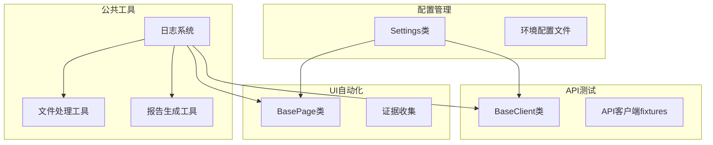
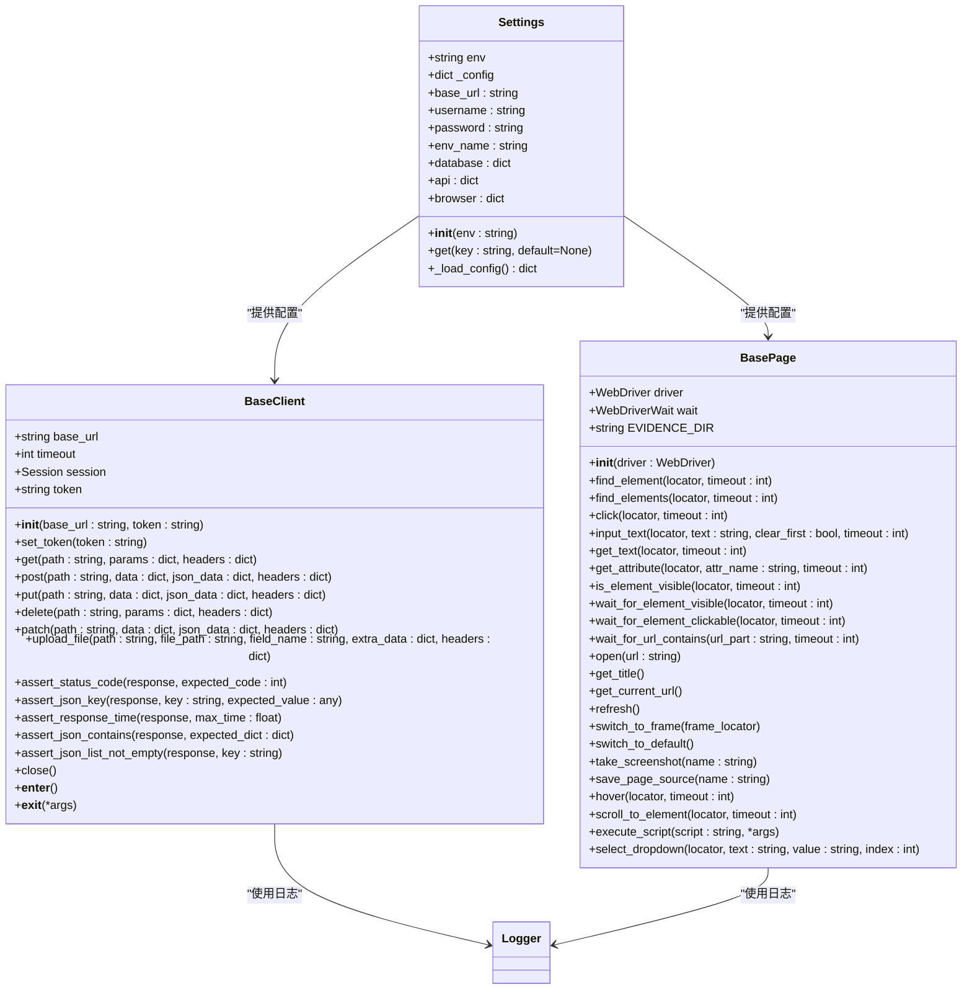
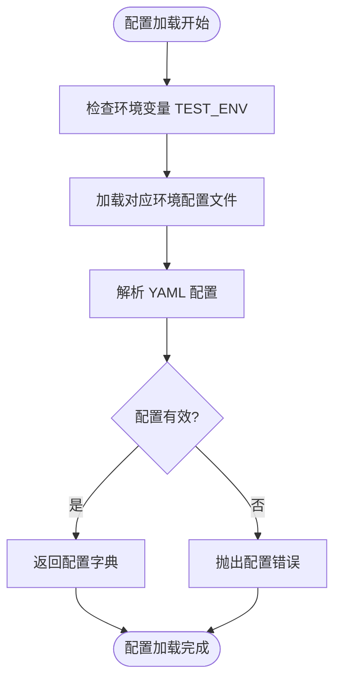
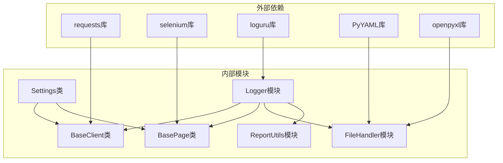

# API参考文档

<cite>
**本文档引用的文件**
- [config/settings.py](file://config/settings.py)
- [common/logger.py](file://common/logger.py)
- [common/file_handler.py](file://common/file_handler.py)
- [common/report_utils.py](file://common/report_utils.py)
- [api_testing/api_client/base_client.py](file://api_testing/api_client/base_client.py)
- [ui_automation/pages/base_page.py](file://ui_automation/pages/base_page.py)
- [config/environments/dev.yaml](file://config/environments/dev.yaml)
- [config/environments/test.yaml](file://config/environments/test.yaml)
- [config/environments/prod.yaml](file://config/environments/prod.yaml)
- [api_testing/testcases/conftest.py](file://api_testing/testcases/conftest.py)
- [api_testing/testdata/example_api_data.yaml](file://api_testing/testdata/example_api_data.yaml)
- [ui_automation/testdata/login_data.yaml](file://ui_automation/testdata/login_data.yaml)
- [README.md](file://README.md)
</cite>

## 目录
1. [简介](#简介)
2. [项目结构](#项目结构)
3. [核心组件](#核心组件)
4. [架构概览](#架构概览)
5. [详细组件分析](#详细组件分析)
6. [依赖分析](#依赖分析)
7. [性能考虑](#性能考虑)
8. [故障排除指南](#故障排除指南)
9. [结论](#结论)
10. [附录](#附录)

## 简介
本项目是一个综合性的测试自动化框架，涵盖Web UI自动化、接口测试、性能测试、测试用例生成等多个模块。本文档提供了全面的API参考，详细记录了所有公共接口、类方法和配置选项，特别深入分析了Settings类的配置属性、BasePage的页面操作方法、BaseClient的HTTP客户端接口，以及日志系统、文件处理工具和报告生成工具的完整API。

## 项目结构
项目采用模块化设计，主要包含以下核心模块：



**图表来源**
- [config/settings.py:13-104](file://config/settings.py#L13-L104)
- [common/logger.py:1-77](file://common/logger.py#L1-L77)
- [api_testing/api_client/base_client.py:18-308](file://api_testing/api_client/base_client.py#L18-L308)
- [ui_automation/pages/base_page.py:24-499](file://ui_automation/pages/base_page.py#L24-L499)

**章节来源**
- [README.md:83-94](file://README.md#L83-L94)

## 核心组件

### Settings配置管理类
Settings类是整个框架的核心配置管理器，负责读取和管理多环境配置。

**主要功能特性：**
- 支持dev/test/prod三种环境配置
- 通过环境变量TEST_ENV切换环境
- 提供属性访问和字典风格的get方法
- 自动加载YAML配置文件

**配置属性说明：**
- `base_url`: 基础URL地址
- `username/password`: 用户凭据
- `env_name`: 环境显示名称
- `database`: 数据库配置字典
- `api`: API配置字典
- `browser`: 浏览器配置字典

**章节来源**
- [config/settings.py:13-104](file://config/settings.py#L13-L104)

### BaseClient HTTP客户端
BaseClient封装了完整的HTTP客户端功能，支持多种请求方法和断言工具。

**核心功能：**
- 支持GET、POST、PUT、DELETE、PATCH请求
- 自动会话管理和Token认证
- 完整的日志记录系统
- 响应断言辅助方法
- 文件上传功能

**章节来源**
- [api_testing/api_client/base_client.py:18-308](file://api_testing/api_client/base_client.py#L18-L308)

### BasePage页面操作类
BasePage为Web UI自动化提供了完整的页面操作接口。

**功能分类：**
- 元素操作：查找、点击、输入、获取文本等
- 等待操作：显式等待、URL等待等
- 页面操作：打开页面、切换iframe、刷新等
- 高级操作：鼠标悬停、滚动、JavaScript执行等
- 证据收集：截图、页面源码保存

**章节来源**
- [ui_automation/pages/base_page.py:24-499](file://ui_automation/pages/base_page.py#L24-L499)

## 架构概览



**图表来源**
- [config/settings.py:13-104](file://config/settings.py#L13-L104)
- [api_testing/api_client/base_client.py:18-308](file://api_testing/api_client/base_client.py#L18-L308)
- [ui_automation/pages/base_page.py:24-499](file://ui_automation/pages/base_page.py#L24-L499)

## 详细组件分析

### Settings类详细分析

#### 配置属性详解

**基础配置属性：**
- `base_url`: 返回配置中的基础URL，用于API请求的基础地址
- `username/password`: 返回用户凭据信息
- `env_name`: 返回环境的显示名称

**嵌套配置属性：**
- `database`: 返回数据库连接配置，包含host、port、name、user、password等
- `api`: 返回API相关配置，包含base_url、timeout、token等
- `browser`: 返回浏览器配置，用于UI自动化测试

**配置文件格式规范：**



**图表来源**
- [config/settings.py:37-48](file://config/settings.py#L37-L48)

**章节来源**
- [config/settings.py:50-96](file://config/settings.py#L50-L96)

#### 环境配置文件结构

**开发环境配置示例：**
- 环境名称：开发环境
- 基础URL：https://dev.example.com
- API基础URL：https://api.dev.example.com
- 数据库配置：localhost:3306，用户名root
- 浏览器配置：Chrome，非无头模式

**测试环境配置示例：**
- 环境名称：测试环境
- 基础URL：https://test.example.com
- API基础URL：https://api.test.example.com
- 数据库配置：localhost:3306，用户名root
- 浏览器配置：Chrome，非无头模式

**生产环境配置示例：**
- 环境名称：生产环境
- 基础URL：https://www.example.com
- API基础URL：https://api.example.com
- 数据库配置：prod-db.example.com:3306，用户名root
- 浏览器配置：Chrome，无头模式

**章节来源**
- [config/environments/dev.yaml:1-31](file://config/environments/dev.yaml#L1-L31)
- [config/environments/test.yaml:1-31](file://config/environments/test.yaml#L1-L31)
- [config/environments/prod.yaml:1-31](file://config/environments/prod.yaml#L1-L31)

### BaseClient类详细分析

#### HTTP请求方法

**GET请求方法：**
- 参数：path（接口路径）、params（查询参数）、headers（自定义头部）
- 返回：requests.Response对象
- 功能：发送HTTP GET请求，支持查询参数和自定义头部

**POST请求方法：**
- 参数：path（接口路径）、data（表单数据）、json_data（JSON数据）、headers（自定义头部）
- 返回：requests.Response对象
- 功能：发送HTTP POST请求，支持表单和JSON两种数据格式

**PUT/DELETE/PATCH请求方法：**
- 参数结构与POST类似，分别对应不同的HTTP方法
- 返回：requests.Response对象

**文件上传方法：**
- 参数：path（接口路径）、file_path（文件路径）、field_name（文件字段名）、extra_data（额外数据）、headers（自定义头部）
- 返回：requests.Response对象
- 功能：支持multipart/form-data文件上传

#### 断言辅助方法

**状态码断言：**
- 方法：assert_status_code(response, expected_code=200)
- 功能：断言HTTP状态码是否符合预期

**JSON键断言：**
- 方法：assert_json_key(response, key, expected_value=None)
- 功能：断言JSON响应中包含指定键，可选断言键值

**响应时间断言：**
- 方法：assert_response_time(response, max_time=5.0)
- 功能：断言响应时间不超过指定阈值

**JSON内容断言：**
- 方法：assert_json_contains(response, expected_dict)
- 功能：断言JSON响应包含指定键值对

**列表断言：**
- 方法：assert_json_list_not_empty(response, key=None)
- 功能：断言JSON响应中的列表不为空

#### 日志记录机制

BaseClient实现了完整的请求/响应日志记录：

**请求日志：**
- 记录HTTP方法和URL
- 记录查询参数、JSON体、表单数据、自定义头部
- 记录请求时间

**响应日志：**
- 记录状态码和响应时间
- 记录JSON响应体（最多2000字符）
- 记录文本响应体（最多500字符）

**异常处理：**
- 超时异常：记录超时时间和错误信息
- 连接错误：记录连接错误详情
- 请求异常：记录一般请求异常

**章节来源**
- [api_testing/api_client/base_client.py:135-308](file://api_testing/api_client/base_client.py#L135-L308)

### BasePage类详细分析

#### 元素操作方法

**元素查找方法：**
- `find_element(locator, timeout=10)`: 查找单个元素，支持显式等待
- `find_elements(locator, timeout=10)`: 查找多个元素
- 返回：WebElement对象或元素列表

**元素交互方法：**
- `click(locator, timeout=10)`: 点击元素
- `input_text(locator, text, clear_first=True, timeout=10)`: 输入文本
- `get_text(locator, timeout=10)`: 获取元素文本
- `get_attribute(locator, attr_name, timeout=10)`: 获取元素属性

**可见性判断：**
- `is_element_visible(locator, timeout=5)`: 判断元素是否可见
- 返回：布尔值

#### 等待操作方法

**显式等待：**
- `wait_for_element_visible(locator, timeout=10)`: 等待元素可见
- `wait_for_element_clickable(locator, timeout=10)`: 等待元素可点击
- `wait_for_url_contains(url_part, timeout=10)`: 等待URL包含指定内容

**等待策略：**
- 使用WebDriverWait配合ExpectedConditions
- 支持自定义超时时间
- 超时异常时自动截图保存

#### 页面操作方法

**页面导航：**
- `open(url)`: 打开指定URL
- `get_title()`: 获取页面标题
- `get_current_url()`: 获取当前URL
- `refresh()`: 刷新页面

**iframe操作：**
- `switch_to_frame(frame_locator)`: 切换到指定iframe
- `switch_to_default()`: 切回默认内容

#### 高级操作方法

**鼠标操作：**
- `hover(locator, timeout=10)`: 鼠标悬停
- `scroll_to_element(locator, timeout=10)`: 滚动到元素位置

**JavaScript执行：**
- `execute_script(script, *args)`: 执行JavaScript代码
- 返回：脚本执行结果

**下拉框选择：**
- `select_dropdown(locator, text=None, value=None, index=None)`: 下拉框选择
- 支持按文本、值或索引选择

#### 证据收集机制

**截图功能：**
- `take_screenshot(name=None)`: 截取当前页面截图
- 自动保存到evidence目录，文件名包含时间戳
- 失败时返回空字符串

**页面源码保存：**
- `save_page_source(name=None)`: 保存页面HTML源码
- 自动保存到evidence目录

**证据目录：**
- 默认路径：项目根目录/evidence/
- 自动创建目录结构
- 支持自定义文件名前缀

**章节来源**
- [ui_automation/pages/base_page.py:44-499](file://ui_automation/pages/base_page.py#L44-L499)

### 日志系统API

#### 日志配置

**日志格式：**
- 控制台输出：彩色格式，包含时间、级别、模块名、消息
- 文件输出：纯文本格式，包含时间、级别、模块名、消息

**日志级别：**
- 控制台：INFO及以上级别
- 文件：DEBUG及以上级别

**日志轮转：**
- 按天轮转
- 保留7天历史日志
- UTF-8编码

#### 日志使用方法

**获取logger实例：**
- `get_logger(name: str = None)`: 返回绑定模块名的logger实例
- 支持自定义模块名称

**日志记录方法：**
- info(message): 信息级别日志
- debug(message): 调试级别日志
- warning(message): 警告级别日志
- error(message): 错误级别日志

**章节来源**
- [common/logger.py:59-77](file://common/logger.py#L59-L77)

### 文件处理工具API

#### YAML文件处理

**读取方法：**
- `YAMLHandler.read(file_path)`: 读取单文档YAML文件
- `YAMLHandler.read_all(file_path)`: 读取多文档YAML文件
- 返回：解析后的数据或None

**写入方法：**
- `YAMLHandler.write(file_path, data)`: 写入YAML文件
- 自动创建目录结构
- 支持Unicode字符

**异常处理：**
- 文件不存在：记录错误并返回None
- YAML解析错误：记录错误并返回None
- 其他异常：记录错误并抛出

#### Excel文件处理

**读取方法：**
- `ExcelHandler.read(file_path, sheet_name=None)`: 读取Excel文件
- 返回：字典列表，第一行作为表头
- 支持指定工作表名称

**写入方法：**
- `ExcelHandler.write(file_path, data, sheet_name="Sheet1", headers=None)`: 写入Excel文件
- 支持字典列表和列表格式数据
- 自动推断表头

**追加方法：**
- `ExcelHandler.append_row(file_path, row_data, sheet_name=None)`: 追加一行数据
- 支持字典和列表格式
- 自动匹配表头顺序

**章节来源**
- [common/file_handler.py:13-217](file://common/file_handler.py#L13-L217)

### 报告生成工具API

#### 时间戳生成

**格式化时间戳：**
- `get_timestamp(fmt: str = "%Y%m%d_%H%M%S")`: 生成格式化时间戳
- 默认格式：YYYYmmdd_HHMMSS
- 支持自定义格式

**可读时间戳：**
- `get_readable_timestamp()`: 生成人类可读时间戳
- 格式：YYYY-MM-DD HH:MM:SS

#### 报告目录管理

**创建报告目录：**
- `create_report_dir(base_dir: str = None, prefix: str = "report")`: 创建带时间戳的报告目录
- 默认目录：项目根目录/reports/
- 返回：创建好的目录绝对路径

#### HTML报告生成

**摘要报告：**
- `generate_html_summary(title: str, total: int, passed: int, failed: int, skipped: int = 0)`: 生成HTML摘要报告
- 包含用例总数、通过数、失败数、跳过数、通过率
- 自动包含生成时间和样式

**报告保存：**
- `save_html_report(html_content: str, filepath: str)`: 保存HTML报告到文件
- 自动创建目录结构

**章节来源**
- [common/report_utils.py:13-143](file://common/report_utils.py#L13-L143)

## 依赖分析



**图表来源**
- [requirements.txt](file://requirements.txt)

### 组件耦合关系

**低耦合设计：**
- 各模块间通过明确的接口交互
- 配置管理独立于业务逻辑
- 工具模块提供通用功能
- 测试客户端和页面对象相互独立

**依赖注入：**
- BaseClient通过Settings获取配置
- BasePage通过Logger记录日志
- 所有模块都依赖统一的日志系统

**章节来源**
- [api_testing/testcases/conftest.py:16-80](file://api_testing/testcases/conftest.py#L16-L80)

## 性能考虑

### HTTP客户端性能优化

**连接池管理：**
- 使用requests.Session保持连接复用
- 减少TCP连接建立开销
- 支持keep-alive连接

**超时配置：**
- 默认超时时间为30秒
- 支持自定义超时时间
- 防止请求阻塞影响整体性能

**日志级别优化：**
- 控制台仅输出INFO级别以上日志
- 文件输出DEBUG级别以上日志
- 避免过多日志I/O影响性能

### UI自动化性能优化

**等待策略：**
- 显式等待替代硬编码sleep
- 支持自定义超时时间
- 减少不必要的等待时间

**截图优化：**
- 失败时才进行截图
- 自动清理临时文件
- 控制截图质量平衡

## 故障排除指南

### 配置相关问题

**环境配置文件缺失：**
- 症状：FileNotFoundError异常
- 解决方案：检查TEST_ENV环境变量，确认对应YAML文件存在

**配置项不存在：**
- 症状：返回空字符串或空字典
- 解决方案：检查配置文件格式，确认键名正确

### HTTP客户端问题

**连接超时：**
- 症状：requests.exceptions.Timeout异常
- 解决方案：增加超时时间，检查网络连接

**认证失败：**
- 症状：401状态码
- 解决方案：检查Token设置，确认权限配置

**文件上传失败：**
- 症状：FileNotFoundError或RequestException
- 解决方案：检查文件路径，确认文件存在

### UI自动化问题

**元素查找失败：**
- 症状：TimeoutException异常
- 解决方案：调整等待时间，检查定位器准确性

**截图保存失败：**
- 症状：IOError异常
- 解决方案：检查evidence目录权限，确认磁盘空间

**章节来源**
- [api_testing/api_client/base_client.py:122-133](file://api_testing/api_client/base_client.py#L122-L133)
- [ui_automation/pages/base_page.py:65-68](file://ui_automation/pages/base_page.py#L65-L68)

## 结论

本项目提供了一个完整、健壮的测试自动化框架，具有以下特点：

**模块化设计：** 各功能模块职责清晰，耦合度低，易于维护和扩展

**配置灵活：** 支持多环境配置，通过环境变量轻松切换

**工具完善：** 提供日志、文件处理、报告生成等全套工具

**API友好：** 方法命名规范，参数清晰，异常处理完善

**适用性强：** 支持Web UI自动化、接口测试、性能测试等多种场景

建议在实际使用中：
- 根据项目需求定制配置文件
- 合理设置超时时间和重试策略
- 建立完善的异常处理机制
- 定期清理日志和证据文件

## 附录

### API使用示例

**配置使用示例：**
```python
from config.settings import settings
print(settings.base_url)
print(settings.database)
```

**HTTP客户端使用示例：**
```python
from api_testing.api_client.base_client import BaseClient
client = BaseClient()
response = client.get("/api/users")
client.assert_status_code(response, 200)
```

**页面操作使用示例：**
```python
from ui_automation.pages.base_page import BasePage
page = BasePage(driver)
page.input_text((By.ID, "username"), "admin")
page.click((By.ID, "login-btn"))
```

**日志使用示例：**
```python
from common.logger import get_logger
logger = get_logger("TestModule")
logger.info("测试开始")
```

**文件处理使用示例：**
```python
from common.file_handler import YAMLHandler, ExcelHandler
data = YAMLHandler.read("testdata.yaml")
ExcelHandler.write("output.xlsx", data)
```

**报告生成使用示例：**
```python
from common.report_utils import create_report_dir, generate_html_summary
report_dir = create_report_dir()
html = generate_html_summary("测试报告", 100, 95, 5)
```