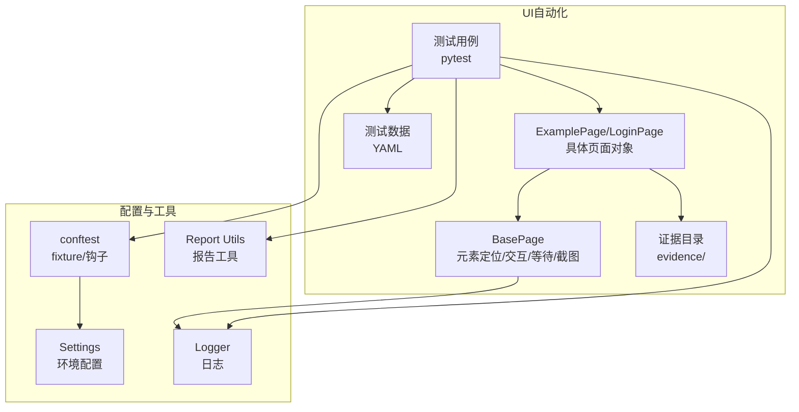
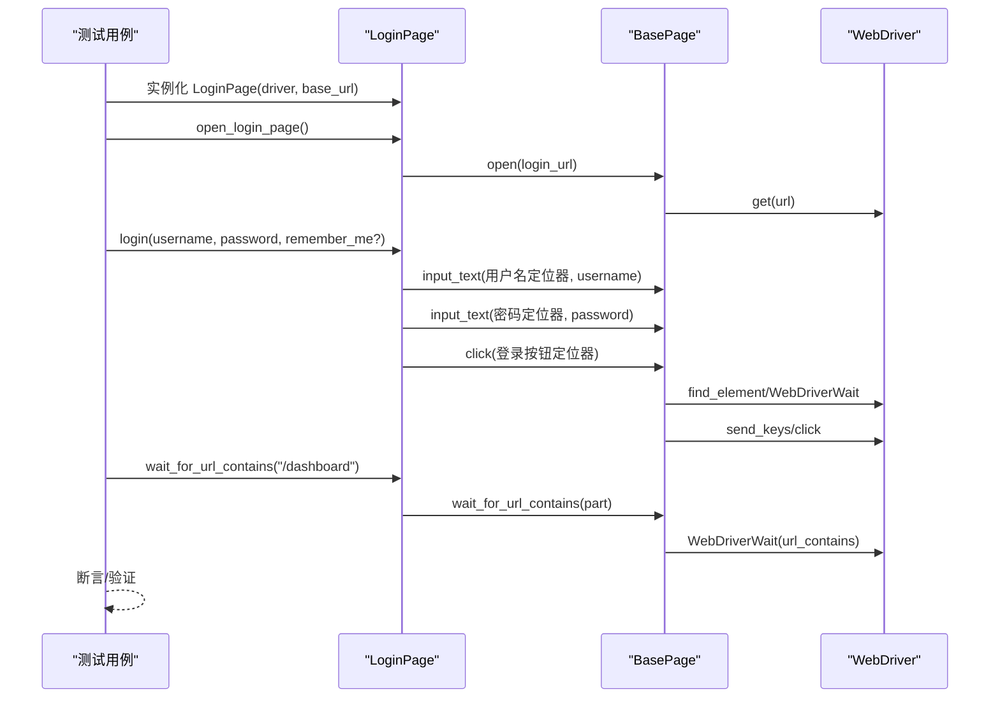
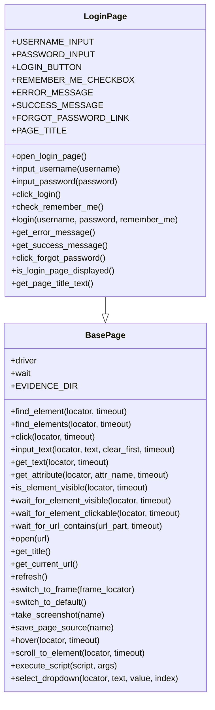
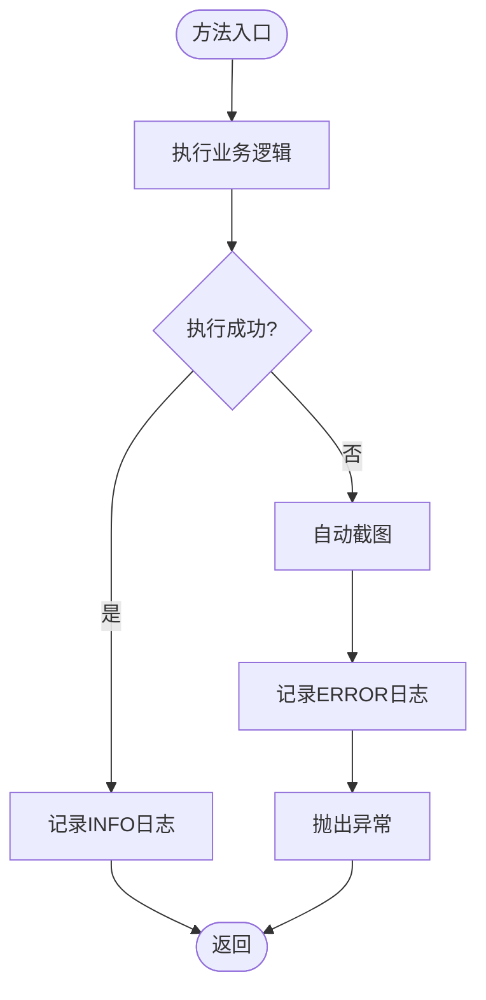
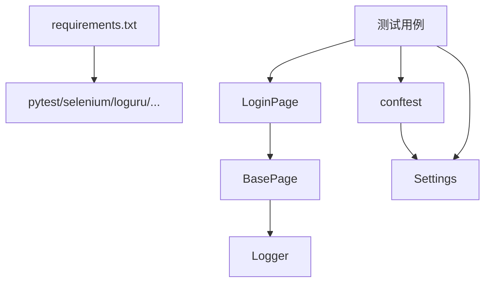

# UI自动化API

<cite>
**本文引用的文件**
- [ui_automation/pages/base_page.py](file://ui_automation/pages/base_page.py)
- [ui_automation/pages/example_page.py](file://ui_automation/pages/example_page.py)
- [ui_automation/testcases/test_example.py](file://ui_automation/testcases/test_example.py)
- [common/logger.py](file://common/logger.py)
- [common/report_utils.py](file://common/report_utils.py)
- [config/settings.py](file://config/settings.py)
- [conftest.py](file://conftest.py)
- [ui_automation/testdata/login_data.yaml](file://ui_automation/testdata/login_data.yaml)
- [config/environments/test.yaml](file://config/environments/test.yaml)
- [config/environments/dev.yaml](file://config/environments/dev.yaml)
- [config/environments/prod.yaml](file://config/environments/prod.yaml)
- [requirements.txt](file://requirements.txt)
</cite>

## 目录
1. [简介](#简介)
2. [项目结构](#项目结构)
3. [核心组件](#核心组件)
4. [架构总览](#架构总览)
5. [详细组件分析](#详细组件分析)
6. [依赖分析](#依赖分析)
7. [性能考虑](#性能考虑)
8. [故障排查指南](#故障排查指南)
9. [结论](#结论)
10. [附录](#附录)

## 简介
本文件为UI自动化测试框架的API参考文档，聚焦于BasePage基类及其Page Object模式最佳实践。文档覆盖元素定位与交互、等待策略、页面导航、截图与证据收集、异常处理与日志记录，并提供继承与使用的示例路径，帮助读者快速掌握框架能力并构建稳定可靠的UI自动化测试体系。

## 项目结构
UI自动化相关模块集中在ui_automation目录，采用“页面对象+测试用例”的分层组织：
- pages：页面对象基类与具体页面对象
- testcases：基于pytest的测试用例
- testdata：测试数据（YAML）
- evidence：截图与页面源码证据目录（由框架自动创建）

图表来源
- [ui_automation/pages/base_page.py:24-499](file://ui_automation/pages/base_page.py#L24-L499)
- [ui_automation/pages/example_page.py:12-161](file://ui_automation/pages/example_page.py#L12-L161)
- [ui_automation/testcases/test_example.py:31-161](file://ui_automation/testcases/test_example.py#L31-L161)
- [conftest.py:25-122](file://conftest.py#L25-L122)
- [config/settings.py:13-104](file://config/settings.py#L13-L104)
- [common/logger.py:59-77](file://common/logger.py#L59-L77)
- [common/report_utils.py:13-143](file://common/report_utils.py#L13-L143)

章节来源
- [ui_automation/pages/base_page.py:1-499](file://ui_automation/pages/base_page.py#L1-L499)
- [ui_automation/pages/example_page.py:1-161](file://ui_automation/pages/example_page.py#L1-L161)
- [ui_automation/testcases/test_example.py:1-161](file://ui_automation/testcases/test_example.py#L1-L161)
- [conftest.py:1-122](file://conftest.py#L1-L122)
- [config/settings.py:1-104](file://config/settings.py#L1-L104)
- [common/logger.py:1-77](file://common/logger.py#L1-L77)
- [common/report_utils.py:1-143](file://common/report_utils.py#L1-L143)

## 核心组件
- BasePage：封装Selenium常用操作，提供元素定位、交互、等待、页面导航、截图与证据收集、高级操作（悬停、滚动、JS执行、下拉选择）等能力。
- LoginPage（示例）：继承BasePage，封装登录页面的元素定位与业务流程方法，演示Page Object模式。
- pytest fixture与钩子：提供driver、base_url fixture，以及失败自动截图钩子。
- 配置系统：通过Settings读取不同环境配置，支持浏览器类型、隐式等待、页面加载超时等。
- 日志系统：统一日志输出与文件落盘，便于问题定位。
- 报告工具：提供时间戳、报告目录创建、HTML摘要生成与保存。

章节来源
- [ui_automation/pages/base_page.py:24-499](file://ui_automation/pages/base_page.py#L24-L499)
- [ui_automation/pages/example_page.py:12-161](file://ui_automation/pages/example_page.py#L12-L161)
- [conftest.py:25-122](file://conftest.py#L25-L122)
- [config/settings.py:13-104](file://config/settings.py#L13-L104)
- [common/logger.py:59-77](file://common/logger.py#L59-L77)
- [common/report_utils.py:13-143](file://common/report_utils.py#L13-L143)

## 架构总览
下面以序列图展示一次典型登录流程的调用链，体现Page Object模式与BasePage的协作。

图表来源
- [ui_automation/pages/example_page.py:38-110](file://ui_automation/pages/example_page.py#L38-L110)
- [ui_automation/pages/base_page.py:280-294](file://ui_automation/pages/base_page.py#L280-L294)
- [ui_automation/pages/base_page.py:117-138](file://ui_automation/pages/base_page.py#L117-L138)
- [ui_automation/pages/base_page.py:93-115](file://ui_automation/pages/base_page.py#L93-L115)
- [ui_automation/pages/base_page.py:255-276](file://ui_automation/pages/base_page.py#L255-L276)

## 详细组件分析

### BasePage API参考
- 初始化与属性
  - 参数：driver（Selenium WebDriver实例）
  - 属性：driver、wait（WebDriverWait实例，默认超时10秒）、EVIDENCE_DIR（证据目录）
  - 证据目录确保在构造时创建

- 元素定位与交互
  - find_element(locator, timeout=10)
    - 功能：显式等待元素出现并返回WebElement
    - 异常：超时抛TimeoutException；同时自动截图并重新抛出
    - 返回：WebElement
  - find_elements(locator, timeout=10)
    - 功能：显式等待至少一个元素出现，返回元素列表；未找到返回[]
  - click(locator, timeout=10)
    - 功能：等待元素可点击后点击；异常时截图并抛出
  - input_text(locator, text, clear_first=True, timeout=10)
    - 功能：输入文本，可选清空；异常时截图并抛出
  - get_text(locator, timeout=10)
    - 功能：获取元素文本；异常时截图并抛出
  - get_attribute(locator, attr_name, timeout=10)
    - 功能：获取元素属性值；异常时截图并抛出
  - is_element_visible(locator, timeout=5)
    - 功能：判断元素是否可见；超时返回False

- 等待策略
  - wait_for_element_visible(locator, timeout=10)
    - 功能：等待元素可见；超时截图并抛出
  - wait_for_element_clickable(locator, timeout=10)
    - 功能：等待元素可点击；超时截图并抛出
  - wait_for_url_contains(url_part, timeout=10)
    - 功能：等待URL包含指定片段；超时截图并抛出

- 页面导航与操作
  - open(url)
    - 功能：打开页面；异常时截图并抛出
  - get_title()
    - 功能：获取页面标题
  - get_current_url()
    - 功能：获取当前URL
  - refresh()
    - 功能：刷新页面
  - switch_to_frame(frame_locator)
    - 功能：切换到iframe；支持定位器元组或索引/名称；异常时截图并抛出
  - switch_to_default()
    - 功能：切回默认内容

- 截图与证据
  - take_screenshot(name=None)
    - 功能：保存截图至evidence目录，文件名包含时间戳；异常时记录错误并返回空字符串
    - 返回：截图文件完整路径或空字符串
  - save_page_source(name=None)
    - 功能：保存页面源码至evidence目录；异常时记录错误并返回空字符串
    - 返回：页面源码文件完整路径或空字符串

- 高级操作
  - hover(locator, timeout=10)
    - 功能：鼠标悬停；异常时截图并抛出
  - scroll_to_element(locator, timeout=10)
    - 功能：滚动到元素；异常时截图并抛出
  - execute_script(script, *args)
    - 功能：执行JavaScript；异常时截图并抛出
    - 返回：脚本执行结果
  - select_dropdown(locator, text=None, value=None, index=None)
    - 功能：下拉框选择；text/value/index三选一；异常时截图并抛出

- 异常处理与日志
  - 所有公开方法均包含异常捕获与日志记录
  - 超时或异常时自动调用take_screenshot进行证据收集
  - 日志通过get_logger绑定模块名输出到控制台与文件

章节来源
- [ui_automation/pages/base_page.py:30-41](file://ui_automation/pages/base_page.py#L30-L41)
- [ui_automation/pages/base_page.py:44-68](file://ui_automation/pages/base_page.py#L44-L68)
- [ui_automation/pages/base_page.py:70-91](file://ui_automation/pages/base_page.py#L70-L91)
- [ui_automation/pages/base_page.py:93-115](file://ui_automation/pages/base_page.py#L93-L115)
- [ui_automation/pages/base_page.py:117-138](file://ui_automation/pages/base_page.py#L117-L138)
- [ui_automation/pages/base_page.py:140-160](file://ui_automation/pages/base_page.py#L140-L160)
- [ui_automation/pages/base_page.py:162-183](file://ui_automation/pages/base_page.py#L162-L183)
- [ui_automation/pages/base_page.py:185-205](file://ui_automation/pages/base_page.py#L185-L205)
- [ui_automation/pages/base_page.py:209-230](file://ui_automation/pages/base_page.py#L209-L230)
- [ui_automation/pages/base_page.py:232-253](file://ui_automation/pages/base_page.py#L232-L253)
- [ui_automation/pages/base_page.py:255-276](file://ui_automation/pages/base_page.py#L255-L276)
- [ui_automation/pages/base_page.py:280-294](file://ui_automation/pages/base_page.py#L280-L294)
- [ui_automation/pages/base_page.py:296-316](file://ui_automation/pages/base_page.py#L296-L316)
- [ui_automation/pages/base_page.py:318-322](file://ui_automation/pages/base_page.py#L318-L322)
- [ui_automation/pages/base_page.py:324-350](file://ui_automation/pages/base_page.py#L324-L350)
- [ui_automation/pages/base_page.py:354-377](file://ui_automation/pages/base_page.py#L354-L377)
- [ui_automation/pages/base_page.py:379-404](file://ui_automation/pages/base_page.py#L379-L404)
- [ui_automation/pages/base_page.py:408-424](file://ui_automation/pages/base_page.py#L408-L424)
- [ui_automation/pages/base_page.py:426-445](file://ui_automation/pages/base_page.py#L426-L445)
- [ui_automation/pages/base_page.py:447-466](file://ui_automation/pages/base_page.py#L447-L466)
- [ui_automation/pages/base_page.py:468-498](file://ui_automation/pages/base_page.py#L468-L498)

### LoginPage（示例页面对象）分析
- 继承BasePage，封装登录页面元素定位器（By.ID/CSS/LINK_TEXT等）
- 提供业务方法：open_login_page、input_username、input_password、click_login、check_remember_me、login、get_error_message、get_success_message、click_forgot_password、is_login_page_displayed、get_page_title_text
- 返回自身支持链式调用，提升可读性与可维护性
- 通过is_element_visible与get_text组合实现条件断言

图表来源
- [ui_automation/pages/base_page.py:24-499](file://ui_automation/pages/base_page.py#L24-L499)
- [ui_automation/pages/example_page.py:12-161](file://ui_automation/pages/example_page.py#L12-L161)

章节来源
- [ui_automation/pages/example_page.py:12-161](file://ui_automation/pages/example_page.py#L12-L161)

### Page Object模式最佳实践
- 将页面元素定位器集中定义为类常量，便于维护与复用
- 将业务流程封装为方法，返回自身以支持链式调用
- 在页面对象内部使用BasePage提供的等待与断言方法，避免在测试用例中直接处理等待细节
- 使用is_element_visible与get_text组合实现条件断言，减少对URL的强依赖
- 对动态元素使用显式等待（如wait_for_element_visible、wait_for_element_clickable），必要时结合自定义EC

章节来源
- [ui_automation/pages/example_page.py:20-36](file://ui_automation/pages/example_page.py#L20-L36)
- [ui_automation/pages/example_page.py:92-110](file://ui_automation/pages/example_page.py#L92-L110)
- [ui_automation/pages/base_page.py:209-230](file://ui_automation/pages/base_page.py#L209-L230)
- [ui_automation/pages/base_page.py:232-253](file://ui_automation/pages/base_page.py#L232-L253)

### 元素定位策略与等待策略
- 定位器格式：(By.XXX, "value")，支持By.ID、By.CLASS_NAME、By.CSS_SELECTOR、By.XPATH、By.LINK_TEXT等
- 等待策略：
  - 显式等待：find_element/find_elements、wait_for_element_visible、wait_for_element_clickable、wait_for_url_contains
  - 隐式等待：由conftest中的driver fixture设置（来自配置）
  - URL等待：wait_for_url_contains适合验证页面跳转
- 动态元素处理建议：
  - 优先使用显式等待EC.element_to_be_clickable或visibility_of_element_located
  - 对下拉框使用select_dropdown，支持按文本、value或索引选择
  - 对iframe场景使用switch_to_frame与switch_to_default

章节来源
- [ui_automation/pages/base_page.py:44-68](file://ui_automation/pages/base_page.py#L44-L68)
- [ui_automation/pages/base_page.py:70-91](file://ui_automation/pages/base_page.py#L70-L91)
- [ui_automation/pages/base_page.py:209-230](file://ui_automation/pages/base_page.py#L209-L230)
- [ui_automation/pages/base_page.py:232-253](file://ui_automation/pages/base_page.py#L232-L253)
- [ui_automation/pages/base_page.py:255-276](file://ui_automation/pages/base_page.py#L255-L276)
- [conftest.py:57-61](file://conftest.py#L57-L61)
- [config/environments/test.yaml:25-31](file://config/environments/test.yaml#L25-L31)

### 页面间数据传递
- 通过构造函数传入base_url，形成页面URL拼接
- 通过方法返回自身实现链式调用，便于在页面间传递状态
- 通过等待与断言方法（如wait_for_url_contains）验证页面跳转后的状态

章节来源
- [ui_automation/pages/example_page.py:38-48](file://ui_automation/pages/example_page.py#L38-L48)
- [ui_automation/pages/example_page.py:52-56](file://ui_automation/pages/example_page.py#L52-L56)
- [ui_automation/pages/example_page.py:92-110](file://ui_automation/pages/example_page.py#L92-L110)
- [ui_automation/pages/base_page.py:255-276](file://ui_automation/pages/base_page.py#L255-L276)

### 异常处理、截图与证据收集
- 所有公开方法在异常时自动截图并记录日志
- 截图文件保存在evidence目录，文件名包含时间戳
- 失败自动截图钩子在测试失败时保存截图
- 页面源码也可保存为证据文件

图表来源
- [ui_automation/pages/base_page.py:58-68](file://ui_automation/pages/base_page.py#L58-L68)
- [ui_automation/pages/base_page.py:101-115](file://ui_automation/pages/base_page.py#L101-L115)
- [ui_automation/pages/base_page.py:371-377](file://ui_automation/pages/base_page.py#L371-L377)
- [conftest.py:92-110](file://conftest.py#L92-L110)

章节来源
- [ui_automation/pages/base_page.py:58-68](file://ui_automation/pages/base_page.py#L58-L68)
- [ui_automation/pages/base_page.py:101-115](file://ui_automation/pages/base_page.py#L101-L115)
- [ui_automation/pages/base_page.py:371-377](file://ui_automation/pages/base_page.py#L371-L377)
- [conftest.py:92-110](file://conftest.py#L92-L110)

### 使用示例（路径指引）
- 继承BasePage创建自定义页面对象
  - 参考：[ui_automation/pages/example_page.py:12-161](file://ui_automation/pages/example_page.py#L12-L161)
- 在测试中使用页面对象
  - 参考：[ui_automation/testcases/test_example.py:31-161](file://ui_automation/testcases/test_example.py#L31-L161)
- 使用测试数据
  - 参考：[ui_automation/testdata/login_data.yaml:1-19](file://ui_automation/testdata/login_data.yaml#L1-L19)
- 配置环境与浏览器
  - 参考：[config/settings.py:13-104](file://config/settings.py#L13-L104)，[config/environments/test.yaml:25-31](file://config/environments/test.yaml#L25-L31)
- 失败自动截图与fixture
  - 参考：[conftest.py:25-122](file://conftest.py#L25-L122)

章节来源
- [ui_automation/pages/example_page.py:12-161](file://ui_automation/pages/example_page.py#L12-L161)
- [ui_automation/testcases/test_example.py:31-161](file://ui_automation/testcases/test_example.py#L31-L161)
- [ui_automation/testdata/login_data.yaml:1-19](file://ui_automation/testdata/login_data.yaml#L1-L19)
- [config/settings.py:13-104](file://config/settings.py#L13-L104)
- [config/environments/test.yaml:25-31](file://config/environments/test.yaml#L25-L31)
- [conftest.py:25-122](file://conftest.py#L25-L122)

## 依赖分析
- 外部依赖
  - pytest、pytest-html、pytest-xdist：测试框架与插件
  - selenium：Web UI自动化
  - requests：接口测试（非UI）
  - PyYAML、openpyxl：数据处理
  - loguru：日志
  - allure-pytest：报告（可选）
- 内部依赖
  - BasePage依赖common/logger进行日志记录
  - LoginPage依赖BasePage
  - 测试用例依赖LoginPage、conftest、config/settings
  - conftest依赖config/settings与common/logger

图表来源
- [requirements.txt:1-21](file://requirements.txt#L1-L21)
- [ui_automation/pages/base_page.py:16-21](file://ui_automation/pages/base_page.py#L16-L21)
- [ui_automation/pages/example_page.py:5-9](file://ui_automation/pages/example_page.py#L5-L9)
- [ui_automation/testcases/test_example.py:14-16](file://ui_automation/testcases/test_example.py#L14-L16)
- [conftest.py:19-22](file://conftest.py#L19-L22)
- [config/settings.py](file://config/settings.py#L103)

章节来源
- [requirements.txt:1-21](file://requirements.txt#L1-L21)
- [ui_automation/pages/base_page.py:16-21](file://ui_automation/pages/base_page.py#L16-L21)
- [ui_automation/pages/example_page.py:5-9](file://ui_automation/pages/example_page.py#L5-L9)
- [ui_automation/testcases/test_example.py:14-16](file://ui_automation/testcases/test_example.py#L14-L16)
- [conftest.py:19-22](file://conftest.py#L19-L22)
- [config/settings.py](file://config/settings.py#L103)

## 性能考虑
- 合理设置隐式等待与显式等待：隐式等待由driver设置，显式等待针对特定元素或URL
- 避免过度使用sleep，优先使用WebDriverWait与EC
- 对高频操作（如输入、点击）尽量合并步骤，减少页面往返
- 截图与页面源码保存仅在异常或需要时触发，避免频繁I/O

## 故障排查指南
- 元素定位失败
  - 检查定位器是否正确；优先使用By.ID或By.CSS_SELECTOR
  - 使用is_element_visible进行可见性校验
  - 参考：[ui_automation/pages/base_page.py:185-205](file://ui_automation/pages/base_page.py#L185-L205)
- 等待超时
  - 调整timeout参数；确认网络与页面加载情况
  - 使用wait_for_url_contains验证页面跳转
  - 参考：[ui_automation/pages/base_page.py:255-276](file://ui_automation/pages/base_page.py#L255-L276)
- iframe切换失败
  - 确认frame_locator类型（定位器元组/索引/名称）
  - 使用switch_to_default切回默认内容
  - 参考：[ui_automation/pages/base_page.py:324-350](file://ui_automation/pages/base_page.py#L324-L350)
- 截图与证据
  - 检查evidence目录权限与磁盘空间
  - 参考：[ui_automation/pages/base_page.py:354-377](file://ui_automation/pages/base_page.py#L354-L377)
- 日志定位
  - 查看控制台与logs目录日志文件，定位异常模块
  - 参考：[common/logger.py:59-77](file://common/logger.py#L59-L77)
- 失败自动截图
  - 确认pytest钩子已注册；检查evidence目录
  - 参考：[conftest.py:80-110](file://conftest.py#L80-L110)

章节来源
- [ui_automation/pages/base_page.py:185-205](file://ui_automation/pages/base_page.py#L185-L205)
- [ui_automation/pages/base_page.py:255-276](file://ui_automation/pages/base_page.py#L255-L276)
- [ui_automation/pages/base_page.py:324-350](file://ui_automation/pages/base_page.py#L324-L350)
- [ui_automation/pages/base_page.py:354-377](file://ui_automation/pages/base_page.py#L354-L377)
- [common/logger.py:59-77](file://common/logger.py#L59-L77)
- [conftest.py:80-110](file://conftest.py#L80-L110)

## 结论
本框架通过BasePage统一抽象Selenium常用操作，结合Page Object模式实现高内聚低耦合的页面封装；配合显式等待、失败自动截图与统一日志，显著提升了稳定性与可维护性。建议在实际项目中：
- 将定位器集中管理，命名清晰
- 使用显式等待与条件断言
- 通过环境配置灵活切换测试目标
- 在异常时充分利用截图与页面源码证据

## 附录
- 环境配置示例
  - 测试环境：[config/environments/test.yaml:1-31](file://config/environments/test.yaml#L1-L31)
  - 开发环境：[config/environments/dev.yaml:1-31](file://config/environments/dev.yaml#L1-L31)
  - 生产环境：[config/environments/prod.yaml:1-31](file://config/environments/prod.yaml#L1-L31)
- 测试数据示例
  - 登录数据：[ui_automation/testdata/login_data.yaml:1-19](file://ui_automation/testdata/login_data.yaml#L1-L19)
- 报告工具
  - 时间戳与HTML报告：[common/report_utils.py:13-143](file://common/report_utils.py#L13-L143)