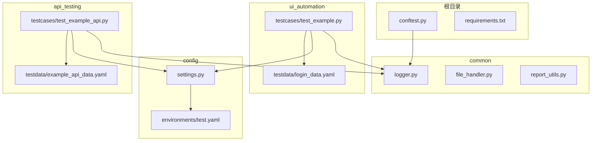
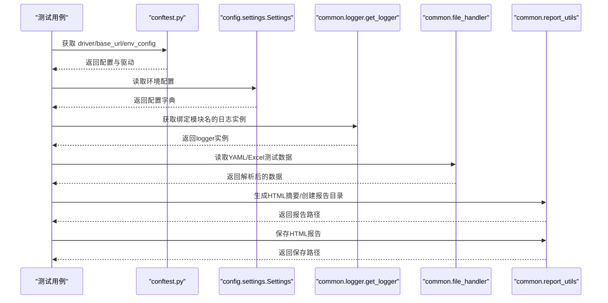
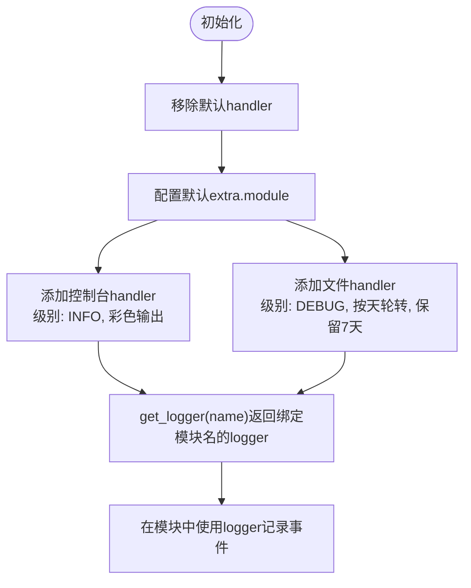
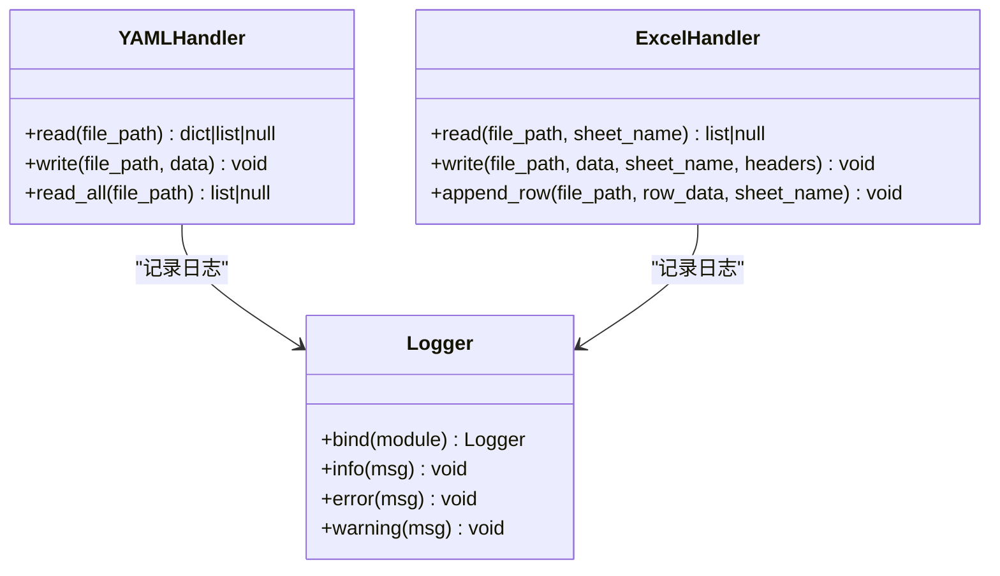
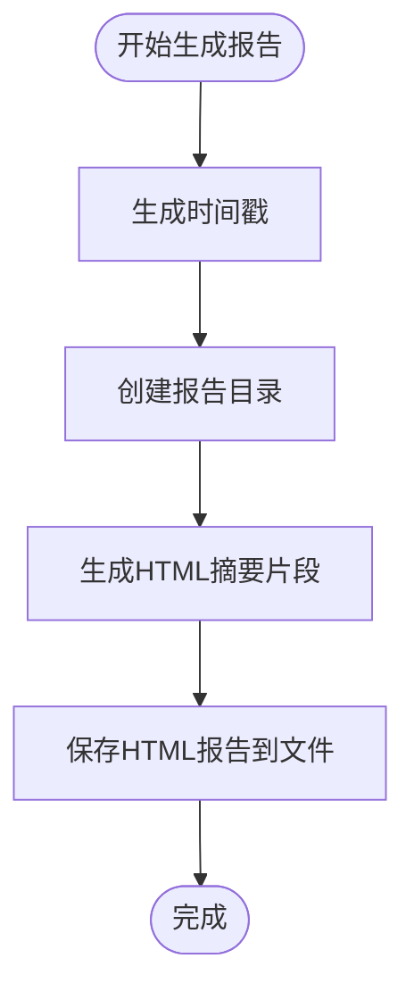
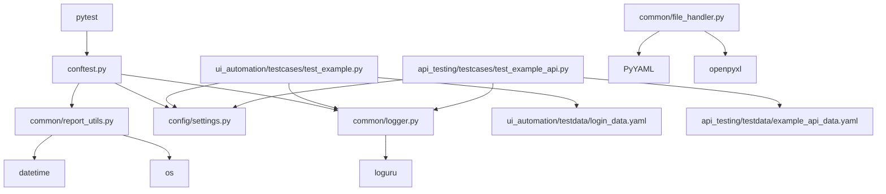

# 工具类API

<cite>
**本文引用的文件**
- [common/logger.py](file://common/logger.py)
- [common/file_handler.py](file://common/file_handler.py)
- [common/report_utils.py](file://common/report_utils.py)
- [config/settings.py](file://config/settings.py)
- [config/environments/test.yaml](file://config/environments/test.yaml)
- [ui_automation/testdata/login_data.yaml](file://ui_automation/testdata/login_data.yaml)
- [api_testing/testdata/example_api_data.yaml](file://api_testing/testdata/example_api_data.yaml)
- [conftest.py](file://conftest.py)
- [ui_automation/testcases/test_example.py](file://ui_automation/testcases/test_example.py)
- [api_testing/testcases/test_example_api.py](file://api_testing/testcases/test_example_api.py)
- [requirements.txt](file://requirements.txt)
</cite>

## 目录
1. [简介](#简介)
2. [项目结构](#项目结构)
3. [核心组件](#核心组件)
4. [架构总览](#架构总览)
5. [详细组件分析](#详细组件分析)
6. [依赖分析](#依赖分析)
7. [性能考虑](#性能考虑)
8. [故障排查指南](#故障排查指南)
9. [结论](#结论)
10. [附录](#附录)

## 简介
本文件为通用工具模块的API参考文档，聚焦以下三个工具类：
- Logger日志系统：统一配置控制台与文件输出、模块绑定、格式化与轮转策略。
- FileHandler文件处理工具：提供YAML与Excel文件的读写、追加、多文档读取等能力，并内置日志记录。
- ReportUtils报告生成工具：提供时间戳生成、报告目录创建、HTML摘要片段生成与落盘保存。

文档同时给出在测试框架中的集成方式、最佳实践与常见问题解决方案，帮助开发者快速上手并在项目中稳定使用。

## 项目结构
工具类位于common目录下，分别承担日志、文件处理与报告生成职责。配置与测试数据位于config与各模块的testdata目录，测试用例展示了工具类在UI与接口测试中的典型使用方式。

图表来源
- [common/logger.py](file://common/logger.py)
- [common/file_handler.py](file://common/file_handler.py)
- [common/report_utils.py](file://common/report_utils.py)
- [config/settings.py](file://config/settings.py)
- [config/environments/test.yaml](file://config/environments/test.yaml)
- [ui_automation/testdata/login_data.yaml](file://ui_automation/testdata/login_data.yaml)
- [ui_automation/testcases/test_example.py](file://ui_automation/testcases/test_example.py)
- [api_testing/testdata/example_api_data.yaml](file://api_testing/testdata/example_api_data.yaml)
- [api_testing/testcases/test_example_api.py](file://api_testing/testcases/test_example_api.py)
- [conftest.py](file://conftest.py)
- [requirements.txt](file://requirements.txt)

章节来源
- [README.md](file://README.md)
- [requirements.txt](file://requirements.txt)

## 核心组件
- Logger日志系统
  - 统一控制台与文件输出，控制台输出级别为INFO及以上，文件输出级别为DEBUG及以上。
  - 文件按天轮转，保留7天；日志格式包含时间、级别、模块名与消息。
  - 提供get_logger(name)获取绑定模块名的日志实例。
- FileHandler文件处理工具
  - YAMLHandler：支持单文档读取、多文档读取、安全写入。
  - ExcelHandler：支持只读读取（首行作为表头）、写入（自动推断表头）、追加一行。
  - 所有操作均记录日志，便于问题定位。
- ReportUtils报告生成工具
  - 时间戳生成与可读时间戳生成。
  - 报告目录创建（默认在项目根reports目录下，带时间戳前缀）。
  - HTML摘要片段生成（含通过/失败/跳过计数与通过率）与落盘保存。

章节来源
- [common/logger.py](file://common/logger.py)
- [common/file_handler.py](file://common/file_handler.py)
- [common/report_utils.py](file://common/report_utils.py)

## 架构总览
工具类在测试框架中的典型交互流程如下：测试用例通过conftest.py提供的fixture获取环境配置与浏览器驱动，随后使用Logger记录关键事件，使用FileHandler读取测试数据，使用ReportUtils生成报告摘要并保存。

图表来源
- [conftest.py](file://conftest.py)
- [config/settings.py](file://config/settings.py)
- [common/logger.py](file://common/logger.py)
- [common/file_handler.py](file://common/file_handler.py)
- [common/report_utils.py](file://common/report_utils.py)
- [ui_automation/testcases/test_example.py](file://ui_automation/testcases/test_example.py)
- [api_testing/testcases/test_example_api.py](file://api_testing/testcases/test_example_api.py)

## 详细组件分析

### Logger日志系统
- 配置要点
  - 控制台输出：INFO及以上，彩色输出，格式包含时间、级别、模块名与消息。
  - 文件输出：DEBUG及以上，按天轮转，保留7天，编码为UTF-8，格式不含颜色标签。
  - 模块绑定：通过configure设置默认extra.module，get_logger(name)返回绑定模块名的logger实例。
- 使用方式
  - 在任意模块导入get_logger并传入模块名，即可获得带模块名的日志实例。
  - 常见日志级别：trace/debug/info/warning/error/critical。
- 最佳实践
  - 在测试用例、页面对象、客户端等模块中统一使用get_logger绑定模块名，便于日志聚合与定位。
  - 避免在生产环境开启过多DEBUG日志，以免影响性能。
- 常见问题
  - 未绑定模块名导致日志中模块名为空：确保通过get_logger(name)获取实例。
  - 日志重复输出：模块内不要自行添加handler，统一由logger.py集中配置。

图表来源
- [common/logger.py](file://common/logger.py)

章节来源
- [common/logger.py](file://common/logger.py)

### FileHandler文件处理工具
- YAMLHandler
  - read(file_path)：读取单文档YAML，不存在或解析异常时返回None并记录错误。
  - write(file_path, data)：写入YAML，自动创建目录，异常时抛出并记录错误。
  - read_all(file_path)：读取多文档YAML（多个---分隔），返回文档列表。
- ExcelHandler
  - read(file_path, sheet_name=None)：只读读取，首行作为表头，返回字典列表；空文件返回空列表；异常返回None并记录错误。
  - write(file_path, data, sheet_name="Sheet1", headers=None)：写入Excel，自动推断表头或使用传入headers；异常时抛出并记录错误。
  - append_row(file_path, row_data, sheet_name=None)：向已有Excel追加一行，支持字典按表头顺序提取值；异常时抛出并记录错误。
- 使用建议
  - 读取前先检查文件是否存在，避免不必要的异常。
  - 写入前确保目标目录存在，write与append_row内部会尝试创建目录。
  - 多文档YAML读取适合批量场景，注意内存占用与异常处理。

图表来源
- [common/file_handler.py](file://common/file_handler.py)
- [common/logger.py](file://common/logger.py)

章节来源
- [common/file_handler.py](file://common/file_handler.py)

### ReportUtils报告生成工具
- 接口说明
  - get_timestamp(fmt="%Y%m%d_%H%M%S")：生成时间戳字符串，默认格式为YYYYmmdd_HHMMSS。
  - get_readable_timestamp()：生成可读格式时间戳，如“YYYY-MM-dd HH:MM:SS”。
  - create_report_dir(base_dir=None, prefix="report")：创建带时间戳的报告目录，默认在项目根reports目录下。
  - generate_html_summary(title, total, passed, failed, skipped=0)：生成HTML摘要片段，包含指标与通过率。
  - save_html_report(html_content, filepath)：保存HTML内容到文件，确保目录存在。
- 使用建议
  - 在测试结束时调用generate_html_summary生成摘要，再通过save_html_report保存到create_report_dir创建的目录中。
  - 可结合pytest钩子在测试失败时附加截图到Allure报告，提升问题定位效率。

图表来源
- [common/report_utils.py](file://common/report_utils.py)

章节来源
- [common/report_utils.py](file://common/report_utils.py)

## 依赖分析
- 工具类依赖
  - Logger依赖loguru，提供高性能日志记录与文件轮转。
  - FileHandler依赖PyYAML与openpyxl，用于YAML与Excel文件处理。
  - ReportUtils依赖标准库datetime与os，用于时间戳与目录创建。
- 测试框架集成
  - pytest用于组织测试，pytest-html与allure-pytest用于报告生成。
  - conftest.py提供driver、base_url、环境配置等fixture，并在失败时自动截图与附加Allure附件。
  - 测试用例通过settings读取环境配置，通过FileHandler读取测试数据，通过Logger记录事件，通过ReportUtils生成报告。

图表来源
- [requirements.txt](file://requirements.txt)
- [conftest.py](file://conftest.py)
- [common/logger.py](file://common/logger.py)
- [common/file_handler.py](file://common/file_handler.py)
- [common/report_utils.py](file://common/report_utils.py)
- [config/settings.py](file://config/settings.py)
- [ui_automation/testcases/test_example.py](file://ui_automation/testcases/test_example.py)
- [api_testing/testcases/test_example_api.py](file://api_testing/testcases/test_example_api.py)
- [ui_automation/testdata/login_data.yaml](file://ui_automation/testdata/login_data.yaml)
- [api_testing/testdata/example_api_data.yaml](file://api_testing/testdata/example_api_data.yaml)

章节来源
- [requirements.txt](file://requirements.txt)
- [conftest.py](file://conftest.py)

## 性能考虑
- 日志性能
  - 控制台输出级别为INFO及以上，文件输出DEBUG及以上，避免在高并发场景下产生过多DEBUG日志。
  - 文件按天轮转，保留7天，合理设置保留策略以平衡磁盘占用与历史审计需求。
- 文件处理性能
  - Excel只读读取时使用read_only=True，减少内存占用。
  - 大量写入时建议分批处理，避免一次性创建超大工作簿。
- 报告生成性能
  - HTML摘要生成为纯字符串拼接，开销极小；保存文件时确保目录存在，避免频繁IO错误重试。

## 故障排查指南
- 日志相关
  - 模块名为空：确认通过get_logger(name)获取实例，避免直接使用默认logger。
  - 日志重复：检查模块内是否自行添加handler，统一由logger.py集中配置。
  - 文件轮转无效：确认文件路径与权限，以及系统时间与时区设置。
- 文件处理相关
  - YAML读取失败：检查文件编码与格式，确保为UTF-8且符合YAML语法。
  - Excel读取为空：确认文件确实包含数据，或检查是否为只读模式导致的空表。
  - Excel写入异常：检查目标目录权限与磁盘空间，确保文件未被其他程序占用。
- 报告生成相关
  - 报告目录创建失败：确认项目根目录权限与路径拼接逻辑。
  - HTML保存失败：检查目标路径是否存在非法字符或权限不足。
- 测试框架相关
  - Allure附件未生成：确认已安装allure-pytest，且pytest_runtest_makereport钩子生效。
  - 测试失败截图未保存：检查driver实例与evidence目录权限。

章节来源
- [common/logger.py](file://common/logger.py)
- [common/file_handler.py](file://common/file_handler.py)
- [common/report_utils.py](file://common/report_utils.py)
- [conftest.py](file://conftest.py)

## 结论
本工具集提供了统一的日志、稳健的文件处理与简洁的报告生成能力，配合pytest生态可在UI与接口测试中高效落地。通过模块绑定日志、规范文件读写与报告落盘，能够显著提升测试过程的可观测性与可维护性。建议在团队内统一使用这些工具类，并在CI/CD中结合Allure与pytest-html生成持续集成报告。

## 附录

### 使用示例与最佳实践

- 在UI测试中使用Logger与FileHandler
  - 通过conftest.py提供的driver与base_url fixture获取浏览器与环境配置。
  - 使用get_logger绑定模块名记录关键步骤与断言结果。
  - 使用FileHandler读取ui_automation/testdata/login_data.yaml中的测试数据。
  - 参考路径：[ui_automation/testcases/test_example.py](file://ui_automation/testcases/test_example.py)

- 在接口测试中使用Logger与FileHandler
  - 使用get_logger记录请求与断言过程。
  - 使用FileHandler读取api_testing/testdata/example_api_data.yaml中的接口测试数据。
  - 参考路径：[api_testing/testcases/test_example_api.py](file://api_testing/testcases/test_example_api.py)

- 报告生成与Allure集成
  - 在测试结束时调用generate_html_summary生成摘要，并通过save_html_report保存到create_report_dir创建的目录。
  - 在pytest_runtest_makereport钩子中自动截图并附加到Allure报告。
  - 参考路径：[conftest.py](file://conftest.py)，[common/report_utils.py](file://common/report_utils.py)

- 环境配置与数据准备
  - 通过config/settings.py读取环境配置，如base_url、数据库与浏览器参数。
  - 测试数据位于各模块的testdata目录，遵循YAML结构以便FileHandler读取。
  - 参考路径：[config/settings.py](file://config/settings.py)，[config/environments/test.yaml](file://config/environments/test.yaml)，[ui_automation/testdata/login_data.yaml](file://ui_automation/testdata/login_data.yaml)，[api_testing/testdata/example_api_data.yaml](file://api_testing/testdata/example_api_data.yaml)