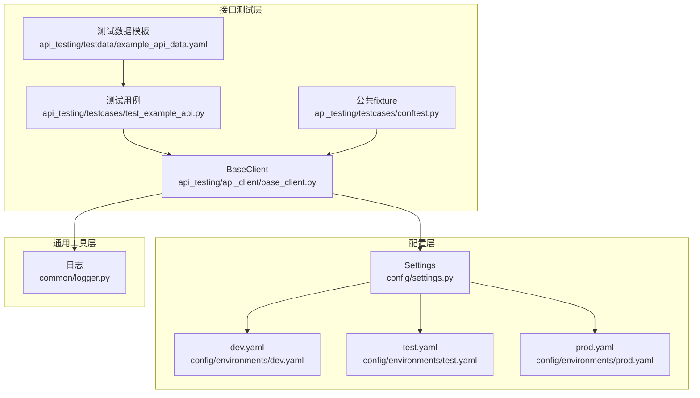
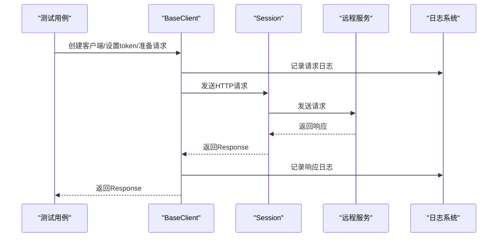
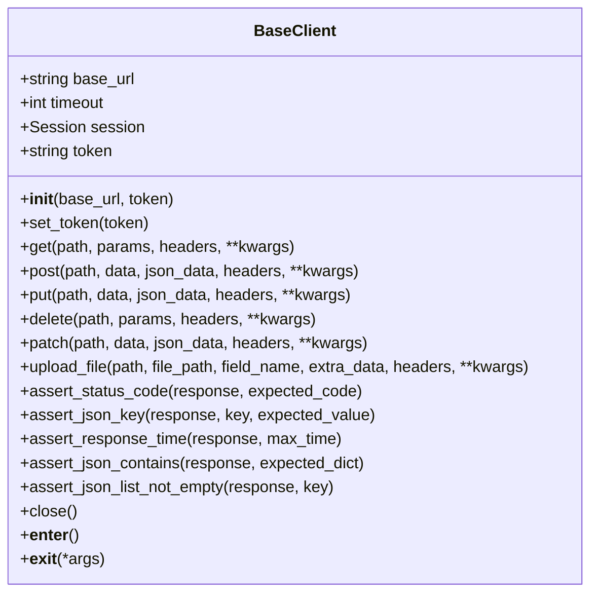
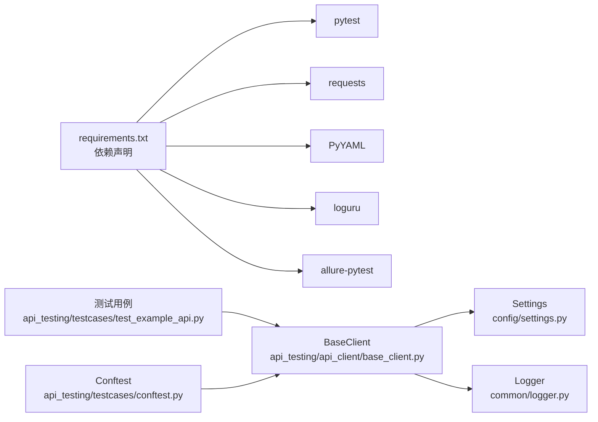

# 接口测试客户端API

<cite>
**本文引用的文件**
- [api_testing/api_client/base_client.py](file://api_testing/api_client/base_client.py)
- [api_testing/testcases/test_example_api.py](file://api_testing/testcases/test_example_api.py)
- [api_testing/testcases/conftest.py](file://api_testing/testcases/conftest.py)
- [config/settings.py](file://config/settings.py)
- [config/environments/dev.yaml](file://config/environments/dev.yaml)
- [config/environments/test.yaml](file://config/environments/test.yaml)
- [config/environments/prod.yaml](file://config/environments/prod.yaml)
- [common/logger.py](file://common/logger.py)
- [api_testing/testdata/example_api_data.yaml](file://api_testing/testdata/example_api_data.yaml)
- [requirements.txt](file://requirements.txt)
</cite>

## 目录
1. [简介](#简介)
2. [项目结构](#项目结构)
3. [核心组件](#核心组件)
4. [架构总览](#架构总览)
5. [详细组件分析](#详细组件分析)
6. [依赖分析](#依赖分析)
7. [性能考虑](#性能考虑)
8. [故障排查指南](#故障排查指南)
9. [结论](#结论)
10. [附录](#附录)

## 简介
本文件为接口测试客户端的API参考文档，聚焦于BaseClient基类的HTTP请求方法与断言能力，涵盖请求头处理、认证机制、请求体格式、响应解析、状态码处理、错误处理策略、重试机制配置建议、并发与批量请求实践、调试技巧与日志记录、性能优化建议等内容。文档面向不同技术背景的读者，既提供高层概览，也给出代码级定位路径以便深入查阅。

## 项目结构
该项目采用“功能+层次”混合组织方式：
- 接口测试层：api_testing/api_client（客户端基类）、api_testing/testcases（测试用例与公共fixture）、api_testing/testdata（测试数据模板）
- 配置层：config（环境配置与多环境YAML）
- 通用工具层：common（日志）
- 性能与报告：performance（压测脚本与报告）、requirements.txt（依赖）

图表来源
- [api_testing/api_client/base_client.py:1-308](file://api_testing/api_client/base_client.py#L1-L308)
- [api_testing/testcases/test_example_api.py:1-167](file://api_testing/testcases/test_example_api.py#L1-L167)
- [api_testing/testcases/conftest.py:1-80](file://api_testing/testcases/conftest.py#L1-L80)
- [config/settings.py:1-104](file://config/settings.py#L1-L104)
- [config/environments/dev.yaml:1-31](file://config/environments/dev.yaml#L1-L31)
- [config/environments/test.yaml:1-31](file://config/environments/test.yaml#L1-L31)
- [config/environments/prod.yaml:1-31](file://config/environments/prod.yaml#L1-L31)
- [common/logger.py:1-77](file://common/logger.py#L1-L77)
- [api_testing/testdata/example_api_data.yaml:1-116](file://api_testing/testdata/example_api_data.yaml#L1-L116)

章节来源
- [api_testing/api_client/base_client.py:1-308](file://api_testing/api_client/base_client.py#L1-L308)
- [config/settings.py:1-104](file://config/settings.py#L1-L104)

## 核心组件
- BaseClient：封装HTTP请求方法（GET/POST/PUT/DELETE/PATCH）、文件上传、请求/响应日志、断言工具、会话管理与认证（Bearer Token）。
- Settings：集中管理多环境配置（dev/test/prod），提供api基础URL、超时、账号等配置项。
- 日志系统：基于loguru统一输出，控制台INFO级别以上，文件DEBUG级别以上，按天轮转。
- 测试用例与Fixture：提供api_client与auth_client两个公共fixture，简化测试编写。

章节来源
- [api_testing/api_client/base_client.py:18-308](file://api_testing/api_client/base_client.py#L18-L308)
- [config/settings.py:13-104](file://config/settings.py#L13-L104)
- [common/logger.py:1-77](file://common/logger.py#L1-L77)
- [api_testing/testcases/conftest.py:16-80](file://api_testing/testcases/conftest.py#L16-L80)

## 架构总览
BaseClient通过Session复用连接，支持自定义Headers与默认JSON Content-Type；请求与响应均记录日志；断言方法提供常见校验场景；配置由Settings按环境注入，支持多环境切换。

图表来源
- [api_testing/api_client/base_client.py:91-134](file://api_testing/api_client/base_client.py#L91-L134)
- [common/logger.py:40-56](file://common/logger.py#L40-L56)

## 详细组件分析

### BaseClient 类
- 角色：封装HTTP请求、认证、日志、断言与资源管理。
- 关键职责：
  - 会话管理：使用requests.Session复用连接，减少握手开销。
  - 认证：支持Bearer Token，set_token自动更新Authorization头。
  - URL拼接：支持相对路径与绝对URL，自动去除多余斜杠。
  - 请求日志：记录方法、URL、查询参数、JSON/表单体、自定义头。
  - 响应日志：记录状态码、耗时、JSON或文本响应体（截断）。
  - 异常处理：捕获Timeout、ConnectionError、RequestException并记录错误日志。
  - 断言工具：状态码、JSON键存在、JSON键值、响应时间、JSON子集匹配、列表非空。
  - 资源管理：with上下文与close方法确保Session关闭。

图表来源
- [api_testing/api_client/base_client.py:18-308](file://api_testing/api_client/base_client.py#L18-L308)

章节来源
- [api_testing/api_client/base_client.py:21-44](file://api_testing/api_client/base_client.py#L21-L44)
- [api_testing/api_client/base_client.py:46-58](file://api_testing/api_client/base_client.py#L46-L58)
- [api_testing/api_client/base_client.py:60-90](file://api_testing/api_client/base_client.py#L60-L90)
- [api_testing/api_client/base_client.py:91-134](file://api_testing/api_client/base_client.py#L91-L134)
- [api_testing/api_client/base_client.py:135-186](file://api_testing/api_client/base_client.py#L135-L186)
- [api_testing/api_client/base_client.py:188-230](file://api_testing/api_client/base_client.py#L188-L230)
- [api_testing/api_client/base_client.py:233-295](file://api_testing/api_client/base_client.py#L233-L295)
- [api_testing/api_client/base_client.py:296-308](file://api_testing/api_client/base_client.py#L296-L308)

### HTTP请求方法与签名
- GET
  - 签名：get(path, params=None, headers=None, **kwargs)
  - 参数说明：path为接口路径；params为查询参数字典；headers为自定义请求头（覆盖默认）；kwargs透传给底层请求。
  - 使用示例：参见测试用例中的GET示例路径。
- POST
  - 签名：post(path, data=None, json_data=None, headers=None, **kwargs)
  - 参数说明：data为表单数据；json_data为JSON请求体；二者二选一或组合使用。
  - 使用示例：参见测试用例中的POST示例路径。
- PUT
  - 签名：put(path, data=None, json_data=None, headers=None, **kwargs)
  - 参数说明：与POST一致。
- DELETE
  - 签名：delete(path, params=None, headers=None, **kwargs)
  - 参数说明：params用于URL查询参数。
- PATCH
  - 签名：patch(path, data=None, json_data=None, headers=None, **kwargs)
  - 参数说明：与POST一致。
- 文件上传
  - 签名：upload_file(path, file_path, field_name="file", extra_data=None, headers=None, **kwargs)
  - 参数说明：支持multipart/form-data，自动移除Content-Type以让requests正确设置boundary；extra_data用于附加表单字段；headers可覆盖默认头。
  - 使用示例：参见测试用例中的上传流程思路。

章节来源
- [api_testing/api_client/base_client.py:135-186](file://api_testing/api_client/base_client.py#L135-L186)
- [api_testing/api_client/base_client.py:188-230](file://api_testing/api_client/base_client.py#L188-L230)
- [api_testing/testcases/test_example_api.py:50-97](file://api_testing/testcases/test_example_api.py#L50-L97)

### 请求头处理与认证机制
- 默认头：Content-Type为application/json，Accept为application/json。
- 自定义头：每次请求可传入headers，与session默认头合并（自定义优先）。
- 认证：set_token(token)自动添加Authorization: Bearer {token}。
- 环境配置：Settings从config/environments/{env}.yaml读取api.base_url与api.timeout等配置；可通过环境变量TEST_ENV切换环境。

章节来源
- [api_testing/api_client/base_client.py:32-44](file://api_testing/api_client/base_client.py#L32-L44)
- [api_testing/api_client/base_client.py:104-111](file://api_testing/api_client/base_client.py#L104-L111)
- [config/settings.py:26-48](file://config/settings.py#L26-L48)
- [config/environments/dev.yaml:20-23](file://config/environments/dev.yaml#L20-L23)
- [config/environments/test.yaml:20-23](file://config/environments/test.yaml#L20-L23)
- [config/environments/prod.yaml:20-23](file://config/environments/prod.yaml#L20-L23)

### 请求体格式与响应解析
- 请求体格式：
  - JSON：通过json_data参数自动序列化为JSON。
  - 表单：通过data参数提交application/x-www-form-urlencoded。
  - 文件：通过upload_file自动设置multipart/form-data。
- 响应解析：
  - 断言方法会尝试解析JSON；若失败则记录原始文本（截断）。
  - assert_json_key/assert_json_contains等断言方法均基于response.json()。

章节来源
- [api_testing/api_client/base_client.py:145-154](file://api_testing/api_client/base_client.py#L145-L154)
- [api_testing/api_client/base_client.py:156-165](file://api_testing/api_client/base_client.py#L156-L165)
- [api_testing/api_client/base_client.py:177-186](file://api_testing/api_client/base_client.py#L177-L186)
- [api_testing/api_client/base_client.py:205-214](file://api_testing/api_client/base_client.py#L205-L214)
- [api_testing/api_client/base_client.py:84-89](file://api_testing/api_client/base_client.py#L84-L89)

### 断言方法
- assert_status_code(response, expected_code=200)
- assert_json_key(response, key, expected_value=None)
- assert_response_time(response, max_time=5.0)
- assert_json_contains(response, expected_dict)
- assert_json_list_not_empty(response, key=None)

章节来源
- [api_testing/api_client/base_client.py:233-295](file://api_testing/api_client/base_client.py#L233-L295)

### 错误处理策略
- 超时：捕获Timeout异常并记录耗时与错误信息。
- 连接错误：捕获ConnectionError并记录。
- 其他请求异常：捕获RequestException并记录。
- 文件上传：捕获RequestException并记录失败原因，finally确保文件句柄关闭。

章节来源
- [api_testing/api_client/base_client.py:122-133](file://api_testing/api_client/base_client.py#L122-L133)
- [api_testing/api_client/base_client.py:223-226](file://api_testing/api_client/base_client.py#L223-L226)

### 重试机制配置
- 当前实现未内置重试逻辑。可在上层封装或使用第三方库（如tenacity）实现指数退避重试，并结合断言与日志定位问题。
- 建议：对幂等请求（GET/DELETE/PATCH）与网络抖动场景谨慎启用重试，避免重复副作用。

章节来源
- [api_testing/api_client/base_client.py:91-134](file://api_testing/api_client/base_client.py#L91-L134)

### 批量请求与并发处理
- 批量请求：可在测试用例中循环调用同一接口的不同参数，结合pytest参数化与测试数据模板。
- 并发处理：可使用pytest-xdist进行分布式并发执行；注意线程安全与共享资源（如日志文件）的并发写入。
- 建议：对高并发场景增加超时与重试策略，结合断言与日志快速定位失败点。

章节来源
- [requirements.txt:4](file://requirements.txt#L4)
- [api_testing/testdata/example_api_data.yaml:1-116](file://api_testing/testdata/example_api_data.yaml#L1-L116)

### 调试技巧与日志记录
- 日志级别：控制台INFO及以上，文件DEBUG及以上，按天轮转，保留7天。
- 日志内容：请求方法/URL/参数/头；响应状态码/耗时/响应体（JSON优先，失败时记录文本）。
- 调试建议：开启DEBUG日志，必要时临时降低日志级别；对复杂请求体使用断言逐步缩小范围。

章节来源
- [common/logger.py:40-56](file://common/logger.py#L40-L56)
- [api_testing/api_client/base_client.py:60-90](file://api_testing/api_client/base_client.py#L60-L90)

### API调用示例与最佳实践
- 继承BaseClient创建特定服务客户端：在子类中封装业务相关的路径、参数与断言，复用认证与日志能力。
- 处理不同数据格式：
  - JSON：使用json_data参数。
  - 表单：使用data参数。
  - 文件：使用upload_file。
- 使用测试数据模板：参考example_api_data.yaml的结构，将endpoint、method、params/request、expected组织为用例数据。
- 使用公共fixture：api_client与auth_client分别用于匿名与认证场景，自动关闭资源。

章节来源
- [api_testing/testcases/conftest.py:16-80](file://api_testing/testcases/conftest.py#L16-L80)
- [api_testing/testdata/example_api_data.yaml:7-116](file://api_testing/testdata/example_api_data.yaml#L7-L116)

## 依赖分析
- 外部依赖：pytest、requests、PyYAML、loguru、allure-pytest等。
- 内部依赖：BaseClient依赖Settings与Logger；测试用例依赖BaseClient与Settings；conftest提供公共fixture。

图表来源
- [requirements.txt:1-21](file://requirements.txt#L1-L21)
- [api_testing/api_client/base_client.py:12-13](file://api_testing/api_client/base_client.py#L12-L13)
- [config/settings.py:10-13](file://config/settings.py#L10-L13)
- [common/logger.py:12](file://common/logger.py#L12)
- [api_testing/testcases/test_example_api.py:14-15](file://api_testing/testcases/test_example_api.py#L14-L15)
- [api_testing/testcases/conftest.py:12-13](file://api_testing/testcases/conftest.py#L12-L13)

章节来源
- [requirements.txt:1-21](file://requirements.txt#L1-L21)
- [api_testing/api_client/base_client.py:12-13](file://api_testing/api_client/base_client.py#L12-L13)
- [config/settings.py:10-13](file://config/settings.py#L10-L13)
- [common/logger.py:12](file://common/logger.py#L12)
- [api_testing/testcases/test_example_api.py:14-15](file://api_testing/testcases/test_example_api.py#L14-L15)
- [api_testing/testcases/conftest.py:12-13](file://api_testing/testcases/conftest.py#L12-L13)

## 性能考虑
- 会话复用：使用Session减少TCP握手与TLS开销。
- 超时设置：默认从配置读取，建议根据接口特性调整。
- 日志级别：生产环境建议保持INFO级别，避免过多DEBUG日志影响性能。
- 并发执行：使用pytest-xdist进行分布式并发，注意资源竞争与日志落盘。
- 响应体大小：日志中对响应体有截断保护，避免过大JSON导致内存与IO压力。

章节来源
- [api_testing/api_client/base_client.py:28-29](file://api_testing/api_client/base_client.py#L28-L29)
- [api_testing/api_client/base_client.py:102](file://api_testing/api_client/base_client.py#L102)
- [common/logger.py:48-56](file://common/logger.py#L48-L56)

## 故障排查指南
- 网络异常
  - Timeout：检查网络连通性与服务端负载；适当增大超时或启用重试。
  - ConnectionError：检查DNS解析、代理、证书与防火墙。
- 认证失败
  - Token无效：确认set_token调用与Authorization头是否正确设置。
  - 权限不足：核对接口权限与角色。
- 请求体格式
  - JSON解析失败：确认Content-Type与请求体格式；使用断言逐步定位。
  - 表单/文件上传：确认boundary与字段名；检查文件是否存在与可读。
- 日志定位
  - 查看请求与响应日志，关注状态码、耗时与响应体片段。

章节来源
- [api_testing/api_client/base_client.py:122-133](file://api_testing/api_client/base_client.py#L122-L133)
- [api_testing/api_client/base_client.py:223-226](file://api_testing/api_client/base_client.py#L223-L226)
- [api_testing/api_client/base_client.py:198-199](file://api_testing/api_client/base_client.py#L198-L199)
- [common/logger.py:40-56](file://common/logger.py#L40-L56)

## 结论
BaseClient提供了简洁而强大的接口测试能力：统一的HTTP方法封装、完善的日志与断言工具、灵活的认证与配置体系。结合测试数据模板与公共fixture，可快速构建稳定、可维护的接口测试套件。对于高并发与复杂场景，建议在上层引入重试与并发控制策略，并持续优化日志与断言以提升可观测性。

## 附录
- 环境配置示例：dev/test/prod三套环境，分别定义base_url、api.timeout、token等。
- 测试数据模板：login_api、user_api、create_user_api等接口的用例结构。
- 依赖清单：pytest、requests、PyYAML、loguru、allure-pytest等。

章节来源
- [config/environments/dev.yaml:1-31](file://config/environments/dev.yaml#L1-L31)
- [config/environments/test.yaml:1-31](file://config/environments/test.yaml#L1-L31)
- [config/environments/prod.yaml:1-31](file://config/environments/prod.yaml#L1-L31)
- [api_testing/testdata/example_api_data.yaml:1-116](file://api_testing/testdata/example_api_data.yaml#L1-L116)
- [requirements.txt:1-21](file://requirements.txt#L1-L21)