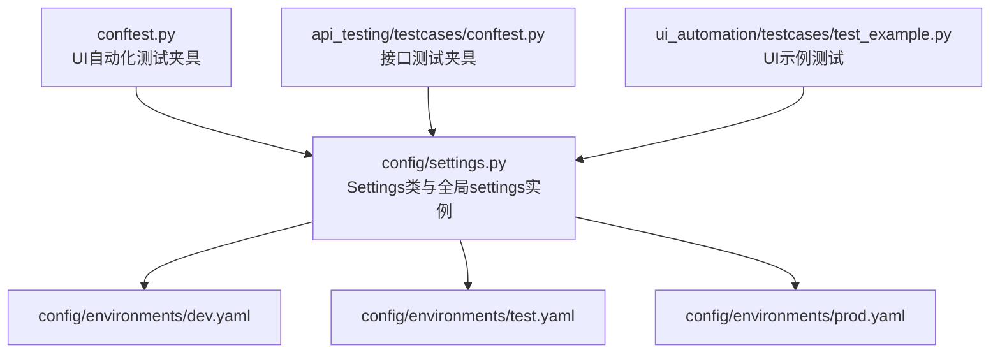
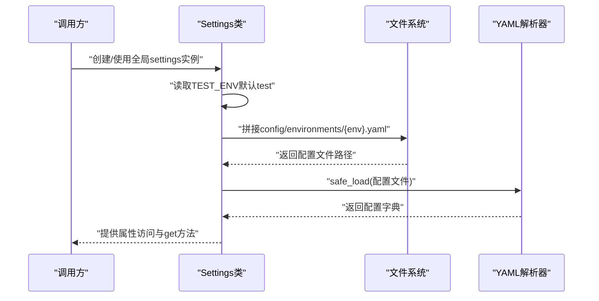
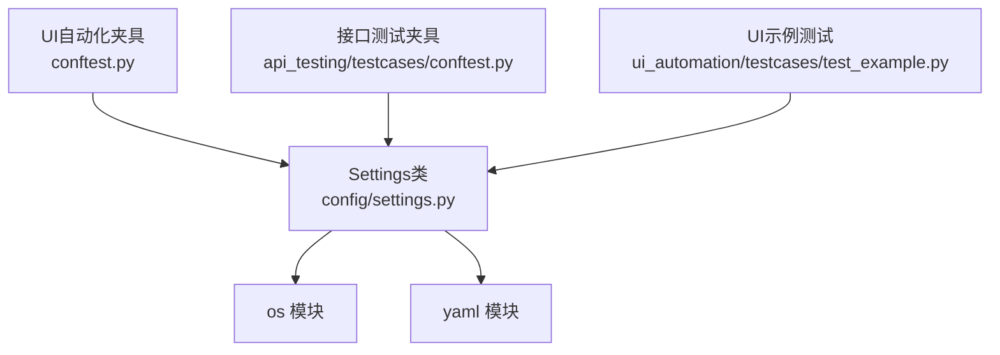

# 配置管理API

<cite>
**本文引用的文件**
- [config/settings.py](file://config/settings.py)
- [config/environments/dev.yaml](file://config/environments/dev.yaml)
- [config/environments/test.yaml](file://config/environments/test.yaml)
- [config/environments/prod.yaml](file://config/environments/prod.yaml)
- [conftest.py](file://conftest.py)
- [api_testing/testcases/conftest.py](file://api_testing/testcases/conftest.py)
- [ui_automation/testcases/test_example.py](file://ui_automation/testcases/test_example.py)
- [README.md](file://README.md)
- [requirements.txt](file://requirements.txt)
</cite>

## 目录
1. [简介](#简介)
2. [项目结构](#项目结构)
3. [核心组件](#核心组件)
4. [架构总览](#架构总览)
5. [详细组件分析](#详细组件分析)
6. [依赖分析](#依赖分析)
7. [性能考虑](#性能考虑)
8. [故障排查指南](#故障排查指南)
9. [结论](#结论)
10. [附录](#附录)

## 简介
本文件为配置管理模块的API参考文档，聚焦于Settings类的公共方法与属性，系统性说明环境变量TEST_ENV的作用机制、YAML配置文件格式规范、配置项的优先级与继承关系，并提供环境切换、配置获取、错误处理等使用示例与最佳实践。该模块位于config/settings.py，提供统一的全局配置入口，供UI自动化与接口测试等模块共享使用。

## 项目结构
配置管理模块位于config/settings.py，配套的多环境配置文件位于config/environments/目录下，分别提供dev、test、prod三套环境配置。全局配置对象settings由Settings类实例化，供其他模块直接导入使用。

图表来源
- [config/settings.py:1-104](file://config/settings.py#L1-L104)
- [config/environments/dev.yaml:1-31](file://config/environments/dev.yaml#L1-L31)
- [config/environments/test.yaml:1-31](file://config/environments/test.yaml#L1-L31)
- [config/environments/prod.yaml:1-31](file://config/environments/prod.yaml#L1-L31)
- [conftest.py:1-122](file://conftest.py#L1-L122)
- [api_testing/testcases/conftest.py:1-80](file://api_testing/testcases/conftest.py#L1-L80)
- [ui_automation/testcases/test_example.py:1-161](file://ui_automation/testcases/test_example.py#L1-L161)

章节来源
- [README.md:1-123](file://README.md#L1-L123)

## 核心组件
- Settings类：负责根据环境变量TEST_ENV加载对应YAML配置文件，提供属性访问器与通用get方法，以及字符串表示方法。
- 全局settings实例：直接导入即可使用，无需手动实例化。

章节来源
- [config/settings.py:13-104](file://config/settings.py#L13-L104)

## 架构总览
Settings类通过环境变量TEST_ENV确定要加载的配置文件，随后从config/environments/目录读取对应YAML文件并解析为字典。模块内其他组件通过导入settings获取配置，UI自动化与接口测试分别在各自的conftest中使用settings提供的配置项。

图表来源
- [config/settings.py:26-48](file://config/settings.py#L26-L48)

## 详细组件分析

### Settings类API参考
- 类名：Settings
- 作用：根据TEST_ENV加载YAML配置，提供属性访问与通用get方法
- 全局实例：settings

#### 构造函数
- 名称：__init__
- 参数：
  - env: str，可选；若未提供则从环境变量TEST_ENV读取，默认值为"test"
- 行为：
  - 设置env属性
  - 调用_load_config加载配置字典并赋值给内部私有属性_config

章节来源
- [config/settings.py:26-35](file://config/settings.py#L26-L35)

#### 配置加载方法
- 名称：_load_config
- 返回：dict
- 行为：
  - 解析config/environments/目录路径
  - 组合{env}.yaml文件路径
  - 若文件不存在，抛出FileNotFoundError
  - 使用yaml.safe_load读取并返回字典，若文件为空则返回{}

章节来源
- [config/settings.py:37-48](file://config/settings.py#L37-L48)

#### 属性访问器
- base_url: str
  - 从_config中获取base_url键，不存在时返回空字符串
- username: str
  - 从_config中获取username键，不存在时返回空字符串
- password: str
  - 从_config中获取password键，不存在时返回空字符串
- env_name: str
  - 从_config中获取env_name键，不存在时返回空字符串
- database: dict
  - 从_config中获取database键，不存在时返回空字典
- api: dict
  - 从_config中获取api键，不存在时返回空字典
- browser: dict
  - 从_config中获取browser键，不存在时返回空字典

章节来源
- [config/settings.py:50-83](file://config/settings.py#L50-L83)

#### 通用获取方法
- 名称：get
- 参数：
  - key: str，配置键名
  - default: 任意类型，键不存在时返回的默认值
- 返回：任意类型，对应键的值或default

章节来源
- [config/settings.py:85-96](file://config/settings.py#L85-L96)

#### 字符串表示
- 名称：__repr__
- 返回：<Settings env='...' base_url='...'>

章节来源
- [config/settings.py:98-99](file://config/settings.py#L98-L99)

### YAML配置文件格式规范
- 文件位置：config/environments/{env}.yaml
- 支持环境：dev、test、prod
- 结构字段（示例环境文件包含以下键）：
  - env_name: 环境显示名称（字符串）
  - base_url: 基础URL（字符串）
  - username: 用户名（字符串）
  - password: 密码（字符串）
  - database: 数据库配置（字典）
    - host: 主机（字符串）
    - port: 端口（整数）
    - name: 数据库名（字符串）
    - user: 用户（字符串）
    - password: 密码（字符串）
  - api: API配置（字典）
    - base_url: API基础URL（字符串）
    - timeout: 超时时间（整数）
    - token: 认证token（字符串）
  - browser: 浏览器配置（字典）
    - type: 浏览器类型（字符串，如chrome/firefox）
    - headless: 是否无头模式（布尔）
    - implicit_wait: 隐式等待时间（整数）
    - page_load_timeout: 页面加载超时时间（整数）

章节来源
- [config/environments/dev.yaml:1-31](file://config/environments/dev.yaml#L1-L31)
- [config/environments/test.yaml:1-31](file://config/environments/test.yaml#L1-L31)
- [config/environments/prod.yaml:1-31](file://config/environments/prod.yaml#L1-L31)

### 环境变量TEST_ENV的作用机制
- 作用：决定加载哪个环境的YAML配置文件
- 优先级：
  - 显式传参：Settings(env=...)优先于TEST_ENV
  - 环境变量：未显式传参时，读取TEST_ENV；若未设置则默认为"test"
- 加载流程：
  - Settings.__init__读取env
  - _load_config拼接config/environments/{env}.yaml
  - safe_load解析YAML为字典
  - 若文件不存在，抛出FileNotFoundError

章节来源
- [config/settings.py:26-48](file://config/settings.py#L26-L48)

### 配置项的优先级与继承关系
- 优先级顺序（从高到低）：
  1) 显式传参env
  2) 环境变量TEST_ENV
  3) 默认值"test"
- 继承关系：
  - 各环境配置文件相互独立，互不继承
  - 未在某环境文件中声明的键，在访问时返回默认值（字符串为空、字典为空）
- 默认值策略：
  - 字符串键：默认空字符串
  - 字典键：默认空字典

章节来源
- [config/settings.py:26-35](file://config/settings.py#L26-L35)
- [config/settings.py:50-96](file://config/settings.py#L50-L96)

### 使用示例

#### 环境切换
- 通过设置TEST_ENV选择环境（例如test、dev、prod），或在构造函数中显式传入env参数。
- 示例路径：
  - [conftest.py:112-121](file://conftest.py#L112-L121) 中展示了如何在pytest配置中注册自定义marker，间接体现配置驱动的测试分类能力
  - [api_testing/testcases/conftest.py:73-79](file://api_testing/testcases/conftest.py#L73-L79) 中通过settings.get("api", {}).get("base_url", "")获取API基础URL

章节来源
- [config/settings.py:26-35](file://config/settings.py#L26-L35)
- [api_testing/testcases/conftest.py:73-79](file://api_testing/testcases/conftest.py#L73-L79)

#### 配置获取
- 属性访问：settings.base_url、settings.username、settings.password、settings.env_name、settings.database、settings.api、settings.browser
- 通用获取：settings.get("key", default)
- 示例路径：
  - [conftest.py:36-77](file://conftest.py#L36-L77) 中通过settings.get("browser", {})获取浏览器配置
  - [api_testing/testcases/conftest.py:47-66](file://api_testing/testcases/conftest.py#L47-L66) 中从配置中读取api.token

章节来源
- [conftest.py:36-77](file://conftest.py#L36-L77)
- [api_testing/testcases/conftest.py:47-66](file://api_testing/testcases/conftest.py#L47-L66)

#### 错误处理
- 配置文件不存在：抛出FileNotFoundError，包含具体文件路径与环境名提示
- 配置键缺失：get方法返回default；属性访问器返回默认值（字符串为空、字典为空）
- 示例路径：
  - [config/settings.py:42-45](file://config/settings.py#L42-L45) 中的异常抛出
  - [config/settings.py:50-96](file://config/settings.py#L50-L96) 中的默认值策略

章节来源
- [config/settings.py:42-45](file://config/settings.py#L42-L45)
- [config/settings.py:50-96](file://config/settings.py#L50-L96)

#### UI自动化中的应用
- 在UI测试夹具中读取browser配置并初始化WebDriver，设置隐式等待与页面加载超时
- 示例路径：
  - [conftest.py:25-69](file://conftest.py#L25-L69) 中driver fixture的实现

章节来源
- [conftest.py:25-69](file://conftest.py#L25-L69)

#### 接口测试中的应用
- 在接口测试夹具中读取api配置（如base_url、token），并据此构建客户端
- 示例路径：
  - [api_testing/testcases/conftest.py:16-79](file://api_testing/testcases/conftest.py#L16-L79)

章节来源
- [api_testing/testcases/conftest.py:16-79](file://api_testing/testcases/conftest.py#L16-L79)

## 依赖分析
- 内部依赖：
  - Settings类依赖os与yaml标准库进行环境变量读取与YAML解析
- 外部依赖：
  - pytest：在conftest中作为测试框架使用
  - selenium：在UI自动化中用于WebDriver初始化
  - requests：在接口测试中用于HTTP请求
- 依赖关系图：

图表来源
- [config/settings.py:9-10](file://config/settings.py#L9-L10)
- [conftest.py:7-22](file://conftest.py#L7-L22)
- [api_testing/testcases/conftest.py:7-13](file://api_testing/testcases/conftest.py#L7-L13)
- [ui_automation/testcases/test_example.py:14-16](file://ui_automation/testcases/test_example.py#L14-L16)

章节来源
- [requirements.txt:1-21](file://requirements.txt#L1-L21)

## 性能考虑
- 配置加载时机：Settings在实例化时一次性加载并缓存配置字典，后续访问均为内存字典查找，时间复杂度为O(1)
- 文件I/O：仅在首次实例化时进行一次文件读取与YAML解析，避免重复I/O
- 建议：
  - 在进程生命周期内复用全局settings实例，避免频繁创建Settings实例
  - 对于高频访问的配置项，可在模块级别缓存其值，减少重复调用

## 故障排查指南
- 症状：FileNotFoundError，提示配置文件不存在
  - 原因：TEST_ENV或传入env不正确，或config/environments/目录下缺少对应文件
  - 处理：确认环境名与文件名一致，确保文件存在于config/environments/目录
  - 参考路径：[config/settings.py:42-45](file://config/settings.py#L42-L45)
- 症状：属性访问返回空字符串或空字典
  - 原因：配置文件中未定义该键
  - 处理：在对应环境文件中添加该键，或在调用处提供合理的默认值
  - 参考路径：[config/settings.py:50-96](file://config/settings.py#L50-L96)
- 症状：UI自动化浏览器初始化失败
  - 原因：browser配置不正确（type/headless等）
  - 处理：检查config/environments/{env}.yaml中的browser字段，确保type为chrome或firefox
  - 参考路径：[conftest.py:41-55](file://conftest.py#L41-L55)

章节来源
- [config/settings.py:42-45](file://config/settings.py#L42-L45)
- [config/settings.py:50-96](file://config/settings.py#L50-L96)
- [conftest.py:41-55](file://conftest.py#L41-L55)

## 结论
Settings类提供了简洁、稳定的配置管理能力，通过环境变量TEST_ENV实现多环境无缝切换，并以YAML文件形式组织配置，具备良好的可维护性与扩展性。结合全局settings实例，UI自动化与接口测试模块能够以统一的方式获取配置，降低耦合并提升一致性。

## 附录

### 配置文件结构与字段定义
- 环境文件通用字段
  - env_name: 环境显示名称（字符串）
  - base_url: 基础URL（字符串）
  - username: 用户名（字符串）
  - password: 密码（字符串）
  - database: 数据库配置（字典）
    - host: 主机（字符串）
    - port: 端口（整数）
    - name: 数据库名（字符串）
    - user: 用户（字符串）
    - password: 密码（字符串）
  - api: API配置（字典）
    - base_url: API基础URL（字符串）
    - timeout: 超时时间（整数）
    - token: 认证token（字符串）
  - browser: 浏览器配置（字典）
    - type: 浏览器类型（字符串）
    - headless: 是否无头模式（布尔）
    - implicit_wait: 隐式等待时间（整数）
    - page_load_timeout: 页面加载超时时间（整数）

章节来源
- [config/environments/dev.yaml:1-31](file://config/environments/dev.yaml#L1-L31)
- [config/environments/test.yaml:1-31](file://config/environments/test.yaml#L1-L31)
- [config/environments/prod.yaml:1-31](file://config/environments/prod.yaml#L1-L31)

### 使用清单
- 环境切换
  - 设置TEST_ENV或在构造函数中传入env
  - 参考路径：[config/settings.py:26-35](file://config/settings.py#L26-L35)
- 获取基础URL
  - 使用settings.base_url或settings.get("api", {}).get("base_url", "")
  - 参考路径：[conftest.py:73-77](file://conftest.py#L73-L77), [api_testing/testcases/conftest.py:73-79](file://api_testing/testcases/conftest.py#L73-L79)
- 获取浏览器配置
  - 使用settings.get("browser", {})
  - 参考路径：[conftest.py:36-77](file://conftest.py#L36-L77)
- 获取数据库/API配置
  - 使用settings.database与settings.api
  - 参考路径：[config/environments/dev.yaml:11-30](file://config/environments/dev.yaml#L11-L30), [config/environments/test.yaml:11-30](file://config/environments/test.yaml#L11-L30), [config/environments/prod.yaml:11-30](file://config/environments/prod.yaml#L11-L30)