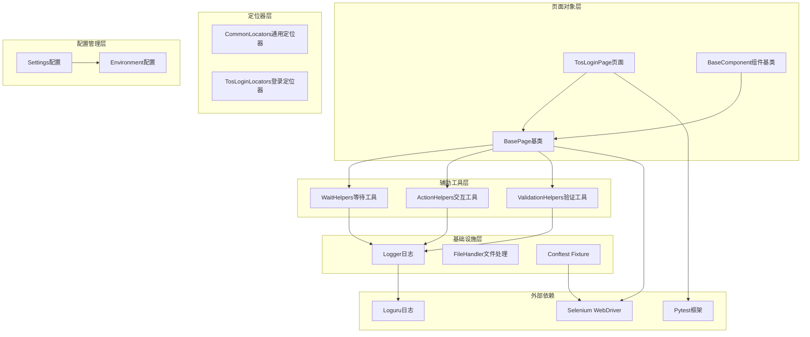
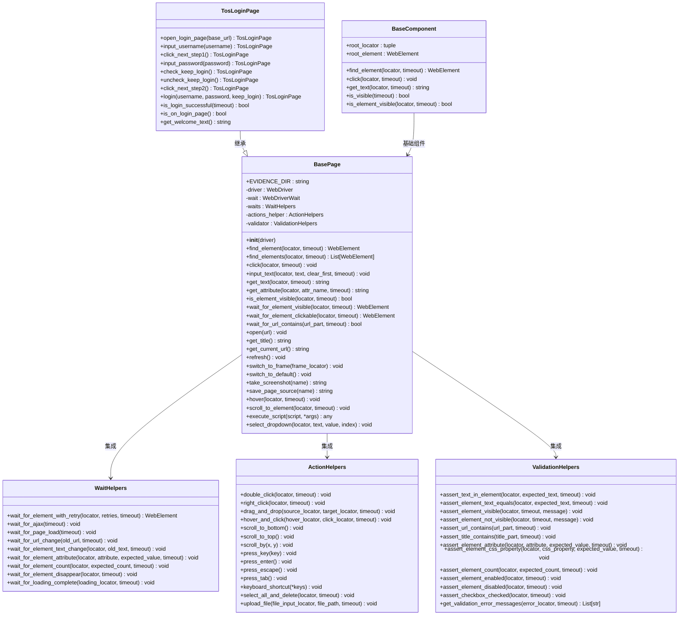
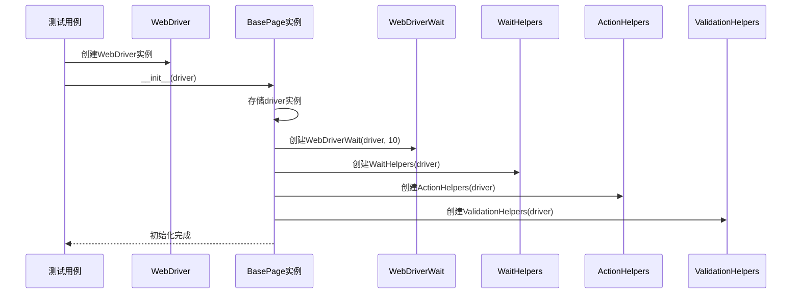
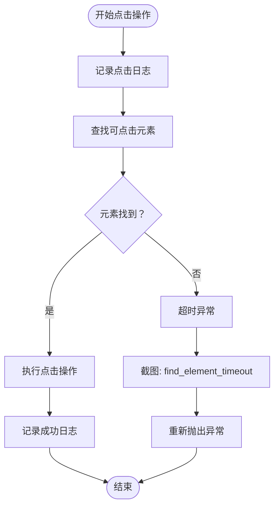
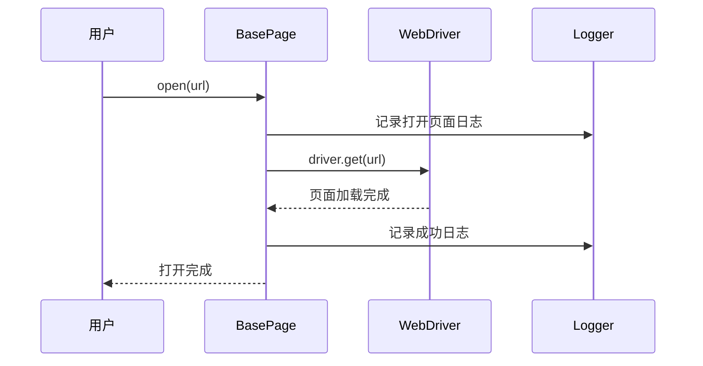
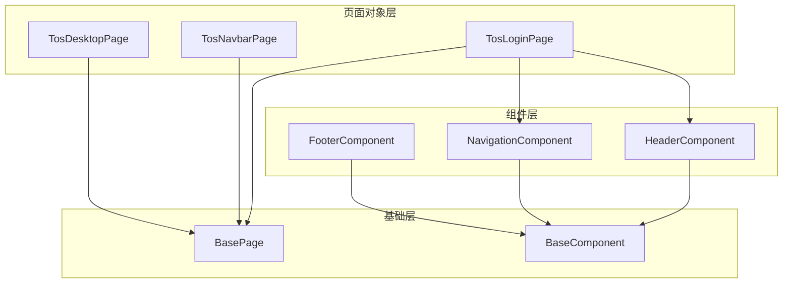
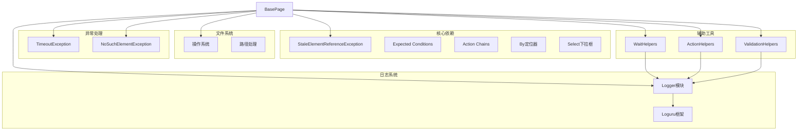

# BasePage基类实现

<cite>
**本文档引用的文件**
- [base_page.py](file://ui_automation/pages/base_page.py)
- [__init__.py](file://ui_automation/pages/__init__.py)
- [wait_helpers.py](file://ui_automation/pages/helpers/wait_helpers.py)
- [action_helpers.py](file://ui_automation/pages/helpers/action_helpers.py)
- [validation_helpers.py](file://ui_automation/pages/helpers/validation_helpers.py)
- [base_component.py](file://ui_automation/pages/components/base_component.py)
- [tos_login_page.py](file://ui_automation/pages/pages/tos_login_page.py)
- [logger.py](file://common/logger.py)
</cite>

## 更新摘要
**变更内容**
- 更新了页面对象结构的简化描述，反映BasePage集成了辅助工具类
- 新增了辅助工具模块的详细说明
- 更新了架构概览图，展示新的模块化设计
- 增强了等待机制和高级操作的说明
- 添加了组件化架构的介绍

## 目录
1. [简介](#简介)
2. [项目结构](#项目结构)
3. [核心组件](#核心组件)
4. [架构概览](#架构概览)
5. [详细组件分析](#详细组件分析)
6. [辅助工具模块](#辅助工具模块)
7. [组件化架构](#组件化架构)
8. [依赖关系分析](#依赖关系分析)
9. [性能考虑](#性能考虑)
10. [故障排除指南](#故障排除指南)
11. [结论](#结论)
12. [附录](#附录)

## 简介

BasePage基类是本项目UI自动化测试框架的核心组件，基于Selenium WebDriver实现了Page Object模式的页面对象基类。该基类经过重构后采用了更加模块化的架构设计，将核心功能与辅助工具分离，通过集成WaitHelpers、ActionHelpers和ValidationHelpers三个辅助工具类，提供了更加丰富和专业的Web自动化测试能力。

新版本的BasePage不仅保持了原有的元素操作、等待机制、页面导航等功能，还通过辅助工具模块提供了更强大的等待策略、高级交互和断言验证能力，为所有具体页面对象提供统一的操作接口和异常处理机制。

## 项目结构

项目采用分层架构设计，现在包含了更加清晰的模块化结构：

**图表来源**
- [base_page.py:36-56](file://ui_automation/pages/base_page.py#L36-L56)
- [__init__.py:26-45](file://ui_automation/pages/__init__.py#L26-L45)
- [wait_helpers.py:16-125](file://ui_automation/pages/helpers/wait_helpers.py#L16-L125)
- [action_helpers.py:17-124](file://ui_automation/pages/helpers/action_helpers.py#L17-L124)
- [validation_helpers.py:15-140](file://ui_automation/pages/helpers/validation_helpers.py#L15-L140)

**章节来源**
- [base_page.py:36-56](file://ui_automation/pages/base_page.py#L36-L56)
- [__init__.py:26-45](file://ui_automation/pages/__init__.py#L26-L45)

## 核心组件

BasePage基类经过重构后提供了更加专业和模块化的功能集合：

### 核心初始化模块
- **WebDriver实例管理**：接收并存储WebDriver实例
- **等待机制配置**：初始化WebDriverWait实例，设置默认超时时间为10秒
- **证据目录管理**：自动创建证据保存目录，确保截图和页面源码的存储
- **辅助工具集成**：集成WaitHelpers、ActionHelpers、ValidationHelpers三个专业工具类

### 元素操作模块
- **元素查找**：支持单个和多个元素的查找，带有显式等待机制
- **元素交互**：点击、输入文本、获取文本和属性值等基本操作
- **可见性判断**：判断元素是否可见的专用方法

### 等待机制模块
- **显式等待**：基于WebDriverWait的元素可见性和可点击性等待
- **URL等待**：等待URL包含特定内容的专用等待方法
- **自定义等待**：通过WaitHelpers提供的高级等待策略
- **超时处理**：统一的超时异常处理和截图记录

### 页面操作模块
- **页面导航**：打开页面、获取标题和当前URL
- **页面刷新**：页面刷新功能
- **iframe切换**：支持多种方式的iframe切换

### 高级操作模块
- **鼠标悬停**：ActionChains实现的鼠标悬停功能
- **页面滚动**：JavaScript实现的平滑滚动到元素
- **脚本执行**：JavaScript代码的执行和返回值处理
- **下拉框选择**：Select类的多种选择方式支持
- **高级交互**：通过ActionHelpers提供的复杂用户交互

### 验证断言模块
- **文本验证**：断言元素文本包含或等于指定内容
- **可见性验证**：断言元素可见或不可见
- **属性验证**：断言元素属性值
- **URL验证**：断言当前URL包含指定内容
- **CSS属性验证**：断言元素CSS属性值

**章节来源**
- [base_page.py:42-56](file://ui_automation/pages/base_page.py#L42-L56)

## 架构概览

BasePage基类采用增强的Page Object模式，通过模块化设计实现功能分离和职责专业化：

**图表来源**
- [base_page.py:36-515](file://ui_automation/pages/base_page.py#L36-L515)
- [wait_helpers.py:16-125](file://ui_automation/pages/helpers/wait_helpers.py#L16-L125)
- [action_helpers.py:17-124](file://ui_automation/pages/helpers/action_helpers.py#L17-L124)
- [validation_helpers.py:15-140](file://ui_automation/pages/helpers/validation_helpers.py#L15-L140)
- [base_component.py:18-85](file://ui_automation/pages/components/base_component.py#L18-L85)
- [tos_login_page.py:18-163](file://ui_automation/pages/pages/tos_login_page.py#L18-L163)

## 详细组件分析

### 构造函数与初始化

BasePage的构造函数现在集成了三个专业辅助工具类：

**图表来源**
- [base_page.py:42-56](file://ui_automation/pages/base_page.py#L42-L56)

**章节来源**
- [base_page.py:42-56](file://ui_automation/pages/base_page.py#L42-L56)

### 元素操作方法

#### find_element方法
查找单个元素并进行显式等待：

**方法签名**: `find_element(locator, timeout=10)`

**参数说明**:
- `locator`: 元素定位器，格式为 `(By.XXX, "value")`
- `timeout`: 超时时间（秒），默认10秒

**返回值**: `WebElement` - 找到的元素对象

**异常处理**: 
- `TimeoutException`: 超时未找到元素时抛出异常
- 自动截图：调用 `take_screenshot("find_element_timeout")`

**使用示例路径**: [base_page.py:60-84](file://ui_automation/pages/base_page.py#L60-L84)

#### click方法
点击元素的完整流程：

**图表来源**
- [base_page.py:109-131](file://ui_automation/pages/base_page.py#L109-L131)

**异常处理机制**:
- 超时异常：记录错误并截图
- 其他异常：记录异常详情并截图

**章节来源**
- [base_page.py:109-131](file://ui_automation/pages/base_page.py#L109-L131)

#### input_text方法
文本输入的完整流程：

**方法签名**: `input_text(locator, text, clear_first=True, timeout=10)`

**参数说明**:
- `locator`: 元素定位器
- `text`: 要输入的文本
- `clear_first`: 是否先清空输入框，默认True
- `timeout`: 超时时间，默认10秒

**处理流程**:
1. 记录输入日志
2. 调用 `find_element` 查找元素
3. 可选：清空输入框
4. 执行文本输入
5. 记录成功日志

**章节来源**
- [base_page.py:133-154](file://ui_automation/pages/base_page.py#L133-L154)

### 等待机制方法

#### wait_for_element_visible方法
等待元素可见：

**方法签名**: `wait_for_element_visible(locator, timeout=10)`

**返回值**: `WebElement` - 可见的元素对象

**等待条件**: `EC.visibility_of_element_located(locator)`

**异常处理**: 超时后截图并抛出异常

**章节来源**
- [base_page.py:225-246](file://ui_automation/pages/base_page.py#L225-L246)

#### wait_for_element_clickable方法
等待元素可点击：

**方法签名**: `wait_for_element_clickable(locator, timeout=10)`

**返回值**: `WebElement` - 可点击的元素对象

**等待条件**: `EC.element_to_be_clickable(locator)`

**异常处理**: 超时后截图并抛出异常

**章节来源**
- [base_page.py:248-269](file://ui_automation/pages/base_page.py#L248-L269)

### 页面操作方法

#### open方法
打开指定URL的完整流程：

**图表来源**
- [base_page.py:296-310](file://ui_automation/pages/base_page.py#L296-L310)

**异常处理**: 打开失败时记录错误并截图

**章节来源**
- [base_page.py:296-310](file://ui_automation/pages/base_page.py#L296-L310)

#### switch_to_frame方法
iframe切换的智能处理：

**方法签名**: `switch_to_frame(frame_locator)`

**参数说明**:
- `frame_locator`: iframe定位器，支持三种类型：
  - 元组形式：`(By.XXX, "value")` - 先查找元素再切换
  - 数字索引：直接按索引切换
  - 字符串名称：按名称切换

**章节来源**
- [base_page.py:340-366](file://ui_automation/pages/base_page.py#L340-L366)

### 高级操作方法

#### hover方法
鼠标悬停操作：

**方法签名**: `hover(locator, timeout=10)`

**实现原理**: 使用ActionChains的`move_to_element`方法

**异常处理**: 悬停失败时截图并抛出异常

**章节来源**
- [base_page.py:424-440](file://ui_automation/pages/base_page.py#L424-L440)

#### scroll_to_element方法
平滑滚动到元素位置：

**方法签名**: `scroll_to_element(locator, timeout=10)`

**实现原理**: 执行JavaScript代码 `element.scrollIntoView({behavior: 'smooth', block: 'center'})`

**异常处理**: 滚动失败时截图并抛出异常

**章节来源**
- [base_page.py:442-461](file://ui_automation/pages/base_page.py#L442-L461)

#### execute_script方法
JavaScript脚本执行：

**方法签名**: `execute_script(script, *args)`

**参数说明**:
- `script`: JavaScript代码字符串
- `*args`: 传递给脚本的参数

**返回值**: 脚本执行的返回值

**异常处理**: 执行失败时截图并抛出异常

**章节来源**
- [base_page.py:463-482](file://ui_automation/pages/base_page.py#L463-L482)

### 截图与证据收集

#### take_screenshot方法
截图功能的完整实现：

**方法签名**: `take_screenshot(name=None)`

**文件命名规则**:
- 默认格式：`screenshot_YYYYMMDD_HHMMSS_MICROSECONDS.png`
- 自定义格式：`{name}_YYYYMMDD_HHMMSS_MICROSECONDS.png`

**存储路径管理**:
- 路径：`项目根目录/ui_automation/evidence/`
- 自动创建目录结构
- 确保目录存在性

**返回值**: 截图文件的完整路径

**章节来源**
- [base_page.py:370-393](file://ui_automation/pages/base_page.py#L370-L393)

#### save_page_source方法
页面源码保存功能：

**方法签名**: `save_page_source(name=None)`

**文件命名规则**:
- 默认格式：`page_source_YYYYMMDD_HHMMSS_MICROSECONDS.html`
- 自定义格式：`{name}_YYYYMMDD_HHMMSS_MICROSECONDS.html`

**存储内容**: 当前页面的HTML源码

**异常处理**: 保存失败时记录错误并返回空字符串

**章节来源**
- [base_page.py:395-420](file://ui_automation/pages/base_page.py#L395-L420)

## 辅助工具模块

### WaitHelpers等待工具类

WaitHelpers提供了比Selenium原生更强大的等待功能：

#### 核心等待方法
- **带重试的元素等待**：`wait_for_element_with_retry(locator, retries, timeout)`
- **AJAX请求等待**：`wait_for_ajax(timeout)`
- **页面加载等待**：`wait_for_page_load(timeout)`
- **URL变化等待**：`wait_for_url_change(old_url, timeout)`
- **元素文本变化等待**：`wait_for_element_text_change(locator, old_text, timeout)`
- **元素属性等待**：`wait_for_element_attribute(locator, attribute, expected_value, timeout)`
- **元素数量等待**：`wait_for_element_count(locator, expected_count, timeout)`
- **元素消失等待**：`wait_for_element_disappear(locator, timeout)`
- **加载完成等待**：`wait_for_loading_complete(loading_locator, timeout)`

**章节来源**
- [wait_helpers.py:23-125](file://ui_automation/pages/helpers/wait_helpers.py#L23-L125)

### ActionHelpers交互工具类

ActionHelpers提供了复杂的用户交互操作：

#### 高级交互方法
- **双击元素**：`double_click(locator, timeout)`
- **右键点击**：`right_click(locator, timeout)`
- **拖拽操作**：`drag_and_drop(source_locator, target_locator, timeout)`
- **悬停后点击**：`hover_and_click(hover_locator, click_locator, timeout)`
- **页面滚动**：`scroll_to_bottom()`, `scroll_to_top()`, `scroll_by(x, y)`
- **键盘操作**：`press_key(key)`, `press_enter()`, `press_escape()`, `press_tab()`
- **键盘快捷键**：`keyboard_shortcut(*keys)`
- **全选删除**：`select_all_and_delete(locator, timeout)`
- **文件上传**：`upload_file(file_input_locator, file_path, timeout)`

**章节来源**
- [action_helpers.py:24-124](file://ui_automation/pages/helpers/action_helpers.py#L24-L124)

### ValidationHelpers验证工具类

ValidationHelpers提供了常用的UI断言和验证功能：

#### 验证断言方法
- **文本包含验证**：`assert_text_in_element(locator, expected_text, timeout)`
- **文本精确匹配**：`assert_element_text_equals(locator, expected_text, timeout)`
- **可见性验证**：`assert_element_visible(locator, timeout, message)`, `assert_element_not_visible(locator, timeout, message)`
- **URL验证**：`assert_url_contains(url_part, timeout)`
- **标题验证**：`assert_title_contains(title_part, timeout)`
- **属性验证**：`assert_element_attribute(locator, attribute, expected_value, timeout)`
- **CSS属性验证**：`assert_element_css_property(locator, css_property, expected_value, timeout)`
- **元素数量验证**：`assert_element_count(locator, expected_count, timeout)`
- **元素状态验证**：`assert_element_enabled(locator, timeout)`, `assert_element_disabled(locator, timeout)`
- **复选框验证**：`assert_checkbox_checked(locator, timeout)`
- **错误信息获取**：`get_validation_error_messages(error_locator, timeout)`

**章节来源**
- [validation_helpers.py:21-140](file://ui_automation/pages/helpers/validation_helpers.py#L21-L140)

## 组件化架构

### BaseComponent组件基类

BaseComponent为可复用的UI组件提供了基础框架：

#### 组件核心功能
- **根元素管理**：通过root_locator限定组件范围
- **组件可见性**：`is_visible(timeout)` 和 `is_element_visible(locator, timeout)`
- **组件内元素操作**：在组件范围内进行元素查找和交互
- **组件生命周期**：统一的初始化和等待机制

**章节来源**
- [base_component.py:24-85](file://ui_automation/pages/components/base_component.py#L24-L85)

### 页面对象与组件的关系

**图表来源**
- [tos_login_page.py:18-163](file://ui_automation/pages/pages/tos_login_page.py#L18-L163)
- [base_component.py:18-85](file://ui_automation/pages/components/base_component.py#L18-L85)

**章节来源**
- [tos_login_page.py:18-163](file://ui_automation/pages/pages/tos_login_page.py#L18-L163)

## 依赖关系分析

BasePage基类的依赖关系体现了更加清晰的分层架构：

**图表来源**
- [base_page.py:13-33](file://ui_automation/pages/base_page.py#L13-L33)
- [wait_helpers.py:5-13](file://ui_automation/pages/helpers/wait_helpers.py#L5-L13)
- [action_helpers.py:5-14](file://ui_automation/pages/helpers/action_helpers.py#L5-L14)
- [validation_helpers.py:5-12](file://ui_automation/pages/helpers/validation_helpers.py#L5-L12)

### 外部依赖分析

**Selenium依赖**:
- `webdriver`: 主要的WebDriver接口
- `expected_conditions`: 显式等待条件
- `action_chains`: 高级用户交互
- `by`: 元素定位器
- `select`: 下拉框操作

**日志系统依赖**:
- `loguru`: 现代化的日志处理库
- 支持彩色控制台输出和文件轮转

**异常处理依赖**:
- `TimeoutException`: 等待超时异常
- `NoSuchElementException`: 元素不存在异常
- `StaleElementReferenceException`: 元素过期异常

**章节来源**
- [base_page.py:13-33](file://ui_automation/pages/base_page.py#L13-L33)

## 性能考虑

### 等待机制优化

BasePage实现了多层次的等待策略：

1. **隐式等待**: 在WebDriver级别设置的全局等待时间
2. **显式等待**: 针对特定条件的精确等待
3. **自定义等待**: 通过WaitHelpers提供的高级等待策略
4. **超时控制**: 每个操作都有独立的超时参数

### 资源管理

- **WebDriver实例**: 通过pytest fixture管理生命周期
- **证据文件**: 自动清理和命名规范
- **内存使用**: 及时释放元素引用
- **辅助工具**: 按需创建和销毁

### 并发处理

- **线程安全**: 截图和页面源码保存的原子性
- **异常隔离**: 每个操作的异常不影响其他操作
- **工具类隔离**: 辅助工具类的独立实例管理

## 故障排除指南

### 常见问题及解决方案

#### 元素查找失败
**症状**: `TimeoutException` 异常
**原因**: 元素定位器不正确或页面加载过慢
**解决方案**:
1. 检查定位器的准确性
2. 使用WaitHelpers的重试等待
3. 增加超时时间参数
4. 使用更稳定的定位策略

#### 截图功能异常
**症状**: 截图保存失败，返回空字符串
**原因**: 权限问题或磁盘空间不足
**解决方案**:
1. 检查证据目录权限
2. 确认磁盘空间充足
3. 验证路径有效性

#### 页面切换失败
**症状**: `NoSuchFrameException` 异常
**原因**: iframe定位器不正确或iframe不存在
**解决方案**:
1. 验证iframe的定位器
2. 检查iframe的加载状态
3. 使用适当的等待策略

#### 验证断言失败
**症状**: 断言失败异常
**原因**: 元素状态不符合预期
**解决方案**:
1. 检查元素的当前状态
2. 使用WaitHelpers等待元素状态变化
3. 调整断言条件和超时时间

### 调试辅助功能

#### 日志记录策略
- **INFO级别**: 关键操作和状态变更
- **DEBUG级别**: 详细的操作流程和参数
- **ERROR级别**: 异常情况和错误详情
- **WARNING级别**: 潜在问题和边界情况

#### 截图时机
自动截图触发的场景：
- 元素查找超时
- 点击操作异常
- 文本输入异常
- 页面打开失败
- URL等待超时
- iframe切换失败
- 高级交互失败
- 验证断言失败

**章节来源**
- [base_page.py:74-84](file://ui_automation/pages/base_page.py#L74-L84)
- [base_page.py:124-131](file://ui_automation/pages/base_page.py#L124-L131)

## 结论

BasePage基类经过重构后实现了更加专业和模块化的Page Object模式，提供了丰富的Web自动化操作能力和专业的辅助工具支持。其设计特点包括：

1. **模块化设计**: 核心功能与辅助工具分离，便于维护和扩展
2. **专业工具集成**: WaitHelpers、ActionHelpers、ValidationHelpers提供专业能力
3. **完善的异常处理**: 统一的错误处理和调试支持
4. **强大的证据收集**: 自动化的截图和页面源码保存
5. **灵活的配置管理**: 支持多环境部署和动态配置
6. **现代化的日志系统**: 基于Loguru的高效日志记录
7. **组件化架构**: 支持可复用UI组件的开发

该实现为UI自动化测试提供了坚实的基础，通过继承BasePage可以快速构建复杂的页面对象，利用集成的专业工具提升测试效率和质量，提高测试代码的可维护性和可读性。

## 附录

### 配置文件说明

#### 环境配置
- **文件位置**: `config/environments/`
- **支持环境**: dev/test/prod
- **配置项**: base_url、browser设置、数据库配置等

#### 测试数据管理
- **文件位置**: `ui_automation/testdata/`
- **格式**: YAML
- **用途**: 测试用例的数据驱动

### 最佳实践建议

1. **定位器设计**: 优先使用稳定的选择器，如ID或CSS选择器
2. **等待策略**: 根据页面特性选择合适的等待工具和策略
3. **异常处理**: 在业务逻辑中添加适当的异常处理
4. **资源管理**: 及时释放WebDriver实例和文件句柄
5. **日志记录**: 为关键操作添加详细的日志信息
6. **组件复用**: 将通用UI元素抽象为BaseComponent子类
7. **工具选择**: 根据需求选择合适的辅助工具类
8. **测试组织**: 按页面和功能模块组织测试用例