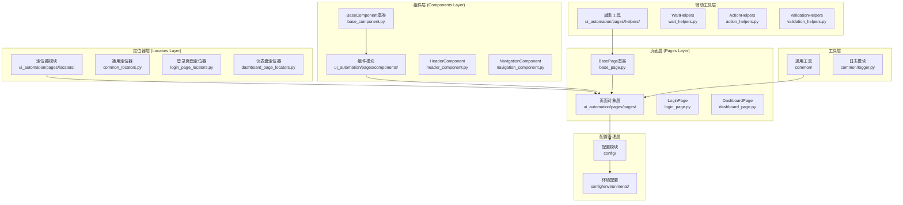
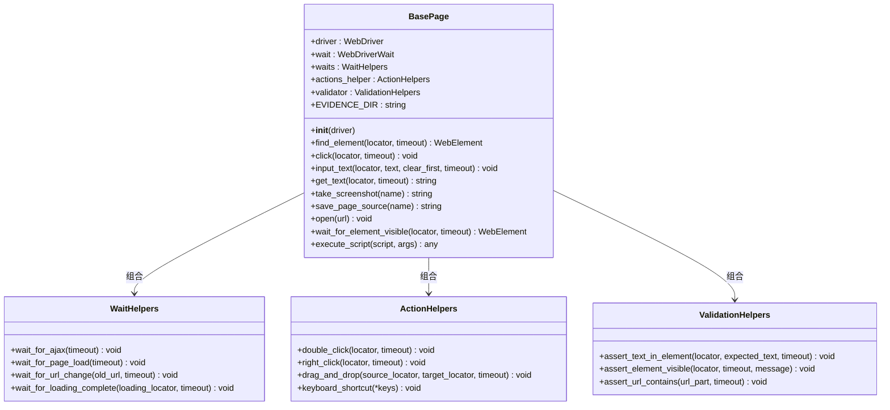
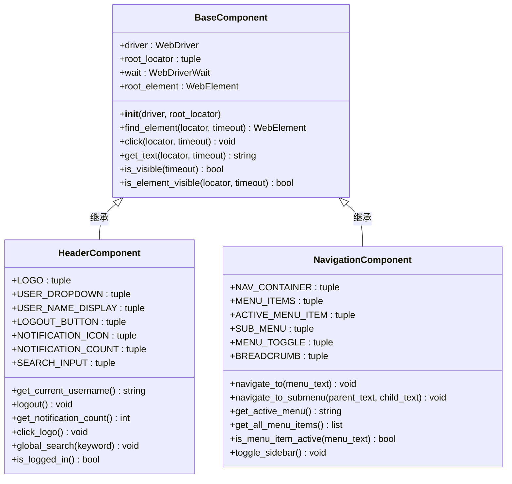
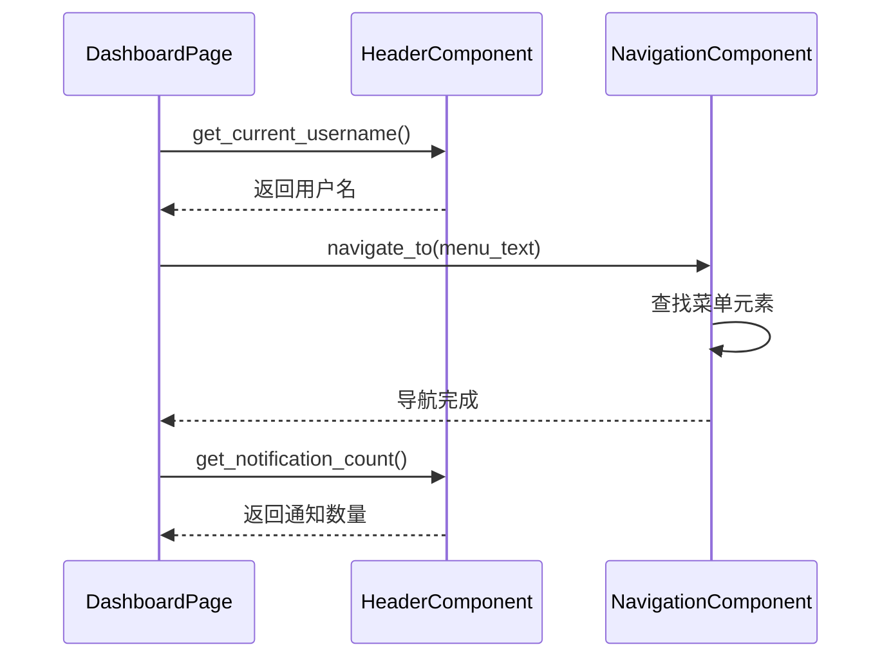
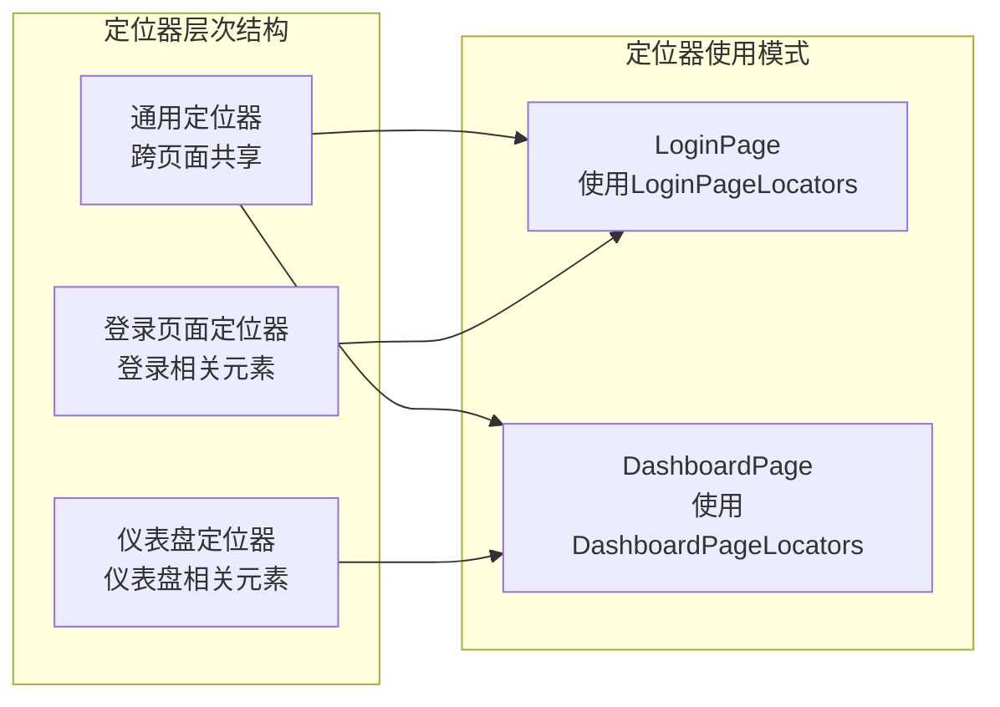
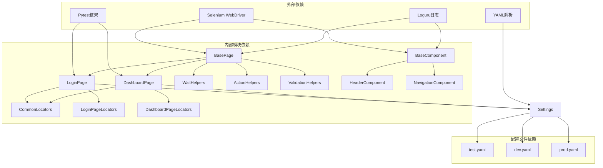

# Page Object模式设计

<cite>
**本文档引用的文件**
- [base_page.py](file://ui_automation/pages/base_page.py)
- [base_component.py](file://ui_automation/pages/components/base_component.py)
- [header_component.py](file://ui_automation/pages/components/header_component.py)
- [navigation_component.py](file://ui_automation/pages/components/navigation_component.py)
- [dashboard_page.py](file://ui_automation/pages/pages/dashboard_page.py)
- [login_page.py](file://ui_automation/pages/pages/login_page.py)
- [login_page_locators.py](file://ui_automation/pages/locators/login_page_locators.py)
- [dashboard_page_locators.py](file://ui_automation/pages/locators/dashboard_page_locators.py)
- [common_locators.py](file://ui_automation/pages/locators/common_locators.py)
- [wait_helpers.py](file://ui_automation/pages/helpers/wait_helpers.py)
- [action_helpers.py](file://ui_automation/pages/helpers/action_helpers.py)
- [validation_helpers.py](file://ui_automation/pages/helpers/validation_helpers.py)
- [test_example.py](file://ui_automation/testcases/test_example.py)
- [login_data.yaml](file://ui_automation/testdata/login_data.yaml)
- [conftest.py](file://conftest.py)
- [settings.py](file://config/settings.py)
- [logger.py](file://common/logger.py)
- [test.yaml](file://config/environments/test.yaml)
- [dev.yaml](file://config/environments/dev.yaml)
- [prod.yaml](file://config/environments/prod.yaml)
- [pytest.ini](file://pytest.ini)
</cite>

## 目录
1. [简介](#简介)
2. [项目结构](#项目结构)
3. [核心组件](#核心组件)
4. [架构概览](#架构概览)
5. [详细组件分析](#详细组件分析)
6. [依赖分析](#依赖分析)
7. [性能考虑](#性能考虑)
8. [故障排除指南](#故障排除指南)
9. [结论](#结论)
10. [附录](#附录)

## 简介

Page Object模式是一种广泛应用于测试自动化领域的设计模式，它通过将页面元素和操作方法封装在专门的类中，实现了测试代码与页面实现细节的解耦。该模式的核心理念是将页面视为一个独立的对象，测试代码通过操作这些对象来与应用程序进行交互。

在本项目中，Page Object模式已经从单一的BasePage模式演进为三层架构：locators层（定位器）、components层（组件）、pages层（页面），并引入了新的BaseComponent基类设计。这种新的组件化架构显著提升了代码的可维护性、可重用性和可扩展性。

## 项目结构

该项目采用全新的三层架构组织，专门为UI自动化测试设计了组件化的Page Object模式实现。整体结构清晰地分离了定位器、组件和页面对象，形成了完整的测试自动化体系。



**图表来源**
- [base_page.py:1-515](file://ui_automation/pages/base_page.py#L1-L515)
- [base_component.py:1-85](file://ui_automation/pages/components/base_component.py#L1-L85)
- [header_component.py:1-66](file://ui_automation/pages/components/header_component.py#L1-L66)
- [navigation_component.py:1-63](file://ui_automation/pages/components/navigation_component.py#L1-L63)
- [dashboard_page.py:1-131](file://ui_automation/pages/pages/dashboard_page.py#L1-L131)
- [login_page.py:1-167](file://ui_automation/pages/pages/login_page.py#L1-L167)

**章节来源**
- [base_page.py:1-515](file://ui_automation/pages/base_page.py#L1-L515)
- [base_component.py:1-85](file://ui_automation/pages/components/base_component.py#L1-L85)
- [dashboard_page.py:1-131](file://ui_automation/pages/pages/dashboard_page.py#L1-L131)
- [login_page.py:1-167](file://ui_automation/pages/pages/login_page.py#L1-L167)

## 核心组件

### BasePage基类

BasePage是Page Object模式的核心基类，经过重构后集成了三大辅助工具：WaitHelpers、ActionHelpers和ValidationHelpers，为所有页面对象提供统一的操作接口和验证能力。

#### 主要特性
- **统一的元素操作接口**：提供find_element、click、input_text等标准化方法
- **智能等待机制**：基于WebDriverWait实现显式等待，支持重试和自定义等待条件
- **高级交互支持**：支持ActionChains、JavaScript执行、文件上传等复杂操作
- **断言验证能力**：内置丰富的UI断言方法，支持文本、属性、状态等多种验证
- **错误处理与日志记录**：完善的异常捕获和日志记录机制
- **截图取证功能**：自动保存失败时的截图和页面源码

#### 辅助工具集成
- **WaitHelpers**：提供AJAX等待、页面加载、URL变化等高级等待功能
- **ActionHelpers**：封装双击、右键、拖拽、键盘快捷键等复杂交互
- **ValidationHelpers**：提供断言验证、元素状态检查、表单验证等功能

**章节来源**
- [base_page.py:36-515](file://ui_automation/pages/base_page.py#L36-L515)

### BaseComponent基类

BaseComponent是组件化架构的核心，专门用于封装可复用的UI组件，如页头、导航栏、侧边栏等。每个组件代表页面中一个可独立操作的区域。

#### 设计特点
- **组件根元素概念**：通过root_locator限定组件的作用范围
- **局部元素定位**：在组件范围内进行元素查找和操作
- **可见性检查**：支持组件级别的可见性判断
- **基础交互方法**：提供click、get_text、is_visible等基础方法

**章节来源**
- [base_component.py:18-85](file://ui_automation/pages/components/base_component.py#L18-L85)

### 组件实现示例

#### HeaderComponent页头组件
HeaderComponent封装了网站顶部导航区域的所有功能，包括用户信息、退出登录、通知管理、全局搜索等。

#### NavigationComponent导航组件
NavigationComponent支持多级菜单导航，提供菜单项查找、激活状态判断、侧边栏切换等功能。

**章节来源**
- [header_component.py:13-66](file://ui_automation/pages/components/header_component.py#L13-L66)
- [navigation_component.py:12-63](file://ui_automation/pages/components/navigation_component.py#L12-L63)

### 页面对象实现

#### LoginPage登录页面
LoginPage展示了如何正确实现具体的页面对象，通过导入LoginPageLocators实现定位器分离，利用BasePage的辅助工具提供完整的登录功能。

#### DashboardPage仪表盘页面
DashboardPage采用了组合模式，同时集成HeaderComponent和NavigationComponent，实现了复杂的仪表盘业务操作。

**章节来源**
- [login_page.py:18-167](file://ui_automation/pages/pages/login_page.py#L18-L167)
- [dashboard_page.py:20-131](file://ui_automation/pages/pages/dashboard_page.py#L20-L131)

## 架构概览

Page Object模式在本项目中的三层架构设计体现了良好的分层思想和职责分离原则。

```mermaid
graph TB
subgraph "定位器层"
CommonLocators[通用定位器]
LoginPageLocators[登录页面定位器]
DashboardPageLocators[仪表盘定位器]
end
subgraph "组件层"
BaseComponent[BaseComponent基类]
HeaderComponent[HeaderComponent]
NavigationComponent[NavigationComponent]
end
subgraph "页面层"
BasePage[BasePage基类]
LoginPage[LoginPage]
DashboardPage[DashboardPage]
end
subgraph "辅助工具层"
WaitHelpers[WaitHelpers]
ActionHelpers[ActionHelpers]
ValidationHelpers[ValidationHelpers]
end
subgraph "WebDriver层"
WebDriver[WebDriver]
WebDriverWait[WebDriverWait]
ActionChains[ActionChains]
Select[Select]
end
subgraph "配置管理层"
Settings[Settings]
BrowserConfig[Browser配置]
EnvConfig[环境配置]
end
subgraph "工具层"
Logger[Logger]
Screenshot[ScreenShot]
Evidence[Evidence]
End
CommonLocators --> LoginPage
CommonLocators --> DashboardPage
LoginPageLocators --> LoginPage
DashboardPageLocators --> DashboardPage
BaseComponent --> HeaderComponent
BaseComponent --> NavigationComponent
BasePage --> LoginPage
BasePage --> DashboardPage
BasePage --> WaitHelpers
BasePage --> ActionHelpers
BasePage --> ValidationHelpers
BasePage --> WebDriver
WebDriver --> WebDriverWait
WebDriver --> ActionChains
WebDriver --> Select
BasePage --> Logger
BasePage --> Screenshot
LoginPage --> Settings
DashboardPage --> Settings
Settings --> BrowserConfig
Settings --> EnvConfig
Logger --> Evidence
```

**图表来源**
- [base_page.py:28-33](file://ui_automation/pages/base_page.py#L28-L33)
- [login_page.py:10-13](file://ui_automation/pages/pages/login_page.py#L10-L13)
- [dashboard_page.py:11-14](file://ui_automation/pages/pages/dashboard_page.py#L11-L14)

## 详细组件分析

### BasePage类深度解析

BasePage类经过重构后，集成了三大辅助工具，形成了完整的页面操作和验证能力。

#### 类结构设计



**图表来源**
- [base_page.py:36-56](file://ui_automation/pages/base_page.py#L36-L56)
- [wait_helpers.py:16-125](file://ui_automation/pages/helpers/wait_helpers.py#L16-L125)
- [action_helpers.py:17-124](file://ui_automation/pages/helpers/action_helpers.py#L17-L124)
- [validation_helpers.py:15-140](file://ui_automation/pages/helpers/validation_helpers.py#L15-L140)

#### 辅助工具详解

**WaitHelpers等待工具**
- 支持AJAX请求完成检测
- 提供页面加载状态监控
- 实现URL变化和元素状态等待
- 包含重试机制和超时处理

**ActionHelpers交互工具**
- 封装复杂鼠标操作（双击、右键、拖拽）
- 支持键盘快捷键和组合键操作
- 提供页面滚动控制
- 实现文件上传功能

**ValidationHelpers验证工具**
- 提供丰富的断言方法
- 支持文本、属性、状态等多种验证
- 实现表单验证错误信息获取
- 包含元素可用性状态检查

**章节来源**
- [base_page.py:36-515](file://ui_automation/pages/base_page.py#L36-L515)
- [wait_helpers.py:16-125](file://ui_automation/pages/helpers/wait_helpers.py#L16-L125)
- [action_helpers.py:17-124](file://ui_automation/pages/helpers/action_helpers.py#L17-L124)
- [validation_helpers.py:15-140](file://ui_automation/pages/helpers/validation_helpers.py#L15-L140)

### BaseComponent类深度解析

BaseComponent类设计体现了组件化架构的核心思想，通过根元素定位器实现组件范围的限定。

#### 组件设计模式



**图表来源**
- [base_component.py:18-85](file://ui_automation/pages/components/base_component.py#L18-L85)
- [header_component.py:13-66](file://ui_automation/pages/components/header_component.py#L13-L66)
- [navigation_component.py:12-63](file://ui_automation/pages/components/navigation_component.py#L12-L63)

#### 组件组合模式

DashboardPage采用了组合模式，同时集成HeaderComponent和NavigationComponent，实现了复杂的仪表盘业务操作。



**图表来源**
- [dashboard_page.py:76-103](file://ui_automation/pages/pages/dashboard_page.py#L76-L103)

**章节来源**
- [base_component.py:18-85](file://ui_automation/pages/components/base_component.py#L18-L85)
- [dashboard_page.py:41-94](file://ui_automation/pages/pages/dashboard_page.py#L41-L94)

### 定位器分离架构

#### 定位器设计原则



**图表来源**
- [common_locators.py:4-18](file://ui_automation/pages/locators/common_locators.py#L4-L18)
- [login_page_locators.py:4-20](file://ui_automation/pages/locators/login_page_locators.py#L4-L20)
- [dashboard_page_locators.py:4-11](file://ui_automation/pages/locators/dashboard_page_locators.py#L4-L11)

#### 定位器类型对比

| 定位器类型 | 适用场景 | 优点 | 缺点 | 示例 |
|-----------|----------|------|------|------|
| ID定位器 | 唯一标识符 | 精确快速 | 依赖页面结构变化 | `USERNAME_INPUT = (By.ID, "username")` |
| CSS选择器 | 复杂选择 | 灵活强大 | 可读性较差 | `LOGIN_BUTTON = (By.CSS_SELECTOR, "button[type='submit']")` |
| XPath定位器 | 特殊情况 | 功能最强 | 性能较慢 | `FORGOT_PASSWORD_LINK = (By.LINK_TEXT, "忘记密码")` |
| 组合定位器 | 多条件匹配 | 精确度高 | 复杂度较高 | `(By.XPATH, "//nav//a[contains(text(), '菜单文本')]")` |

**章节来源**
- [login_page_locators.py:4-20](file://ui_automation/pages/locators/login_page_locators.py#L4-L20)
- [dashboard_page_locators.py:4-11](file://ui_automation/pages/locators/dashboard_page_locators.py#L4-L11)
- [common_locators.py:4-18](file://ui_automation/pages/locators/common_locators.py#L4-L18)

## 依赖分析

Page Object模式在三层架构中的依赖关系体现了清晰的层次结构和职责分离。



**图表来源**
- [base_page.py:28-33](file://ui_automation/pages/base_page.py#L28-L33)
- [login_page.py:10-13](file://ui_automation/pages/pages/login_page.py#L10-L13)
- [dashboard_page.py:11-14](file://ui_automation/pages/pages/dashboard_page.py#L11-L14)

### 模块间耦合度分析

| 模块 | 直接依赖 | 间接依赖 | 耦合度评估 | 说明 |
|------|----------|----------|-----------|------|
| BasePage | Selenium WebDriver | Loguru日志 | 低 | 仅基础WebDriver依赖 |
| BaseComponent | Selenium WebDriver | Loguru日志 | 低 | 仅基础WebDriver依赖 |
| LoginPage | BasePage | LoginPageLocators, CommonLocators | 中等 | 依赖定位器和基类 |
| DashboardPage | BasePage | DashboardPageLocators, CommonLocators | 中等 | 依赖定位器和基类 |
| WaitHelpers | Selenium WebDriver | Loguru日志 | 低 | 仅基础WebDriver依赖 |
| ActionHelpers | Selenium WebDriver | Loguru日志 | 低 | 仅基础WebDriver依赖 |
| ValidationHelpers | Selenium WebDriver | Loguru日志 | 低 | 仅基础WebDriver依赖 |
| 定位器模块 | 无 | 无 | 低 | 纯数据模块，无依赖 |
| Settings | PyYAML | 环境配置文件 | 低 | 仅配置解析依赖 |

**章节来源**
- [base_page.py:28-33](file://ui_automation/pages/base_page.py#L28-L33)
- [base_component.py:10-13](file://ui_automation/pages/components/base_component.py#L10-L13)
- [login_page.py:10-13](file://ui_automation/pages/pages/login_page.py#L10-L13)
- [dashboard_page.py:11-14](file://ui_automation/pages/pages/dashboard_page.py#L11-L14)

## 性能考虑

三层架构在性能方面的考虑主要体现在以下几个方面：

### 等待策略优化

BasePage的WaitHelpers实现了智能的等待机制，平衡了测试稳定性和执行效率：

- **显式等待**：针对特定元素的等待，避免不必要的全局等待
- **AJAX等待**：检测jQuery活动状态，支持异步请求完成检测
- **重试机制**：带重试的元素等待，提高稳定性
- **超时控制**：每个操作都有合理的超时时间设置

### 资源管理

- **WebDriver生命周期**：通过fixture管理浏览器实例的创建和销毁
- **内存清理**：测试结束后自动释放资源
- **组件复用**：BaseComponent支持组件复用，减少重复初始化
- **截图管理**：自动清理和管理证据文件

### 并发执行支持

- **独立浏览器实例**：每个测试函数使用独立的WebDriver实例
- **无状态设计**：页面对象和组件设计为无状态，支持并发执行
- **环境隔离**：通过配置管理实现不同环境的隔离
- **组件隔离**：BaseComponent通过root_locator实现组件范围隔离

## 故障排除指南

### 常见问题及解决方案

#### 元素定位失败

**问题症状**：TimeoutException异常，元素查找超时

**可能原因**：
- 定位器不正确或过时
- 页面元素动态加载
- 网络延迟导致页面加载缓慢
- 组件根元素定位器不正确

**解决步骤**：
1. 验证定位器的有效性
2. 使用WaitHelpers的重试机制
3. 检查页面加载状态
4. 调整等待超时时间
5. 验证组件根元素定位器

#### 组件交互异常

**问题症状**：组件方法调用失败或返回异常结果

**解决步骤**：
1. 验证组件根元素是否可见
2. 检查组件内元素定位器
3. 确认组件初始化时的root_locator设置
4. 使用组件的is_visible方法验证组件状态

#### 页面状态不一致

**问题症状**：页面元素可见但不可点击

**解决步骤**：
1. 使用wait_for_element_clickable方法
2. 检查元素是否被其他元素遮挡
3. 验证页面JavaScript执行状态
4. 调整页面等待策略

#### 截图取证

**自动截图机制**：
- 测试失败时自动保存浏览器截图
- 截图文件包含测试用例名称和时间戳
- 截图保存在ui_automation/evidence目录

**手动截图方法**：
- 在BasePage中调用take_screenshot方法
- 支持自定义截图文件名
- 自动保存页面源码作为辅助证据

**章节来源**
- [base_page.py:370-421](file://ui_automation/pages/base_page.py#L370-L421)
- [base_component.py:41-85](file://ui_automation/pages/components/base_component.py#L41-L85)
- [conftest.py:80-110](file://conftest.py#L80-L110)

## 结论

Page Object模式在本项目中的三层架构实现展现了测试自动化领域的最佳实践。通过定位器分离、组件化设计和辅助工具集成，实现了更高的代码复用性、更好的维护性和更强的扩展性。

### 主要优势

1. **模块化设计**：三层架构清晰分离职责，便于维护和扩展
2. **组件复用**：BaseComponent支持组件复用，减少重复代码
3. **定位器分离**：定位器集中管理，便于维护和测试数据驱动
4. **辅助工具集成**：WaitHelpers、ActionHelpers、ValidationHelpers提供完整功能
5. **错误处理完善**：自动截图和日志记录机制
6. **性能优化**：智能等待策略和资源管理

### 最佳实践总结

1. **定位器设计原则**：优先使用ID定位，其次CSS选择器，最后XPath
2. **组件设计原则**：每个组件代表独立的UI区域，通过root_locator限定范围
3. **方法封装策略**：将复杂操作封装为语义化的方法
4. **错误处理机制**：统一的异常捕获和日志记录
5. **测试数据管理**：使用YAML文件集中管理测试数据
6. **配置管理**：通过环境配置实现多环境支持

### 发展建议

1. **增加页面对象工厂**：为频繁使用的页面对象提供工厂方法
2. **增强页面导航**：实现页面间的导航和状态管理
3. **完善页面验证**：增加更多的页面状态验证方法
4. **扩展截图功能**：支持更多类型的证据收集
5. **优化性能监控**：增加页面加载时间和性能指标
6. **组件库扩展**：增加更多通用组件，如表格、模态框等

## 附录

### Page Object模式实施清单

- [ ] 设计三层架构层次结构
- [ ] 实现BasePage基类和辅助工具
- [ ] 创建BaseComponent基类
- [ ] 开发具体组件实现
- [ ] 设计定位器模块
- [ ] 创建具体的页面对象类
- [ ] 编写测试用例
- [ ] 配置测试环境
- [ ] 设置日志和监控
- [ ] 建立持续集成流程

### 相关文件参考

- **页面对象基类**：[base_page.py:36-515](file://ui_automation/pages/base_page.py#L36-L515)
- **组件基类**：[base_component.py:18-85](file://ui_automation/pages/components/base_component.py#L18-L85)
- **页头组件**：[header_component.py:13-66](file://ui_automation/pages/components/header_component.py#L13-L66)
- **导航组件**：[navigation_component.py:12-63](file://ui_automation/pages/components/navigation_component.py#L12-L63)
- **登录页面**：[login_page.py:18-167](file://ui_automation/pages/pages/login_page.py#L18-L167)
- **仪表盘页面**：[dashboard_page.py:20-131](file://ui_automation/pages/pages/dashboard_page.py#L20-L131)
- **登录页面定位器**：[login_page_locators.py:4-20](file://ui_automation/pages/locators/login_page_locators.py#L4-L20)
- **仪表盘定位器**：[dashboard_page_locators.py:4-11](file://ui_automation/pages/locators/dashboard_page_locators.py#L4-L11)
- **通用定位器**：[common_locators.py:4-18](file://ui_automation/pages/locators/common_locators.py#L4-L18)
- **等待工具**：[wait_helpers.py:16-125](file://ui_automation/pages/helpers/wait_helpers.py#L16-L125)
- **交互工具**：[action_helpers.py:17-124](file://ui_automation/pages/helpers/action_helpers.py#L17-L124)
- **验证工具**：[validation_helpers.py:15-140](file://ui_automation/pages/helpers/validation_helpers.py#L15-L140)
- **测试用例示例**：[test_example.py:31-161](file://ui_automation/testcases/test_example.py#L31-L161)
- **配置管理**：[settings.py:13-104](file://config/settings.py#L13-L104)
- **日志系统**：[logger.py:59-77](file://common/logger.py#L59-L77)
- **环境配置**：[test.yaml:1-31](file://config/environments/test.yaml#L1-L31)