# UI自动化测试框架

<cite>
**本文引用的文件**
- [ui_automation/pages/base_page.py](file://ui_automation/pages/base_page.py)
- [ui_automation/pages/pages/tos_dashboard_page.py](file://ui_automation/pages/pages/tos_dashboard_page.py)
- [ui_automation/pages/locators/tos_dashboard_locators.py](file://ui_automation/pages/locators/tos_dashboard_locators.py)
- [ui_automation/testcases/smoke/test_tos_dashboard.py](file://ui_automation/testcases/smoke/test_tos_dashboard.py)
- [ui_automation/testcases/smoke/test_tos_dashboard_settings.py](file://ui_automation/testcases/smoke/test_tos_dashboard_settings.py)
- [ui_automation/pages/pages/tos_user_settings_page.py](file://ui_automation/pages/pages/tos_user_settings_page.py)
- [ui_automation/pages/locators/tos_user_settings_locators.py](file://ui_automation/pages/locators/tos_user_settings_locators.py)
- [ui_automation/testcases/smoke/test_tos_user_settings.py](file://ui_automation/testcases/smoke/test_tos_user_settings.py)
- [ui_automation/pages/helpers/action_helpers.py](file://ui_automation/pages/helpers/action_helpers.py)
- [ui_automation/pages/components/base_component.py](file://ui_automation/pages/components/base_component.py)
- [ui_automation/pages/components/header_component.py](file://ui_automation/pages/components/header_component.py)
- [ui_automation/pages/components/navigation_component.py](file://ui_automation/pages/components/navigation_component.py)
- [ui_automation/pages/helpers/wait_helpers.py](file://ui_automation/pages/helpers/wait_helpers.py)
- [ui_automation/pages/helpers/validation_helpers.py](file://ui_automation/pages/helpers/validation_helpers.py)
- [ui_automation/pages/locators/common_locators.py](file://ui_automation/pages/locators/common_locators.py)
- [ui_automation/pages/locators/tos_desktop_locators.py](file://ui_automation/pages/locators/tos_desktop_locators.py)
- [ui_automation/pages/locators/tos_login_locators.py](file://ui_automation/pages/locators/tos_login_locators.py)
- [ui_automation/pages/locators/tos_navbar_locators.py](file://ui_automation/pages/locators/tos_navbar_locators.py)
- [ui_automation/pages/pages/tos_desktop_page.py](file://ui_automation/pages/pages/tos_desktop_page.py)
- [ui_automation/pages/pages/tos_login_page.py](file://ui_automation/pages/pages/tos_login_page.py)
- [ui_automation/pages/pages/tos_navbar_page.py](file://ui_automation/pages/pages/tos_navbar_page.py)
- [config/settings.py](file://config/settings.py)
- [conftest.py](file://conftest.py)
- [config/environments/test.yaml](file://config/environments/test.yaml)
- [config/environments/dev.yaml](file://config/environments/dev.yaml)
- [config/environments/prod.yaml](file://config/environments/prod.yaml)
- [common/logger.py](file://common/logger.py)
- [requirements.txt](file://requirements.txt)
- [pytest.ini](file://pytest.ini)
</cite>

## 更新摘要
**所做更改**
- 新增系统仪表板UI自动化框架，包含TosDashboardPage页面对象和TosDashboardLocators定位器
- 添加系统看板打开/关闭、钉住/取消钉住、拖动、设置面板操作等完整功能测试
- 扩展测试覆盖范围，新增系统看板冒烟测试和设置面板测试套件
- 完善页面对象模块导出，支持系统看板页面对象的导入使用
- 增强框架的完整性和可维护性，提供更全面的TOS桌面应用测试能力

## 目录
1. [简介](#简介)
2. [项目结构](#项目结构)
3. [核心组件](#核心组件)
4. [架构总览](#架构总览)
5. [详细组件分析](#详细组件分析)
6. [系统仪表板测试框架](#系统仪表板测试框架)
7. [TOS桌面测试框架](#tos桌面测试框架)
8. [TOS用户设置界面测试框架](#tos用户设置界面测试框架)
9. [Vue组件兼容性处理](#vue组件兼容性处理)
10. [依赖分析](#依赖分析)
11. [性能考虑](#性能考虑)
12. [故障排除指南](#故障排除指南)
13. [结论](#结论)
14. [附录](#附录)

## 简介
本文件面向全新的三层次UI自动化测试框架，系统性阐述重构后的Page Object模式设计理念与实现细节。新架构采用"定位器分离 + 组件组合 + 工具辅助"的三层设计，通过BasePage基类集成WaitHelpers、ActionHelpers、ValidationHelpers三大辅助工具，通过BaseComponent基类实现可复用的UI组件，通过专门的locators目录集中管理页面元素定位器。深入解析各层核心功能与扩展机制，规范页面对象的开发流程、元素定位策略与等待机制，并给出完整的示例页面对象分析、测试数据管理方法与截图证据收集流程。同时覆盖Selenium WebDriver的高级用法、跨浏览器兼容性与性能优化建议，以及调试技巧、故障排除与最佳实践。

**更新** 新增系统仪表板UI自动化框架，专门处理TOS系统看板的完整功能测试。新增TosDashboardPage页面对象，支持看板的打开/关闭、钉住/取消钉住、拖动、设置面板操作等核心功能。新增TosDashboardLocators定位器，提供稳定的元素定位策略。新增系统看板冒烟测试和设置面板测试套件，覆盖完整的业务流程测试。

## 项目结构
新架构采用"三层分离 + 功能域划分"的组织方式：
- config：集中管理多环境配置（YAML），通过Settings类统一读取与暴露
- common：通用工具（日志、报告等）
- ui_automation：UI自动化测试域，采用三层次架构
  - pages：页面对象层，包含基础页面和业务页面
  - components：组件层，可复用的UI组件
  - helpers：辅助工具层，分离的等待、动作、验证逻辑
  - locators：定位器层，集中管理页面元素定位器
  - testcases：测试用例层，包含功能测试、回归测试、冒烟测试
  - testdata：测试数据管理
- api_testing：接口测试域（与UI测试解耦）
- 性能：性能测试脚本与报告
- 文档与配置：文档、pytest配置、依赖清单

```mermaid
graph TB
subgraph "配置层"
CFG["config/settings.py"]
ENV_TEST["config/environments/test.yaml"]
ENV_DEV["config/environments/dev.yaml"]
ENV_PROD["config/environments/prod.yaml"]
end
subgraph "通用工具"
LOG["common/logger.py"]
end
subgraph "UI自动化 - 三层架构"
subgraph "Pages层"
BP["pages/base_page.py"]
TDP["pages/pages/tos_desktop_page.py"]
TLP["pages/pages/tos_login_page.py"]
TNP["pages/pages/tos_navbar_page.py"]
TUSP["pages/pages/tos_user_settings_page.py"]
TBDP["pages/pages/tos_dashboard_page.py"]
end
subgraph "Components层"
BC["components/base_component.py"]
HC["components/header_component.py"]
NC["components/navigation_component.py"]
end
subgraph "Helpers层"
WH["helpers/wait_helpers.py"]
AH["helpers/action_helpers.py"]
VH["helpers/validation_helpers.py"]
end
subgraph "Locators层"
CL["locators/common_locators.py"]
TDL["locators/tos_desktop_locators.py"]
TLL["locators/tos_login_locators.py"]
TNL["locators/tos_navbar_locators.py"]
TUSL["locators/tos_user_settings_locators.py"]
TBDL["locators/tos_dashboard_locators.py"]
end
TDT["ui_automation/testdata/"]
EV["ui_automation/evidence/"]
end
subgraph "测试运行"
CF["conftest.py"]
PYI["pytest.ini"]
REQ["requirements.txt"]
end
CFG --> BP
CFG --> TDP
CFG --> TLP
CFG --> TNP
CFG --> TUSP
CFG --> TBDP
ENV_TEST --> CFG
ENV_DEV --> CFG
ENV_PROD --> CFG
LOG --> BP
LOG --> HC
LOG --> NC
CF --> TDP
CF --> TLP
CF --> TNP
CF --> TUSP
CF --> TBDP
PYI --> TDP
PYI --> TLP
PYI --> TNP
PYI --> TUSP
PYI --> TBDP
REQ --> CF
TDT --> TLP
BP --> TDP
BP --> TLP
BP --> TNP
BP --> TUSP
BP --> TBDP
BC --> HC
BC --> NC
HC --> TDP
NC --> TDP
TDP --> TNP
TLP --> TDP
TLP --> TNP
TDP --> TUSP
TNP --> TUSP
TDP --> TBDP
TBDP --> TUSP
WH --> BP
AH --> BP
VH --> BP
CL --> TDP
CL --> TLP
CL --> TNP
CL --> TUSP
CL --> TBDP
TDL --> TDP
TLL --> TLP
TNL --> TNP
TUSL --> TUSP
TBDL --> TBDP
BP --> EV
```

**图表来源**
- [config/settings.py:13-104](file://config/settings.py#L13-L104)
- [config/environments/test.yaml:1-31](file://config/environments/test.yaml#L1-L31)
- [config/environments/dev.yaml:1-31](file://config/environments/dev.yaml#L1-L31)
- [config/environments/prod.yaml:1-31](file://config/environments/prod.yaml#L1-L31)
- [common/logger.py:1-77](file://common/logger.py#L1-L77)
- [ui_automation/pages/base_page.py:24-515](file://ui_automation/pages/base_page.py#L24-L515)
- [ui_automation/pages/pages/tos_dashboard_page.py:1-288](file://ui_automation/pages/pages/tos_dashboard_page.py#L1-L288)
- [ui_automation/pages/locators/tos_dashboard_locators.py:1-51](file://ui_automation/pages/locators/tos_dashboard_locators.py#L1-L51)
- [ui_automation/testcases/smoke/test_tos_dashboard.py:1-95](file://ui_automation/testcases/smoke/test_tos_dashboard.py#L1-L95)
- [ui_automation/testcases/smoke/test_tos_dashboard_settings.py:1-134](file://ui_automation/testcases/smoke/test_tos_dashboard_settings.py#L1-L134)

**章节来源**
- [config/settings.py:13-104](file://config/settings.py#L13-L104)
- [conftest.py:25-122](file://conftest.py#L25-L122)
- [pytest.ini:1-12](file://pytest.ini#L1-L12)
- [requirements.txt:1-21](file://requirements.txt#L1-L21)

## 核心组件
- **BasePage**：页面对象基类，封装Selenium常用操作并集成三大辅助工具（WaitHelpers、ActionHelpers、ValidationHelpers），提供统一的页面交互抽象。
- **BaseComponent**：组件基类，封装可复用的UI组件（如页头、导航栏、侧边栏等），支持组件范围内的元素查找和操作。
- **WaitHelpers**：自定义等待辅助类，提供比Selenium原生更强大的等待功能，包括AJAX等待、页面加载、元素消失、URL变化等。
- **ActionHelpers**：高级交互辅助类，提供复杂的用户交互操作，如双击、右键、拖拽、键盘快捷键、文件上传等。
- **ValidationHelpers**：验证辅助类，提供常用的UI断言和验证功能，支持文本、属性、可见性等多种断言类型。
- **TosDesktopPage**：新增TOS桌面页面对象，专门处理桌面右键菜单、刷新、用户设置等操作，新增用户设置入口方法。
- **TosLoginPage**：新增TOS两步式登录页面对象，适配Vue.js + 自定义组件的登录流程。
- **TosNavbarPage**：新增TOS导航栏页面对象，处理应用图标悬浮、点击等导航操作。
- **TosUserSettingsPage**：新增TOS用户设置页面对象，专门处理用户设置界面的导航、Tab切换、字段验证等操作，新增Vue组件兼容性处理。
- **TosDashboardPage**：新增TOS系统仪表板页面对象，专门处理看板的打开、钉住、拖动、设置面板等完整功能，提供系统看板的自动化测试能力。
- **Settings**：集中读取config/environments下的YAML配置，支持通过环境变量切换环境，提供属性访问与通用get方法。
- **conftest**：pytest全局fixture与钩子，负责WebDriver初始化/销毁、隐式等待与页面加载超时设置、失败自动截图、自定义marker注册。
- **日志模块**：基于loguru统一输出控制台与文件，便于问题定位与审计。
- **测试数据**：YAML文件集中管理登录场景数据，便于维护与扩展。

**章节来源**
- [ui_automation/pages/base_page.py:36-515](file://ui_automation/pages/base_page.py#L36-L515)
- [ui_automation/pages/components/base_component.py:18-85](file://ui_automation/pages/components/base_component.py#L18-L85)
- [ui_automation/pages/helpers/wait_helpers.py:16-125](file://ui_automation/pages/helpers/wait_helpers.py#L16-L125)
- [ui_automation/pages/helpers/action_helpers.py:17-124](file://ui_automation/pages/helpers/action_helpers.py#L17-L124)
- [ui_automation/pages/helpers/validation_helpers.py:15-140](file://ui_automation/pages/helpers/validation_helpers.py#L15-L140)
- [ui_automation/pages/pages/tos_desktop_page.py:20-98](file://ui_automation/pages/pages/tos_desktop_page.py#L20-L98)
- [ui_automation/pages/pages/tos_login_page.py:18-163](file://ui_automation/pages/pages/tos_login_page.py#L18-L163)
- [ui_automation/pages/pages/tos_navbar_page.py:22-234](file://ui_automation/pages/pages/tos_navbar_page.py#L22-L234)
- [ui_automation/pages/pages/tos_user_settings_page.py:19-239](file://ui_automation/pages/pages/tos_user_settings_page.py#L19-L239)
- [ui_automation/pages/pages/tos_dashboard_page.py:22-288](file://ui_automation/pages/pages/tos_dashboard_page.py#L22-L288)
- [config/settings.py:13-104](file://config/settings.py#L13-L104)
- [conftest.py:25-122](file://conftest.py#L25-L122)
- [common/logger.py:1-77](file://common/logger.py#L1-L77)
- [ui_automation/testcases/smoke/test_tos_user_settings.py:30-219](file://ui_automation/testcases/smoke/test_tos_user_settings.py#L30-L219)

## 架构总览
新架构采用"三层分离 + 组件组合"的分层架构：
- **定位器层**：通过专门的locators目录集中管理页面元素定位器，支持跨页面共享的通用定位器
- **组件层**：通过BaseComponent基类实现可复用的UI组件，支持组件范围内的元素操作和状态管理
- **页面层**：通过BasePage基类集成三大辅助工具，具体页面对象继承扩展并组合组件
- **运行层**：pytest + conftest提供driver与base_url fixture，失败自动截图
- **用例层**：测试类使用页面对象进行业务步骤编排与断言

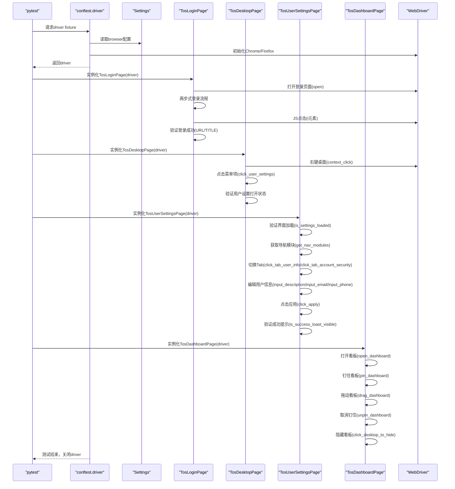
```mermaid
sequenceDiagram
participant Py as "pytest"
participant CF as "conftest.driver"
participant ST as "Settings"
participant TLP as "TosLoginPage"
participant TDP as "TosDesktopPage"
participant TUSP as "TosUserSettingsPage"
participant TBDP as "TosDashboardPage"
participant WD as "WebDriver"
Py->>CF : 请求driver fixture
CF->>ST : 读取browser配置
CF->>WD : 初始化Chrome/Firefox
CF-->>Py : 返回driver
Py->>TLP : 实例化TosLoginPage(driver)
TLP->>WD : 打开登录页面(open)
TLP->>TLP : 两步式登录流程
TLP->>WD : JS点击(i元素)
TLP->>TLP : 验证登录成功(URL/TITLE)
Py->>TDP : 实例化TosDesktopPage(driver)
TDP->>WD : 右键桌面(context_click)
TDP->>TDP : 点击菜单项(click_user_settings)
TDP->>TDP : 验证用户设置打开状态
Py->>TUSP : 实例化TosUserSettingsPage(driver)
TUSP->>TUSP : 验证界面加载(is_settings_loaded)
TUSP->>TUSP : 获取导航模块(get_nav_modules)
TUSP->>TUSP : 切换Tab(click_tab_user_info/click_tab_account_security)
TUSP->>TUSP : 编辑用户信息(input_description/input_email/input_phone)
TUSP->>TUSP : 点击应用(click_apply)
TUSP->>TUSP : 验证成功提示(is_success_toast_visible)
Py->>TBDP : 实例化TosDashboardPage(driver)
TBDP->>TBDP : 打开看板(open_dashboard)
TBDP->>TBDP : 钉住看板(pin_dashboard)
TBDP->>TBDP : 拖动看板(drag_dashboard)
TBDP->>TBDP : 取消钉住(unpin_dashboard)
TBDP->>TBDP : 隐藏看板(click_desktop_to_hide)
CF-->>Py : 测试结束，关闭driver
```

**图表来源**
- [conftest.py:25-78](file://conftest.py#L25-L78)
- [config/settings.py:37-48](file://config/settings.py#L37-L48)
- [ui_automation/pages/pages/tos_login_page.py:30-163](file://ui_automation/pages/pages/tos_login_page.py#L30-L163)
- [ui_automation/pages/pages/tos_desktop_page.py:64-77](file://ui_automation/pages/pages/tos_desktop_page.py#L64-L77)
- [ui_automation/pages/pages/tos_user_settings_page.py:27-52](file://ui_automation/pages/pages/tos_user_settings_page.py#L27-L52)
- [ui_automation/pages/pages/tos_dashboard_page.py:30-94](file://ui_automation/pages/pages/tos_dashboard_page.py#L30-L94)
- [ui_automation/testcases/smoke/test_tos_user_settings.py:149-181](file://ui_automation/testcases/smoke/test_tos_user_settings.py#L149-L181)

## 详细组件分析

### BasePage基类设计与实现
- **设计理念**
  - 将页面交互抽象为"元素操作 + 等待 + 高级交互 + 截图证据"，统一异常处理与日志记录
  - 通过集成三大辅助工具（WaitHelpers、ActionHelpers、ValidationHelpers）实现功能分离
  - 显式等待为主，结合隐式等待，提升稳定性与可维护性
  - 证据收集贯穿关键节点，便于问题复盘
- **核心能力**
  - 元素操作：find_element/find_elements、click、input_text、get_text、get_attribute、is_element_visible
  - 等待机制：wait_for_element_visible、wait_for_element_clickable、wait_for_url_contains
  - 页面操作：open、get_title、get_current_url、refresh、switch_to_frame/switch_to_default
  - 截图与证据：take_screenshot、save_page_source
  - 高级操作：hover、scroll_to_element、execute_script、select_dropdown
- **辅助工具集成**
  - self.waits：WaitHelpers实例，提供自定义等待功能
  - self.actions_helper：ActionHelpers实例，提供高级交互操作
  - self.validator：ValidationHelpers实例，提供断言验证功能

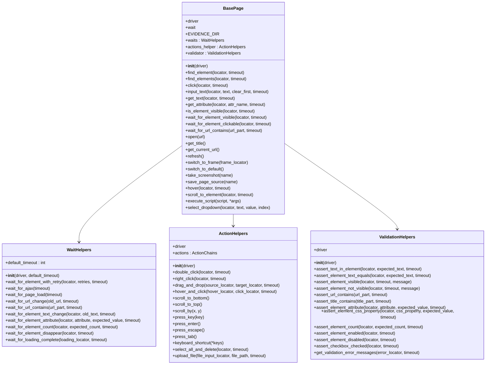
```mermaid
classDiagram
class BasePage {
+driver
+wait
+EVIDENCE_DIR
+waits : WaitHelpers
+actions_helper : ActionHelpers
+validator : ValidationHelpers
+__init__(driver)
+find_element(locator, timeout)
+find_elements(locator, timeout)
+click(locator, timeout)
+input_text(locator, text, clear_first, timeout)
+get_text(locator, timeout)
+get_attribute(locator, attr_name, timeout)
+is_element_visible(locator, timeout)
+wait_for_element_visible(locator, timeout)
+wait_for_element_clickable(locator, timeout)
+wait_for_url_contains(url_part, timeout)
+open(url)
+get_title()
+get_current_url()
+refresh()
+switch_to_frame(frame_locator)
+switch_to_default()
+take_screenshot(name)
+save_page_source(name)
+hover(locator, timeout)
+scroll_to_element(locator, timeout)
+execute_script(script, *args)
+select_dropdown(locator, text, value, index)
}
class WaitHelpers {
+default_timeout : int
+__init__(driver, default_timeout)
+wait_for_element_with_retry(locator, retries, timeout)
+wait_for_ajax(timeout)
+wait_for_page_load(timeout)
+wait_for_url_change(old_url, timeout)
+wait_for_url_contains(url_part, timeout)
+wait_for_element_text_change(locator, old_text, timeout)
+wait_for_element_attribute(locator, attribute, expected_value, timeout)
+wait_for_element_count(locator, expected_count, timeout)
+wait_for_element_disappear(locator, timeout)
+wait_for_loading_complete(loading_locator, timeout)
}
class ActionHelpers {
+driver
+actions : ActionChains
+__init__(driver)
+double_click(locator, timeout)
+right_click(locator, timeout)
+drag_and_drop(source_locator, target_locator, timeout)
+hover_and_click(hover_locator, click_locator, timeout)
+scroll_to_bottom()
+scroll_to_top()
+scroll_by(x, y)
+press_key(key)
+press_enter()
+press_escape()
+press_tab()
+keyboard_shortcut(*keys)
+select_all_and_delete(locator, timeout)
+upload_file(file_input_locator, file_path, timeout)
}
class ValidationHelpers {
+driver
+__init__(driver)
+assert_text_in_element(locator, expected_text, timeout)
+assert_element_text_equals(locator, expected_text, timeout)
+assert_element_visible(locator, timeout, message)
+assert_element_not_visible(locator, timeout, message)
+assert_url_contains(url_part, timeout)
+assert_title_contains(title_part, timeout)
+assert_element_attribute(locator, attribute, expected_value, timeout)
+assert_element_css_property(locator, css_property, expected_value, timeout)
+assert_element_count(locator, expected_count, timeout)
+assert_element_enabled(locator, timeout)
+assert_element_disabled(locator, timeout)
+assert_checkbox_checked(locator, timeout)
+get_validation_error_messages(error_locator, timeout)
}
BasePage --> WaitHelpers
BasePage --> ActionHelpers
BasePage --> ValidationHelpers
```

**图表来源**
- [ui_automation/pages/base_page.py:36-515](file://ui_automation/pages/base_page.py#L36-L515)
- [ui_automation/pages/helpers/wait_helpers.py:16-125](file://ui_automation/pages/helpers/wait_helpers.py#L16-L125)
- [ui_automation/pages/helpers/action_helpers.py:17-124](file://ui_automation/pages/helpers/action_helpers.py#L17-L124)
- [ui_automation/pages/helpers/validation_helpers.py:15-140](file://ui_automation/pages/helpers/validation_helpers.py#L15-L140)

**章节来源**
- [ui_automation/pages/base_page.py:36-515](file://ui_automation/pages/base_page.py#L36-L515)
- [common/logger.py:1-77](file://common/logger.py#L1-L77)

### BaseComponent基类设计与实现
- **设计理念**
  - 将页面中的可复用UI区域抽象为独立组件，支持组件范围内的元素操作
  - 通过root_locator限定组件作用域，提高定位准确性和可维护性
  - 组件内部使用显式等待，确保元素可用性
- **核心能力**
  - 根元素管理：root_element属性获取组件根元素
  - 元素操作：find_element、click、get_text、is_visible、is_element_visible
  - 组件状态：判断组件是否可见，获取组件内元素文本
- **应用场景**
  - HeaderComponent：页头组件，包含Logo、用户信息、退出登录等功能
  - NavigationComponent：导航组件，支持多级菜单导航和面包屑导航

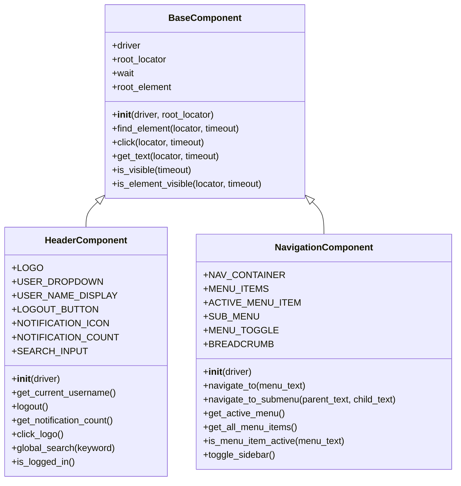
```mermaid
classDiagram
class BaseComponent {
+driver
+root_locator
+wait
+root_element
+__init__(driver, root_locator)
+find_element(locator, timeout)
+click(locator, timeout)
+get_text(locator, timeout)
+is_visible(timeout)
+is_element_visible(locator, timeout)
}
class HeaderComponent {
+LOGO
+USER_DROPDOWN
+USER_NAME_DISPLAY
+LOGOUT_BUTTON
+NOTIFICATION_ICON
+NOTIFICATION_COUNT
+SEARCH_INPUT
+__init__(driver)
+get_current_username()
+logout()
+get_notification_count()
+click_logo()
+global_search(keyword)
+is_logged_in()
}
class NavigationComponent {
+NAV_CONTAINER
+MENU_ITEMS
+ACTIVE_MENU_ITEM
+SUB_MENU
+MENU_TOGGLE
+BREADCRUMB
+__init__(driver)
+navigate_to(menu_text)
+navigate_to_submenu(parent_text, child_text)
+get_active_menu()
+get_all_menu_items()
+is_menu_item_active(menu_text)
+toggle_sidebar()
}
BaseComponent <|-- HeaderComponent
BaseComponent <|-- NavigationComponent
```

**图表来源**
- [ui_automation/pages/components/base_component.py:18-85](file://ui_automation/pages/components/base_component.py#L18-L85)
- [ui_automation/pages/components/header_component.py:13-66](file://ui_automation/pages/components/header_component.py#L13-L66)
- [ui_automation/pages/components/navigation_component.py:12-63](file://ui_automation/pages/components/navigation_component.py#L12-L63)

**章节来源**
- [ui_automation/pages/components/base_component.py:18-85](file://ui_automation/pages/components/base_component.py#L18-L85)
- [ui_automation/pages/components/header_component.py:13-66](file://ui_automation/pages/components/header_component.py#L13-L66)
- [ui_automation/pages/components/navigation_component.py:12-63](file://ui_automation/pages/components/navigation_component.py#L12-L63)

### 辅助工具层设计与实现
- **WaitHelpers**：提供比Selenium原生更强大的等待功能
  - 带重试的元素等待：wait_for_element_with_retry
  - AJAX请求等待：wait_for_ajax
  - 页面加载等待：wait_for_page_load
  - URL变化等待：wait_for_url_change、wait_for_url_contains
  - 元素状态等待：wait_for_element_text_change、wait_for_element_attribute、wait_for_element_count、wait_for_element_disappear
  - 加载动画等待：wait_for_loading_complete
- **ActionHelpers**：提供复杂的用户交互操作
  - 鼠标操作：double_click、right_click、drag_and_drop、hover_and_click
  - 滚动操作：scroll_to_bottom、scroll_to_top、scroll_by
  - 键盘操作：press_key、press_enter、press_escape、press_tab、keyboard_shortcut
  - 文本操作：select_all_and_delete
  - 文件操作：upload_file
- **ValidationHelpers**：提供常用的UI断言和验证功能
  - 文本断言：assert_text_in_element、assert_element_text_equals
  - 可见性断言：assert_element_visible、assert_element_not_visible
  - URL断言：assert_url_contains
  - 标题断言：assert_title_contains
  - 属性断言：assert_element_attribute、assert_element_css_property
  - 数量断言：assert_element_count
  - 状态断言：assert_element_enabled、assert_element_disabled、assert_checkbox_checked
  - 错误信息获取：get_validation_error_messages

**章节来源**
- [ui_automation/pages/helpers/wait_helpers.py:16-125](file://ui_automation/pages/helpers/wait_helpers.py#L16-L125)
- [ui_automation/pages/helpers/action_helpers.py:17-124](file://ui_automation/pages/helpers/action_helpers.py#L17-L124)
- [ui_automation/pages/helpers/validation_helpers.py:15-140](file://ui_automation/pages/helpers/validation_helpers.py#L15-L140)

### 定位器层设计与实现
- **设计理念**
  - 将页面元素定位器集中管理，支持跨页面共享的通用定位器
  - 通过类常量形式定义定位器，便于维护和复用
  - 支持页面特定定位器和通用定位器的分离
- **定位器分类**
  - 通用定位器：CommonLocators，包含跨页面共享的元素（加载动画、提示消息、模态框等）
  - 页面定位器：TosDesktopLocators、TosLoginLocators、TosNavbarLocators、TosUserSettingsLocators、TosDashboardLocators等页面专用定位器，定义页面特有的元素
- **定位器使用**
  - 页面对象通过导入定位器类使用元素定位器
  - 支持多种定位策略：ID、CSS、XPath、Link Text等

**章节来源**
- [ui_automation/pages/locators/common_locators.py:4-18](file://ui_automation/pages/locators/common_locators.py#L4-L18)
- [ui_automation/pages/locators/tos_desktop_locators.py:8-31](file://ui_automation/pages/locators/tos_desktop_locators.py#L8-L31)
- [ui_automation/pages/locators/tos_login_locators.py:11-48](file://ui_automation/pages/locators/tos_login_locators.py#L11-L48)
- [ui_automation/pages/locators/tos_navbar_locators.py:13-70](file://ui_automation/pages/locators/tos_navbar_locators.py#L13-L70)
- [ui_automation/pages/locators/tos_user_settings_locators.py:8-52](file://ui_automation/pages/locators/tos_user_settings_locators.py#L8-L52)
- [ui_automation/pages/locators/tos_dashboard_locators.py:8-51](file://ui_automation/pages/locators/tos_dashboard_locators.py#L8-L51)

### 示例页面对象：TosDesktopPage
- **设计要点**
  - 采用定位器分离模式，通过导入TosDesktopLocators集中管理元素定位器
  - 继承BasePage，复用通用能力并集成三大辅助工具
  - 支持链式调用，提供流畅的业务方法调用体验
  - 新增用户设置入口方法，支持从桌面右键菜单打开用户设置界面
- **典型流程**
  - 右键桌面 → 弹出右键菜单 → 点击"用户设置" → 验证用户设置界面打开
  - 验证用户设置界面状态，确保界面正确加载

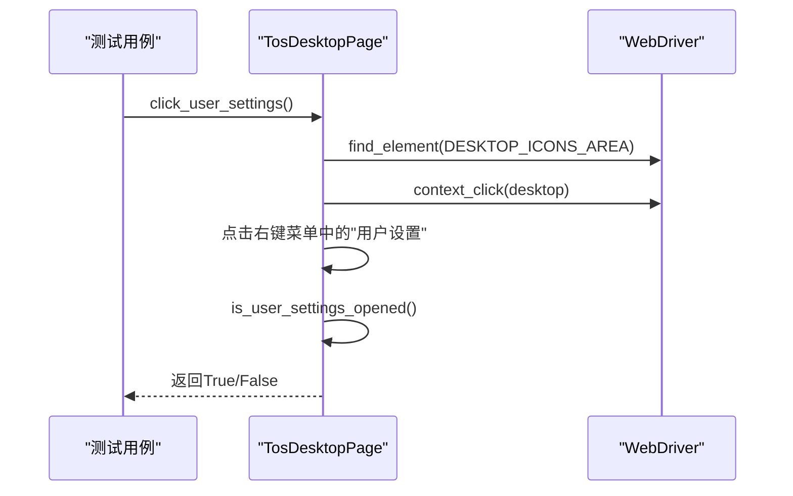
```mermaid
sequenceDiagram
participant T as "测试用例"
participant TDP as "TosDesktopPage"
participant WD as "WebDriver"
T->>TDP : click_user_settings()
TDP->>WD : find_element(DESKTOP_ICONS_AREA)
TDP->>WD : context_click(desktop)
TDP->>TDP : 点击右键菜单中的"用户设置"
TDP->>TDP : is_user_settings_opened()
TDP-->>T : 返回True/False
```

**图表来源**
- [ui_automation/pages/pages/tos_desktop_page.py:64-77](file://ui_automation/pages/pages/tos_desktop_page.py#L64-L77)

**章节来源**
- [ui_automation/pages/pages/tos_desktop_page.py:20-98](file://ui_automation/pages/pages/tos_desktop_page.py#L20-L98)

### 示例页面对象：TosUserSettingsPage
- **设计要点**
  - 专门处理TOS用户设置界面的导航、Tab切换、字段验证等操作
  - 继承BasePage，复用通用能力并集成三大辅助工具
  - 支持链式调用，提供流畅的业务方法调用体验
  - 专注于用户设置界面的完整功能测试
  - **新增** Vue组件兼容性处理，支持现代Web框架的输入框操作
- **核心功能**
  - 界面验证：验证用户设置界面加载完成、获取左侧导航模块列表、获取当前模块的Tab标签列表
  - 导航操作：点击左侧导航模块（账号、显示）
  - Tab操作：点击各个Tab标签（用户信息、账号安全、其它）
  - 字段验证：验证用户名、角色等字段显示状态
  - **新增** 用户信息编辑：支持描述、邮箱、电话字段的输入和保存
  - **新增** 成功提示检测：验证设置操作的成功状态
  - **新增** 复选框操作：支持'其它' Tab中复选框的批量勾选/取消勾选

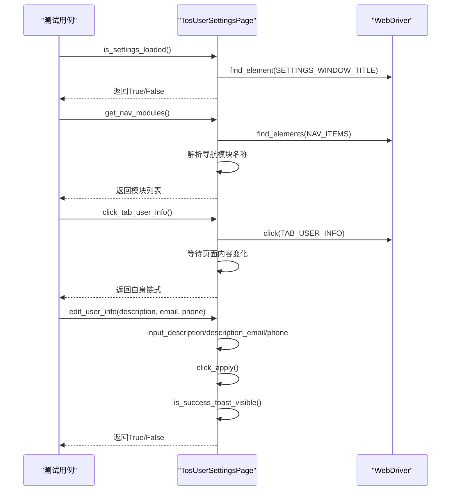
```mermaid
sequenceDiagram
participant T as "测试用例"
participant TUSP as "TosUserSettingsPage"
participant WD as "WebDriver"
T->>TUSP : is_settings_loaded()
TUSP->>WD : find_element(SETTINGS_WINDOW_TITLE)
TUSP-->>T : 返回True/False
T->>TUSP : get_nav_modules()
TUSP->>WD : find_elements(NAV_ITEMS)
TUSP->>TUSP : 解析导航模块名称
TUSP-->>T : 返回模块列表
T->>TUSP : click_tab_user_info()
TUSP->>WD : click(TAB_USER_INFO)
TUSP->>TUSP : 等待页面内容变化
TUSP-->>T : 返回自身链式
T->>TUSP : edit_user_info(description, email, phone)
TUSP->>TUSP : input_description/description_email/phone
TUSP->>TUSP : click_apply()
TUSP->>TUSP : is_success_toast_visible()
TUSP-->>T : 返回True/False
```

**图表来源**
- [ui_automation/pages/pages/tos_user_settings_page.py:27-52](file://ui_automation/pages/pages/tos_user_settings_page.py#L27-L52)
- [ui_automation/pages/pages/tos_user_settings_page.py:72-91](file://ui_automation/pages/pages/tos_user_settings_page.py#L72-L91)
- [ui_automation/testcases/smoke/test_tos_user_settings.py:149-181](file://ui_automation/testcases/smoke/test_tos_user_settings.py#L149-L181)

**章节来源**
- [ui_automation/pages/pages/tos_user_settings_page.py:19-239](file://ui_automation/pages/pages/tos_user_settings_page.py#L19-L239)

### 示例页面对象：TosDashboardPage
**新增** 系统仪表板页面对象，专门处理TOS系统看板的完整功能测试。

#### 设计理念
- 专门处理TOS系统看板的打开、钉住、拖动、取消钉住等核心功能
- 支持设置面板的模块勾选/取消勾选，验证卡片显示状态
- 提供看板内滚动、卡片拖动等高级交互功能
- 适配Vue.js应用的特殊DOM结构和事件处理

#### 核心功能
- **看板控制**：打开/关闭看板、钉住/取消钉住、拖动看板位置
- **设置面板**：打开/关闭设置面板、获取模块选项、勾选/取消勾选模块
- **卡片管理**：滚动查看卡片、获取卡片名称、拖动卡片排序
- **状态验证**：验证看板可见性、钉住状态、卡片显示状态

#### 关键实现
- **定位器设计**：使用CSS选择器和XPath组合定位看板图标、面板、按钮等元素
- **ActionChains**：使用拖拽、点击等复杂交互操作
- **JavaScript执行**：使用execute_script进行特殊操作，如卡片拖动、面板滚动
- **状态检测**：通过CSS类名、元素属性等方式检测状态变化

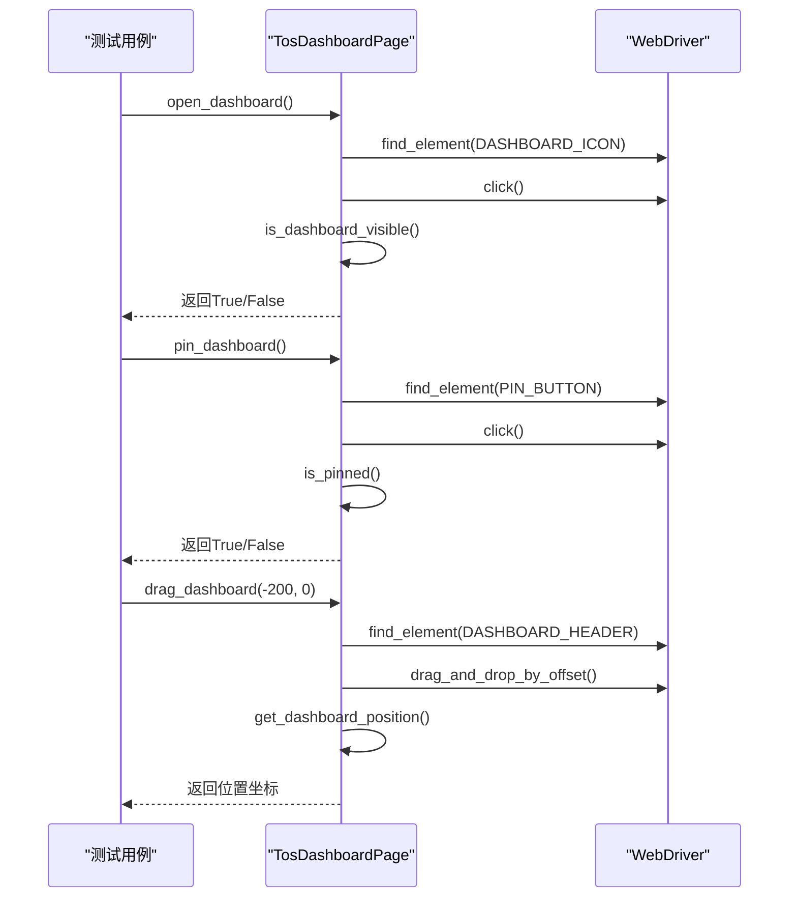
```mermaid
sequenceDiagram
participant T as "测试用例"
participant TBDP as "TosDashboardPage"
participant WD as "WebDriver"
T->>TBDP : open_dashboard()
TBDP->>WD : find_element(DASHBOARD_ICON)
TBDP->>WD : click()
TBDP->>TBDP : is_dashboard_visible()
TBDP-->>T : 返回True/False
T->>TBDP : pin_dashboard()
TBDP->>WD : find_element(PIN_BUTTON)
TBDP->>WD : click()
TBDP->>TBDP : is_pinned()
TBDP-->>T : 返回True/False
T->>TBDP : drag_dashboard(-200, 0)
TBDP->>WD : find_element(DASHBOARD_HEADER)
TBDP->>WD : drag_and_drop_by_offset()
TBDP->>TBDP : get_dashboard_position()
TBDP-->>T : 返回位置坐标
```

**图表来源**
- [ui_automation/pages/pages/tos_dashboard_page.py:30-94](file://ui_automation/pages/pages/tos_dashboard_page.py#L30-L94)
- [ui_automation/pages/pages/tos_dashboard_page.py:108-196](file://ui_automation/pages/pages/tos_dashboard_page.py#L108-L196)
- [ui_automation/pages/pages/tos_dashboard_page.py:200-287](file://ui_automation/pages/pages/tos_dashboard_page.py#L200-L287)

**章节来源**
- [ui_automation/pages/pages/tos_dashboard_page.py:22-288](file://ui_automation/pages/pages/tos_dashboard_page.py#L22-L288)

### 测试用例与数据管理
- **测试用例组织**
  - 使用pytest标记（ui/functional/regression/smoke等）分类测试
  - 通过driver与base_url fixture注入，避免重复初始化
  - 新增TOS用户设置界面冒烟测试，覆盖导航、Tab切换、字段验证等核心功能
  - 新增系统看板冒烟测试和设置面板测试，覆盖完整的看板功能
  - 支持参数化测试，提高测试覆盖率
  - **新增** 用户信息编辑测试使用时间戳确保每次输入值不同
  - **新增** 系统看板测试包含钉住、拖动、取消钉住、隐藏等完整流程
  - **新增** 设置面板测试验证模块勾选状态和卡片显示顺序
- **测试数据管理**
  - tos_login_data.yaml集中管理TOS系统的登录场景数据
  - user_fixtures.yaml提供用户预置数据，支持测试前置条件
  - 用例中动态加载YAML数据，减少硬编码
  - **新增** 系统看板测试使用期望的模块名称列表进行验证

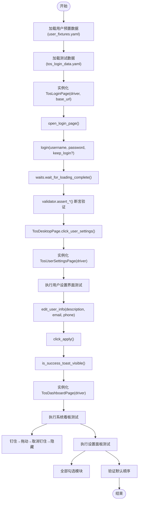
```mermaid
flowchart TD
Start(["开始"]) --> LoadFixtures["加载用户预置数据(user_fixtures.yaml)"]
LoadFixtures --> LoadData["加载测试数据(tos_login_data.yaml)"]
LoadData --> BuildLogin["实例化 TosLoginPage(driver, base_url)"]
BuildLogin --> OpenLogin["open_login_page()"]
OpenLogin --> DoLogin["login(username, password, keep_login?)"]
DoLogin --> WaitLoad["waits.wait_for_loading_complete()"]
WaitLoad --> ValidateLogin["validator.assert_*() 断言验证"]
ValidateLogin --> ClickUserSettings["TosDesktopPage.click_user_settings()"]
ClickUserSettings --> InitUserSettings["实例化 TosUserSettingsPage(driver)"]
InitUserSettings --> TestUserSettings["执行用户设置界面测试"]
TestUserSettings --> EditUserInfo["edit_user_info(description, email, phone)"]
EditUserInfo --> ApplyChanges["click_apply()"]
ApplyChanges --> ToastCheck["is_success_toast_visible()"]
ToastCheck --> InitDashboard["实例化 TosDashboardPage(driver)"]
InitDashboard --> TestDashboard["执行系统看板测试"]
TestDashboard --> PinDragUnpin["钉住→拖动→取消钉住→隐藏"]
TestDashboard --> SettingsTest["执行设置面板测试"]
SettingsTest --> CheckAllModules["全部勾选模块"]
SettingsTest --> VerifyOrder["验证默认顺序"]
VerifyOrder --> End(["结束"])
```

**图表来源**
- [ui_automation/testcases/smoke/test_tos_user_settings.py:35-59](file://ui_automation/testcases/smoke/test_tos_user_settings.py#L35-L59)
- [ui_automation/testcases/smoke/test_tos_user_settings.py:149-181](file://ui_automation/testcases/smoke/test_tos_user_settings.py#L149-L181)
- [ui_automation/testcases/smoke/test_tos_user_settings.py:183-218](file://ui_automation/testcases/smoke/test_tos_user_settings.py#L183-L218)
- [ui_automation/testcases/smoke/test_tos_dashboard.py:32-95](file://ui_automation/testcases/smoke/test_tos_dashboard.py#L32-95)
- [ui_automation/testcases/smoke/test_tos_dashboard_settings.py:35-134](file://ui_automation/testcases/smoke/test_tos_dashboard_settings.py#L35-134)

**章节来源**
- [ui_automation/testcases/smoke/test_tos_user_settings.py:30-219](file://ui_automation/testcases/smoke/test_tos_user_settings.py#L30-L219)
- [ui_automation/testcases/smoke/test_tos_dashboard.py:27-95](file://ui_automation/testcases/smoke/test_tos_dashboard.py#L27-95)
- [ui_automation/testcases/smoke/test_tos_dashboard_settings.py:29-134](file://ui_automation/testcases/smoke/test_tos_dashboard_settings.py#L29-134)
- [ui_automation/testdata/tos_login_data.yaml:1-11](file://ui_automation/testdata/tos_login_data.yaml#L1-L11)

### 配置与环境管理
- **Settings类**
  - 通过环境变量TEST_ENV选择环境，读取对应YAML配置
  - 提供属性访问（base_url、username、password、database、api、browser等）与通用get方法
- **环境配置**
  - test/dev/prod分别提供base_url、账号、数据库、API与浏览器配置
  - 浏览器配置包含类型、headless、隐式等待、页面加载超时等

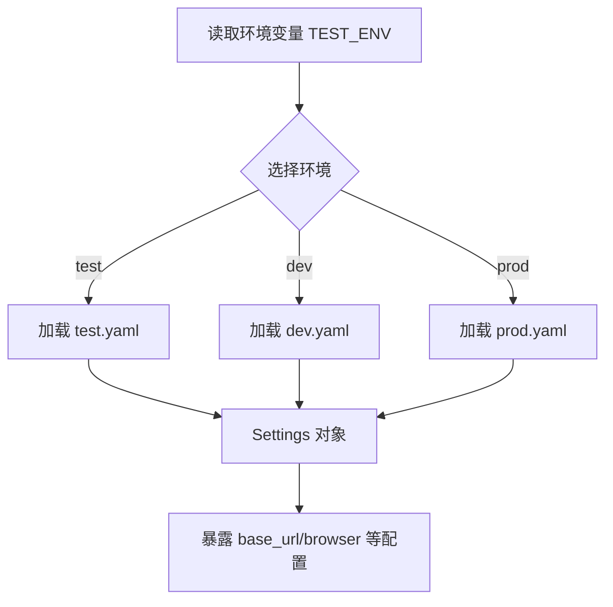
```mermaid
flowchart TD
EnvVar["读取环境变量 TEST_ENV"] --> ChooseEnv{"选择环境"}
ChooseEnv --> |test| LoadTest["加载 test.yaml"]
ChooseEnv --> |dev| LoadDev["加载 dev.yaml"]
ChooseEnv --> |prod| LoadProd["加载 prod.yaml"]
LoadTest --> SettingsObj["Settings 对象"]
LoadDev --> SettingsObj
LoadProd --> SettingsObj
SettingsObj --> Expose["暴露 base_url/browser 等配置"]
```

**图表来源**
- [config/settings.py:26-48](file://config/settings.py#L26-L48)
- [config/environments/test.yaml:1-31](file://config/environments/test.yaml#L1-L31)
- [config/environments/dev.yaml:1-31](file://config/environments/dev.yaml#L1-L31)
- [config/environments/prod.yaml:1-31](file://config/environments/prod.yaml#L1-L31)

**章节来源**
- [config/settings.py:13-104](file://config/settings.py#L13-L104)
- [config/environments/test.yaml:1-31](file://config/environments/test.yaml#L1-L31)
- [config/environments/dev.yaml:1-31](file://config/environments/dev.yaml#L1-L31)
- [config/environments/prod.yaml:1-31](file://config/environments/prod.yaml#L1-L31)

### 测试运行与失败截图
- **driver fixture**
  - 根据browser配置初始化Chrome/Firefox，设置隐式等待与页面加载超时
  - 每个测试函数独立实例，测试结束后自动关闭
- **失败自动截图**
  - pytest钩子在测试失败时自动保存截图至证据目录，文件名包含测试名与时间戳
- **自定义marker**
  - 注册ui/functional/regression/smoke等marker，避免pytest警告

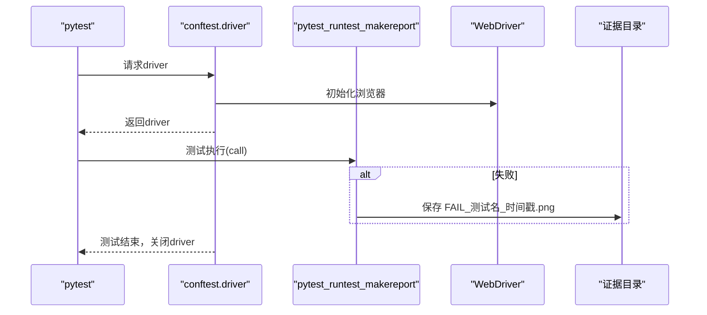
```mermaid
sequenceDiagram
participant Py as "pytest"
participant CF as "conftest.driver"
participant HK as "pytest_runtest_makereport"
participant WD as "WebDriver"
participant EV as "证据目录"
Py->>CF : 请求driver
CF->>WD : 初始化浏览器
CF-->>Py : 返回driver
Py->>HK : 测试执行(call)
alt 失败
HK->>EV : 保存 FAIL_测试名_时间戳.png
end
CF-->>Py : 测试结束，关闭driver
```

**图表来源**
- [conftest.py:25-78](file://conftest.py#L25-L78)
- [conftest.py:80-110](file://conftest.py#L80-L110)
- [pytest.ini:1-12](file://pytest.ini#L1-L12)

**章节来源**
- [conftest.py:25-122](file://conftest.py#L25-L122)
- [pytest.ini:1-12](file://pytest.ini#L1-L12)

## 系统仪表板测试框架

### 系统看板功能测试
**新增** TOS系统仪表板功能测试框架，专门处理看板的完整功能测试。

#### 设计理念
- 专门处理TOS系统看板的打开、钉住、拖动、隐藏等核心功能
- 支持设置面板的模块勾选/取消勾选，验证卡片显示状态
- 提供看板内滚动、卡片拖动等高级交互功能
- 适配Vue.js应用的特殊DOM结构和事件处理

#### 核心功能
- **看板控制**：打开/关闭看板、钉住/取消钉住、拖动看板位置
- **设置面板**：打开/关闭设置面板、获取模块选项、勾选/取消勾选模块
- **卡片管理**：滚动查看卡片、获取卡片名称、拖动卡片排序
- **状态验证**：验证看板可见性、钉住状态、卡片显示状态

#### 关键实现
- **定位器设计**：使用CSS选择器和XPath组合定位看板图标、面板、按钮等元素
- **ActionChains**：使用拖拽、点击等复杂交互操作
- **JavaScript执行**：使用execute_script进行特殊操作，如卡片拖动、面板滚动
- **状态检测**：通过CSS类名、元素属性等方式检测状态变化

```mermaid
sequenceDiagram
participant T as "测试用例"
participant TBDP as "TosDashboardPage"
participant WD as "WebDriver"
T->>TBDP : open_dashboard()
TBDP->>WD : find_element(DASHBOARD_ICON)
TBDP->>WD : click()
TBDP->>TBDP : is_dashboard_visible()
TBDP-->>T : 返回True/False
T->>TBDP : pin_dashboard()
TBDP->>WD : find_element(PIN_BUTTON)
TBDP->>WD : click()
TBDP->>TBDP : is_pinned()
TBDP-->>T : 返回True/False
T->>TBDP : drag_dashboard(-200, 0)
TBDP->>WD : find_element(DASHBOARD_HEADER)
TBDP->>WD : drag_and_drop_by_offset()
TBDP->>TBDP : get_dashboard_position()
TBDP-->>T : 返回位置坐标
```

**图表来源**
- [ui_automation/pages/pages/tos_dashboard_page.py:30-94](file://ui_automation/pages/pages/tos_dashboard_page.py#L30-L94)
- [ui_automation/pages/pages/tos_dashboard_page.py:108-196](file://ui_automation/pages/pages/tos_dashboard_page.py#L108-L196)
- [ui_automation/pages/pages/tos_dashboard_page.py:200-287](file://ui_automation/pages/pages/tos_dashboard_page.py#L200-L287)

**章节来源**
- [ui_automation/pages/pages/tos_dashboard_page.py:22-288](file://ui_automation/pages/pages/tos_dashboard_page.py#L22-L288)
- [ui_automation/pages/locators/tos_dashboard_locators.py:8-51](file://ui_automation/pages/locators/tos_dashboard_locators.py#L8-L51)
- [ui_automation/testcases/smoke/test_tos_dashboard.py:27-95](file://ui_automation/testcases/smoke/test_tos_dashboard.py#L27-95)

### 系统看板设置面板测试
**新增** 系统看板设置面板功能测试，专门处理模块勾选和卡片显示验证。

#### 设计理念
- 专门处理系统看板设置面板的模块勾选/取消勾选功能
- 验证设置面板中8个标准模块的存在性和默认勾选状态
- 支持重新勾选后验证卡片显示顺序的正确性
- 提供完整的初始化和恢复测试流程

#### 核心功能
- **模块验证**：验证设置面板包含所有8个标准模块
- **勾选控制**：支持全部勾选、全部取消、单个勾选/取消
- **状态检测**：验证模块的勾选状态和卡片显示状态
- **顺序验证**：验证卡片按默认顺序排列

#### 关键实现
- **模块枚举**：使用预定义的模块名称列表进行验证
- **状态检测**：通过CSS选择器和JavaScript执行检测勾选状态
- **顺序验证**：通过get_all_card_names获取完整卡片列表进行顺序检查
- **初始化策略**：通过check_all_modules确保测试前的一致状态

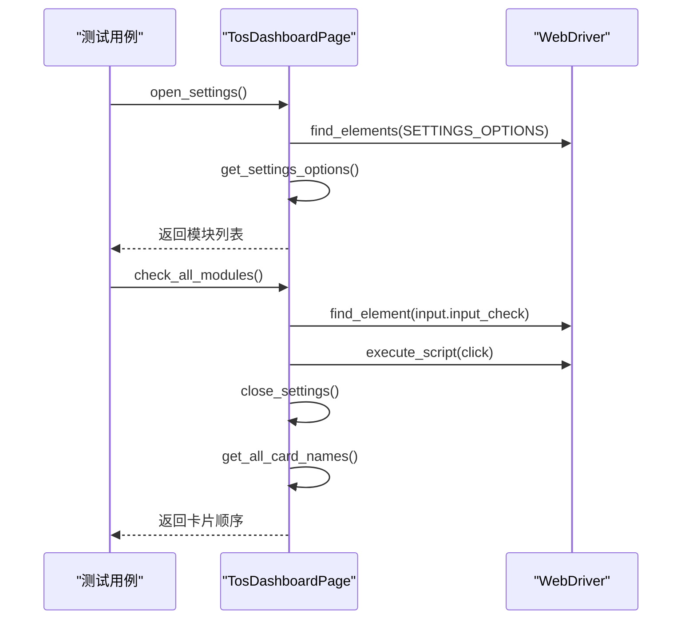
```mermaid
sequenceDiagram
participant T as "测试用例"
participant TBDP as "TosDashboardPage"
participant WD as "WebDriver"
T->>TBDP : open_settings()
TBDP->>WD : find_elements(SETTINGS_OPTIONS)
TBDP->>TBDP : get_settings_options()
TBDP-->>T : 返回模块列表
T->>TBDP : check_all_modules()
TBDP->>WD : find_element(input.input_check)
TBDP->>WD : execute_script(click)
TBDP->>TBDP : close_settings()
TBDP->>TBDP : get_all_card_names()
TBDP-->>T : 返回卡片顺序
```

**图表来源**
- [ui_automation/pages/pages/tos_dashboard_page.py:108-196](file://ui_automation/pages/pages/tos_dashboard_page.py#L108-L196)
- [ui_automation/testcases/smoke/test_tos_dashboard_settings.py:57-134](file://ui_automation/testcases/smoke/test_tos_dashboard_settings.py#L57-134)

**章节来源**
- [ui_automation/pages/pages/tos_dashboard_page.py:108-196](file://ui_automation/pages/pages/tos_dashboard_page.py#L108-L196)
- [ui_automation/testcases/smoke/test_tos_dashboard_settings.py:29-134](file://ui_automation/testcases/smoke/test_tos_dashboard_settings.py#L29-134)

### 系统看板定位器设计
**新增** 系统看板定位器类，提供稳定的元素定位策略。

#### 设计理念
- 将系统看板相关的元素定位器集中管理，便于维护和复用
- 使用CSS选择器和XPath组合，确保定位器的稳定性
- 支持看板图标、面板、按钮、设置面板、卡片等各类元素定位

#### 定位器分类
- **入口定位器**：DASHBOARD_ICON定位右侧栏系统看板图标
- **面板定位器**：DASHBOARD_PANEL、DASHBOARD_HEADER定位看板容器和头部
- **状态定位器**：PIN_BUTTON、PIN_BUTTON_ACTIVE、PIN_CONTAINER定位钉住状态
- **操作定位器**：DESKTOP_AREA、SETTINGS_ICON定位桌面空白区和设置图标
- **设置面板定位器**：SETTINGS_OPTIONS、SETTINGS_OPTION_NAME定位模块选项
- **卡片定位器**：CARD_TITLES、TIME_AREA定位卡片标题和时间区域

#### 关键实现
- **CSS选择器优先**：优先使用稳定的CSS选择器进行元素定位
- **XPath备用**：在CSS选择器无法满足时使用XPath进行精确定位
- **复合定位**：使用相对定位和祖先/后代关系确保定位器的准确性
- **状态检测**：通过CSS类名变化检测元素状态，如钉住状态的fix-on类

**章节来源**
- [ui_automation/pages/locators/tos_dashboard_locators.py:8-51](file://ui_automation/pages/locators/tos_dashboard_locators.py#L8-L51)

### 系统看板测试用例组织
**新增** 系统看板测试用例采用冒烟测试模式，覆盖完整的看板功能流程。

#### 测试分类
- **test_tos_dashboard.py**：系统看板核心功能测试，包含钉住、拖动、取消钉住、隐藏等完整流程
- **test_tos_dashboard_settings.py**：系统看板设置面板测试，包含模块勾选、卡片显示、顺序验证等功能

#### 测试数据管理
- **测试前置条件**：所有测试用例都要求已登录状态和看板打开状态
- **数据加载**：使用load_yaml_data动态加载登录数据
- **模块验证**：使用预定义的模块名称列表进行验证

#### 失败处理
- **自动截图**：测试失败时自动保存截图证据
- **日志记录**：详细的步骤日志和状态信息
- **断言验证**：多重断言确保测试结果准确性

**章节来源**
- [ui_automation/testcases/smoke/test_tos_dashboard.py:27-95](file://ui_automation/testcases/smoke/test_tos_dashboard.py#L27-95)
- [ui_automation/testcases/smoke/test_tos_dashboard_settings.py:29-134](file://ui_automation/testcases/smoke/test_tos_dashboard_settings.py#L29-134)
- [ui_automation/testdata/tos_login_data.yaml:1-11](file://ui_automation/testdata/tos_login_data.yaml#L1-L11)

## TOS桌面测试框架

### TOS桌面右键菜单测试
**新增** TOS桌面右键菜单测试框架，专门处理桌面区域的右键交互和菜单操作。

#### 设计理念
- 专门处理TOS桌面应用的右键菜单交互
- 支持菜单弹出验证、菜单项点击、刷新和用户设置功能
- 适配Vue.js应用的特殊DOM结构和事件处理

#### 核心功能
- **桌面右键操作**：在桌面空白区域执行右键，弹出右键菜单
- **菜单项验证**：获取菜单项列表，验证包含"刷新"和"用户设置"
- **菜单项点击**：通过菜单项名称定位并点击对应功能
- **状态验证**：验证菜单显示状态、桌面加载状态、用户设置界面打开状态

#### 关键实现
- **定位器设计**：使用CSS选择器和XPath组合定位桌面图标区域、右键菜单容器、菜单项
- **ActionChains**：使用右键上下文菜单进行交互
- **等待机制**：针对菜单弹出和消失设置适当的等待时间
- **日志记录**：详细的步骤日志和菜单项信息记录

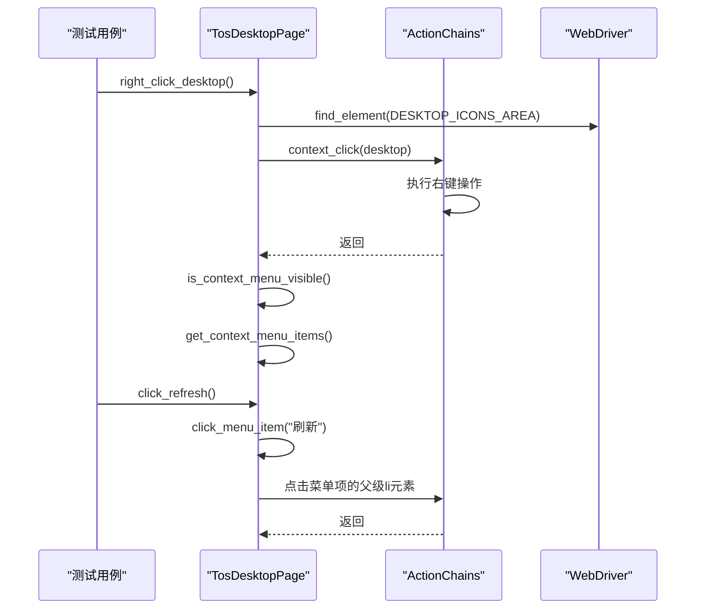
```mermaid
sequenceDiagram
participant T as "测试用例"
participant TDP as "TosDesktopPage"
participant AC as "ActionChains"
participant WD as "WebDriver"
T->>TDP : right_click_desktop()
TDP->>WD : find_element(DESKTOP_ICONS_AREA)
TDP->>AC : context_click(desktop)
AC->>AC : 执行右键操作
AC-->>TDP : 返回
TDP->>TDP : is_context_menu_visible()
TDP->>TDP : get_context_menu_items()
T->>TDP : click_refresh()
TDP->>TDP : click_menu_item("刷新")
TDP->>AC : 点击菜单项的父级li元素
AC-->>TDP : 返回
```

**图表来源**
- [ui_automation/pages/pages/tos_desktop_page.py:31-98](file://ui_automation/pages/pages/tos_desktop_page.py#L31-L98)
- [ui_automation/pages/locators/tos_desktop_locators.py:8-31](file://ui_automation/pages/locators/tos_desktop_locators.py#L8-L31)

**章节来源**
- [ui_automation/pages/pages/tos_desktop_page.py:20-98](file://ui_automation/pages/pages/tos_desktop_page.py#L20-L98)
- [ui_automation/pages/locators/tos_desktop_locators.py:8-31](file://ui_automation/pages/locators/tos_desktop_locators.py#L8-L31)
- [ui_automation/testcases/smoke/test_tos_desktop_menu.py:30-116](file://ui_automation/testcases/smoke/test_tos_desktop_menu.py#L30-L116)

### TOS两步式登录流程
**新增** TOS两步式登录流程自动化，专门处理Vue.js + 自定义组件的登录挑战。

#### 设计理念
- 适配TOS系统的两步式登录流程（用户名→密码）
- 处理非标准HTML元素（i图标元素而非button）
- 提供灵活的登录选项（保持登录勾选）

#### 核心功能
- **用户名输入**：在第一步输入用户名并点击下一步
- **密码输入**：在第二步输入密码并可选勾选保持登录
- **JS点击处理**：由于"下一步"按钮是i图标元素，使用JavaScript点击
- **登录验证**：通过URL变化、标题变化等方式验证登录成功

#### 关键实现
- **定位器设计**：使用CSS选择器精确定位用户名、密码输入框和i图标按钮
- **JS执行**：使用execute_script进行点击操作，绕过元素不可点击的问题
- **等待策略**：针对两步式流程设置适当的等待时间
- **验证机制**：多重验证策略确保登录成功

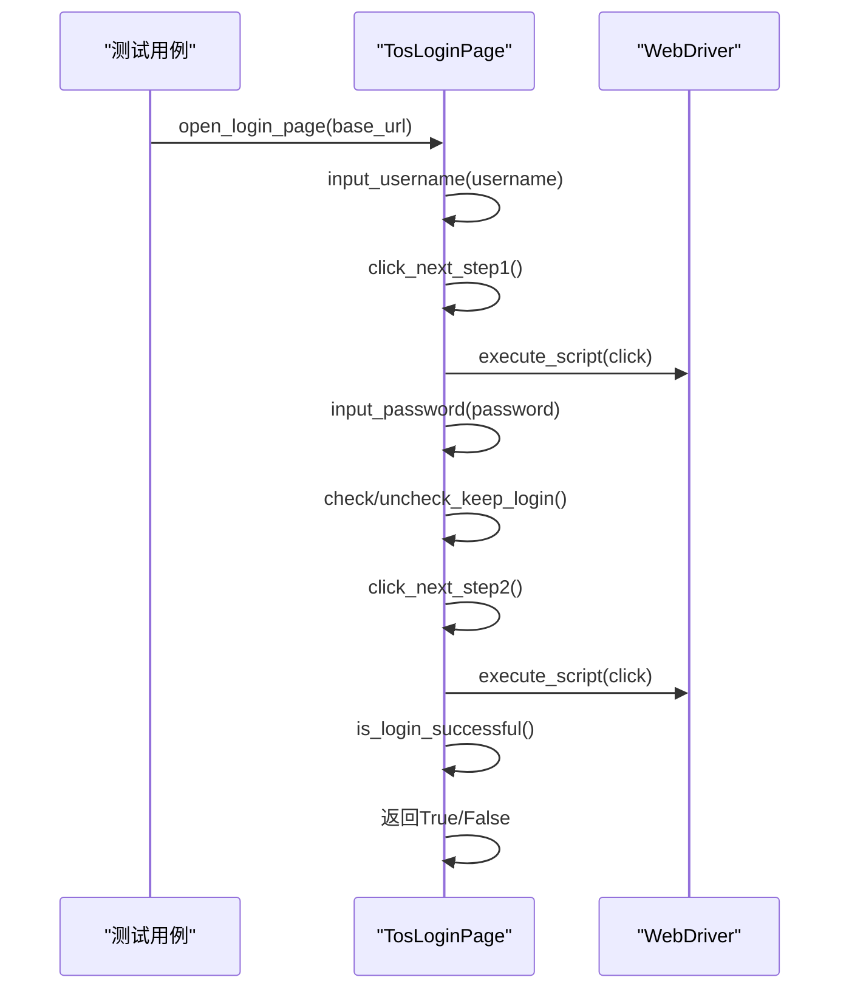
```mermaid
sequenceDiagram
participant T as "测试用例"
participant TLP as "TosLoginPage"
participant WD as "WebDriver"
T->>TLP : open_login_page(base_url)
TLP->>TLP : input_username(username)
TLP->>TLP : click_next_step1()
TLP->>WD : execute_script(click)
TLP->>TLP : input_password(password)
TLP->>TLP : check/uncheck_keep_login()
TLP->>TLP : click_next_step2()
TLP->>WD : execute_script(click)
TLP->>TLP : is_login_successful()
TLP->>TLP : 返回True/False
```

**图表来源**
- [ui_automation/pages/pages/tos_login_page.py:30-163](file://ui_automation/pages/pages/tos_login_page.py#L30-L163)
- [ui_automation/pages/locators/tos_login_locators.py:11-48](file://ui_automation/pages/locators/tos_login_locators.py#L11-L48)

**章节来源**
- [ui_automation/pages/pages/tos_login_page.py:18-163](file://ui_automation/pages/pages/tos_login_page.py#L18-L163)
- [ui_automation/pages/locators/tos_login_locators.py:11-48](file://ui_automation/pages/locators/tos_login_locators.py#L11-L48)
- [ui_automation/testcases/smoke/test_tos_login.py:29-105](file://ui_automation/testcases/smoke/test_tos_login.py#L29-L105)

### TOS导航栏交互测试
**新增** TOS桌面顶部导航栏交互测试，处理应用图标悬浮和点击操作。

#### 设计理念
- 处理TOS顶部pin条导航栏的复杂DOM结构
- 支持应用图标悬浮显示tooltip和点击打开应用
- 适配Vue.js组件的应用图标系统

#### 核心功能
- **图标悬浮**：移动鼠标到应用图标上触发tooltip显示
- **名称识别**：通过tooltip文字识别应用名称
- **应用点击**：点击应用图标打开对应应用窗口
- **应用验证**：验证应用窗口是否成功打开

#### 关键实现
- **定位器设计**：使用img[src*='关键词']模式精确定位应用图标
- **ActionChains**：使用move_to_element进行悬浮操作
- **Tooltip处理**：通过el-tooltip__popper定位器获取悬浮文字
- **点击策略**：点击应用图标的父级div.app-item元素

```mermaid
sequenceDiagram
participant T as "测试用例"
participant TNP as "TosNavbarPage"
participant AC as "ActionChains"
participant WD as "WebDriver"
T->>TNP : click_app_by_name("存储管理")
TNP->>WD : find_elements(ALL_APP_ITEMS)
loop 遍历每个图标
TNP->>AC : move_to_element(item)
AC->>AC : 触发tooltip显示
AC-->>TNP : 返回
TNP->>TNP : _get_tooltip_text()
alt 找到匹配应用
TNP->>AC : click(item)
AC-->>TNP : 返回
end
```

**图表来源**
- [ui_automation/pages/pages/tos_navbar_page.py:76-105](file://ui_automation/pages/pages/tos_navbar_page.py#L76-L105)
- [ui_automation/pages/locators/tos_navbar_locators.py:13-70](file://ui_automation/pages/locators/tos_navbar_locators.py#L13-L70)

**章节来源**
- [ui_automation/pages/pages/tos_navbar_page.py:22-234](file://ui_automation/pages/pages/tos_navbar_page.py#L22-L234)
- [ui_automation/pages/locators/tos_navbar_locators.py:13-70](file://ui_automation/pages/locators/tos_navbar_locators.py#L13-L70)
- [ui_automation/testcases/smoke/test_tos_navbar.py:32-180](file://ui_automation/testcases/smoke/test_tos_navbar.py#L32-L180)

### TOS测试用例组织
**新增** TOS测试用例采用冒烟测试模式，覆盖完整的桌面交互流程。

#### 测试分类
- **test_tos_desktop_menu.py**：桌面右键菜单功能测试
- **test_tos_login.py**：两步式登录流程测试
- **test_tos_navbar.py**：导航栏交互测试
- **test_tos_user_settings.py**：用户设置界面测试
- **test_tos_dashboard.py**：系统看板功能测试
- **test_tos_dashboard_settings.py**：系统看板设置面板测试

#### 测试数据管理
- **tos_login_data.yaml**：专门的TOS登录数据文件
- **测试前置条件**：所有测试用例都要求已登录状态
- **数据加载**：使用load_yaml_data动态加载测试数据

#### 失败处理
- **自动截图**：测试失败时自动保存截图证据
- **日志记录**：详细的步骤日志和状态信息
- **断言验证**：多重断言确保测试结果准确性

**章节来源**
- [ui_automation/testcases/smoke/test_tos_desktop_menu.py:30-116](file://ui_automation/testcases/smoke/test_tos_desktop_menu.py#L30-L116)
- [ui_automation/testcases/smoke/test_tos_login.py:29-105](file://ui_automation/testcases/smoke/test_tos_login.py#L29-L105)
- [ui_automation/testcases/smoke/test_tos_navbar.py:32-180](file://ui_automation/testcases/smoke/test_tos_navbar.py#L32-L180)
- [ui_automation/testcases/smoke/test_tos_user_settings.py:30-219](file://ui_automation/testcases/smoke/test_tos_user_settings.py#L30-L219)
- [ui_automation/testcases/smoke/test_tos_dashboard.py:27-95](file://ui_automation/testcases/smoke/test_tos_dashboard.py#L27-95)
- [ui_automation/testcases/smoke/test_tos_dashboard_settings.py:29-134](file://ui_automation/testcases/smoke/test_tos_dashboard_settings.py#L29-134)
- [ui_automation/testdata/tos_login_data.yaml:1-11](file://ui_automation/testdata/tos_login_data.yaml#L1-L11)

## TOS用户设置界面测试框架

### 用户设置界面冒烟测试
**新增** TOS用户设置界面自动化测试框架，专门处理用户设置界面的完整功能测试。

#### 设计理念
- 专门处理TOS用户设置界面的导航、Tab切换、字段验证等操作
- 从桌面右键菜单打开用户设置界面，验证界面加载和功能完整性
- 支持左侧导航模块切换和Tab标签切换的完整测试流程
- **新增** 支持Vue组件兼容性的用户信息编辑功能
- **新增** 成功提示toast检测机制，验证设置操作的成功状态
- **新增** '其它' Tab复选框批量操作功能

#### 核心功能
- **界面加载验证**：验证用户设置界面是否正确加载完成
- **导航模块验证**：验证左侧导航包含"账号"和"显示"模块
- **Tab标签验证**：验证账号模块包含"用户信息"、"账号安全"、"其它" Tab
- **导航切换测试**：测试左侧导航模块之间的切换功能
- **Tab切换测试**：测试账号模块内Tab标签的切换功能
- **字段验证**：验证用户名、角色等关键字段显示状态
- **用户信息编辑**：支持描述、邮箱、电话字段的输入和保存
- **成功提示检测**：验证设置操作的成功状态
- **复选框批量操作**：支持'其它' Tab中复选框的勾选/取消勾选

#### 关键实现
- **定位器设计**：使用CSS选择器和XPath组合定位导航项、Tab标签、字段标签
- **等待策略**：针对界面加载和Tab切换设置适当的等待时间
- **截图验证**：在关键步骤保存截图证据，便于问题复盘
- **日志记录**：详细的步骤日志和验证信息记录
- **Vue组件兼容性**：使用ActionChains进行输入框清空和值变化检测

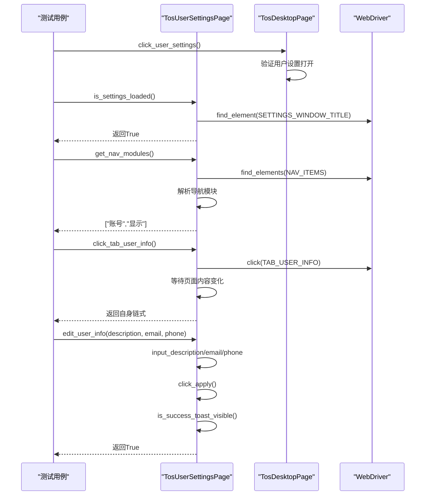
```mermaid
sequenceDiagram
participant T as "测试用例"
participant TUSP as "TosUserSettingsPage"
participant TDP as "TosDesktopPage"
participant WD as "WebDriver"
T->>TDP : click_user_settings()
TDP->>TDP : 验证用户设置打开
T->>TUSP : is_settings_loaded()
TUSP->>WD : find_element(SETTINGS_WINDOW_TITLE)
TUSP-->>T : 返回True
T->>TUSP : get_nav_modules()
TUSP->>WD : find_elements(NAV_ITEMS)
TUSP->>TUSP : 解析导航模块
TUSP-->>T : ["账号","显示"]
T->>TUSP : click_tab_user_info()
TUSP->>WD : click(TAB_USER_INFO)
TUSP->>TUSP : 等待页面内容变化
TUSP-->>T : 返回自身链式
T->>TUSP : edit_user_info(description, email, phone)
TUSP->>TUSP : input_description/email/phone
TUSP->>TUSP : click_apply()
TUSP->>TUSP : is_success_toast_visible()
TUSP-->>T : 返回True
```

**图表来源**
- [ui_automation/pages/pages/tos_user_settings_page.py:27-52](file://ui_automation/pages/pages/tos_user_settings_page.py#L27-L52)
- [ui_automation/pages/pages/tos_user_settings_page.py:72-91](file://ui_automation/pages/pages/tos_user_settings_page.py#L72-L91)
- [ui_automation/testcases/smoke/test_tos_user_settings.py:149-181](file://ui_automation/testcases/smoke/test_tos_user_settings.py#L149-L181)

**章节来源**
- [ui_automation/pages/pages/tos_user_settings_page.py:19-239](file://ui_automation/pages/pages/tos_user_settings_page.py#L19-L239)
- [ui_automation/pages/locators/tos_user_settings_locators.py:8-52](file://ui_automation/pages/locators/tos_user_settings_locators.py#L8-L52)
- [ui_automation/testcases/smoke/test_tos_user_settings.py:30-219](file://ui_automation/testcases/smoke/test_tos_user_settings.py#L30-L219)

### 用户设置页面对象设计与实现
- **设计理念**
  - 专门处理TOS用户设置界面的导航、Tab切换、字段验证等操作
  - 继承BasePage，复用通用能力并集成三大辅助工具
  - 支持链式调用，提供流畅的业务方法调用体验
  - 专注于用户设置界面的完整功能测试
  - **新增** Vue组件兼容性处理，支持现代Web框架的输入框操作
- **核心能力**
  - 界面验证：is_settings_loaded验证界面加载完成、get_nav_modules获取导航模块列表、get_tab_items获取Tab标签列表
  - 导航操作：click_nav_account点击账号模块、click_nav_display点击显示模块
  - Tab操作：click_tab_user_info点击用户信息Tab、click_tab_account_security点击账号安全Tab、click_tab_other点击其它Tab
  - 字段验证：is_username_displayed验证用户名显示、is_role_displayed验证角色显示
  - **新增** 用户信息编辑：input_description输入描述、input_email输入邮箱、input_phone输入电话
  - **新增** 成功提示检测：is_success_toast_visible检测成功提示
  - **新增** 复选框操作：check_all_other_checkboxes勾选所有复选框、uncheck_all_other_checkboxes取消勾选所有复选框
- **定位器使用**
  - 使用TosUserSettingsLocators集中管理用户设置界面的元素定位器
  - 支持CSS选择器和XPath组合定位，确保定位器的稳定性
  - **新增** 用户信息编辑定位器：描述、邮箱、电话输入框的精确定位

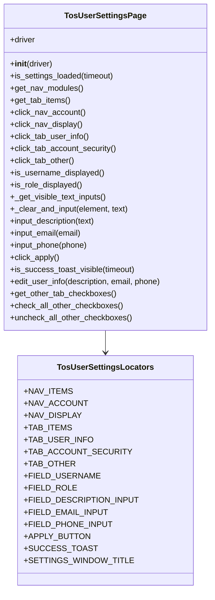
```mermaid
classDiagram
class TosUserSettingsPage {
+driver
+__init__(driver)
+is_settings_loaded(timeout)
+get_nav_modules()
+get_tab_items()
+click_nav_account()
+click_nav_display()
+click_tab_user_info()
+click_tab_account_security()
+click_tab_other()
+is_username_displayed()
+is_role_displayed()
+_get_visible_text_inputs()
+_clear_and_input(element, text)
+input_description(text)
+input_email(email)
+input_phone(phone)
+click_apply()
+is_success_toast_visible(timeout)
+edit_user_info(description, email, phone)
+get_other_tab_checkboxes()
+check_all_other_checkboxes()
+uncheck_all_other_checkboxes()
}
class TosUserSettingsLocators {
+NAV_ITEMS
+NAV_ACCOUNT
+NAV_DISPLAY
+TAB_ITEMS
+TAB_USER_INFO
+TAB_ACCOUNT_SECURITY
+TAB_OTHER
+FIELD_USERNAME
+FIELD_ROLE
+FIELD_DESCRIPTION_INPUT
+FIELD_EMAIL_INPUT
+FIELD_PHONE_INPUT
+APPLY_BUTTON
+SUCCESS_TOAST
+SETTINGS_WINDOW_TITLE
}
TosUserSettingsPage --> TosUserSettingsLocators
```

**图表来源**
- [ui_automation/pages/pages/tos_user_settings_page.py:19-239](file://ui_automation/pages/pages/tos_user_settings_page.py#L19-L239)
- [ui_automation/pages/locators/tos_user_settings_locators.py:8-52](file://ui_automation/pages/locators/tos_user_settings_locators.py#L8-L52)

**章节来源**
- [ui_automation/pages/pages/tos_user_settings_page.py:19-239](file://ui_automation/pages/pages/tos_user_settings_page.py#L19-L239)
- [ui_automation/pages/locators/tos_user_settings_locators.py:8-52](file://ui_automation/pages/locators/tos_user_settings_locators.py#L8-L52)

### 用户设置测试用例设计与实现
- **测试场景**
  - 用户设置界面加载，左侧导航显示"账号"和"显示"
  - 账号模块 Tab 显示"用户信息"、"账号安全"、"其它"
  - 左侧导航切换（账号 ↔ 显示）
  - Tab 切换（用户信息 / 账号安全 / 其它）
  - **新增** 用户信息编辑测试：描述、邮箱、电话字段的输入验证
  - **新增** 成功提示检测测试：设置操作成功状态验证
  - **新增** 复选框批量操作测试：'其它' Tab中复选框的勾选/取消勾选
- **前置条件**
  - 已登录 TOS，通过桌面右键打开用户设置
  - 使用TosLoginPage进行登录，使用TosDesktopPage打开用户设置
- **测试流程**
  - 登录 → 右键打开用户设置 → 初始化用户设置页面对象 → 执行各项测试
  - 每个关键步骤保存截图证据，便于问题复盘
  - **新增** 用户信息编辑测试使用时间戳确保每次输入值不同
- **断言验证**
  - 使用断言验证导航模块、Tab标签、界面加载状态
  - **新增** 使用is_success_toast_visible验证设置操作成功状态
  - 支持详细的日志记录和错误信息输出

**章节来源**
- [ui_automation/testcases/smoke/test_tos_user_settings.py:30-219](file://ui_automation/testcases/smoke/test_tos_user_settings.py#L30-L219)

## Vue组件兼容性处理

### Vue组件兼容性挑战
现代Web应用（如Vue.js）中的输入框存在特殊的值变化检测机制，传统的clear()方法可能无法触发Vue的响应式更新。这导致即使输入框内容被清空，Vue组件仍然认为值没有变化，从而影响后续的输入操作和断言验证。

### 解决方案设计
针对Vue组件的兼容性问题，采用了ActionChains + 键盘快捷键的综合解决方案：

#### 输入框清空策略
- **全选操作**：使用`ActionChains.key_down(Keys.COMMAND).send_keys('a').key_up(Keys.COMMAND)`进行全选
- **删除操作**：使用`ActionChains.send_keys(Keys.BACKSPACE)`删除选中内容
- **延迟控制**：在每个操作之间添加适当的延迟，确保Vue组件有足够时间响应

#### Vue事件触发机制
- **真实点击**：对于某些Vue组件，必须使用ActionChains的真实点击而非JavaScript点击
- **键盘事件**：通过键盘快捷键确保Vue组件能够检测到值的变化
- **ActionChains集成**：在TosUserSettingsPage中集成ActionChains以支持Vue组件的特殊需求

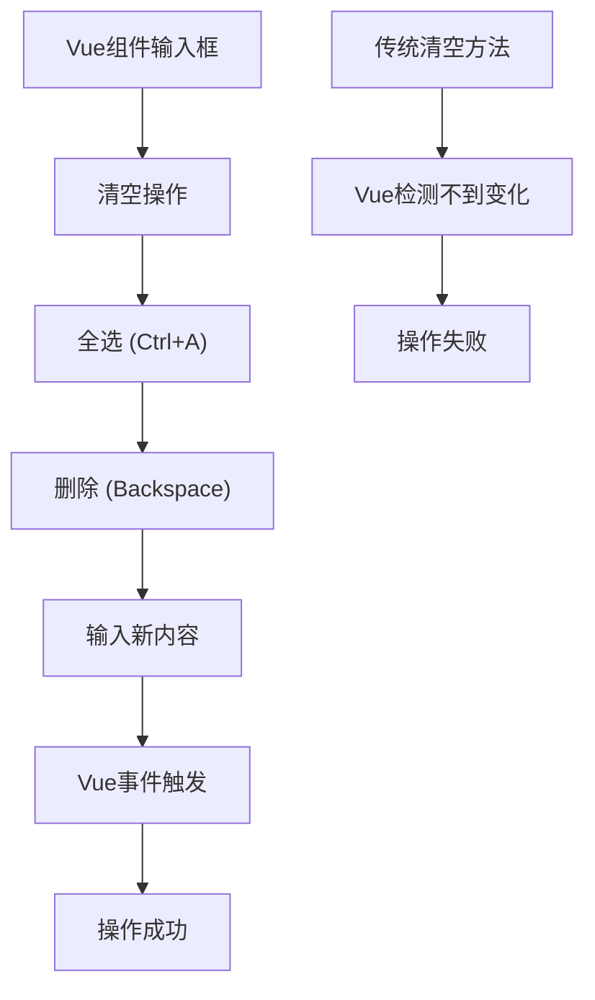
```mermaid
flowchart TD
VueInput["Vue组件输入框"] --> Clear["清空操作"]
Clear --> SelectAll["全选 (Ctrl+A)"]
SelectAll --> Delete["删除 (Backspace)"]
Delete --> Input["输入新内容"]
Input --> Trigger["Vue事件触发"]
Trigger --> Success["操作成功"]
TraditionalClear["传统清空方法"] --> VueDetect["Vue检测不到变化"]
VueDetect --> Fail["操作失败"]
```

**图表来源**
- [ui_automation/pages/pages/tos_user_settings_page.py:114-131](file://ui_automation/pages/pages/tos_user_settings_page.py#L114-L131)
- [ui_automation/pages/helpers/action_helpers.py:106-114](file://ui_automation/pages/helpers/action_helpers.py#L106-L114)

### 关键实现细节
- **延迟控制**：在清空操作中使用`time.sleep()`确保Vue组件有足够时间响应
- **ActionChains集成**：在TosUserSettingsPage中直接使用ActionChains进行Vue组件操作
- **错误处理**：对Vue组件的特殊操作提供详细的日志记录和异常处理
- **兼容性验证**：通过多次测试验证Vue组件兼容性处理的有效性

**章节来源**
- [ui_automation/pages/pages/tos_user_settings_page.py:114-131](file://ui_automation/pages/pages/tos_user_settings_page.py#L114-L131)
- [ui_automation/pages/helpers/action_helpers.py:106-114](file://ui_automation/pages/helpers/action_helpers.py#L106-L114)

### 用户信息编辑功能
基于Vue组件兼容性处理，新增了完整的用户信息编辑功能：

#### 字段定位策略
- **描述输入框**：使用`(//input[contains(@class,'Xinput-input__inner') and @type='text' and not(contains(@class,'TosInput'))])[1]`定位第一个可见文本输入框
- **邮箱输入框**：使用`(//input[contains(@class,'Xinput-input__inner') and @type='text' and not(contains(@class,'TosInput'))])[2]`定位第二个可见文本输入框
- **电话输入框**：使用`(//input[contains(@class,'Xinput-input__inner') and @type='text' and not(contains(@class,'TosInput'))])[3]`定位第三个可见文本输入框

#### 编辑流程
- **字段发现**：通过`_get_visible_text_inputs()`方法获取所有可见的文本输入框
- **清空处理**：使用`_clear_and_input()`方法确保Vue组件能够检测到值变化
- **应用保存**：使用ActionChains进行真实点击，确保Vue事件正确触发

**章节来源**
- [ui_automation/pages/pages/tos_user_settings_page.py:105-158](file://ui_automation/pages/pages/tos_user_settings_page.py#L105-L158)
- [ui_automation/pages/locators/tos_user_settings_locators.py:32-39](file://ui_automation/pages/locators/tos_user_settings_locators.py#L32-L39)

### 成功提示检测机制
针对TOS应用中快速消失的成功提示（toast），采用了独特的检测机制：

#### 检测策略
- **页面源码扫描**：通过检查`page_source`中是否包含"设置成功"或"操作成功"来确认提示状态
- **轮询机制**：在指定时间内循环检查页面源码，确保捕获到短暂出现的提示
- **超时控制**：设置合理的超时时间，平衡检测准确性和测试效率

#### 实现细节
- **时间控制**：使用`time.time()`和`time.sleep()`实现精确的时间控制
- **异常处理**：在检测过程中忽略临时异常，提高检测的稳定性
- **日志记录**：详细记录检测过程和结果，便于问题排查

**章节来源**
- [ui_automation/pages/pages/tos_user_settings_page.py:170-188](file://ui_automation/pages/pages/tos_user_settings_page.py#L170-L188)

### '其它' Tab复选框操作
新增了对'其它' Tab中复选框的批量操作功能：

#### 复选框识别
- **定位策略**：使用`input.input_check` CSS选择器定位所有复选框
- **可见性过滤**：通过`is_displayed()`方法过滤出可见的复选框
- **状态检测**：使用`is_selected()`方法检测复选框的当前状态

#### 批量操作
- **勾选所有**：遍历所有未勾选的复选框，逐个点击勾选
- **取消勾选**：遍历所有已勾选的复选框，逐个点击取消
- **延迟控制**：在每个操作之间添加延迟，确保Vue组件有足够时间响应状态变化

**章节来源**
- [ui_automation/pages/pages/tos_user_settings_page.py:211-238](file://ui_automation/pages/pages/tos_user_settings_page.py#L211-L238)

## 依赖分析
- **外部依赖**
  - pytest系列：pytest、pytest-html、pytest-xdist
  - selenium：selenium
  - 数据处理：PyYAML、openpyxl
  - 日志：loguru
  - 报告（可选）：allure-pytest
- **内部依赖**
  - BasePage依赖common/logger与Selenium，集成三大辅助工具
  - BaseComponent依赖common/logger与Selenium
  - TosDesktopPage、TosLoginPage、TosNavbarPage、TosUserSettingsPage、TosDashboardPage依赖BasePage及其组件
  - 各辅助工具类依赖common/logger与Selenium
  - conftest依赖config/settings与common/logger
  - Settings依赖YAML与环境变量

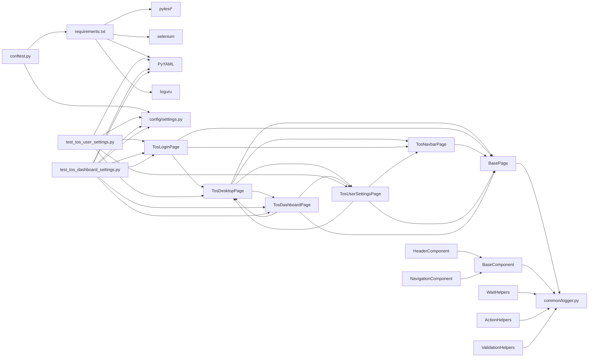
```mermaid
graph LR
REQ["requirements.txt"] --> PY["pytest*"]
REQ --> SELENIUM["selenium"]
REQ --> YAML["PyYAML"]
REQ --> LOGURU["loguru"]
CF["conftest.py"] --> REQ
CF --> ST["config/settings.py"]
BP["BasePage"] --> LOG["common/logger.py"]
BC["BaseComponent"] --> LOG
WH["WaitHelpers"] --> LOG
AH["ActionHelpers"] --> LOG
VH["ValidationHelpers"] --> LOG
TDP["TosDesktopPage"] --> BP
TLP["TosLoginPage"] --> BP
TNP["TosNavbarPage"] --> BP
TUSP["TosUserSettingsPage"] --> BP
TBDP["TosDashboardPage"] --> BP
HC["HeaderComponent"] --> BC
NC["NavigationComponent"] --> BC
TDP --> TNP
TDP --> TUSP
TDP --> TBDP
TLP --> TDP
TLP --> TNP
TUSP --> TDP
TUSP --> TNP
TBDP --> TDP
TBDP --> TUSP
TC["test_tos_user_settings.py"] --> TUSP
TC --> TDP
TC --> TLP
TC --> ST
TC --> YAML
TCD["test_tos_dashboard.py"] --> TBDP
TCD --> TLP
TCD --> ST
TCD --> YAML
TCD["test_tos_dashboard_settings.py"] --> TBDP
TCD --> TLP
TCD --> ST
TCD --> YAML
```

**图表来源**
- [requirements.txt:1-21](file://requirements.txt#L1-L21)
- [conftest.py:19-21](file://conftest.py#L19-L21)
- [config/settings.py:9-10](file://config/settings.py#L9-L10)
- [common/logger.py:12](file://common/logger.py#L12)
- [ui_automation/pages/base_page.py:28-31](file://ui_automation/pages/base_page.py#L28-L31)
- [ui_automation/pages/components/base_component.py:10-13](file://ui_automation/pages/components/base_component.py#L10-L13)
- [ui_automation/pages/helpers/wait_helpers.py:5-12](file://ui_automation/pages/helpers/wait_helpers.py#L5-L12)
- [ui_automation/pages/helpers/action_helpers.py:5-12](file://ui_automation/pages/helpers/action_helpers.py#L5-L12)
- [ui_automation/pages/helpers/validation_helpers.py:5-11](file://ui_automation/pages/helpers/validation_helpers.py#L5-L11)
- [ui_automation/pages/pages/tos_desktop_page.py:13-15](file://ui_automation/pages/pages/tos_desktop_page.py#L13-L15)
- [ui_automation/pages/pages/tos_login_page.py:11-13](file://ui_automation/pages/pages/tos_login_page.py#L11-L13)
- [ui_automation/pages/pages/tos_navbar_page.py:15-17](file://ui_automation/pages/pages/tos_navbar_page.py#L15-L17)
- [ui_automation/pages/pages/tos_user_settings_page.py:12-14](file://ui_automation/pages/pages/tos_user_settings_page.py#L12-L14)
- [ui_automation/pages/pages/tos_dashboard_page.py:15-16](file://ui_automation/pages/pages/tos_dashboard_page.py#L15-L16)

**章节来源**
- [requirements.txt:1-21](file://requirements.txt#L1-L21)
- [conftest.py:19-21](file://conftest.py#L19-L21)
- [config/settings.py:9-10](file://config/settings.py#L9-L10)
- [common/logger.py:12](file://common/logger.py#L12)
- [ui_automation/pages/base_page.py:28-31](file://ui_automation/pages/base_page.py#L28-L31)
- [ui_automation/pages/components/base_component.py:10-13](file://ui_automation/pages/components/base_component.py#L10-L13)
- [ui_automation/pages/helpers/wait_helpers.py:5-12](file://ui_automation/pages/helpers/wait_helpers.py#L5-L12)
- [ui_automation/pages/helpers/action_helpers.py:5-12](file://ui_automation/pages/helpers/action_helpers.py#L5-L12)
- [ui_automation/pages/helpers/validation_helpers.py:5-11](file://ui_automation/pages/helpers/validation_helpers.py#L5-L11)
- [ui_automation/pages/pages/tos_desktop_page.py:13-15](file://ui_automation/pages/pages/tos_desktop_page.py#L13-L15)
- [ui_automation/pages/pages/tos_login_page.py:11-13](file://ui_automation/pages/pages/tos_login_page.py#L11-L13)
- [ui_automation/pages/pages/tos_navbar_page.py:15-17](file://ui_automation/pages/pages/tos_navbar_page.py#L15-L17)
- [ui_automation/pages/pages/tos_user_settings_page.py:12-14](file://ui_automation/pages/pages/tos_user_settings_page.py#L12-L14)
- [ui_automation/pages/pages/tos_dashboard_page.py:15-16](file://ui_automation/pages/pages/tos_dashboard_page.py#L15-L16)

## 性能考虑
- **等待策略**
  - 优先使用显式等待（WebDriverWait + EC），针对元素可见、可点击、URL变化等场景
  - 合理设置超时时间，避免过长导致测试耗时增加
  - 使用WaitHelpers的带重试功能，提高等待成功率
  - **新增** 用户设置界面测试中针对Tab切换设置适当的等待时间
  - **新增** Vue组件兼容性处理中使用延迟控制确保操作的稳定性
  - **新增** 系统看板测试中针对面板打开、设置面板加载设置适当的等待时间
- **组件复用**
  - 通过BaseComponent实现UI组件复用，减少重复代码和维护成本
  - 组件范围内的元素查找避免全局搜索，提高定位效率
- **浏览器配置**
  - 无头模式(headless)可显著提升CI效率，但可能影响部分动态渲染
  - 固定窗口尺寸有助于稳定截图与布局
- **资源管理**
  - 每个测试函数独立driver实例，避免状态污染
  - 测试结束后及时quit，释放资源
- **数据与报告**
  - 使用pytest-html生成HTML报告，便于团队共享
  - 可选allure-pytest生成更丰富的测试报告
- **TOS特殊考虑**
  - Vue.js应用需要额外的渲染等待时间
  - i图标元素需要JS点击而非普通click
  - 右键菜单操作需要适当的延迟时间
  - **新增** 用户设置界面的Tab切换需要额外的等待时间
  - **新增** Vue组件输入框操作需要ActionChains配合键盘快捷键
  - **新增** 成功提示检测需要轮询机制和页面源码扫描
  - **新增** 复选框批量操作需要延迟控制和状态检测
  - **新增** 系统看板面板滚动需要JavaScript执行和ActionChains结合
  - **新增** 系统看板卡片拖动需要多步骤移动和真实拖动模拟

## 故障排除指南
- **元素定位失败**
  - 检查定位器是否随页面更新而变更；优先使用稳定的选择器（如ID、CSS）
  - 在BasePage中使用显式等待，必要时增加超时时间
  - 使用WaitHelpers的带重试功能提高定位成功率
  - **新增** 用户设置界面中检查导航模块和Tab标签的定位器
  - **新增** Vue组件输入框定位器需要考虑CSS类名的动态变化
  - **新增** 系统看板定位器需要考虑Vue.js组件的DOM结构变化
- **页面跳转/URL断言失败**
  - 使用wait_for_url_contains等待URL变化，确认断言条件
  - 使用WaitHelpers的wait_for_url_change进行更精确的URL等待
  - **新增** 用户设置界面验证使用窗口标题定位器
- **组件操作失败**
  - 检查组件根元素定位器是否正确
  - 确保组件在页面中可见后再进行操作
  - 使用组件的is_visible方法进行状态验证
  - **新增** Vue组件操作需要使用ActionChains而非JavaScript
  - **新增** 系统看板面板操作需要JavaScript执行而非普通click
- **截图与证据**
  - BasePage与conftest均提供失败截图能力，确保证据目录存在且可写
  - 截图命名包含时间戳，便于区分
  - **新增** 用户设置界面测试中在关键步骤保存截图证据
  - **新增** 系统看板测试中在钉住、拖动、设置等关键步骤保存截图证据
- **日志定位**
  - 使用common/logger统一输出，关注ERROR级别日志与异常堆栈
  - 各辅助工具类都有详细的日志记录，便于问题追踪
- **环境配置**
  - 确认TEST_ENV与对应YAML配置一致，检查base_url与浏览器参数
- **TOS特殊问题**
  - **右键菜单**：检查桌面图标区域定位器，确保context_click目标正确
  - **两步式登录**：确认i图标元素定位器，使用execute_script进行点击
  - **导航栏**：检查img[src*='关键词']定位器，确保应用图标正确识别
  - **用户设置界面**：检查CSS选择器和XPath组合定位器的稳定性
  - **Vue组件**：使用ActionChains进行输入框清空和值变化检测
  - **成功提示**：通过页面源码扫描而非元素定位器检测
  - **复选框操作**：确保复选框可见性和状态检测的准确性
  - **系统看板**：检查CSS选择器和XPath组合定位器的稳定性
  - **面板滚动**：使用JavaScript执行scrollTop而非ActionChains
  - **卡片拖动**：使用click_and_hold + 多步骤移动模拟真实拖动
  - **设置面板**：通过execute_script点击input.input_check元素
- **Vue组件兼容性问题**
  - **输入框清空**：使用ActionChains全选+删除而非clear()方法
  - **键盘事件**：确保键盘快捷键能够触发Vue组件的响应式更新
  - **真实点击**：某些Vue组件必须使用ActionChains的真实点击
  - **延迟控制**：在Vue组件操作中添加适当的延迟时间

**章节来源**
- [ui_automation/pages/base_page.py:60-84](file://ui_automation/pages/base_page.py#L60-L84)
- [ui_automation/pages/helpers/wait_helpers.py:23-37](file://ui_automation/pages/helpers/wait_helpers.py#L23-L37)
- [ui_automation/pages/components/base_component.py:64-74](file://ui_automation/pages/components/base_component.py#L64-L74)
- [conftest.py:93-110](file://conftest.py#L93-L110)
- [common/logger.py:40-56](file://common/logger.py#L40-L56)
- [ui_automation/pages/pages/tos_desktop_page.py:31-98](file://ui_automation/pages/pages/tos_desktop_page.py#L31-L98)
- [ui_automation/pages/pages/tos_login_page.py:47-90](file://ui_automation/pages/pages/tos_login_page.py#L47-L90)
- [ui_automation/pages/pages/tos_navbar_page.py:43-105](file://ui_automation/pages/pages/tos_navbar_page.py#L43-L105)
- [ui_automation/pages/pages/tos_user_settings_page.py:27-52](file://ui_automation/pages/pages/tos_user_settings_page.py#L27-L52)
- [ui_automation/pages/pages/tos_user_settings_page.py:114-131](file://ui_automation/pages/pages/tos_user_settings_page.py#L114-L131)
- [ui_automation/pages/pages/tos_user_settings_page.py:170-188](file://ui_automation/pages/pages/tos_user_settings_page.py#L170-L188)
- [ui_automation/pages/pages/tos_user_settings_page.py:211-238](file://ui_automation/pages/pages/tos_user_settings_page.py#L211-L238)
- [ui_automation/pages/pages/tos_dashboard_page.py:30-94](file://ui_automation/pages/pages/tos_dashboard_page.py#L30-L94)
- [ui_automation/pages/pages/tos_dashboard_page.py:108-196](file://ui_automation/pages/pages/tos_dashboard_page.py#L108-L196)
- [ui_automation/pages/pages/tos_dashboard_page.py:200-287](file://ui_automation/pages/pages/tos_dashboard_page.py#L200-L287)

## 结论
新架构通过"定位器分离 + 组件组合 + 工具辅助"的三层次设计，实现了更高层次的模块化和可维护性。BasePage集成了三大辅助工具，BaseComponent实现了UI组件复用，WaitHelpers、ActionHelpers、ValidationHelpers分别承担等待、动作、验证职责，形成了清晰的功能边界。这种架构不仅提高了代码复用性，还增强了测试的稳定性和可维护性。结合pytest的fixture与钩子，能够高效地组织测试、自动失败截图与生成报告。

**更新** 新增的系统仪表板UI自动化框架进一步扩展了测试覆盖范围，专门处理TOS系统看板的完整功能测试。新增的TosDashboardPage页面对象支持看板的打开/关闭、钉住/取消钉住、拖动、设置面板操作等核心功能。新增的TosDashboardLocators定位器提供稳定的元素定位策略。新增的系统看板冒烟测试和设置面板测试套件，覆盖完整的业务流程测试。

**新增** 系统仪表板测试框架的建立，标志着TOS桌面应用自动化测试从基础功能测试向完整业务流程测试的重要转变。通过专门的定位器类和测试用例，确保了系统看板的完整功能测试，包括面板控制、设置管理、卡片操作等各个方面。新增的页面对象模块导出，支持系统看板页面对象的导入使用，完善了整个测试框架的结构。

建议在实际项目中充分利用组件复用机制，完善定位器管理，扩展辅助工具功能，并根据环境差异调整浏览器配置与超时参数。对于现代Web框架（如Vue.js）的应用，需要特别注意DOM结构的变化和组件渲染时机，适当增加等待时间和使用JS执行策略。系统看板测试框架的建立，为TOS桌面应用的自动化测试提供了更全面的解决方案。

## 附录

### 页面对象开发规范
- **定位器管理**
  - 将页面元素定位器集中定义在专门的locators目录中
  - 通用定位器定义在CommonLocators中，页面特定定位器定义在对应页面定位器类中
  - 使用类常量形式定义定位器，命名清晰，便于维护
  - **新增** 用户设置界面使用CSS选择器和XPath组合，确保定位器的稳定性
  - **新增** Vue组件输入框定位器需要考虑CSS类名的动态变化
  - **新增** 系统看板定位器使用CSS选择器和XPath组合，确保面板元素的准确定位
- **组件使用**
  - 页面对象通过组合BaseComponent实现可复用功能
  - 组件范围内的元素操作使用组件自身的find_element等方法
  - 通过组件实现页头、导航等跨页面功能
- **辅助工具使用**
  - 使用BasePage集成的waits、actions_helper、validator属性访问辅助工具
  - 根据场景选择合适的等待策略和断言方法
  - 支持链式调用，提高代码可读性
  - **新增** Vue组件操作需要使用ActionChains而非JavaScript
  - **新增** 系统看板面板操作需要JavaScript执行而非普通click
- **失败处理**
  - 使用BasePage提供的自动截图功能
  - 各辅助工具类都有详细的日志记录，便于问题定位
  - **新增** Vue组件兼容性处理需要详细的日志记录和异常处理
  - **新增** 系统看板测试中在关键步骤保存截图证据
- **TOS特殊规范**
  - **定位器**：优先使用CSS选择器，必要时使用XPath，避免绝对路径
  - **等待策略**：Vue.js应用需要额外的渲染等待时间
  - **点击操作**：i图标元素使用execute_script进行点击
  - **右键菜单**：使用ActionChains的context_click方法
  - **用户设置界面**：使用CSS选择器和XPath组合定位导航模块和Tab标签
  - **Vue组件**：使用ActionChains进行输入框清空和值变化检测
  - **成功提示**：通过页面源码扫描而非元素定位器检测
  - **复选框操作**：确保复选框可见性和状态检测的准确性
  - **系统看板**：使用CSS选择器和XPath组合定位面板元素
  - **面板滚动**：使用JavaScript执行scrollTop操作
  - **卡片拖动**：使用click_and_hold + 多步骤移动模拟真实拖动
  - **设置面板**：使用execute_script点击input.input_check元素

**章节来源**
- [ui_automation/pages/locators/common_locators.py:4-18](file://ui_automation/pages/locators/common_locators.py#L4-L18)
- [ui_automation/pages/pages/tos_desktop_page.py:20-98](file://ui_automation/pages/pages/tos_desktop_page.py#L20-L98)
- [ui_automation/pages/pages/tos_login_page.py:18-163](file://ui_automation/pages/pages/tos_login_page.py#L18-L163)
- [ui_automation/pages/pages/tos_navbar_page.py:22-234](file://ui_automation/pages/pages/tos_navbar_page.py#L22-L234)
- [ui_automation/pages/pages/tos_user_settings_page.py:19-239](file://ui_automation/pages/pages/tos_user_settings_page.py#L19-L239)
- [ui_automation/pages/pages/tos_dashboard_page.py:22-288](file://ui_automation/pages/pages/tos_dashboard_page.py#L22-L288)
- [ui_automation/pages/locators/tos_dashboard_locators.py:8-51](file://ui_automation/pages/locators/tos_dashboard_locators.py#L8-L51)
- [ui_automation/pages/components/header_component.py:13-66](file://ui_automation/pages/components/header_component.py#L13-L66)
- [ui_automation/pages/components/navigation_component.py:12-63](file://ui_automation/pages/components/navigation_component.py#L12-L63)

### 元素定位策略与等待机制
- **定位策略**
  - 优先使用ID；其次CSS选择器；最后XPath
  - 避免使用绝对路径XPath，优先使用相对路径与稳定属性
  - 通过组件的root_locator限定作用域，提高定位准确性
  - **新增** 用户设置界面使用CSS选择器和XPath组合，确保定位器的稳定性
  - **新增** Vue组件输入框定位器需要考虑CSS类名的动态变化
  - **新增** 系统看板定位器使用CSS选择器和XPath组合，确保面板元素的准确定位
- **等待机制**
  - 元素可见：wait_for_element_visible
  - 元素可点击：wait_for_element_clickable
  - URL变化：wait_for_url_contains
  - AJAX等待：wait_for_ajax
  - 页面加载：wait_for_page_load
  - 加载动画：wait_for_loading_complete
  - 显式等待 + 合理超时，避免Thread.sleep
  - **新增** 用户设置界面测试中针对Tab切换设置适当的等待时间
  - **新增** Vue组件操作需要ActionChains配合键盘快捷键
  - **新增** 成功提示检测使用轮询机制和页面源码扫描
  - **新增** 系统看板测试中针对面板打开、设置面板加载设置适当的等待时间
- **TOS特殊定位**
  - **右键菜单**：使用CSS选择器定位桌面图标区域，XPath定位菜单项
  - **两步式登录**：使用CSS选择器定位i图标元素，避免使用button标签
  - **导航栏**：使用img[src*='关键词']模式定位应用图标
  - **用户设置界面**：使用CSS选择器和XPath组合定位导航模块、Tab标签、字段标签
  - **Vue组件**：使用ActionChains进行输入框清空和值变化检测
  - **系统看板**：使用CSS选择器和XPath组合定位面板元素
  - **面板滚动**：使用JavaScript执行scrollTop操作
  - **卡片拖动**：使用click_and_hold + 多步骤移动模拟真实拖动
  - **设置面板**：使用execute_script点击input.input_check元素

**章节来源**
- [ui_automation/pages/helpers/wait_helpers.py:16-125](file://ui_automation/pages/helpers/wait_helpers.py#L16-L125)
- [ui_automation/pages/base_page.py:225-293](file://ui_automation/pages/base_page.py#L225-L293)
- [ui_automation/pages/locators/tos_desktop_locators.py:8-31](file://ui_automation/pages/locators/tos_desktop_locators.py#L8-L31)
- [ui_automation/pages/locators/tos_login_locators.py:11-48](file://ui_automation/pages/locators/tos_login_locators.py#L11-L48)
- [ui_automation/pages/locators/tos_navbar_locators.py:13-70](file://ui_automation/pages/locators/tos_navbar_locators.py#L13-L70)
- [ui_automation/pages/locators/tos_user_settings_locators.py:8-52](file://ui_automation/pages/locators/tos_user_settings_locators.py#L8-L52)
- [ui_automation/pages/locators/tos_dashboard_locators.py:8-51](file://ui_automation/pages/locators/tos_dashboard_locators.py#L8-L51)

### 测试数据管理方法
- **数据文件组织**
  - 使用YAML集中管理测试数据，便于维护与扩展
  - user_fixtures.yaml提供用户预置数据，支持测试前置条件
  - tos_login_data.yaml管理TOS系统的登录场景数据
  - **新增** 用户设置界面测试使用相同的登录数据文件
  - **新增** 用户信息编辑测试使用时间戳确保每次输入值不同
  - **新增** 系统看板测试使用期望的模块名称列表进行验证
- **数据加载**
  - 用例中动态加载YAML数据，减少硬编码
  - 支持参数化测试，提高测试覆盖率
  - **新增** 用户设置界面测试使用load_yaml_data动态加载测试数据
  - **新增** 系统看板测试使用load_yaml_data动态加载登录数据
- **数据维护**
  - 建议按场景拆分数据文件，保持单一职责
  - 通用数据定义在CommonLocators中，页面特定数据定义在对应页面定位器类中
  - **新增** TOS测试数据文件专门管理TOS应用的登录凭证
  - **新增** 用户信息编辑测试数据包含描述、邮箱、电话的标准格式
  - **新增** 系统看板测试数据包含期望的模块名称列表

**章节来源**
- [ui_automation/testdata/tos_login_data.yaml:1-11](file://ui_automation/testdata/tos_login_data.yaml#L1-L11)
- [ui_automation/testcases/smoke/test_tos_user_settings.py:35-59](file://ui_automation/testcases/smoke/test_tos_user_settings.py#L35-L59)
- [ui_automation/testcases/smoke/test_tos_dashboard_settings.py:26-27](file://ui_automation/testcases/smoke/test_tos_dashboard_settings.py#L26-27)

### 截图证据收集流程
- **BasePage截图**
  - 在关键异常点自动截图，文件名包含时间戳
  - 截图保存到ui_automation/evidence/目录
- **conftest失败截图**
  - 测试失败自动截图，文件名包含测试名与时间戳
- **组件截图**
  - 各组件在操作失败时也会自动截图
- **证据管理**
  - 统一的证据目录结构，便于问题复盘
  - 截图命名包含时间戳，便于区分
- **TOS测试证据**
  - **桌面右键菜单**：保存菜单弹出、刷新、用户设置等关键步骤截图
  - **两步式登录**：保存用户名输入、密码输入、登录成功等步骤截图
  - **导航栏交互**：保存图标悬浮、应用打开等步骤截图
  - **用户设置界面**：保存界面加载、导航切换、Tab切换、用户信息编辑、成功提示等关键步骤截图
  - **Vue组件操作**：保存输入框清空、值变化检测、成功提示检测等步骤截图
  - **系统看板功能**：保存面板打开、钉住、拖动、取消钉住、隐藏等关键步骤截图
  - **系统看板设置**：保存设置面板打开、模块勾选、卡片显示、顺序验证等关键步骤截图

**章节来源**
- [ui_automation/pages/base_page.py:370-394](file://ui_automation/pages/base_page.py#L370-L394)
- [conftest.py:93-110](file://conftest.py#L93-L110)
- [ui_automation/pages/components/base_component.py:41-49](file://ui_automation/pages/components/base_component.py#L41-L49)
- [ui_automation/testcases/smoke/test_tos_desktop_menu.py:50-116](file://ui_automation/testcases/smoke/test_tos_desktop_menu.py#L50-L116)
- [ui_automation/testcases/smoke/test_tos_login.py:42-105](file://ui_automation/testcases/smoke/test_tos_login.py#L42-L105)
- [ui_automation/testcases/smoke/test_tos_navbar.py:56-180](file://ui_automation/testcases/smoke/test_tos_navbar.py#L56-L180)
- [ui_automation/testcases/smoke/test_tos_user_settings.py:58-218](file://ui_automation/testcases/smoke/test_tos_user_settings.py#L58-L218)
- [ui_automation/testcases/smoke/test_tos_dashboard.py:48-95](file://ui_automation/testcases/smoke/test_tos_dashboard.py#L48-95)
- [ui_automation/testcases/smoke/test_tos_dashboard_settings.py:55-134](file://ui_automation/testcases/smoke/test_tos_dashboard_settings.py#L55-134)

### Selenium WebDriver高级用法
- **ActionChains高级操作**
  - ActionHelpers提供双击、右键、拖拽、悬停后点击等复杂交互
  - 支持键盘快捷键组合操作
  - 提供文件上传等特殊操作
  - **新增** TOS应用中使用context_click进行右键操作
  - **新增** Vue组件兼容性处理中使用ActionChains进行输入框清空
  - **新增** 系统看板面板拖动使用drag_and_drop_by_offset操作
  - **新增** 系统看板卡片拖动使用click_and_hold + 多步骤移动
- **JS执行**
  - BasePage的execute_script方法执行自定义脚本
  - 支持滚动到指定位置、元素高亮等操作
  - **新增** TOS应用中使用execute_script点击i图标元素
  - **新增** 系统看板面板滚动使用scrollTop JavaScript执行
  - **新增** 系统看板设置面板使用execute_script点击复选框
- **iframe切换**
  - BasePage支持iframe切换，包括元素定位器和索引两种方式
- **下拉框选择**
  - BasePage的select_dropdown支持文本、value、索引三种方式

**章节来源**
- [ui_automation/pages/helpers/action_helpers.py:17-124](file://ui_automation/pages/helpers/action_helpers.py#L17-L124)
- [ui_automation/pages/base_page.py:463-498](file://ui_automation/pages/base_page.py#L463-L498)
- [ui_automation/pages/base_page.py:340-367](file://ui_automation/pages/base_page.py#L340-L367)
- [ui_automation/pages/base_page.py:484-515](file://ui_automation/pages/base_page.py#L484-L515)
- [ui_automation/pages/pages/tos_desktop_page.py:31-56](file://ui_automation/pages/pages/tos_desktop_page.py#L31-L56)
- [ui_automation/pages/pages/tos_login_page.py:82-88](file://ui_automation/pages/pages/tos_login_page.py#L82-L88)
- [ui_automation/pages/pages/tos_user_settings_page.py:114-131](file://ui_automation/pages/pages/tos_user_settings_page.py#L114-L131)
- [ui_automation/pages/pages/tos_dashboard_page.py:209-219](file://ui_automation/pages/pages/tos_dashboard_page.py#L209-219)
- [ui_automation/pages/pages/tos_dashboard_page.py:267-275](file://ui_automation/pages/pages/tos_dashboard_page.py#L267-275)

### 跨浏览器兼容性
- **浏览器配置**
  - 通过config/environments下的browser配置切换Chrome/Firefox
  - 无头模式(headless)可在CI中提升稳定性
  - 固定窗口尺寸确保截图与布局一致性
- **组件兼容性**
  - BaseComponent支持不同浏览器的元素定位差异
  - 各辅助工具类都考虑了浏览器兼容性问题
- **等待策略**
  - WaitHelpers提供针对不同浏览器的等待策略
  - 支持AJAX请求等待，适配不同浏览器的异步处理
- **TOS兼容性**
  - Vue.js应用在不同浏览器中的渲染行为差异
  - i图标元素在不同浏览器中的点击行为差异
  - 右键菜单在不同浏览器中的兼容性问题
  - **新增** Vue组件在不同浏览器中的输入框操作差异
  - **新增** 成功提示检测在不同浏览器中的表现差异
  - **新增** 复选框操作在不同浏览器中的兼容性问题
  - **新增** 系统看板面板滚动在不同浏览器中的JavaScript执行差异
  - **新增** 系统看板卡片拖动在不同浏览器中的ActionChains兼容性问题

**章节来源**
- [config/environments/test.yaml:25-31](file://config/environments/test.yaml#L25-L31)
- [config/environments/dev.yaml:25-31](file://config/environments/dev.yaml#L25-L31)
- [config/environments/prod.yaml:25-31](file://config/environments/prod.yaml#L25-L31)
- [conftest.py:41-55](file://conftest.py#L41-L55)
- [ui_automation/pages/helpers/wait_helpers.py:39-48](file://ui_automation/pages/helpers/wait_helpers.py#L39-L48)

### 最佳实践
- **架构设计**
  - 采用三层次架构，明确职责分离
  - 通过组件复用提高代码利用率
  - 使用定位器分离，便于维护和扩展
  - **新增** 针对现代Web框架（Vue.js）的特殊处理策略
  - **新增** 针对系统看板等复杂UI组件的特殊处理策略
- **测试编写**
  - 使用Page Object模式分离页面与业务
  - 统一等待策略，避免硬编码sleep
  - 使用辅助工具进行断言和验证
  - 支持链式调用，提高代码可读性
  - **新增** TOS应用中针对特殊DOM结构的测试策略
  - **新增** Vue组件兼容性处理的最佳实践
  - **新增** 系统看板测试的最佳实践，包括面板滚动、卡片拖动等
- **环境管理**
  - 失败自动截图与日志记录
  - 环境隔离与配置中心化
  - 用例标记分类，便于筛选与报告
- **性能优化**
  - 合理设置等待超时时间
  - 使用组件复用减少重复操作
  - 无头模式提升CI效率
  - **新增** Vue.js应用的渲染等待优化策略
  - **新增** ActionChains操作的延迟控制优化
  - **新增** 系统看板面板滚动的JavaScript执行优化
- **TOS最佳实践**
  - **定位器稳定性**：使用CSS选择器优先，避免绝对路径
  - **等待策略**：Vue.js应用适当增加渲染等待时间
  - **点击策略**：i图标元素使用JS点击
  - **右键菜单**：使用ActionChains的context_click方法
  - **导航栏**：使用img[src*='关键词']模式定位应用图标
  - **用户设置界面**：使用CSS选择器和XPath组合定位导航模块和Tab标签
  - **Vue组件**：使用ActionChains进行输入框清空和值变化检测
  - **成功提示**：通过页面源码扫描而非元素定位器检测
  - **复选框操作**：确保复选框可见性和状态检测的准确性
  - **系统看板**：使用CSS选择器和XPath组合定位面板元素
  - **面板滚动**：使用JavaScript执行scrollTop操作
  - **卡片拖动**：使用click_and_hold + 多步骤移动模拟真实拖动
  - **设置面板**：使用execute_script点击input.input_check元素
  - **截图策略**：在关键步骤保存截图证据，便于问题复盘
  - **数据管理**：使用时间戳确保用户信息编辑测试的唯一性
  - **模块验证**：使用预定义模块名称列表确保设置面板完整性

**章节来源**
- [pytest.ini:7-12](file://pytest.ini#L7-L12)
- [conftest.py:112-122](file://conftest.py#L112-L122)
- [ui_automation/pages/__init__.py:1-66](file://ui_automation/pages/__init__.py#L1-L66)
- [ui_automation/pages/pages/tos_desktop_page.py:31-98](file://ui_automation/pages/pages/tos_desktop_page.py#L31-L98)
- [ui_automation/pages/pages/tos_login_page.py:47-90](file://ui_automation/pages/pages/tos_login_page.py#L47-L90)
- [ui_automation/pages/pages/tos_navbar_page.py:43-105](file://ui_automation/pages/pages/tos_navbar_page.py#L43-L105)
- [ui_automation/pages/pages/tos_user_settings_page.py:27-52](file://ui_automation/pages/pages/tos_user_settings_page.py#L27-L52)
- [ui_automation/pages/pages/tos_user_settings_page.py:114-131](file://ui_automation/pages/pages/tos_user_settings_page.py#L114-L131)
- [ui_automation/pages/pages/tos_user_settings_page.py:170-188](file://ui_automation/pages/pages/tos_user_settings_page.py#L170-L188)
- [ui_automation/pages/pages/tos_user_settings_page.py:211-238](file://ui_automation/pages/pages/tos_user_settings_page.py#L211-L238)
- [ui_automation/pages/pages/tos_dashboard_page.py:30-94](file://ui_automation/pages/pages/tos_dashboard_page.py#L30-L94)
- [ui_automation/pages/pages/tos_dashboard_page.py:108-196](file://ui_automation/pages/pages/tos_dashboard_page.py#L108-L196)
- [ui_automation/pages/pages/tos_dashboard_page.py:200-287](file://ui_automation/pages/pages/tos_dashboard_page.py#L200-L287)