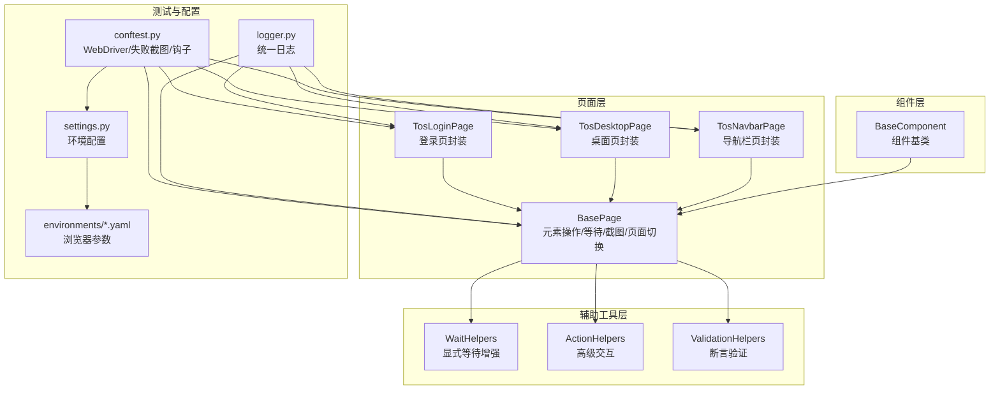
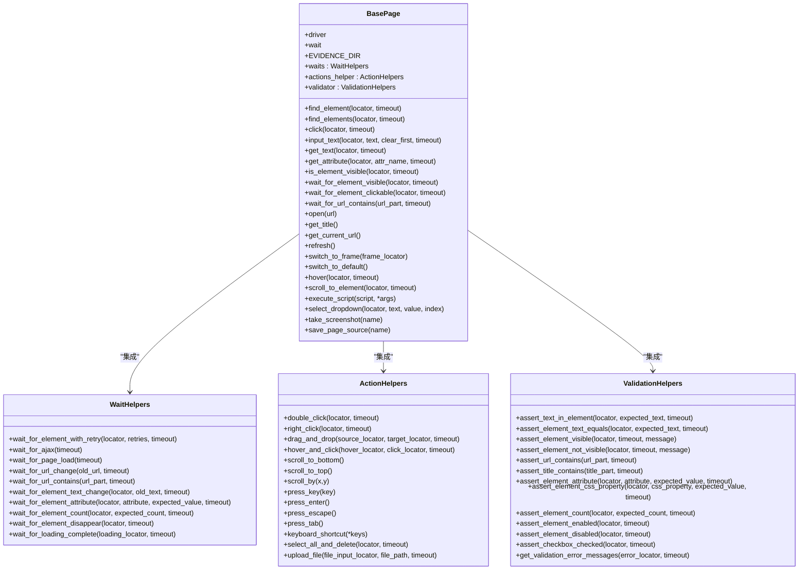
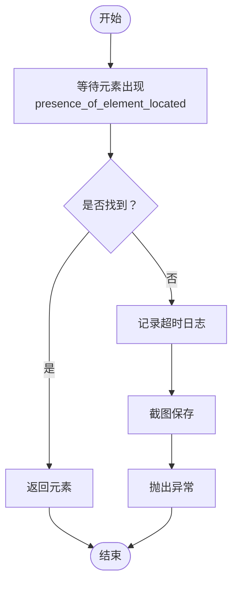
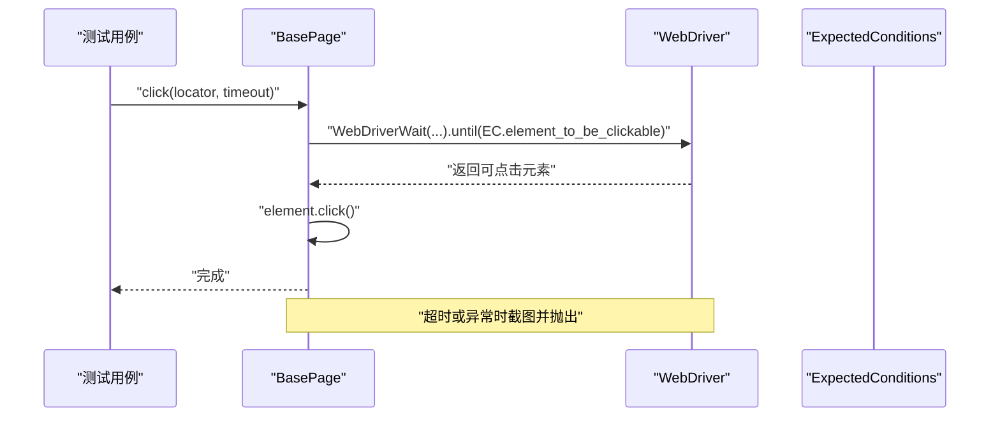
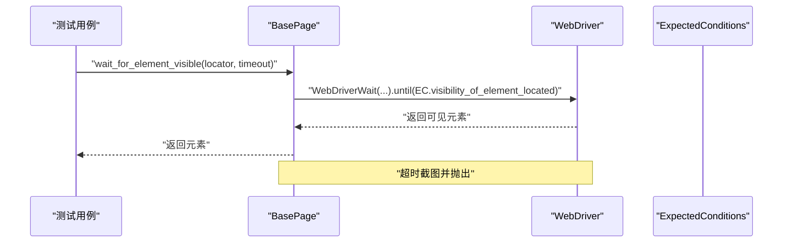
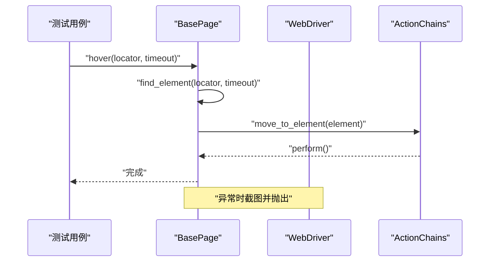
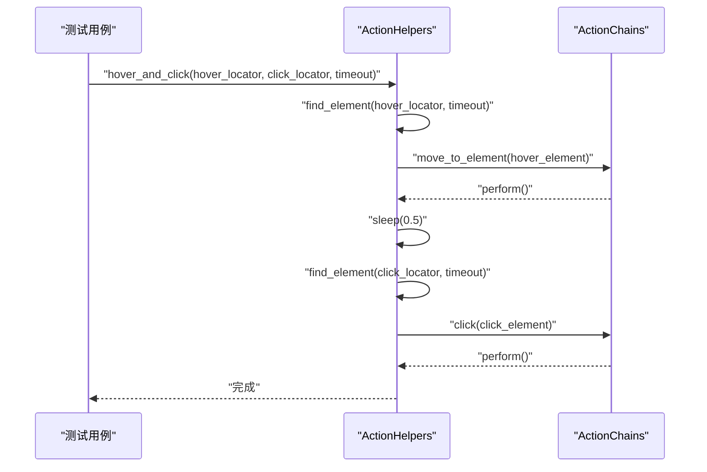
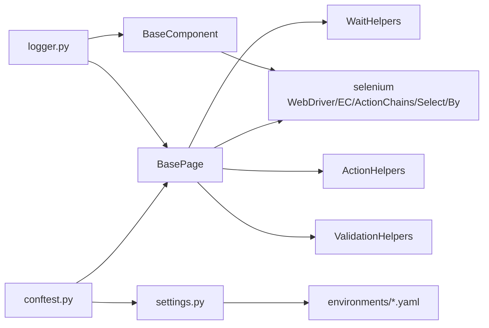

# 元素操作封装

<cite>
**本文引用的文件**
- [base_page.py](file://ui_automation/pages/base_page.py)
- [wait_helpers.py](file://ui_automation/pages/helpers/wait_helpers.py)
- [action_helpers.py](file://ui_automation/pages/helpers/action_helpers.py)
- [validation_helpers.py](file://ui_automation/pages/helpers/validation_helpers.py)
- [base_component.py](file://ui_automation/pages/components/base_component.py)
- [tos_login_page.py](file://ui_automation/pages/pages/tos_login_page.py)
- [tos_desktop_page.py](file://ui_automation/pages/pages/tos_desktop_page.py)
- [tos_navbar_page.py](file://ui_automation/pages/pages/tos_navbar_page.py)
- [conftest.py](file://conftest.py)
- [settings.py](file://config/settings.py)
- [logger.py](file://common/logger.py)
- [test_tos_login.py](file://ui_automation/testcases/smoke/test_tos_login.py)
- [test_tos_desktop_menu.py](file://ui_automation/testcases/smoke/test_tos_desktop_menu.py)
- [test_tos_navbar.py](file://ui_automation/testcases/smoke/test_tos_navbar.py)
- [test.yaml](file://config/environments/test.yaml)
- [dev.yaml](file://config/environments/dev.yaml)
- [requirements.txt](file://requirements.txt)
</cite>

## 目录
1. [简介](#简介)
2. [项目结构](#项目结构)
3. [核心组件](#核心组件)
4. [架构总览](#架构总览)
5. [详细组件分析](#详细组件分析)
6. [依赖分析](#依赖分析)
7. [性能考虑](#性能考虑)
8. [故障排查指南](#故障排查指南)
9. [结论](#结论)
10. [附录](#附录)

## 简介
本技术文档围绕 UI 自动化中的"元素操作封装"进行系统化梳理，重点分析 BasePage 类中各类元素操作方法的实现原理、参数配置、超时设置与异常处理机制；解释显式等待与隐式等待的区别及适用场景；总结定位器选择原则、操作原子性保障与错误恢复策略；覆盖高级元素操作（下拉框选择、鼠标悬停、拖拽、键盘快捷键等）；并提供最佳实践与常见问题解决方案。

**更新** 本版本反映了页面对象结构的简化：BasePage现在专注于核心元素操作封装，辅助工具和组件系统已完全模块化，提升了代码的可维护性和可扩展性。

## 项目结构
该项目采用 Page Object 模式组织 UI 自动化代码，经过结构优化后，核心结构更加清晰：
- pages/base_page.py：页面对象基类，封装常用元素操作与等待、截图、页面切换等能力，并集成三大辅助工具（WaitHelpers、ActionHelpers、ValidationHelpers）。
- pages/pages/*：具体的页面对象，如登录页、桌面页、导航栏页等，继承自BasePage并封装业务逻辑。
- pages/helpers/*：辅助工具模块，分别提供等待、动作、断言能力，实现完全模块化。
- pages/components/*：组件基类，封装可复用的UI组件操作。
- conftest.py：pytest配置，负责WebDriver初始化、失败截图、钩子注册等。
- config/settings.py与config/environments/*.yaml：环境配置与浏览器参数。
- common/logger.py：统一日志配置。
- ui_automation/testcases/smoke/*：冒烟测试用例，展示如何使用Page Object与等待工具。

**图表来源**
- [base_page.py:36-515](file://ui_automation/pages/base_page.py#L36-L515)
- [tos_login_page.py:18-163](file://ui_automation/pages/pages/tos_login_page.py#L18-L163)
- [tos_desktop_page.py:20-98](file://ui_automation/pages/pages/tos_desktop_page.py#L20-L98)
- [tos_navbar_page.py:22-234](file://ui_automation/pages/pages/tos_navbar_page.py#L22-L234)
- [wait_helpers.py:16-125](file://ui_automation/pages/helpers/wait_helpers.py#L16-L125)
- [action_helpers.py:17-124](file://ui_automation/pages/helpers/action_helpers.py#L17-L124)
- [validation_helpers.py:15-140](file://ui_automation/pages/helpers/validation_helpers.py#L15-L140)
- [base_component.py:18-85](file://ui_automation/pages/components/base_component.py#L18-L85)
- [conftest.py:25-148](file://conftest.py#L25-L148)
- [settings.py:13-104](file://config/settings.py#L13-L104)
- [logger.py:1-77](file://common/logger.py#L1-L77)

**章节来源**
- [base_page.py:36-515](file://ui_automation/pages/base_page.py#L36-L515)
- [tos_login_page.py:18-163](file://ui_automation/pages/pages/tos_login_page.py#L18-L163)
- [tos_desktop_page.py:20-98](file://ui_automation/pages/pages/tos_desktop_page.py#L20-L98)
- [tos_navbar_page.py:22-234](file://ui_automation/pages/pages/tos_navbar_page.py#L22-L234)
- [conftest.py:25-148](file://conftest.py#L25-L148)
- [settings.py:13-104](file://config/settings.py#L13-L104)
- [logger.py:1-77](file://common/logger.py#L1-L77)

## 核心组件
本节聚焦 BasePage 的核心元素操作方法，经过结构简化后，BasePage现在更加专注：
- 单元素查找：find_element
- 多元素查找：find_elements
- 点击：click
- 文本输入：input_text
- 文本获取：get_text
- 属性获取：get_attribute
- 可见性判断：is_element_visible
- 等待操作：wait_for_element_visible、wait_for_element_clickable、wait_for_url_contains
- 页面操作：open、get_title、get_current_url、refresh、switch_to_frame、switch_to_default
- 高级操作：hover、scroll_to_element、execute_script、select_dropdown
- 截图与证据：take_screenshot、save_page_source

这些方法均内置显式等待、日志记录与失败截图，确保操作的稳定性与可观测性。

**更新** BasePage现在通过self.waits、self.actions_helper、self.validator属性访问三大辅助工具，实现了更好的模块化设计。

**章节来源**
- [base_page.py:60-515](file://ui_automation/pages/base_page.py#L60-L515)

## 架构总览
BasePage 作为页面对象基类，向上提供业务页面对象（如 TosLoginPage、TosDesktopPage、TosNavbarPage）使用的统一 API；向下集成三大辅助工具：
- WaitHelpers：增强显式等待能力（AJAX、页面加载、元素消失、属性变化、计数等）
- ActionHelpers：高级交互（双击、右键、拖拽、悬停后点击、滚动、快捷键、文件上传等）
- ValidationHelpers：断言验证（文本、可见性、URL、标题、属性、CSS、启用状态、复选框等）

**图表来源**
- [base_page.py:36-515](file://ui_automation/pages/base_page.py#L36-L515)
- [wait_helpers.py:16-125](file://ui_automation/pages/helpers/wait_helpers.py#L16-L125)
- [action_helpers.py:17-124](file://ui_automation/pages/helpers/action_helpers.py#L17-L124)
- [validation_helpers.py:15-140](file://ui_automation/pages/helpers/validation_helpers.py#L15-L140)

## 详细组件分析

### 单元素查找与多元素查找
- 单元素查找：find_element
  - 显式等待：基于 presence_of_element_located，支持自定义超时。
  - 异常处理：超时抛出 TimeoutException，并自动截图与记录日志。
  - 返回值：找到的 WebElement。
- 多元素查找：find_elements
  - 先等待至少一个元素出现，再批量查询，返回元素列表。
  - 超时返回空列表，不抛异常，适合容错场景。

**图表来源**
- [base_page.py:60-85](file://ui_automation/pages/base_page.py#L60-L85)
- [base_page.py:86-108](file://ui_automation/pages/base_page.py#L86-L108)

**章节来源**
- [base_page.py:60-108](file://ui_automation/pages/base_page.py#L60-L108)

### 点击、文本输入、文本与属性获取
- 点击：click
  - 显式等待：element_to_be_clickable，确保元素可点击。
  - 异常处理：超时或异常均截图并抛出。
- 文本输入：input_text
  - 可选清空：clear_first=True 时先清空再输入。
  - 统一通过 find_element 完成定位，失败截图。
- 文本获取：get_text
  - 通过 find_element 定位后读取 element.text。
- 属性获取：get_attribute
  - 通过 find_element 定位后读取指定属性值。

**图表来源**
- [base_page.py:109-132](file://ui_automation/pages/base_page.py#L109-L132)

**章节来源**
- [base_page.py:109-200](file://ui_automation/pages/base_page.py#L109-L200)

### 可见性判断与等待操作
- 可见性判断：is_element_visible
  - 显式等待 visibility_of_element_located，超时返回 False。
- 等待可见：wait_for_element_visible
  - 返回可见元素，超时截图并抛出。
- 等待可点击：wait_for_element_clickable
  - 返回可点击元素，超时截图并抛出。
- 等待 URL 包含：wait_for_url_contains
  - 等待当前 URL 包含指定片段，超时记录当前 URL 并截图。

**图表来源**
- [base_page.py:225-293](file://ui_automation/pages/base_page.py#L225-L293)

**章节来源**
- [base_page.py:201-293](file://ui_automation/pages/base_page.py#L201-L293)

### 页面操作与高级元素操作
- 页面操作：open、get_title、get_current_url、refresh、switch_to_frame、switch_to_default
  - open：打开 URL，异常截图。
  - switch_to_frame：支持定位器元组或索引/名称，异常截图。
- 高级操作：
  - hover：移动到元素，异常截图。
  - scroll_to_element：平滑滚动到元素，异常截图。
  - execute_script：执行 JS，异常截图。
  - select_dropdown：Select 封装，支持按文本、value 或索引，异常截图。

**图表来源**
- [base_page.py:424-441](file://ui_automation/pages/base_page.py#L424-L441)

**章节来源**
- [base_page.py:294-515](file://ui_automation/pages/base_page.py#L294-L515)

### 高级交互辅助工具：ActionHelpers
**更新** ActionHelpers现在完全独立于BasePage，提供了丰富的高级交互操作，包括双击、右键、拖拽、悬停点击、键盘快捷键等复杂交互场景。

- 双击操作：double_click
  - 使用 ActionChains.double_click 实现双击功能。
  - 支持自定义超时时间，默认 10 秒。
- 右键点击：right_click
  - 使用 ActionChains.context_click 实现右键菜单触发。
  - 适用于上下文菜单、右键快捷操作等场景。
- 拖拽操作：drag_and_drop
  - 支持源元素到目标元素的拖拽操作。
  - 适用于拖放排序、文件上传等场景。
- 悬停后点击：hover_and_click
  - 先悬停到目标元素，等待菜单展开，再点击子元素。
  - 专门用于下拉菜单、导航菜单等需要先触发再点击的场景。
- 键盘快捷键：keyboard_shortcut
  - 支持组合键操作，如 Ctrl+A、Ctrl+S 等。
  - 通过 key_down/key_up 实现复杂的键盘组合。
- 文件上传：upload_file
  - 通过 input[type=file] 元素上传文件。
  - 支持本地文件路径直接上传。

**图表来源**
- [action_helpers.py:51-62](file://ui_automation/pages/helpers/action_helpers.py#L51-L62)

**章节来源**
- [action_helpers.py:24-124](file://ui_automation/pages/helpers/action_helpers.py#L24-L124)

### 断言验证增强：ValidationHelpers
**更新** ValidationHelpers 现在完全模块化，提供了全面的断言验证功能，覆盖文本、可见性、URL、属性等多个方面。

- 文本断言：assert_text_in_element、assert_element_text_equals
  - 支持包含关系和精确匹配两种断言方式。
  - 自动获取元素文本并进行断言比较。
- 可见性断言：assert_element_visible、assert_element_not_visible
  - 验证元素的显示状态。
  - 支持自定义错误消息。
- URL 和标题断言：assert_url_contains、assert_title_contains
  - 验证页面跳转后的 URL 和标题内容。
- 属性和样式断言：assert_element_attribute、assert_element_css_property
  - 验证元素属性值和 CSS 样式属性。
- 元素状态断言：assert_element_enabled、assert_element_disabled、assert_checkbox_checked
  - 验证元素的可操作状态和复选框选中状态。
- 表单验证：get_validation_error_messages
  - 获取表单验证错误信息列表。

**章节来源**
- [validation_helpers.py:21-140](file://ui_automation/pages/helpers/validation_helpers.py#L21-L140)

### 等待机制增强：WaitHelpers
**更新** WaitHelpers 现在完全独立，提供了比 Selenium 原生更强大的等待功能，支持多种等待场景。

- 带重试的等待：wait_for_element_with_retry
  - 支持多次重试机制，提高等待成功率。
  - 可配置重试次数和超时时间。
- AJAX 等待：wait_for_ajax
  - 等待 AJAX 请求完成，支持 jQuery 和原生 JavaScript。
- 页面加载等待：wait_for_page_load
  - 等待页面完全加载完成。
- URL 变化等待：wait_for_url_change、wait_for_url_contains
  - 等待 URL 发生变化或包含指定内容。
- 元素状态等待：wait_for_element_text_change、wait_for_element_attribute、wait_for_element_count
  - 等待元素文本、属性值或数量发生变化。
- 元素消失等待：wait_for_element_disappear
  - 等待元素从页面中消失。
- 加载动画等待：wait_for_loading_complete
  - 等待加载动画完成，先等待加载出现，再等待消失。

**章节来源**
- [wait_helpers.py:23-125](file://ui_automation/pages/helpers/wait_helpers.py#L23-L125)

### 组件系统：BaseComponent
**新增** BaseComponent 作为组件基类，封装了可复用的 UI 组件操作，每个组件代表页面中一个可独立操作的区域。

- 根元素管理：通过 root_locator 限定组件范围，提供 root_element 属性。
- 组件内元素操作：find_element、click、get_text 等方法仅在组件范围内查找。
- 可见性判断：支持组件级别的可见性检查。
- 独立性：组件可以在多个页面中复用，提升代码复用率。

**章节来源**
- [base_component.py:18-85](file://ui_automation/pages/components/base_component.py#L18-L85)

### 页面对象实例分析
**更新** 三个主要页面对象展示了 BasePage 的实际应用：

- **TosLoginPage**：两步式登录流程封装，演示了 BasePage 的核心操作如何与业务逻辑结合。
- **TosDesktopPage**：桌面右键菜单操作，展示了 ActionHelpers 的实际应用。
- **TosNavbarPage**：导航栏应用点击操作，结合了 BasePage 和 ActionHelpers 的功能。

**章节来源**
- [tos_login_page.py:18-163](file://ui_automation/pages/pages/tos_login_page.py#L18-L163)
- [tos_desktop_page.py:20-98](file://ui_automation/pages/pages/tos_desktop_page.py#L20-L98)
- [tos_navbar_page.py:22-234](file://ui_automation/pages/pages/tos_navbar_page.py#L22-L234)

### 辅助工具：WaitHelpers、ActionHelpers、ValidationHelpers
- WaitHelpers
  - 增强等待：AJAX 完成、页面加载完成、URL 变化、元素文本变化、属性变化、元素数量、元素消失、加载动画完成。
  - 带重试的元素等待：wait_for_element_with_retry。
- ActionHelpers
  - 高级交互：双击、右键、拖拽、悬停后点击、滚动、快捷键、全选删除、文件上传。
- ValidationHelpers
  - 断言验证：文本包含/相等、可见性/不可见、URL/标题包含、属性/CSS、元素数量、启用/禁用、复选框选中、获取验证错误信息。

**章节来源**
- [wait_helpers.py:16-125](file://ui_automation/pages/helpers/wait_helpers.py#L16-L125)
- [action_helpers.py:17-124](file://ui_automation/pages/helpers/action_helpers.py#L17-L124)
- [validation_helpers.py:15-140](file://ui_automation/pages/helpers/validation_helpers.py#L15-L140)

## 依赖分析
- BasePage 依赖 selenium 的 WebDriverWait、EC、ActionChains、Select、By 等。
- BasePage 集成三大辅助工具，形成"页面操作 + 等待 + 交互 + 断言"的统一能力。
- 三大辅助工具现在完全模块化，通过导入语句独立存在于 helpers/ 目录下。
- BaseComponent 作为组件基类，提供组件级别的元素操作能力。
- conftest.py 提供 WebDriver 初始化、隐式等待、页面加载超时、失败自动截图。
- settings.py 与 environments/*.yaml 提供浏览器类型、headless、隐式等待、页面加载超时等配置。
- logger.py 提供统一日志输出，便于问题定位。

**更新** 依赖关系现在更加清晰：BasePage 依赖 selenium，同时通过导入语句依赖 helpers/ 目录下的三大辅助工具。

**图表来源**
- [base_page.py:16-31](file://ui_automation/pages/base_page.py#L16-L31)
- [base_component.py:10-13](file://ui_automation/pages/components/base_component.py#L10-L13)
- [conftest.py:25-73](file://conftest.py#L25-L73)
- [settings.py:13-104](file://config/settings.py#L13-L104)
- [logger.py:1-77](file://common/logger.py#L1-L77)

**章节来源**
- [base_page.py:16-31](file://ui_automation/pages/base_page.py#L16-L31)
- [base_component.py:10-13](file://ui_automation/pages/components/base_component.py#L10-L13)
- [conftest.py:25-73](file://conftest.py#L25-L73)
- [settings.py:13-104](file://config/settings.py#L13-L104)
- [logger.py:1-77](file://common/logger.py#L1-L77)

## 性能考虑
- 显式等待 vs 隐式等待
  - 显式等待：针对特定条件等待，可控性强，避免全局等待带来的性能浪费。
  - 隐式等待：设置 WebDriver 的隐式等待时间，适用于页面整体加载较慢的场景，但对每个操作都会生效。
  - 在本项目中，隐式等待由 conftest.py 通过 driver.implicitly_wait 设置，显式等待由 BasePage 与 WaitHelpers 提供。
- 超时设置建议
  - 元素查找：默认 10 秒，复杂页面可适当增加。
  - 点击/可见性：默认 10 秒，URL 等待默认 10 秒。
  - AJAX/页面加载：WaitHelpers 提供专用等待，建议结合业务场景调整超时。
- 操作原子性
  - 将"等待 + 定位 + 操作"封装为原子步骤，减少中间态干扰。
  - 对易变元素（如动态加载列表）使用 count/消失/文本变化等条件等待。
- 错误恢复
  - 失败自动截图与日志记录，便于快速定位问题。
  - 对不稳定元素可使用带重试的等待（WaitHelpers.wait_for_element_with_retry）。

**更新** 由于辅助工具的模块化，BasePage 的初始化更加轻量，减少了不必要的依赖。

## 故障排查指南
- 元素查找超时
  - 现象：TimeoutException，截图并记录日志。
  - 排查：确认定位器是否稳定；使用 WaitHelpers.wait_for_element_with_retry；检查页面是否加载完成。
- 点击失败
  - 现象：点击异常或超时。
  - 排查：确认元素可点击；检查遮挡/动画；必要时使用 hover_and_click。
- 文本/属性获取异常
  - 现象：获取失败或返回空。
  - 排查：先等待元素可见；确认元素是否动态更新；使用 ValidationHelpers 进行断言。
- URL 等待失败
  - 现象：wait_for_url_contains 超时。
  - 排查：确认业务流程是否触发跳转；查看当前 URL；使用 WaitHelpers.wait_for_url_change。
- 截图与证据
  - BasePage 与 conftest 均提供截图能力，失败时自动保存，便于问题复现。
- 日志定位
  - 使用统一日志模块，结合模块名与时间戳定位问题。

**更新** 由于结构简化，故障排查现在更加直观：BasePage 的核心方法、WaitHelpers 的等待方法、ActionHelpers 的交互方法、ValidationHelpers 的断言方法都有明确的职责划分。

**章节来源**
- [base_page.py:60-515](file://ui_automation/pages/base_page.py#L60-L515)
- [conftest.py:84-126](file://conftest.py#L84-L126)
- [logger.py:1-77](file://common/logger.py#L1-L77)

## 结论
本项目通过 BasePage 将元素操作、等待、交互与断言统一封装，配合 WaitHelpers、ActionHelpers、ValidationHelpers 形成完整的 UI 自动化能力体系。经过结构简化后，BasePage 更加专注核心功能，三大辅助工具完全模块化，组件系统独立存在，提升了代码的可维护性和可扩展性。结合显式等待与隐式等待的合理使用、定位器选择原则、操作原子性与错误恢复机制，能够显著提升测试稳定性与可维护性。建议在实际项目中：
- 优先使用显式等待与 WaitHelpers 的增强等待；
- 采用稳定的定位器策略（ID > 语义化 CSS 选择器 > XPath）；
- 将关键操作封装为原子步骤并加入断言；
- 利用失败截图与日志进行问题定位与回归；
- 在复杂场景中合理使用 ActionHelpers 和 ValidationHelpers。

**更新** 结构简化后的优势：
- **职责清晰**：BasePage 专注于元素操作，三大辅助工具各司其职
- **易于维护**：模块化设计使得代码更易理解和修改
- **可扩展性强**：新的辅助功能可以独立开发和测试
- **组件复用**：BaseComponent 提供了更好的组件化支持

## 附录

### 显式等待与隐式等待的区别与选择策略
- 显式等待
  - 针对特定条件等待，可控性强，适合复杂交互与动态元素。
  - 在 BasePage 与 WaitHelpers 中广泛使用。
- 隐式等待
  - 设置 WebDriver 的全局等待时间，适用于页面整体加载较慢。
  - 在 conftest.py 中通过 driver.implicitly_wait 设置。
- 选择策略
  - 页面加载慢：提高隐式等待；同时在关键步骤使用显式等待。
  - 动态元素：优先显式等待，避免全局等待导致的性能问题。
  - 复杂交互：结合 WaitHelpers 的 AJAX/URL/属性等待。

**章节来源**
- [base_page.py:36-57](file://ui_automation/pages/base_page.py#L36-L57)
- [conftest.py:62-65](file://conftest.py#L62-L65)
- [wait_helpers.py:39-58](file://ui_automation/pages/helpers/wait_helpers.py#L39-L58)

### 定位器选择原则
- 优先级：ID > 语义化 CSS 选择器 > 链接文本 > XPath。
- 避免使用绝对 XPath 或过于脆弱的相对 XPath。
- 对动态内容使用属性/类名/文本组合定位。
- 示例页面中使用 By.ID 与 By.CSS_SELECTOR 的定位器设计可参考 LoginPage 的示例。

**章节来源**
- [tos_login_page.py:40-90](file://ui_automation/pages/pages/tos_login_page.py#L40-L90)

### 最佳实践清单
- 操作原子性：将"等待 + 定位 + 操作 + 断言"封装为步骤。
- 超时设置：根据页面复杂度与网络状况调整默认超时。
- 错误恢复：失败自动截图 + 日志记录 + 可选重试。
- 高级交互：优先使用 ActionHelpers 的 hover_and_click、drag_and_drop 等。
- 断言验证：使用 ValidationHelpers 进行文本、可见性、URL、属性等断言。
- 组件复用：利用 BaseComponent 创建可复用的 UI 组件。

**更新** 新增组件复用最佳实践。

**章节来源**
- [action_helpers.py:40-62](file://ui_automation/pages/helpers/action_helpers.py#L40-L62)
- [validation_helpers.py:21-107](file://ui_automation/pages/helpers/validation_helpers.py#L21-L107)
- [base_component.py:41-74](file://ui_automation/pages/components/base_component.py#L41-L74)

### 实际使用示例与测试数据
- 冒烟测试展示了如何使用 TosLoginPage、TosDesktopPage、TosNavbarPage 进行功能测试，包括打开页面、输入用户名/密码、点击登录、等待 URL 跳转、断言错误提示等。
- 测试数据通过 YAML 文件提供，便于维护与扩展。

**更新** 测试用例现在更加简洁，专注于验证页面对象的核心功能。

**章节来源**
- [test_tos_login.py:44-104](file://ui_automation/testcases/smoke/test_tos_login.py#L44-L104)
- [test_tos_desktop_menu.py:52-115](file://ui_automation/testcases/smoke/test_tos_desktop_menu.py#L52-L115)
- [test_tos_navbar.py:58-179](file://ui_automation/testcases/smoke/test_tos_navbar.py#L58-L179)

### 环境与依赖配置
- 浏览器配置：通过 config/environments/*.yaml 与 config/settings.py 提供，支持 chrome/firefox、headless、隐式等待、页面加载超时等。
- 依赖：pytest、selenium、loguru、allure-pytest 等。

**章节来源**
- [test.yaml:25-31](file://config/environments/test.yaml#L25-L31)
- [dev.yaml:25-31](file://config/environments/dev.yaml#L25-L31)
- [settings.py:13-104](file://config/settings.py#L13-L104)
- [requirements.txt:1-25](file://requirements.txt#L1-L25)

### 高级交互操作最佳实践
**新增** 针对 ActionHelpers 中的高级交互操作，提供以下最佳实践：

- **双击操作**：适用于需要双击触发的界面元素，如某些编辑器或特殊控件。
- **右键操作**：用于触发上下文菜单，注意处理可能弹出的菜单元素。
- **拖拽操作**：对于拖放排序场景，建议先验证源元素和目标元素都存在。
- **悬停点击**：这是最复杂的交互之一，需要合理设置等待时间，通常 0.5 秒足以让菜单展开。
- **键盘快捷键**：组合键操作时要注意按键顺序，先 key_down 再 key_up。
- **文件上传**：确保文件路径正确且文件存在，支持绝对路径和相对路径。

**章节来源**
- [action_helpers.py:24-124](file://ui_automation/pages/helpers/action_helpers.py#L24-L124)

### 断言验证使用指南
**新增** ValidationHelpers 的使用指南：

- **文本断言**：使用 assert_text_in_element 进行包含关系断言，使用 assert_element_text_equals 进行精确匹配。
- **可见性断言**：根据场景选择 assert_element_visible 或 assert_element_not_visible。
- **URL 和标题断言**：验证页面跳转后的状态，提供清晰的错误信息。
- **属性断言**：验证元素的各种属性值，包括 CSS 属性和自定义属性。
- **状态断言**：验证元素的启用/禁用状态和复选框选中状态。
- **表单验证**：使用 get_validation_error_messages 获取所有验证错误信息。

**章节来源**
- [validation_helpers.py:21-140](file://ui_automation/pages/helpers/validation_helpers.py#L21-L140)

### 等待机制选择策略
**新增** 针对 WaitHelpers 的等待机制选择：

- **带重试等待**：适用于网络不稳定或元素加载较慢的场景。
- **AJAX 等待**：检测 jQuery 或原生 JavaScript 的 AJAX 请求状态。
- **页面加载等待**：确保页面完全加载完成，特别是 SPA 应用。
- **URL 等待**：验证页面跳转是否发生。
- **元素状态等待**：监控元素的动态变化，如文本、属性、数量等。
- **加载动画等待**：处理页面加载过程中的动画效果。

**章节来源**
- [wait_helpers.py:23-125](file://ui_automation/pages/helpers/wait_helpers.py#L23-L125)

### 页面对象结构简化说明
**新增** 本次更新反映了页面对象结构的重大简化：

- **BasePage 专注核心**：移除了组件相关代码，现在专注于元素操作、等待、截图等核心功能。
- **辅助工具模块化**：WaitHelpers、ActionHelpers、ValidationHelpers 完全迁移到 helpers/ 目录，实现独立开发和测试。
- **组件系统独立**：BaseComponent 独立存在于 components/ 目录，提供组件级别的复用能力。
- **页面对象更专业**：TosLoginPage、TosDesktopPage、TosNavbarPage 等页面对象更加专注于各自的业务领域。
- **职责分离**：每个类都有明确的职责边界，提升了代码的可维护性和可扩展性。

这种结构简化使得：
- 代码更加清晰，职责更加明确
- 开发效率提升，便于团队协作
- 测试更加容易，模块化设计便于单元测试
- 扩展性增强，新的功能可以独立开发和集成

**章节来源**
- [base_page.py:1-12](file://ui_automation/pages/base_page.py#L1-L12)
- [base_component.py:1-5](file://ui_automation/pages/components/base_component.py#L1-L5)
- [tos_login_page.py:1-15](file://ui_automation/pages/pages/tos_login_page.py#L1-L15)
- [tos_desktop_page.py:1-15](file://ui_automation/pages/pages/tos_desktop_page.py#L1-L15)
- [tos_navbar_page.py:1-18](file://ui_automation/pages/pages/tos_navbar_page.py#L1-L18)