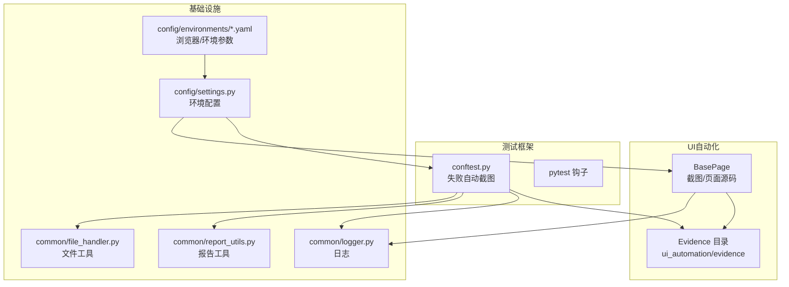
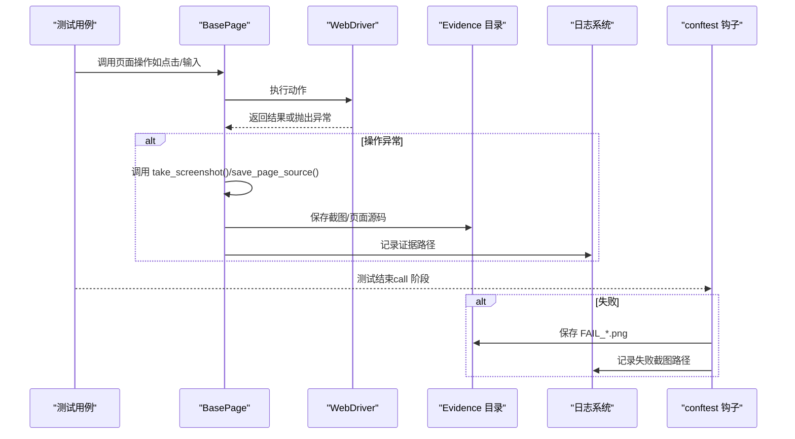
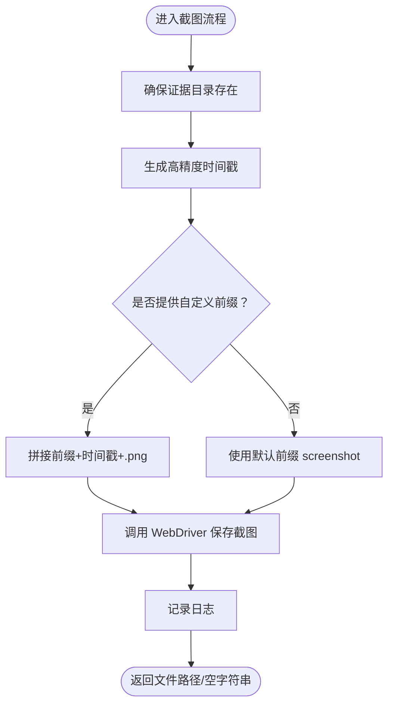
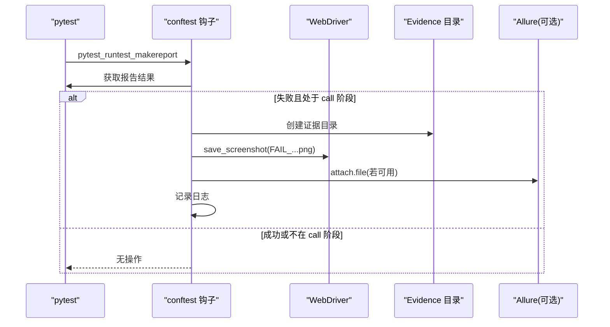
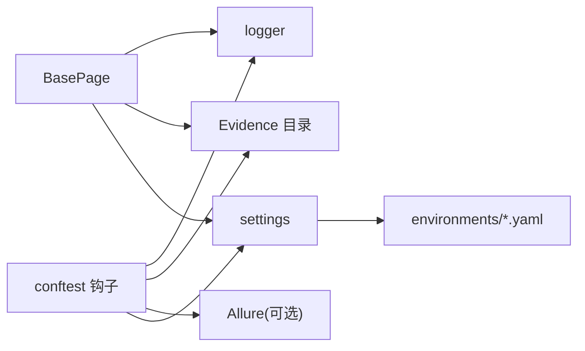

# 截图与证据收集

<cite>
**本文引用的文件**
- [ui_automation/pages/base_page.py](file://ui_automation/pages/base_page.py)
- [conftest.py](file://conftest.py)
- [common/logger.py](file://common/logger.py)
- [config/settings.py](file://config/settings.py)
- [config/environments/test.yaml](file://config/environments/test.yaml)
- [ui_automation/testcases/test_example.py](file://ui_automation/testcases/test_example.py)
- [ui_automation/testdata/login_data.yaml](file://ui_automation/testdata/login_data.yaml)
- [common/report_utils.py](file://common/report_utils.py)
- [common/file_handler.py](file://common/file_handler.py)
- [requirements.txt](file://requirements.txt)
</cite>

## 目录
1. [简介](#简介)
2. [项目结构](#项目结构)
3. [核心组件](#核心组件)
4. [架构总览](#架构总览)
5. [详细组件分析](#详细组件分析)
6. [依赖分析](#依赖分析)
7. [性能考虑](#性能考虑)
8. [故障排查指南](#故障排查指南)
9. [结论](#结论)
10. [附录](#附录)

## 简介
本文件面向“截图与证据收集”能力，系统化阐述证据收集体系的设计原理与实现机制，覆盖：
- 截图功能的自动触发条件与手动调用方式
- 文件命名规则与存储路径管理
- 页面源码保存的实现原理（编码、格式与存储策略）
- 最佳实践（截图时机、命名规范、证据分类）
- 调试辅助（如何用截图与页面源码进行问题诊断）
- 在持续集成与缺陷跟踪中的应用价值

## 项目结构
证据收集能力主要由以下模块协同实现：
- 页面基类：提供截图与页面源码保存的统一入口
- 测试夹具：在失败时自动截图并可附加到报告
- 日志系统：记录证据生成状态与异常
- 配置系统：提供浏览器与环境信息，影响截图时机与路径
- 报告与文件工具：辅助生成报告与数据文件

图表来源
- [ui_automation/pages/base_page.py:36-421](file://ui_automation/pages/base_page.py#L36-L421)
- [conftest.py:84-125](file://conftest.py#L84-L125)
- [common/logger.py:1-77](file://common/logger.py#L1-L77)
- [config/settings.py:1-104](file://config/settings.py#L1-L104)
- [config/environments/test.yaml:1-31](file://config/environments/test.yaml#L1-L31)
- [common/report_utils.py:1-143](file://common/report_utils.py#L1-L143)
- [common/file_handler.py:1-217](file://common/file_handler.py#L1-L217)

章节来源
- [ui_automation/pages/base_page.py:36-421](file://ui_automation/pages/base_page.py#L36-L421)
- [conftest.py:84-125](file://conftest.py#L84-L125)
- [common/logger.py:1-77](file://common/logger.py#L1-L77)
- [config/settings.py:1-104](file://config/settings.py#L1-L104)
- [config/environments/test.yaml:1-31](file://config/environments/test.yaml#L1-L31)
- [common/report_utils.py:1-143](file://common/report_utils.py#L1-L143)
- [common/file_handler.py:1-217](file://common/file_handler.py#L1-L217)

## 核心组件
- BasePage：提供截图与页面源码保存方法，统一证据生成入口
- conftest.py：在测试失败时自动截图并可附加到 Allure 报告
- 日志系统：记录证据生成状态与异常，便于定位问题
- 配置系统：提供浏览器类型、隐式等待、页面加载超时等参数，间接影响截图时机
- 报告与文件工具：辅助生成报告与数据文件，支撑证据归档与复盘

章节来源
- [ui_automation/pages/base_page.py:36-421](file://ui_automation/pages/base_page.py#L36-L421)
- [conftest.py:84-125](file://conftest.py#L84-L125)
- [common/logger.py:1-77](file://common/logger.py#L1-L77)
- [config/settings.py:1-104](file://config/settings.py#L1-L104)
- [common/report_utils.py:1-143](file://common/report_utils.py#L1-L143)
- [common/file_handler.py:1-217](file://common/file_handler.py#L1-L217)

## 架构总览
证据收集贯穿“页面操作—异常检测—自动截图—人工干预—报告与归档”的闭环。

图表来源
- [ui_automation/pages/base_page.py:370-421](file://ui_automation/pages/base_page.py#L370-L421)
- [conftest.py:84-125](file://conftest.py#L84-L125)

## 详细组件分析

### BasePage：截图与页面源码保存
- 截图方法
  - 自动创建证据目录（ui_automation/evidence）
  - 采用高精度时间戳（含微秒）确保唯一性
  - 默认文件名为 screenshot_{时间戳}.png，支持传入自定义前缀
  - 保存失败时记录错误日志并返回空字符串
- 页面源码保存
  - 采用 UTF-8 编码写入，文件名 page_source_{时间戳}.html
  - 保存失败时记录错误日志并返回空字符串
- 自动触发点
  - 页面操作方法在捕获异常时自动调用截图，便于快速定位问题
  - 常见触发点：元素查找超时、点击不可点击、输入异常、等待超时、打开页面异常、iframe 切换异常、JS 执行异常等

图表来源
- [ui_automation/pages/base_page.py:370-394](file://ui_automation/pages/base_page.py#L370-L394)

章节来源
- [ui_automation/pages/base_page.py:36-421](file://ui_automation/pages/base_page.py#L36-L421)

### conftest：失败自动截图与 Allure 附件
- 触发条件
  - 仅在测试执行阶段（call）失败时触发
  - 自动创建证据目录（ui_automation/evidence）
  - 文件名格式：FAIL_{测试用例名}_{时间戳}.png
- 附件集成
  - 若安装 Allure 插件，自动附加失败截图到报告
- 异常处理
  - 截图保存异常会被捕获并记录错误日志

图表来源
- [conftest.py:84-125](file://conftest.py#L84-L125)

章节来源
- [conftest.py:84-125](file://conftest.py#L84-L125)

### 日志系统：证据生成与异常追踪
- 控制台输出级别：INFO 及以上
- 文件输出级别：DEBUG 及以上，按天轮转，保留 7 天
- 统一模块字段，便于关联证据文件与日志条目
- 截图与页面源码保存均记录 INFO/ERROR 级别日志，便于审计

章节来源
- [common/logger.py:1-77](file://common/logger.py#L1-L77)

### 配置系统：浏览器与环境参数对证据的影响
- 浏览器类型与窗口尺寸
  - 影响截图分辨率与页面渲染一致性
- 隐式等待与页面加载超时
  - 影响元素可见性判断与等待策略，间接影响自动截图触发时机
- 环境配置文件
  - 提供 base_url、账号、数据库、API 等信息，支撑测试上下文

章节来源
- [config/settings.py:1-104](file://config/settings.py#L1-L104)
- [config/environments/test.yaml:1-31](file://config/environments/test.yaml#L1-L31)

### 报告与文件工具：证据归档与复盘
- 报告工具
  - 提供时间戳生成、报告目录创建、HTML 报告片段生成与保存
  - 便于将证据与测试报告整合
- 文件工具
  - 支持 YAML/Excel 读写，可用于证据清单与数据归档

章节来源
- [common/report_utils.py:1-143](file://common/report_utils.py#L1-L143)
- [common/file_handler.py:1-217](file://common/file_handler.py#L1-L217)

## 依赖分析
证据收集能力的耦合关系如下：

图表来源
- [ui_automation/pages/base_page.py:36-421](file://ui_automation/pages/base_page.py#L36-L421)
- [conftest.py:84-125](file://conftest.py#L84-L125)
- [common/logger.py:1-77](file://common/logger.py#L1-L77)
- [config/settings.py:1-104](file://config/settings.py#L1-L104)
- [config/environments/test.yaml:1-31](file://config/environments/test.yaml#L1-L31)

章节来源
- [ui_automation/pages/base_page.py:36-421](file://ui_automation/pages/base_page.py#L36-L421)
- [conftest.py:84-125](file://conftest.py#L84-L125)
- [common/logger.py:1-77](file://common/logger.py#L1-L77)
- [config/settings.py:1-104](file://config/settings.py#L1-L104)
- [config/environments/test.yaml:1-31](file://config/environments/test.yaml#L1-L31)

## 性能考虑
- 截图频率与体积
  - 频繁截图会增加磁盘 IO 与存储压力，建议在关键节点与异常处触发
- 页面源码保存
  - 页面源码较大，建议仅在必要时保存，或在失败时触发
- 日志级别
  - DEBUG 级别日志有助于定位问题，但在高并发下需关注日志轮转与磁盘占用
- 浏览器配置
  - 适当调整隐式等待与页面加载超时，减少无效等待与重试带来的额外截图

## 故障排查指南
- 截图未生成
  - 检查证据目录是否存在与权限是否足够
  - 确认 BasePage 的截图方法是否被调用（异常捕获分支）
  - 查看日志中关于截图保存失败的错误信息
- 页面源码保存失败
  - 检查文件编码（UTF-8）与目标路径权限
  - 确认 WebDriver 页面源码可获取
- Allure 附件缺失
  - 确认已安装 allure-pytest 插件
  - 检查 conftest 钩子是否在失败时触发
- 截图时机不当
  - 结合业务关键节点（登录、提交、跳转）设置手动截图
  - 对易变区域（AJAX、动态加载）增加等待后再截图

章节来源
- [ui_automation/pages/base_page.py:370-421](file://ui_automation/pages/base_page.py#L370-L421)
- [conftest.py:84-125](file://conftest.py#L84-L125)
- [common/logger.py:1-77](file://common/logger.py#L1-L77)

## 结论
证据收集体系通过“页面操作—异常检测—自动截图—人工干预—报告与归档”的闭环，显著提升了 UI 自动化测试的问题定位效率与可追溯性。合理规划截图时机、规范命名与分类管理、结合日志与报告工具，可在持续集成与缺陷跟踪中发挥更大价值。

## 附录

### 截图与页面源码保存最佳实践
- 截图时机
  - 关键业务步骤前后（登录、提交、跳转）
  - 明确的异常捕获点（元素查找超时、点击不可点击、等待超时）
  - 页面状态变化前后（URL 变化、弹窗出现/消失）
- 文件命名
  - 建议统一前缀：如 login_success、submit_error、ajax_loading
  - 时间戳精确到微秒，避免同一批次内冲突
  - 保持扩展名一致：png（截图）、html（页面源码）
- 存储策略
  - 证据目录：ui_automation/evidence
  - 按测试套件/日期建立子目录，便于归档与检索
- 编码与格式
  - 页面源码统一使用 UTF-8 编码
  - 截图采用 PNG 格式，兼顾清晰度与体积
- 与报告集成
  - 将证据路径写入报告摘要，或在 Allure 中作为附件
  - 使用报告工具生成 HTML 摘要，汇总通过/失败与证据链接

章节来源
- [ui_automation/pages/base_page.py:370-421](file://ui_automation/pages/base_page.py#L370-L421)
- [conftest.py:84-125](file://conftest.py#L84-L125)
- [common/report_utils.py:68-143](file://common/report_utils.py#L68-L143)

### 调试辅助与根因分析
- 截图定位
  - 在异常发生时自动截图，结合日志时间戳快速定位
  - 对比正常/异常两种截图，识别 UI 变化
- 页面源码分析
  - 在关键节点保存页面源码，核对 DOM 结构与属性
  - 结合日志中的 URL 与标题，确认页面状态
- 与等待策略配合
  - 使用等待工具（AJAX 完成、页面加载完成、URL 变化）后再截图，提升稳定性

章节来源
- [ui_automation/pages/base_page.py:395-421](file://ui_automation/pages/base_page.py#L395-L421)
- [ui_automation/pages/helpers/wait_helpers.py:1-125](file://ui_automation/pages/helpers/wait_helpers.py#L1-L125)

### 在持续集成与缺陷跟踪中的应用
- CI 集成
  - 在失败时自动截图并附加到 Allure 报告
  - 将证据目录纳入制品归档，便于后续复盘
- 缺陷跟踪
  - 在缺陷描述中附上证据链接（截图/页面源码）
  - 建立证据命名规范与检索索引，提高回归效率

章节来源
- [conftest.py:84-125](file://conftest.py#L84-L125)
- [requirements.txt:1-25](file://requirements.txt#L1-L25)