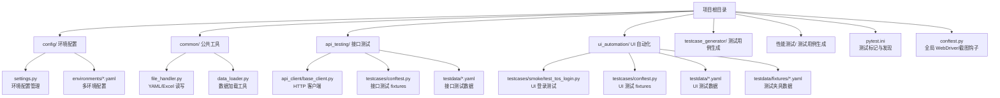
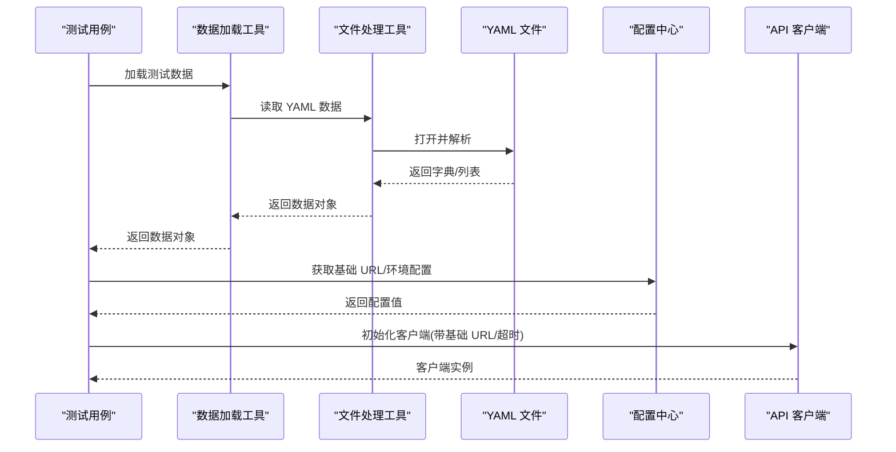
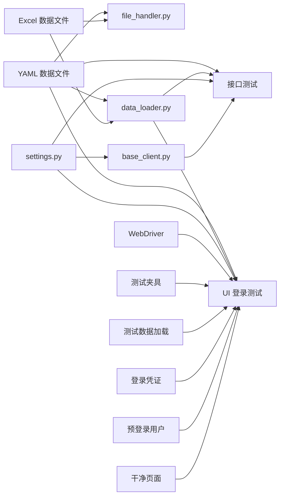

# 测试数据管理

<cite>
**本文引用的文件**
- [README.md](file://README.md)
- [requirements.txt](file://requirements.txt)
- [pytest.ini](file://pytest.ini)
- [conftest.py](file://conftest.py)
- [config/settings.py](file://config/settings.py)
- [config/environments/dev.yaml](file://config/environments/dev.yaml)
- [config/environments/test.yaml](file://config/environments/test.yaml)
- [config/environments/prod.yaml](file://config/environments/prod.yaml)
- [common/file_handler.py](file://common/file_handler.py)
- [common/data_loader.py](file://common/data_loader.py)
- [api_testing/api_client/base_client.py](file://api_testing/api_client/base_client.py)
- [api_testing/testcases/conftest.py](file://api_testing/testcases/conftest.py)
- [api_testing/testdata/example_api_data.yaml](file://api_testing/testdata/example_api_data.yaml)
- [api_testing/testdata/README.md](file://api_testing/testdata/README.md)
- [ui_automation/testcases/conftest.py](file://ui_automation/testcases/conftest.py)
- [ui_automation/testdata/tos_login_data.yaml](file://ui_automation/testdata/tos_login_data.yaml)
- [ui_automation/testdata/README.md](file://ui_automation/testdata/README.md)
- [ui_automation/testdata/fixtures/account_fixtures.yaml](file://ui_automation/testdata/fixtures/account_fixtures.yaml)
- [ui_automation/testdata/fixtures/user_fixtures.yaml](file://ui_automation/testdata/fixtures/user_fixtures.yaml)
- [testcase_generator/generator.py](file://testcase_generator/generator.py)
- [ui_automation/testcases/smoke/test_tos_login.py](file://ui_automation/testcases/smoke/test_tos_login.py)
- [api_testing/testcases/test_example_api.py](file://api_testing/testcases/test_example_api.py)
</cite>

## 目录
1. [引言](#引言)
2. [项目结构](#项目结构)
3. [核心组件](#核心组件)
4. [架构总览](#架构总览)
5. [详细组件分析](#详细组件分析)
6. [依赖分析](#依赖分析)
7. [性能考虑](#性能考虑)
8. [故障排查指南](#故障排查指南)
9. [结论](#结论)
10. [附录](#附录)

## 引言
本文件系统性阐述测试数据管理的设计与实现，围绕 YAML 格式的配置与测试数据文件、数据结构与层次化组织、加载机制（文件读取、数据解析、参数化测试集成）、最佳实践（可维护性、敏感信息处理、多环境管理）、在测试用例中的使用方式（参数化与动态生成）、版本控制与更新策略、数据验证机制及与其他测试组件的集成关系展开。

**更新** 本次更新反映了测试数据结构的简化，保留了 fixtures 和测试数据的组织方式，同时优化了数据加载工具的统一接口设计。

## 项目结构
该项目采用模块化组织，测试数据主要分布在各模块的 testdata 目录中，并通过统一的配置中心 settings.py 与环境配置文件联动，形成"配置-数据-用例"的清晰边界。

**图表来源**
- [README.md: 7-42:7-42](file://README.md#L7-L42)
- [config/settings.py: 1-104:1-104](file://config/settings.py#L1-L104)
- [common/file_handler.py: 1-217:1-217](file://common/file_handler.py#L1-L217)
- [common/data_loader.py: 1-115:1-115](file://common/data_loader.py#L1-L115)
- [api_testing/api_client/base_client.py: 1-308:1-308](file://api_testing/api_client/base_client.py#L1-L308)
- [api_testing/testcases/conftest.py: 1-80:1-80](file://api_testing/testcases/conftest.py#L1-L80)
- [ui_automation/testcases/conftest.py: 1-78:1-78](file://ui_automation/testcases/conftest.py#L1-L78)
- [testcase_generator/generator.py: 1-263:1-263](file://testcase_generator/generator.py#L1-L263)

**章节来源**
- [README.md: 7-42:7-42](file://README.md#L7-L42)
- [pytest.ini: 1-16:1-16](file://pytest.ini#L1-L16)

## 核心组件
- 环境配置与多环境管理：通过 settings.py 统一加载 dev/test/prod 环境配置，提供属性访问与 get 方法，便于在客户端与用例中直接使用。
- 文件处理工具：common/file_handler.py 提供 YAML/Excel 的读写与多文档读取能力，支持错误日志与目录自动创建。
- 数据加载工具：common/data_loader.py 提供统一的数据加载接口，支持多种格式的数据文件，包含专门的 fixtures 数据加载方法。
- 接口测试客户端：api_testing/api_client/base_client.py 封装 HTTP 请求、会话管理、认证头设置、断言工具与日志记录。
- 测试数据文件：接口与 UI 模块各自维护 testdata 目录，采用 YAML 结构化存储，便于参数化与维护。
- 全局与模块级 fixtures：conftest.py 提供 WebDriver 初始化与失败截图钩子；api_testing/testcases/conftest.py 提供 API 客户端与基础 URL；ui_automation/testcases/conftest.py 提供测试数据加载与预登录夹具。
- 测试夹具系统：ui_automation/testdata/fixtures 目录提供预置数据，支持账户、用户等测试夹具的复用。

**更新** 优化了 data_loader.py 组件，增加了专门的 fixtures 数据加载方法，简化了测试数据结构的使用方式。

**章节来源**
- [config/settings.py: 13-104:13-104](file://config/settings.py#L13-L104)
- [common/file_handler.py: 13-217:13-217](file://common/file_handler.py#L13-L217)
- [common/data_loader.py: 14-115:14-115](file://common/data_loader.py#L14-L115)
- [api_testing/api_client/base_client.py: 18-308:18-308](file://api_testing/api_client/base_client.py#L18-L308)
- [api_testing/testcases/conftest.py: 16-80:16-80](file://api_testing/testcases/conftest.py#L16-L80)
- [ui_automation/testcases/conftest.py: 1-78:1-78](file://ui_automation/testcases/conftest.py#L1-L78)
- [conftest.py: 25-148:25-148](file://conftest.py#L25-L148)

## 架构总览
下图展示了测试数据在系统中的位置与流向：用例通过 fixtures 或自定义函数加载 testdata 目录中的 YAML 数据，结合 settings 的环境配置与 API 客户端完成请求与断言。

```mermaid
graph TB
subgraph "测试用例层"
T1["UI 登录测试<br/>ui_automation/testcases/smoke/test_tos_login.py"]
T2["接口测试 fixtures<br/>api_testing/testcases/conftest.py"]
T3["UI 测试 fixtures<br/>ui_automation/testcases/conftest.py"]
end
subgraph "数据层"
D1["UI 测试数据<br/>ui_automation/testdata/tos_login_data.yaml"]
D2["接口测试数据<br/>api_testing/testdata/example_api_data.yaml"]
D3["测试夹具数据<br/>ui_automation/testdata/fixtures/*.yaml"]
FH["文件处理工具<br/>common/file_handler.py"]
DL["数据加载工具<br/>common/data_loader.py"]
END["环境配置<br/>config/environments/prod.yaml"]
END2["环境配置<br/>config/environments/dev.yaml"]
END3["环境配置<br/>config/environments/test.yaml"]
END4["配置中心<br/>config/settings.py"]
END5["API 客户端<br/>api_testing/api_client/base_client.py"]
END6["WebDriver<br/>conftest.py"]
END7["测试夹具系统<br/>fixtures"]
END8["通用测试数据加载<br/>test_data fixture"]
END9["登录凭证数据<br/>login_credentials fixture"]
END10["预登录用户<br/>logged_in_user fixture"]
END11["干净页面<br/>fresh_page fixture"]
END12["示例接口测试<br/>api_testing/testcases/test_example_api.py"]
END13["登录数据加载<br/>load_yaml_data 函数"]
END14["测试数据目录<br/>TESTDATA_DIR 变量"]
END15["测试数据读取<br/>self.test_data = load_yaml_data(...)"]
end
T1 --> D1
T1 --> END4
T1 --> END6
T1 --> END8
T1 --> END13
T1 --> END15
T2 --> D2
T2 --> END4
T2 --> END5
T2 --> END12
T3 --> D1
T3 --> D3
T3 --> END7
T3 --> END8
T3 --> END9
T3 --> END10
T3 --> END11
D1 --> FH
D2 --> FH
D3 --> DL
END4 --> END
END4 --> END2
END4 --> END3
END4 --> END5
END4 --> END6
END4 --> END7
END4 --> END8
END4 --> END9
END4 --> END10
END4 --> END11
END4 --> END12
END4 --> END13
END4 --> END14
END4 --> END15
```

**图表来源**
- [ui_automation/testcases/smoke/test_tos_login.py: 27-105:27-105](file://ui_automation/testcases/smoke/test_tos_login.py#L27-L105)
- [api_testing/testcases/conftest.py: 16-80:16-80](file://api_testing/testcases/conftest.py#L16-L80)
- [ui_automation/testcases/conftest.py: 20-78:20-78](file://ui_automation/testcases/conftest.py#L20-L78)
- [ui_automation/testdata/tos_login_data.yaml: 1-11:1-11](file://ui_automation/testdata/tos_login_data.yaml#L1-L11)
- [api_testing/testdata/example_api_data.yaml: 1-116:1-116](file://api_testing/testdata/example_api_data.yaml#L1-L116)
- [ui_automation/testdata/fixtures/account_fixtures.yaml: 1-21:1-21](file://ui_automation/testdata/fixtures/account_fixtures.yaml#L1-L21)
- [ui_automation/testdata/fixtures/user_fixtures.yaml: 1-21:1-21](file://ui_automation/testdata/fixtures/user_fixtures.yaml#L1-L21)
- [common/file_handler.py: 13-78:13-78](file://common/file_handler.py#L13-L78)
- [common/data_loader.py: 14-115:14-115](file://common/data_loader.py#L14-L115)
- [config/settings.py: 37-48:37-48](file://config/settings.py#L37-L48)
- [config/environments/dev.yaml: 1-31:1-31](file://config/environments/dev.yaml#L1-L31)
- [config/environments/test.yaml: 1-31:1-31](file://config/environments/test.yaml#L1-L31)
- [config/environments/prod.yaml: 1-31:1-31](file://config/environments/prod.yaml#L1-L31)
- [api_testing/api_client/base_client.py: 18-308:18-308](file://api_testing/api_client/base_client.py#L18-L308)
- [conftest.py: 25-74:25-74](file://conftest.py#L25-L74)

## 详细组件分析

### YAML 测试数据文件设计与层次化组织
- 接口测试数据（example_api_data.yaml）采用"接口名 -> endpoint/method/cases"结构，每个接口包含多个测试 case，每个 case 包含 name/description/request/params/expected 等字段，便于参数化与扩展。
- UI 登录测试数据（tos_login_data.yaml）采用"有效/登录成功"分类，结构简洁明了，便于快速访问和使用。
- 测试夹具数据（account_fixtures.yaml、user_fixtures.yaml）采用"场景名 -> 字段值"的结构，支持账户注册、密码重置、用户角色等预置数据的复用。
- 目录规范：各模块 testdata 下提供 README.md 说明用途，保持一致性与可维护性。

**更新** 简化了测试数据结构，移除了不必要的嵌套层级，提高了数据访问效率。

**章节来源**
- [api_testing/testdata/example_api_data.yaml: 1-116:1-116](file://api_testing/testdata/example_api_data.yaml#L1-L116)
- [ui_automation/testdata/tos_login_data.yaml: 1-11:1-11](file://ui_automation/testdata/tos_login_data.yaml#L1-L11)
- [ui_automation/testdata/fixtures/account_fixtures.yaml: 1-21:1-21](file://ui_automation/testdata/fixtures/account_fixtures.yaml#L1-L21)
- [ui_automation/testdata/fixtures/user_fixtures.yaml: 1-21:1-21](file://ui_automation/testdata/fixtures/user_fixtures.yaml#L1-L21)
- [api_testing/testdata/README.md: 1-4:1-4](file://api_testing/testdata/README.md#L1-L4)
- [ui_automation/testdata/README.md: 1-4:1-4](file://ui_automation/testdata/README.md#L1-L4)

### 测试数据加载机制
- UI 用例通过自定义函数读取 YAML 并解析为字典/列表，再在测试方法中按键取值使用。
- 接口测试通过模块级 conftest.py 提供的 fixtures 注入 API 客户端与基础 URL，配合 settings 的环境配置。
- 文件处理工具提供安全读取与多文档读取能力，支持异常日志与目录自动创建。
- 数据加载工具提供统一的数据访问接口，支持按需加载特定数据节点，包含专门的 fixtures 数据加载方法。

**图表来源**
- [ui_automation/testcases/smoke/test_tos_login.py: 32-42:32-42](file://ui_automation/testcases/smoke/test_tos_login.py#L32-L42)
- [common/file_handler.py: 16-36:16-36](file://common/file_handler.py#L16-L36)
- [common/data_loader.py: 14-115:14-115](file://common/data_loader.py#L14-L115)
- [config/settings.py: 50-96:50-96](file://config/settings.py#L50-L96)
- [api_testing/api_client/base_client.py: 21-44:21-44](file://api_testing/api_client/base_client.py#L21-L44)

**章节来源**
- [ui_automation/testcases/smoke/test_tos_login.py: 32-42:32-42](file://ui_automation/testcases/smoke/test_tos_login.py#L32-L42)
- [common/file_handler.py: 16-78:16-78](file://common/file_handler.py#L16-L78)
- [common/data_loader.py: 14-115:14-115](file://common/data_loader.py#L14-L115)
- [config/settings.py: 37-96:37-96](file://config/settings.py#L37-L96)
- [api_testing/api_client/base_client.py: 21-44:21-44](file://api_testing/api_client/base_client.py#L21-L44)

### 参数化测试与动态数据生成
- 接口测试数据采用 YAML 层次化结构，可在测试中按接口名与 case 名进行参数化，支持多组请求体/参数/期望值组合。
- UI 用例通过读取 YAML 数组，逐条断言，实现参数化与动态数据驱动。
- 测试夹具系统提供预置数据的复用，支持不同测试场景的数据需求。
- 测试用例生成器支持从测试点批量生成 YAML 和 Excel 格式的测试用例，便于数据驱动测试。

**更新** 优化了数据加载工具的参数化支持，提供了更简洁的 fixtures 数据加载接口。

**章节来源**
- [api_testing/testdata/example_api_data.yaml: 7-116:7-116](file://api_testing/testdata/example_api_data.yaml#L7-L116)
- [ui_automation/testdata/tos_login_data.yaml: 4-11:4-11](file://ui_automation/testdata/tos_login_data.yaml#L4-L11)
- [api_testing/testcases/conftest.py: 16-80:16-80](file://api_testing/testcases/conftest.py#L16-L80)
- [ui_automation/testcases/conftest.py: 20-78:20-78](file://ui_automation/testcases/conftest.py#L20-L78)
- [testcase_generator/generator.py: 127-173:127-173](file://testcase_generator/generator.py#L127-L173)

### 多环境数据与配置管理策略
- 通过 settings.py 读取 config/environments 下的 dev/test/prod 配置文件，支持 TEST_ENV 环境变量切换。
- API 客户端与 fixtures 均从 settings 获取基础 URL、超时、浏览器配置等，确保测试在不同环境的一致性。
- 测试夹具数据支持按环境切换，通过不同的配置文件提供相应的测试数据。

**更新** 增强了多环境配置对测试夹具数据的支持，提供了更灵活的数据管理方式。

**章节来源**
- [config/settings.py: 26-48:26-48](file://config/settings.py#L26-L48)
- [config/environments/dev.yaml: 1-31:1-31](file://config/environments/dev.yaml#L1-L31)
- [config/environments/test.yaml: 1-31:1-31](file://config/environments/test.yaml#L1-L31)
- [config/environments/prod.yaml: 1-31:1-31](file://config/environments/prod.yaml#L1-L31)
- [api_testing/api_client/base_client.py: 27-29:27-29](file://api_testing/api_client/base_client.py#L27-L29)
- [api_testing/testcases/conftest.py: 74-80:74-80](file://api_testing/testcases/conftest.py#L74-L80)
- [conftest.py: 76-82:76-82](file://conftest.py#L76-L82)

### 敏感信息处理与安全策略
- 建议：将 token、账号密码等敏感信息放入环境配置文件并在 CI/CD 中通过密文注入；在本地开发中使用占位符并通过环境变量覆盖。
- 在 YAML 中避免硬编码明文；如需演示数据，仅使用示例值并标注"[TODO: 替换]"。
- 测试夹具数据中的敏感信息应遵循相同的安全原则，避免在版本控制中暴露真实凭据。

**更新** 新增了测试夹具数据的敏感信息处理要求。

**章节来源**
- [config/environments/dev.yaml: 7-23:7-23](file://config/environments/dev.yaml#L7-L23)
- [config/environments/test.yaml: 7-23:7-23](file://config/environments/test.yaml#L7-L23)
- [api_testing/testcases/conftest.py: 47-63:47-63](file://api_testing/testcases/conftest.py#L47-L63)

### 版本控制与更新策略
- 将 testdata 目录纳入版本控制，每次变更记录在提交信息中，明确"新增/修改/删除"的测试场景。
- 建议：对大规模数据变更采用分支策略，先在 dev 环境验证，再合并至 test/prod。
- 测试夹具数据的版本管理应特别注意，确保不同环境下的数据一致性。

**更新** 新增了测试夹具数据的版本控制要求。

**章节来源**
- [README.md: 99-114:99-114](file://README.md#L99-L114)

### 数据验证机制
- 接口测试客户端提供多种断言方法：状态码断言、JSON 键存在与值断言、响应时间断言、JSON 子集匹配、列表非空断言等。
- UI 用例通过断言 URL 跳转或错误提示文本，确保业务流程与预期一致。
- 测试夹具系统提供数据完整性验证，确保预置数据的有效性。

**更新** 新增了测试夹具系统的数据验证机制。

**章节来源**
- [api_testing/api_client/base_client.py: 233-295:233-295](file://api_testing/api_client/base_client.py#L233-L295)
- [ui_automation/testcases/smoke/test_tos_login.py: 69-73:69-73](file://ui_automation/testcases/smoke/test_tos_login.py#L69-L73)
- [ui_automation/testcases/smoke/test_tos_login.py: 100-104:100-104](file://ui_automation/testcases/smoke/test_tos_login.py#L100-L104)

### 与其他测试组件的集成
- 与 pytest 标记系统集成：通过 pytest.ini 注册 smoke/functional/regression 等标记，配合 conftest.py 的钩子实现失败截图与证据收集。
- 与 WebDriver 集成：全局 conftest.py 提供浏览器初始化与销毁，UI 用例可直接使用 driver 与 base_url。
- 与 API 客户端集成：接口测试通过 fixtures 注入带认证与基础 URL 的客户端，简化用例编写。
- 与测试夹具系统集成：通过 fixtures 提供预置数据，支持测试数据的复用与管理。

**更新** 新增了测试夹具系统与其他组件的集成。

**章节来源**
- [pytest.ini: 7-16:7-16](file://pytest.ini#L7-L16)
- [conftest.py: 84-125:84-125](file://conftest.py#L84-L125)
- [conftest.py: 25-74:25-74](file://conftest.py#L25-L74)
- [api_testing/testcases/conftest.py: 16-80:16-80](file://api_testing/testcases/conftest.py#L16-L80)
- [ui_automation/testcases/conftest.py: 20-78:20-78](file://ui_automation/testcases/conftest.py#L20-L78)

### 多格式数据支持与测试用例生成
- 文件处理工具支持 YAML 和 Excel 格式的读写操作，提供完整的数据导入导出能力。
- 测试用例生成器支持从测试点批量生成 YAML 和 Excel 格式的测试用例，便于数据驱动测试。
- 数据加载工具提供统一的接口，支持不同格式数据文件的加载与解析，包含专门的 fixtures 数据加载方法。

**更新** 增强了数据加载工具的多格式支持，优化了 fixtures 数据的加载接口。

**章节来源**
- [common/file_handler.py: 80-217:80-217](file://common/file_handler.py#L80-L217)
- [testcase_generator/generator.py: 127-173:127-173](file://testcase_generator/generator.py#L127-L173)
- [common/data_loader.py: 14-115:14-115](file://common/data_loader.py#L14-L115)

## 依赖分析
- 测试数据依赖于文件处理工具与配置中心；用例通过 fixtures 间接依赖配置中心与客户端。
- 数据加载工具提供统一接口，支持多种数据格式的访问，包含专门的 fixtures 数据加载方法。
- 依赖耦合度低：数据文件与用例解耦，通过函数/fixture读取，便于替换与扩展。
- 外部依赖：PyYAML、requests、selenium、openpyxl、loguru、pytest 生态等。

**图表来源**
- [common/file_handler.py: 13-78:13-78](file://common/file_handler.py#L13-L78)
- [common/file_handler.py: 80-217:80-217](file://common/file_handler.py#L80-L217)
- [common/data_loader.py: 14-115:14-115](file://common/data_loader.py#L14-L115)
- [config/settings.py: 37-96:37-96](file://config/settings.py#L37-L96)
- [api_testing/api_client/base_client.py: 18-308:18-308](file://api_testing/api_client/base_client.py#L18-L308)
- [ui_automation/testcases/smoke/test_tos_login.py: 32-42:32-42](file://ui_automation/testcases/smoke/test_tos_login.py#L32-L42)
- [api_testing/testcases/conftest.py: 16-80:16-80](file://api_testing/testcases/conftest.py#L16-L80)
- [ui_automation/testcases/conftest.py: 20-78:20-78](file://ui_automation/testcases/conftest.py#L20-L78)

**章节来源**
- [requirements.txt: 1-25:1-25](file://requirements.txt#L1-L25)

## 性能考虑
- 文件读取：YAML/Excel 读取建议缓存小规模静态数据，避免在热路径频繁 IO。
- 断言与日志：合理使用日志级别，避免在高频断言中输出大体量 JSON。
- 并行执行：pytest-xdist 支持并行，但需确保数据文件与共享资源的并发安全。
- 测试夹具缓存：对于频繁使用的预置数据，建议在测试会话级别进行缓存以提升性能。

**更新** 新增了测试夹具缓存的性能考虑。

## 故障排查指南
- YAML 解析失败：检查文件编码与缩进，确认 safe_load 返回值非空；查看日志错误信息。
- 文件不存在：确认路径拼接与相对路径基准；使用 file_handler 的目录自动创建能力。
- 配置读取异常：核对 TEST_ENV 与环境文件名；确认配置键是否存在。
- 接口请求异常：关注超时与连接错误日志；核对基础 URL 与认证头。
- UI 截图失败：确认证据目录权限与驱动可用性；检查异常捕获与日志输出。
- 测试夹具加载失败：检查夹具文件路径与数据格式，确认 fixtures 作用域正确。
- Excel 文件读取异常：确认文件格式兼容性和工作表名称正确性。

**更新** 新增了测试夹具和 Excel 文件的故障排查指南。

**章节来源**
- [common/file_handler.py: 23-36:23-36](file://common/file_handler.py#L23-L36)
- [config/settings.py: 42-45:42-45](file://config/settings.py#L42-L45)
- [api_testing/api_client/base_client.py: 122-133:122-133](file://api_testing/api_client/base_client.py#L122-L133)
- [conftest.py: 109-125:109-125](file://conftest.py#L109-L125)

## 结论
本项目通过"配置中心 + YAML/Excel 测试数据 + 文件处理工具 + 数据加载工具 + fixtures 测试夹具"的组合，实现了测试数据的可维护、可扩展与可移植。本次更新反映了测试数据结构的简化，保留了 fixtures 和测试数据的组织方式，同时优化了数据加载工具的统一接口设计。新增的多格式数据支持和测试夹具系统进一步提升了测试数据管理的灵活性和复用性。建议在团队内推广统一的数据命名规范、参数化策略与环境配置管理流程，持续完善数据验证与安全策略，以支撑更大规模的测试体系演进。

## 附录
- 快速开始与运行命令参见项目根目录说明。
- 依赖清单与版本信息参见 requirements.txt。

**章节来源**
- [README.md: 45-82:45-82](file://README.md#L45-L82)
- [requirements.txt: 1-25:1-25](file://requirements.txt#L1-L25)