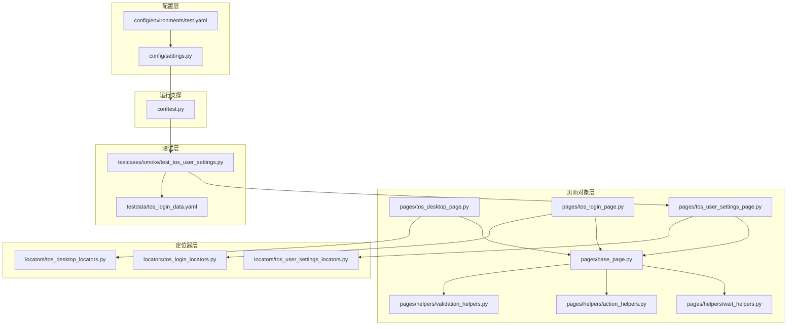
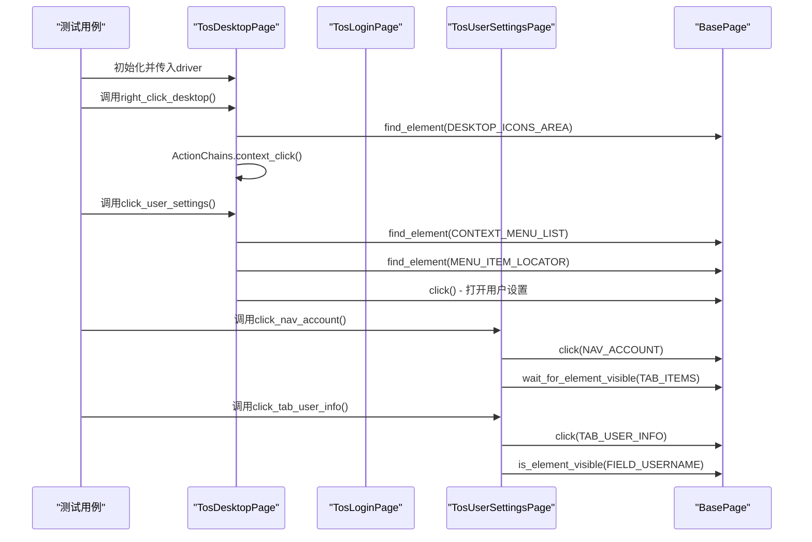
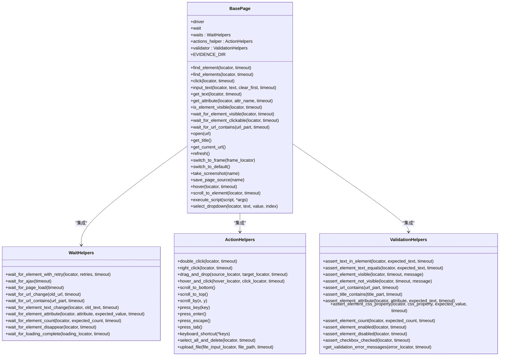
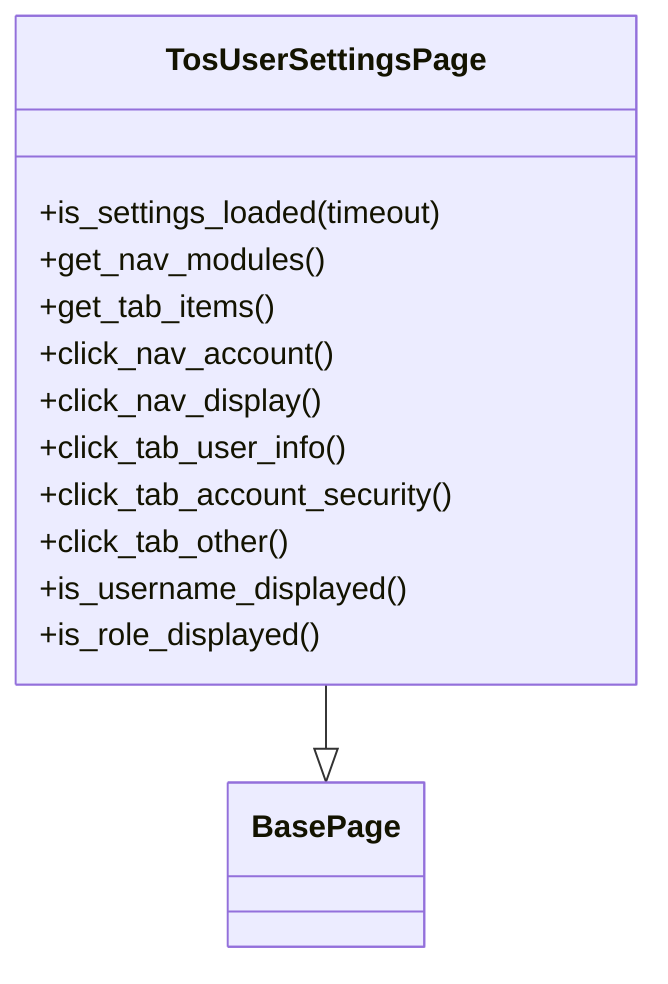
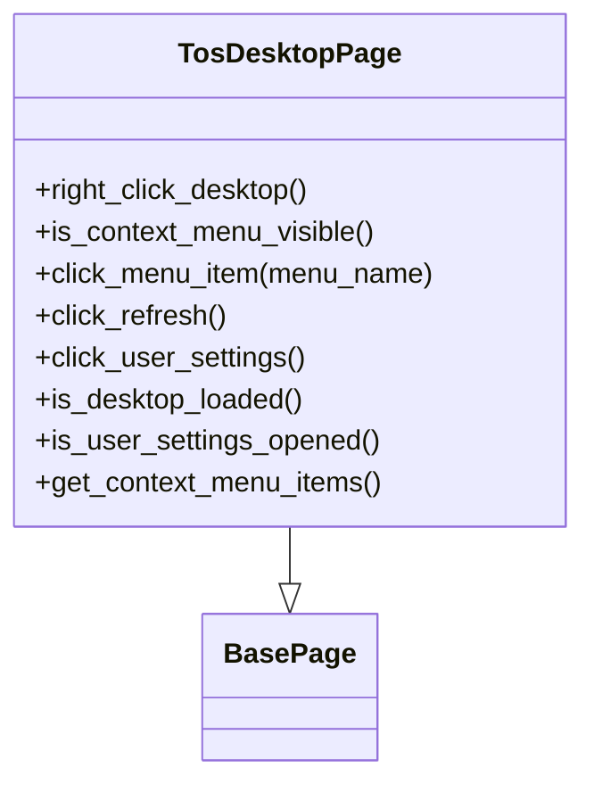
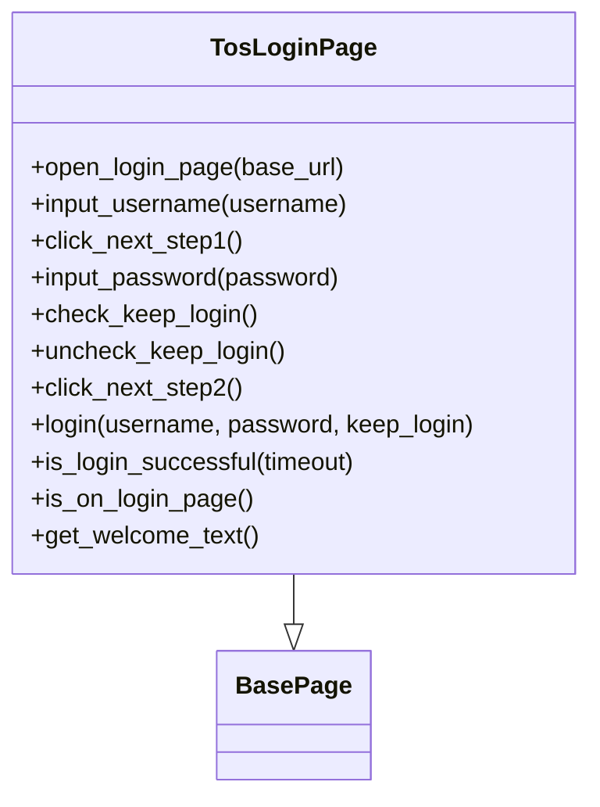
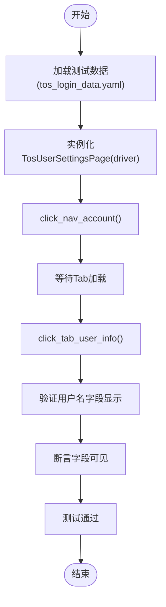
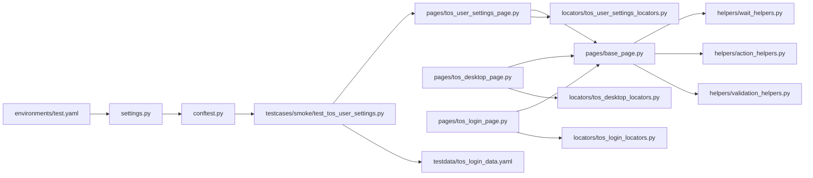

# 页面对象开发指南

<cite>
**本文引用的文件**
- [ui_automation/pages/base_page.py](file://ui_automation/pages/base_page.py)
- [ui_automation/pages/pages/tos_desktop_page.py](file://ui_automation/pages/pages/tos_desktop_page.py)
- [ui_automation/pages/pages/tos_login_page.py](file://ui_automation/pages/pages/tos_login_page.py)
- [ui_automation/pages/pages/tos_user_settings_page.py](file://ui_automation/pages/pages/tos_user_settings_page.py)
- [ui_automation/pages/locators/tos_user_settings_locators.py](file://ui_automation/pages/locators/tos_user_settings_locators.py)
- [ui_automation/pages/locators/tos_desktop_locators.py](file://ui_automation/pages/locators/tos_desktop_locators.py)
- [ui_automation/pages/locators/tos_login_locators.py](file://ui_automation/pages/locators/tos_login_locators.py)
- [ui_automation/pages/helpers/wait_helpers.py](file://ui_automation/pages/helpers/wait_helpers.py)
- [ui_automation/pages/helpers/action_helpers.py](file://ui_automation/pages/helpers/action_helpers.py)
- [ui_automation/pages/helpers/validation_helpers.py](file://ui_automation/pages/helpers/validation_helpers.py)
- [ui_automation/testcases/smoke/test_tos_user_settings.py](file://ui_automation/testcases/smoke/test_tos_user_settings.py)
- [config/settings.py](file://config/settings.py)
- [conftest.py](file://conftest.py)
- [ui_automation/testdata/tos_login_data.yaml](file://ui_automation/testdata/tos_login_data.yaml)
- [config/environments/test.yaml](file://config/environments/test.yaml)
- [README.md](file://README.md)
</cite>

## 更新摘要
**所做更改**
- 删除了通用示例页面对象部分，包括 example_page.py 和相关测试
- 新增了TOS专用页面对象开发指南，涵盖用户设置页面、桌面页面和登录页面
- 更新了页面对象架构图，反映TOS专用页面对象的结构
- 增加了TOS用户设置页面对象的详细开发示例
- 更新了测试策略，从通用测试转向TOS专用测试用例

## 目录
1. [简介](#简介)
2. [项目结构](#项目结构)
3. [核心组件](#核心组件)
4. [架构总览](#架构总览)
5. [详细组件分析](#详细组件分析)
6. [依赖关系分析](#依赖关系分析)
7. [性能考量](#性能考量)
8. [故障排查指南](#故障排查指南)
9. [结论](#结论)
10. [附录](#附录)

## 简介
本指南面向希望系统化掌握TOS专用页面对象开发的工程师，基于仓库中现有的TOS页面对象实现，提供从设计原则、继承关系、元素定位策略、命名规范、方法组织、测试策略到协作与维护的全流程文档。文档强调可维护性、可扩展性和可复用性，帮助团队在TOS系统复杂的UI自动化测试场景下稳定地构建页面对象体系。

## 项目结构
本项目采用"模块化 + TOS专用Page Object模式"的组织方式，UI自动化相关代码集中在ui_automation目录，配置集中在config目录，公共工具在common目录。页面对象层由基类与具体TOS页面组成，配合定位器模块和辅助工具提升稳定性与可读性。

**图表来源**
- [config/settings.py:1-104](file://config/settings.py#L1-L104)
- [config/environments/test.yaml:1-31](file://config/environments/test.yaml#L1-L31)
- [conftest.py:1-148](file://conftest.py#L1-L148)
- [ui_automation/pages/base_page.py:1-515](file://ui_automation/pages/base_page.py#L1-L515)
- [ui_automation/pages/pages/tos_desktop_page.py:1-98](file://ui_automation/pages/pages/tos_desktop_page.py#L1-L98)
- [ui_automation/pages/pages/tos_login_page.py:1-163](file://ui_automation/pages/pages/tos_login_page.py#L1-L163)
- [ui_automation/pages/pages/tos_user_settings_page.py:1-102](file://ui_automation/pages/pages/tos_user_settings_page.py#L1-L102)
- [ui_automation/pages/locators/tos_user_settings_locators.py:1-34](file://ui_automation/pages/locators/tos_user_settings_locators.py#L1-L34)
- [ui_automation/pages/locators/tos_desktop_locators.py](file://ui_automation/pages/locators/tos_desktop_locators.py)
- [ui_automation/pages/locators/tos_login_locators.py](file://ui_automation/pages/locators/tos_login_locators.py)
- [ui_automation/testcases/smoke/test_tos_user_settings.py](file://ui_automation/testcases/smoke/test_tos_user_settings.py)

**章节来源**
- [README.md:1-123](file://README.md#L1-L123)
- [config/settings.py:1-104](file://config/settings.py#L1-L104)
- [config/environments/test.yaml:1-31](file://config/environments/test.yaml#L1-L31)
- [conftest.py:1-148](file://conftest.py#L1-L148)
- [ui_automation/pages/base_page.py:1-515](file://ui_automation/pages/base_page.py#L1-L515)
- [ui_automation/pages/pages/tos_desktop_page.py:1-98](file://ui_automation/pages/pages/tos_desktop_page.py#L1-L98)
- [ui_automation/pages/pages/tos_login_page.py:1-163](file://ui_automation/pages/pages/tos_login_page.py#L1-L163)
- [ui_automation/pages/pages/tos_user_settings_page.py:1-102](file://ui_automation/pages/pages/tos_user_settings_page.py#L1-L102)
- [ui_automation/pages/locators/tos_user_settings_locators.py:1-34](file://ui_automation/pages/locators/tos_user_settings_locators.py#L1-L34)

## 核心组件
- 基类BasePage：封装WebDriver常用操作，集成等待、动作、断言辅助工具；提供页面导航、截图与证据保存能力；统一异常处理与日志记录。
- 辅助工具：
  - WaitHelpers：增强等待策略（重试、AJAX、页面加载、URL变化、元素计数、加载动画等）。
  - ActionHelpers：高级交互（双击、右键、拖拽、悬停后点击、滚动、快捷键、文件上传等）。
  - ValidationHelpers：断言与验证（文本、可见性、URL、标题、属性、CSS、启用状态、复选框等）。
- TOS专用页面对象：
  - TosDesktopPage：封装桌面右键菜单操作，支持右键触发和菜单项点击。
  - TosLoginPage：封装两步式登录流程，支持用户名输入、密码输入和保持登录选项。
  - TosUserSettingsPage：封装用户设置界面导航、Tab切换和字段验证。
- 定位器模块：将页面元素定位器集中管理，支持TOS系统的复杂UI结构。

**章节来源**
- [ui_automation/pages/base_page.py:36-515](file://ui_automation/pages/base_page.py#L36-L515)
- [ui_automation/pages/helpers/wait_helpers.py:16-125](file://ui_automation/pages/helpers/wait_helpers.py#L16-L125)
- [ui_automation/pages/helpers/action_helpers.py:17-124](file://ui_automation/pages/helpers/action_helpers.py#L17-L124)
- [ui_automation/pages/helpers/validation_helpers.py:15-140](file://ui_automation/pages/helpers/validation_helpers.py#L15-L140)
- [ui_automation/pages/pages/tos_desktop_page.py:20-98](file://ui_automation/pages/pages/tos_desktop_page.py#L20-L98)
- [ui_automation/pages/pages/tos_login_page.py:18-163](file://ui_automation/pages/pages/tos_login_page.py#L18-L163)
- [ui_automation/pages/pages/tos_user_settings_page.py:19-102](file://ui_automation/pages/pages/tos_user_settings_page.py#L19-L102)

## 架构总览
TOS专用页面对象模式通过"页面对象"封装TOS系统的特定页面元素与操作，测试用例只关心业务步骤，不直接操作底层定位器，从而降低耦合、提升可维护性。本架构的关键点：
- 统一入口：conftest.py提供driver与base_url fixture，settings读取环境配置。
- 页面对象：BasePage提供通用能力，具体TOS页面继承并封装业务方法。
- 定位器分离：将定位器集中管理，支持TOS系统的复杂UI结构。
- 辅助工具：将复杂等待、交互、断言逻辑下沉，减少重复代码。
- 测试组织：pytest标记与数据驱动，结合证据收集与失败截图。

**图表来源**
- [ui_automation/testcases/smoke/test_tos_user_settings.py](file://ui_automation/testcases/smoke/test_tos_user_settings.py)
- [ui_automation/pages/pages/tos_desktop_page.py:31-70](file://ui_automation/pages/pages/tos_desktop_page.py#L31-L70)
- [ui_automation/pages/pages/tos_user_settings_page.py:56-91](file://ui_automation/pages/pages/tos_user_settings_page.py#L56-L91)
- [ui_automation/pages/base_page.py:296-311](file://ui_automation/pages/base_page.py#L296-L311)

## 详细组件分析

### BasePage设计与职责
- 设计原则
  - 单一职责：封装页面通用操作与等待、交互、断言辅助工具。
  - 可扩展：通过self.waits/self.actions_helper/self.validator访问辅助工具。
  - 可观测：统一的日志记录与失败截图，便于问题定位。
  - 可维护：统一的异常处理与证据输出，支持链式调用。
- 关键能力
  - 元素操作：find_element/find_elements/click/input_text/get_text/get_attribute/is_element_visible。
  - 等待操作：wait_for_element_visible/wait_for_element_clickable/wait_for_url_contains等。
  - 页面操作：open/get_title/get_current_url/refresh/switch_to_frame/switch_to_default。
  - 高级操作：hover/scroll_to_element/execute_script/select_dropdown。
  - 截图与证据：take_screenshot/save_page_source。
- 异常与日志
  - 对关键操作进行try-except包裹，失败时记录日志并截图，便于后续分析。

**图表来源**
- [ui_automation/pages/base_page.py:36-515](file://ui_automation/pages/base_page.py#L36-L515)
- [ui_automation/pages/helpers/wait_helpers.py:16-125](file://ui_automation/pages/helpers/wait_helpers.py#L16-L125)
- [ui_automation/pages/helpers/action_helpers.py:17-124](file://ui_automation/pages/helpers/action_helpers.py#L17-L124)
- [ui_automation/pages/helpers/validation_helpers.py:15-140](file://ui_automation/pages/helpers/validation_helpers.py#L15-L140)

**章节来源**
- [ui_automation/pages/base_page.py:36-515](file://ui_automation/pages/base_page.py#L36-L515)
- [ui_automation/pages/helpers/wait_helpers.py:16-125](file://ui_automation/pages/helpers/wait_helpers.py#L16-L125)
- [ui_automation/pages/helpers/action_helpers.py:17-124](file://ui_automation/pages/helpers/action_helpers.py#L17-L124)
- [ui_automation/pages/helpers/validation_helpers.py:15-140](file://ui_automation/pages/helpers/validation_helpers.py#L15-L140)

### TosUserSettingsPage页面对象
- 继承关系：TosUserSettingsPage继承BasePage，复用其元素操作与等待/断言能力。
- 定位器组织：使用TosUserSettingsLocators集中管理用户设置页面的定位器。
- 功能特性：
  - 界面验证：is_settings_loaded()验证用户设置界面加载完成。
  - 导航操作：click_nav_account()/click_nav_display()处理左侧导航点击。
  - Tab操作：click_tab_user_info()/click_tab_account_security()/click_tab_other()处理Tab切换。
  - 字段验证：is_username_displayed()/is_role_displayed()验证关键字段显示。
- 页面导航：通过定位器模块与BasePage的等待机制，确保页面状态稳定。

**图表来源**
- [ui_automation/pages/pages/tos_user_settings_page.py:19-102](file://ui_automation/pages/pages/tos_user_settings_page.py#L19-L102)
- [ui_automation/pages/base_page.py:36-515](file://ui_automation/pages/base_page.py#L36-L515)

**章节来源**
- [ui_automation/pages/pages/tos_user_settings_page.py:19-102](file://ui_automation/pages/pages/tos_user_settings_page.py#L19-L102)
- [ui_automation/pages/locators/tos_user_settings_locators.py:8-34](file://ui_automation/pages/locators/tos_user_settings_locators.py#L8-L34)

### TosDesktopPage页面对象
- 继承关系：TosDesktopPage继承BasePage，封装桌面右键菜单操作。
- 功能特性：
  - 右键菜单操作：right_click_desktop()执行右键操作，click_menu_item()点击菜单项。
  - 验证方法：is_context_menu_visible()判断菜单显示，is_user_settings_opened()判断用户设置窗口。
  - 快捷方法：click_refresh()/click_user_settings()提供常用操作的便捷方法。
- 特殊处理：针对TOS系统的SPA特性，使用time.sleep()处理页面渲染延迟。

**图表来源**
- [ui_automation/pages/pages/tos_desktop_page.py:20-98](file://ui_automation/pages/pages/tos_desktop_page.py#L20-L98)
- [ui_automation/pages/base_page.py:36-515](file://ui_automation/pages/base_page.py#L36-L515)

**章节来源**
- [ui_automation/pages/pages/tos_desktop_page.py:20-98](file://ui_automation/pages/pages/tos_desktop_page.py#L20-L98)

### TosLoginPage页面对象
- 继承关系：TosLoginPage继承BasePage，封装两步式登录流程。
- 登录流程：
  - 第一步：input_username()输入用户名，click_next_step1()点击下一步。
  - 第二步：input_password()输入密码，check_keep_login()/uncheck_keep_login()处理保持登录选项，click_next_step2()完成登录。
  - 组合操作：login()提供完整的登录流程封装。
- 验证机制：is_login_successful()通过URL变化和页面标题双重验证登录结果。
- 特殊处理：针对TOS系统的图标按钮，使用JavaScript点击方式确保可靠性。

**图表来源**
- [ui_automation/pages/pages/tos_login_page.py:18-163](file://ui_automation/pages/pages/tos_login_page.py#L18-L163)
- [ui_automation/pages/base_page.py:36-515](file://ui_automation/pages/base_page.py#L36-L515)

**章节来源**
- [ui_automation/pages/pages/tos_login_page.py:18-163](file://ui_automation/pages/pages/tos_login_page.py#L18-L163)

### 测试策略与数据驱动
- 测试用例：以test_tos_user_settings.py为例，演示TOS用户设置页面的测试策略。
- 断言策略：使用BasePage集成的等待与断言工具，确保TOS系统复杂页面状态稳定后再断言。
- 失败处理：conftest.py在测试失败时自动截图并附加到Allure报告，便于问题复现。
- 数据驱动：使用YAML数据文件提供测试数据，支持TOS系统的多环境配置。

**图表来源**
- [ui_automation/testcases/smoke/test_tos_user_settings.py](file://ui_automation/testcases/smoke/test_tos_user_settings.py)
- [ui_automation/testdata/tos_login_data.yaml](file://ui_automation/testdata/tos_login_data.yaml)
- [ui_automation/pages/pages/tos_user_settings_page.py:56-91](file://ui_automation/pages/pages/tos_user_settings_page.py#L56-L91)

**章节来源**
- [ui_automation/testcases/smoke/test_tos_user_settings.py](file://ui_automation/testcases/smoke/test_tos_user_settings.py)
- [ui_automation/testdata/tos_login_data.yaml](file://ui_automation/testdata/tos_login_data.yaml)
- [conftest.py:84-125](file://conftest.py#L84-L125)

## 依赖关系分析
- 配置依赖：settings从config/environments/*.yaml读取环境配置，conftest.py通过settings提供base_url与浏览器配置。
- 页面对象依赖：BasePage依赖三个辅助工具类；具体TOS页面（如TosUserSettingsPage）依赖BasePage和对应的定位器模块。
- 测试依赖：测试用例依赖页面对象与测试数据；conftest.py提供driver与失败截图钩子。

**图表来源**
- [config/environments/test.yaml:1-31](file://config/environments/test.yaml#L1-L31)
- [config/settings.py:1-104](file://config/settings.py#L1-L104)
- [conftest.py:1-148](file://conftest.py#L1-L148)
- [ui_automation/testcases/smoke/test_tos_user_settings.py](file://ui_automation/testcases/smoke/test_tos_user_settings.py)
- [ui_automation/pages/pages/tos_user_settings_page.py:1-102](file://ui_automation/pages/pages/tos_user_settings_page.py#L1-L102)
- [ui_automation/pages/base_page.py:1-515](file://ui_automation/pages/base_page.py#L1-L515)
- [ui_automation/pages/locators/tos_user_settings_locators.py:1-34](file://ui_automation/pages/locators/tos_user_settings_locators.py#L1-L34)
- [ui_automation/pages/pages/tos_desktop_page.py:1-98](file://ui_automation/pages/pages/tos_desktop_page.py#L1-L98)
- [ui_automation/pages/pages/tos_login_page.py:1-163](file://ui_automation/pages/pages/tos_login_page.py#L1-L163)

**章节来源**
- [config/settings.py:1-104](file://config/settings.py#L1-L104)
- [config/environments/test.yaml:1-31](file://config/environments/test.yaml#L1-L31)
- [conftest.py:1-148](file://conftest.py#L1-L148)
- [ui_automation/pages/base_page.py:1-515](file://ui_automation/pages/base_page.py#L1-L515)
- [ui_automation/pages/pages/tos_user_settings_page.py:1-102](file://ui_automation/pages/pages/tos_user_settings_page.py#L1-L102)
- [ui_automation/pages/pages/tos_desktop_page.py:1-98](file://ui_automation/pages/pages/tos_desktop_page.py#L1-L98)
- [ui_automation/pages/pages/tos_login_page.py:1-163](file://ui_automation/pages/pages/tos_login_page.py#L1-L163)

## 性能考量
- 等待策略
  - 优先使用显式等待（WebDriverWait + EC），避免硬编码sleep。
  - 对不稳定场景使用重试等待（WaitHelpers.wait_for_element_with_retry）。
  - AJAX与页面加载完成后断言，减少不必要的轮询。
- 元素定位
  - 优先使用稳定且唯一的定位器（如ID或稳定的CSS选择器）。
  - 避免使用过深的XPath，尽量使用类名、ID、可读性强的选择器。
  - TOS系统中针对特殊元素（如图标按钮）使用JavaScript点击方式。
- 截图与证据
  - 失败时才截图，避免频繁截图影响性能。
  - 证据文件命名包含时间戳，便于检索与去重。
- 浏览器配置
  - 通过config/environments/*.yaml控制headless、窗口大小、隐式等待与页面加载超时，平衡速度与稳定性。

## 故障排查指南
- 元素定位失败
  - 使用BasePage的find_element/find_elements并查看日志与截图。
  - 若元素存在但不可见，使用is_element_visible或wait_for_element_visible。
  - 对动态内容使用WaitHelpers的AJAX/页面加载等待。
- URL跳转异常
  - 使用wait_for_url_contains或断言URL包含预期片段。
  - 结合save_page_source保存页面源码辅助分析。
- 截图与证据
  - BasePage与conftest.py均提供截图能力，失败时自动保存并可附加到报告。
- 配置问题
  - 检查config/environments/*.yaml的base_url与浏览器配置。
  - 通过settings读取配置，确认TEST_ENV环境变量设置正确。
- TOS系统特有问题
  - 针对SPA应用的页面渲染延迟，适当增加等待时间。
  - 图标按钮使用JavaScript点击方式替代普通click。

**章节来源**
- [ui_automation/pages/base_page.py:60-85](file://ui_automation/pages/base_page.py#L60-L85)
- [ui_automation/pages/base_page.py:225-293](file://ui_automation/pages/base_page.py#L225-L293)
- [ui_automation/pages/helpers/wait_helpers.py:39-58](file://ui_automation/pages/helpers/wait_helpers.py#L39-L58)
- [conftest.py:84-125](file://conftest.py#L84-L125)

## 结论
本指南基于现有TOS专用页面对象实现总结了页面对象开发的完整流程与最佳实践：以BasePage为核心，辅以等待、动作、断言三大工具，结合定位器模块与测试用例，形成可维护、可扩展、可复用的TOS系统UI自动化体系。建议在实际项目中进一步完善定位器模块、优化等待策略与定位器稳定性，并根据TOS系统的特性调整页面导航抽象。

## 附录

### 页面对象设计原则与命名规范
- 类命名：TOS专用页面对象类名以Tos开头，如TosUserSettingsPage、TosDesktopPage、TosLoginPage。
- 定位器命名：使用语义化常量名，如NAV_ACCOUNT、TAB_USER_INFO、FIELD_USERNAME。
- 方法命名：
  - 行为方法：open_*、input_*、click_*、select_*、hover_*、scroll_*。
  - 查询方法：get_*、is_*、has_*。
  - 链式调用：多数方法返回self，便于链式调用。
- 代码组织：
  - 定位器集中定义在对应的locators模块中。
  - 业务方法按步骤组织，保持单一职责。
  - 与BasePage的继承关系清晰，避免重复实现。

**章节来源**
- [ui_automation/pages/pages/tos_user_settings_page.py:19-102](file://ui_automation/pages/pages/tos_user_settings_page.py#L19-L102)
- [ui_automation/pages/pages/tos_desktop_page.py:20-98](file://ui_automation/pages/pages/tos_desktop_page.py#L20-L98)
- [ui_automation/pages/pages/tos_login_page.py:18-163](file://ui_automation/pages/pages/tos_login_page.py#L18-L163)
- [ui_automation/pages/base_page.py:36-515](file://ui_automation/pages/base_page.py#L36-L515)

### 元素定位策略选择与适用场景
- ID：唯一、稳定、性能好，优先使用。
- CSS选择器：表达力强、可组合，适合层级与属性筛选。
- XPath：灵活强大，但易脆弱，建议仅在必要时使用深层或复杂条件。
- 类名/链接文本：简洁直观，适合按钮、链接等常见控件。
- 组合策略：优先使用ID或CSS，其次考虑类名与链接文本，最后考虑XPath。
- TOS系统特殊：针对图标按钮等特殊元素，考虑使用JavaScript点击方式。

### 页面对象开发示例要点
- 从BasePage继承，封装页面URL与定位器。
- 将业务步骤封装为方法，支持链式调用。
- 使用WaitHelpers与ValidationHelpers提升稳定性与可读性。
- 在测试中通过driver与base_url fixture实例化页面对象，使用YAML数据驱动。
- 针对TOS系统的SPA特性，合理处理页面渲染延迟。

**章节来源**
- [ui_automation/pages/pages/tos_user_settings_page.py:56-91](file://ui_automation/pages/pages/tos_user_settings_page.py#L56-L91)
- [ui_automation/pages/pages/tos_desktop_page.py:31-70](file://ui_automation/pages/pages/tos_desktop_page.py#L31-L70)
- [ui_automation/pages/pages/tos_login_page.py:94-119](file://ui_automation/pages/pages/tos_login_page.py#L94-L119)
- [ui_automation/testcases/smoke/test_tos_user_settings.py](file://ui_automation/testcases/smoke/test_tos_user_settings.py)

### 测试策略、维护与重构技巧
- 测试策略
  - 使用pytest标记区分用例类型，便于分层执行。
  - 数据驱动：将测试数据与用例解耦，便于维护与扩展。
  - 断言前置：在关键步骤后使用等待与断言，确保页面状态稳定。
- 维护方法
  - 将定位器集中管理，便于统一更新。
  - 通过配置文件控制环境差异，避免硬编码。
  - 失败自动截图与页面源码保存，提升问题定位效率。
- 重构技巧
  - 将通用等待与断言抽取到WaitHelpers/ValidationHelpers。
  - 将复杂交互抽取到ActionHelpers，保持页面对象简洁。
  - 对页面导航进行抽象，避免在多个页面重复实现相同逻辑。
  - 针对TOS系统的特殊需求，优化等待策略和定位器稳定性。

**章节来源**
- [ui_automation/testcases/smoke/test_tos_user_settings.py](file://ui_automation/testcases/smoke/test_tos_user_settings.py)
- [conftest.py:84-125](file://conftest.py#L84-L125)
- [config/settings.py:1-104](file://config/settings.py#L1-L104)
- [config/environments/test.yaml:1-31](file://config/environments/test.yaml#L1-L31)