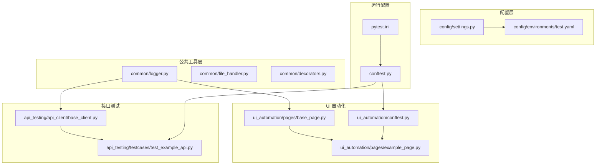
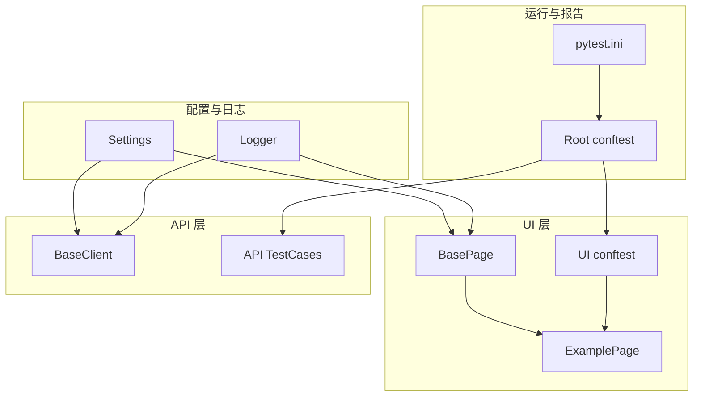
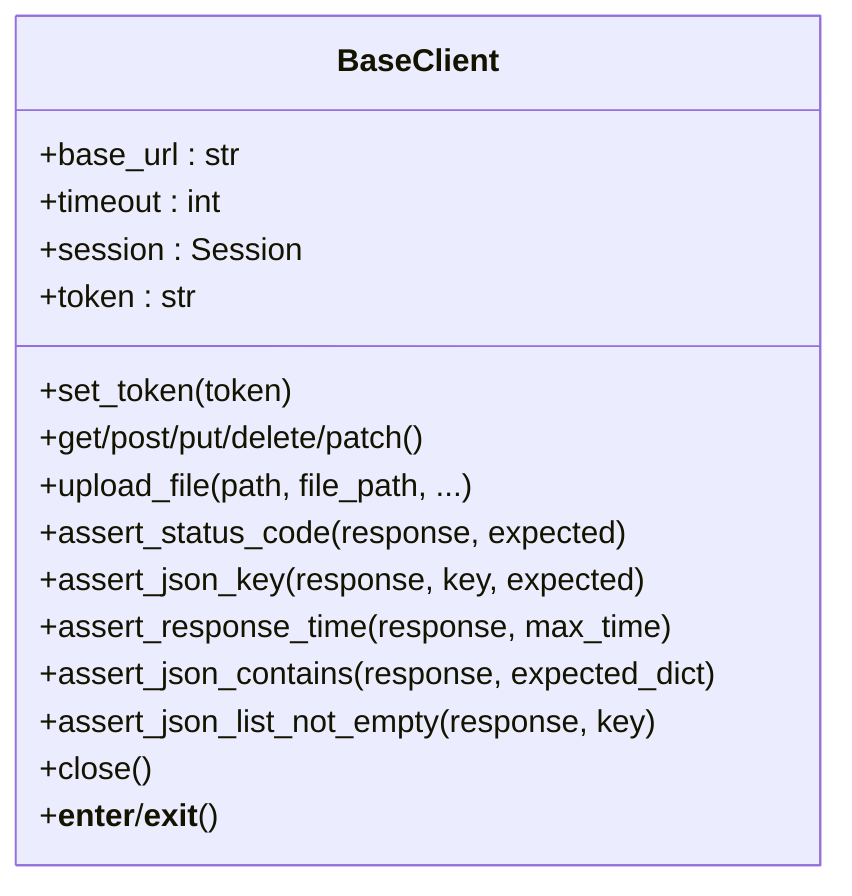
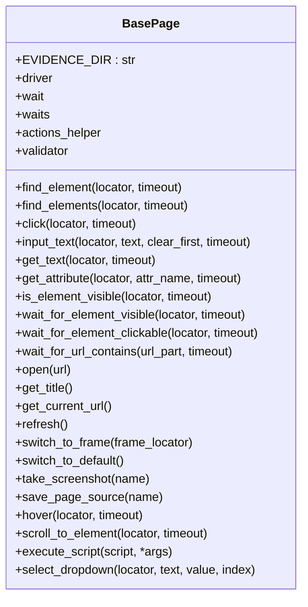
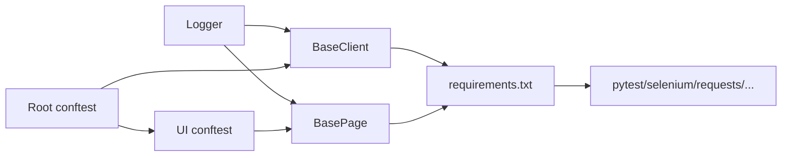

# 代码规范与最佳实践

<cite>
**本文引用的文件**
- [api_client/base_client.py](file://api_testing/api_client/base_client.py)
- [pages/base_page.py](file://ui_automation/pages/base_page.py)
- [common/logger.py](file://common/logger.py)
- [config/settings.py](file://config/settings.py)
- [conftest.py](file://conftest.py)
- [ui_automation/conftest.py](file://ui_automation/conftest.py)
- [ui_automation/pages/example_page.py](file://ui_automation/pages/example_page.py)
- [api_testing/testcases/test_example_api.py](file://api_testing/testcases/test_example_api.py)
- [ui_automation/testcases/test_example.py](file://ui_automation/testcases/test_example.py)
- [requirements.txt](file://requirements.txt)
- [config/environments/test.yaml](file://config/environments/test.yaml)
- [pytest.ini](file://pytest.ini)
- [common/file_handler.py](file://common/file_handler.py)
- [common/decorators.py](file://common/decorators.py)
</cite>

## 目录
1. [引言](#引言)
2. [项目结构](#项目结构)
3. [核心组件](#核心组件)
4. [架构总览](#架构总览)
5. [详细组件分析](#详细组件分析)
6. [依赖分析](#依赖分析)
7. [性能考虑](#性能考虑)
8. [故障排查指南](#故障排查指南)
9. [结论](#结论)
10. [附录](#附录)

## 引言
本指南面向本项目的测试自动化代码，系统化制定Python代码风格、命名约定、注释标准与最佳实践；深入解析Page Object模式的实现规范、BasePage基类的使用准则与扩展方法；文档化日志记录规范、错误处理模式与异常管理策略；提供代码审查检查清单、性能优化建议与安全编码实践；并给出具体示例的正确与错误对比思路，涵盖可维护性设计原则、重构技巧与代码质量评估标准。

## 项目结构
项目采用模块化组织，围绕“配置-公共工具-各测试域”分层设计：
- config：环境配置与全局设置
- common：日志、文件处理、装饰器等通用能力
- ui_automation：Web UI 自动化（Page Object 模式）
- api_testing：接口测试（基于 requests）
- performance：性能测试脚本与报告
- testcase_generator：测试用例生成器
- pytest.ini：测试运行配置
- conftest.py：pytest 全局 fixture 与钩子

图表来源
- [config/settings.py:1-104](file://config/settings.py#L1-L104)
- [config/environments/test.yaml:1-31](file://config/environments/test.yaml#L1-L31)
- [common/logger.py:1-77](file://common/logger.py#L1-L77)
- [common/file_handler.py:1-217](file://common/file_handler.py#L1-L217)
- [common/decorators.py:1-124](file://common/decorators.py#L1-L124)
- [ui_automation/pages/base_page.py:1-515](file://ui_automation/pages/base_page.py#L1-L515)
- [ui_automation/pages/example_page.py:1-171](file://ui_automation/pages/example_page.py#L1-L171)
- [ui_automation/conftest.py:1-99](file://ui_automation/conftest.py#L1-L99)
- [api_testing/api_client/base_client.py:1-308](file://api_testing/api_client/base_client.py#L1-L308)
- [api_testing/testcases/test_example_api.py:1-167](file://api_testing/testcases/test_example_api.py#L1-L167)
- [conftest.py:1-148](file://conftest.py#L1-L148)
- [pytest.ini:1-12](file://pytest.ini#L1-L12)

章节来源
- [README.md:1-123](file://README.md#L1-L123)
- [pytest.ini:1-12](file://pytest.ini#L1-L12)

## 核心组件
- BaseClient（API 客户端基类）：封装HTTP请求、会话管理、Token认证、断言工具与日志记录，支持with上下文与文件上传。
- BasePage（Page Object 基类）：封装WebDriver常用操作、显式等待、元素交互、截图与证据保存、高级操作（悬停、滚动、JS执行、下拉选择）。
- Settings（配置管理）：按环境变量加载YAML配置，提供属性与get方法访问。
- Logger（日志）：统一控制台与文件输出，按天轮转，支持模块绑定。
- Decorators（装饰器）：重试、异常截图、执行时间记录、步骤日志、Allure步骤兼容。
- FileHandler（文件处理）：YAML与Excel读写、多文档读取、追加行等。

章节来源
- [api_client/base_client.py:18-308](file://api_testing/api_client/base_client.py#L18-L308)
- [pages/base_page.py:36-515](file://ui_automation/pages/base_page.py#L36-L515)
- [config/settings.py:13-104](file://config/settings.py#L13-L104)
- [common/logger.py:1-77](file://common/logger.py#L1-L77)
- [common/decorators.py:16-124](file://common/decorators.py#L16-L124)
- [common/file_handler.py:13-217](file://common/file_handler.py#L13-L217)

## 架构总览
整体采用“配置驱动 + 统一日志 + Page Object + API 客户端”的分层架构。UI与API测试共享配置与日志，各自通过基类抽象出稳定的能力边界，便于扩展与维护。

图表来源
- [config/settings.py:13-104](file://config/settings.py#L13-L104)
- [common/logger.py:1-77](file://common/logger.py#L1-L77)
- [ui_automation/pages/base_page.py:36-515](file://ui_automation/pages/base_page.py#L36-L515)
- [ui_automation/pages/example_page.py:22-171](file://ui_automation/pages/example_page.py#L22-L171)
- [ui_automation/conftest.py:23-99](file://ui_automation/conftest.py#L23-L99)
- [api_testing/api_client/base_client.py:18-308](file://api_testing/api_client/base_client.py#L18-L308)
- [api_testing/testcases/test_example_api.py:18-167](file://api_testing/testcases/test_example_api.py#L18-L167)
- [conftest.py:25-148](file://conftest.py#L25-L148)
- [pytest.ini:1-12](file://pytest.ini#L1-L12)

## 详细组件分析

### BaseClient（API 客户端基类）
- 设计要点
  - 会话管理：使用requests.Session，统一默认Headers与超时。
  - URL拼接：自动去除多余斜杠，支持完整URL透传。
  - 请求日志：记录方法、URL、参数、Headers与响应状态与耗时。
  - 异常处理：区分Timeout/ConnectionError/RequestException，记录耗时并重新抛出。
  - 断言工具：状态码、JSON键存在与值、响应时间、JSON子集包含、列表非空。
  - 文件上传：自动关闭文件句柄，支持自定义字段与额外表单数据。
  - 资源管理：支持with上下文与close手动释放。
- 使用建议
  - 通过配置中心注入base_url与timeout，避免硬编码。
  - 使用断言工具进行明确的契约校验，提升测试可读性。
  - 对外部可变参数（headers、json、files）进行最小必要覆盖。
- 错误与正确示例对比思路
  - 错误：直接构造URL、忽略超时、不校验响应体结构。
  - 正确：使用_build_url、设置timeout、断言状态码与关键字段。

图表来源
- [api_client/base_client.py:18-308](file://api_testing/api_client/base_client.py#L18-L308)

章节来源
- [api_client/base_client.py:18-308](file://api_testing/api_client/base_client.py#L18-L308)
- [config/settings.py:26-48](file://config/settings.py#L26-L48)
- [common/logger.py:40-56](file://common/logger.py#L40-L56)

### BasePage（Page Object 基类）
- 设计要点
  - 元素操作：find_element/find_elements、click、input_text、get_text、get_attribute、is_element_visible。
  - 等待操作：显式等待元素可见/可点击、URL包含判断。
  - 页面操作：open、get_title、get_current_url、refresh、iframe切换。
  - 截图与证据：自动保存截图与页面源码，统一证据目录。
  - 高级操作：hover、scroll_to_element、execute_script、select_dropdown。
  - 辅助集成：WaitHelpers/ActionHelpers/ValidationHelpers。
- 使用建议
  - 明确定位器常量，统一维护；尽量使用稳定的选择器。
  - 所有交互均应记录日志与截图，便于问题定位。
  - 链式调用返回self，提升可读性与可组合性。
- 错误与正确示例对比思路
  - 错误：直接调用driver.find_element不带等待、不截图、不记录日志。
  - 正确：使用基类提供的等待与断言方法，统一记录与截图。

图表来源
- [pages/base_page.py:36-515](file://ui_automation/pages/base_page.py#L36-L515)

章节来源
- [pages/base_page.py:36-515](file://ui_automation/pages/base_page.py#L36-L515)
- [common/logger.py:40-56](file://common/logger.py#L40-L56)

### Page Object 模式实现规范
- 页面对象职责
  - 仅封装页面元素与操作，不涉及断言细节；断言由测试用例负责。
  - 统一定位器管理，避免散落于测试用例。
  - 提供链式调用方法，增强可读性。
- 示例页面（Login）与最佳实践
  - Login页面继承BasePage，集中定义定位器常量与业务方法。
  - 打开页面、输入凭据、点击登录、获取提示信息等流程清晰。
- 重构建议
  - 将定位器抽取到独立文件，组件化Header/Navigation等共享部分。
  - 使用WaitHelpers/ActionHelpers/ValidationHelpers提升一致性。

章节来源
- [ui_automation/pages/example_page.py:22-171](file://ui_automation/pages/example_page.py#L22-L171)
- [pages/base_page.py:54-56](file://ui_automation/pages/base_page.py#L54-L56)

### 日志记录规范
- 统一日志配置
  - 控制台：INFO及以上级别，彩色输出。
  - 文件：DEBUG及以上级别，按天轮转，保留7天。
  - 模块绑定：通过bind(module=...)标识来源模块。
- 使用建议
  - 关键路径（请求/响应、元素操作、页面导航）必须记录info/debug。
  - 异常与失败场景记录error/warning，并附带上下文信息。
  - 截图与证据保存路径需确保目录存在，失败时记录错误日志。

章节来源
- [common/logger.py:1-77](file://common/logger.py#L1-L77)
- [api_client/base_client.py:60-90](file://api_testing/api_client/base_client.py#L60-L90)
- [pages/base_page.py:74-84](file://ui_automation/pages/base_page.py#L74-L84)

### 错误处理与异常管理
- API 客户端
  - 明确捕获Timeout/ConnectionError/RequestException，记录耗时与URL，保持异常传播。
  - 文件上传finally确保文件句柄关闭。
- UI 页面
  - 元素查找/点击/输入等操作异常时统一截图与日志记录，便于定位。
  - 等待超时记录详细定位器与当前URL。
- 装饰器
  - retry：指数退避重试，记录每次失败与剩余次数。
  - screenshot_on_error：异常时自动截图，增强可诊断性。
  - log_execution_time：记录执行耗时，便于性能分析。
  - log_step/allure_step：统一测试步骤标注，兼容无Allure环境。

章节来源
- [api_client/base_client.py:122-134](file://api_testing/api_client/base_client.py#L122-L134)
- [api_client/base_client.py:223-227](file://api_testing/api_client/base_client.py#L223-L227)
- [pages/base_page.py:118-132](file://ui_automation/pages/base_page.py#L118-L132)
- [common/decorators.py:16-124](file://common/decorators.py#L16-L124)

### 测试用例与断言示例
- API 测试
  - 使用BaseClient进行GET/POST/PUT/DELETE/PATCH请求，结合断言工具进行状态码、JSON键、响应时间与列表非空校验。
  - Token认证通过set_token注入，自定义Headers可覆盖默认值。
- UI 测试
  - 使用driver fixture与Page Object模式，打开页面、输入凭据、断言URL跳转与提示信息。
  - 测试数据从YAML加载，便于维护与扩展。

章节来源
- [api_testing/testcases/test_example_api.py:18-167](file://api_testing/testcases/test_example_api.py#L18-L167)
- [ui_automation/testcases/test_example.py:31-161](file://ui_automation/testcases/test_example.py#L31-L161)

## 依赖分析
- 外部依赖
  - pytest、pytest-html、pytest-xdist：测试框架与报告。
  - selenium：UI 自动化。
  - requests：接口测试。
  - PyYAML、openpyxl：数据处理。
  - loguru：日志。
  - allure-pytest：可选报告附件。
- 内部依赖
  - BaseClient依赖配置与日志。
  - BasePage依赖日志与辅助helpers。
  - conftest统一管理浏览器初始化、失败截图与marker注册。

图表来源
- [requirements.txt:1-21](file://requirements.txt#L1-L21)
- [api_client/base_client.py:5-15](file://api_testing/api_client/base_client.py#L5-L15)
- [pages/base_page.py:23-33](file://ui_automation/pages/base_page.py#L23-L33)
- [conftest.py:25-148](file://conftest.py#L25-L148)
- [ui_automation/conftest.py:23-99](file://ui_automation/conftest.py#L23-L99)

章节来源
- [requirements.txt:1-21](file://requirements.txt#L1-L21)
- [conftest.py:25-148](file://conftest.py#L25-L148)
- [ui_automation/conftest.py:23-99](file://ui_automation/conftest.py#L23-L99)

## 性能考虑
- 请求性能
  - 合理设置timeout，避免长时间阻塞；对长耗时接口使用断言响应时间。
  - 使用Session复用连接，减少握手开销。
- UI 自动化
  - 显式等待替代固定sleep，缩短等待时间。
  - 适当headless运行，减少资源消耗；合理设置窗口大小。
- 日志与IO
  - 控制台INFO级别输出，文件DEBUG按需开启；避免在热路径频繁写入。
  - 截图与页面源码仅在失败时生成，降低IO压力。
- 装饰器辅助
  - 使用log_execution_time识别热点方法，结合retry减少偶发失败重试成本。

章节来源
- [api_client/base_client.py:28-30](file://api_testing/api_client/base_client.py#L28-L30)
- [api_client/base_client.py:122-134](file://api_testing/api_client/base_client.py#L122-L134)
- [pages/base_page.py:225-293](file://ui_automation/pages/base_page.py#L225-L293)
- [common/decorators.py:66-83](file://common/decorators.py#L66-L83)

## 故障排查指南
- 常见问题定位
  - API请求失败：查看日志中的URL、耗时与异常类型；确认超时与网络连通性。
  - UI元素找不到：检查定位器稳定性；查看失败截图与页面源码。
  - 浏览器问题：确认浏览器类型与版本、headless配置、隐式等待与页面加载超时。
- 自动化证据
  - 截图与页面源码保存路径：ui_automation/evidence/ 或 logs/。
  - Allure附件：在失败时自动附加PNG截图。
- 配置核对
  - 环境变量TEST_ENV与对应YAML配置文件是否存在。
  - base_url、browser配置项是否正确。

章节来源
- [conftest.py:84-125](file://conftest.py#L84-L125)
- [ui_automation/conftest.py:83-99](file://ui_automation/conftest.py#L83-L99)
- [config/environments/test.yaml:1-31](file://config/environments/test.yaml#L1-L31)

## 结论
本指南从风格、命名、注释、模式实现、日志与异常、性能与安全等方面给出了系统化的规范与最佳实践。遵循这些规范可显著提升代码可读性、可维护性与可测试性，降低回归风险并提高团队协作效率。

## 附录

### 代码风格与命名约定
- 文件与模块
  - 模块名小写，使用下划线分隔；测试模块以test_开头。
  - 类名采用PascalCase；常量全大写+下划线；私有成员以下划线前缀。
- 函数与方法
  - 函数名使用下划线分隔的小写形式；方法参数与局部变量同上。
  - 布尔返回值方法以is_/has_/can_等前缀命名。
- 常量与配置
  - 定位器常量使用UPPER_CASE；路径常量使用UPPER_CASE。
  - 配置项来自Settings，避免硬编码。
- 注释与文档
  - 类与方法提供简明docstring，说明用途、参数与异常。
  - 关键分支与复杂逻辑添加行内注释，解释动机与边界条件。

### Page Object 模式实现规范
- 继承与职责
  - 所有页面对象继承BasePage；仅封装页面元素与操作。
  - 断言由测试用例负责，避免在页面对象中混入业务断言。
- 定位器管理
  - 将定位器集中定义在类常量中，便于统一维护与替换。
  - 优先使用稳定选择器（ID/CSS），避免脆弱的XPath。
- 链式调用
  - 操作方法返回self，支持链式调用，提升可读性。
- 扩展方法
  - 通过集成WaitHelpers/ActionHelpers/ValidationHelpers，统一等待与断言策略。
  - 新增页面时，遵循现有命名与目录结构，保持一致性。

章节来源
- [pages/base_page.py:36-515](file://ui_automation/pages/base_page.py#L36-L515)
- [ui_automation/pages/example_page.py:22-171](file://ui_automation/pages/example_page.py#L22-L171)

### BaseClient 使用准则与扩展
- 基本使用
  - 通过构造函数注入base_url与token；默认从配置读取。
  - 使用get/post/put/delete/patch方法发送请求；断言工具进行契约校验。
- 超时与Headers
  - 通过kwargs覆盖默认timeout；自定义headers将与默认合并。
- 文件上传
  - 使用upload_file方法，自动处理multipart与文件句柄关闭。
- 上下文管理
  - 使用with语句或显式close释放Session资源。
- 扩展建议
  - 新增领域客户端时，复用BaseClient的请求日志与断言工具。
  - 对特定接口增加领域断言方法，保持断言语义清晰。

章节来源
- [api_client/base_client.py:18-308](file://api_testing/api_client/base_client.py#L18-L308)
- [config/settings.py:26-48](file://config/settings.py#L26-L48)

### 日志记录与错误处理最佳实践
- 日志
  - 关键路径记录info/debug；异常记录error/warning；失败截图与页面源码记录路径。
  - 使用模块绑定，便于过滤与溯源。
- 错误处理
  - API：区分超时/连接/请求异常，记录耗时与URL，保持异常传播。
  - UI：元素操作异常统一截图与日志；等待超时记录定位器与当前URL。
- 装饰器
  - retry：指数退避，记录剩余重试次数。
  - screenshot_on_error：异常时自动截图，增强可诊断性。
  - log_execution_time：记录执行耗时，便于性能分析。
  - log_step/allure_step：统一测试步骤标注。

章节来源
- [common/logger.py:1-77](file://common/logger.py#L1-L77)
- [api_client/base_client.py:122-134](file://api_testing/api_client/base_client.py#L122-L134)
- [pages/base_page.py:118-132](file://ui_automation/pages/base_page.py#L118-L132)
- [common/decorators.py:16-124](file://common/decorators.py#L16-L124)

### 代码审查检查清单
- 风格与命名
  - 是否符合文件/类/函数/常量命名约定？
  - docstring是否完整描述用途、参数与异常？
- 模式与结构
  - Page Object是否仅封装元素与操作？断言是否在测试用例中？
  - 定位器是否集中管理且稳定？
- 日志与异常
  - 关键路径是否记录日志？异常是否捕获并记录上下文？
  - 截图与证据是否在失败时生成？
- 性能与安全
  - 是否合理设置超时与重试？是否避免在热路径频繁IO？
  - 是否避免硬编码敏感信息？是否使用配置中心管理？

### 性能优化建议
- 请求层
  - 使用Session复用连接；合理设置timeout；对长耗时接口断言响应时间。
- UI 层
  - 显式等待替代固定sleep；headless运行；合理设置窗口大小。
- 日志与IO
  - 控制台INFO级别输出；文件DEBUG按需开启；失败时才生成截图与页面源码。

### 安全编码实践
- 配置与密钥
  - 使用配置中心读取敏感信息，避免硬编码；不同环境分离配置。
- 输入与输出
  - 对外部输入进行最小必要覆盖与校验；避免在日志中泄露敏感信息。
- 权限与隔离
  - 测试环境与生产环境严格隔离；UI测试清理cookies与缓存。

### 代码质量评估标准
- 可读性
  - 方法短小、职责单一；命名清晰；注释简洁明确。
- 可维护性
  - 定位器集中管理；断言与业务解耦；统一的日志与异常处理。
- 可测试性
  - 依赖注入与配置驱动；稳定的定位器；充分的失败证据。
- 可靠性
  - 明确的异常处理与重试策略；性能断言与资源释放。