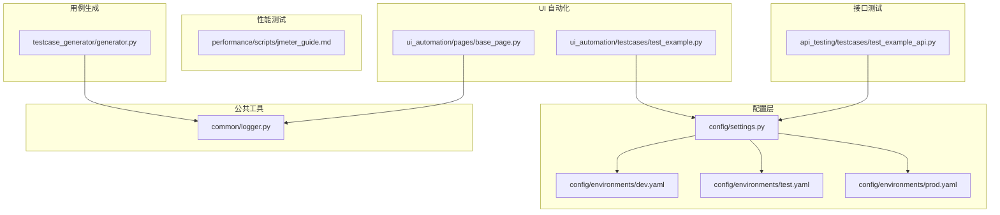
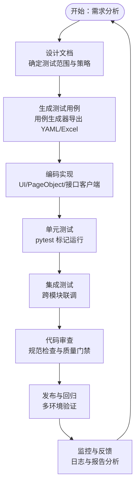
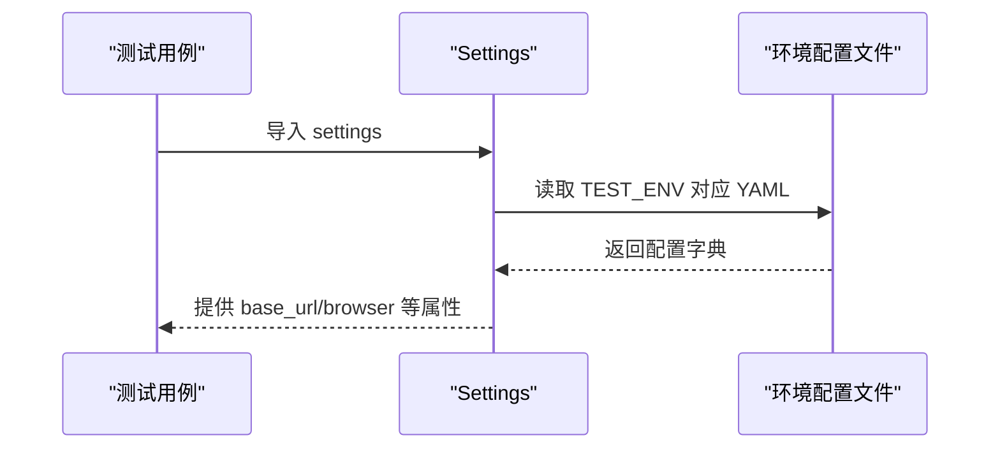
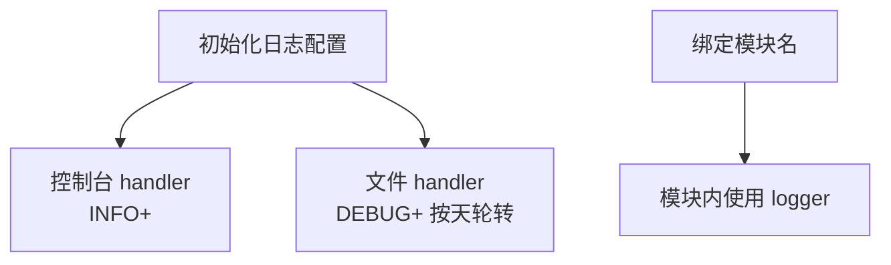
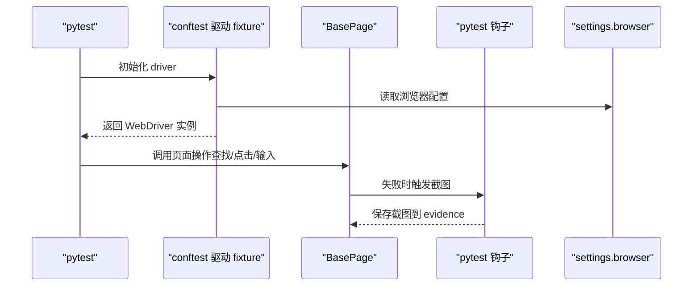
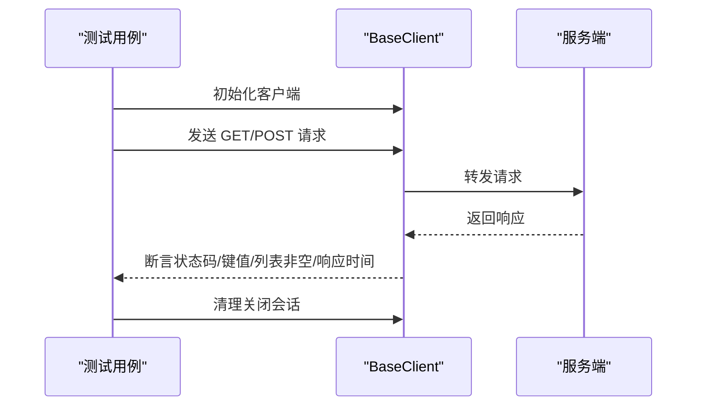
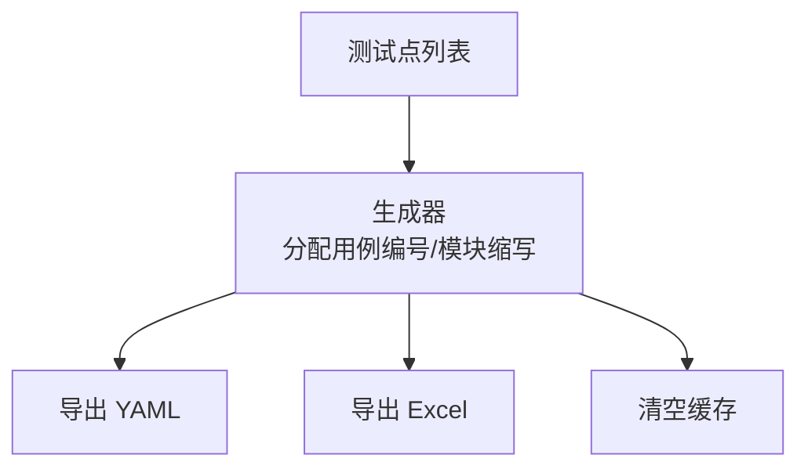
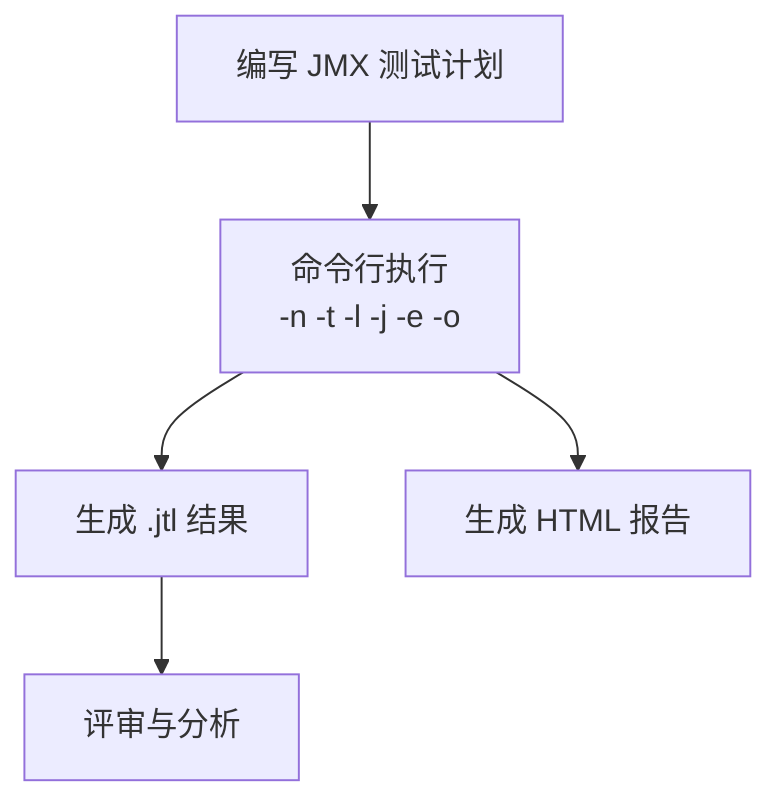

# 开发流程规范

<cite>
**本文引用的文件**
- [README.md](file://README.md)
- [docs/getting_started.md](file://docs/getting_started.md)
- [pytest.ini](file://pytest.ini)
- [conftest.py](file://conftest.py)
- [requirements.txt](file://requirements.txt)
- [config/settings.py](file://config/settings.py)
- [config/environments/dev.yaml](file://config/environments/dev.yaml)
- [config/environments/test.yaml](file://config/environments/test.yaml)
- [config/environments/prod.yaml](file://config/environments/prod.yaml)
- [common/logger.py](file://common/logger.py)
- [ui_automation/pages/base_page.py](file://ui_automation/pages/base_page.py)
- [ui_automation/testcases/test_example.py](file://ui_automation/testcases/test_example.py)
- [api_testing/testcases/test_example_api.py](file://api_testing/testcases/test_example_api.py)
- [testcase_generator/generator.py](file://testcase_generator/generator.py)
- [performance/scripts/jmeter_guide.md](file://performance/scripts/jmeter_guide.md)
</cite>

## 目录
1. [引言](#引言)
2. [项目结构](#项目结构)
3. [核心组件](#核心组件)
4. [架构总览](#架构总览)
5. [详细组件分析](#详细组件分析)
6. [依赖关系分析](#依赖关系分析)
7. [性能与并发](#性能与并发)
8. [故障排查指南](#故障排查指南)
9. [结论](#结论)
10. [附录](#附录)

## 引言
本规范旨在为本测试自动化工作区提供一套从需求分析到代码发布的完整开发流程指南，覆盖分支管理、提交规范、合并流程、配置管理、测试用例生成、日志记录标准、开发环境搭建、IDE 配置建议以及团队协作最佳实践，并给出常见开发场景的处理方法与问题解决流程。

## 项目结构
该工作区采用“按功能域划分”的模块化组织方式，主要模块包括：
- 配置管理：集中管理多环境配置与全局设置
- UI 自动化：基于 Page Object 模式的 Web 自动化测试
- 接口测试：基于 Requests 的接口测试
- 性能测试：JMeter 脚本与报告
- 测试用例生成器：从测试点生成结构化用例并导出
- 公共工具：日志、文件处理、报告工具
- 文档：快速上手与使用指南

图表来源
- [config/settings.py:1-104](file://config/settings.py#L1-L104)
- [config/environments/dev.yaml:1-31](file://config/environments/dev.yaml#L1-L31)
- [config/environments/test.yaml:1-31](file://config/environments/test.yaml#L1-L31)
- [config/environments/prod.yaml:1-31](file://config/environments/prod.yaml#L1-L31)
- [common/logger.py:1-77](file://common/logger.py#L1-L77)
- [ui_automation/pages/base_page.py:1-499](file://ui_automation/pages/base_page.py#L1-L499)
- [ui_automation/testcases/test_example.py:1-161](file://ui_automation/testcases/test_example.py#L1-L161)
- [api_testing/testcases/test_example_api.py:1-167](file://api_testing/testcases/test_example_api.py#L1-L167)
- [testcase_generator/generator.py:1-263](file://testcase_generator/generator.py#L1-L263)
- [performance/scripts/jmeter_guide.md:1-98](file://performance/scripts/jmeter_guide.md#L1-L98)

章节来源
- [README.md:7-43](file://README.md#L7-L43)
- [docs/getting_started.md:1-91](file://docs/getting_started.md#L1-L91)

## 核心组件
- 配置管理：通过 Settings 类按环境变量加载 YAML 配置，提供统一的 base_url、账号、数据库、API、浏览器等配置访问入口。
- 日志系统：基于 loguru 的统一日志配置，控制台 INFO+ 输出，文件 DEBUG+ 按天轮转并保留 7 天。
- UI 自动化：Page Object 基类封装常用元素操作、等待、截图与页面交互，统一证据收集。
- 接口测试：示例测试类展示请求构造、断言与清理流程。
- 测试用例生成器：从测试点批量生成结构化用例，支持导出 YAML 与 Excel。
- 性能测试：JMeter 指南提供脚本命名、执行与报告生成规范。

章节来源
- [config/settings.py:13-104](file://config/settings.py#L13-L104)
- [common/logger.py:14-77](file://common/logger.py#L14-L77)
- [ui_automation/pages/base_page.py:24-499](file://ui_automation/pages/base_page.py#L24-L499)
- [api_testing/testcases/test_example_api.py:18-167](file://api_testing/testcases/test_example_api.py#L18-L167)
- [testcase_generator/generator.py:17-263](file://testcase_generator/generator.py#L17-L263)
- [performance/scripts/jmeter_guide.md:1-98](file://performance/scripts/jmeter_guide.md#L1-L98)

## 架构总览
整体开发流程围绕“需求 → 设计 → 编码 → 测试 → 审查 → 发布”闭环展开，结合多环境配置与统一日志，确保可追溯性与一致性。

## 详细组件分析

### 配置管理流程
- 环境选择：通过环境变量 TEST_ENV 切换 dev/test/prod；未设置时默认 test。
- 配置加载：Settings 类按环境加载对应 YAML 文件，提供属性与 get 方法访问。
- 使用方式：各模块通过 config.settings 导入 settings，读取 base_url、browser、api 等配置。

图表来源
- [config/settings.py:26-48](file://config/settings.py#L26-L48)
- [config/environments/dev.yaml:1-31](file://config/environments/dev.yaml#L1-L31)
- [config/environments/test.yaml:1-31](file://config/environments/test.yaml#L1-L31)
- [config/environments/prod.yaml:1-31](file://config/environments/prod.yaml#L1-L31)

章节来源
- [config/settings.py:26-96](file://config/settings.py#L26-L96)
- [config/environments/dev.yaml:4-31](file://config/environments/dev.yaml#L4-L31)
- [config/environments/test.yaml:4-31](file://config/environments/test.yaml#L4-L31)
- [config/environments/prod.yaml:4-31](file://config/environments/prod.yaml#L4-L31)

### 日志记录标准
- 控制台输出：INFO 级别及以上，彩色输出，便于本地调试。
- 文件输出：DEBUG 级别及以上，按天轮转，保留 7 天，文件名包含日期。
- 模块绑定：get_logger(name) 绑定模块名，统一日志来源标识。
- 使用建议：在 UI Page Object、API 客户端、生成器等模块中统一通过 get_logger 获取实例。

图表来源
- [common/logger.py:40-77](file://common/logger.py#L40-L77)

章节来源
- [common/logger.py:14-77](file://common/logger.py#L14-L77)

### UI 自动化测试流程
- Page Object 基类：封装元素查找、等待、点击、输入、截图、页面交互等常用方法。
- 失败自动截图：pytest 钩子在测试失败时自动保存截图至 evidence 目录。
- 测试标记：pytest.ini 定义 ui/smoke/regression 标记，便于分层执行。
- 环境配置：通过 settings.browser 控制浏览器类型、headless、隐式等待等。

图表来源
- [conftest.py:25-70](file://conftest.py#L25-L70)
- [conftest.py:80-110](file://conftest.py#L80-L110)
- [ui_automation/pages/base_page.py:44-160](file://ui_automation/pages/base_page.py#L44-L160)
- [pytest.ini:7-12](file://pytest.ini#L7-L12)

章节来源
- [conftest.py:25-122](file://conftest.py#L25-L122)
- [ui_automation/pages/base_page.py:24-499](file://ui_automation/pages/base_page.py#L24-L499)
- [pytest.ini:1-12](file://pytest.ini#L1-L12)

### 接口测试流程
- 客户端封装：示例测试类展示初始化、断言与清理流程。
- 标记运行：pytest.ini 定义 api 标记，便于单独运行接口测试。
- 最佳实践：在测试中使用断言方法校验状态码、JSON 结构、响应时间等。

图表来源
- [api_testing/testcases/test_example_api.py:21-32](file://api_testing/testcases/test_example_api.py#L21-L32)
- [pytest.ini:7-12](file://pytest.ini#L7-L12)

章节来源
- [api_testing/testcases/test_example_api.py:18-167](file://api_testing/testcases/test_example_api.py#L18-L167)
- [pytest.ini:7-12](file://pytest.ini#L7-L12)

### 测试用例生成规范
- 输入：测试点列表（名称、步骤、预期、前置条件、输入数据等）。
- 生成：自动生成用例编号、模块缩写、顺序编号。
- 导出：支持 YAML 与 Excel 两种格式，便于评审与执行。
- 清理：可清空已生成用例，重新生成。

图表来源
- [testcase_generator/generator.py:17-188](file://testcase_generator/generator.py#L17-L188)

章节来源
- [testcase_generator/generator.py:17-263](file://testcase_generator/generator.py#L17-L263)

### 性能测试流程（JMeter）
- 脚本命名：模块名_测试类型_test.jmx，便于识别与管理。
- 执行命令：非 GUI 模式运行，输出 .jtl 结果与 HTML 报告。
- 报告生成：支持从已有 .jtl 生成 HTML 报告。
- 输出规范：results.jtl、HTML 报告目录、JMeter 日志按日期命名，避免覆盖。

图表来源
- [performance/scripts/jmeter_guide.md:19-98](file://performance/scripts/jmeter_guide.md#L19-L98)

章节来源
- [performance/scripts/jmeter_guide.md:1-98](file://performance/scripts/jmeter_guide.md#L1-L98)

## 依赖关系分析
- 测试框架：pytest、pytest-html、pytest-xdist
- UI 自动化：selenium
- 接口测试：requests
- 数据处理：PyYAML、openpyxl
- 日志：loguru
- 报告：pytest-html、Allure（可选）

章节来源
- [requirements.txt:1-21](file://requirements.txt#L1-L21)

## 性能与并发
- 并行执行：pytest.ini 配置了并行插件，可在多核环境下提升执行效率。
- UI 自动化并发：建议按环境隔离浏览器实例，避免共享状态导致的不稳定。
- 性能测试：JMeter 非 GUI 模式运行，适合大规模并发场景。

章节来源
- [pytest.ini:1-12](file://pytest.ini#L1-L12)
- [requirements.txt:3-5](file://requirements.txt#L3-L5)

## 故障排查指南
- 浏览器驱动问题：确认浏览器类型与 headless 配置，必要时调整隐式等待与页面加载超时。
- 失败截图：pytest 钩子会在失败时自动截图，检查 evidence 目录中的截图与日志。
- 环境配置：确认 TEST_ENV 与对应 YAML 文件是否存在，避免配置缺失导致的异常。
- 日志定位：通过模块绑定的日志快速定位问题来源，关注 ERROR/WARNING 级别信息。
- 性能报告：检查 .jtl 文件与 HTML 报告目录是否生成，确认输出路径与权限。

章节来源
- [conftest.py:80-110](file://conftest.py#L80-L110)
- [common/logger.py:40-77](file://common/logger.py#L40-L77)
- [config/settings.py:42-48](file://config/settings.py#L42-L48)
- [performance/scripts/jmeter_guide.md:69-98](file://performance/scripts/jmeter_guide.md#L69-L98)

## 结论
本规范提供了从需求到发布的全流程指导，强调配置管理、测试用例生成、日志记录与团队协作的最佳实践。通过统一的配置、日志与测试框架，确保开发过程可追溯、可复现、可维护。

## 附录

### 分支管理策略
- 主分支：main 作为稳定发布分支，合并前需通过代码审查与测试。
- 功能分支：按功能或模块创建分支，完成后通过 Pull Request 合并。
- 同步工作流：多地协同建议每次开始工作前先拉取最新代码，结束后及时提交与推送。

章节来源
- [README.md:95-114](file://README.md#L95-L114)
- [docs/getting_started.md:68-90](file://docs/getting_started.md#L68-L90)

### 代码提交规范
- 提交信息：使用清晰语义的描述，例如 feat/fix/docs/chore 等类型前缀，便于检索与版本生成。
- 冲突处理：遇到冲突优先保留最新改动，确保合并后功能可用。

章节来源
- [README.md:109-114](file://README.md#L109-L114)

### 合并流程
- 代码审查：至少一名同事审查，重点关注配置变更、日志记录、异常处理与测试覆盖。
- 测试通过：确保 UI、接口与冒烟测试均通过，必要时补充用例。
- 合并策略：squash 或 rebase 保持提交历史整洁，避免无关提交污染主分支。

章节来源
- [pytest.ini:7-12](file://pytest.ini#L7-L12)
- [ui_automation/testcases/test_example.py:31-161](file://ui_automation/testcases/test_example.py#L31-L161)
- [api_testing/testcases/test_example_api.py:18-167](file://api_testing/testcases/test_example_api.py#L18-L167)

### 新功能开发标准步骤
- 需求评审：明确验收标准与风险点。
- 设计文档：输出测试策略、用例设计与环境配置要点。
- 编码实现：遵循 Page Object 与接口客户端封装规范。
- 单元测试：使用 pytest 标记运行，覆盖关键路径。
- 集成测试：跨模块联调，验证端到端流程。
- 代码审查：检查配置、日志、异常处理与可维护性。
- 发布与回归：在多环境验证，生成报告并归档证据。

章节来源
- [testcase_generator/generator.py:100-126](file://testcase_generator/generator.py#L100-L126)
- [pytest.ini:7-12](file://pytest.ini#L7-L12)
- [performance/scripts/jmeter_guide.md:19-98](file://performance/scripts/jmeter_guide.md#L19-L98)

### 测试用例生成规范
- 输入：测试点清单（名称、步骤、预期、前置条件、输入数据）。
- 输出：YAML 与 Excel 两份导出，便于评审与执行。
- 命名：模块缩写 + 顺序编号，确保唯一性与可读性。

章节来源
- [testcase_generator/generator.py:17-188](file://testcase_generator/generator.py#L17-L188)

### 日志记录标准
- 控制台：INFO 级别及以上，彩色输出。
- 文件：DEBUG 级别及以上，按天轮转，保留 7 天。
- 模块绑定：get_logger(name) 绑定模块名，统一来源标识。

章节来源
- [common/logger.py:14-77](file://common/logger.py#L14-L77)

### 开发环境搭建与 IDE 配置建议
- 环境：Python 虚拟环境 + requirements.txt 依赖。
- 运行：pytest 全量与分标记运行，生成 HTML 报告。
- IDE：建议启用 pytest 集成、语法高亮与断点调试；配置环境变量 TEST_ENV 与多环境 YAML。

章节来源
- [docs/getting_started.md:3-21](file://docs/getting_started.md#L3-L21)
- [pytest.ini:1-12](file://pytest.ini#L1-L12)

### 团队协作最佳实践
- 同步流程：每日同步、提交前检查冲突、使用有意义的提交信息。
- 配置管理：通过 YAML 与环境变量管理多环境，避免硬编码。
- 日志与证据：统一日志格式与证据目录，便于问题定位与复盘。

章节来源
- [README.md:95-114](file://README.md#L95-L114)
- [config/settings.py:34-48](file://config/settings.py#L34-L48)
- [common/logger.py:30-56](file://common/logger.py#L30-L56)