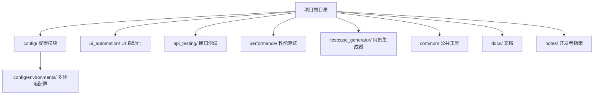
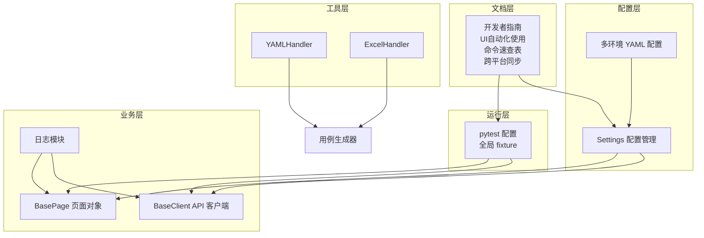
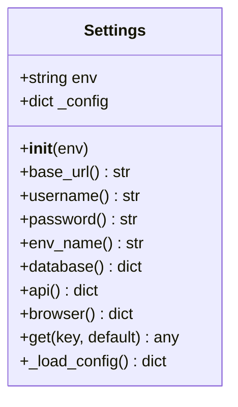
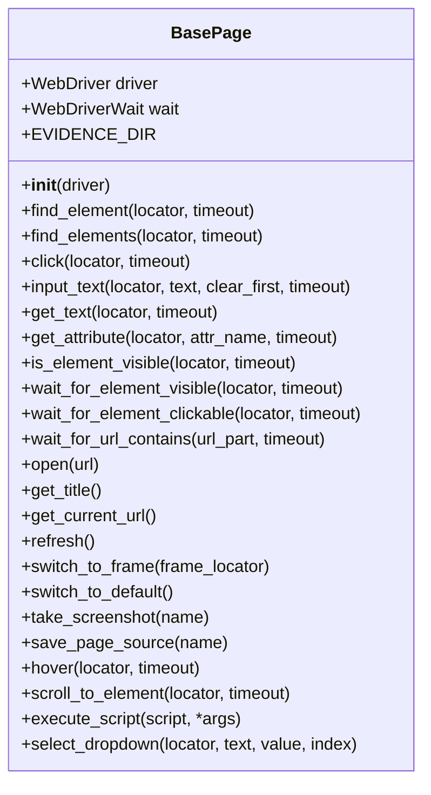
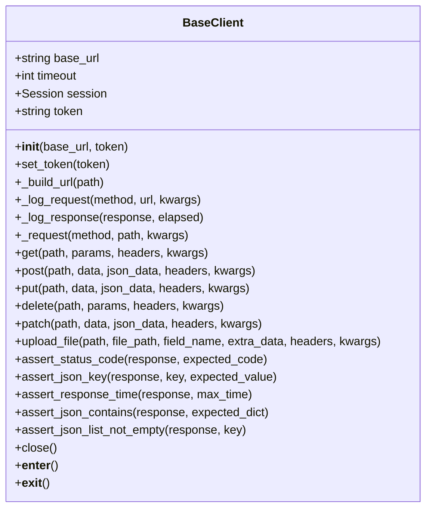
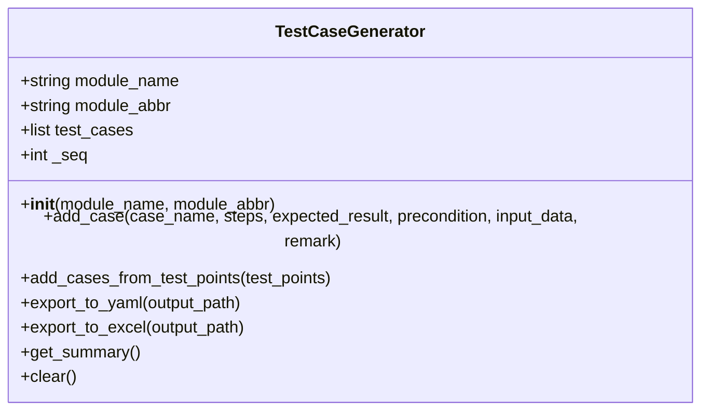
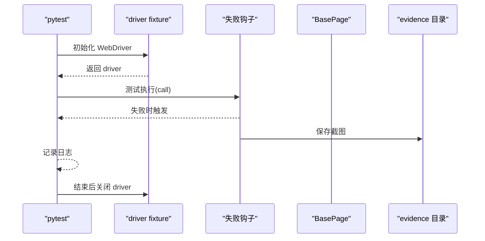
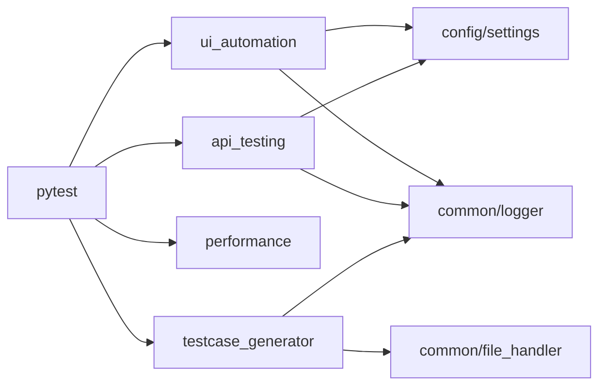

# 开发者指南

<cite>
**本文引用的文件**
- [README.md](file://README.md)
- [docs/getting_started.md](file://docs/getting_started.md)
- [requirements.txt](file://requirements.txt)
- [pytest.ini](file://pytest.ini)
- [conftest.py](file://conftest.py)
- [config/settings.py](file://config/settings.py)
- [config/constants.py](file://config/constants.py)
- [config/environments/dev.yaml](file://config/environments/dev.yaml)
- [config/environments/test.yaml](file://config/environments/test.yaml)
- [config/environments/prod.yaml](file://config/environments/prod.yaml)
- [common/logger.py](file://common/logger.py)
- [common/file_handler.py](file://common/file_handler.py)
- [ui_automation/pages/base_page.py](file://ui_automation/pages/base_page.py)
- [ui_automation/pages/example_page.py](file://ui_automation/pages/example_page.py)
- [ui_automation/testcases/conftest.py](file://ui_automation/testcases/conftest.py)
- [api_testing/api_client/base_client.py](file://api_testing/api_client/base_client.py)
- [testcase_generator/generator.py](file://testcase_generator/generator.py)
- [notes/01_项目目录说明.md](file://notes/01_项目目录说明.md)
- [notes/02_UI自动化使用指南.md](file://notes/02_UI自动化使用指南.md)
- [notes/03_常用命令速查表.md](file://notes/03_常用命令速查表.md)
- [notes/04_跨平台同步指南.md](file://notes/04_跨平台同步指南.md)
</cite>

## 更新摘要
**所做更改**
- 新增跨平台同步指南，支持 macOS 与 Windows 环境的无缝协作
- 新增 UI 自动化使用指南，提供完整的测试开发流程
- 新增常用命令速查表，涵盖环境管理、测试运行、报告查看等实用命令
- 新增项目目录说明，详细解析各模块结构与职责
- 更新团队协作与开发流程，提供完整的开发指南文档体系

## 目录
1. [简介](#简介)
2. [项目结构](#项目结构)
3. [核心组件](#核心组件)
4. [架构总览](#架构总览)
5. [详细组件分析](#详细组件分析)
6. [依赖分析](#依赖分析)
7. [性能考虑](#性能考虑)
8. [故障排查指南](#故障排查指南)
9. [团队协作与开发流程](#团队协作与开发流程)
10. [开发者指南文档体系](#开发者指南文档体系)
11. [结论](#结论)
12. [附录](#附录)

## 简介
本指南面向开发者，帮助快速理解项目结构、掌握新功能开发流程与代码规范，并深入分析核心组件的扩展方法、设计模式与最佳实践。文档还涵盖调试技巧、代码审查标准、版本管理流程、贡献指南、测试编写规范、文档维护要求、开发环境搭建、IDE 配置与团队协作建议，以及性能优化、安全与可维护性设计原则。

**新增** 本指南现已整合完整的开发者指南文档体系，包括跨平台同步指南、UI 自动化使用指南、常用命令速查表等，为团队协作提供全方位的技术文档支持。

## 项目结构
该项目是一个综合测试自动化工作区，包含 UI 自动化、接口测试、性能测试、测试用例生成、公共工具与文档等模块。整体采用"按功能域划分"的目录组织方式，便于多人协作与模块化扩展。

**图表来源**
- [README.md:7-43](file://README.md#L7-L43)
- [docs/getting_started.md:1-91](file://docs/getting_started.md#L1-L91)
- [notes/01_项目目录说明.md:5-27](file://notes/01_项目目录说明.md#L5-L27)

**章节来源**
- [README.md:7-43](file://README.md#L7-L43)
- [docs/getting_started.md:1-91](file://docs/getting_started.md#L1-L91)
- [notes/01_项目目录说明.md:1-130](file://notes/01_项目目录说明.md#L1-L130)

## 核心组件
- 配置管理：集中式环境配置，支持多环境切换与统一读取。
- UI 自动化：基于 Page Object 模式的页面对象层，封装常用交互与断言。
- 接口测试：基于 Requests 的客户端封装，提供会话管理、认证、日志与断言。
- 公共工具：日志、文件处理（YAML/Excel）、报告工具等。
- 用例生成器：从测试点批量生成结构化测试用例，支持导出 YAML/Excel。
- 测试运行：pytest 配置与全局 fixture，支持标记化运行与失败截图。
- **新增** 开发者指南：完整的文档体系，涵盖环境准备、命令速查、跨平台同步等。

**章节来源**
- [config/settings.py:13-104](file://config/settings.py#L13-L104)
- [ui_automation/pages/base_page.py:24-499](file://ui_automation/pages/base_page.py#L24-L499)
- [api_testing/api_client/base_client.py:18-308](file://api_testing/api_client/base_client.py#L18-L308)
- [common/logger.py:1-77](file://common/logger.py#L1-L77)
- [common/file_handler.py:13-217](file://common/file_handler.py#L13-L217)
- [testcase_generator/generator.py:17-263](file://testcase_generator/generator.py#L17-L263)
- [pytest.ini:1-12](file://pytest.ini#L1-L12)
- [conftest.py:1-122](file://conftest.py#L1-L122)
- [notes/02_UI自动化使用指南.md:1-271](file://notes/02_UI自动化使用指南.md#L1-L271)
- [notes/03_常用命令速查表.md:1-141](file://notes/03_常用命令速查表.md#L1-L141)
- [notes/04_跨平台同步指南.md:1-178](file://notes/04_跨平台同步指南.md#L1-L178)

## 架构总览
系统采用"分层+模块化"架构：
- 配置层：集中管理环境变量与配置文件，提供统一读取接口。
- 业务层：UI 页面对象与 API 客户端分别封装页面交互与 HTTP 请求。
- 工具层：日志、文件处理、报告工具等通用能力。
- 运行层：pytest 驱动，全局 fixture 管理浏览器生命周期与失败截图。
- **新增** 文档层：完整的开发者指南文档体系，支持团队协作与知识传承。

**图表来源**
- [conftest.py:25-70](file://conftest.py#L25-L70)
- [config/settings.py:26-48](file://config/settings.py#L26-L48)
- [ui_automation/pages/base_page.py:30-41](file://ui_automation/pages/base_page.py#L30-L41)
- [api_testing/api_client/base_client.py:21-44](file://api_testing/api_client/base_client.py#L21-L44)
- [common/logger.py:59-77](file://common/logger.py#L59-L77)
- [common/file_handler.py:13-217](file://common/file_handler.py#L13-L217)
- [testcase_generator/generator.py:127-174](file://testcase_generator/generator.py#L127-L174)
- [notes/02_UI自动化使用指南.md:1-271](file://notes/02_UI自动化使用指南.md#L1-L271)
- [notes/03_常用命令速查表.md:1-141](file://notes/03_常用命令速查表.md#L1-L141)
- [notes/04_跨平台同步指南.md:1-178](file://notes/04_跨平台同步指南.md#L1-L178)

## 详细组件分析

### 配置管理（Settings）
- 设计要点
  - 通过环境变量选择环境，读取对应 YAML 配置文件。
  - 提供属性与 get 方法统一访问配置项。
  - 支持 base_url、用户名密码、数据库、API、浏览器等配置。
- 扩展建议
  - 新增配置项时，在 YAML 中补充并在类中添加对应属性或使用 get。
  - 对敏感配置（如 token）建议通过环境变量注入并覆盖 YAML。
- 关键路径
  - [config/settings.py:26-96](file://config/settings.py#L26-L96)

**图表来源**
- [config/settings.py:13-104](file://config/settings.py#L13-L104)

**章节来源**
- [config/settings.py:13-104](file://config/settings.py#L13-L104)
- [config/environments/dev.yaml:1-31](file://config/environments/dev.yaml#L1-L31)
- [config/environments/test.yaml:1-31](file://config/environments/test.yaml#L1-L31)
- [config/environments/prod.yaml:1-31](file://config/environments/prod.yaml#L1-L31)

### UI 页面对象（BasePage）
- 设计要点
  - Page Object 模式：将页面元素与操作封装在类中，提升可维护性。
  - 统一封装元素查找、等待、交互、截图与页面操作。
  - 提供显式等待与异常处理，失败时自动截图并记录日志。
- 扩展建议
  - 新页面继承 BasePage，按需重写或新增方法。
  - 保持定位器集中管理，便于统一维护。
- 关键路径
  - [ui_automation/pages/base_page.py:44-161](file://ui_automation/pages/base_page.py#L44-L161)
  - [ui_automation/pages/base_page.py:209-277](file://ui_automation/pages/base_page.py#L209-L277)
  - [ui_automation/pages/base_page.py:354-404](file://ui_automation/pages/base_page.py#L354-L404)

**图表来源**
- [ui_automation/pages/base_page.py:24-499](file://ui_automation/pages/base_page.py#L24-L499)

**章节来源**
- [ui_automation/pages/base_page.py:24-499](file://ui_automation/pages/base_page.py#L24-L499)
- [ui_automation/pages/example_page.py:12-161](file://ui_automation/pages/example_page.py#L12-L161)

### API 客户端（BaseClient）
- 设计要点
  - 基于 Session 管理连接与认证头，支持 Bearer Token。
  - 统一封装 HTTP 方法与文件上传，内置请求/响应日志。
  - 提供断言辅助方法：状态码、JSON 键、响应时间、列表非空等。
- 扩展建议
  - 子类可按业务封装具体接口方法，复用断言与日志。
  - 对需要鉴权的接口，优先通过 set_token 或构造参数注入。
- 关键路径
  - [api_testing/api_client/base_client.py:18-187](file://api_testing/api_client/base_client.py#L18-L187)
  - [api_testing/api_client/base_client.py:233-295](file://api_testing/api_client/base_client.py#L233-L295)

**图表来源**
- [api_testing/api_client/base_client.py:18-308](file://api_testing/api_client/base_client.py#L18-L308)

**章节来源**
- [api_testing/api_client/base_client.py:18-308](file://api_testing/api_client/base_client.py#L18-L308)

### 测试用例生成器（TestCaseGenerator）
- 设计要点
  - 从测试点批量生成结构化用例，支持导出 YAML/Excel。
  - 自动生成用例编号，提供摘要与清理能力。
- 扩展建议
  - 可扩展更多导出格式或模板字段。
  - 与数据驱动结合，支持从 Excel/YAML 读取测试点。
- 关键路径
  - [testcase_generator/generator.py:17-188](file://testcase_generator/generator.py#L17-L188)
  - [testcase_generator/generator.py:127-174](file://testcase_generator/generator.py#L127-L174)

**图表来源**
- [testcase_generator/generator.py:17-263](file://testcase_generator/generator.py#L17-L263)

**章节来源**
- [testcase_generator/generator.py:17-263](file://testcase_generator/generator.py#L17-L263)
- [common/file_handler.py:13-217](file://common/file_handler.py#L13-L217)

### 公共工具（日志与文件处理）
- 日志（Loguru）
  - 控制台 INFO+ 输出，文件 DEBUG+ 按天轮转，保留 7 天。
  - 统一模块名绑定，便于问题定位。
- 文件处理（YAML/Excel）
  - 提供读写与追加能力，异常日志化。
- 关键路径
  - [common/logger.py:59-77](file://common/logger.py#L59-L77)
  - [common/file_handler.py:13-217](file://common/file_handler.py#L13-L217)

**章节来源**
- [common/logger.py:1-77](file://common/logger.py#L1-L77)
- [common/file_handler.py:13-217](file://common/file_handler.py#L13-L217)

### 测试运行与失败截图（pytest）
- 全局 fixture
  - 初始化浏览器（Chrome/Firefox），支持 headless、隐式等待、页面加载超时。
  - 提供 base_url fixture。
- 失败自动截图
  - 在 call 阶段失败时自动截图并保存至 evidence 目录。
- 关键路径
  - [conftest.py:25-70](file://conftest.py#L25-L70)
  - [conftest.py:80-110](file://conftest.py#L80-L110)
  - [pytest.ini:1-12](file://pytest.ini#L1-L12)

**图表来源**
- [conftest.py:25-70](file://conftest.py#L25-L70)
- [conftest.py:80-110](file://conftest.py#L80-L110)
- [ui_automation/pages/base_page.py:354-378](file://ui_automation/pages/base_page.py#L354-L378)

**章节来源**
- [conftest.py:1-122](file://conftest.py#L1-L122)
- [pytest.ini:1-12](file://pytest.ini#L1-L12)

## 依赖分析
- 外部依赖
  - 测试框架：pytest、pytest-html、pytest-xdist
  - UI 自动化：selenium
  - 接口测试：requests
  - 数据处理：PyYAML、openpyxl
  - 日志：loguru
  - 报告：allure-pytest（可选）
- 内部依赖
  - UI 与 API 模块均依赖配置与日志模块。
  - 用例生成器依赖文件处理模块与日志模块。

**图表来源**
- [requirements.txt:1-21](file://requirements.txt#L1-L21)
- [pytest.ini:1-12](file://pytest.ini#L1-L12)
- [common/file_handler.py:13-217](file://common/file_handler.py#L13-L217)
- [common/logger.py:1-77](file://common/logger.py#L1-77)

**章节来源**
- [requirements.txt:1-21](file://requirements.txt#L1-L21)
- [pytest.ini:1-12](file://pytest.ini#L1-L12)

## 性能考虑
- UI 自动化
  - 合理设置隐式等待与页面加载超时，避免过长等待影响吞吐。
  - 使用显式等待替代固定 sleep，提高稳定性与效率。
  - 无头模式可减少资源消耗，适合 CI 环境。
- 接口测试
  - 复用 Session，减少连接开销；必要时设置合理超时。
  - 大量请求场景下启用并发（pytest-xdist），注意服务端限流。
- 用例生成
  - 批量导出时避免一次性加载过多数据，分批处理。
- 日志
  - 控制台 INFO 级别输出，文件 DEBUG 级别按天轮转，避免磁盘占用过大。

## 故障排查指南
- 浏览器相关
  - 确认浏览器驱动版本与浏览器一致；无头模式下注意截图与页面差异。
  - 检查隐式等待与页面加载超时设置是否合理。
- 配置相关
  - 确认 TEST_ENV 环境变量与 YAML 文件名一致；检查 base_url 与鉴权配置。
- 失败截图
  - 失败时自动保存至 evidence 目录，结合日志定位问题。
- 日志定位
  - 使用模块绑定的日志，快速定位来源模块与问题环节。

**章节来源**
- [conftest.py:80-110](file://conftest.py#L80-L110)
- [common/logger.py:59-77](file://common/logger.py#L59-L77)

## 团队协作与开发流程

### 跨平台同步协作
**新增** 项目现已提供完整的跨平台同步指南，支持 macOS 与 Windows 环境的无缝协作。

- **同步原理**
  - 除了 `venv/` 虚拟环境以外，所有内容都同步
  - `venv/` 在每台机器上各自重建即可
  - 代码、配置、数据、报告、笔记均同步

- **Windows 首次设置**
  - 安装 Python 3.12+、Git、Chrome 浏览器
  - 克隆仓库并创建虚拟环境
  - 安装依赖并验证环境

- **日常协作流程**
  - macOS（家里）：git pull → 编写代码 → pytest → git push
  - Windows（公司）：git pull → 编写代码 → pytest → git push

- **命令对照**
  - 激活虚拟环境：`source venv/bin/activate` vs `.\venv\Scripts\activate`
  - 打开报告：`open reports/html/report.html` vs `start reports\html\report.html`
  - 设置环境变量：`TEST_ENV=dev pytest` vs `$env:TEST_ENV="dev"; pytest`

**章节来源**
- [notes/04_跨平台同步指南.md:1-178](file://notes/04_跨平台同步指南.md#L1-L178)

### UI 自动化开发流程
**新增** 提供完整的 UI 自动化测试开发指南，从环境准备到测试运行的全流程指导。

- **环境准备**
  - 首次使用：创建虚拟环境并安装依赖
  - 每次使用：激活虚拟环境即可
  - 注意事项：macOS 使用 `python3`，激活后可用 `python`

- **编写新测试流程**
  - 步骤 1：创建定位器（locators）
  - 步骤 2：创建页面对象（pages）
  - 步骤 3：创建测试用例（testcases）
  - 步骤 4：添加测试数据（可选）

- **测试运行与报告**
  - 基础命令：运行全部测试、按标签运行、指定文件运行
  - 环境控制：切换 dev/test/prod 环境
  - 报告生成：HTML 报告和 Allure 报告
  - 高级用法：并行执行、失败重跑、调试模式

**章节来源**
- [notes/02_UI自动化使用指南.md:1-271](file://notes/02_UI自动化使用指南.md#L1-L271)

### 常用命令速查表
**新增** 提供完整的命令速查表，涵盖环境管理、测试运行、报告查看、Git 操作等实用命令。

- **环境管理**
  - 激活虚拟环境：`source venv/bin/activate`
  - 安装依赖：`pip install -r requirements.txt`
  - 查看包版本：`pip show selenium pytest`

- **pytest 测试运行**
  - 按标签运行：`pytest -m smoke`、`pytest -m functional`
  - 按路径运行：`pytest ui_automation/testcases/smoke/`
  - 输出控制：`pytest -s`、`pytest -x`、`pytest --tb=short`
  - 高级功能：`pytest -n auto`、`pytest --reruns 2`、`pytest --pdb`

- **报告查看**
  - HTML 报告：`open reports/html/report.html`
  - Allure 报告：`pytest --alluredir=reports/allure` + `allure serve reports/allure`

- **Git 操作**
  - 拉取最新：`git pull origin main`
  - 提交推送：`git add .` → `git commit -m "..."` → `git push origin main`

**章节来源**
- [notes/03_常用命令速查表.md:1-141](file://notes/03_常用命令速查表.md#L1-L141)

## 开发者指南文档体系

### 文档分类与职责
**新增** 项目现已建立完整的开发者指南文档体系，分为多个层次支持不同场景的需求。

- **项目目录说明**
  - 整体结构：详细解析各模块目录组织
  - 配置中心：config/ 模块的职责与使用
  - 公共工具箱：common/ 模块的功能说明
  - UI 自动化模块：ui_automation/ 的完整结构
  - 输出目录：reports/、logs/、evidence/ 的用途

- **UI 自动化使用指南**
  - 环境准备：首次使用与每次使用流程
  - 编写流程：从定位器到测试用例的完整步骤
  - 测试运行：基础命令、环境控制、报告生成
  - 配置修改：被测网站地址、headless 模式、等待超时
  - AI 协作：与 AI 工具的协作方式
  - 日常工作流：家 ↔ 公司同步的具体操作

- **常用命令速查表**
  - 环境管理：虚拟环境、依赖安装、版本查看
  - pytest 测试运行：标签运行、路径运行、输出控制、高级功能
  - 报告查看：HTML 和 Allure 报告的使用
  - Git 操作：日常开发的 Git 命令
  - 性能测试：k6 负载测试的使用
  - 测试用例生成：用例生成器的使用方法

- **跨平台同步指南**
  - 同步原理：核心原则与同步范围
  - Windows 设置：首次配置的完整流程
  - 日常工作流：macOS 与 Windows 的操作对照
  - 命令对照：macOS 与 Windows 的命令对比
  - 注意事项：路径、ChromeDriver、换行符、编码等
  - 常见问题：Windows 环境的常见问题与解决方案

### 文档维护与更新
**新增** 建立文档与代码同步更新机制，确保文档的时效性和准确性。

- **同步原则**
  - 文档与代码同版本演进
  - 重要变更同步更新 README 与模块内注释
  - 示例与用法随模块更新而更新

- **更新流程**
  - 代码变更 → 更新相关文档
  - 新功能 → 添加使用指南
  - 配置变更 → 更新配置说明
  - 命令变更 → 更新命令速查表

- **文档质量保证**
  - 定期审查文档准确性
  - 确保命令示例可运行
  - 维护跨平台兼容性说明
  - 保持术语一致性

**章节来源**
- [notes/01_项目目录说明.md:1-130](file://notes/01_项目目录说明.md#L1-L130)
- [notes/02_UI自动化使用指南.md:1-271](file://notes/02_UI自动化使用指南.md#L1-L271)
- [notes/03_常用命令速查表.md:1-141](file://notes/03_常用命令速查表.md#L1-L141)
- [notes/04_跨平台同步指南.md:1-178](file://notes/04_跨平台同步指南.md#L1-L178)

## 结论
本指南提供了从项目结构到核心组件、从开发流程到最佳实践的完整参考。**新增的开发者指南文档体系**进一步完善了团队协作的技术支持，包括跨平台同步、UI 自动化使用、命令速查等功能，显著提升了开发效率、测试质量与系统可维护性。

遵循本文的规范与建议，可显著提升开发效率、测试质量与系统可维护性。建议在新功能开发中优先复用现有组件与模式，确保一致性与可扩展性。同时，充分利用新增的开发者指南文档，建立标准化的团队协作流程。

## 附录

### 开发环境搭建与 IDE 配置
- 环境准备
  - Python 虚拟环境、依赖安装、pytest 配置。
- IDE 建议
  - 启用 pytest 集成，便于直接运行与调试。
  - 配置日志输出窗口，关注 INFO+ 控制台与文件日志。
- 版本管理
  - 使用 Git 远程仓库，遵循"先拉取、后推送"的同步流程。

**章节来源**
- [README.md:45-123](file://README.md#L45-L123)
- [docs/getting_started.md:1-91](file://docs/getting_started.md#L1-L91)

### 新功能开发流程
- UI 自动化
  - 在 pages 下新增页面对象，继承 BasePage；在 testcases 下编写用例并打上 ui 标记。
- 接口测试
  - 在 api_client 下新增客户端类，继承 BaseClient；在 testcases 下编写用例并打上 api 标记。
- 用例生成
  - 使用 TestCaseGenerator 从测试点生成用例，导出为 YAML/Excel。
- 配置
  - 在 config/environments 下新增/修改 YAML，或通过环境变量覆盖。

**章节来源**
- [ui_automation/pages/base_page.py:24-499](file://ui_automation/pages/base_page.py#L24-L499)
- [api_testing/api_client/base_client.py:18-308](file://api_testing/api_client/base_client.py#L18-L308)
- [testcase_generator/generator.py:17-263](file://testcase_generator/generator.py#L17-L263)
- [pytest.ini:7-12](file://pytest.ini#L7-L12)

### 代码规范与审查标准
- 命名规范
  - 类名使用 PascalCase，方法与变量使用 snake_case；路径与文件名小写。
- 日志规范
  - 使用 get_logger("模块名")，记录关键步骤与异常信息。
- 断言与错误处理
  - 明确断言边界，失败时记录日志并截图；对外抛出清晰异常信息。
- 配置与安全
  - 敏感信息通过环境变量注入，避免硬编码；定期轮换 token。

**章节来源**
- [common/logger.py:59-77](file://common/logger.py#L59-L77)
- [config/settings.py:26-96](file://config/settings.py#L26-L96)

### 测试编写规范
- UI 测试
  - 使用 Page Object 封装页面交互；尽量使用显式等待；失败自动截图。
- 接口测试
  - 复用 BaseClient；对关键接口编写断言；记录请求/响应日志。
- 数据驱动
  - 使用 YAML/Excel 作为测试数据源，配合文件处理工具读取。
- 报告与并行
  - 使用 pytest-html 生成报告；在 CI 环境启用 pytest-xdist 并行执行。

**章节来源**
- [ui_automation/pages/base_page.py:209-277](file://ui_automation/pages/base_page.py#L209-L277)
- [api_testing/api_client/base_client.py:233-295](file://api_testing/api_client/base_client.py#L233-L295)
- [common/file_handler.py:84-174](file://common/file_handler.py#L84-L174)
- [pytest.ini:6](file://pytest.ini#L6)
- [requirements.txt:2-5](file://requirements.txt#L2-L5)

### 文档维护要求
- 文档与代码同版本演进，重要变更同步更新 README 与模块内注释。
- 示例与用法随模块更新而更新，确保可运行性。

**章节来源**
- [README.md:1-123](file://README.md#L1-L123)
- [docs/getting_started.md:1-91](file://docs/getting_started.md#L1-L91)

### 跨平台协作指南
**新增** 为支持分布式团队协作，提供完整的跨平台开发环境配置与同步方案。

- **环境兼容性**
  - Python 3.12+ 在两个平台均受支持
  - 路径自动适配（os.path.join 处理 / 和 \）
  - ChromeDriver 自动管理，无需手动安装
  - 编码统一使用 UTF-8，中文支持良好

- **同步策略**
  - 代码、配置、数据、报告、笔记全部同步
  - venv/ 虚拟环境不同步，各自重建
  - Git 自动处理换行符转换（LF vs CRLF）

- **常见问题解决**
  - Windows PowerShell 执行策略：Set-ExecutionPolicy
  - Python 命令识别：使用 py 命令替代 python
  - 虚拟环境激活：Scripts\activate vs bin\activate
  - 报告查看：start 命令 vs open 命令

**章节来源**
- [notes/04_跨平台同步指南.md:125-178](file://notes/04_跨平台同步指南.md#L125-L178)