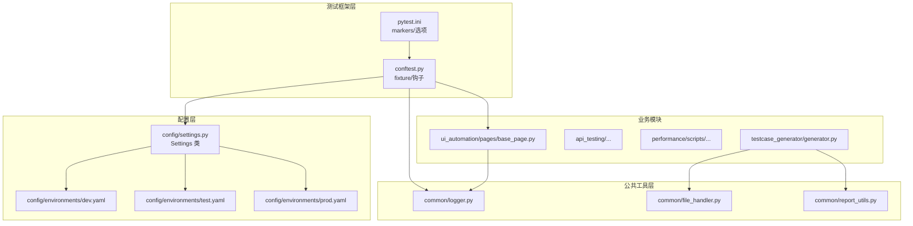
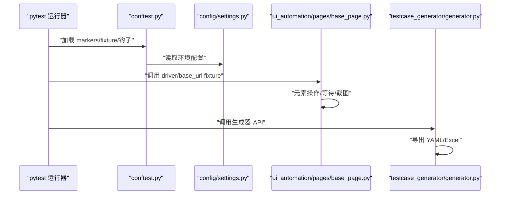
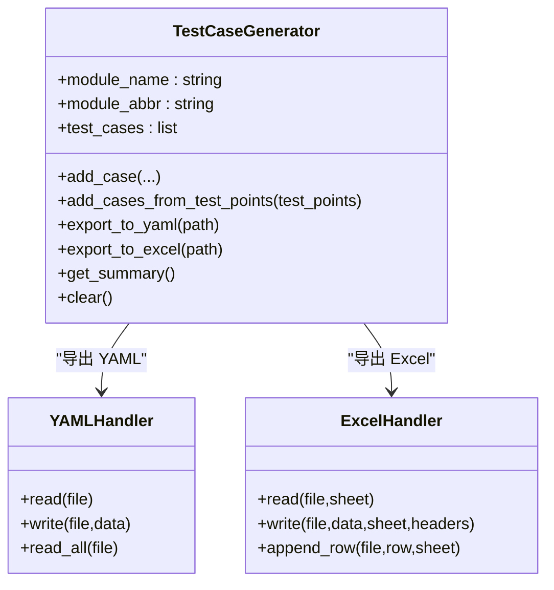
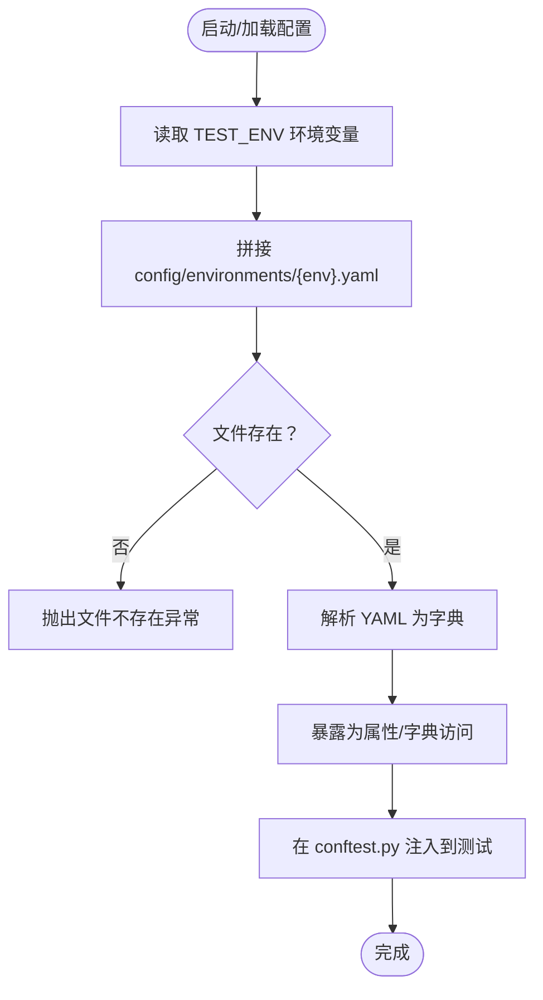
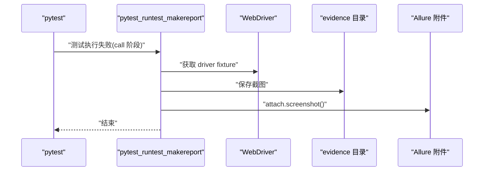
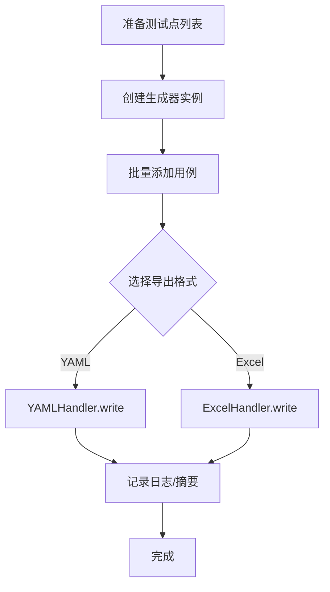
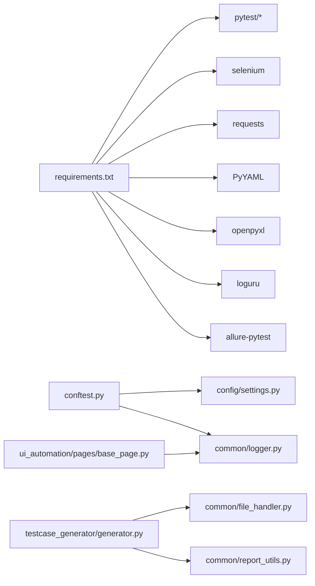

# 扩展开发指南

<cite>
**本文引用的文件**
- [README.md](file://README.md)
- [conftest.py](file://conftest.py)
- [pytest.ini](file://pytest.ini)
- [requirements.txt](file://requirements.txt)
- [config/settings.py](file://config/settings.py)
- [config/environments/dev.yaml](file://config/environments/dev.yaml)
- [config/environments/test.yaml](file://config/environments/test.yaml)
- [config/environments/prod.yaml](file://config/environments/prod.yaml)
- [testcase_generator/generator.py](file://testcase_generator/generator.py)
- [testcase_generator/example_usage.py](file://testcase_generator/example_usage.py)
- [common/logger.py](file://common/logger.py)
- [common/file_handler.py](file://common/file_handler.py)
- [common/report_utils.py](file://common/report_utils.py)
- [ui_automation/pages/base_page.py](file://ui_automation/pages/base_page.py)
- [ui_automation/testcases/test_example.py](file://ui_automation/testcases/test_example.py)
</cite>

## 目录
1. [简介](#简介)
2. [项目结构](#项目结构)
3. [核心组件](#核心组件)
4. [架构总览](#架构总览)
5. [详细组件分析](#详细组件分析)
6. [依赖关系分析](#依赖关系分析)
7. [性能考量](#性能考量)
8. [故障排查指南](#故障排查指南)
9. [结论](#结论)
10. [附录](#附录)

## 简介
本指南面向希望扩展测试自动化框架的开发者，系统讲解如何：
- 新增测试类型（如新增标记、测试分类与运行策略）
- 扩展配置管理（多环境、动态配置注入与环境切换）
- 集成第三方工具（日志、报告、截图、报告附件等）
- 扩展测试用例生成器（模板扩展、导出格式扩展、批量生成）
- 开发性能测试脚本（脚本规范、报告输出）
- 实现自定义报告生成器（HTML/附件/目录组织）
- 设计新模块（接口设计、向后兼容、插件化与钩子）
- 使用钩子函数与事件处理（pytest 钩子、失败截图、Allure 附件）

本指南结合现有代码结构，提供可落地的扩展示例与最佳实践。

## 项目结构
项目采用“按功能域划分”的模块化组织方式，核心模块包括：
- 配置管理：config/settings.py + 多环境 YAML
- UI 自动化：ui_automation/pages + fixtures + 测试用例
- 接口测试：api_testing（示例结构）
- 性能测试：performance/scripts + reports
- 测试用例生成器：testcase_generator/generator.py + templates
- 公共工具：common/logger.py + file_handler.py + report_utils.py
- 测试框架：pytest + conftest.py + pytest.ini

图表来源
- [pytest.ini:1-16](file://pytest.ini#L1-L16)
- [conftest.py:1-148](file://conftest.py#L1-L148)
- [config/settings.py:1-104](file://config/settings.py#L1-L104)
- [config/environments/dev.yaml:1-31](file://config/environments/dev.yaml#L1-L31)
- [config/environments/test.yaml:1-31](file://config/environments/test.yaml#L1-L31)
- [config/environments/prod.yaml:1-31](file://config/environments/prod.yaml#L1-L31)
- [common/logger.py:1-77](file://common/logger.py#L1-L77)
- [common/file_handler.py:1-217](file://common/file_handler.py#L1-L217)
- [common/report_utils.py:1-143](file://common/report_utils.py#L1-L143)
- [ui_automation/pages/base_page.py:1-515](file://ui_automation/pages/base_page.py#L1-L515)
- [testcase_generator/generator.py:1-263](file://testcase_generator/generator.py#L1-L263)

章节来源
- [README.md:1-123](file://README.md#L1-L123)
- [pytest.ini:1-16](file://pytest.ini#L1-L16)
- [conftest.py:1-148](file://conftest.py#L1-L148)
- [config/settings.py:1-104](file://config/settings.py#L1-L104)

## 核心组件
- 配置管理：Settings 类负责按环境变量加载 YAML，提供属性与 get 方法访问配置；多环境配置文件位于 config/environments。
- UI 页面对象：BasePage 封装常用元素操作、等待、截图、页面操作与断言辅助，集成日志与证据目录。
- 测试用例生成器：TestCaseGenerator 支持从测试点批量生成用例并导出为 YAML/Excel，提供便捷函数一键生成。
- 公共工具：logger 统一日志；file_handler 支持 YAML/Excel 读写；report_utils 提供时间戳、报告目录与 HTML 摘要生成。
- pytest 集成：conftest.py 提供 driver/base_url fixture、失败自动截图钩子、marker 注册与会话级 env_config。

章节来源
- [config/settings.py:13-104](file://config/settings.py#L13-L104)
- [ui_automation/pages/base_page.py:36-515](file://ui_automation/pages/base_page.py#L36-L515)
- [testcase_generator/generator.py:17-263](file://testcase_generator/generator.py#L17-L263)
- [common/logger.py:1-77](file://common/logger.py#L1-L77)
- [common/file_handler.py:13-217](file://common/file_handler.py#L13-L217)
- [common/report_utils.py:13-143](file://common/report_utils.py#L13-L143)
- [conftest.py:25-148](file://conftest.py#L25-L148)

## 架构总览
整体架构围绕 pytest 驱动，通过 Settings 与多环境配置实现跨环境一致性；UI 与接口模块共享公共工具与日志；测试用例生成器与报告工具解耦于业务模块，便于扩展。

图表来源
- [conftest.py:25-148](file://conftest.py#L25-L148)
- [config/settings.py:26-48](file://config/settings.py#L26-L48)
- [ui_automation/pages/base_page.py:42-515](file://ui_automation/pages/base_page.py#L42-L515)
- [testcase_generator/generator.py:225-263](file://testcase_generator/generator.py#L225-L263)

## 详细组件分析

### 测试用例生成器扩展机制
- 扩展点
  - 模板与字段：EXCEL_HEADERS 可增加/调整列；模块缩写生成规则可定制。
  - 导出格式：可新增 JSON/CSV 等格式，复用 YAMLHandler/ExcelHandler 的写入能力。
  - 批量生成：add_cases_from_test_points 支持从测试点列表批量生成。
  - 便捷函数：generate_testcases 可扩展为支持更多格式组合与输出目录策略。
- 最佳实践
  - 保持用例字段稳定，新增字段需提供默认值。
  - 导出前进行数据校验与清理，确保格式一致。
  - 生成摘要与日志，便于审计与问题定位。

图表来源
- [testcase_generator/generator.py:17-188](file://testcase_generator/generator.py#L17-L188)
- [common/file_handler.py:13-217](file://common/file_handler.py#L13-L217)

章节来源
- [testcase_generator/generator.py:17-263](file://testcase_generator/generator.py#L17-L263)
- [testcase_generator/example_usage.py:1-84](file://testcase_generator/example_usage.py#L1-L84)
- [common/file_handler.py:13-217](file://common/file_handler.py#L13-L217)

### 配置管理扩展（多环境与动态注入）
- 扩展点
  - 新增环境：在 config/environments 下新增 {env}.yaml，Settings 会自动加载。
  - 新增配置键：在 YAML 中添加键值，通过 settings.{key} 或 settings.get("key") 访问。
  - 动态注入：在 conftest.py 的 fixture 中读取 settings 并注入到测试上下文。
- 最佳实践
  - 保持键名语义清晰，避免嵌套过深。
  - 对敏感信息（账号、Token）使用环境变量或密钥管理。
  - 在 pytest.ini 中声明 marker，避免警告。

图表来源
- [config/settings.py:26-96](file://config/settings.py#L26-L96)
- [conftest.py:141-148](file://conftest.py#L141-L148)

章节来源
- [config/settings.py:13-104](file://config/settings.py#L13-L104)
- [config/environments/dev.yaml:1-31](file://config/environments/dev.yaml#L1-L31)
- [config/environments/test.yaml:1-31](file://config/environments/test.yaml#L1-L31)
- [config/environments/prod.yaml:1-31](file://config/environments/prod.yaml#L1-L31)
- [conftest.py:127-148](file://conftest.py#L127-L148)

### UI 页面对象与失败截图钩子
- 扩展点
  - 页面对象：在 BasePage 基类上扩展业务页面类，复用等待、断言与截图能力。
  - 失败截图：pytest_runtest_makereport 钩子在测试失败时自动截图并附加到 Allure 报告。
  - 证据目录：统一保存截图与页面源码，便于问题复现。
- 最佳实践
  - 在页面对象中封装稳定的定位器与业务动作，减少用例与实现耦合。
  - 截图命名包含测试名与时间戳，避免覆盖。
  - 未安装 Allure 时需容错处理。

图表来源
- [conftest.py:84-126](file://conftest.py#L84-L126)

章节来源
- [ui_automation/pages/base_page.py:36-515](file://ui_automation/pages/base_page.py#L36-L515)
- [conftest.py:84-126](file://conftest.py#L84-L126)

### 测试用例生成器的使用示例与批量导出
- 示例流程
  - 准备测试点列表，调用 TestCaseGenerator 或 generate_testcases。
  - 导出 YAML 与 Excel，打印摘要。
- 扩展建议
  - 支持从 Excel/数据库读取测试点，统一入口。
  - 增加模板引擎（如 Jinja2）以支持复杂用例渲染。

图表来源
- [testcase_generator/generator.py:100-174](file://testcase_generator/generator.py#L100-L174)
- [testcase_generator/example_usage.py:42-84](file://testcase_generator/example_usage.py#L42-L84)

章节来源
- [testcase_generator/generator.py:100-174](file://testcase_generator/generator.py#L100-L174)
- [testcase_generator/example_usage.py:1-84](file://testcase_generator/example_usage.py#L1-L84)

### 性能测试脚本开发方法
- 脚本规范
  - 脚本放置于 performance/scripts，命名清晰、职责单一。
  - 输出报告到 performance/reports，按时间戳建立子目录。
- 集成建议
  - 与 common/report_utils.py 结合，统一报告格式与目录结构。
  - 与 pytest 集成时，可使用 fixture 注入性能阈值与环境配置。

章节来源
- [README.md:31-34](file://README.md#L31-L34)
- [common/report_utils.py:42-66](file://common/report_utils.py#L42-L66)

### 自定义报告生成器实现
- 能力清单
  - 时间戳与目录创建：create_report_dir
  - HTML 摘要：generate_html_summary
  - 保存 HTML：save_html_report
- 扩展建议
  - 支持多种报告格式（JSON/XML/Allure XML）。
  - 增加覆盖率、性能指标汇总与趋势图链接。

章节来源
- [common/report_utils.py:13-143](file://common/report_utils.py#L13-L143)

### 新模块开发流程、接口设计与向后兼容
- 开发流程
  - 明确模块职责与边界，遵循“单一职责”。
  - 在 common 中沉淀通用能力（日志、文件、报告），业务模块只关注领域逻辑。
  - 通过 pytest.ini 声明 marker，conftest.py 注入 fixture，确保测试运行一致。
- 接口设计原则
  - 配置访问：Settings 提供统一入口，避免硬编码。
  - 日志：统一通过 get_logger 绑定模块名，便于追踪。
  - 文件读写：YAML/Excel Handler 提供一致的异常处理与日志记录。
- 向后兼容
  - 保持配置键名稳定，新增键提供默认值。
  - 旧接口可保留包装函数，逐步迁移。
  - 扩展导出格式时，保持默认行为不变。

章节来源
- [pytest.ini:7-16](file://pytest.ini#L7-L16)
- [conftest.py:127-148](file://conftest.py#L127-L148)
- [config/settings.py:85-96](file://config/settings.py#L85-L96)
- [common/logger.py:59-77](file://common/logger.py#L59-L77)
- [common/file_handler.py:16-55](file://common/file_handler.py#L16-L55)

### 插件开发模式、钩子函数与事件处理
- 插件化思路
  - 将可复用能力抽象为模块（如日志、文件、报告），在 conftest.py 中集中注册。
  - 通过 settings 注入环境配置，避免在业务模块中分散读取。
- 钩子函数
  - pytest_runtest_makereport：失败自动截图与 Allure 附件。
  - pytest_configure：注册 marker，避免警告。
  - 会话级 env_config：提供完整环境配置字典。
- 事件处理
  - 失败截图：统一保存到 ui_automation/evidence，便于问题复现。
  - 日志：INFO+ 控制台输出，DEBUG+ 文件输出，按天轮转。

章节来源
- [conftest.py:84-148](file://conftest.py#L84-L148)
- [common/logger.py:40-56](file://common/logger.py#L40-L56)

## 依赖关系分析
- 外部依赖
  - pytest、pytest-html、pytest-xdist、selenium、requests、PyYAML、openpyxl、loguru、allure-pytest、pytest-rerunfailures、python-dotenv。
- 内部依赖
  - conftest.py 依赖 config/settings.py 与 common/logger.py。
  - testcase_generator 依赖 common/file_handler.py 与 common/report_utils.py。
  - ui_automation/pages/base_page.py 依赖 common/logger.py 与 selenium。

图表来源
- [requirements.txt:1-25](file://requirements.txt#L1-L25)
- [conftest.py:19-22](file://conftest.py#L19-L22)
- [testcase_generator/generator.py:10-14](file://testcase_generator/generator.py#L10-L14)
- [ui_automation/pages/base_page.py:23-33](file://ui_automation/pages/base_page.py#L23-L33)

章节来源
- [requirements.txt:1-25](file://requirements.txt#L1-L25)
- [conftest.py:19-22](file://conftest.py#L19-L22)
- [testcase_generator/generator.py:10-14](file://testcase_generator/generator.py#L10-L14)
- [ui_automation/pages/base_page.py:23-33](file://ui_automation/pages/base_page.py#L23-L33)

## 性能考量
- 日志轮转：文件按天轮转并保留 7 天，避免日志过大影响磁盘。
- 截图与页面源码：失败时才截图，避免频繁 IO。
- 导出性能：Excel 写入使用 openpyxl，建议分批写入大批量数据。
- 并行运行：pytest-xdist 支持 -n auto 并行，注意资源竞争与共享状态。

## 故障排查指南
- 配置文件不存在
  - 现象：启动时报“配置文件不存在”。
  - 处理：确认 TEST_ENV 与 config/environments 下的文件名一致。
- 浏览器驱动问题
  - 现象：WebDriver 初始化失败。
  - 处理：检查浏览器类型与驱动版本，确保 chromedriver/geckodriver 可用。
- 失败截图未生成
  - 现象：测试失败但未生成截图。
  - 处理：确认 evidence 目录可写，driver fixture 正常注入。
- Allure 未安装
  - 现象：失败截图未附加到 Allure 报告。
  - 处理：requirements 中已包含 allure-pytest，若未安装需补充依赖。

章节来源
- [config/settings.py:42-48](file://config/settings.py#L42-L48)
- [conftest.py:44-73](file://conftest.py#L44-L73)
- [conftest.py:113-124](file://conftest.py#L113-L124)

## 结论
通过模块化设计与统一的配置、日志、文件与报告工具，本框架提供了良好的扩展基础。新增测试类型、扩展配置管理、集成第三方工具与开发性能/报告工具均可在现有结构上平滑演进。遵循本文的扩展点、最佳实践与注意事项，可显著提升可维护性与团队协作效率。

## 附录
- 快速开始命令参考
  - 运行全部测试：pytest
  - 运行冒烟测试：pytest -m smoke
  - 运行接口测试：pytest -m api
  - 运行 UI 自动化测试：pytest -m ui
  - 并行运行：pytest -n auto

章节来源
- [README.md:64-81](file://README.md#L64-L81)