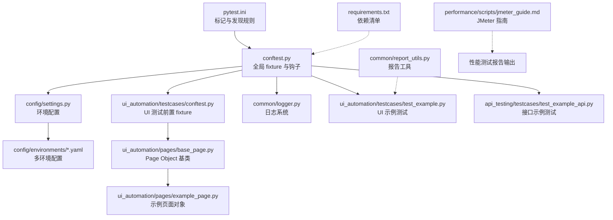
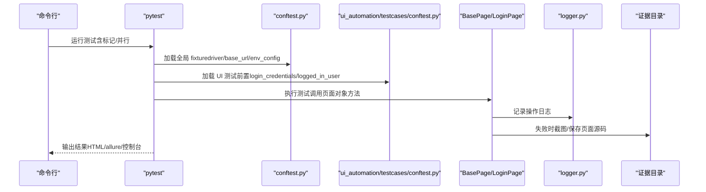
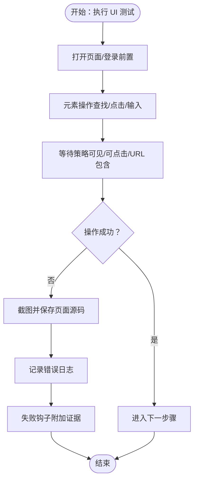
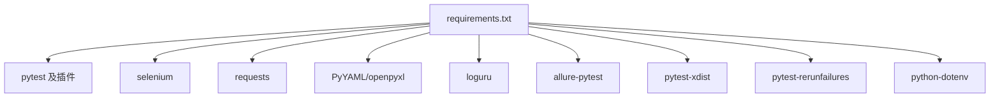

# 调试技巧与故障排除

<cite>
**本文引用的文件**
- [README.md](file://README.md)
- [pytest.ini](file://pytest.ini)
- [conftest.py](file://conftest.py)
- [common/logger.py](file://common/logger.py)
- [config/settings.py](file://config/settings.py)
- [config/environments/dev.yaml](file://config/environments/dev.yaml)
- [ui_automation/pages/base_page.py](file://ui_automation/pages/base_page.py)
- [ui_automation/testcases/conftest.py](file://ui_automation/testcases/conftest.py)
- [ui_automation/testcases/test_example.py](file://ui_automation/testcases/test_example.py)
- [ui_automation/pages/example_page.py](file://ui_automation/pages/example_page.py)
- [api_testing/testcases/test_example_api.py](file://api_testing/testcases/test_example_api.py)
- [common/report_utils.py](file://common/report_utils.py)
- [requirements.txt](file://requirements.txt)
- [performance/scripts/jmeter_guide.md](file://performance/scripts/jmeter_guide.md)
</cite>

## 目录
1. [引言](#引言)
2. [项目结构](#项目结构)
3. [核心组件](#核心组件)
4. [架构总览](#架构总览)
5. [详细组件分析](#详细组件分析)
6. [依赖分析](#依赖分析)
7. [性能考虑](#性能考虑)
8. [故障排除指南](#故障排除指南)
9. [结论](#结论)
10. [附录](#附录)

## 引言
本指南聚焦于该测试自动化工作区的调试技巧与故障排除方法，覆盖 pytest 调试、断点设置与变量检查、浏览器自动化测试调试策略、元素定位与页面加载异常排查、日志分析与错误信息解读、常见问题诊断与解决方案、性能与并发问题排查、以及测试环境与配置问题处理。文档基于仓库现有实现进行归纳总结，帮助不同技术背景的读者高效定位与解决问题。

## 项目结构
该项目采用模块化组织，包含 UI 自动化、接口测试、性能测试、配置与公共工具等模块。pytest 作为统一入口，结合全局与模块级 fixture、日志系统与证据收集机制，形成完整的测试执行与问题定位闭环。

图表来源
- [pytest.ini:1-16](file://pytest.ini#L1-L16)
- [conftest.py:1-148](file://conftest.py#L1-L148)
- [ui_automation/testcases/conftest.py:1-78](file://ui_automation/testcases/conftest.py#L1-L78)
- [config/settings.py:1-104](file://config/settings.py#L1-L104)
- [config/environments/dev.yaml:1-31](file://config/environments/dev.yaml#L1-L31)
- [common/logger.py:1-77](file://common/logger.py#L1-L77)
- [ui_automation/pages/base_page.py:1-515](file://ui_automation/pages/base_page.py#L1-L515)
- [ui_automation/pages/example_page.py:1-171](file://ui_automation/pages/example_page.py#L1-L171)
- [ui_automation/testcases/test_example.py:1-161](file://ui_automation/testcases/test_example.py#L1-L161)
- [api_testing/testcases/test_example_api.py:1-167](file://api_testing/testcases/test_example_api.py#L1-L167)
- [common/report_utils.py:1-143](file://common/report_utils.py#L1-L143)
- [requirements.txt:1-25](file://requirements.txt#L1-L25)
- [performance/scripts/jmeter_guide.md:1-98](file://performance/scripts/jmeter_guide.md#L1-L98)

章节来源
- [README.md:1-123](file://README.md#L1-L123)
- [pytest.ini:1-16](file://pytest.ini#L1-L16)

## 核心组件
- pytest 配置与标记：通过 pytest.ini 定义测试发现路径、命名规则与自定义标记，便于按模块与类型筛选执行。
- 全局与模块级 fixture：conftest.py 提供浏览器驱动、基础 URL、失败自动截图与环境配置；ui_automation/testcases/conftest.py 提供登录前置与干净页面等 UI 测试前置。
- 日志系统：common/logger.py 使用 loguru 统一输出到控制台与按天轮转的文件，支持模块级绑定，便于问题溯源。
- 配置管理：config/settings.py 读取多环境 YAML 配置，支持通过环境变量切换环境，提供统一的配置访问接口。
- Page Object 与证据收集：ui_automation/pages/base_page.py 封装元素操作与等待策略，并在关键失败点截图与保存页面源码，便于回溯。
- 报告工具：common/report_utils.py 提供时间戳与 HTML 报告摘要生成，辅助输出测试结果。

章节来源
- [pytest.ini:1-16](file://pytest.ini#L1-L16)
- [conftest.py:1-148](file://conftest.py#L1-L148)
- [ui_automation/testcases/conftest.py:1-78](file://ui_automation/testcases/conftest.py#L1-L78)
- [common/logger.py:1-77](file://common/logger.py#L1-L77)
- [config/settings.py:1-104](file://config/settings.py#L1-L104)
- [ui_automation/pages/base_page.py:1-515](file://ui_automation/pages/base_page.py#L1-L515)
- [common/report_utils.py:1-143](file://common/report_utils.py#L1-L143)

## 架构总览
下图展示了测试执行的关键流程：pytest 发现用例与标记，加载全局与模块级 fixture，执行测试并在失败时触发截图与日志记录，最终生成报告。

图表来源
- [conftest.py:1-148](file://conftest.py#L1-L148)
- [ui_automation/testcases/conftest.py:1-78](file://ui_automation/testcases/conftest.py#L1-L78)
- [ui_automation/pages/base_page.py:1-515](file://ui_automation/pages/base_page.py#L1-L515)
- [common/logger.py:1-77](file://common/logger.py#L1-L77)

## 详细组件分析

### pytest 调试与断点技巧
- 标记与筛选：通过 pytest.ini 中的 markers 与命令行标记（如 -m ui、-m api）快速定位目标用例，减少调试范围。
- 断点设置：在测试函数内部使用 IDE 断点或在代码中插入断点触发点（如在关键断言前），观察变量状态与调用栈。
- 变量检查：利用 IDE 的变量面板与监视表达式，检查 fixture 提供的对象（如 driver、base_url、settings）与页面对象状态。
- 失败重试与并行：配合 pytest-rerunfailures 与 xdist，可在不稳定环境中提高稳定性并加速调试迭代。

章节来源
- [pytest.ini:1-16](file://pytest.ini#L1-L16)
- [requirements.txt:1-25](file://requirements.txt#L1-L25)

### 浏览器自动化调试策略
- 驱动初始化：全局 driver fixture 根据配置文件选择浏览器类型、是否无头模式、隐式等待与页面加载超时，便于统一调试环境。
- 失败自动截图：pytest_runtest_makereport 钩子在测试失败时自动保存截图并附加到报告，失败证据集中于 ui_automation/evidence。
- 页面对象方法：BasePage 对元素查找、点击、输入、等待等操作均记录日志并在超时/异常时截图，便于定位问题节点。
- 预登录与干净页面：UI 测试前置 fixture 提供预登录与干净页面，减少重复步骤，提升调试效率。

图表来源
- [conftest.py:84-125](file://conftest.py#L84-L125)
- [ui_automation/pages/base_page.py:60-292](file://ui_automation/pages/base_page.py#L60-L292)

章节来源
- [conftest.py:25-74](file://conftest.py#L25-L74)
- [conftest.py:84-125](file://conftest.py#L84-L125)
- [ui_automation/testcases/conftest.py:20-78](file://ui_automation/testcases/conftest.py#L20-L78)
- [ui_automation/pages/base_page.py:1-515](file://ui_automation/pages/base_page.py#L1-L515)

### 元素定位问题排查
- 定位器有效性：优先使用稳定的选择器（如 ID、CSS），避免脆弱的文本/路径依赖；必要时结合等待策略与重试。
- 超时与异常：BasePage 在查找元素与等待时记录日志并截图，定位超时与异常发生点；检查证据目录中的截图与页面源码。
- 页面结构变化：当页面结构更新导致定位失败，优先核对定位器是否仍有效，必要时调整或引入更强的等待条件。

章节来源
- [ui_automation/pages/base_page.py:60-292](file://ui_automation/pages/base_page.py#L60-L292)

### 页面加载异常处理
- 页面加载超时：通过 driver.set_page_load_timeout 与等待策略（如 wait_for_url_contains）降低加载失败影响。
- URL 与标题校验：在关键步骤断言 URL 片段与标题，有助于识别导航异常。
- JavaScript 执行：执行脚本前后记录日志与截图，便于定位前端交互异常。

章节来源
- [conftest.py:61-65](file://conftest.py#L61-L65)
- [ui_automation/pages/base_page.py:271-332](file://ui_automation/pages/base_page.py#L271-L332)
- [ui_automation/pages/base_page.py:463-482](file://ui_automation/pages/base_page.py#L463-L482)

### 日志分析与错误信息解读
- 日志级别与输出：控制台输出 INFO 及以上，文件输出 DEBUG 及以上，按天轮转并保留 7 天，便于回溯。
- 模块绑定：通过 logger.bind(module=...) 将日志与模块关联，快速定位来源。
- 关键日志点：元素操作、等待、URL 变化、截图与页面源码保存等均有明确日志，结合失败截图可还原现场。

章节来源
- [common/logger.py:1-77](file://common/logger.py#L1-L77)
- [ui_automation/pages/base_page.py:74-84](file://ui_automation/pages/base_page.py#L74-L84)
- [ui_automation/pages/base_page.py:282-292](file://ui_automation/pages/base_page.py#L282-L292)

### 接口测试调试要点
- 客户端生命周期：示例测试展示在 setup 中初始化 BaseClient，在 autouse fixture 中关闭 session，避免连接泄漏。
- 断言与响应：示例中提供了多种断言方法（状态码、JSON 键、列表非空、响应时间），可按需启用并结合日志定位问题。
- 认证与自定义头：示例演示了 token 设置与自定义 headers 的使用方式，便于调试鉴权与特殊接口。

章节来源
- [api_testing/testcases/test_example_api.py:18-167](file://api_testing/testcases/test_example_api.py#L18-L167)

### 报告与证据管理
- 截图与页面源码：BasePage 在关键失败点自动截图与保存页面源码，证据目录集中于 ui_automation/evidence。
- 失败钩子：pytest_runtest_makereport 在失败时保存截图并尝试附加到报告（如 allure）。
- HTML 报告：report_utils 提供时间戳与 HTML 摘要生成，便于输出测试结果。

章节来源
- [ui_automation/pages/base_page.py:370-421](file://ui_automation/pages/base_page.py#L370-L421)
- [conftest.py:96-125](file://conftest.py#L96-L125)
- [common/report_utils.py:68-143](file://common/report_utils.py#L68-L143)

## 依赖分析
- 测试框架与插件：pytest、pytest-html、pytest-xdist、pytest-rerunfailures、allure-pytest。
- UI 自动化：selenium。
- 接口测试：requests。
- 数据处理：PyYAML、openpyxl。
- 日志：loguru。
- 工具：python-dotenv。

图表来源
- [requirements.txt:1-25](file://requirements.txt#L1-L25)

章节来源
- [requirements.txt:1-25](file://requirements.txt#L1-L25)

## 性能考虑
- 并发与重试：使用 pytest-xdist 进行并行执行，结合 pytest-rerunfailures 提升不稳定用例的通过率。
- 性能测试：JMeter 脚本与报告输出遵循统一规范，建议在 CI 中定期执行冒烟与负载测试，关注响应时间与错误率趋势。
- 资源释放：接口测试中确保 session 正确关闭，UI 测试中确保浏览器实例在 fixture teardown 阶段释放。

章节来源
- [requirements.txt:1-25](file://requirements.txt#L1-L25)
- [api_testing/testcases/test_example_api.py:21-32](file://api_testing/testcases/test_example_api.py#L21-L32)
- [performance/scripts/jmeter_guide.md:1-98](file://performance/scripts/jmeter_guide.md#L1-L98)

## 故障排除指南

### pytest 调试与断点设置
- 使用 -v 与 -k/-m 精准定位用例，减少执行时间。
- 在测试函数内设置断点，检查 driver、base_url、settings 等 fixture 的状态。
- 结合 pytest-html 或 allure 报告查看失败用例的附加证据。

章节来源
- [pytest.ini:1-16](file://pytest.ini#L1-L16)
- [conftest.py:127-139](file://conftest.py#L127-L139)

### 浏览器自动化问题
- 元素定位失败：检查定位器是否稳定，结合等待策略与截图定位超时点。
- 页面加载异常：调整页面加载超时与 URL 等待策略，核对网络与前端交互。
- 无头模式差异：在 dev.yaml 中开启 headless=false 进行本地调试，确认 UI 行为一致性。

章节来源
- [config/environments/dev.yaml:25-31](file://config/environments/dev.yaml#L25-L31)
- [ui_automation/pages/base_page.py:60-292](file://ui_automation/pages/base_page.py#L60-L292)

### 日志与证据
- 查看 logs/ 目录下按天轮转的日志文件，结合模块名定位来源。
- 失败用例会在 ui_automation/evidence 生成截图与页面源码，优先检查最近一次失败证据。

章节来源
- [common/logger.py:30-56](file://common/logger.py#L30-L56)
- [conftest.py:96-125](file://conftest.py#L96-L125)
- [ui_automation/pages/base_page.py:370-421](file://ui_automation/pages/base_page.py#L370-L421)

### 接口测试问题
- 状态码与响应结构：使用断言方法验证关键字段与列表非空，逐步缩小问题范围。
- 认证与 headers：核对 token 设置与自定义 headers，确保与后端要求一致。

章节来源
- [api_testing/testcases/test_example_api.py:34-167](file://api_testing/testcases/test_example_api.py#L34-L167)

### 性能与并发问题
- 并发执行：使用 -n auto 或指定进程数，观察是否存在竞态与资源争用。
- 重试策略：对不稳定用例启用 rerunfailures，统计失败趋势并优化。

章节来源
- [requirements.txt:1-25](file://requirements.txt#L1-L25)

### 测试环境与配置
- 环境切换：通过 TEST_ENV 指定环境，核对 config/environments/*.yaml 中的配置项。
- 配置缺失：若配置文件不存在或键缺失，settings 将抛出异常，需检查文件路径与键名。

章节来源
- [config/settings.py:26-48](file://config/settings.py#L26-L48)

## 结论
本指南基于仓库现有实现，总结了 pytest 调试、浏览器自动化调试、日志与证据管理、接口测试断言、性能与并发处理以及环境配置等关键调试与排障方法。建议在日常工作中结合标记筛选、失败自动截图与日志分析，形成标准化的问题定位流程，持续优化测试稳定性与可维护性。

## 附录
- 快速开始与运行命令参考：README.md 中提供了克隆、安装与运行示例，便于快速搭建调试环境。
- JMeter 性能测试：遵循 jmeter_guide.md 的脚本命名与执行规范，统一输出到 performance/reports 目录。

章节来源
- [README.md:45-82](file://README.md#L45-L82)
- [performance/scripts/jmeter_guide.md:1-98](file://performance/scripts/jmeter_guide.md#L1-L98)