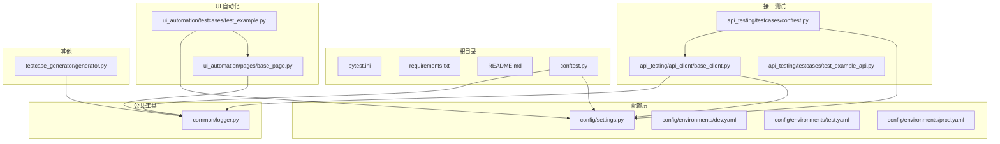
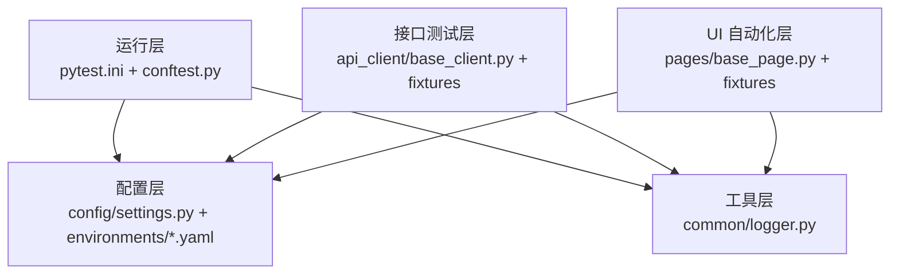
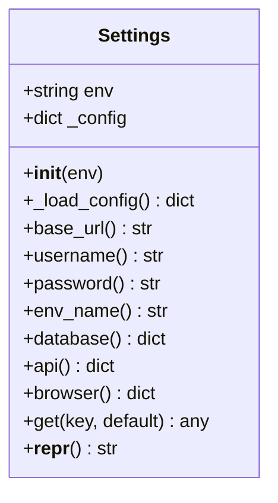
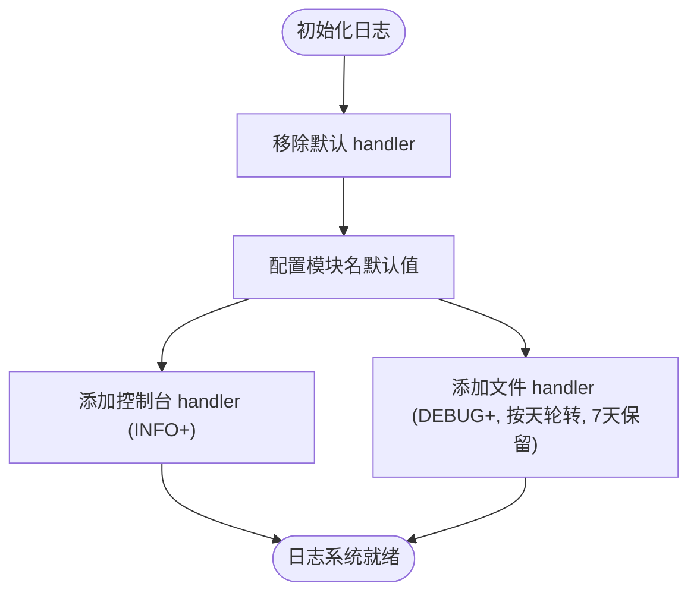
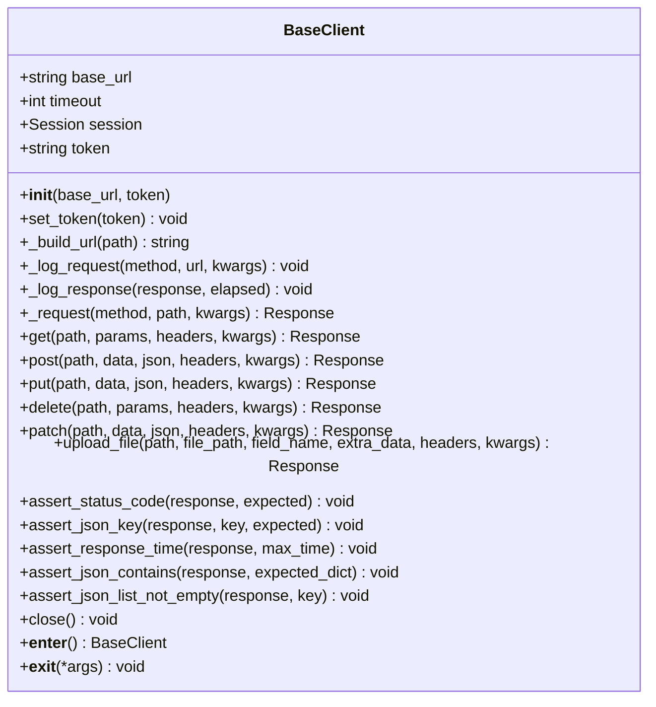
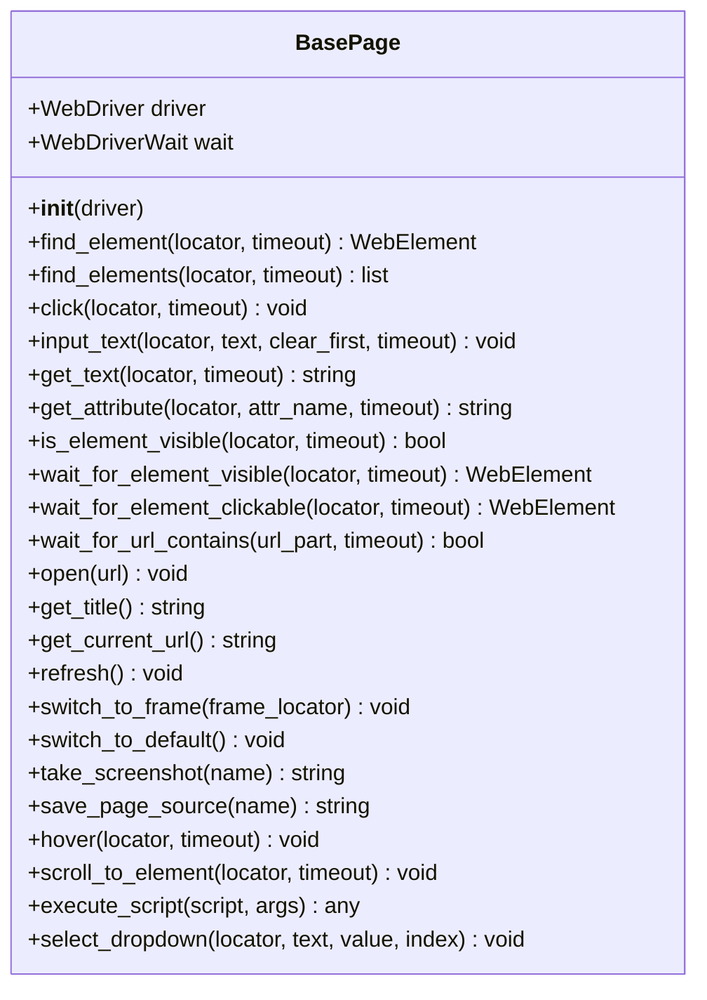
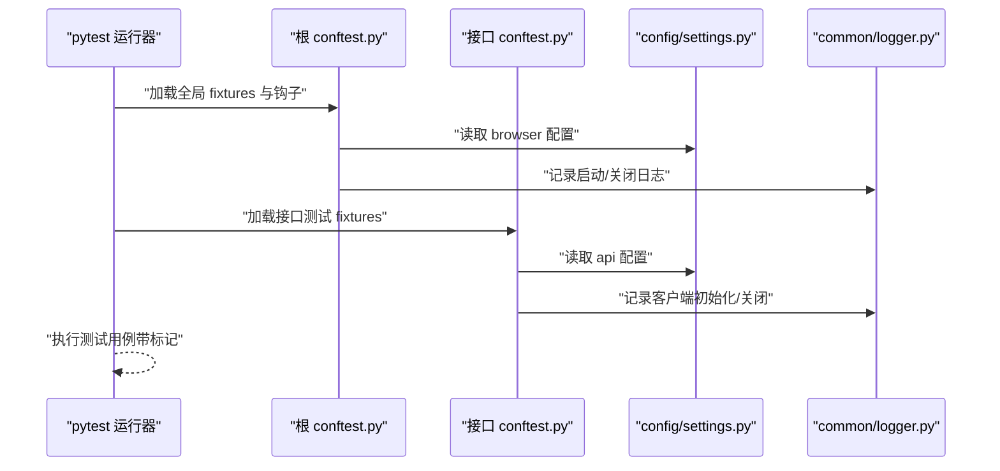
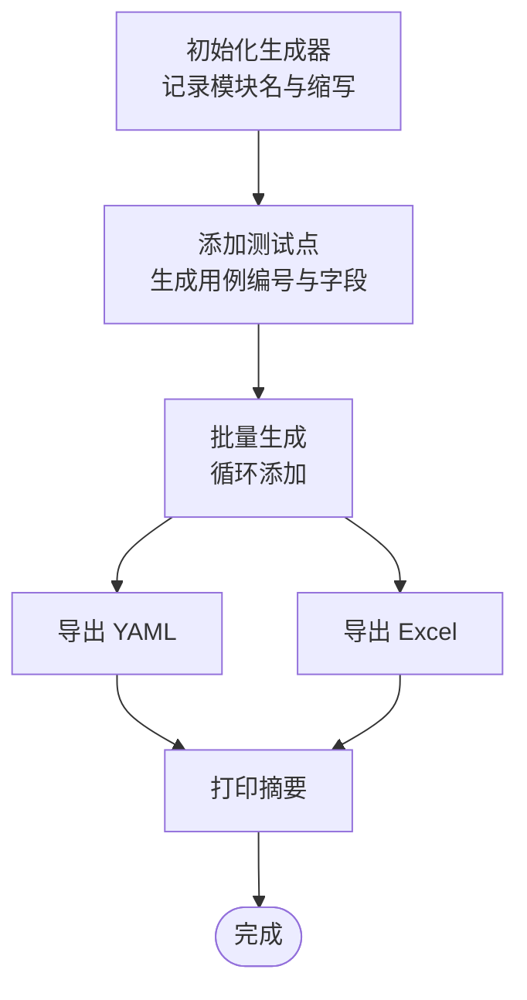
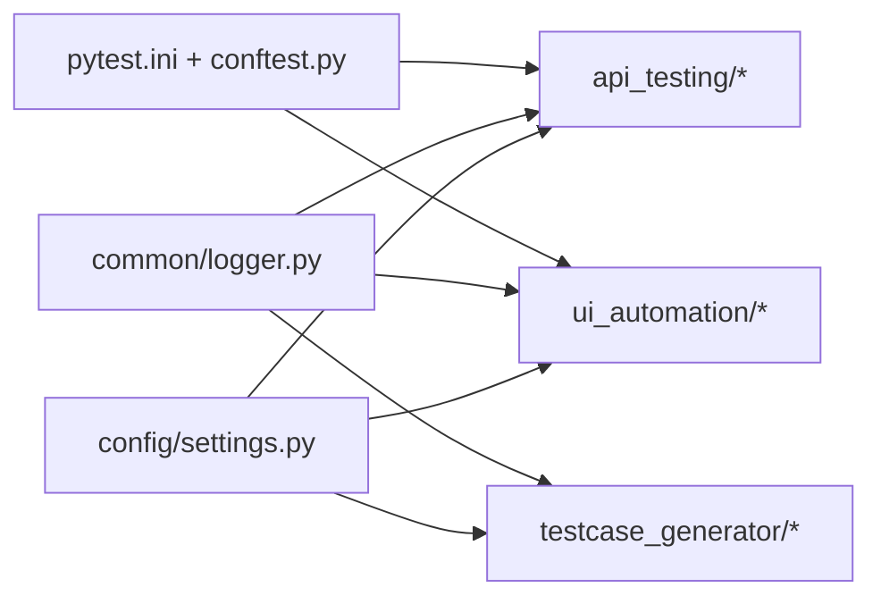

# 项目结构理解

<cite>
**本文引用的文件**
- [config/settings.py](file://config/settings.py)
- [conftest.py](file://conftest.py)
- [pytest.ini](file://pytest.ini)
- [requirements.txt](file://requirements.txt)
- [README.md](file://README.md)
- [config/environments/dev.yaml](file://config/environments/dev.yaml)
- [config/environments/test.yaml](file://config/environments/test.yaml)
- [config/environments/prod.yaml](file://config/environments/prod.yaml)
- [common/logger.py](file://common/logger.py)
- [api_testing/api_client/base_client.py](file://api_testing/api_client/base_client.py)
- [api_testing/testcases/conftest.py](file://api_testing/testcases/conftest.py)
- [api_testing/testcases/test_example_api.py](file://api_testing/testcases/test_example_api.py)
- [ui_automation/pages/base_page.py](file://ui_automation/pages/base_page.py)
- [ui_automation/testcases/test_example.py](file://ui_automation/testcases/test_example.py)
- [testcase_generator/generator.py](file://testcase_generator/generator.py)
</cite>

## 目录
1. [引言](#引言)
2. [项目结构](#项目结构)
3. [核心组件](#核心组件)
4. [架构总览](#架构总览)
5. [详细组件分析](#详细组件分析)
6. [依赖分析](#依赖分析)
7. [性能考虑](#性能考虑)
8. [故障排查指南](#故障排查指南)
9. [结论](#结论)
10. [附录](#附录)

## 引言
本指南面向新成员与维护者，帮助快速理解测试自动化工作区的整体架构、模块划分原则与组件关系。重点覆盖：
- 配置管理机制：config/settings.py 如何基于环境变量加载多环境配置
- 测试框架配置：pytest.ini 的全局配置与 conftest.py 的全局 fixtures 与钩子
- 各模块职责边界、依赖关系与数据流向
- 目录结构、文件命名规范与代码组织原则
- 新成员快速上手的最佳实践

## 项目结构
项目采用“按功能域分层”的组织方式，核心模块包括：
- config：全局配置与多环境配置
- common：公共工具（日志、文件处理、报告）
- api_testing：接口测试（客户端封装、测试用例、测试数据）
- ui_automation：Web UI 自动化（Page Object、测试用例、测试数据、证据）
- performance：性能测试脚本与报告
- testcase_generator：测试用例生成器
- docs：文档
- 根目录：pytest 配置、依赖声明、README

图表来源
- [conftest.py:1-122](file://conftest.py#L1-L122)
- [config/settings.py:1-104](file://config/settings.py#L1-L104)
- [common/logger.py:1-77](file://common/logger.py#L1-L77)
- [api_testing/api_client/base_client.py:1-308](file://api_testing/api_client/base_client.py#L1-L308)
- [api_testing/testcases/conftest.py:1-80](file://api_testing/testcases/conftest.py#L1-L80)
- [ui_automation/pages/base_page.py:1-499](file://ui_automation/pages/base_page.py#L1-L499)
- [ui_automation/testcases/test_example.py:1-161](file://ui_automation/testcases/test_example.py#L1-L161)
- [testcase_generator/generator.py:1-263](file://testcase_generator/generator.py#L1-L263)

章节来源
- [README.md:7-43](file://README.md#L7-L43)
- [requirements.txt:1-21](file://requirements.txt#L1-L21)

## 核心组件
- 配置管理（config/settings.py）
  - 通过环境变量 TEST_ENV 选择 dev/test/prod，读取对应 YAML 配置
  - 提供属性访问与通用 get(key, default) 方法
  - 暴露全局 settings 实例供其他模块导入使用
- 日志系统（common/logger.py）
  - 使用 loguru 统一日志输出：控制台 INFO+；文件 DEBUG+，按天轮转，保留 7 天
  - 提供 get_logger(name) 获取带模块名的 logger 实例
- 接口测试客户端（api_testing/api_client/base_client.py）
  - 基于 requests 封装 HTTP 请求、Session 管理、Token 认证、断言工具
  - 统一日志记录请求/响应、异常处理与资源释放
- UI 页面对象（ui_automation/pages/base_page.py）
  - 封装 Selenium 常用操作：元素查找、等待、输入、点击、截图、页面操作、JS 执行、下拉选择等
  - 统一证据收集（截图、页面源码）
- 测试框架配置（pytest.ini）
  - 指定测试路径、文件/类/函数命名规范、HTML 报告输出
  - 定义标记（smoke、regression、api、ui）
- 全局 fixtures 与钩子（conftest.py）
  - driver：按配置初始化浏览器，设置隐式等待与页面加载超时，测试结束自动关闭
  - base_url：提供当前环境基础 URL
  - pytest_runtest_makereport：失败自动截图并记录日志
  - pytest_configure：注册自定义 marker，避免警告
- 接口测试专用 fixtures（api_testing/testcases/conftest.py）
  - api_client：基础客户端（无认证）
  - auth_client：带 Token 的客户端（优先配置，否则可扩展登录获取）
  - base_url：提供 API 基础地址
- 用例生成器（testcase_generator/generator.py）
  - 从测试点批量生成结构化用例，支持导出 YAML 与 Excel

章节来源
- [config/settings.py:13-104](file://config/settings.py#L13-L104)
- [common/logger.py:1-77](file://common/logger.py#L1-L77)
- [api_testing/api_client/base_client.py:18-308](file://api_testing/api_client/base_client.py#L18-L308)
- [ui_automation/pages/base_page.py:24-499](file://ui_automation/pages/base_page.py#L24-L499)
- [pytest.ini:1-12](file://pytest.ini#L1-L12)
- [conftest.py:1-122](file://conftest.py#L1-L122)
- [api_testing/testcases/conftest.py:1-80](file://api_testing/testcases/conftest.py#L1-L80)
- [testcase_generator/generator.py:17-263](file://testcase_generator/generator.py#L17-L263)

## 架构总览
整体架构遵循“配置驱动 + 工具复用 + 分层测试”的设计原则：
- 配置层：集中管理多环境参数，屏蔽环境差异
- 工具层：日志、文件处理、报告等通用能力
- 测试层：接口与 UI 分离，各自拥有客户端/页面对象与 fixtures
- 运行层：pytest 驱动，全局钩子与 fixtures 统一生命周期与证据收集

图表来源
- [config/settings.py:1-104](file://config/settings.py#L1-L104)
- [common/logger.py:1-77](file://common/logger.py#L1-L77)
- [api_testing/api_client/base_client.py:1-308](file://api_testing/api_client/base_client.py#L1-L308)
- [ui_automation/pages/base_page.py:1-499](file://ui_automation/pages/base_page.py#L1-L499)
- [conftest.py:1-122](file://conftest.py#L1-L122)
- [pytest.ini:1-12](file://pytest.ini#L1-L12)

## 详细组件分析

### 配置管理组件（config/settings.py）
- 设计要点
  - 通过环境变量 TEST_ENV 选择配置文件，避免硬编码
  - 以属性访问与 get 方法提供统一读取接口
  - 暴露 base_url、username、password、database、api、browser 等常用配置
- 关键流程
  - 初始化：读取 TEST_ENV 或默认 test，定位 YAML 文件
  - 加载：使用 YAML 解析，返回字典
  - 访问：属性与 get 提供安全访问，缺失键返回空或默认值
- 依赖关系
  - 依赖 os、yaml
  - 被 api、ui、用例生成器等模块导入使用

图表来源
- [config/settings.py:13-104](file://config/settings.py#L13-L104)

章节来源
- [config/settings.py:13-104](file://config/settings.py#L13-L104)
- [config/environments/dev.yaml:1-31](file://config/environments/dev.yaml#L1-L31)
- [config/environments/test.yaml:1-31](file://config/environments/test.yaml#L1-L31)
- [config/environments/prod.yaml:1-31](file://config/environments/prod.yaml#L1-L31)

### 日志组件（common/logger.py）
- 设计要点
  - 控制台 INFO 级别及以上，彩色输出
  - 文件 DEBUG 级别及以上，按天轮转，保留 7 天
  - 统一模块名绑定，便于问题定位
- 关键流程
  - 初始化：移除默认 handler，配置 stdout 与文件 handler
  - 获取 logger：get_logger(name) 返回绑定模块名的实例
- 依赖关系
  - 依赖 loguru、sys、os
  - 被 api、ui、生成器等模块广泛使用

图表来源
- [common/logger.py:34-56](file://common/logger.py#L34-L56)

章节来源
- [common/logger.py:1-77](file://common/logger.py#L1-L77)

### 接口测试客户端（api_testing/api_client/base_client.py）
- 设计要点
  - 基于 requests.Session 管理连接与默认 headers
  - 统一封装 GET/POST/PUT/DELETE/PATCH/上传等方法
  - 内置断言工具：状态码、JSON 键、响应时间、列表非空、子集匹配
  - 统一日志：请求/响应详情、异常记录、耗时统计
  - 资源管理：自动关闭 session，with 支持
- 关键流程
  - 初始化：读取 base_url 与 timeout，设置默认 headers
  - 请求：构建 URL、合并自定义 headers、记录日志、发送请求、异常捕获
  - 断言：提供多种断言方法，失败时给出明确信息
  - 关闭：释放连接资源
- 依赖关系
  - 依赖 requests、json、time、os、sys
  - 依赖 common/logger.py 与 config/settings.py

图表来源
- [api_testing/api_client/base_client.py:18-308](file://api_testing/api_client/base_client.py#L18-L308)

章节来源
- [api_testing/api_client/base_client.py:18-308](file://api_testing/api_client/base_client.py#L18-L308)

### UI 页面对象（ui_automation/pages/base_page.py）
- 设计要点
  - Page Object 模式：将页面行为抽象为方法，隔离定位细节
  - 元素操作：查找、点击、输入、获取文本/属性、可见性判断
  - 等待策略：显式等待（WebDriverWait）+ EC 预置条件
  - 页面操作：打开、刷新、切换 iframe、获取标题/URL
  - 高级交互：悬停、滚动、执行 JS、下拉选择
  - 证据收集：截图、保存页面源码，统一存放在 evidence 目录
- 关键流程
  - 初始化：注入 driver，设置默认等待时间，确保证据目录存在
  - 元素操作：封装等待与异常处理，失败时截图
  - 页面操作：统一日志与异常处理
  - 证据：按时间戳命名，失败场景自动截图
- 依赖关系
  - 依赖 selenium、os、time、ActionChains、Select
  - 依赖 common/logger.py

图表来源
- [ui_automation/pages/base_page.py:24-499](file://ui_automation/pages/base_page.py#L24-L499)

章节来源
- [ui_automation/pages/base_page.py:24-499](file://ui_automation/pages/base_page.py#L24-L499)

### 测试框架配置与全局 fixtures（pytest.ini、conftest.py、api_testing/testcases/conftest.py）
- pytest.ini
  - testpaths：限定测试搜索范围（ui_automation/testcases、api_testing/testcases）
  - python_*：统一文件/类/函数命名规范
  - addopts：开启详细输出与 HTML 报告
  - markers：定义 smoke、regression、api、ui 标记
- 根 conftest.py
  - driver：按配置初始化浏览器（chrome/firefox），设置 headless、隐式等待、页面加载超时，测试结束后 quit
  - base_url：提供当前环境基础 URL
  - pytest_runtest_makereport：失败自动截图至 ui_automation/evidence，并记录日志
  - pytest_configure：注册自定义 marker，避免 pytest 警告
- 接口测试 conftest.py
  - api_client：基础客户端（无认证），测试结束后关闭 session
  - auth_client：带 Token 的客户端（优先配置，否则可扩展登录）
  - base_url：提供 API 基础地址

图表来源
- [conftest.py:112-122](file://conftest.py#L112-L122)
- [api_testing/testcases/conftest.py:16-80](file://api_testing/testcases/conftest.py#L16-L80)
- [config/settings.py:36-83](file://config/settings.py#L36-L83)
- [common/logger.py:59-77](file://common/logger.py#L59-L77)

章节来源
- [pytest.ini:1-12](file://pytest.ini#L1-L12)
- [conftest.py:1-122](file://conftest.py#L1-L122)
- [api_testing/testcases/conftest.py:1-80](file://api_testing/testcases/conftest.py#L1-L80)

### 用例生成器（testcase_generator/generator.py）
- 设计要点
  - 从测试点批量生成结构化用例，支持导出 YAML 与 Excel
  - 自动生成用例编号（TC_{模块缩写}_{序号}）
  - 模块缩写生成：优先英文部分，否则中文拼音首字母映射
  - 提供便捷函数一键生成并导出
- 关键流程
  - 初始化：记录模块名与缩写，准备序列号
  - 生成：逐条添加用例，填充字段
  - 导出：YAML 与 Excel 两种格式
  - 清空：重置用例集合与序号
- 依赖关系
  - 依赖 common/file_handler.py（YAML/Excel 写入）
  - 依赖 common/logger.py

图表来源
- [testcase_generator/generator.py:23-187](file://testcase_generator/generator.py#L23-L187)

章节来源
- [testcase_generator/generator.py:17-263](file://testcase_generator/generator.py#L17-L263)

### 示例测试用例（api 与 ui）
- 接口示例（api_testing/testcases/test_example_api.py）
  - 展示 GET/POST/断言/自定义 headers/Token 认证等典型场景
  - 通过 BaseClient 封装请求与断言，便于复用
- UI 示例（ui_automation/testcases/test_example.py）
  - 展示 Page Object 使用、测试数据加载、失败截图与日志记录
  - 通过 driver 与 base_url fixture 获取浏览器与基础 URL

章节来源
- [api_testing/testcases/test_example_api.py:18-167](file://api_testing/testcases/test_example_api.py#L18-L167)
- [ui_automation/testcases/test_example.py:31-161](file://ui_automation/testcases/test_example.py#L31-L161)

## 依赖分析
- 模块内聚与耦合
  - config/settings.py 低耦合，被多模块导入，形成“配置中心”
  - common/logger.py 低耦合，被 api、ui、generator 等广泛使用
  - api_testing 与 ui_automation 分离，职责清晰，通过 fixtures 与 settings 解耦
- 外部依赖
  - pytest、pytest-html、pytest-xdist、selenium、requests、PyYAML、openpyxl、loguru、allure-pytest
- 循环依赖
  - 未发现循环依赖迹象；各模块通过 settings 与 logger 间接通信

图表来源
- [config/settings.py:1-104](file://config/settings.py#L1-L104)
- [common/logger.py:1-77](file://common/logger.py#L1-L77)
- [pytest.ini:1-12](file://pytest.ini#L1-L12)
- [conftest.py:1-122](file://conftest.py#L1-L122)

章节来源
- [requirements.txt:1-21](file://requirements.txt#L1-L21)

## 性能考虑
- 接口测试
  - 使用 requests.Session 复用连接，减少握手开销
  - 合理设置超时与断言阈值，避免长耗时阻塞
- UI 自动化
  - 显式等待替代硬编码 sleep，提升稳定性与效率
  - 无头模式（prod 环境）减少资源占用
- 日志
  - 控制台 INFO 与文件 DEBUG 分级输出，避免过度 IO
- 并行执行
  - 使用 pytest-xdist 并行加速（需确保测试用例无共享状态）

## 故障排查指南
- 配置相关
  - 确认 TEST_ENV 是否正确，对应 YAML 文件是否存在
  - 检查 YAML 语法与键名是否一致
- 浏览器相关（UI）
  - driver fixture 初始化失败：检查浏览器类型与 headless 配置
  - 失败自动截图：确认 ui_automation/evidence 目录可写
- 接口请求相关（API）
  - 超时/连接错误：检查 base_url、timeout、网络连通性
  - 断言失败：查看日志中请求/响应详情，定位问题
- 日志相关
  - 日志未输出：确认 logger 初始化与 handler 配置
  - 日志过大：调整轮转与保留策略

章节来源
- [config/settings.py:42-48](file://config/settings.py#L42-L48)
- [conftest.py:80-110](file://conftest.py#L80-L110)
- [api_testing/api_client/base_client.py:122-133](file://api_testing/api_client/base_client.py#L122-L133)
- [common/logger.py:40-56](file://common/logger.py#L40-L56)

## 结论
本项目通过“配置驱动 + 工具复用 + 分层测试”的架构，实现了接口与 UI 自动化的解耦与可维护性。config/settings.py 与 common/logger.py 提供统一的基础设施，pytest.ini 与 conftest.py 确保测试运行的一致性与可观测性。建议新成员从配置与日志入手，逐步掌握各层组件的职责与协作方式。

## 附录
- 目录结构与文件命名规范
  - config/environments：按环境命名（dev/test/prod），统一 YAML 结构
  - api_testing/ui_automation：pages/testcases/testdata/evidence 分层清晰
  - 用例文件：test_*.py，类名 Test*，函数名 test_*
  - 标记：smoke、regression、api、ui
- 快速上手清单
  - 设置 TEST_ENV 与对应 YAML
  - 安装依赖并运行 pytest
  - 在 api 或 ui 目录下新增用例，复用 client/page 与 fixtures
  - 使用断言与日志定位问题，必要时开启无头模式