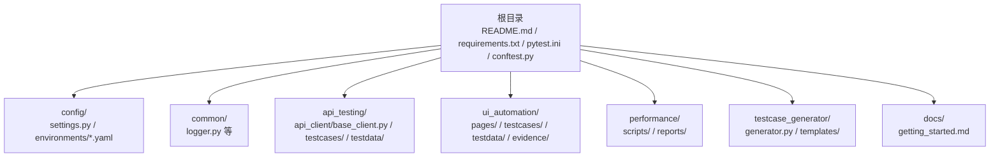
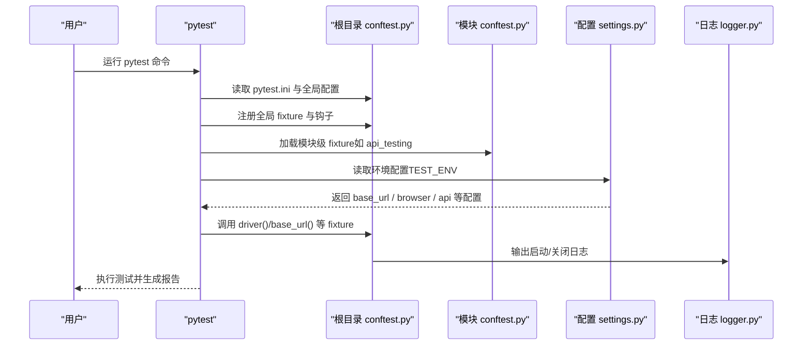

# 快速开始

<cite>
**本文引用的文件**
- [README.md](file://README.md)
- [docs/getting_started.md](file://docs/getting_started.md)
- [requirements.txt](file://requirements.txt)
- [pytest.ini](file://pytest.ini)
- [conftest.py](file://conftest.py)
- [api_testing/testcases/conftest.py](file://api_testing/testcases/conftest.py)
- [config/settings.py](file://config/settings.py)
- [config/environments/test.yaml](file://config/environments/test.yaml)
- [config/environments/dev.yaml](file://config/environments/dev.yaml)
- [api_testing/api_client/base_client.py](file://api_testing/api_client/base_client.py)
- [api_testing/testcases/test_example_api.py](file://api_testing/testcases/test_example_api.py)
- [ui_automation/testcases/test_example.py](file://ui_automation/testcases/test_example.py)
- [api_testing/testdata/example_api_data.yaml](file://api_testing/testdata/example_api_data.yaml)
- [ui_automation/testdata/login_data.yaml](file://ui_automation/testdata/login_data.yaml)
- [common/logger.py](file://common/logger.py)
</cite>

## 目录
1. [引言](#引言)
2. [项目结构](#项目结构)
3. [核心组件](#核心组件)
4. [架构总览](#架构总览)
5. [详细组件分析](#详细组件分析)
6. [依赖分析](#依赖分析)
7. [性能考虑](#性能考虑)
8. [故障排查指南](#故障排查指南)
9. [结论](#结论)
10. [附录](#附录)

## 引言
本指南面向首次接触测试自动化框架的新手，帮助你在约 30 分钟内完成从克隆仓库到成功运行第一个测试用例的全流程。你将学会：
- 环境搭建与虚拟环境配置
- 依赖安装与环境变量设置
- pytest 配置、全局 fixture 与测试标记系统
- 如何运行冒烟测试、接口测试与 UI 自动化测试
- 常见安装问题的解决方案与环境验证方法

## 项目结构
该仓库是一个综合性的测试自动化工作区，包含 Web UI 自动化、接口测试、性能测试、测试用例生成、公共工具与配置模块。核心入口与配置集中在根目录，各模块按功能划分。

图表来源
- [README.md:1-123](file://README.md#L1-L123)
- [docs/getting_started.md:1-91](file://docs/getting_started.md#L1-L91)

章节来源
- [README.md:7-43](file://README.md#L7-L43)
- [docs/getting_started.md:1-91](file://docs/getting_started.md#L1-L91)

## 核心组件
- pytest 配置与标记系统：通过根目录配置文件集中定义测试发现路径、命名规范与自定义标记，避免重复参数。
- 全局 fixture：统一管理浏览器驱动生命周期、失败截图与基础 URL 提供。
- 配置中心：基于 YAML 的多环境配置，支持通过环境变量切换环境。
- 接口客户端：封装 HTTP 请求、会话管理、断言工具与日志记录。
- 日志系统：统一控制台与文件输出，便于问题定位与报告生成。

章节来源
- [pytest.ini:1-12](file://pytest.ini#L1-L12)
- [conftest.py:1-122](file://conftest.py#L1-L122)
- [config/settings.py:1-104](file://config/settings.py#L1-L104)
- [api_testing/api_client/base_client.py:1-308](file://api_testing/api_client/base_client.py#L1-L308)
- [common/logger.py:1-77](file://common/logger.py#L1-L77)

## 架构总览
下图展示了从命令行到测试执行的关键路径，包括 pytest 配置、全局与模块级 fixture、配置加载与日志输出。

图表来源
- [pytest.ini:1-12](file://pytest.ini#L1-L12)
- [conftest.py:112-122](file://conftest.py#L112-L122)
- [api_testing/testcases/conftest.py:1-80](file://api_testing/testcases/conftest.py#L1-L80)
- [config/settings.py:26-48](file://config/settings.py#L26-L48)
- [common/logger.py:34-56](file://common/logger.py#L34-L56)

## 详细组件分析

### 环境搭建与依赖安装
- 克隆仓库与进入目录
- 创建并激活虚拟环境
- 安装依赖（根目录 requirements.txt）

章节来源
- [README.md:47-62](file://README.md#L47-L62)
- [docs/getting_started.md:5-21](file://docs/getting_started.md#L5-L21)
- [requirements.txt:1-21](file://requirements.txt#L1-L21)

### pytest 配置与测试标记系统
- 测试发现路径与命名规范：自动扫描 UI 与接口测试目录，匹配 test_* 命名。
- 默认选项：启用详细输出与 HTML 报告生成。
- 自定义标记：smoke、regression、api、ui，用于分类筛选测试。

章节来源
- [pytest.ini:1-12](file://pytest.ini#L1-L12)

### 全局 fixture 与钩子
- driver：按配置初始化浏览器（Chrome/Firefox），支持无头模式、隐式等待与页面加载超时；测试结束后自动关闭。
- base_url：提供当前环境的基础 URL。
- 失败自动截图：在 call 阶段失败时自动保存截图至证据目录。
- 注册自定义标记：避免 pytest 对未知标记的警告。

章节来源
- [conftest.py:25-70](file://conftest.py#L25-L70)
- [conftest.py:80-111](file://conftest.py#L80-L111)
- [conftest.py:112-122](file://conftest.py#L112-L122)

### 模块级 fixture（接口测试）
- api_client：无认证的基础客户端，自动关闭会话。
- auth_client：支持从配置读取 token 或动态登录（预留逻辑）。
- base_url：提供 API 基础地址。

章节来源
- [api_testing/testcases/conftest.py:16-80](file://api_testing/testcases/conftest.py#L16-L80)

### 配置中心与多环境
- 通过环境变量 TEST_ENV 切换 dev/test/prod。
- 读取对应 YAML 配置，提供 base_url、browser、api 等属性访问。
- 缺少配置文件时抛出明确错误，便于定位问题。

章节来源
- [config/settings.py:26-48](file://config/settings.py#L26-L48)
- [config/settings.py:50-83](file://config/settings.py#L50-L83)
- [config/environments/test.yaml:1-31](file://config/environments/test.yaml#L1-L31)
- [config/environments/dev.yaml:1-31](file://config/environments/dev.yaml#L1-L31)

### 接口客户端与断言工具
- 支持 GET/POST/PUT/DELETE/PATCH/上传等常用方法。
- 统一日志记录：请求与响应详情、耗时与异常处理。
- 断言工具：状态码、JSON 键、响应时间、列表非空、键值包含等。

章节来源
- [api_testing/api_client/base_client.py:18-308](file://api_testing/api_client/base_client.py#L18-L308)

### UI 自动化示例与测试数据
- 示例测试类包含冒烟与登录场景，标注跳过原因以便替换为真实环境。
- 测试数据来源于 YAML 文件，便于参数化与维护。

章节来源
- [ui_automation/testcases/test_example.py:31-161](file://ui_automation/testcases/test_example.py#L31-L161)
- [ui_automation/testdata/login_data.yaml:1-19](file://ui_automation/testdata/login_data.yaml#L1-L19)

### 日志系统
- 控制台 INFO 级别以上输出，文件 DEBUG 级别以上按天轮转，保留 7 天。
- 统一模块名绑定，便于区分来源。

章节来源
- [common/logger.py:34-56](file://common/logger.py#L34-L56)
- [common/logger.py:59-77](file://common/logger.py#L59-L77)

## 依赖分析
- 测试框架：pytest、pytest-html、pytest-xdist。
- UI 自动化：selenium。
- 接口测试：requests。
- 数据处理：PyYAML、openpyxl。
- 日志：loguru。
- 报告（可选）：allure-pytest。

章节来源
- [requirements.txt:1-21](file://requirements.txt#L1-L21)

## 性能考虑
- 并行执行：使用 xdist 在多核 CPU 上并行运行测试，提升吞吐量。
- 会话复用：接口客户端使用 requests.Session，减少连接开销。
- 超时与重试：合理设置超时与断言阈值，避免长时间阻塞。

章节来源
- [requirements.txt:3-4](file://requirements.txt#L3-L4)
- [api_testing/api_client/base_client.py:28-30](file://api_testing/api_client/base_client.py#L28-L30)
- [api_testing/api_client/base_client.py:122-133](file://api_testing/api_client/base_client.py#L122-L133)

## 故障排查指南
- 依赖安装失败
  - 确认虚拟环境已激活且 pip 来源可信。
  - 若网络受限，可更换镜像源后重试。
- 浏览器驱动问题
  - 确认浏览器类型与驱动版本匹配；必要时开启无头模式以减少图形界面依赖。
- 配置文件缺失
  - 检查 TEST_ENV 是否拼写正确，确认对应 YAML 文件存在。
- 测试被跳过
  - 示例测试默认跳过，请替换为真实环境地址与页面定位器后再运行。
- 报告生成失败
  - 确认 pytest-html 已安装，或使用内置 HTML 报告选项。

章节来源
- [README.md:64-81](file://README.md#L64-L81)
- [docs/getting_started.md:31-51](file://docs/getting_started.md#L31-L51)
- [config/settings.py:42-45](file://config/settings.py#L42-L45)
- [ui_automation/testcases/test_example.py:36-37](file://ui_automation/testcases/test_example.py#L36-L37)

## 结论
通过本指南，你已掌握从零到一的环境搭建、配置与测试运行流程。建议在完成基础验证后，逐步替换示例测试中的占位内容，接入真实环境与页面元素，形成可维护的自动化测试体系。

## 附录

### 从零到一的完整流程（30 分钟清单）
- 环境准备（5 分钟）
  - 克隆仓库、创建并激活虚拟环境、安装依赖。
- 环境验证（5 分钟）
  - 设置 TEST_ENV，确认配置加载；查看日志输出。
- 运行冒烟测试（5 分钟）
  - 使用 smoke 标记快速验证核心链路。
- 运行接口测试（5 分钟）
  - 使用 api 标记执行接口用例；观察断言与日志。
- 运行 UI 自动化测试（5 分钟）
  - 使用 ui 标记执行页面用例；检查失败截图与报告。
- 并行加速（可选，5 分钟）
  - 使用 xdist 并行执行，缩短整体耗时。

章节来源
- [README.md:47-81](file://README.md#L47-L81)
- [docs/getting_started.md:31-51](file://docs/getting_started.md#L31-L51)
- [pytest.ini:7-11](file://pytest.ini#L7-L11)