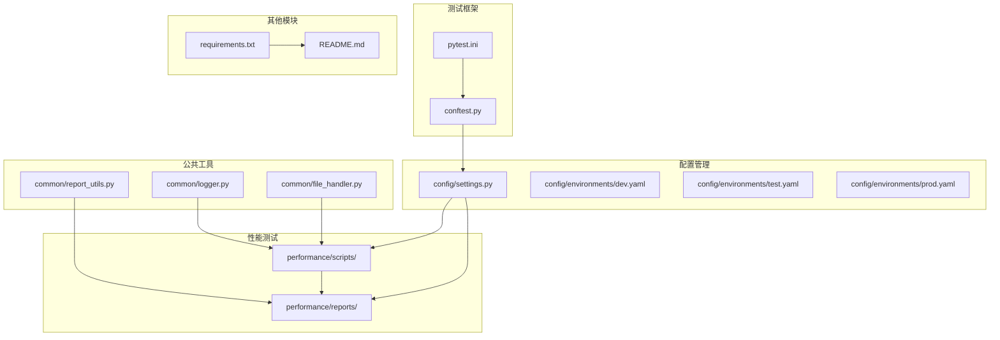
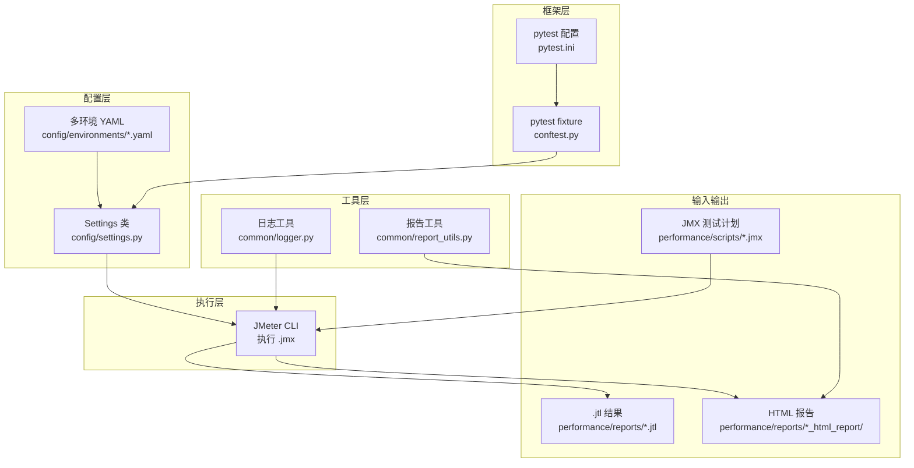
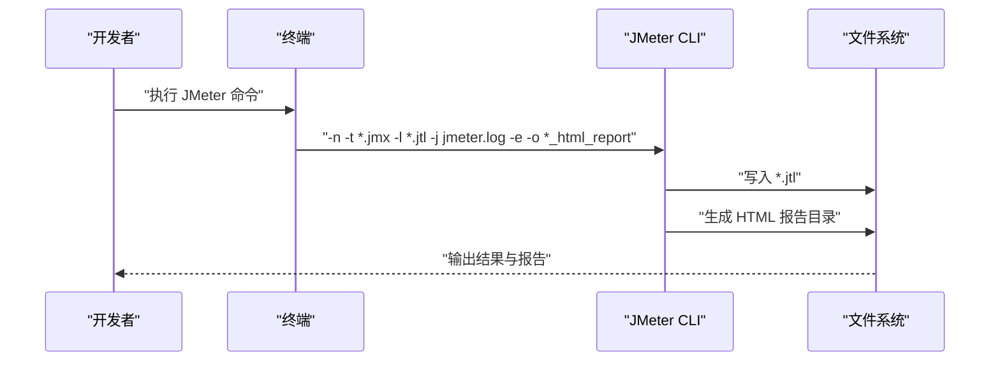
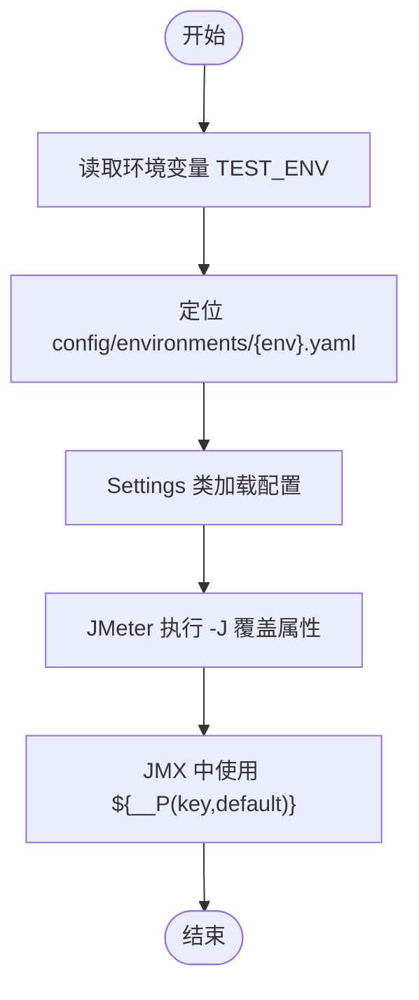
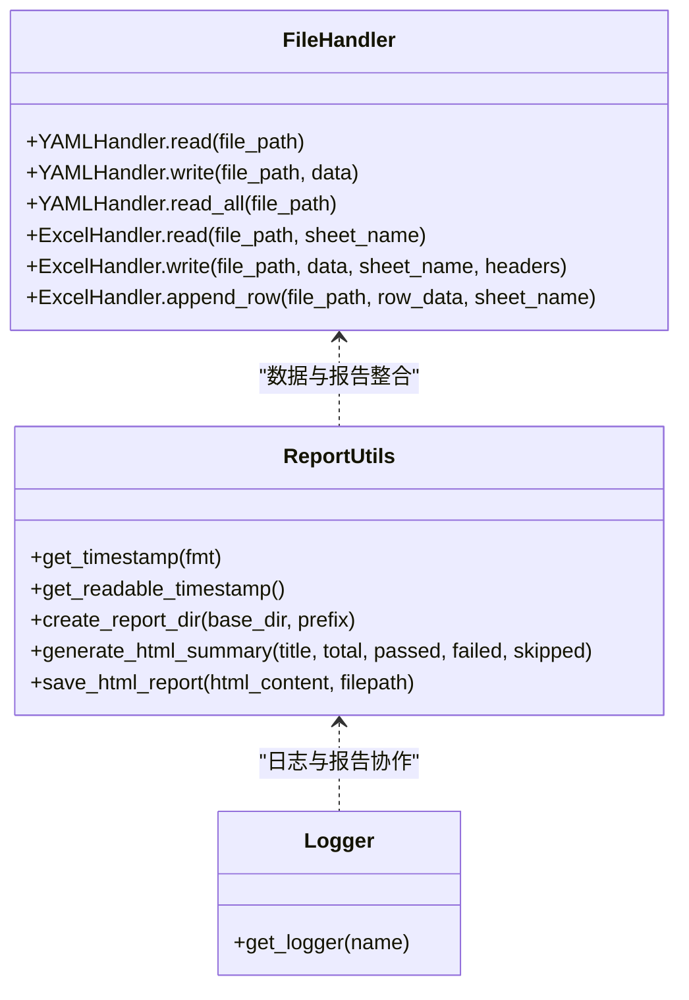
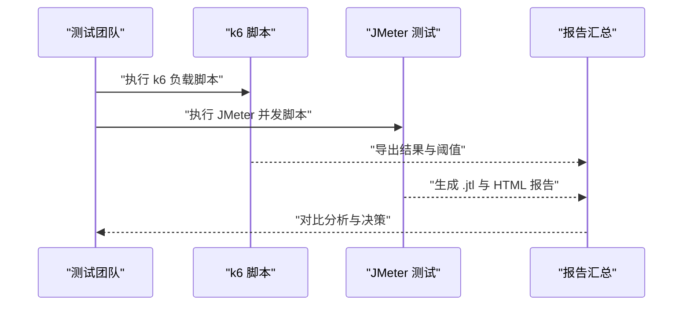
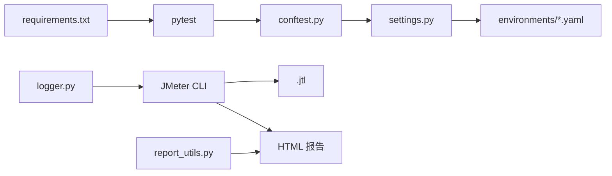

# JMeter集成指南

<cite>
**本文引用的文件**
- [jmeter_guide.md](file://performance/scripts/jmeter_guide.md)
- [example_load_test.js](file://performance/scripts/example_load_test.js)
- [settings.py](file://config/settings.py)
- [dev.yaml](file://config/environments/dev.yaml)
- [test.yaml](file://config/environments/test.yaml)
- [prod.yaml](file://config/environments/prod.yaml)
- [requirements.txt](file://requirements.txt)
- [report_utils.py](file://common/report_utils.py)
- [logger.py](file://common/logger.py)
- [file_handler.py](file://common/file_handler.py)
- [conftest.py](file://conftest.py)
- [pytest.ini](file://pytest.ini)
- [README.md](file://README.md)
</cite>

## 目录
1. [引言](#引言)
2. [项目结构](#项目结构)
3. [核心组件](#核心组件)
4. [架构总览](#架构总览)
5. [详细组件分析](#详细组件分析)
6. [依赖分析](#依赖分析)
7. [性能考虑](#性能考虑)
8. [故障排查指南](#故障排查指南)
9. [结论](#结论)
10. [附录](#附录)

## 引言
本指南面向在该测试自动化工作区中集成 JMeter 的团队，系统阐述 JMeter 在性能测试框架中的定位与集成方式，覆盖安装配置、插件管理、项目结构、JMX 测试计划创建与参数化、结果收集与报告生成，并补充与 k6 的协同工作模式、测试场景互补性以及数据对比分析思路。同时给出常见性能测试场景的实现方案与最佳实践，帮助团队高效落地性能测试流程。

## 项目结构
该工作区采用模块化组织，性能测试相关资源集中在 performance 目录，配合 config 环境配置、common 公共工具与 pytest 集成，形成“配置驱动 + 统一工具 + 可视化报告”的测试体系。

图表来源
- [README.md:1-123](file://README.md#L1-L123)
- [requirements.txt:1-21](file://requirements.txt#L1-L21)
- [pytest.ini:1-12](file://pytest.ini#L1-L12)
- [conftest.py:1-122](file://conftest.py#L1-L122)
- [settings.py:1-104](file://config/settings.py#L1-L104)
- [jmeter_guide.md:1-98](file://performance/scripts/jmeter_guide.md#L1-L98)

章节来源
- [README.md:1-123](file://README.md#L1-L123)
- [requirements.txt:1-21](file://requirements.txt#L1-L21)
- [pytest.ini:1-12](file://pytest.ini#L1-L12)
- [conftest.py:1-122](file://conftest.py#L1-L122)
- [settings.py:1-104](file://config/settings.py#L1-L104)
- [jmeter_guide.md:1-98](file://performance/scripts/jmeter_guide.md#L1-L98)

## 核心组件
- JMeter 命令行与报告生成：通过命令行模式执行 JMX 测试计划，输出 .jtl 结果与 HTML 报告，支持参数覆盖与日志记录。
- 环境配置与参数化：利用 config/settings.py 与多环境 YAML 配置，结合 JMeter 属性覆盖实现跨环境参数化。
- 报告与日志：统一使用 common/report_utils.py 生成时间戳目录与 HTML 摘要，配合 common/logger.py 的日志能力进行问题定位。
- 与 k6 的协同：性能测试双引擎互补，JMeter 更擅长业务流程与并发场景，k6 更擅长高并发与阈值控制，二者结果可对比分析。

章节来源
- [jmeter_guide.md:19-98](file://performance/scripts/jmeter_guide.md#L19-L98)
- [settings.py:13-104](file://config/settings.py#L13-L104)
- [report_utils.py:13-143](file://common/report_utils.py#L13-L143)
- [logger.py:1-77](file://common/logger.py#L1-L77)
- [example_load_test.js:1-33](file://performance/scripts/example_load_test.js#L1-L33)

## 架构总览
下图展示 JMeter 在该工作区中的位置与交互关系：JMX 测试计划位于 performance/scripts，执行后输出 .jtl 与 HTML 报告至 performance/reports；环境配置由 config/settings.py 与 YAML 提供；公共工具负责报告与日志；pytest 配置与 conftest 提供测试框架支撑。

图表来源
- [jmeter_guide.md:19-98](file://performance/scripts/jmeter_guide.md#L19-L98)
- [settings.py:13-104](file://config/settings.py#L13-L104)
- [report_utils.py:13-143](file://common/report_utils.py#L13-L143)
- [logger.py:1-77](file://common/logger.py#L1-L77)
- [pytest.ini:1-12](file://pytest.ini#L1-L12)
- [conftest.py:1-122](file://conftest.py#L1-L122)

## 详细组件分析

### JMeter 命令行与报告生成
- 基本执行：在项目根目录使用非 GUI 模式执行 .jmx，输出 .jtl 与可选 HTML 报告。
- 参数说明：-n 非 GUI、-t 指定测试计划、-l 结果文件、-j 引擎日志、-e 生成报告、-o 报告输出目录。
- 参数覆盖：通过 -Jthreads、-Jrampup、-Jloops 等在命令行覆盖 JMeter 属性，JMX 中使用 ${__P(...)} 引用。
- 报告生成：支持从已有 .jtl 单独生成 HTML 报告；报告目录需为空；建议文件名包含时间戳；建议将 .jtl 与报告目录加入 .gitignore。

图表来源
- [jmeter_guide.md:23-49](file://performance/scripts/jmeter_guide.md#L23-L49)
- [jmeter_guide.md:84-90](file://performance/scripts/jmeter_guide.md#L84-L90)

章节来源
- [jmeter_guide.md:19-98](file://performance/scripts/jmeter_guide.md#L19-L98)

### 环境配置与参数化
- 环境配置：通过 config/settings.py 读取 config/environments 下的 YAML 文件，支持 dev/test/prod 环境切换。
- 参数化策略：在 JMX 中使用 ${__P(key,default)} 引用属性；通过 -Jkey=value 在命令行覆盖；也可在 JMeter GUI 中设置参数组或 CSV DataSet。
- 基础 URL 与 API 配置：settings.base_url、settings.api.* 等字段可用于接口测试与性能测试共享配置。

图表来源
- [settings.py:26-48](file://config/settings.py#L26-L48)
- [dev.yaml:1-31](file://config/environments/dev.yaml#L1-L31)
- [test.yaml:1-31](file://config/environments/test.yaml#L1-L31)
- [prod.yaml:1-31](file://config/environments/prod.yaml#L1-L31)
- [jmeter_guide.md:51-65](file://performance/scripts/jmeter_guide.md#L51-L65)

章节来源
- [settings.py:13-104](file://config/settings.py#L13-L104)
- [dev.yaml:1-31](file://config/environments/dev.yaml#L1-L31)
- [test.yaml:1-31](file://config/environments/test.yaml#L1-L31)
- [prod.yaml:1-31](file://config/environments/prod.yaml#L1-L31)
- [jmeter_guide.md:51-65](file://performance/scripts/jmeter_guide.md#L51-L65)

### 报告与日志
- 报告工具：common/report_utils.py 提供时间戳生成、报告目录创建、HTML 摘要生成与保存。
- 日志工具：common/logger.py 统一控制台与文件日志输出，按天轮转，保留 7 天。
- 文件处理：common/file_handler.py 提供 YAML/Excel 读写与追加能力，便于测试数据与结果整理。

图表来源
- [report_utils.py:13-143](file://common/report_utils.py#L13-L143)
- [logger.py:1-77](file://common/logger.py#L1-L77)
- [file_handler.py:13-217](file://common/file_handler.py#L13-L217)

章节来源
- [report_utils.py:13-143](file://common/report_utils.py#L13-L143)
- [logger.py:1-77](file://common/logger.py#L1-L77)
- [file_handler.py:13-217](file://common/file_handler.py#L13-L217)

### 与 k6 的协同工作模式
- 场景互补：JMeter 适合复杂业务流程与并发场景，k6 适合高并发与阈值控制；二者可并行执行，分别产出 .jtl 与 JSON/CSV 结果。
- 结果对比：统一时间戳命名与报告目录结构，便于横向对比 p50/p90/p95 响应时间、错误率、吞吐量等指标。
- 阈值与报告：k6 通过 options.thresholds 定义阈值，JMeter 通过聚合报告与图表进行趋势分析；可将两者报告纳入统一报告汇总。

图表来源
- [example_load_test.js:5-19](file://performance/scripts/example_load_test.js#L5-L19)
- [jmeter_guide.md:71-98](file://performance/scripts/jmeter_guide.md#L71-L98)

章节来源
- [example_load_test.js:1-33](file://performance/scripts/example_load_test.js#L1-L33)
- [jmeter_guide.md:71-98](file://performance/scripts/jmeter_guide.md#L71-L98)

### 常见性能测试场景与最佳实践
- 冒烟测试：快速验证核心接口可用性，JMX 使用少量线程与短时运行，关注错误率与响应时间阈值。
- 负载测试：逐步提升并发线程数，观察系统在不同负载下的稳定性与瓶颈点。
- 压力测试：超过系统设计容量，定位系统极限与异常表现。
- 稳定性测试：长时间高负载运行，观察内存泄漏、连接池耗尽等问题。
- 最佳实践：
  - 统一 .jtl 与 HTML 报告命名与目录结构；
  - 使用 -J 参数覆盖线程数、启动时间、循环次数；
  - 在 JMeter 中启用聚合报告与图表；
  - 将 .jtl 与报告目录加入 .gitignore，仅保留 .gitkeep；
  - 与 k6 结合时，统一时间戳与报告格式，便于对比。

章节来源
- [jmeter_guide.md:12-16](file://performance/scripts/jmeter_guide.md#L12-L16)
- [jmeter_guide.md:71-98](file://performance/scripts/jmeter_guide.md#L71-L98)
- [example_load_test.js:5-19](file://performance/scripts/example_load_test.js#L5-L19)

## 依赖分析
- 测试框架：pytest 提供测试发现、标记与 HTML 报告输出；conftest.py 注入 driver/base_url 等 fixture。
- 环境配置：config/settings.py 与 YAML 环境文件提供跨环境配置；pytest 通过 conftest.py 读取配置。
- 性能测试：JMeter 通过命令行执行，输出 .jtl 与 HTML 报告；与 common/report_utils.py、common/logger.py 协同。
- 依赖清单：requirements.txt 包含 pytest、selenium、requests、PyYAML、openpyxl、loguru、allure 等。

图表来源
- [pytest.ini:1-12](file://pytest.ini#L1-L12)
- [conftest.py:19-77](file://conftest.py#L19-L77)
- [settings.py:13-104](file://config/settings.py#L13-L104)
- [requirements.txt:1-21](file://requirements.txt#L1-L21)
- [jmeter_guide.md:23-49](file://performance/scripts/jmeter_guide.md#L23-L49)

章节来源
- [pytest.ini:1-12](file://pytest.ini#L1-L12)
- [conftest.py:19-77](file://conftest.py#L19-L77)
- [settings.py:13-104](file://config/settings.py#L13-L104)
- [requirements.txt:1-21](file://requirements.txt#L1-L21)
- [jmeter_guide.md:23-49](file://performance/scripts/jmeter_guide.md#L23-L49)

## 性能考虑
- 并发与资源：JMeter 执行时注意 CPU/内存占用，合理设置线程数与启动时间，避免过载。
- 结果文件格式：确保 jmeter.properties 中输出格式为 CSV，以便后续分析与可视化。
- 报告生成：-o 指定的目录必须为空，避免生成失败；建议报告目录与 .jtl 文件分离存储。
- 日志与磁盘：开启 -j 记录引擎日志，但注意磁盘空间；建议定期清理旧报告与日志。

## 故障排查指南
- 报告目录为空校验：当 -o 指定目录非空时会报错，需清理或更换目录。
- 结果文件格式：若报告生成异常，检查 jmeter.properties 中输出格式配置。
- 参数覆盖无效：确认 JMX 中使用 ${__P(key,default)} 引用属性，且命令行 -J 参数拼写一致。
- 环境配置未生效：检查 TEST_ENV 环境变量与 config/environments 下对应 YAML 文件是否存在。
- 日志定位：通过 common/logger.py 输出的日志文件定位执行异常；必要时开启更详细日志级别。

章节来源
- [jmeter_guide.md:92-98](file://performance/scripts/jmeter_guide.md#L92-L98)
- [logger.py:34-56](file://common/logger.py#L34-L56)
- [settings.py:42-48](file://config/settings.py#L42-L48)

## 结论
通过将 JMeter 集成到该测试自动化工作区，结合 config/settings.py 的环境配置与 common/report_utils.py 的报告工具，能够实现跨环境、可复用、可对比的性能测试流程。与 k6 的协同进一步提升了测试覆盖面与结果可信度。遵循本文的项目结构、参数化策略与最佳实践，可显著提升性能测试效率与质量。

## 附录
- 快速开始：克隆仓库、创建虚拟环境、安装依赖、运行测试。
- 目录结构：README.md 中列出各模块职责与目录组织。
- 测试框架：pytest.ini 与 conftest.py 提供测试发现、标记与 fixture 注入。

章节来源
- [README.md:45-82](file://README.md#L45-L82)
- [README.md:7-43](file://README.md#L7-L43)
- [pytest.ini:1-12](file://pytest.ini#L1-L12)
- [conftest.py:112-122](file://conftest.py#L112-L122)