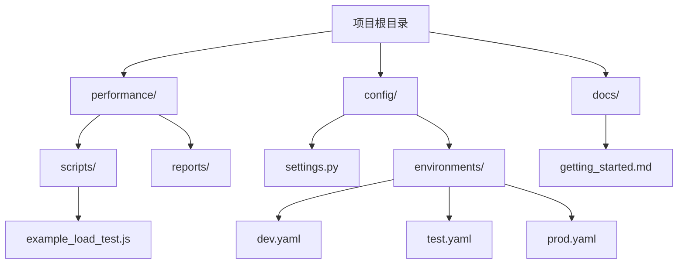
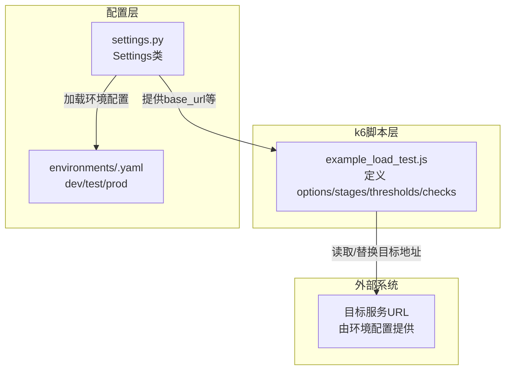
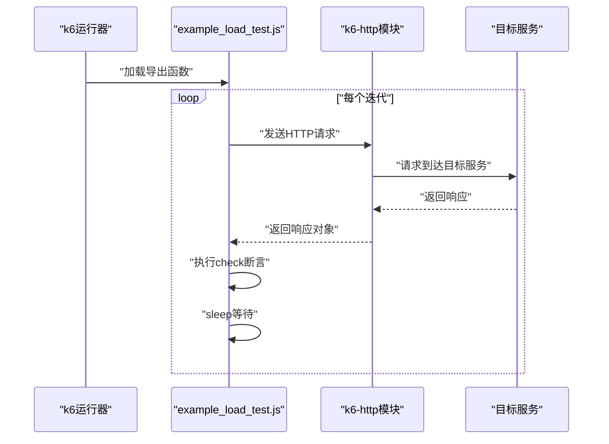
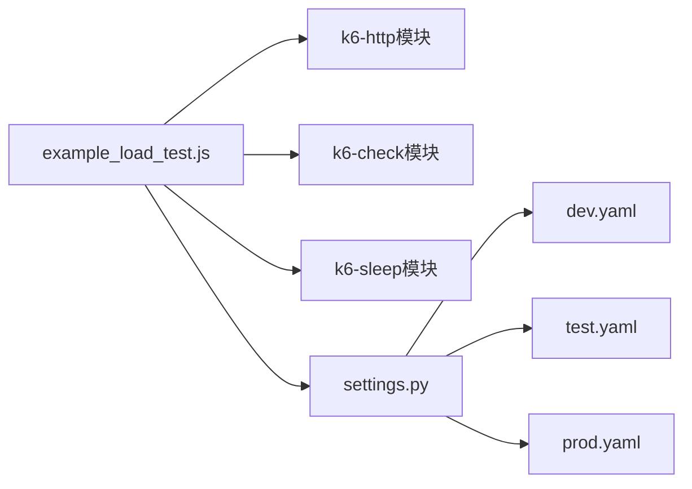

# k6负载测试

<cite>
**本文引用的文件**
- [example_load_test.js](file://performance/scripts/example_load_test.js)
- [jmeter_guide.md](file://performance/scripts/jmeter_guide.md)
- [README.md](file://README.md)
- [getting_started.md](file://docs/getting_started.md)
- [settings.py](file://config/settings.py)
- [dev.yaml](file://config/environments/dev.yaml)
- [test.yaml](file://config/environments/test.yaml)
- [prod.yaml](file://config/environments/prod.yaml)
- [example_api_data.yaml](file://api_testing/testdata/example_api_data.yaml)
</cite>

## 目录
1. [简介](#简介)
2. [项目结构](#项目结构)
3. [核心组件](#核心组件)
4. [架构总览](#架构总览)
5. [详细组件分析](#详细组件分析)
6. [依赖关系分析](#依赖关系分析)
7. [性能考虑](#性能考虑)
8. [故障排查指南](#故障排查指南)
9. [结论](#结论)
10. [附录](#附录)

## 简介
本文件面向k6负载测试模块，围绕示例脚本 performance/scripts/example_load_test.js 进行系统性技术文档梳理，重点覆盖以下方面：
- 测试配置（options）：阶递式负载（stages）、阈值（thresholds）与检查（checks）的定义与作用
- 虚拟用户（vusers）与阶段（stages）的使用方法与最佳实践
- HTTP请求发送、响应断言、错误处理与睡眠控制（sleep）
- 性能测试场景设计原则、负载模式配置与测试参数调优
- 与项目整体配置体系（环境配置）的衔接方式

同时，文档提供可视化图示帮助理解k6脚本的执行流程与关键组件之间的关系，并给出可操作的排障与优化建议。

## 项目结构
该项目采用模块化组织，性能测试位于 performance/scripts 目录，示例脚本 example_load_test.js 即位于此处。配合 config 模块提供的多环境配置，可在不同环境中复用同一脚本并动态切换目标服务地址。

图表来源
- [README.md:31-33](file://README.md#L31-L33)
- [example_load_test.js:1-33](file://performance/scripts/example_load_test.js#L1-L33)
- [settings.py:13-104](file://config/settings.py#L13-L104)
- [dev.yaml:1-31](file://config/environments/dev.yaml#L1-L31)
- [test.yaml:1-31](file://config/environments/test.yaml#L1-L31)
- [prod.yaml:1-31](file://config/environments/prod.yaml#L1-L31)

章节来源
- [README.md:31-33](file://README.md#L31-L33)
- [getting_started.md:59-66](file://docs/getting_started.md#L59-L66)

## 核心组件
本节聚焦示例脚本中的核心要素：测试配置（options）、阶递式负载（stages）、阈值（thresholds）、检查（checks），以及测试逻辑（HTTP请求、断言、sleep）。

- 测试配置（options）
  - 阶递式负载（stages）：通过多个阶段定义虚拟用户数量随时间变化的曲线，实现爬坡、平台期与回落的典型负载模式
  - 阈值（thresholds）：对关键指标（如响应时间、失败率）设定上限，用于判定测试是否通过
- 测试逻辑（export default function）
  - 发送HTTP请求（http.get）
  - 断言（check）：对状态码与响应时间进行断言
  - 控制节奏（sleep）：在请求之间插入等待，模拟真实用户行为

章节来源
- [example_load_test.js:4-19](file://performance/scripts/example_load_test.js#L4-L19)
- [example_load_test.js:21-32](file://performance/scripts/example_load_test.js#L21-L32)

## 架构总览
下图展示了k6脚本在项目中的位置与执行关系，以及与环境配置的衔接方式。

图表来源
- [example_load_test.js:24](file://performance/scripts/example_load_test.js#L24)
- [settings.py:13-104](file://config/settings.py#L13-L104)
- [dev.yaml:5](file://config/environments/dev.yaml#L5)
- [test.yaml:5](file://config/environments/test.yaml#L5)
- [prod.yaml:5](file://config/environments/prod.yaml#L5)

## 详细组件分析

### 组件一：测试配置（options）
- 阶递式负载（stages）
  - 通过多个阶段组合形成“爬坡—平台—回落”的负载曲线，便于观察系统在不同并发水平下的表现
  - 每个阶段包含持续时间和目标并发数，支持平滑过渡与快速回落
- 阈值（thresholds）
  - 对关键指标设置上限，如 p(95) 响应时间与失败率，作为测试通过与否的判定依据
  - 阈值可针对不同指标分别配置，确保多维度质量控制

章节来源
- [example_load_test.js:5-19](file://performance/scripts/example_load_test.js#L5-L19)

### 组件二：阶递式负载设置（stages）
- 设计原则
  - 爬坡阶段：逐步提升并发，观察系统启动与资源分配情况
  - 平台期：维持稳定并发，采集稳态指标
  - 回落阶段：逐步降并发，评估系统关闭与资源回收
- 最佳实践
  - 爬坡与回落时间不宜过短，避免瞬态影响指标稳定性
  - 平台期时长应足够长，以便统计量收敛
  - 不同阶段的目标并发应结合业务峰值与容量规划

章节来源
- [example_load_test.js:7-13](file://performance/scripts/example_load_test.js#L7-L13)

### 组件三：阈值定义（thresholds）
- 关键指标
  - 响应时间（p(95)）：关注尾部延迟，避免极端慢请求影响用户体验
  - 失败率（http_req_failed rate）：衡量系统稳定性与错误处理能力
- 配置策略
  - 阈值应基于SLA与历史基线设定，避免过于严苛导致误判
  - 可针对不同场景设置差异化阈值，如预热、峰值、回归等

章节来源
- [example_load_test.js:14-18](file://performance/scripts/example_load_test.js#L14-L18)

### 组件四：检查（checks）
- 作用
  - 对单次请求的结果进行断言，确保业务语义正确（如状态码、响应时间）
  - 将断言结果纳入k6统计，参与通过/失败判定与报告生成
- 断言要点
  - 状态码断言：保证接口返回符合预期
  - 响应时间断言：与阈值相辅相成，细化质量控制粒度
  - 可扩展至更多业务断言（如字段存在性、格式校验）

章节来源
- [example_load_test.js:26-29](file://performance/scripts/example_load_test.js#L26-L29)

### 组件五：测试逻辑实现（HTTP请求、断言、sleep）
- HTTP请求
  - 使用 http.get 发送请求，目标地址可来自环境配置或硬编码
  - 建议在脚本中预留替换点，便于在不同环境间切换
- 断言与检查
  - 使用 check 对响应进行断言，断言名称应清晰表达期望
  - 断言粒度适中，避免过度断言导致报告噪声
- 睡眠控制（sleep）
  - 在请求之间插入 sleep，模拟真实用户思考时间或请求间隔
  - 睡眠时间应结合业务场景与历史数据设定，避免过长导致测试效率低

章节来源
- [example_load_test.js:22-32](file://performance/scripts/example_load_test.js#L22-L32)

### 组件六：与环境配置的衔接
- 环境配置
  - 通过 config/settings.py 与 config/environments/<env>.yaml 提供多环境配置
  - 示例脚本中目标地址可替换为 settings.base_url 或相应环境变量
- 实践建议
  - 在脚本中使用环境变量或配置注入的方式替换硬编码地址
  - 通过 TEST_ENV 切换环境，确保测试一致性与可重复性

章节来源
- [settings.py:13-104](file://config/settings.py#L13-L104)
- [dev.yaml:5](file://config/environments/dev.yaml#L5)
- [test.yaml:5](file://config/environments/test.yaml#L5)
- [prod.yaml:5](file://config/environments/prod.yaml#L5)

### 组件七：k6脚本执行序列图
下图展示从k6运行到请求发送、断言与睡眠控制的完整调用链路。

图表来源
- [example_load_test.js:22-32](file://performance/scripts/example_load_test.js#L22-L32)

## 依赖关系分析
- 脚本依赖
  - k6内置模块：http、check、sleep
  - 项目配置：settings.py 与 environments/<env>.yaml
- 耦合与内聚
  - 脚本与配置解耦：通过环境配置提供目标地址，便于跨环境复用
  - 内聚性良好：测试逻辑集中在单一导出函数中，职责清晰

图表来源
- [example_load_test.js:1-2](file://performance/scripts/example_load_test.js#L1-L2)
- [settings.py:13-104](file://config/settings.py#L13-L104)
- [dev.yaml:1-31](file://config/environments/dev.yaml#L1-L31)
- [test.yaml:1-31](file://config/environments/test.yaml#L1-L31)
- [prod.yaml:1-31](file://config/environments/prod.yaml#L1-L31)

章节来源
- [example_load_test.js:1-2](file://performance/scripts/example_load_test.js#L1-L2)
- [settings.py:13-104](file://config/settings.py#L13-L104)

## 性能考虑
- 负载模式设计
  - 爬坡与回落时间应与系统启动/关闭时间匹配，避免误判
  - 平台期时长应满足统计量收敛，建议至少覆盖几个采样周期
- 指标阈值设定
  - p(95)/p(99) 与失败率应结合SLA与历史基线设定，避免过于严苛
  - 针对不同场景（预热、峰值、回归）设置差异化阈值
- 请求与断言
  - 断言粒度适中，避免过多细碎断言导致报告噪声
  - 响应时间断言与阈值互补，提高质量控制精度
- 睡眠控制
  - 睡眠时间应模拟真实用户行为，避免过长降低测试效率
  - 可引入随机化睡眠，减少系统抖动与并发同步问题

## 故障排查指南
- 常见问题与定位
  - 目标地址错误：确认环境配置与脚本中的目标地址一致
  - 阈值触发失败：检查阈值设定是否合理，结合报告查看指标分布
  - 断言失败：核对断言条件与期望值，必要时放宽断言或增加调试输出
  - 负载不稳定：调整爬坡/平台/回落时间，确保统计量收敛
- 排查步骤
  - 使用本地环境验证脚本可运行性
  - 查看k6报告中的指标分布与错误详情
  - 对比不同环境配置，确认环境切换是否正确
  - 检查网络连通性与目标服务可用性

章节来源
- [example_load_test.js:14-18](file://performance/scripts/example_load_test.js#L14-L18)
- [example_load_test.js:26-29](file://performance/scripts/example_load_test.js#L26-L29)
- [settings.py:37-48](file://config/settings.py#L37-L48)

## 结论
示例脚本 example_load_test.js 提供了k6负载测试的最小可行实现：通过阶递式负载模拟真实流量变化，利用阈值与检查保障质量边界，并通过HTTP请求与sleep控制测试节奏。结合项目配置体系，该脚本可在不同环境中复用，具备良好的可维护性与可扩展性。建议在实际项目中根据业务场景与SLA进一步细化负载曲线、阈值与断言策略，并持续优化请求与断言粒度，以获得更稳健的性能评估结果。

## 附录
- 快速开始
  - 安装k6并运行示例脚本
  - 切换环境变量 TEST_ENV 以选择目标环境
- 相关文档
  - 项目整体说明与模块介绍
  - 环境配置与多环境切换方式

章节来源
- [getting_started.md:59-66](file://docs/getting_started.md#L59-L66)
- [README.md:83-94](file://README.md#L83-L94)
- [settings.py:26-35](file://config/settings.py#L26-L35)