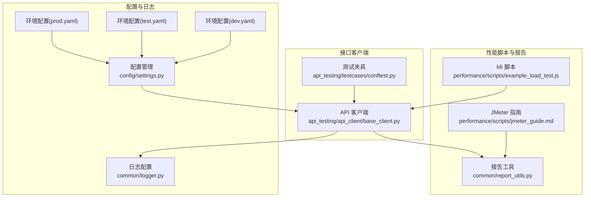
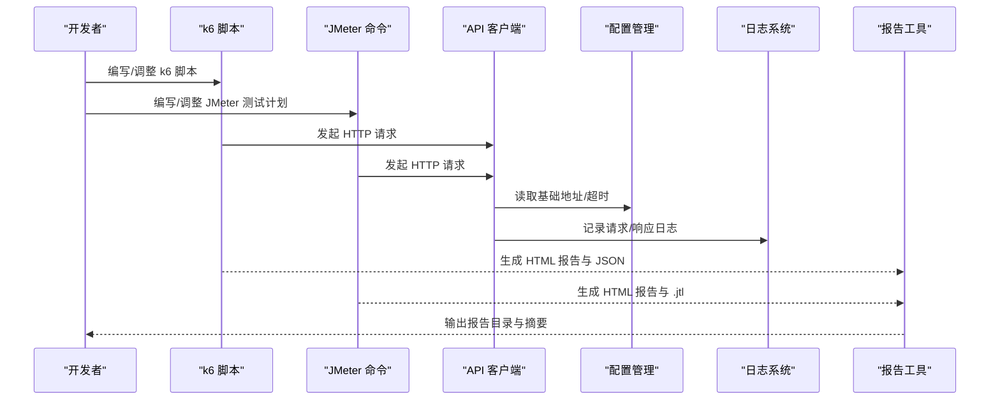
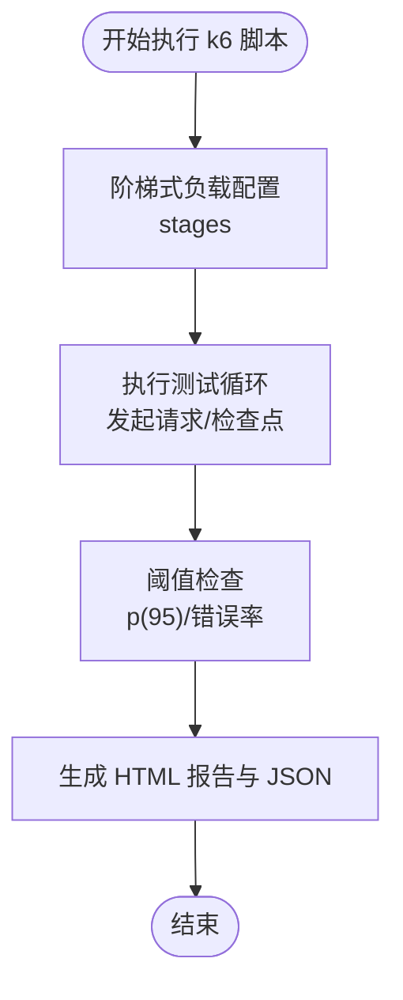
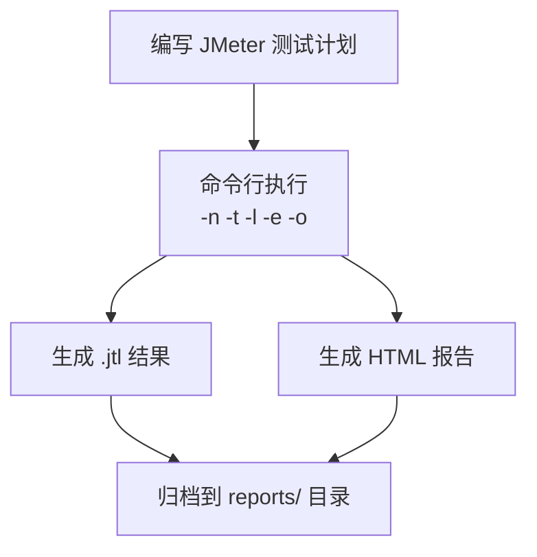
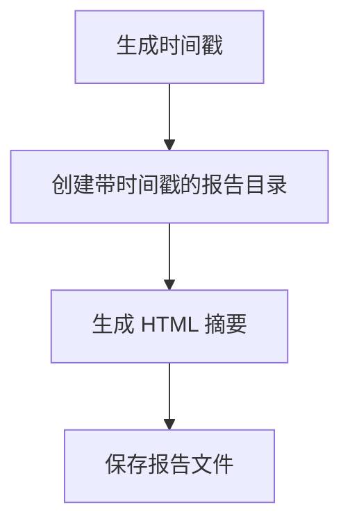
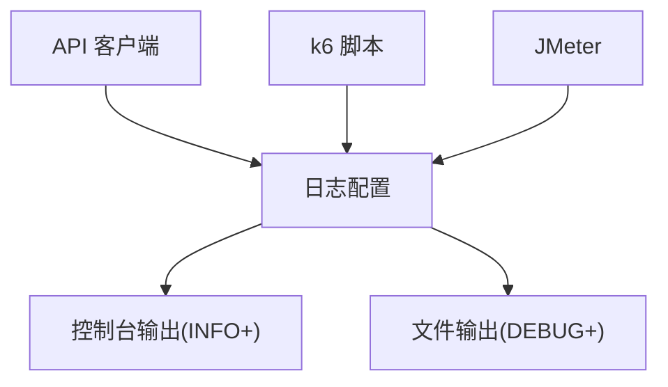
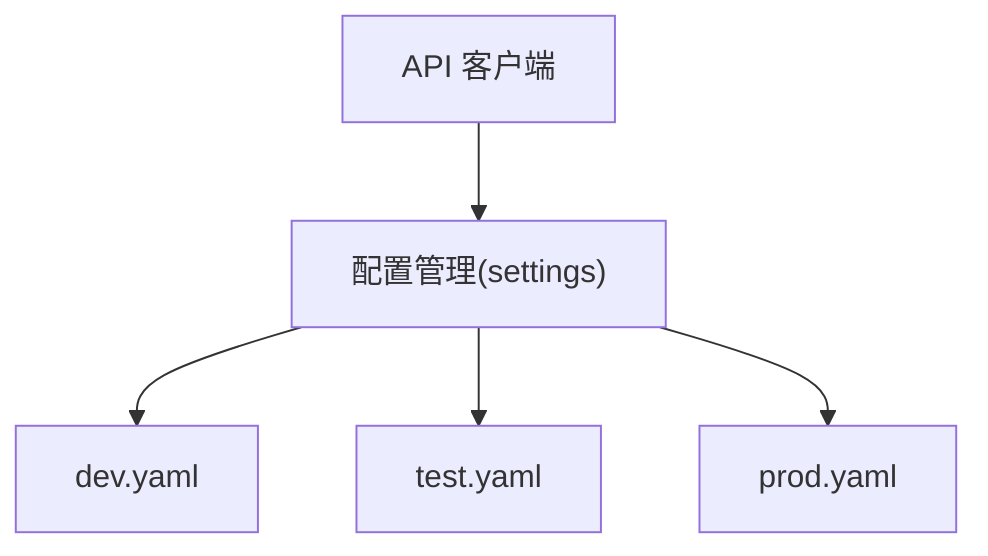
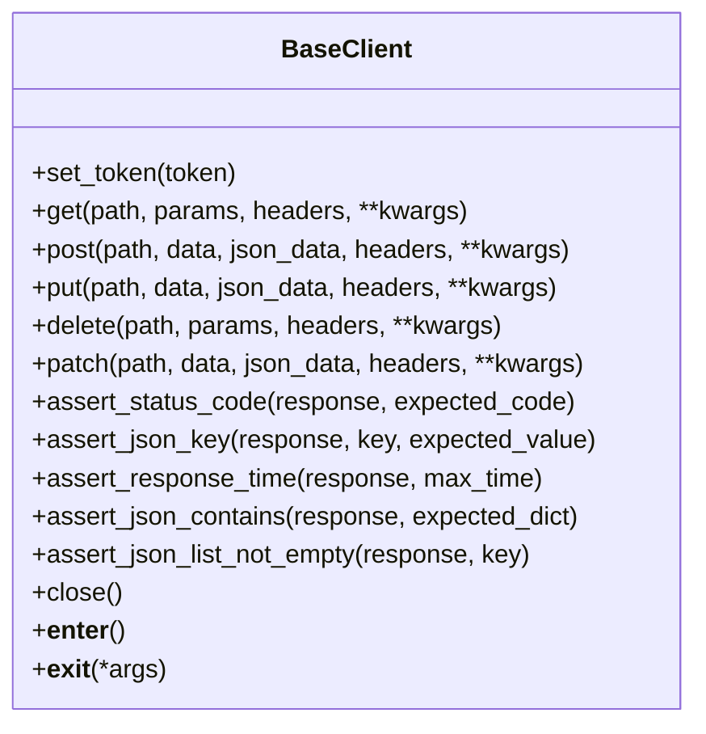
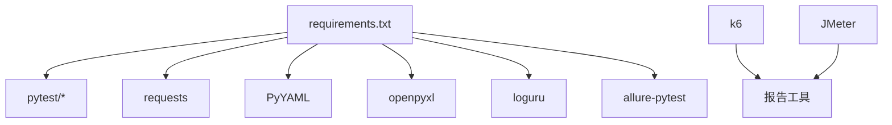

# 性能报告与分析

<cite>
**本文引用的文件**
- [performance/scripts/example_load_test.js](file://performance/scripts/example_load_test.js)
- [performance/scripts/jmeter_guide.md](file://performance/scripts/jmeter_guide.md)
- [common/report_utils.py](file://common/report_utils.py)
- [common/logger.py](file://common/logger.py)
- [config/settings.py](file://config/settings.py)
- [config/environments/dev.yaml](file://config/environments/dev.yaml)
- [config/environments/test.yaml](file://config/environments/test.yaml)
- [config/environments/prod.yaml](file://config/environments/prod.yaml)
- [api_testing/api_client/base_client.py](file://api_testing/api_client/base_client.py)
- [api_testing/testcases/conftest.py](file://api_testing/testcases/conftest.py)
- [requirements.txt](file://requirements.txt)
</cite>

## 目录
1. [引言](#引言)
2. [项目结构](#项目结构)
3. [核心组件](#核心组件)
4. [架构总览](#架构总览)
5. [详细组件分析](#详细组件分析)
6. [依赖分析](#依赖分析)
7. [性能考虑](#性能考虑)
8. [故障排查指南](#故障排查指南)
9. [结论](#结论)
10. [附录](#附录)

## 引言
本文件面向性能报告与分析模块，系统性阐述性能测试结果的采集、分析与可视化方法，涵盖 k6 与 JMeter 的使用范式、HTML 报告与 JSON 数据格式的解读、关键性能指标（如 P95、P99 响应时间）、吞吐量、错误率与资源使用情况的判读要点，并给出基准线设定、趋势分析与瓶颈识别的方法论，以及报告生成配置、自动化报告收集与性能回归测试的实施策略。

## 项目结构
该仓库提供了多类测试能力与基础设施，其中与性能报告与分析直接相关的关键位置如下：
- 性能脚本与报告：performance/scripts/ 下包含 k6 示例脚本与 JMeter 使用指南
- 报告工具：common/report_utils.py 提供时间戳、报告目录创建与简单 HTML 报告片段生成
- 日志：common/logger.py 提供统一日志配置，便于定位性能问题
- 环境配置：config/environments/*.yaml 提供不同环境的基础地址与参数，便于在不同环境执行性能测试
- 接口客户端：api_testing/api_client/base_client.py 提供 HTTP 客户端与断言工具，可用于性能测试中的请求构造与结果校验

**图表来源**
- [performance/scripts/example_load_test.js:1-33](file://performance/scripts/example_load_test.js#L1-L33)
- [performance/scripts/jmeter_guide.md:1-98](file://performance/scripts/jmeter_guide.md#L1-L98)
- [common/report_utils.py:1-143](file://common/report_utils.py#L1-L143)
- [common/logger.py:1-77](file://common/logger.py#L1-L77)
- [config/settings.py:1-104](file://config/settings.py#L1-L104)
- [config/environments/dev.yaml:1-31](file://config/environments/dev.yaml#L1-L31)
- [config/environments/test.yaml:1-31](file://config/environments/test.yaml#L1-L31)
- [config/environments/prod.yaml:1-31](file://config/environments/prod.yaml#L1-L31)
- [api_testing/api_client/base_client.py:1-308](file://api_testing/api_client/base_client.py#L1-L308)
- [api_testing/testcases/conftest.py:1-80](file://api_testing/testcases/conftest.py#L1-L80)

**章节来源**
- [performance/scripts/example_load_test.js:1-33](file://performance/scripts/example_load_test.js#L1-L33)
- [performance/scripts/jmeter_guide.md:1-98](file://performance/scripts/jmeter_guide.md#L1-L98)
- [common/report_utils.py:1-143](file://common/report_utils.py#L1-L143)
- [common/logger.py:1-77](file://common/logger.py#L1-L77)
- [config/settings.py:1-104](file://config/settings.py#L1-L104)
- [config/environments/dev.yaml:1-31](file://config/environments/dev.yaml#L1-L31)
- [config/environments/test.yaml:1-31](file://config/environments/test.yaml#L1-L31)
- [config/environments/prod.yaml:1-31](file://config/environments/prod.yaml#L1-L31)
- [api_testing/api_client/base_client.py:1-308](file://api_testing/api_client/base_client.py#L1-L308)
- [api_testing/testcases/conftest.py:1-80](file://api_testing/testcases/conftest.py#L1-L80)

## 核心组件
- k6 负载脚本：定义阶梯式负载、阈值与检查点，输出 k6 内置 HTML 报告与 JSON 指标
- JMeter 测试计划：通过命令行执行，生成 .jtl 结果与 HTML 报告
- 报告工具：提供时间戳、报告目录创建与简单 HTML 报告摘要
- 日志系统：统一日志输出，便于定位性能异常与资源瓶颈
- 配置管理：按环境切换基础地址与超时等参数，保证测试一致性
- 接口客户端：封装 HTTP 请求、断言与日志，支撑性能测试中的请求构造与结果校验

**章节来源**
- [performance/scripts/example_load_test.js:1-33](file://performance/scripts/example_load_test.js#L1-L33)
- [performance/scripts/jmeter_guide.md:1-98](file://performance/scripts/jmeter_guide.md#L1-L98)
- [common/report_utils.py:1-143](file://common/report_utils.py#L1-L143)
- [common/logger.py:1-77](file://common/logger.py#L1-L77)
- [config/settings.py:1-104](file://config/settings.py#L1-L104)
- [api_testing/api_client/base_client.py:1-308](file://api_testing/api_client/base_client.py#L1-L308)

## 架构总览
下图展示了性能测试从脚本到报告的整体流程，以及与配置、日志和接口客户端的交互关系。

**图表来源**
- [performance/scripts/example_load_test.js:1-33](file://performance/scripts/example_load_test.js#L1-L33)
- [performance/scripts/jmeter_guide.md:1-98](file://performance/scripts/jmeter_guide.md#L1-L98)
- [api_testing/api_client/base_client.py:1-308](file://api_testing/api_client/base_client.py#L1-L308)
- [config/settings.py:1-104](file://config/settings.py#L1-L104)
- [common/logger.py:1-77](file://common/logger.py#L1-L77)
- [common/report_utils.py:1-143](file://common/report_utils.py#L1-L143)

## 详细组件分析

### k6 负载脚本与 HTML 报告
- 脚本结构要点
  - 阶梯式负载：通过 stages 定义逐步提升并发用户数与保持阶段，模拟真实流量爬坡与峰值场景
  - 阈值：通过 thresholds 定义关键指标阈值（如 p(95) 响应时间、错误率），用于判定测试是否通过
  - 检查点：通过 check 对响应状态、响应时间等进行断言
- HTML 报告与 JSON
  - k6 自动生成 HTML 报告，包含时间序列、指标分布与错误详情
  - 可导出 JSON 以便二次分析与集成到 CI/CD
- 关键指标解读
  - P95/P99 响应时间：衡量尾部延迟，P99 更严格，常用于 SLA 对齐
  - 吞吐量：单位时间内完成的请求数，关注与并发数的关系
  - 错误率：http_req_failed 指标，反映稳定性与可用性
  - 资源使用：CPU、内存、网络等由被测系统暴露或外部监控提供

**图表来源**
- [performance/scripts/example_load_test.js:5-19](file://performance/scripts/example_load_test.js#L5-L19)

**章节来源**
- [performance/scripts/example_load_test.js:1-33](file://performance/scripts/example_load_test.js#L1-L33)

### JMeter 测试计划与报告生成
- 脚本存放与命名规范：建议模块名_测试类型_test.jmx，便于分类与检索
- 命令行执行：非 GUI 模式运行，输出 .jtl 结果与 HTML 报告
- 报告输出配置：统一输出到 performance/reports/，建议按日期命名避免覆盖
- 从已有结果生成报告：可单独生成 HTML 报告，便于离线分析
- 注意事项：输出目录必须为空；确保结果文件格式为 CSV；建议报告文件名包含日期

**图表来源**
- [performance/scripts/jmeter_guide.md:19-98](file://performance/scripts/jmeter_guide.md#L19-L98)

**章节来源**
- [performance/scripts/jmeter_guide.md:1-98](file://performance/scripts/jmeter_guide.md#L1-L98)

### 报告工具与目录组织
- 时间戳与目录：提供时间戳生成与带时间戳的报告目录创建，便于历史对比
- 简单 HTML 报告摘要：生成包含用例总数、通过/失败/跳过与通过率的摘要页面
- 适用场景：快速生成测试汇总报告，或作为性能报告的补充摘要

**图表来源**
- [common/report_utils.py:13-65](file://common/report_utils.py#L13-L65)
- [common/report_utils.py:68-122](file://common/report_utils.py#L68-L122)
- [common/report_utils.py:125-142](file://common/report_utils.py#L125-L142)

**章节来源**
- [common/report_utils.py:1-143](file://common/report_utils.py#L1-L143)

### 日志系统与性能问题定位
- 统一日志配置：控制台 INFO 级别以上输出，文件 DEBUG 级别以上按天轮转，保留 7 天
- 性能相关日志：请求/响应日志、耗时、异常信息，有助于定位慢请求与错误根因
- 建议：在性能测试期间开启更详细的日志级别，便于事后分析

**图表来源**
- [common/logger.py:1-77](file://common/logger.py#L1-L77)
- [api_testing/api_client/base_client.py:60-90](file://api_testing/api_client/base_client.py#L60-L90)

**章节来源**
- [common/logger.py:1-77](file://common/logger.py#L1-L77)
- [api_testing/api_client/base_client.py:1-308](file://api_testing/api_client/base_client.py#L1-L308)

### 配置管理与环境隔离
- 环境配置：dev/test/prod 三套环境，分别提供基础地址、账号与超时等参数
- 配置读取：通过 settings 对象按环境读取，便于在不同环境执行性能测试
- 建议：在性能测试中明确选择目标环境，确保测试数据与网络条件一致

**图表来源**
- [config/settings.py:1-104](file://config/settings.py#L1-L104)
- [config/environments/dev.yaml:1-31](file://config/environments/dev.yaml#L1-L31)
- [config/environments/test.yaml:1-31](file://config/environments/test.yaml#L1-L31)
- [config/environments/prod.yaml:1-31](file://config/environments/prod.yaml#L1-L31)
- [api_testing/api_client/base_client.py:21-29](file://api_testing/api_client/base_client.py#L21-L29)

**章节来源**
- [config/settings.py:1-104](file://config/settings.py#L1-L104)
- [config/environments/dev.yaml:1-31](file://config/environments/dev.yaml#L1-L31)
- [config/environments/test.yaml:1-31](file://config/environments/test.yaml#L1-L31)
- [config/environments/prod.yaml:1-31](file://config/environments/prod.yaml#L1-L31)
- [api_testing/api_client/base_client.py:1-308](file://api_testing/api_client/base_client.py#L1-L308)

### 接口客户端与性能测试支撑
- HTTP 请求封装：GET/POST/PUT/DELETE/PATCH 等方法，支持自定义 headers、超时与日志
- 断言工具：状态码、JSON 键、响应时间、JSON 包含等断言，保障性能测试结果的准确性
- 会话管理：基于 requests.Session，减少连接开销，提高性能测试效率

**图表来源**
- [api_testing/api_client/base_client.py:18-308](file://api_testing/api_client/base_client.py#L18-L308)

**章节来源**
- [api_testing/api_client/base_client.py:1-308](file://api_testing/api_client/base_client.py#L1-L308)

## 依赖分析
- 测试框架与工具
  - pytest、pytest-html、pytest-xdist：测试执行与并行
  - requests：HTTP 客户端
  - PyYAML、openpyxl：数据处理
  - loguru：日志
  - allure-pytest：可选报告
- 性能工具
  - k6：负载测试与报告
  - JMeter：负载测试与报告

**图表来源**
- [requirements.txt:1-21](file://requirements.txt#L1-L21)

**章节来源**
- [requirements.txt:1-21](file://requirements.txt#L1-L21)

## 性能考虑
- 指标选择
  - P95/P99 响应时间：关注尾部延迟，适配 SLA
  - 吞吐量：RPS/TPS，评估系统承载能力
  - 错误率：http_req_failed，衡量稳定性
  - 资源使用：CPU/内存/IO/网络，结合外部监控
- 负载设计
  - 阶梯式负载：模拟真实流量爬坡与峰值
  - 并发与持续时间：平衡稳定性与覆盖率
- 环境一致性
  - 明确选择测试环境，避免跨环境差异导致的偏差
- 报告与存储
  - 统一输出目录与命名规范，便于历史对比与趋势分析

## 故障排查指南
- 常见问题
  - 超时/连接错误：检查网络连通性、代理与超时设置
  - 错误率升高：检查上游依赖、缓存与限流策略
  - 报告缺失：确认输出目录权限与命名规范
- 定位手段
  - 查看日志：请求/响应耗时与异常信息
  - 分析报告：时间序列与错误详情
  - 回归测试：对比历史版本指标，识别回归

**章节来源**
- [common/logger.py:1-77](file://common/logger.py#L1-L77)
- [api_testing/api_client/base_client.py:116-133](file://api_testing/api_client/base_client.py#L116-L133)
- [performance/scripts/jmeter_guide.md:84-98](file://performance/scripts/jmeter_guide.md#L84-L98)

## 结论
本文件梳理了仓库中与性能报告与分析相关的能力与实践，包括 k6 与 JMeter 的使用、HTML 报告与 JSON 数据的解读、关键指标的判读方法、基准线与趋势分析、瓶颈识别与自动化回归策略。建议在团队内统一脚本命名、报告输出与环境配置，形成可复用的性能测试流水线。

## 附录
- 方法论与最佳实践
  - 设定基准线：在稳定版本上采集 P95/P99、吞吐量与错误率，形成基线
  - 趋势分析：按日期归档报告，绘制指标随版本变化的趋势
  - 瓶颈识别：结合响应时间分布、错误率与资源使用，定位 CPU/IO/网络瓶颈
  - 回归测试：在 CI 中集成性能阈值检查，阻断不达标的变更
- 自动化与集成
  - 脚本与报告：统一脚本与报告目录，按日期命名
  - 执行策略：在 CI 中按环境执行，输出报告并归档
  - 结果展示：结合 HTML 报告与 JSON 指标，形成可读的性能报告