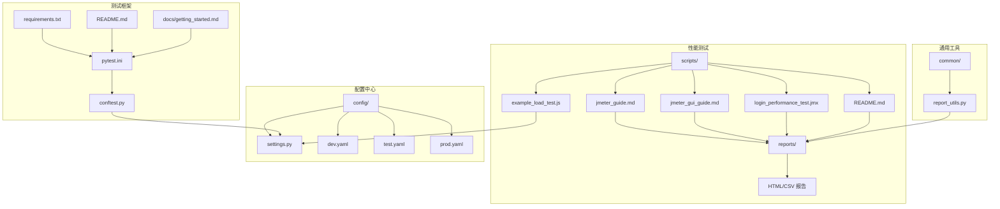
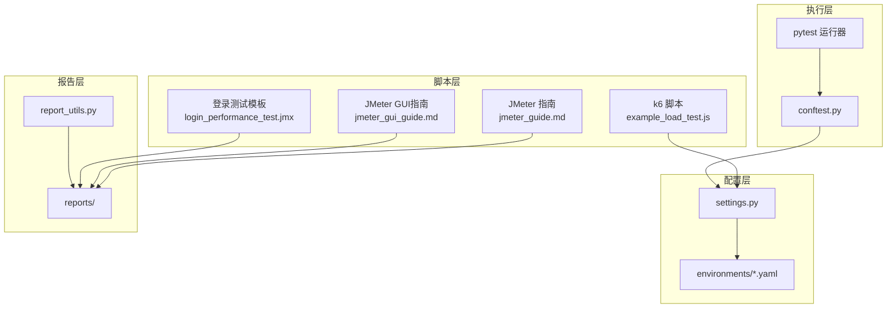
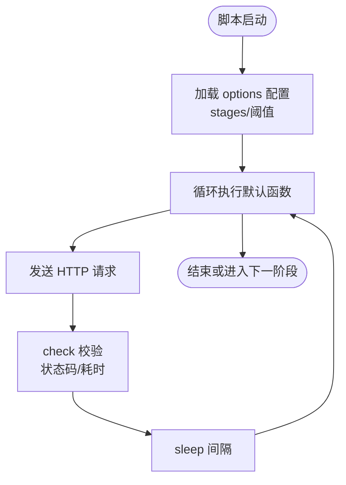
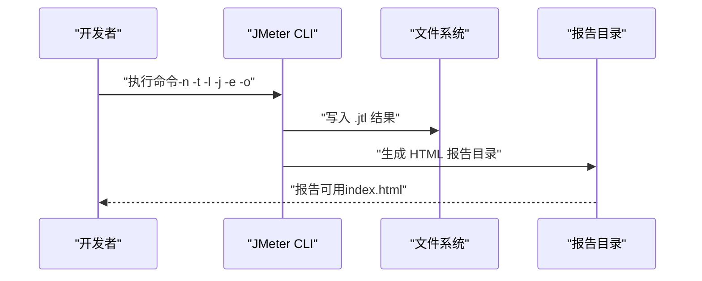
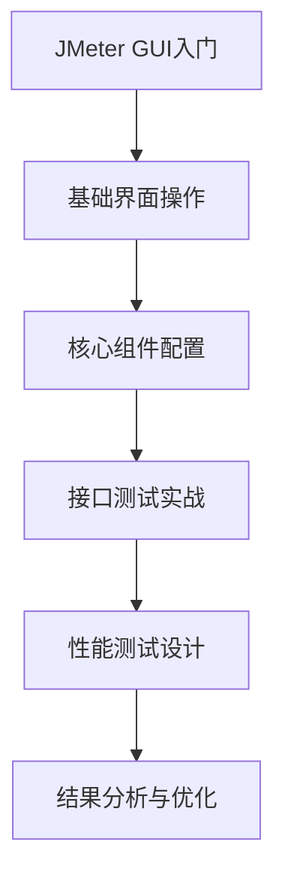
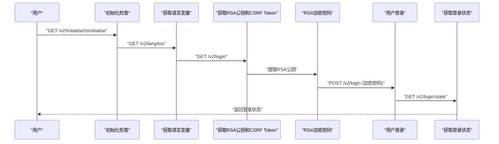
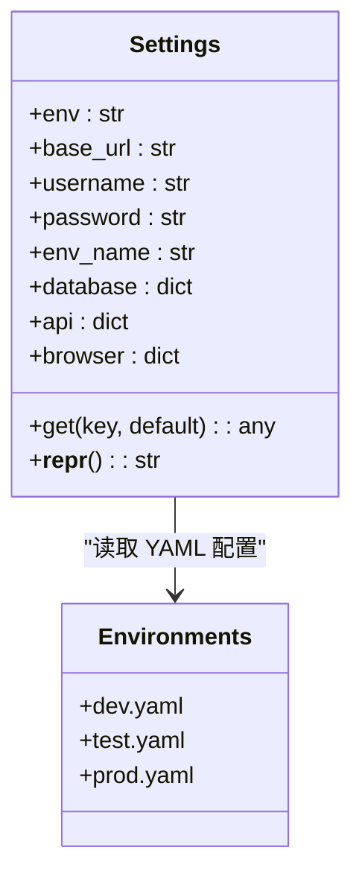
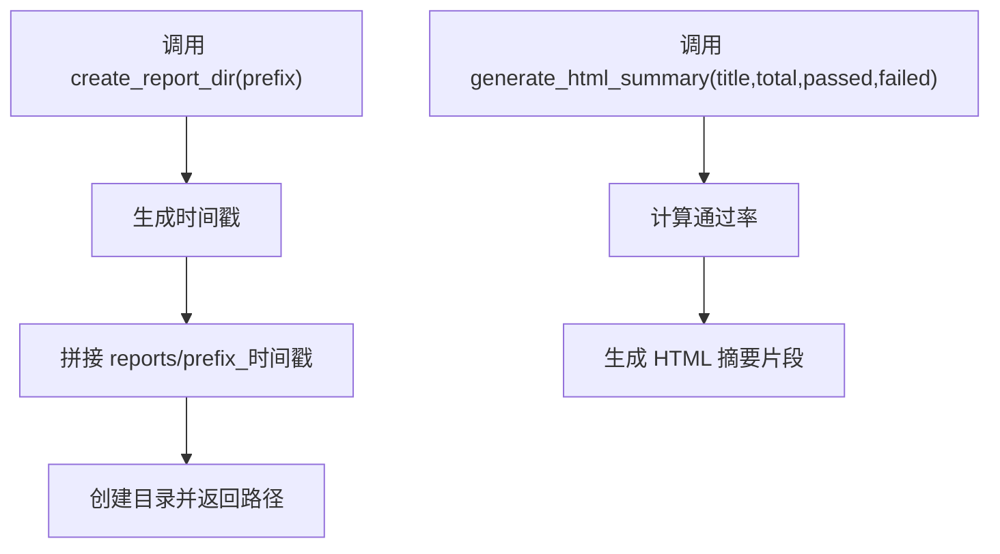
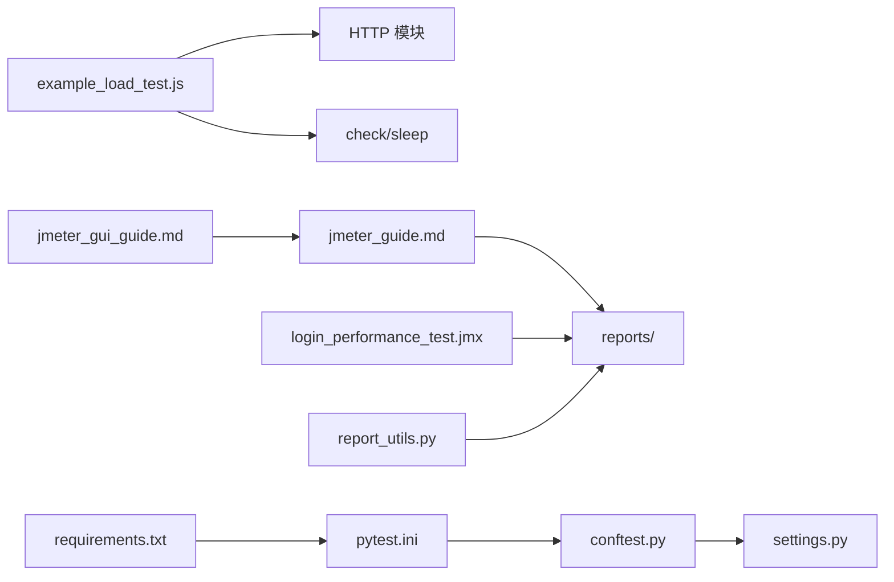

# 性能测试框架

<cite>
**本文引用的文件**   
- [performance/scripts/example_load_test.js](file://performance/scripts/example_load_test.js)
- [performance/scripts/jmeter_guide.md](file://performance/scripts/jmeter_guide.md)
- [performance/scripts/jmeter_gui_guide.md](file://performance/scripts/jmeter_gui_guide.md)
- [performance/scripts/login_performance_test.jmx](file://performance/scripts/login_performance_test.jmx)
- [performance/scripts/README.md](file://performance/scripts/README.md)
- [config/settings.py](file://config/settings.py)
- [config/environments/dev.yaml](file://config/environments/dev.yaml)
- [config/environments/test.yaml](file://config/environments/test.yaml)
- [config/environments/prod.yaml](file://config/environments/prod.yaml)
- [common/report_utils.py](file://common/report_utils.py)
- [pytest.ini](file://pytest.ini)
- [conftest.py](file://conftest.py)
- [requirements.txt](file://requirements.txt)
- [README.md](file://README.md)
- [docs/getting_started.md](file://docs/getting_started.md)
</cite>

## 更新摘要
**变更内容**   
- 新增JMeter GUI完整入门指南章节，提供从基础到高级的完整学习路径
- 新增登录性能测试脚本模板，包含完整的认证流程和最佳实践
- 扩展JMeter集成指南，增加GUI操作指导和性能测试方法
- 完善性能测试脚本库，提供可复用的测试模板

## 目录
1. [引言](#引言)
2. [项目结构](#项目结构)
3. [核心组件](#核心组件)
4. [架构总览](#架构总览)
5. [详细组件分析](#详细组件分析)
6. [依赖分析](#依赖分析)
7. [性能考虑](#性能考虑)
8. [故障排查指南](#故障排查指南)
9. [结论](#结论)
10. [附录](#附录)

## 引言
本文件面向性能测试框架，系统性阐述 k6 与 JMeter 的集成配置、负载测试脚本编写与性能指标分析方法；深入解析示例脚本 example_load_test.js 的结构、测试场景设计与参数配置；提供 JMeter 集成指南、性能测试最佳实践与报告生成流程；并给出性能基准测试、压力测试与容量规划的完整方案，帮助团队建立可复用、可追溯、可扩展的性能测试体系。

**更新** 新增JMeter GUI完整入门指南和登录性能测试脚本模板，扩展了原有的k6负载测试能力，提供了更全面的性能测试解决方案。

## 项目结构
该仓库是一个多模块测试自动化工作区，性能测试位于 performance/scripts 与 performance/reports 目录，结合配置中心 config 与通用工具 common，形成"脚本-配置-报告"的闭环。

**图表来源**
- [performance/scripts/README.md:1-219](file://performance/scripts/README.md#L1-L219)
- [performance/scripts/jmeter_guide.md:1-98](file://performance/scripts/jmeter_guide.md#L1-L98)
- [performance/scripts/jmeter_gui_guide.md:1-484](file://performance/scripts/jmeter_gui_guide.md#L1-L484)
- [performance/scripts/login_performance_test.jmx:1-431](file://performance/scripts/login_performance_test.jmx#L1-L431)
- [config/settings.py:1-104](file://config/settings.py#L1-L104)
- [config/environments/test.yaml:1-31](file://config/environments/test.yaml#L1-L31)
- [common/report_utils.py:1-143](file://common/report_utils.py#L1-L143)
- [pytest.ini:1-12](file://pytest.ini#L1-L12)
- [conftest.py:1-122](file://conftest.py#L1-L122)
- [requirements.txt:1-21](file://requirements.txt#L1-L21)
- [README.md:1-123](file://README.md#L1-L123)
- [docs/getting_started.md:1-91](file://docs/getting_started.md#L1-L91)

**章节来源**
- [README.md:31-43](file://README.md#L31-L43)
- [performance/scripts/README.md:7-16](file://performance/scripts/README.md#L7-L16)

## 核心组件
- k6 负载测试脚本：提供阶梯式负载、阈值与功能校验，示例脚本位于 performance/scripts/example_load_test.js。
- JMeter 使用指南：提供脚本存放规范、命令行执行、报告生成与参数覆盖说明，位于 performance/scripts/jmeter_guide.md。
- **新增** JMeter GUI完整入门指南：提供从基础到高级的完整学习路径，涵盖界面操作、核心概念、接口测试和性能测试方法，位于 performance/scripts/jmeter_gui_guide.md。
- **新增** 登录性能测试脚本模板：包含完整的认证流程（登录→获取Token→带Token请求业务接口），位于 performance/scripts/login_performance_test.jmx。
- 配置中心：集中管理多环境配置，支持通过环境变量切换，供性能脚本与测试框架共享，位于 config/settings.py 与 config/environments/*.yaml。
- 报告工具：提供时间戳生成、报告目录创建与简单 HTML 报告片段生成，位于 common/report_utils.py。
- 测试框架与运行入口：pytest.ini 定义测试路径与 HTML 报告输出，conftest.py 提供 UI 自动化与失败截图钩子，requirements.txt 管理依赖。

**更新** 新增JMeter GUI完整入门指南和登录性能测试脚本模板，扩展了性能测试工具链的覆盖面。

**章节来源**
- [performance/scripts/example_load_test.js:1-33](file://performance/scripts/example_load_test.js#L1-L33)
- [performance/scripts/jmeter_guide.md:1-98](file://performance/scripts/jmeter_guide.md#L1-L98)
- [performance/scripts/jmeter_gui_guide.md:1-484](file://performance/scripts/jmeter_gui_guide.md#L1-L484)
- [performance/scripts/login_performance_test.jmx:1-431](file://performance/scripts/login_performance_test.jmx#L1-L431)
- [config/settings.py:13-104](file://config/settings.py#L13-L104)
- [common/report_utils.py:13-143](file://common/report_utils.py#L13-L143)
- [pytest.ini:1-12](file://pytest.ini#L1-L12)
- [conftest.py:25-78](file://conftest.py#L25-L78)
- [requirements.txt:1-21](file://requirements.txt#L1-L21)

## 架构总览
性能测试整体架构围绕"脚本-配置-执行-报告"展开，k6 与 JMeter 分别作为两类主流性能测试工具，统一接入项目目录结构与报告输出规范。

**图表来源**
- [performance/scripts/example_load_test.js:1-33](file://performance/scripts/example_load_test.js#L1-L33)
- [performance/scripts/jmeter_guide.md:1-98](file://performance/scripts/jmeter_guide.md#L1-L98)
- [performance/scripts/jmeter_gui_guide.md:1-484](file://performance/scripts/jmeter_gui_guide.md#L1-L484)
- [performance/scripts/login_performance_test.jmx:1-431](file://performance/scripts/login_performance_test.jmx#L1-L431)
- [config/settings.py:13-104](file://config/settings.py#L13-L104)
- [config/environments/test.yaml:1-31](file://config/environments/test.yaml#L1-L31)
- [common/report_utils.py:42-66](file://common/report_utils.py#L42-L66)
- [pytest.ini:1-12](file://pytest.ini#L1-L12)
- [conftest.py:25-78](file://conftest.py#L25-L78)

## 详细组件分析

### k6 负载测试脚本：example_load_test.js
- 测试配置（options）
  - 阶梯式负载：通过 stages 定义多个阶段，逐步提升并发用户数并维持一段时间，最后降级回零，适合压力测试与退坡评估。
  - 阈值：通过 thresholds 定义关键指标阈值，如 p95 响应时间与失败率，决定测试通过与否。
- 测试逻辑（export default function）
  - 发送 HTTP 请求到目标接口，使用 check 对响应状态与耗时进行功能校验。
  - 使用 sleep 控制每个迭代之间的思考时间，模拟真实用户行为。
- 参数与扩展
  - 可通过命令行覆盖脚本中的 vus/duration/stages 等配置，便于快速调整负载曲线。
  - 可通过 --out 输出 JSON/CSV，便于后续自动化分析与报告生成。

**图表来源**
- [performance/scripts/example_load_test.js:5-19](file://performance/scripts/example_load_test.js#L5-L19)
- [performance/scripts/example_load_test.js:22-32](file://performance/scripts/example_load_test.js#L22-L32)

**章节来源**
- [performance/scripts/example_load_test.js:1-33](file://performance/scripts/example_load_test.js#L1-L33)
- [performance/scripts/README.md:162-174](file://performance/scripts/README.md#L162-L174)
- [performance/scripts/README.md:176-190](file://performance/scripts/README.md#L176-L190)

### JMeter 集成指南
- 脚本存放与命名规范：将 .jmx 文件放入 performance/scripts/，建议模块名+测试类型命名，便于分类与检索。
- 命令行执行：使用 -n 非 GUI 模式运行，-t 指定测试计划，-l 指定结果日志，-j 指定引擎日志，-e 与 -o 生成并输出 HTML 报告。
- 参数覆盖：通过 -Jthreads/-Jrampup/-Jloops 在命令行覆盖属性，脚本中使用 ${__P(...)} 引用。
- 报告输出：统一输出到 performance/reports/，建议按模块与日期命名，避免覆盖历史数据；-o 目录必须为空。
- 从已有结果生成报告：使用 -g 指定 .jtl 文件生成 HTML 报告。

**图表来源**
- [performance/scripts/jmeter_guide.md:23-49](file://performance/scripts/jmeter_guide.md#L23-L49)
- [performance/scripts/jmeter_guide.md:84-90](file://performance/scripts/jmeter_guide.md#L84-L90)

**章节来源**
- [performance/scripts/jmeter_guide.md:1-98](file://performance/scripts/jmeter_guide.md#L1-L98)

### **新增** JMeter GUI完整入门指南
- **学习路径**：从基础界面操作到高级性能测试，提供循序渐进的学习路径
- **核心概念**：详细解释测试计划、线程组、取样器、断言、监听器等核心组件
- **接口测试**：包含HTTP请求配置、请求头管理、Cookie管理、参数化方法、关联提取等
- **性能测试**：涵盖性能测试类型、阶梯式加压、关键指标、测试流程等
- **实用插件**：推荐Custom Thread Groups、PerfMon、Throughput Shaping Timer等插件
- **最佳实践**：包含GUI vs 命令行、内存调优、分布式测试等实践经验

**图表来源**
- [performance/scripts/jmeter_gui_guide.md:29-84](file://performance/scripts/jmeter_gui_guide.md#L29-L84)
- [performance/scripts/jmeter_gui_guide.md:207-222](file://performance/scripts/jmeter_gui_guide.md#L207-L222)

**章节来源**
- [performance/scripts/jmeter_gui_guide.md:1-484](file://performance/scripts/jmeter_gui_guide.md#L1-L484)

### **新增** 登录性能测试脚本模板
- **完整认证流程**：包含登录获取Token→带Token请求业务接口的典型性能测试场景
- **配置管理**：使用用户定义变量管理BASE_URL、PROTOCOL、PORT等配置
- **HTTP配置**：设置HTTP请求默认值、全局Header管理器
- **认证机制**：通过JSON提取器从登录响应中提取token，然后在后续请求中使用
- **断言验证**：包含响应断言和JSON断言，确保接口正确性
- **监听器配置**：包含聚合报告、查看结果树、简单数据写入器等
- **报告输出**：统一输出到reports目录，便于后续分析
- **RSA公钥获取**：通过正则表达式提取响应头中的RSA公钥
- **CSRF令牌处理**：支持响应头和Cookie两种CSRF令牌获取方式
- **密码加密**：使用Groovy脚本实现RSA公钥加密
- **登录状态验证**：验证登录状态接口的正确性

**图表来源**
- [performance/scripts/login_performance_test.jmx:75-314](file://performance/scripts/login_performance_test.jmx#L75-L314)

**章节来源**
- [performance/scripts/login_performance_test.jmx:1-431](file://performance/scripts/login_performance_test.jmx#L1-L431)

### 配置中心：settings 与多环境
- settings 类提供统一配置访问能力，支持通过环境变量 TEST_ENV 切换 dev/test/prod，内部读取 config/environments/<env>.yaml。
- 常用配置键包括 base_url、username/password、database、api、browser 等，供性能脚本与 UI 自动化共享。
- 环境配置文件示例：dev.yaml/test.yaml/prod.yaml，分别定义不同环境的基础 URL、账号、数据库与浏览器参数。

**图表来源**
- [config/settings.py:13-104](file://config/settings.py#L13-L104)
- [config/environments/dev.yaml:1-31](file://config/environments/dev.yaml#L1-L31)
- [config/environments/test.yaml:1-31](file://config/environments/test.yaml#L1-L31)
- [config/environments/prod.yaml:1-31](file://config/environments/prod.yaml#L1-L31)

**章节来源**
- [config/settings.py:13-104](file://config/settings.py#L13-L104)
- [config/environments/dev.yaml:1-31](file://config/environments/dev.yaml#L1-L31)
- [config/environments/test.yaml:1-31](file://config/environments/test.yaml#L1-L31)
- [config/environments/prod.yaml:1-31](file://config/environments/prod.yaml#L1-L31)

### 报告生成工具：report_utils
- 时间戳生成：支持自定义格式，便于报告命名与排序。
- 目录创建：按前缀与时间戳创建唯一报告目录，避免覆盖。
- HTML 报告片段：生成包含用例总数、通过/失败/跳过与通过率的 HTML 摘要，便于快速审阅。

**图表来源**
- [common/report_utils.py:42-66](file://common/report_utils.py#L42-L66)
- [common/report_utils.py:68-122](file://common/report_utils.py#L68-L122)

**章节来源**
- [common/report_utils.py:13-143](file://common/report_utils.py#L13-L143)

### 测试框架与运行入口
- pytest.ini：定义测试路径、HTML 报告输出与自定义标记（smoke/regression/api/ui），便于分层执行与报告聚合。
- conftest.py：提供 WebDriver fixture、base_url fixture 与失败截图钩子，统一 UI 自动化测试体验。
- requirements.txt：声明 pytest、pytest-html、pytest-xdist、selenium、requests、PyYAML、openpyxl、loguru、allure-pytest 等依赖。

**章节来源**
- [pytest.ini:1-12](file://pytest.ini#L1-L12)
- [conftest.py:25-78](file://conftest.py#L25-L78)
- [requirements.txt:1-21](file://requirements.txt#L1-L21)

## 依赖分析
- 组件耦合
  - k6 脚本通过 HTTP 模块与 check/sleep 执行测试逻辑，与配置中心解耦，便于替换目标接口。
  - JMeter 指南与报告目录强关联，遵循统一输出规范。
  - **新增** JMeter GUI指南与登录模板相互补充，提供从入门到实践的完整路径。
  - report_utils 与 reports 目录耦合，提供目录创建与 HTML 片段生成。
  - pytest 与 conftest 为 UI 自动化提供浏览器生命周期与失败截图，与性能测试并行存在。
- 外部依赖
  - k6 与 JMeter 作为独立工具，通过命令行集成到项目。
  - Python 依赖由 requirements.txt 管理，pytest 作为统一入口协调各模块。

**图表来源**
- [performance/scripts/example_load_test.js:1-33](file://performance/scripts/example_load_test.js#L1-L33)
- [performance/scripts/jmeter_guide.md:1-98](file://performance/scripts/jmeter_guide.md#L1-L98)
- [performance/scripts/jmeter_gui_guide.md:1-484](file://performance/scripts/jmeter_gui_guide.md#L1-L484)
- [performance/scripts/login_performance_test.jmx:1-431](file://performance/scripts/login_performance_test.jmx#L1-L431)
- [common/report_utils.py:42-66](file://common/report_utils.py#L42-L66)
- [pytest.ini:1-12](file://pytest.ini#L1-L12)
- [conftest.py:25-78](file://conftest.py#L25-L78)
- [requirements.txt:1-21](file://requirements.txt#L1-L21)

**章节来源**
- [requirements.txt:1-21](file://requirements.txt#L1-L21)
- [pytest.ini:1-12](file://pytest.ini#L1-L12)
- [conftest.py:25-78](file://conftest.py#L25-L78)

## 性能考虑
- 负载策略
  - 阶梯式负载：逐步加压，观察系统拐点；建议在关键节点（如 P95/P99）与错误率上设置阈值。
  - 持续时间与并发比：根据业务峰值与 SLA 设定 vus/duration/stages，避免过短导致抖动过大。
- 指标关注
  - 响应时间：关注 avg/p90/p95/p99；结合业务 SLA 设定阈值。
  - 吞吐量：http_reqs/每秒请求数，评估系统承载能力。
  - 错误率：http_req_failed，严格控制在可接受范围。
- 资源监控
  - CPU/内存/IO/网络：与性能测试同步采集，定位瓶颈（应用、数据库、缓存、网络）。
  - 容器/进程：针对容器化部署，关注容器指标与资源配额。
- 报告与归档
  - 统一输出到 reports/，按模块与日期命名，便于对比与回溯。
  - 结合 JSON/CSV 导出，自动化分析与可视化。

**更新** 新增JMeter GUI指南和登录模板后，建议在实际落地中结合多种工具的优势，k6用于快速验证和持续集成，JMeter GUI用于复杂场景设计和深度分析。

[本节为通用指导，无需具体文件分析]

## 故障排查指南
- k6 执行问题
  - 网络连通性：确认目标接口可达与证书配置；必要时在脚本中增加重试与超时。
  - 阈值触发：若频繁失败，检查阈值是否过于严苛，适当放宽或优化被测接口。
  - 资源限制：k6 进程占用过高时，降低并发或缩短持续时间，观察系统资源曲线。
- JMeter 执行问题
  - -o 目录为空：确保输出目录不存在或为空，避免覆盖错误。
  - 结果文件格式：确保 jmeter.properties 中输出格式为 CSV，以便后续分析。
  - 参数覆盖：命令行 -J 参数需与脚本中的 ${__P(...)} 引用一致。
  - **新增** GUI内存问题：GUI模式下内存消耗较大，建议使用命令行模式进行正式测试。
  - **新增** 登录脚本问题：RSA公钥获取失败时，检查响应头格式；CSRF令牌缺失时，检查Cookie设置。
- 报告生成问题
  - HTML 报告缺失：确认 -e/-o 参数正确且目录权限允许写入。
  - 历史报告覆盖：按日期命名，避免覆盖。
- 配置问题
  - 环境切换：确认 TEST_ENV 环境变量与 config/environments/* 对应。
  - base_url 不一致：核对 settings.base_url 与脚本中硬编码地址的一致性。

**更新** 新增JMeter GUI相关的故障排查指导和登录脚本特有的问题排查。

**章节来源**
- [performance/scripts/jmeter_guide.md:92-98](file://performance/scripts/jmeter_guide.md#L92-L98)
- [config/settings.py:37-48](file://config/settings.py#L37-L48)

## 结论
本性能测试框架通过清晰的目录结构、统一的配置中心与报告工具，实现了 k6 与 JMeter 的无缝集成。示例脚本与指南明确了负载设计、阈值设定与报告生成流程。**新增的JMeter GUI完整入门指南和登录性能测试模板**进一步扩展了工具链的覆盖面，为不同技能水平的测试人员提供了从基础到高级的完整学习路径。建议在实际落地中，结合业务 SLA 建立基线，持续监控资源指标，完善瓶颈识别与优化闭环，并将性能测试纳入 CI/CD，保障系统质量与稳定性。

**更新** 新增的JMeter GUI指南和登录模板显著增强了框架的实用性，提供了更全面的性能测试解决方案。

[本节为总结，无需具体文件分析]

## 附录

### A. k6 脚本编写要点
- 阶梯式负载：合理划分阶段时长与目标并发，观察系统在不同负载下的表现。
- 阈值设计：基于业务 SLA 设定 p95 响应时间与错误率上限。
- 功能校验：使用 check 对关键断言进行验证，确保性能与正确性并重。
- 输出导出：通过 --out 导出 JSON/CSV，便于自动化分析与报告生成。

**章节来源**
- [performance/scripts/README.md:162-190](file://performance/scripts/README.md#L162-L190)
- [performance/scripts/example_load_test.js:5-19](file://performance/scripts/example_load_test.js#L5-L19)

### **新增** B. JMeter GUI学习路径与最佳实践
- **学习路径**：从基础界面操作（菜单栏、工具栏、测试计划树）到核心概念理解（线程组、取样器、断言、监听器）
- **接口测试**：掌握HTTP请求配置、参数化、关联提取、断言验证等核心技术
- **性能测试**：学会设计阶梯式加压、监控关键指标、分析性能瓶颈
- **实用技巧**：合理使用插件、内存调优、分布式测试等高级功能
- **报告分析**：通过聚合报告、图形结果等工具进行深度分析

**章节来源**
- [performance/scripts/jmeter_gui_guide.md:1-484](file://performance/scripts/jmeter_gui_guide.md#L1-L484)

### **新增** C. 登录性能测试模板使用指南
- **模板结构**：包含用户定义变量、线程组、HTTP请求默认值、认证流程、断言验证、监听器配置
- **配置管理**：使用用户定义变量管理环境配置，便于跨环境迁移
- **认证流程**：通过JSON提取器实现Token自动提取和传递
- **断言策略**：结合响应断言和JSON断言确保接口正确性
- **报告输出**：统一输出到reports目录，便于后续分析和归档
- **安全处理**：RSA公钥获取、CSRF令牌处理、密码加密的完整流程
- **调试建议**：查看结果树监听器用于调试，正式测试时禁用以避免内存消耗

**章节来源**
- [performance/scripts/login_performance_test.jmx:1-431](file://performance/scripts/login_performance_test.jmx#L1-L431)

### D. JMeter 脚本与报告最佳实践
- 脚本命名：模块名+测试类型，便于分类与检索。
- 命令行执行：非 GUI 模式，减少资源消耗，提高准确性。
- 报告输出：统一到 reports/，按模块与日期命名，避免覆盖。
- 参数覆盖：通过 -J 在命令行覆盖属性，脚本中使用 ${__P(...)} 引用。

**章节来源**
- [performance/scripts/jmeter_guide.md:3-16](file://performance/scripts/jmeter_guide.md#L3-L16)
- [performance/scripts/jmeter_guide.md:23-49](file://performance/scripts/jmeter_guide.md#L23-L49)
- [performance/scripts/jmeter_guide.md:84-90](file://performance/scripts/jmeter_guide.md#L84-L90)

### E. 性能测试规划与执行清单
- 规划阶段
  - 明确 SLA 与基线：P95 响应时间、错误率、吞吐量目标。
  - 选择测试类型：基准测试（建立基线）、压力测试（寻找拐点）、容量规划（预测扩容）。
- 执行阶段
  - 环境隔离：独立测试环境，避免对生产造成影响。
  - 资源监控：同步采集 CPU/内存/IO/网络等指标。
  - 多轮验证：重复执行，消除偶发因素影响。
- 分析与优化
  - 指标对比：与基线对比，识别回归与改进点。
  - 瓶颈定位：结合资源曲线与日志，定位应用/数据库/缓存/网络瓶颈。
  - 优化闭环：修复问题后重新测试，形成持续优化。

**更新** 新增JMeter GUI指南和登录模板后，建议在规划阶段考虑工具选择：k6适合快速验证和持续集成，JMeter GUI适合复杂场景设计和深度分析。

[本节为通用指导，无需具体文件分析]