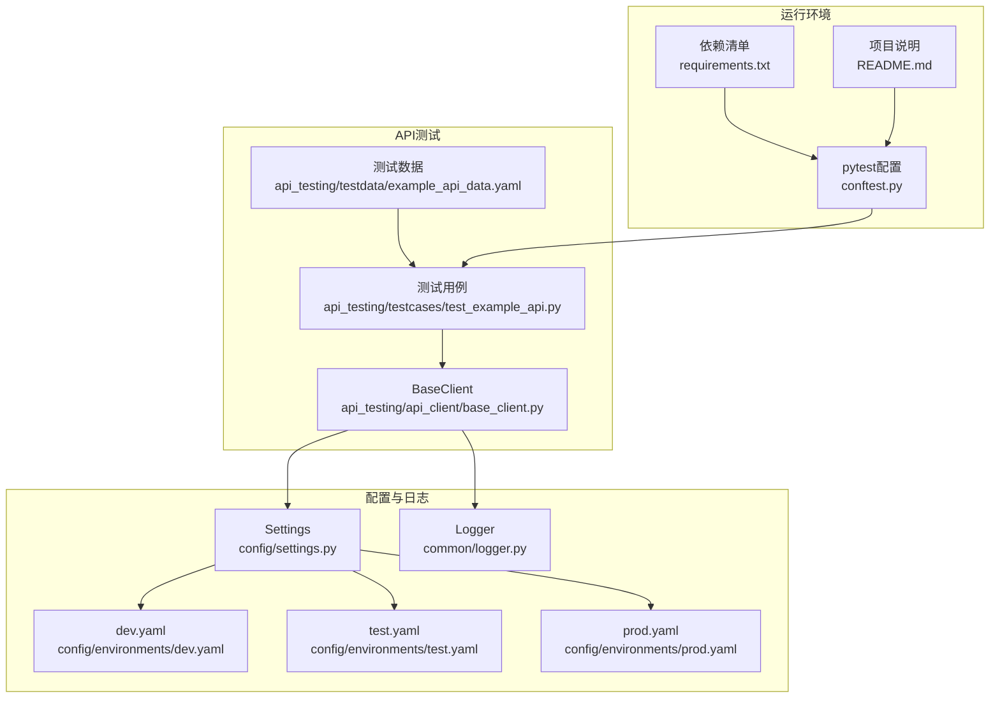
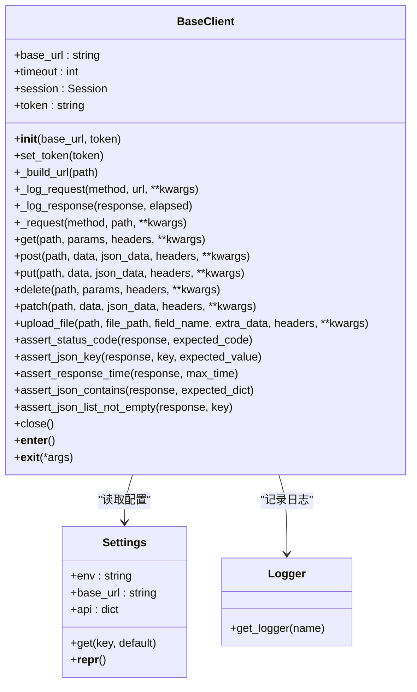
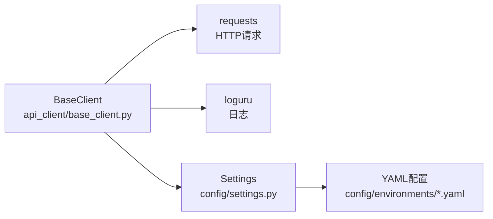
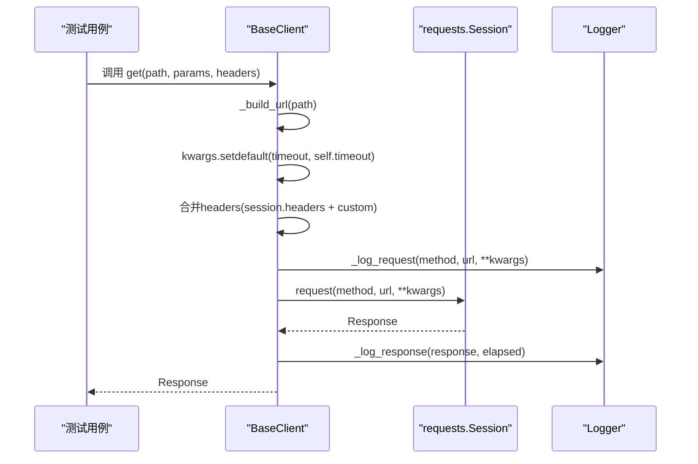
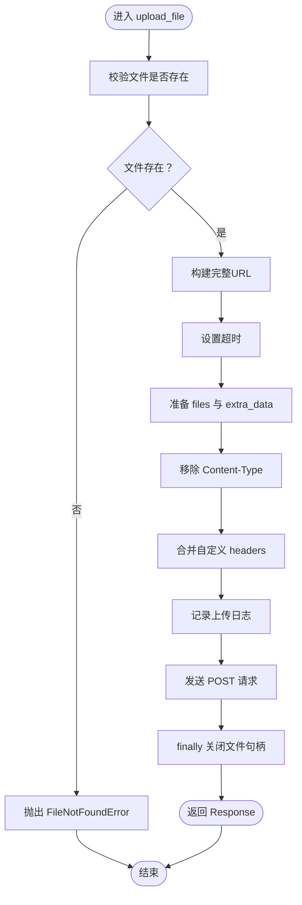

# HTTP客户端设计

<cite>
**本文引用的文件**
- [api_client/base_client.py](file://api_testing/api_client/base_client.py)
- [config/settings.py](file://config/settings.py)
- [config/environments/dev.yaml](file://config/environments/dev.yaml)
- [config/environments/test.yaml](file://config/environments/test.yaml)
- [config/environments/prod.yaml](file://config/environments/prod.yaml)
- [common/logger.py](file://common/logger.py)
- [api_testing/testcases/test_example_api.py](file://api_testing/testcases/test_example_api.py)
- [api_testing/testdata/example_api_data.yaml](file://api_testing/testdata/example_api_data.yaml)
- [conftest.py](file://conftest.py)
- [requirements.txt](file://requirements.txt)
- [README.md](file://README.md)
</cite>

## 目录
1. [引言](#引言)
2. [项目结构](#项目结构)
3. [核心组件](#核心组件)
4. [架构总览](#架构总览)
5. [详细组件分析](#详细组件分析)
6. [依赖分析](#依赖分析)
7. [性能考虑](#性能考虑)
8. [故障排查指南](#故障排查指南)
9. [结论](#结论)
10. [附录](#附录)

## 引言
本技术文档围绕HTTP客户端设计展开，重点剖析BaseClient基类的整体架构与实现细节，包括Session管理、URL构建、请求头处理、超时配置、Token认证、断言辅助方法以及文件上传功能。文档同时给出初始化过程中base_url与timeout参数的处理流程、默认headers的设置机制、各HTTP方法的参数传递方式、multipart/form-data上传流程与自定义headers合并策略，并提供完整的使用示例与最佳实践指导，帮助读者快速上手并高效扩展。

## 项目结构
该项目采用模块化组织，API客户端位于api_testing/api_client/，配置管理位于config/，日志统一由common/logger.py提供，测试用例位于api_testing/testcases/，测试数据位于api_testing/testdata/。整体结构清晰，职责分离明确，便于维护与扩展。

图表来源
- [api_client/base_client.py:1-308](file://api_testing/api_client/base_client.py#L1-L308)
- [config/settings.py:1-104](file://config/settings.py#L1-L104)
- [config/environments/dev.yaml:1-31](file://config/environments/dev.yaml#L1-L31)
- [config/environments/test.yaml:1-31](file://config/environments/test.yaml#L1-L31)
- [config/environments/prod.yaml:1-31](file://config/environments/prod.yaml#L1-L31)
- [common/logger.py:1-77](file://common/logger.py#L1-L77)
- [api_testing/testcases/test_example_api.py:1-167](file://api_testing/testcases/test_example_api.py#L1-L167)
- [api_testing/testdata/example_api_data.yaml:1-116](file://api_testing/testdata/example_api_data.yaml#L1-L116)
- [conftest.py:1-122](file://conftest.py#L1-L122)
- [requirements.txt:1-21](file://requirements.txt#L1-L21)
- [README.md:1-123](file://README.md#L1-L123)

章节来源
- [README.md:1-123](file://README.md#L1-L123)

## 核心组件
- BaseClient：封装HTTP请求方法、Session管理、URL构建、请求/响应日志、断言辅助方法、文件上传与资源生命周期管理。
- Settings：集中管理多环境配置，提供base_url、timeout等配置项的读取与默认值。
- Logger：基于loguru的日志系统，统一输出格式与文件轮转策略。
- 测试用例与数据：示例测试用例与接口测试数据模板，展示BaseClient的典型用法与断言实践。

章节来源
- [api_client/base_client.py:18-308](file://api_testing/api_client/base_client.py#L18-L308)
- [config/settings.py:13-104](file://config/settings.py#L13-L104)
- [common/logger.py:1-77](file://common/logger.py#L1-L77)
- [api_testing/testcases/test_example_api.py:1-167](file://api_testing/testcases/test_example_api.py#L1-L167)
- [api_testing/testdata/example_api_data.yaml:1-116](file://api_testing/testdata/example_api_data.yaml#L1-L116)

## 架构总览
BaseClient通过requests.Session复用TCP连接，提升性能；通过Settings读取环境配置，支持dev/test/prod三套环境；通过Logger记录请求与响应详情；通过断言辅助方法快速验证接口行为；通过upload_file方法处理multipart/form-data上传。

图表来源
- [api_client/base_client.py:18-308](file://api_testing/api_client/base_client.py#L18-L308)
- [config/settings.py:13-104](file://config/settings.py#L13-L104)
- [common/logger.py:59-77](file://common/logger.py#L59-L77)

## 详细组件分析

### BaseClient初始化与配置
- 初始化参数
  - base_url：若未显式传入，则从Settings读取api.base_url，否则回退为空字符串。
  - timeout：从Settings读取api.timeout，未配置时默认30秒。
  - token：可选，用于后续设置Authorization头。
- Session与默认Headers
  - 创建requests.Session实例，设置默认Content-Type与Accept均为application/json。
  - 若提供了token，则调用set_token设置Authorization头。
- 日志
  - 通过common.logger.get_logger绑定模块名为“APIClient”。

章节来源
- [api_client/base_client.py:21-44](file://api_testing/api_client/base_client.py#L21-L44)
- [config/settings.py:75-78](file://config/settings.py#L75-L78)
- [common/logger.py:59-77](file://common/logger.py#L59-L77)

### URL构建与超时配置
- URL构建
  - 若path已是完整URL（以http://或https://开头），直接返回。
  - 否则去除base_url末尾斜杠，确保path以/开头，拼接为完整URL。
- 超时配置
  - _request内部使用kwargs.setdefault("timeout", self.timeout)，允许调用方覆盖默认超时。
  - upload_file同样使用kwargs.setdefault("timeout", self.timeout)。

章节来源
- [api_client/base_client.py:46-58](file://api_testing/api_client/base_client.py#L46-L58)
- [api_client/base_client.py:101-102](file://api_testing/api_client/base_client.py#L101-L102)
- [api_client/base_client.py:202-202](file://api_testing/api_client/base_client.py#L202-L202)

### 请求头处理与自定义合并
- 默认Headers
  - Content-Type: application/json
  - Accept: application/json
- 自定义Headers合并
  - _request中从kwargs弹出headers，若存在则与session.headers合并，最终传入请求。
  - upload_file中移除Content-Type以让requests自动设置multipart头，然后合并自定义headers。

章节来源
- [api_client/base_client.py:32-36](file://api_testing/api_client/base_client.py#L32-L36)
- [api_client/base_client.py:104-110](file://api_testing/api_client/base_client.py#L104-L110)
- [api_client/base_client.py:209-214](file://api_testing/api_client/base_client.py#L209-L214)

### HTTP方法实现与参数传递
- GET
  - 参数：path、params（URL查询参数）、headers（自定义请求头）、kwargs（透传给requests）。
  - 返回：Response对象。
- POST
  - 参数：path、data（表单数据）、json_data（JSON请求体）、headers（自定义请求头）、kwargs。
  - 注意：json_data会映射为requests的json参数。
- PUT
  - 参数：path、data、json_data、headers、kwargs。
- DELETE
  - 参数：path、params、headers、kwargs。
- PATCH
  - 参数：path、data、json_data、headers、kwargs。

章节来源
- [api_client/base_client.py:135-186](file://api_testing/api_client/base_client.py#L135-L186)

### 文件上传（multipart/form-data）
- 功能要点
  - 校验文件是否存在，不存在抛出FileNotFoundError。
  - 构建URL并设置超时。
  - 准备files字典与额外表单数据data。
  - 移除Content-Type以让requests自动设置multipart头，再合并自定义headers。
  - 记录上传日志并发送请求，finally确保文件句柄关闭。
- 适用场景
  - 上传单文件或多文件字段，配合额外表单字段（如业务参数）。

章节来源
- [api_client/base_client.py:188-230](file://api_testing/api_client/base_client.py#L188-L230)

### 断言辅助方法
- assert_status_code：断言状态码。
- assert_json_key：断言JSON响应包含指定key，可选断言值。
- assert_response_time：断言响应时间不超过阈值。
- assert_json_contains：断言JSON响应包含指定键值对（子集匹配）。
- assert_json_list_not_empty：断言JSON响应中列表不为空，支持指定key或响应即列表。

章节来源
- [api_client/base_client.py:233-295](file://api_testing/api_client/base_client.py#L233-L295)

### Session生命周期管理
- close：关闭Session，释放连接资源。
- 上下文管理：支持with语句，在退出时自动close。

章节来源
- [api_client/base_client.py:296-308](file://api_testing/api_client/base_client.py#L296-L308)

### 请求与响应日志
- _log_request：记录请求方法、URL、Query Params、JSON Body、Form Data、Headers。
- _log_response：记录状态码、耗时，并尝试解析JSON响应体，失败时记录文本（截断）。

章节来源
- [api_client/base_client.py:60-90](file://api_testing/api_client/base_client.py#L60-L90)

### 异常处理
- _request内部捕获Timeout、ConnectionError、RequestException，记录耗时与错误信息并重新抛出。
- upload_file捕获RequestException并记录耗时与错误信息。

章节来源
- [api_client/base_client.py:116-134](file://api_testing/api_client/base_client.py#L116-L134)
- [api_client/base_client.py:217-227](file://api_testing/api_client/base_client.py#L217-L227)

### 使用示例与最佳实践
- 基本GET/POST/PUT/DELETE/PATCH
  - 参考示例测试用例，展示如何构造请求、断言状态码、断言响应内容与响应时间。
- 自定义Headers
  - 在调用任一HTTP方法时传入headers，将与默认headers合并，同名键后者覆盖前者。
- Token认证
  - 先登录获取token，再调用set_token设置Authorization头，后续请求自动携带Bearer Token。
- 文件上传
  - 传入file_path、field_name（默认file）、extra_data（额外表单字段）、headers（可选）。
- 资源管理
  - 建议使用with语句或手动close，避免连接泄漏。

章节来源
- [api_testing/testcases/test_example_api.py:1-167](file://api_testing/testcases/test_example_api.py#L1-L167)
- [api_client/base_client.py:41-44](file://api_testing/api_client/base_client.py#L41-L44)
- [api_client/base_client.py:188-230](file://api_testing/api_client/base_client.py#L188-L230)

## 依赖分析
- 外部依赖
  - requests：HTTP请求库，提供Session与请求发送能力。
  - loguru：日志库，提供统一日志格式与文件轮转。
  - PyYAML/openpyxl：数据处理（测试数据与导出）。
  - pytest/selenium：测试框架与UI自动化（与HTTP客户端解耦）。
- 内部依赖
  - BaseClient依赖Settings读取配置，依赖Logger记录日志。
  - Settings依赖YAML文件提供环境配置。

图表来源
- [api_client/base_client.py:5-15](file://api_testing/api_client/base_client.py#L5-L15)
- [config/settings.py:9-10](file://config/settings.py#L9-L10)
- [requirements.txt:10-17](file://requirements.txt#L10-L17)

章节来源
- [requirements.txt:1-21](file://requirements.txt#L1-L21)
- [config/settings.py:37-48](file://config/settings.py#L37-L48)

## 性能考虑
- Session复用：通过requests.Session复用TCP连接，减少握手开销，适合高并发场景。
- 超时控制：默认超时来自配置，可在调用时覆盖，避免长时间阻塞。
- 日志级别：控制台INFO级别，文件DEBUG级别并按天轮转，兼顾可观测性与性能。
- 上传优化：multipart上传时移除Content-Type，让requests自动设置边界，避免手工拼装带来的性能损耗。

章节来源
- [api_client/base_client.py:29-29](file://api_testing/api_client/base_client.py#L29-L29)
- [api_client/base_client.py:101-102](file://api_testing/api_client/base_client.py#L101-L102)
- [common/logger.py:40-56](file://common/logger.py#L40-L56)

## 故障排查指南
- 请求超时
  - 现象：抛出Timeout异常并记录耗时与URL。
  - 排查：检查网络连通性、目标服务器负载、超时阈值设置。
- 连接错误
  - 现象：抛出ConnectionError异常并记录耗时与URL。
  - 排查：确认base_url与域名解析、代理设置、证书问题。
- 请求异常
  - 现象：抛出RequestException异常并记录耗时与URL。
  - 排查：检查请求参数、Headers冲突、服务端错误。
- 文件上传失败
  - 现象：抛出RequestException并记录耗时与URL。
  - 排查：确认文件路径存在、文件大小限制、Content-Type自动设置是否被意外覆盖。
- 日志定位
  - 查看控制台INFO级别输出与logs/目录下按日期分割的日志文件，定位请求与响应详情。

章节来源
- [api_client/base_client.py:122-134](file://api_testing/api_client/base_client.py#L122-L134)
- [api_client/base_client.py:223-227](file://api_testing/api_client/base_client.py#L223-L227)
- [common/logger.py:40-56](file://common/logger.py#L40-L56)

## 结论
BaseClient以简洁的API封装了HTTP客户端的核心能力：Session管理、URL构建、请求头与超时配置、断言辅助与文件上传。通过Settings与多环境配置文件，实现了灵活的环境切换与默认值管理；通过统一日志与异常处理，提升了可观测性与稳定性。结合示例测试用例与测试数据模板，开发者可以快速落地接口测试并扩展至更复杂的业务场景。

## 附录

### 环境配置与默认值
- dev.yaml：api.base_url、api.timeout、api.token等。
- test.yaml：api.base_url、api.timeout、api.token等。
- prod.yaml：api.base_url、api.timeout、api.token等。
- Settings：提供env、base_url、api等属性与get方法，未配置时提供默认值。

章节来源
- [config/environments/dev.yaml:19-24](file://config/environments/dev.yaml#L19-L24)
- [config/environments/test.yaml:19-24](file://config/environments/test.yaml#L19-L24)
- [config/environments/prod.yaml:19-24](file://config/environments/prod.yaml#L19-L24)
- [config/settings.py:50-96](file://config/settings.py#L50-L96)

### 关键流程图：GET请求调用链

图表来源
- [api_client/base_client.py:135-143](file://api_testing/api_client/base_client.py#L135-L143)
- [api_client/base_client.py:91-134](file://api_testing/api_client/base_client.py#L91-L134)
- [api_client/base_client.py:60-90](file://api_testing/api_client/base_client.py#L60-L90)

### 关键流程图：文件上传流程

图表来源
- [api_client/base_client.py:188-230](file://api_testing/api_client/base_client.py#L188-L230)