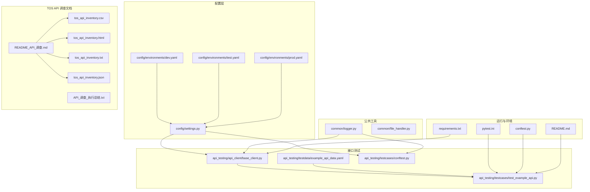
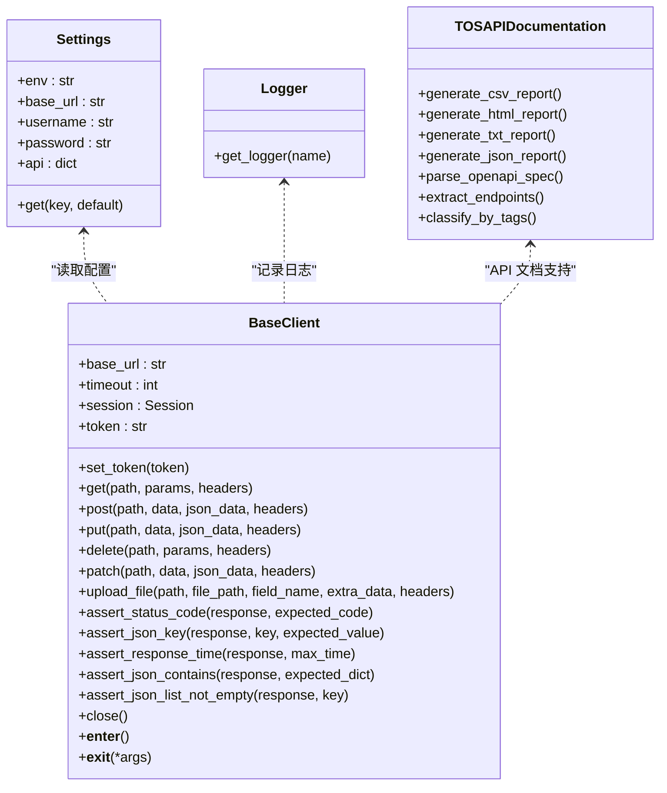
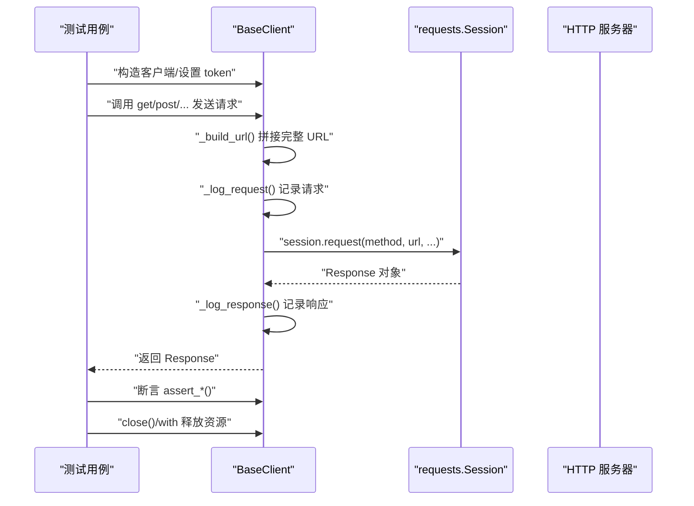
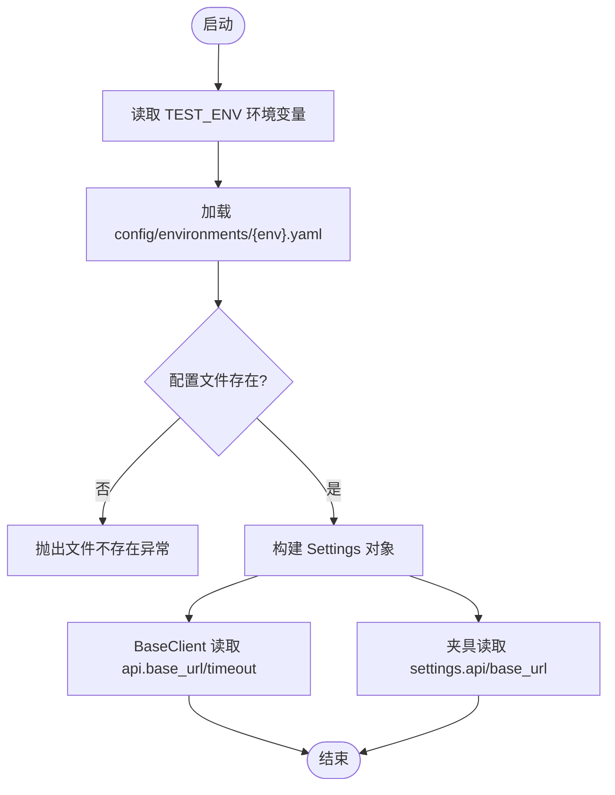
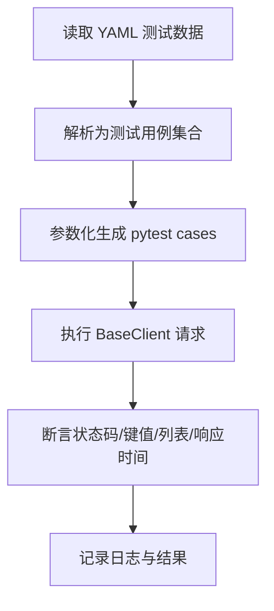
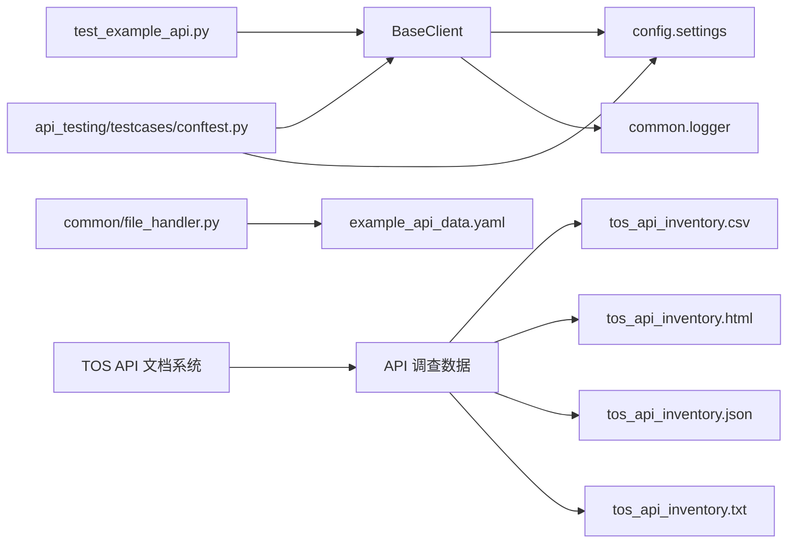

# 接口测试框架

<cite>
**本文引用的文件**
- [api_client/base_client.py](file://api_testing/api_client/base_client.py)
- [testcases/test_example_api.py](file://api_testing/testcases/test_example_api.py)
- [testdata/example_api_data.yaml](file://api_testing/testdata/example_api_data.yaml)
- [config/settings.py](file://config/settings.py)
- [config/environments/dev.yaml](file://config/environments/dev.yaml)
- [config/environments/test.yaml](file://config/environments/test.yaml)
- [config/environments/prod.yaml](file://config/environments/prod.yaml)
- [common/logger.py](file://common/logger.py)
- [conftest.py](file://conftest.py)
- [api_testing/testcases/conftest.py](file://api_testing/testcases/conftest.py)
- [requirements.txt](file://requirements.txt)
- [pytest.ini](file://pytest.ini)
- [README.md](file://README.md)
- [common/file_handler.py](file://common/file_handler.py)
- [testcase_generator/generator.py](file://testcase_generator/generator.py)
- [README_API_调查.md](file://README_API_调查.md)
- [API_调查_执行总结.txt](file://API_调查_执行总结.txt)
- [tos_api_inventory.csv](file://tos_api_inventory.csv)
- [tos_api_inventory.html](file://tos_api_inventory.html)
- [tos_api_inventory.txt](file://tos_api_inventory.txt)
- [tos_api_inventory.json](file://tos_api_inventory.json)
- [functional_testcase.yaml](file://testcase_generator/templates/functional_testcase.yaml)
</cite>

## 目录
1. [引言](#引言)
2. [项目结构](#项目结构)
3. [核心组件](#核心组件)
4. [架构总览](#架构总览)
5. [详细组件分析](#详细组件分析)
6. [TOS系统API调查与文档管理](#tos系统api调查与文档管理)
7. [依赖分析](#依赖分析)
8. [性能考量](#性能考量)
9. [故障排查指南](#故障排查指南)
10. [结论](#结论)
11. [附录](#附录)

## 引言
本文件面向接口测试框架的使用者与维护者，系统性阐述 BaseClient 基类的设计架构、HTTP 客户端封装与 RESTful API 测试最佳实践。内容覆盖请求构建、响应处理、状态码验证与断言机制，认证授权、请求头管理、参数序列化与响应解析，并提供示例测试用例分析、测试数据组织与错误处理策略。最后给出调试技巧、性能优化与安全最佳实践，帮助团队高效、稳定地开展接口测试。

**更新** 本次更新新增了完整的 TOS 系统 API 调查文档管理功能，包括 199 个默认模块 API 的详细清单、OpenAPI 3.0.1 规范支持、多种格式的 API 文档输出（HTML、JSON、CSV、TXT），以及基于调查结果的测试用例生成能力。

## 项目结构
该仓库是一个多模块测试工作区，包含配置、日志、接口测试、UI 自动化、性能测试、用例生成与文档等模块。接口测试子系统由"客户端封装 + 测试用例 + 测试数据"构成，配合全局配置与日志模块，形成可扩展、可维护的测试基础设施。



**图表来源**
- [config/settings.py:1-104](file://config/settings.py#L1-L104)
- [config/environments/dev.yaml:1-31](file://config/environments/dev.yaml#L1-L31)
- [config/environments/test.yaml:1-31](file://config/environments/test.yaml#L1-L31)
- [config/environments/prod.yaml:1-31](file://config/environments/prod.yaml#L1-L31)
- [common/logger.py:1-77](file://common/logger.py#L1-L77)
- [api_client/base_client.py:1-308](file://api_client/base_client.py#L1-L308)
- [testcases/test_example_api.py:1-167](file://testcases/test_example_api.py#L1-L167)
- [testdata/example_api_data.yaml:1-116](file://testdata/example_api_data.yaml#L1-L116)
- [README_API_调查.md:1-230](file://README_API_调查.md#L1-L230)
- [API_调查_执行总结.txt:1-246](file://API_调查_执行总结.txt#L1-L246)
- [tos_api_inventory.csv:1-205](file://tos_api_inventory.csv#L1-L205)
- [tos_api_inventory.html:1-800](file://tos_api_inventory.html#L1-L800)
- [tos_api_inventory.txt:1-800](file://tos_api_inventory.txt#L1-L800)
- [tos_api_inventory.json:1-800](file://tos_api_inventory.json#L1-L800)

**章节来源**
- [README.md:1-123](file://README.md#L1-L123)
- [pytest.ini:1-12](file://pytest.ini#L1-L12)

## 核心组件
- BaseClient：封装 HTTP 请求方法、会话管理、Token 认证、请求/响应日志、断言工具与资源生命周期管理。
- 配置系统：集中管理多环境配置（base_url、超时、账号、API 参数等），支持通过环境变量切换。
- 日志系统：统一日志格式与落盘策略，便于问题定位与审计。
- 测试用例与数据：示例用例展示断言与最佳实践；测试数据采用 YAML 组织，便于参数化与维护。
- 运行与夹具：pytest 配置与全局/局部夹具，提供客户端与认证夹具、基础 URL 等共享能力。
- **TOS API 调查文档系统**：提供完整的 API 接口清单、多种格式文档输出、OpenAPI 规范支持和测试用例生成能力。

**章节来源**
- [api_client/base_client.py:18-308](file://api_client/base_client.py#L18-L308)
- [config/settings.py:13-104](file://config/settings.py#L13-L104)
- [common/logger.py:1-77](file://common/logger.py#L1-L77)
- [testcases/test_example_api.py:1-167](file://testcases/test_example_api.py#L1-L167)
- [testdata/example_api_data.yaml:1-116](file://testdata/example_api_data.yaml#L1-L116)
- [README_API_调查.md:1-230](file://README_API_调查.md#L1-L230)

## 架构总览
接口测试的整体架构围绕"配置驱动 + 客户端封装 + 测试用例 + 数据驱动 + API 文档管理"的思路展开。BaseClient 作为核心，向上提供统一的 HTTP 能力与断言工具，向下对接配置与日志模块。测试用例通过夹具注入客户端实例，结合测试数据实现参数化执行。新增的 TOS API 调查文档系统提供完整的 API 接口清单和多种格式的文档输出。



**图表来源**
- [config/settings.py:13-104](file://config/settings.py#L13-L104)
- [common/logger.py:59-77](file://common/logger.py#L59-L77)
- [api_client/base_client.py:18-308](file://api_client/base_client.py#L18-L308)
- [README_API_调查.md:1-230](file://README_API_调查.md#L1-L230)

## 详细组件分析

### BaseClient 设计与实现
- 初始化与会话管理
  - 从配置读取 base_url 与超时，创建 requests.Session 并设置默认 Content-Type 与 Accept。
  - 支持传入 token 并自动注入 Authorization 头。
- URL 构建
  - 自动去除 base_url 与 path 的多余斜杠，避免双斜杠；若传入完整 URL 则直接使用。
- 请求日志
  - 记录请求方法、URL、Query 参数、JSON/表单体、Headers；支持自定义 headers 合并。
- 响应日志
  - 记录状态码与耗时；尝试解析 JSON，失败时记录文本片段。
- 异常处理
  - 捕获 Timeout、ConnectionError、RequestException，记录耗时与错误信息并重新抛出。
- HTTP 方法封装
  - 提供 get/post/put/delete/patch；支持 params、data、json、headers 等标准参数。
- 文件上传
  - 自动检测文件存在性；移除默认 Content-Type 以让 requests 生成 multipart；支持额外表单字段与自定义 headers。
- 断言工具
  - 状态码断言、JSON 键存在与值断言、响应时间断言、子集键值断言、列表非空断言。
- 生命周期管理
  - 支持 with 上下文与手动 close，确保 session 资源释放。



**图表来源**
- [api_client/base_client.py:46-134](file://api_client/base_client.py#L46-L134)
- [api_client/base_client.py:135-186](file://api_client/base_client.py#L135-L186)
- [api_client/base_client.py:188-230](file://api_client/base_client.py#L188-L230)
- [api_client/base_client.py:233-295](file://api_client/base_client.py#L233-L295)

**章节来源**
- [api_client/base_client.py:18-308](file://api_client/base_client.py#L18-L308)

### 配置与环境管理
- Settings 类
  - 通过环境变量 TEST_ENV 选择配置文件，支持属性与 get 方法访问配置项。
  - 提供 base_url、username、password、api、browser 等常用配置。
- 环境配置
  - dev/test/prod 三套环境，分别定义 base_url、超时、账号、数据库与浏览器参数。
- 使用方式
  - BaseClient 与夹具均通过 settings 获取 API 基础地址与超时等参数。



**图表来源**
- [config/settings.py:26-48](file://config/settings.py#L26-L48)
- [config/environments/dev.yaml:19-23](file://config/environments/dev.yaml#L19-L23)
- [config/environments/test.yaml:19-23](file://config/environments/test.yaml#L19-L23)
- [config/environments/prod.yaml:19-23](file://config/environments/prod.yaml#L19-L23)

**章节来源**
- [config/settings.py:13-104](file://config/settings.py#L13-L104)
- [config/environments/dev.yaml:1-31](file://config/environments/dev.yaml#L1-L31)
- [config/environments/test.yaml:1-31](file://config/environments/test.yaml#L1-L31)
- [config/environments/prod.yaml:1-31](file://config/environments/prod.yaml#L1-L31)

### 日志系统
- 统一日志配置
  - 控制台 INFO 级别及以上输出，文件 DEBUG 级别及以上按天轮转、保留 7 天。
  - 通过 get_logger(name) 绑定模块名，便于区分来源。
- 在 BaseClient 中的应用
  - 请求/响应日志、异常日志均通过统一 logger 输出，便于问题定位。

**章节来源**
- [common/logger.py:1-77](file://common/logger.py#L1-L77)
- [api_client/base_client.py:60-90](file://api_client/base_client.py#L60-L90)

### 测试用例与数据组织
- 示例用例
  - 展示健康检查、GET/POST 请求、断言组合、自定义 Headers、Token 认证等场景。
  - 使用 autouse 夹具或显式构造 BaseClient，测试结束后关闭 session。
- 测试数据
  - YAML 模板定义接口端点、方法、多个测试 case，包含请求体/查询参数与期望结果。
  - 支持参数化执行与断言模板化，便于维护与扩展。



**图表来源**
- [testcases/test_example_api.py:18-167](file://testcases/test_example_api.py#L18-L167)
- [testdata/example_api_data.yaml:1-116](file://testdata/example_api_data.yaml#L1-L116)

**章节来源**
- [testcases/test_example_api.py:1-167](file://testcases/test_example_api.py#L1-L167)
- [testdata/example_api_data.yaml:1-116](file://testdata/example_api_data.yaml#L1-L116)

### 夹具与运行配置
- 全局夹具（conftest.py）
  - 提供 WebDriver 初始化与失败截图钩子，便于 UI 自动化测试。
- 接口测试夹具（api_testing/testcases/conftest.py）
  - 提供 api_client（无认证）与 auth_client（带 Token 认证）夹具。
  - 支持从配置读取 token 或通过登录接口动态获取（预留扩展）。
- pytest 配置
  - 指定测试路径、标记（smoke、regression、api、ui）、HTML 报告输出等。

**章节来源**
- [conftest.py:1-148](file://conftest.py#L1-L148)
- [api_testing/testcases/conftest.py:1-80](file://api_testing/testcases/conftest.py#L1-L80)
- [pytest.ini:1-12](file://pytest.ini#L1-L12)

## TOS系统API调查与文档管理

### API调查系统概述
基于 TOS 系统默认模块的完整 API 接口调查，生成了以下交付物：
- **199 个 API 接口**：涵盖用户认证、桌面管理、消息通知、存储管理、系统配置等核心功能
- **OpenAPI 3.0.1 规范**：遵循标准 API 规范，支持 Tag 分类和详细描述
- **多格式文档输出**：HTML、JSON、CSV、TXT 四种格式，满足不同使用场景

### 文档格式与用途
- **HTML 格式** (`tos_api_inventory.html`)
  - 美化展示的网页格式，支持交互式浏览和搜索
  - 包含统计信息、分类标签和详细接口描述
- **JSON 格式** (`tos_api_inventory.json`)
  - 结构化数据格式，便于程序化处理和自动化集成
  - 包含完整的接口元数据和分类信息
- **CSV 格式** (`tos_api_inventory.csv`)
  - 表格格式，便于在 Excel 中进行数据分析和过滤
  - 支持按 HTTP 方法、路径、分类等列进行排序
- **TXT 格式** (`tos_api_inventory.txt`)
  - 纯文本格式，便于快速查阅和打印
  - 按功能分类组织的完整接口清单

### API调查成果
- **功能分类**：8 个主要功能模块，包括用户认证、桌面管理、消息通知、存储管理等
- **HTTP 方法分布**：GET 42.7%、POST 43.7%、PUT 9.0%、DELETE 4.5%
- **核心发现**：
  - 遵循 OpenAPI 3.0.1 标准，使用 /v2/ 版本前缀
  - 支持 Tag 分类便于组织和理解
  - 大多数接口需要 TMSESSNAME Cookie 认证
  - 存储管理模块最为复杂（100+ 接口）

### 测试用例生成集成
基于调查结果，可以使用 `testcase_generator` 工具为每个接口生成对应的测试用例：

```python
# 基于接口清单生成测试用例
from testcase_generator import TestCaseGenerator

generator = TestCaseGenerator()
# 按 Tag 分类生成
generator.generate_from_openapi('/Users/miaoqi/Downloads/默认模块.openapi.json')
```

**章节来源**
- [README_API_调查.md:1-230](file://README_API_调查.md#L1-L230)
- [API_调查_执行总结.txt:1-246](file://API_调查_执行总结.txt#L1-L246)
- [tos_api_inventory.csv:1-205](file://tos_api_inventory.csv#L1-L205)
- [tos_api_inventory.html:1-800](file://tos_api_inventory.html#L1-L800)
- [tos_api_inventory.txt:1-800](file://tos_api_inventory.txt#L1-L800)
- [tos_api_inventory.json:1-800](file://tos_api_inventory.json#L1-L800)
- [functional_testcase.yaml:1-61](file://testcase_generator/templates/functional_testcase.yaml#L1-L61)

## 依赖分析
- 外部依赖
  - pytest、pytest-html、pytest-xdist：测试框架与报告。
  - requests：HTTP 客户端。
  - PyYAML、openpyxl：数据处理。
  - loguru：日志。
  - selenium：UI 自动化（接口测试不直接依赖）。
- 内部依赖
  - BaseClient 依赖 config.settings 与 common.logger。
  - 夹具依赖 BaseClient 与 settings。
  - 测试数据依赖 YAMLHandler（文件处理工具）。
  - **TOS API 文档系统**：依赖调查工具和 OpenAPI 解析器。



**图表来源**
- [api_client/base_client.py:11-15](file://api_client/base_client.py#L11-L15)
- [config/settings.py:1-104](file://config/settings.py#L1-L104)
- [common/logger.py:1-77](file://common/logger.py#L1-L77)
- [api_testing/testcases/conftest.py:11-13](file://api_testing/testcases/conftest.py#L11-L13)
- [common/file_handler.py:1-217](file://common/file_handler.py#L1-L217)
- [README_API_调查.md:1-230](file://README_API_调查.md#L1-L230)

**章节来源**
- [requirements.txt:1-21](file://requirements.txt#L1-L21)
- [common/file_handler.py:1-217](file://common/file_handler.py#L1-L217)

## 性能考量
- 会话复用
  - BaseClient 使用 requests.Session，减少 TCP/TLS 握手开销，提升并发性能。
- 超时控制
  - 统一超时配置，避免长时间阻塞；可在请求级覆盖。
- 日志级别
  - 控制台 INFO、文件 DEBUG，避免过多 IO 影响性能。
- 并行执行
  - 使用 pytest-xdist 并行运行测试，缩短整体执行时间。
- 响应时间断言
  - 通过断言响应时间阈值，快速发现性能退化。
- **API 文档处理性能**
  - 多格式文档生成支持批量处理，避免重复解析 OpenAPI 文件
  - JSON 格式适合程序化处理，减少解析开销

**章节来源**
- [api_client/base_client.py:21-29](file://api_client/base_client.py#L21-L29)
- [pytest.ini:4-6](file://pytest.ini#L4-L6)

## 故障排查指南
- 常见异常与日志
  - 超时：记录耗时与错误信息，便于定位网络或服务端延迟。
  - 连接错误：检查 base_url、代理、证书与网络连通性。
  - 请求异常：检查请求参数、Headers、Body 序列化。
- 日志定位
  - 查看 logs/ 下按日期分割的日志文件，结合模块名定位来源。
- 配置检查
  - 确认 TEST_ENV 与对应环境配置文件存在且 base_url 正确。
- 断言失败
  - 结合断言工具输出与响应体日志，确认期望值与实际值差异。
- 文件上传失败
  - 检查文件是否存在、Content-Type 自动设置、Headers 合并逻辑。
- **API 文档问题排查**
  - 检查 OpenAPI 文件格式是否正确（JSON/YAML）
  - 验证 API 路径和方法的完整性
  - 确认分类标签（Tags）的正确性
  - 检查认证要求和前置条件说明

**章节来源**
- [api_client/base_client.py:122-133](file://api_client/base_client.py#L122-L133)
- [common/logger.py:34-56](file://common/logger.py#L34-L56)

## 结论
该接口测试框架以 BaseClient 为核心，结合配置驱动、统一日志与断言工具，提供了简洁而强大的 RESTful API 测试能力。通过夹具与测试数据模板化，实现了高可维护性与可扩展性。新增的 TOS API 调查文档系统进一步增强了框架的实用性，提供了完整的 API 接口清单和多种格式的文档输出。建议在实际项目中：
- 明确环境配置与 Token 管理策略；
- 严格使用断言工具与日志输出；
- 合理设置超时与并发度；
- 将测试数据与用例模板化，持续迭代；
- **充分利用 TOS API 调查文档系统，基于调查结果生成测试用例和文档。**

## 附录

### RESTful API 测试最佳实践清单
- 请求构建
  - 明确端点与方法，合理组织查询参数与请求体。
  - 使用自定义 Headers 时注意与默认 Headers 的合并。
- 响应处理
  - 统一解析 JSON，失败时记录文本片段，便于排错。
  - 使用断言工具进行状态码、键值、列表与响应时间校验。
- 认证授权
  - 优先使用夹具注入 Token；必要时通过登录接口动态获取。
- 参数化与数据组织
  - 使用 YAML 模板组织测试数据，支持多场景参数化。
- 错误处理
  - 捕获并记录异常，保留耗时信息；失败时输出关键上下文。
- 调试技巧
  - 逐步缩小范围：先验证端点与认证，再验证业务逻辑。
  - 关注日志中的请求与响应体，结合断言失败信息定位问题。
- 性能与安全
  - 合理设置超时与并发；避免敏感信息泄露，仅记录必要字段。

### 示例测试用例分析要点
- 健康检查：验证服务可用性与响应时间。
- 列表查询：验证分页、过滤与列表非空断言。
- 资源创建：验证状态码与响应体关键字段。
- 断言组合：状态码 + 键值 + 列表 + 响应时间的综合校验。
- 自定义 Headers：覆盖默认头并验证接口行为。
- Token 认证：登录获取 token，设置到客户端后访问受保护接口。

### TOS API 调查文档使用指南
- **快速查看接口**：推荐使用 HTML 格式，在浏览器中查看美化展示
- **详细分析**：阅读 TXT 或 MD 格式的完整调查报告
- **程序化处理**：使用 JSON 格式进行自动化处理和集成
- **数据分析**：使用 CSV 格式在 Excel 中进行过滤和分析
- **快速查阅**：查看 TXT 格式的按分类清单

**章节来源**
- [testcases/test_example_api.py:33-167](file://testcases/test_example_api.py#L33-L167)
- [README_API_调查.md:115-205](file://README_API_调查.md#L115-L205)