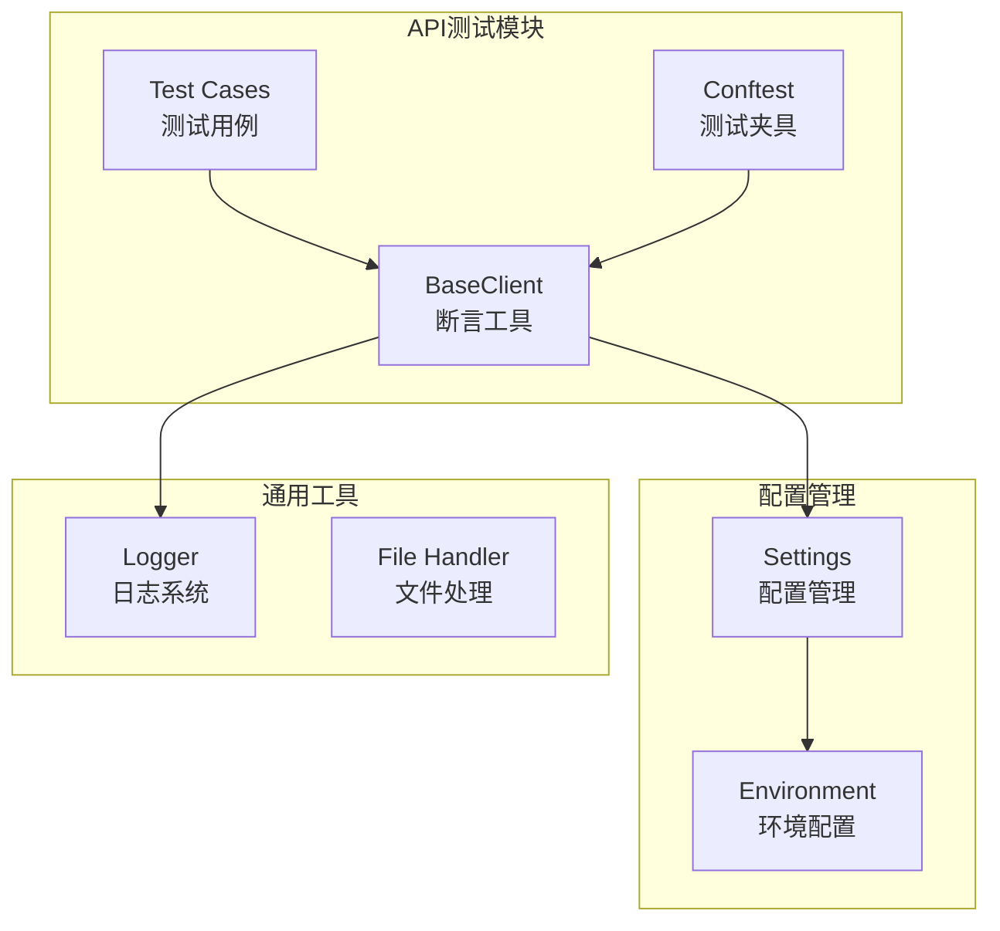
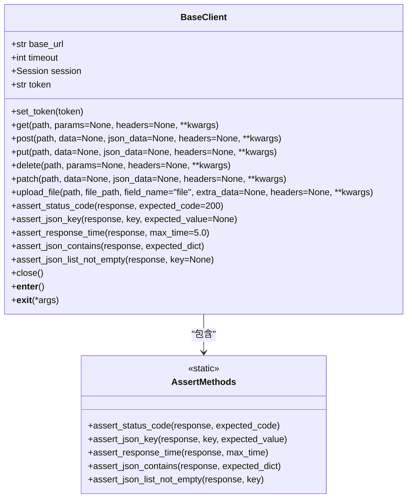
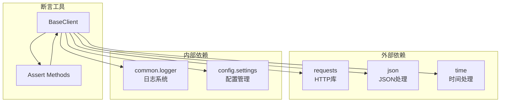

# 断言工具

<cite>
**本文档引用的文件**
- [base_client.py](file://api_testing/api_client/base_client.py)
- [test_example_api.py](file://api_testing/testcases/test_example_api.py)
- [conftest.py](file://api_testing/testcases/conftest.py)
- [settings.py](file://config/settings.py)
- [logger.py](file://common/logger.py)
- [test.yaml](file://config/environments/test.yaml)
- [example_api_data.yaml](file://api_testing/testdata/example_api_data.yaml)
</cite>

## 目录
1. [简介](#简介)
2. [项目结构](#项目结构)
3. [核心组件](#核心组件)
4. [架构概览](#架构概览)
5. [详细组件分析](#详细组件分析)
6. [依赖关系分析](#依赖关系分析)
7. [性能考虑](#性能考虑)
8. [故障排除指南](#故障排除指南)
9. [结论](#结论)
10. [附录](#附录)

## 简介

本文档为断言工具提供了全面的参考文档，重点介绍了BaseClient类提供的各种断言辅助方法。这些断言工具专门用于API接口测试，能够帮助开发者快速验证HTTP响应的各种属性，包括状态码、JSON响应内容、响应时间和数据结构等。

断言工具的设计遵循了以下原则：
- **简单易用**：提供直观的方法签名和清晰的错误信息
- **功能完整**：涵盖常见的API测试断言需求
- **可扩展性**：支持自定义断言和组合使用
- **调试友好**：提供详细的日志记录和错误信息

## 项目结构

该项目采用模块化的组织方式，断言工具位于API客户端模块中，与测试框架和配置管理紧密集成。



**图表来源**
- [base_client.py:18-40](file://api_testing/api_client/base_client.py#L18-L40)
- [conftest.py:16-30](file://api_testing/testcases/conftest.py#L16-L30)
- [settings.py:13-25](file://config/settings.py#L13-L25)

**章节来源**
- [base_client.py:1-308](file://api_testing/api_client/base_client.py#L1-L308)
- [conftest.py:1-80](file://api_testing/testcases/conftest.py#L1-L80)
- [settings.py:1-104](file://config/settings.py#L1-L104)

## 核心组件

BaseClient类提供了完整的断言工具集合，所有断言方法都设计为静态方法，可以直接通过类名调用，无需实例化。

### 主要断言方法概览

| 方法名 | 功能描述 | 参数 | 返回值 |
|--------|----------|------|--------|
| assert_status_code | 断言HTTP状态码 | response, expected_code=200 | None |
| assert_json_key | 断言JSON响应包含指定键 | response, key, expected_value=None | None |
| assert_response_time | 断言响应时间不超过阈值 | response, max_time=5.0 | None |
| assert_json_contains | 断言JSON响应包含键值对 | response, expected_dict | None |
| assert_json_list_not_empty | 断言JSON列表不为空 | response, key=None | None |

**章节来源**
- [base_client.py:233-295](file://api_testing/api_client/base_client.py#L233-L295)

## 架构概览

断言工具的架构设计体现了高内聚、低耦合的原则，与BaseClient的核心功能紧密结合。



**图表来源**
- [base_client.py:18-40](file://api_testing/api_client/base_client.py#L18-L40)
- [base_client.py:233-295](file://api_testing/api_client/base_client.py#L233-L295)

## 详细组件分析

### assert_status_code - 状态码断言

状态码断言是最基本也是最重要的断言方法，用于验证HTTP响应的状态码是否符合预期。

#### 方法签名和参数
- **方法名**: `assert_status_code`
- **参数**:
  - `response`: requests.Response对象，包含HTTP响应信息
  - `expected_code`: int类型，期望的状态码，默认为200
- **返回值**: None（断言失败时抛出AssertionError）

#### 预期行为
1. 从响应对象中提取状态码
2. 比较期望状态码与实际状态码
3. 如果不相等，抛出包含详细信息的AssertionError

#### 错误信息格式
当断言失败时，错误信息格式为：
```
"状态码不匹配: 期望 {expected_code}, 实际 {response.status_code}"
```

#### 使用示例
```python
# 基本用法
client.assert_status_code(response, 200)

# 验证特定状态码
client.assert_status_code(response, 404)
```

**章节来源**
- [base_client.py:233-242](file://api_testing/api_client/base_client.py#L233-L242)

### assert_json_key - JSON键断言

JSON键断言用于验证JSON响应中是否包含指定的键，支持可选的值验证。

#### 方法签名和参数
- **方法名**: `assert_json_key`
- **参数**:
  - `response`: requests.Response对象
  - `key`: str类型，期望存在的键名
  - `expected_value`: 任意类型，期望的值（可选）
- **返回值**: None

#### 预期行为
1. 解析响应的JSON内容
2. 检查键是否存在
3. 如果提供了期望值，进一步验证值的相等性
4. 断言失败时提供详细的错误信息

#### 错误信息格式
- 键不存在时：`"响应中不包含 key: {key}"`
- 值不匹配时：`"key '{key}' 的值不匹配: 期望 {expected_value}, 实际 {json_data[key]}"`

#### 使用示例
```python
# 仅验证键存在
client.assert_json_key(response, "code")

# 验证键存在且值为0
client.assert_json_key(response, "code", expected_value=0)

# 验证用户名存在
client.assert_json_key(response, "username")
```

**章节来源**
- [base_client.py:243-256](file://api_testing/api_client/base_client.py#L243-L256)

### assert_response_time - 响应时间断言

响应时间断言用于确保API响应在可接受的时间范围内，这对于性能测试和SLA保证很重要。

#### 方法签名和参数
- **方法名**: `assert_response_time`
- **参数**:
  - `response`: requests.Response对象
  - `max_time`: float类型，最大允许时间（秒），默认为5.0
- **返回值**: None

#### 预期行为
1. 获取响应的elapsed属性（包含总耗时）
2. 将耗时转换为秒
3. 比较耗时与最大阈值
4. 超时时抛出AssertionError

#### 错误信息格式
```
"响应时间超标: {response.elapsed.total_seconds()}s > {max_time}s"
```

#### 使用示例
```python
# 默认阈值5秒
client.assert_response_time(response)

# 自定义阈值2秒
client.assert_response_time(response, max_time=2.0)
```

**章节来源**
- [base_client.py:257-266](file://api_testing/api_client/base_client.py#L257-L266)

### assert_json_contains - JSON包含断言

JSON包含断言用于验证JSON响应包含指定的键值对集合，实现子集匹配功能。

#### 方法签名和参数
- **方法名**: `assert_json_contains`
- **参数**:
  - `response`: requests.Response对象
  - `expected_dict`: dict类型，期望包含的键值对字典
- **返回值**: None

#### 预期行为
1. 解析响应的JSON内容
2. 遍历expected_dict中的每个键值对
3. 对每个键值对执行相同的验证逻辑
4. 所有键值对都必须满足条件

#### 错误信息格式
- 键不存在时：`"响应中不包含 key: {key}"`
- 值不匹配时：`"key '{key}' 的值不匹配: 期望 {value}, 实际 {json_data[key]}"`

#### 使用示例
```python
# 验证包含多个键值对
client.assert_json_contains(response, {
    "code": 0,
    "message": "success"
})

# 验证包含用户信息
client.assert_json_contains(response, {
    "username": "testuser",
    "email": "test@example.com"
})
```

**章节来源**
- [base_client.py:267-279](file://api_testing/api_client/base_client.py#L267-L279)

### assert_json_list_not_empty - JSON列表非空断言

列表非空断言用于验证JSON响应中的列表数据不为空，支持两种模式：直接验证响应本身或验证指定键的值。

#### 方法签名和参数
- **方法名**: `assert_json_list_not_empty`
- **参数**:
  - `response`: requests.Response对象
  - `key`: str类型，列表字段名（可选，为None时认为响应本身是列表）
- **返回值**: None

#### 预期行为
1. 解析响应的JSON内容
2. 如果提供了key，验证该键存在且值为列表类型
3. 如果key为None，直接使用整个响应作为目标
4. 验证列表长度大于0
5. 断言失败时提供详细的错误信息

#### 错误信息格式
- 键不存在时：`"响应中不包含 key: {key}"`
- 不是列表类型时：`"目标不是列表类型: {type(target_list)}"`
- 列表为空时：`"列表为空"`

#### 使用示例
```python
# 验证响应本身是列表且不为空
client.assert_json_list_not_empty(response)

# 验证data字段是列表且不为空
client.assert_json_list_not_empty(response, key="data")

# 验证items字段是列表且不为空
client.assert_json_list_not_empty(response, key="items")
```

**章节来源**
- [base_client.py:280-295](file://api_testing/api_client/base_client.py#L280-L295)

## 依赖关系分析

断言工具与项目的其他组件存在紧密的依赖关系，形成了完整的测试生态系统。



**图表来源**
- [base_client.py:5-15](file://api_testing/api_client/base_client.py#L5-L15)
- [base_client.py:233-295](file://api_testing/api_client/base_client.py#L233-L295)

### 关键依赖关系

1. **requests库依赖**: 所有HTTP相关的断言都依赖于requests库的Response对象
2. **配置管理依赖**: BaseClient初始化时依赖配置管理系统的settings对象
3. **日志系统依赖**: 断言工具与日志系统集成，提供详细的调试信息
4. **静态方法设计**: 所有断言方法都设计为静态方法，便于直接调用

**章节来源**
- [base_client.py:1-40](file://api_testing/api_client/base_client.py#L1-L40)
- [settings.py:13-25](file://config/settings.py#L13-L25)

## 性能考虑

断言工具在设计时充分考虑了性能因素，采用了多种优化策略：

### 时间复杂度分析
- **assert_status_code**: O(1) - 直接比较状态码
- **assert_json_key**: O(1) - 字典查找和比较
- **assert_response_time**: O(1) - 时间比较
- **assert_json_contains**: O(n) - n为键值对数量
- **assert_json_list_not_empty**: O(1) - 类型检查和长度计算

### 内存使用优化
- 所有断言方法都是静态方法，不需要实例化
- JSON解析只在必要时进行（键存在性检查时）
- 错误信息使用惰性字符串格式化

### 性能最佳实践
1. **合理设置超时阈值**: 根据API特性调整max_time参数
2. **选择合适的断言组合**: 避免重复解析JSON响应
3. **使用适当的断言粒度**: 在完整性和精确性之间找到平衡

## 故障排除指南

### 常见问题和解决方案

#### JSON解析错误
**问题**: 断言方法抛出JSON解析异常
**原因**: 响应不是有效的JSON格式
**解决方案**: 
- 检查API响应的实际格式
- 使用assert_status_code先验证状态码
- 在断言之前检查响应内容类型

#### 断言失败的调试技巧
1. **查看详细的错误信息**: 所有断言都提供包含具体期望值和实际值的错误信息
2. **启用详细日志**: BaseClient会记录请求和响应的详细信息
3. **逐步缩小范围**: 从简单的状态码断言开始，逐步添加更复杂的断言

#### 性能问题排查
1. **监控响应时间**: 使用assert_response_time监控API性能
2. **检查网络延迟**: 验证网络连接质量
3. **分析服务器负载**: 检查API服务器的性能指标

**章节来源**
- [base_client.py:77-90](file://api_testing/api_client/base_client.py#L77-L90)
- [logger.py:59-77](file://common/logger.py#L59-L77)

## 结论

断言工具为API测试提供了强大而灵活的功能，涵盖了从基本状态码验证到复杂JSON结构断言的完整需求。其设计特点包括：

1. **简洁直观**: 方法签名简单明了，易于理解和使用
2. **功能完整**: 涵盖了API测试的主要断言场景
3. **错误友好**: 提供详细的错误信息，便于问题定位
4. **性能高效**: 采用静态方法设计，避免不必要的开销
5. **易于扩展**: 支持自定义断言和与其他测试工具的集成

通过合理使用这些断言工具，开发者可以构建更加健壮和可靠的API测试套件，提高测试效率和代码质量。

## 附录

### 断言组合使用最佳实践

#### 基本断言顺序
```python
# 1. 验证状态码
client.assert_status_code(response, 200)

# 2. 验证响应时间
client.assert_response_time(response, max_time=3.0)

# 3. 验证关键字段
client.assert_json_key(response, "code")
client.assert_json_key(response, "message")

# 4. 验证数据完整性
client.assert_json_contains(response, {"code": 0})
client.assert_json_list_not_empty(response, key="data")
```

#### 自定义断言扩展
虽然当前版本没有提供自定义断言的内置机制，但可以通过以下方式扩展：

1. **继承BaseClient类**: 创建自定义客户端类，添加新的断言方法
2. **使用装饰器模式**: 包装现有断言方法，添加额外的验证逻辑
3. **组合断言**: 将多个断言方法组合成复合断言

### 常见使用场景示例

#### 用户登录场景
```python
# 验证登录成功
client.assert_status_code(response, 200)
client.assert_json_key(response, "token")
client.assert_json_contains(response, {"code": 0})
client.assert_response_time(response, max_time=2.0)
```

#### 用户列表查询场景
```python
# 验证用户列表
client.assert_status_code(response, 200)
client.assert_json_list_not_empty(response, key="users")
client.assert_response_time(response, max_time=5.0)

# 验证列表项结构
users = response.json().get("users", [])
if users:
    client.assert_json_key(users[0], "id")
    client.assert_json_key(users[0], "username")
```