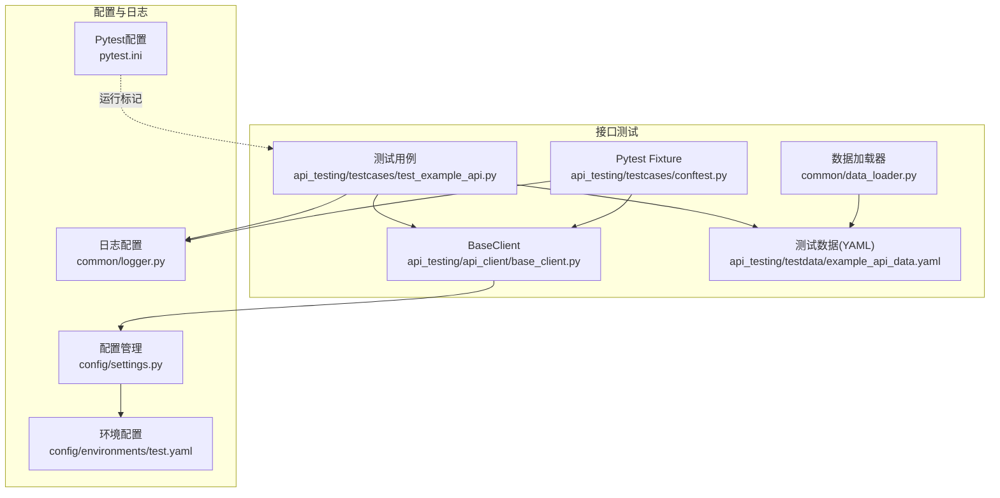
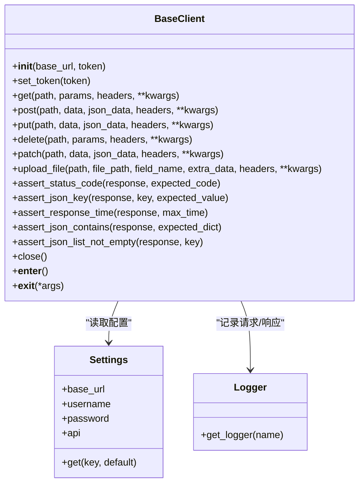
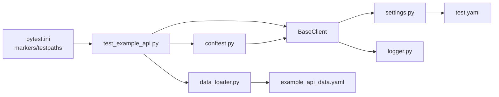
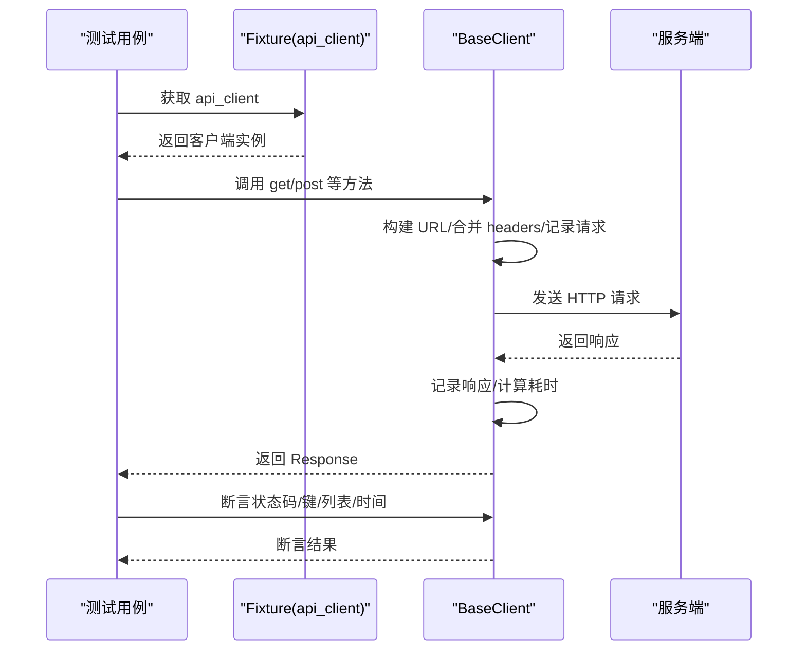
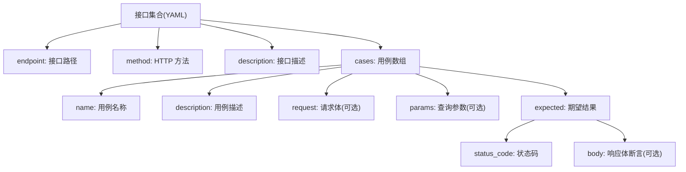

# 测试用例示例

<cite>
**本文引用的文件**
- [api_testing/testcases/test_example_api.py](file://api_testing/testcases/test_example_api.py)
- [api_testing/testcases/conftest.py](file://api_testing/testcases/conftest.py)
- [api_testing/testdata/example_api_data.yaml](file://api_testing/testdata/example_api_data.yaml)
- [api_testing/api_client/base_client.py](file://api_testing/api_client/base_client.py)
- [pytest.ini](file://pytest.ini)
- [config/settings.py](file://config/settings.py)
- [common/logger.py](file://common/logger.py)
- [common/data_loader.py](file://common/data_loader.py)
- [config/environments/test.yaml](file://config/environments/test.yaml)
- [ui_automation/testcases/test_example.py](file://ui_automation/testcases/test_example.py)
- [ui_automation/testdata/login_data.yaml](file://ui_automation/testdata/login_data.yaml)
</cite>

## 目录
1. [简介](#简介)
2. [项目结构](#项目结构)
3. [核心组件](#核心组件)
4. [架构总览](#架构总览)
5. [详细组件分析](#详细组件分析)
6. [依赖分析](#依赖分析)
7. [性能考虑](#性能考虑)
8. [故障排查指南](#故障排查指南)
9. [结论](#结论)
10. [附录](#附录)

## 简介
本文件面向测试工程师与开发人员，系统化讲解接口测试用例的编写与落地实践，围绕以下目标展开：
- 深入解析示例接口测试文件的组织结构与最佳实践
- 详解测试数据文件的格式、参数化与断言使用
- 提供成功场景、错误场景与边界条件的测试思路与参考路径
- 总结测试数据参数化与 YAML 配置的使用方法
- 形成可复用的测试用例编写规范与团队协作建议

## 项目结构
该仓库采用“按功能域分层”的组织方式，接口测试位于 api_testing 子目录，包含客户端封装、测试用例与测试数据；配置与日志分别位于 config 与 common 目录；UI 自动化与生成器等作为扩展能力存在。

图表来源
- [api_testing/testcases/test_example_api.py:1-167](file://api_testing/testcases/test_example_api.py#L1-L167)
- [api_testing/testcases/conftest.py:1-80](file://api_testing/testcases/conftest.py#L1-L80)
- [api_testing/api_client/base_client.py:1-308](file://api_testing/api_client/base_client.py#L1-L308)
- [api_testing/testdata/example_api_data.yaml:1-116](file://api_testing/testdata/example_api_data.yaml#L1-L116)
- [common/data_loader.py:1-115](file://common/data_loader.py#L1-L115)
- [config/settings.py:1-104](file://config/settings.py#L1-L104)
- [config/environments/test.yaml:1-31](file://config/environments/test.yaml#L1-L31)
- [common/logger.py:1-77](file://common/logger.py#L1-L77)
- [pytest.ini:1-16](file://pytest.ini#L1-L16)

章节来源
- [api_testing/testcases/test_example_api.py:1-167](file://api_testing/testcases/test_example_api.py#L1-L167)
- [api_testing/testcases/conftest.py:1-80](file://api_testing/testcases/conftest.py#L1-L80)
- [api_testing/testdata/example_api_data.yaml:1-116](file://api_testing/testdata/example_api_data.yaml#L1-L116)
- [api_testing/api_client/base_client.py:1-308](file://api_testing/api_client/base_client.py#L1-L308)
- [common/data_loader.py:1-115](file://common/data_loader.py#L1-L115)
- [config/settings.py:1-104](file://config/settings.py#L1-L104)
- [config/environments/test.yaml:1-31](file://config/environments/test.yaml#L1-L31)
- [common/logger.py:1-77](file://common/logger.py#L1-L77)
- [pytest.ini:1-16](file://pytest.ini#L1-L16)

## 核心组件
- BaseClient：封装 HTTP 请求、会话管理、Token 认证、断言工具与日志记录，统一对外暴露 get/post/put/delete/patch/upload_file 等方法，并提供断言辅助方法（状态码、JSON 键、响应时间、列表非空等）。
- Pytest Fixtures：提供 api_client 与 auth_client 两个常用 fixture，分别用于无认证与带 Token 认证的接口测试；同时提供 base_url 以便直接使用基础地址。
- 测试数据：example_api_data.yaml 采用“接口维度 + 用例数组”的结构，每个用例包含 name/description/request/params/expected 等字段，便于参数化与断言。
- 配置与日志：settings 从环境配置文件读取 base_url、超时、token 等；logger 统一输出到控制台与按天轮转的日志文件。
- Pytest 标记：pytest.ini 定义 api/markers，便于按类别筛选运行。

章节来源
- [api_testing/api_client/base_client.py:18-308](file://api_testing/api_client/base_client.py#L18-L308)
- [api_testing/testcases/conftest.py:16-80](file://api_testing/testcases/conftest.py#L16-L80)
- [api_testing/testdata/example_api_data.yaml:1-116](file://api_testing/testdata/example_api_data.yaml#L1-L116)
- [config/settings.py:13-104](file://config/settings.py#L13-L104)
- [common/logger.py:1-77](file://common/logger.py#L1-L77)
- [pytest.ini:7-16](file://pytest.ini#L7-L16)

## 架构总览
下面的类图展示了接口测试的核心对象及其关系，突出 BaseClient 的职责与断言工具的使用方式。

图表来源
- [api_testing/api_client/base_client.py:18-308](file://api_testing/api_client/base_client.py#L18-L308)
- [config/settings.py:13-104](file://config/settings.py#L13-L104)
- [common/logger.py:59-77](file://common/logger.py#L59-L77)

## 详细组件分析

### 测试用例组织与最佳实践
- 测试类命名：使用 Test* 前缀，便于 pytest 自动发现。
- 测试方法命名：test_*，清晰表达意图；使用 pytest.mark.api 标记便于筛选。
- Fixture 设计：使用 autouse=True 的 setup 在每个测试前后自动初始化/清理 BaseClient；conftest.py 提供 api_client/auth_client/base_url 等通用 fixture。
- 断言策略：优先使用 BaseClient 内置断言方法，确保断言信息一致且可读；必要时结合 assert 与响应对象属性进行组合断言。
- 日志与可维护性：BaseClient 内部记录请求与响应详情，便于问题定位；示例中多处以“[TODO: 替换]”标注，提醒替换为实际接口与参数，避免误跑。

章节来源
- [api_testing/testcases/test_example_api.py:18-167](file://api_testing/testcases/test_example_api.py#L18-L167)
- [api_testing/testcases/conftest.py:16-80](file://api_testing/testcases/conftest.py#L16-L80)

### 数据驱动测试与 YAML 配置
- YAML 结构：以接口名为顶级键，包含 endpoint/method/description/cases；cases 数组中每条用例包含 name/description/request/params/expected。
- 参数化思路：可借助 common/data_loader 的 load_test_cases 或 load_parametrize 返回 ids 与数据，配合 @pytest.mark.parametrize 使用；也可在测试中直接读取 YAML 并循环执行。
- 断言映射：expected 中的 status_code/body 可直接映射到 BaseClient 的断言方法，形成“数据即断言”的一致性体验。

章节来源
- [api_testing/testdata/example_api_data.yaml:1-116](file://api_testing/testdata/example_api_data.yaml#L1-L116)
- [common/data_loader.py:60-83](file://common/data_loader.py#L60-L83)

### 断言使用的最佳实践
- 状态码断言：统一使用 assert_status_code，明确期望值。
- JSON 键断言：assert_json_key 支持仅校验存在或同时校验值。
- 多键断言：assert_json_contains 支持子集匹配，适合校验响应体中关键字段。
- 列表断言：assert_json_list_not_empty 保证返回列表非空。
- 响应时间断言：assert_response_time 限制最大耗时，保障性能。

章节来源
- [api_testing/api_client/base_client.py:233-295](file://api_testing/api_client/base_client.py#L233-L295)

### 不同类型 API 测试场景示例（参考路径）
- 成功场景：以 GET 获取资源列表为例，断言状态码与关键字段存在及列表非空。
- 错误场景：以登录接口为例，覆盖密码错误、用户名为空、密码为空等情形，断言状态码与业务 code/message。
- 边界条件：分页参数 page/size 的边界值（第一页、第二页、关键字搜索）。
- 认证流程：先登录获取 token，再用 token 访问受保护接口，断言返回数据结构。

章节来源
- [api_testing/testcases/test_example_api.py:33-167](file://api_testing/testcases/test_example_api.py#L33-L167)
- [api_testing/testdata/example_api_data.yaml:7-116](file://api_testing/testdata/example_api_data.yaml#L7-L116)

### 测试数据参数化与 YAML 使用方法
- 便捷函数：load_yaml_data/load_test_cases/load_parametrize 由 common/data_loader 提供，支持直接加载 YAML 并返回参数化所需的 ids 与数据。
- 使用建议：在测试中通过 @pytest.mark.parametrize(ids=..., argvalues=...) 注解，将 YAML 中的 cases 直接注入测试方法；若需要更复杂的处理，可在测试内读取 YAML 并构造参数。

章节来源
- [common/data_loader.py:14-115](file://common/data_loader.py#L14-L115)

### 测试用例编写的规范与团队协作
- 规范建议
  - 每个测试聚焦单一场景，方法命名清晰表达目的。
  - 使用 pytest.mark.* 标记分类，便于分层执行与报告统计。
  - 断言信息明确，优先使用断言工具方法，减少重复代码。
  - 使用 fixture 管理共享资源（客户端、基础 URL、认证 token）。
  - 测试数据集中管理，遵循 YAML 结构约定，便于评审与维护。
- 团队协作
  - 统一断言与日志风格，确保跨模块一致性。
  - 通过 pytest.ini 的 markers 约定测试分类，避免遗漏。
  - 配置通过环境文件管理，不同环境切换通过 TEST_ENV 控制。

章节来源
- [pytest.ini:7-16](file://pytest.ini#L7-L16)
- [config/environments/test.yaml:1-31](file://config/environments/test.yaml#L1-L31)
- [api_testing/testcases/conftest.py:16-80](file://api_testing/testcases/conftest.py#L16-L80)

## 依赖分析
- 组件耦合
  - BaseClient 依赖 settings 读取基础配置，依赖 logger 输出日志。
  - 测试用例依赖 BaseClient 与 Pytest Fixtures；可选依赖 common/data_loader 进行数据参数化。
- 外部依赖
  - requests 用于 HTTP 通信；loguru 用于日志；pytest 用于测试执行与标记。
- 运行入口
  - 通过 pytest.ini 的 testpaths 与 markers 配置，统一发现与筛选测试。

图表来源
- [pytest.ini:1-16](file://pytest.ini#L1-L16)
- [api_testing/testcases/test_example_api.py:10-167](file://api_testing/testcases/test_example_api.py#L10-L167)
- [api_testing/testcases/conftest.py:7-80](file://api_testing/testcases/conftest.py#L7-L80)
- [api_testing/api_client/base_client.py:11-15](file://api_testing/api_client/base_client.py#L11-L15)
- [config/settings.py:37-48](file://config/settings.py#L37-L48)
- [config/environments/test.yaml:20-24](file://config/environments/test.yaml#L20-L24)
- [common/logger.py:35-56](file://common/logger.py#L35-L56)
- [common/data_loader.py:20-42](file://common/data_loader.py#L20-L42)
- [api_testing/testdata/example_api_data.yaml:1-116](file://api_testing/testdata/example_api_data.yaml#L1-L116)

章节来源
- [pytest.ini:1-16](file://pytest.ini#L1-L16)
- [api_testing/testcases/test_example_api.py:10-167](file://api_testing/testcases/test_example_api.py#L10-L167)
- [api_testing/testcases/conftest.py:7-80](file://api_testing/testcases/conftest.py#L7-L80)
- [api_testing/api_client/base_client.py:11-15](file://api_testing/api_client/base_client.py#L11-L15)
- [config/settings.py:37-48](file://config/settings.py#L37-L48)
- [config/environments/test.yaml:20-24](file://config/environments/test.yaml#L20-L24)
- [common/logger.py:35-56](file://common/logger.py#L35-L56)
- [common/data_loader.py:20-42](file://common/data_loader.py#L20-L42)
- [api_testing/testdata/example_api_data.yaml:1-116](file://api_testing/testdata/example_api_data.yaml#L1-L116)

## 性能考虑
- 响应时间断言：通过 assert_response_time 限制最大耗时，有助于及时发现性能退化。
- 会话复用：BaseClient 使用 requests.Session，减少 TCP 握手开销；测试结束后通过 close 释放连接。
- 超时控制：默认从配置读取超时时间，避免长时间阻塞影响整体执行效率。
- 日志级别：控制台 INFO、文件 DEBUG，兼顾可读性与性能；在高并发场景建议降低日志级别或按需开启。

章节来源
- [api_testing/api_client/base_client.py:258-265](file://api_testing/api_client/base_client.py#L258-L265)
- [api_testing/api_client/base_client.py:296-299](file://api_testing/api_client/base_client.py#L296-L299)
- [config/settings.py:75-78](file://config/settings.py#L75-L78)

## 故障排查指南
- 常见问题
  - 网络异常：连接错误/超时会在日志中记录具体 URL 与耗时，便于定位网络问题。
  - 断言失败：断言方法会输出期望值与实际值，结合日志中的响应体可快速定位差异。
  - 配置缺失：若环境配置文件不存在或字段缺失，settings 会抛出异常，检查 TEST_ENV 与文件路径。
- 建议流程
  - 查看日志：确认请求 URL、参数、响应状态码与响应体。
  - 校验断言：逐条比对 expected 与实际响应，缩小问题范围。
  - 检查配置：确认 base_url、token、超时等配置是否正确。
  - 逐步放通：将示例中的“[TODO: 替换]”替换为实际接口与参数，先运行最小可复现用例。

章节来源
- [api_testing/api_client/base_client.py:122-133](file://api_testing/api_client/base_client.py#L122-L133)
- [config/settings.py:42-48](file://config/settings.py#L42-L48)
- [common/logger.py:40-56](file://common/logger.py#L40-L56)

## 结论
本示例以 BaseClient 为核心，结合 Pytest Fixtures、YAML 测试数据与统一断言工具，构建了可维护、可扩展的接口测试体系。通过规范的测试组织、参数化与断言策略，以及完善的日志与配置管理，能够高效支撑成功、错误与边界条件等多类场景的测试落地。

## 附录

### 示例接口测试调用序列（概念示意）

[此图为概念示意，不直接映射具体源码文件]

### YAML 测试数据结构（接口级）

图表来源
- [api_testing/testdata/example_api_data.yaml:7-116](file://api_testing/testdata/example_api_data.yaml#L7-L116)