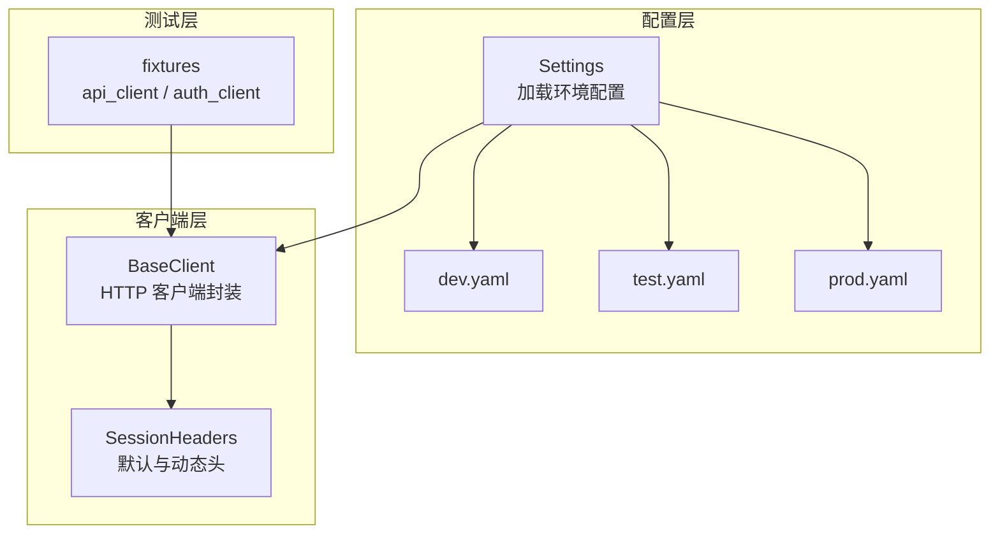
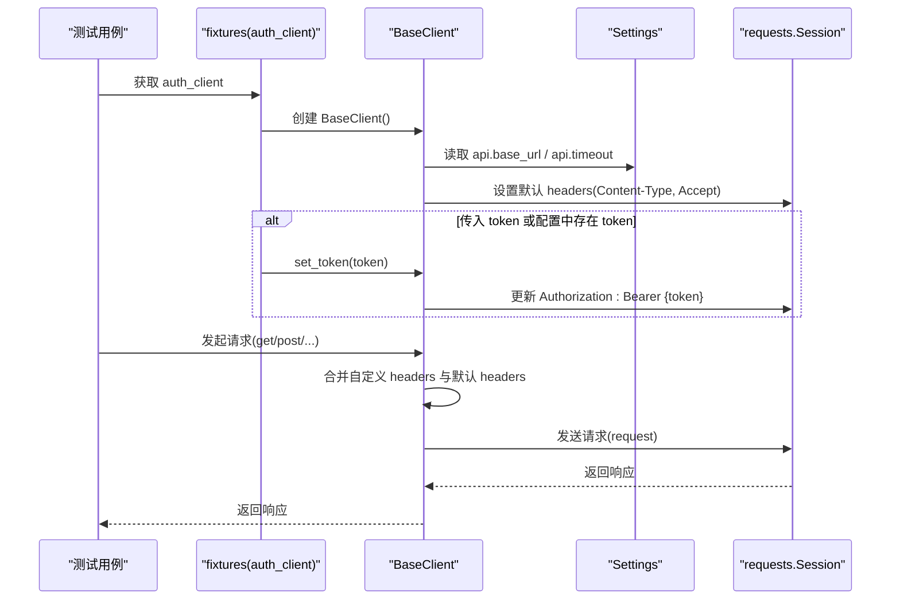
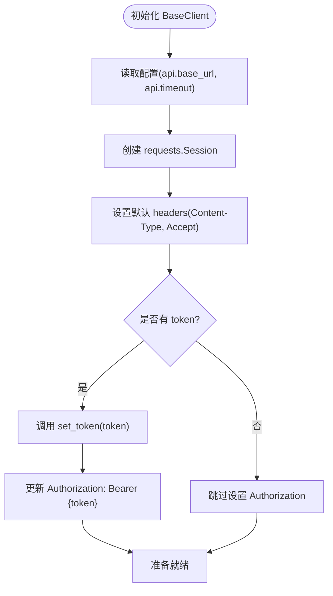
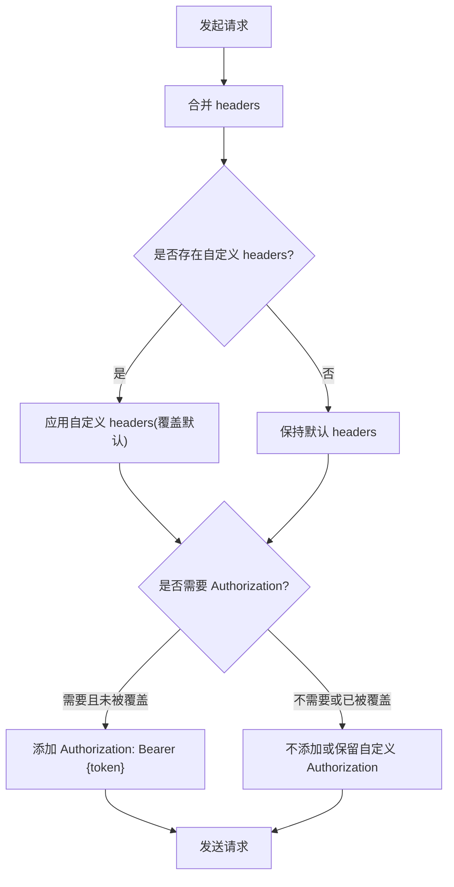
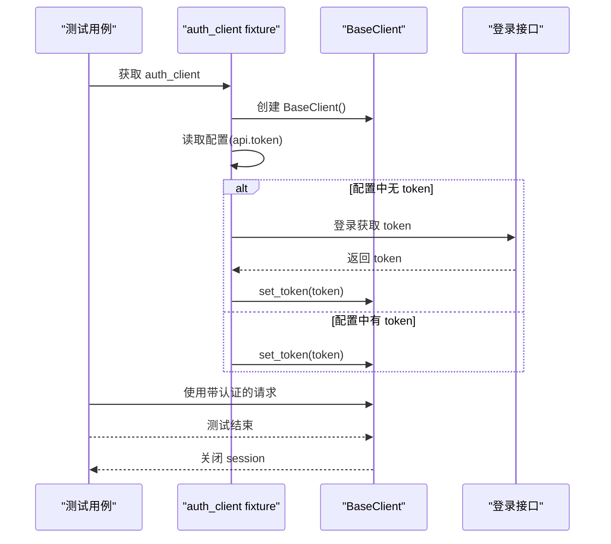
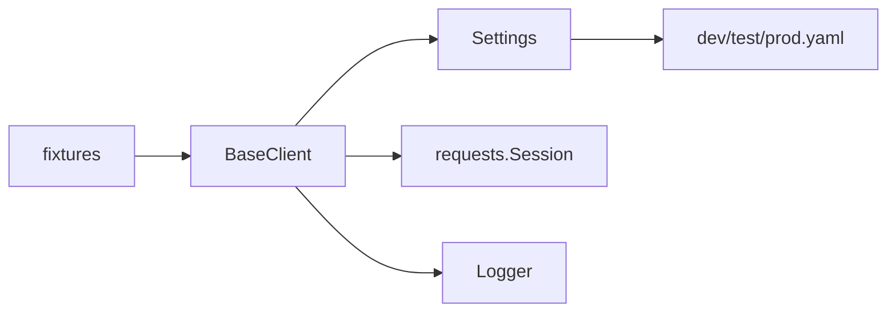

# 认证机制

<cite>
**本文引用的文件**
- [api_testing/api_client/base_client.py](file://api_testing/api_client/base_client.py)
- [config/settings.py](file://config/settings.py)
- [config/environments/dev.yaml](file://config/environments/dev.yaml)
- [config/environments/test.yaml](file://config/environments/test.yaml)
- [config/environments/prod.yaml](file://config/environments/prod.yaml)
- [api_testing/testcases/conftest.py](file://api_testing/testcases/conftest.py)
- [common/logger.py](file://common/logger.py)
</cite>

## 目录
1. [简介](#简介)
2. [项目结构](#项目结构)
3. [核心组件](#核心组件)
4. [架构总览](#架构总览)
5. [详细组件分析](#详细组件分析)
6. [依赖分析](#依赖分析)
7. [性能考虑](#性能考虑)
8. [故障排查指南](#故障排查指南)
9. [结论](#结论)
10. [附录](#附录)

## 简介
本技术文档聚焦于认证机制的设计与实现，重点围绕 Bearer Token 认证在接口测试客户端中的应用，系统阐述以下内容：
- Bearer Token 的初始化与运行时动态更新流程
- Authorization 头的自动设置与优先级策略
- 与自定义 headers 的合并机制
- 不同认证方式的扩展思路（Basic Auth、API Key 等）
- 认证失败的处理策略与安全最佳实践

## 项目结构
认证相关的核心代码集中在接口测试客户端与配置模块中，整体采用“配置驱动 + 客户端封装”的设计：
- 配置层：通过 Settings 类加载环境配置，提供 base_url、timeout、token 等配置项
- 客户端层：BaseClient 封装 HTTP 请求、会话管理、日志与断言，并内置 Bearer Token 认证能力
- 测试层：通过 pytest fixtures 提供带认证与不带认证的客户端实例，便于在测试中直接使用

图表来源
- [config/settings.py:13-104](file://config/settings.py#L13-L104)
- [config/environments/dev.yaml:1-31](file://config/environments/dev.yaml#L1-L31)
- [config/environments/test.yaml:1-31](file://config/environments/test.yaml#L1-L31)
- [config/environments/prod.yaml:1-31](file://config/environments/prod.yaml#L1-L31)
- [api_testing/api_client/base_client.py:18-44](file://api_testing/api_client/base_client.py#L18-L44)
- [api_testing/testcases/conftest.py:16-71](file://api_testing/testcases/conftest.py#L16-L71)

章节来源
- [config/settings.py:13-104](file://config/settings.py#L13-L104)
- [api_testing/api_client/base_client.py:18-44](file://api_testing/api_client/base_client.py#L18-L44)
- [api_testing/testcases/conftest.py:16-71](file://api_testing/testcases/conftest.py#L16-L71)

## 核心组件
- Settings：集中管理环境配置，提供 base_url、timeout、token 等配置项的读取与访问
- BaseClient：封装 HTTP 请求、会话管理、日志记录与断言；内置 Bearer Token 认证能力
- fixtures：提供 api_client（无认证）与 auth_client（带认证）两个客户端实例，便于测试复用

章节来源
- [config/settings.py:13-104](file://config/settings.py#L13-L104)
- [api_testing/api_client/base_client.py:18-44](file://api_testing/api_client/base_client.py#L18-L44)
- [api_testing/testcases/conftest.py:16-71](file://api_testing/testcases/conftest.py#L16-L71)

## 架构总览
下图展示了认证机制在初始化与请求过程中的交互关系，以及默认 headers 与动态 Authorization 头的设置位置。

图表来源
- [api_testing/testcases/conftest.py:32-71](file://api_testing/testcases/conftest.py#L32-L71)
- [api_testing/api_client/base_client.py:21-44](file://api_testing/api_client/base_client.py#L21-L44)
- [config/settings.py:76-96](file://config/settings.py#L76-L96)

## 详细组件分析

### Bearer Token 认证实现
- 初始化时的处理逻辑
  - BaseClient 在构造函数中读取配置中的 api.base_url 与 api.timeout，并创建 requests.Session
  - 设置默认 headers（Content-Type 与 Accept）
  - 若传入 token 或配置中存在 token，则调用 set_token 方法设置 Authorization 头
- set_token 方法的工作原理
  - set_token 会更新 BaseClient 的 token 字段，并将 Authorization 头设置为 Bearer {token}
  - 该方法直接更新 Session 的 headers，确保后续所有请求均携带该认证头
- Authorization 头的自动设置
  - set_token 会在每次调用时覆盖 Authorization 头，确保运行时动态更新生效
  - 若未设置 token，Authorization 头不会出现在默认 headers 中

图表来源
- [api_testing/api_client/base_client.py:21-44](file://api_testing/api_client/base_client.py#L21-L44)

章节来源
- [api_testing/api_client/base_client.py:21-44](file://api_testing/api_client/base_client.py#L21-L44)

### headers 合并与优先级策略
- 默认 headers 与自定义 headers 的合并
  - BaseClient 在发起请求前，会将 Session 的默认 headers 与调用方传入的 headers 合并
  - 合并策略为：调用方传入的 headers 会覆盖默认 headers 中同名字段
- Authorization 头的优先级
  - 若调用方显式传入 Authorization 头，将覆盖 BaseClient 的 Authorization 头
  - 若调用方未传入 Authorization 头，BaseClient 会根据当前 token 决定是否携带 Authorization 头
- Content-Type 的特殊处理
  - 文件上传场景会移除默认的 Content-Type，让 requests 自动设置 multipart/form-data

图表来源
- [api_testing/api_client/base_client.py:91-121](file://api_testing/api_client/base_client.py#L91-L121)
- [api_testing/api_client/base_client.py:188-230](file://api_testing/api_client/base_client.py#L188-L230)

章节来源
- [api_testing/api_client/base_client.py:91-121](file://api_testing/api_client/base_client.py#L91-L121)
- [api_testing/api_client/base_client.py:188-230](file://api_testing/api_client/base_client.py#L188-L230)

### 运行时动态更新机制
- 动态更新 token 的方式
  - 通过调用 set_token(token) 实时更新 BaseClient 的 token，并同步更新 Authorization 头
  - 适用于 token 刷新、轮换等场景
- 与 fixtures 的结合
  - auth_client fixture 会优先从配置中读取 token；若配置中没有 token，可通过登录接口动态获取后调用 set_token
  - 测试结束后自动关闭 session，避免连接泄漏

图表来源
- [api_testing/testcases/conftest.py:32-71](file://api_testing/testcases/conftest.py#L32-L71)
- [api_testing/api_client/base_client.py:41-44](file://api_testing/api_client/base_client.py#L41-L44)

章节来源
- [api_testing/testcases/conftest.py:32-71](file://api_testing/testcases/conftest.py#L32-L71)
- [api_testing/api_client/base_client.py:41-44](file://api_testing/api_client/base_client.py#L41-L44)

### 不同认证方式的扩展指导
- Basic Auth
  - 在 headers 中设置 Authorization: Basic {base64(username:password)}
  - 与 Bearer Token 的区别在于编码方式与用途，可在自定义 headers 中覆盖默认 Authorization
- API Key
  - 在 headers 中设置自定义字段，如 X-API-Key 或 Authorization: ApiKey {key}
  - 与 Bearer Token 的合并策略一致：自定义 headers 会覆盖默认 Authorization
- OAuth/Bearer Token
  - 通过 set_token(token) 设置 Authorization: Bearer {token}
  - 支持运行时动态更新，适合短期令牌场景

章节来源
- [api_testing/api_client/base_client.py:91-121](file://api_testing/api_client/base_client.py#L91-L121)

## 依赖分析
- BaseClient 依赖
  - Settings：读取 api.base_url、api.timeout、api.token 等配置
  - requests.Session：维护会话与 headers
  - common.logger：统一日志输出
- 配置依赖
  - dev/test/prod 环境配置文件提供 base_url、timeout、token 等环境差异化参数
- 测试依赖
  - fixtures：提供 api_client 与 auth_client，简化测试编写

图表来源
- [api_testing/api_client/base_client.py:18-44](file://api_testing/api_client/base_client.py#L18-L44)
- [config/settings.py:13-104](file://config/settings.py#L13-L104)
- [config/environments/dev.yaml:19-24](file://config/environments/dev.yaml#L19-L24)
- [config/environments/test.yaml:19-24](file://config/environments/test.yaml#L19-L24)
- [config/environments/prod.yaml:19-24](file://config/environments/prod.yaml#L19-L24)
- [api_testing/testcases/conftest.py:16-71](file://api_testing/testcases/conftest.py#L16-L71)

章节来源
- [api_testing/api_client/base_client.py:18-44](file://api_testing/api_client/base_client.py#L18-L44)
- [config/settings.py:13-104](file://config/settings.py#L13-L104)
- [config/environments/dev.yaml:19-24](file://config/environments/dev.yaml#L19-L24)
- [config/environments/test.yaml:19-24](file://config/environments/test.yaml#L19-L24)
- [config/environments/prod.yaml:19-24](file://config/environments/prod.yaml#L19-L24)
- [api_testing/testcases/conftest.py:16-71](file://api_testing/testcases/conftest.py#L16-L71)

## 性能考虑
- 会话复用：BaseClient 使用 requests.Session，减少 TCP 连接开销，提升并发性能
- headers 合并：在请求前进行一次合并，避免重复计算
- 日志级别：统一 INFO 输出到控制台，DEBUG 输出到文件，兼顾可观测性与性能

## 故障排查指南
- 认证失败（401/403）
  - 检查 token 是否正确设置：确认 set_token 是否被调用，以及 token 是否有效
  - 检查 headers 合并：确认自定义 headers 是否覆盖了 Authorization 头
  - 检查环境配置：确认 api.base_url 与 api.timeout 是否正确
- 超时与连接错误
  - BaseClient 已捕获 Timeout 与 ConnectionError 并记录日志，便于定位问题
- 日志定位
  - 使用 common/logger 提供的日志输出，查看请求与响应详情

章节来源
- [api_testing/api_client/base_client.py:116-133](file://api_testing/api_client/base_client.py#L116-L133)
- [common/logger.py:14-56](file://common/logger.py#L14-L56)

## 结论
本认证机制以 BaseClient 为核心，通过 Settings 驱动配置，实现了 Bearer Token 的初始化与动态更新，并提供了清晰的 headers 合并与优先级策略。该设计易于扩展至 Basic Auth、API Key 等其他认证方式，满足接口测试场景下的多样化需求。建议在生产环境中配合安全策略（如 token 存储、传输加密、最小权限原则）使用，进一步提升安全性与稳定性。

## 附录
- 环境配置示例
  - dev/test/prod 环境均提供 api.base_url、api.timeout、api.token 等配置项，便于在不同环境间切换
- 测试用例参考
  - auth_client fixture 提供带认证的客户端实例，便于在测试中直接使用

章节来源
- [config/environments/dev.yaml:19-24](file://config/environments/dev.yaml#L19-L24)
- [config/environments/test.yaml:19-24](file://config/environments/test.yaml#L19-L24)
- [config/environments/prod.yaml:19-24](file://config/environments/prod.yaml#L19-L24)
- [api_testing/testcases/conftest.py:32-71](file://api_testing/testcases/conftest.py#L32-L71)