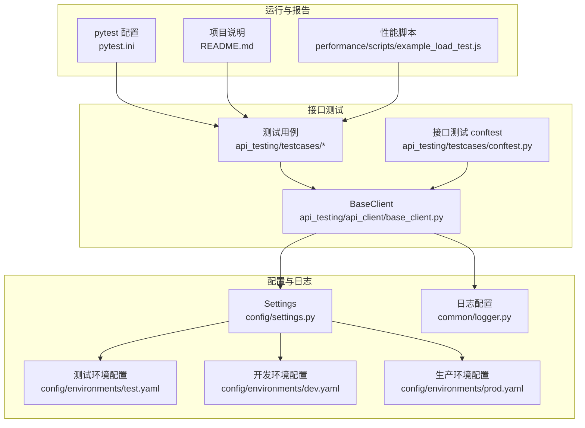
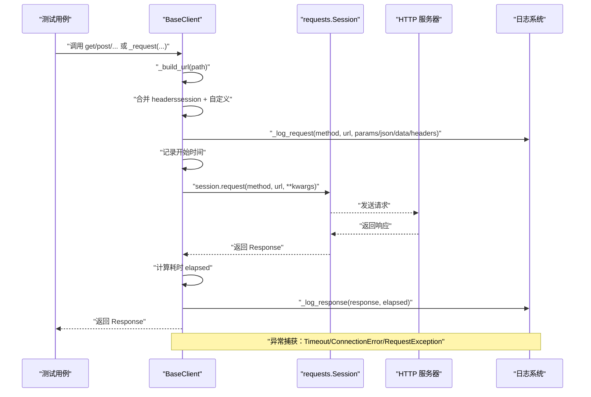
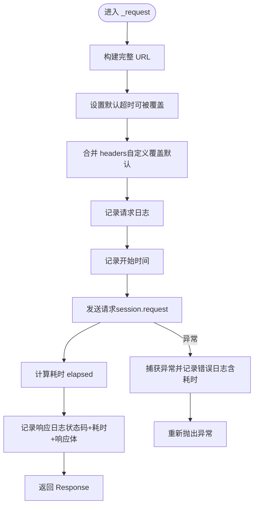
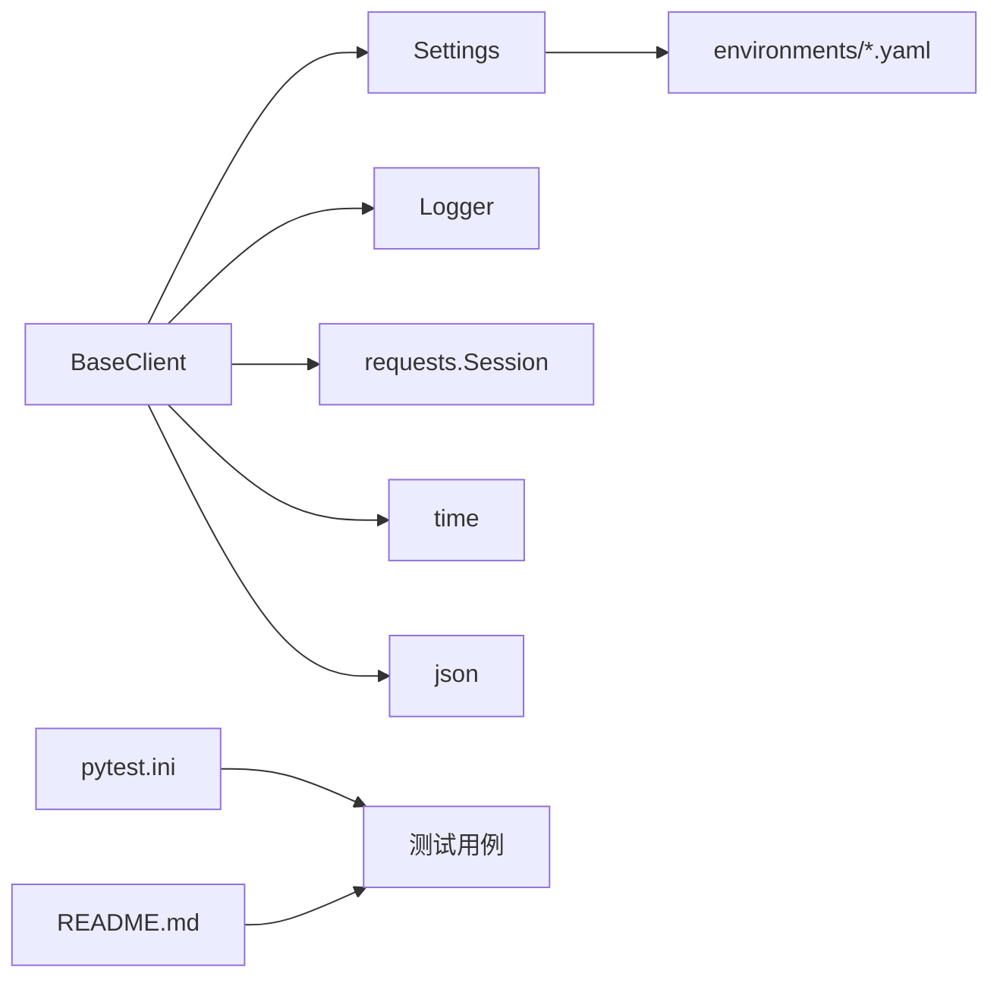

# 请求响应处理

<cite>
**本文引用的文件**
- [api_client/base_client.py](file://api_testing/api_client/base_client.py)
- [common/logger.py](file://common/logger.py)
- [config/settings.py](file://config/settings.py)
- [config/environments/test.yaml](file://config/environments/test.yaml)
- [config/environments/dev.yaml](file://config/environments/dev.yaml)
- [config/environments/prod.yaml](file://config/environments/prod.yaml)
- [api_testing/testcases/conftest.py](file://api_testing/testcases/conftest.py)
- [api_testing/testcases/test_example_api.py](file://api_testing/testcases/test_example_api.py)
- [pytest.ini](file://pytest.ini)
- [README.md](file://README.md)
- [performance/scripts/example_load_test.js](file://performance/scripts/example_load_test.js)
</cite>

## 目录
1. [引言](#引言)
2. [项目结构](#项目结构)
3. [核心组件](#核心组件)
4. [架构总览](#架构总览)
5. [详细组件分析](#详细组件分析)
6. [依赖分析](#依赖分析)
7. [性能考虑](#性能考虑)
8. [故障排查指南](#故障排查指南)
9. [结论](#结论)
10. [附录](#附录)

## 引言
本文件围绕“请求响应处理”的核心目标，系统性梳理并文档化通用请求方法 _request 的实现原理与行为边界，包括 URL 拼接、参数合并、headers 处理、异常捕获、请求/响应日志记录、超时与连接错误处理策略、以及时间统计与性能监控实践。文档同时提供调试技巧与常见问题解决方案，帮助测试工程师与开发者高效定位问题并优化接口测试流程。

## 项目结构
该仓库采用模块化组织，接口测试相关的核心位于 api_testing/api_client/base_client.py，日志与配置分别由 common/logger.py 与 config/settings.py 提供支撑；多环境配置位于 config/environments 下；测试用例位于 api_testing/testcases；性能测试脚本位于 performance/scripts。

**图表来源**
- [api_client/base_client.py:1-308](file://api_testing/api_client/base_client.py#L1-L308)
- [common/logger.py:1-77](file://common/logger.py#L1-L77)
- [config/settings.py:1-104](file://config/settings.py#L1-L104)
- [config/environments/test.yaml:1-31](file://config/environments/test.yaml#L1-L31)
- [config/environments/dev.yaml:1-31](file://config/environments/dev.yaml#L1-L31)
- [config/environments/prod.yaml:1-31](file://config/environments/prod.yaml#L1-L31)
- [api_testing/testcases/conftest.py:1-80](file://api_testing/testcases/conftest.py#L1-L80)
- [api_testing/testcases/test_example_api.py:1-167](file://api_testing/testcases/test_example_api.py#L1-L167)
- [pytest.ini:1-12](file://pytest.ini#L1-L12)
- [README.md:1-123](file://README.md#L1-L123)
- [performance/scripts/example_load_test.js:1-32](file://performance/scripts/example_load_test.js#L1-L32)

**章节来源**
- [README.md:1-123](file://README.md#L1-L123)
- [pytest.ini:1-12](file://pytest.ini#L1-L12)

## 核心组件
- BaseClient：封装 HTTP 请求方法（GET/POST/PUT/DELETE/PATCH）、文件上传、会话管理、Token 认证、断言工具与统一日志记录。其中 _request 为通用请求入口，负责 URL 拼接、参数合并、headers 合并、异常捕获与耗时统计。
- Settings：提供多环境配置读取能力，支持通过环境变量切换环境，并提供 api.base_url、api.timeout 等关键配置。
- Logger：基于 loguru 的统一日志配置，控制台 INFO 级别及以上输出，文件 DEBUG 级别及以上按天轮转，保留 7 天。

**章节来源**
- [api_client/base_client.py:18-308](file://api_testing/api_client/base_client.py#L18-L308)
- [config/settings.py:13-104](file://config/settings.py#L13-L104)
- [common/logger.py:1-77](file://common/logger.py#L1-L77)

## 架构总览
下图展示了请求从发起到响应的全链路交互，包括 URL 拼接、headers 合并、请求日志、网络请求、响应日志与异常处理。

**图表来源**
- [api_client/base_client.py:46-133](file://api_testing/api_client/base_client.py#L46-L133)
- [common/logger.py:1-77](file://common/logger.py#L1-L77)

## 详细组件分析

### 通用请求方法 _request 的实现原理
- URL 拼接
  - 若 path 已为完整 URL（http/https），直接返回；
  - 否则去除 base_url 末尾斜杠与 path 开头斜杠，避免重复斜杠，最终拼接为完整 URL。
- 参数合并
  - 默认超时使用 self.timeout（来自配置），若调用方未显式传入则采用默认值；
  - 自定义 headers 与 session 全局 headers 合并，自定义 headers 优先级更高。
- 请求日志
  - 输出请求方法、URL；
  - 条件输出 Query Params、JSON Body、Form Data、Headers。
- 发送请求与耗时统计
  - 记录开始时间，调用 session.request，计算耗时 elapsed。
- 响应日志
  - 输出状态码与耗时；
  - 尝试解析 JSON 响应体，失败则输出文本响应（截断）。
- 异常捕获与处理
  - 捕获 Timeout、ConnectionError、RequestException，记录带耗时的错误日志并重新抛出。

**图表来源**
- [api_client/base_client.py:91-133](file://api_testing/api_client/base_client.py#L91-L133)

**章节来源**
- [api_client/base_client.py:46-133](file://api_testing/api_client/base_client.py#L46-L133)

### URL 拼接与路径处理
- 支持传入完整 URL 或相对路径；
- 自动规范化 base_url 与 path 的斜杠，避免产生非法 URL；
- 通过 _build_url 统一处理，确保后续请求一致性。

**章节来源**
- [api_client/base_client.py:46-58](file://api_testing/api_client/base_client.py#L46-L58)

### 参数合并与 headers 处理
- 超时：使用 kwargs.setdefault 保证默认值可用且可被调用方覆盖；
- headers：将 session.headers 与 kwargs 中的 headers 合并，自定义 headers 会覆盖默认值；
- 请求体：支持 params（查询参数）、data（表单）、json（JSON）三类典型场景。

**章节来源**
- [api_client/base_client.py:101-111](file://api_testing/api_client/base_client.py#L101-L111)

### 请求日志与响应日志
- 请求日志
  - 输出请求方法与 URL；
  - 条件输出 Query Params、JSON Body、Form Data、Headers。
- 响应日志
  - 输出状态码与耗时；
  - JSON 解析成功时输出格式化响应体（限制长度），否则输出文本响应（截断）。

**章节来源**
- [api_client/base_client.py:60-89](file://api_testing/api_client/base_client.py#L60-L89)
- [common/logger.py:14-56](file://common/logger.py#L14-L56)

### 异常捕获与错误处理策略
- Timeout：记录耗时与错误信息并抛出；
- ConnectionError：记录耗时与错误信息并抛出；
- RequestException：记录耗时与错误信息并抛出；
- 所有异常均包含耗时，便于定位慢请求与网络问题。

**章节来源**
- [api_client/base_client.py:122-133](file://api_testing/api_client/base_client.py#L122-L133)

### 时间统计与性能监控
- 耗时统计：在 _request 中记录开始时间与结束时间，计算 elapsed；
- 响应日志：在 _log_response 中输出耗时；
- 断言辅助：assert_response_time 可断言响应时间不超过阈值；
- 性能脚本：k6 脚本示例展示 p95、错误率等指标配置，可用于外部性能监控补充。

**章节来源**
- [api_client/base_client.py:116-121](file://api_testing/api_client/base_client.py#L116-L121)
- [api_client/base_client.py:258-265](file://api_testing/api_client/base_client.py#L258-L265)
- [performance/scripts/example_load_test.js:1-32](file://performance/scripts/example_load_test.js#L1-L32)

### 文件上传与特殊 headers 处理
- 文件上传时移除 Content-Type，让 requests 自动设置 multipart；
- 合并 headers 与自定义 headers；
- 记录上传请求与响应日志；
- 在 finally 中确保文件句柄关闭，避免资源泄漏。

**章节来源**
- [api_client/base_client.py:188-229](file://api_testing/api_client/base_client.py#L188-L229)

### 会话管理与 Token 认证
- BaseClient 使用 requests.Session 管理会话，减少连接开销；
- set_token 方法更新 Authorization 头；
- 通过配置 settings.api.base_url 与 settings.api.timeout 初始化客户端。

**章节来源**
- [api_client/base_client.py:21-44](file://api_testing/api_client/base_client.py#L21-L44)
- [config/settings.py:75-78](file://config/settings.py#L75-L78)
- [config/environments/test.yaml:20-23](file://config/environments/test.yaml#L20-L23)

### 断言工具与测试集成
- assert_status_code：断言状态码；
- assert_json_key：断言 JSON 包含 key，可选断言值；
- assert_json_contains：断言 JSON 包含键值对集合；
- assert_json_list_not_empty：断言列表非空；
- assert_response_time：断言响应时间；
- 测试用例与 fixtures：提供 api_client、auth_client 等 fixture，简化测试编写。

**章节来源**
- [api_client/base_client.py:233-295](file://api_testing/api_client/base_client.py#L233-L295)
- [api_testing/testcases/conftest.py:16-80](file://api_testing/testcases/conftest.py#L16-L80)
- [api_testing/testcases/test_example_api.py:18-167](file://api_testing/testcases/test_example_api.py#L18-L167)

## 依赖分析
- BaseClient 依赖
  - config.settings.Settings：读取 api.base_url 与 api.timeout；
  - common.logger：统一日志输出；
  - requests.Session：HTTP 会话与请求发送；
  - time：耗时统计；
  - json：响应体 JSON 解析与格式化；
  - os/sys：路径与模块导入。
- 配置与环境
  - 多环境配置文件（dev/test/prod）提供 api.base_url、api.timeout 等；
  - 通过环境变量 TEST_ENV 切换环境。
- 测试运行
  - pytest.ini 定义测试路径、报告与标记；
  - README.md 提供运行说明与标记使用示例。

**图表来源**
- [api_client/base_client.py:5-15](file://api_testing/api_client/base_client.py#L5-L15)
- [config/settings.py:37-48](file://config/settings.py#L37-L48)
- [pytest.ini:1-12](file://pytest.ini#L1-L12)
- [README.md:64-81](file://README.md#L64-L81)

**章节来源**
- [api_client/base_client.py:1-15](file://api_testing/api_client/base_client.py#L1-L15)
- [config/settings.py:13-48](file://config/settings.py#L13-L48)
- [pytest.ini:1-12](file://pytest.ini#L1-L12)
- [README.md:64-81](file://README.md#L64-L81)

## 性能考虑
- 会话复用：使用 requests.Session 减少 TCP/TLS 握手开销；
- 超时控制：默认超时来自配置，避免请求无限等待；
- 响应体截断：日志输出对长响应体进行截断，降低日志体积；
- 断言阈值：assert_response_time 提供响应时间断言，便于发现性能退化；
- 外部性能监控：k6 脚本示例展示 p95、错误率等指标，适合与接口测试互补。

**章节来源**
- [api_client/base_client.py:28-36](file://api_testing/api_client/base_client.py#L28-L36)
- [api_client/base_client.py:101-102](file://api_testing/api_client/base_client.py#L101-L102)
- [api_client/base_client.py:86-89](file://api_testing/api_client/base_client.py#L86-L89)
- [api_client/base_client.py:258-265](file://api_testing/api_client/base_client.py#L258-L265)
- [performance/scripts/example_load_test.js:14-18](file://performance/scripts/example_load_test.js#L14-L18)

## 故障排查指南
- 请求超时
  - 现象：日志出现“请求超时”并抛出异常；
  - 排查：检查网络连通性、目标服务健康状况、代理与防火墙；适当增大超时阈值；
  - 关联：_request 中捕获 Timeout 并记录耗时。
- 连接错误
  - 现象：日志出现“连接错误”并抛出异常；
  - 排查：确认域名解析、证书、网络策略；检查 base_url 与代理配置；
  - 关联：_request 中捕获 ConnectionError。
- 请求异常
  - 现象：日志出现“请求异常”并抛出异常；
  - 排查：检查请求参数、headers、认证信息；关注服务端返回的错误码；
  - 关联：_request 中捕获 RequestException。
- 响应体解析失败
  - 现象：响应日志输出文本响应而非 JSON；
  - 排查：确认 Content-Type 与响应体格式；检查服务端返回是否符合预期；
  - 关联：_log_response 中对 JSON 解析失败进行降级输出。
- headers 冲突
  - 现象：自定义 headers 未生效；
  - 排查：确认 headers 合并逻辑与覆盖顺序；注意文件上传时需移除 Content-Type；
  - 关联：_request 中 headers 合并与 upload_file 中的特殊处理。
- 日志量过大
  - 现象：日志文件体积增长过快；
  - 排查：调整日志级别、减少敏感字段输出、对响应体进行截断；
  - 关联：logger 配置与 _log_response 截断逻辑。

**章节来源**
- [api_client/base_client.py:122-133](file://api_testing/api_client/base_client.py#L122-L133)
- [api_client/base_client.py:84-89](file://api_testing/api_client/base_client.py#L84-L89)
- [api_client/base_client.py:104-111](file://api_testing/api_client/base_client.py#L104-L111)
- [api_client/base_client.py:188-229](file://api_testing/api_client/base_client.py#L188-L229)
- [common/logger.py:40-56](file://common/logger.py#L40-L56)

## 结论
本项目通过 BaseClient 将 URL 拼接、参数与 headers 合并、统一日志与异常处理、耗时统计与断言工具整合为一体，形成稳定可靠的接口测试基础设施。配合多环境配置与 pytest 标记体系，能够快速扩展到大规模接口测试场景。建议在实际使用中：
- 明确超时与重试策略；
- 严格控制日志输出与敏感信息；
- 使用断言工具与性能脚本共同保障质量与稳定性；
- 在复杂场景下结合文件上传与 Token 认证的特殊处理逻辑。

## 附录
- 运行接口测试
  - 使用 pytest 标记 api 运行接口测试用例；
  - 参考 README 的运行说明与 pytest.ini 的配置。
- 环境切换
  - 通过环境变量 TEST_ENV 切换 dev/test/prod；
  - 对应配置文件提供 api.base_url 与 api.timeout。

**章节来源**
- [pytest.ini:6-11](file://pytest.ini#L6-L11)
- [README.md:64-81](file://README.md#L64-L81)
- [config/environments/dev.yaml:20-23](file://config/environments/dev.yaml#L20-L23)
- [config/environments/test.yaml:20-23](file://config/environments/test.yaml#L20-L23)
- [config/environments/prod.yaml:20-23](file://config/environments/prod.yaml#L20-L23)