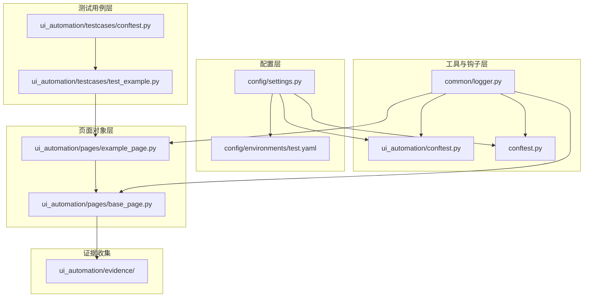
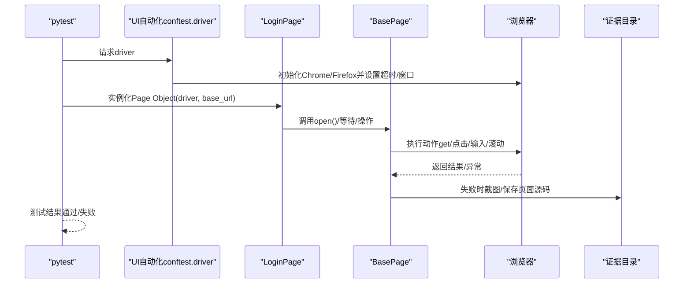
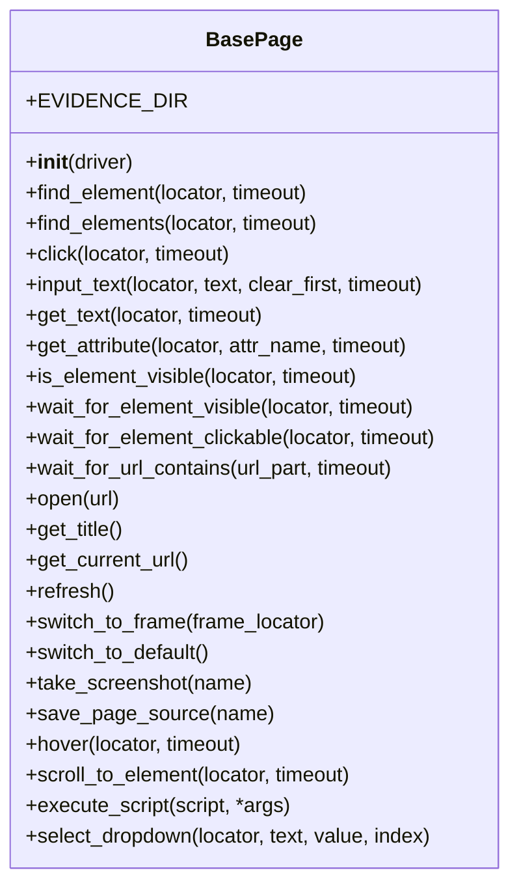
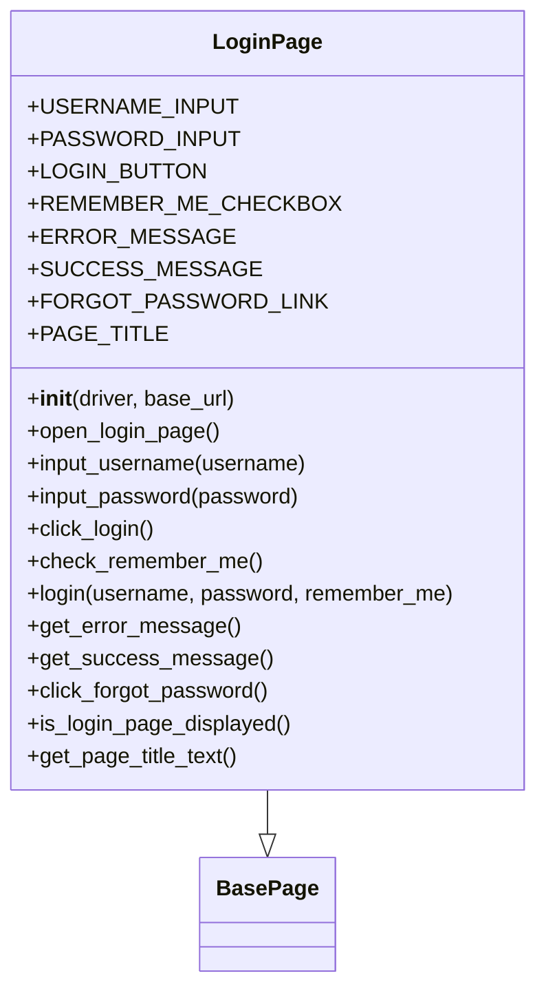
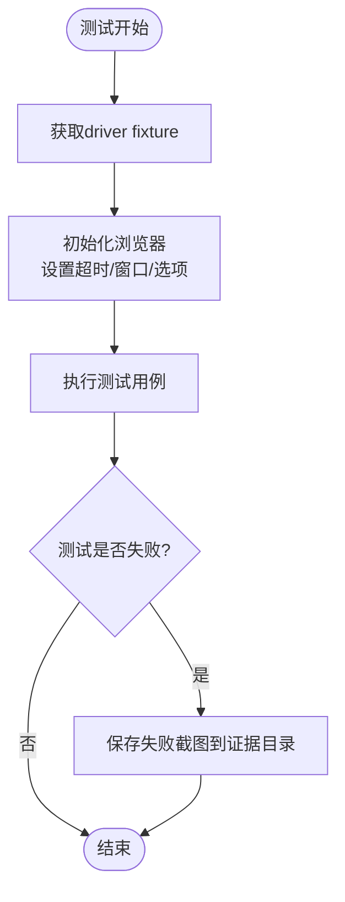
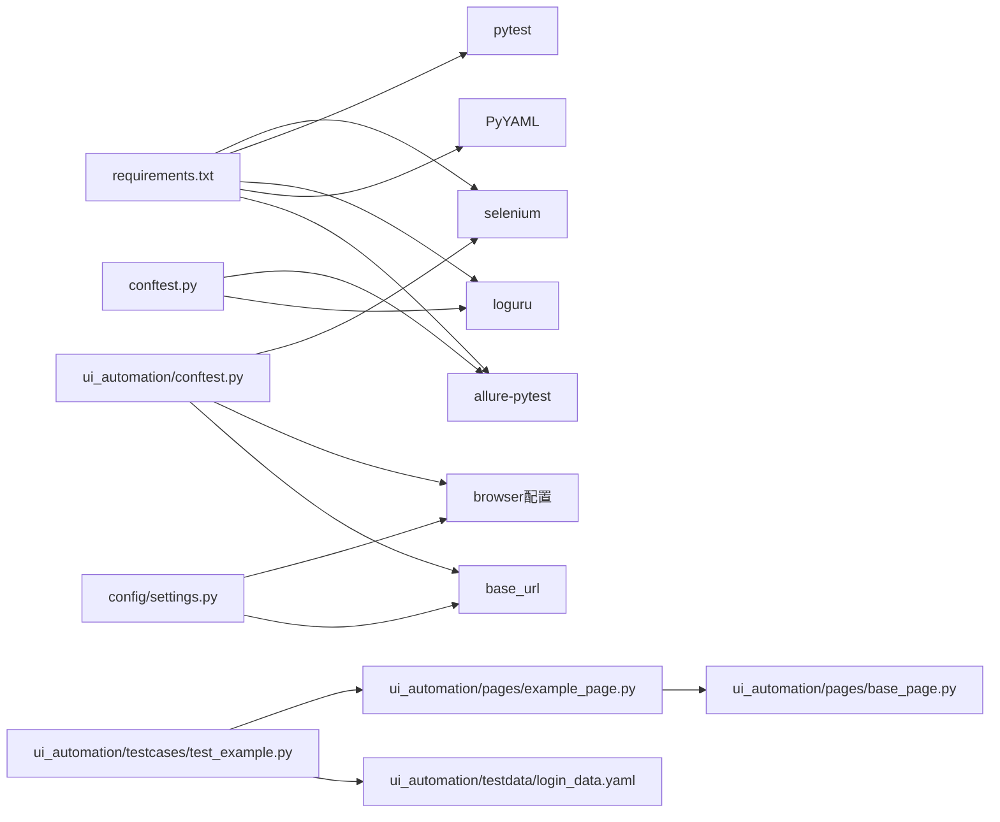

# UI自动化测试问题

<cite>
**本文引用的文件**
- [ui_automation/pages/base_page.py](file://ui_automation/pages/base_page.py)
- [ui_automation/pages/example_page.py](file://ui_automation/pages/example_page.py)
- [ui_automation/testcases/test_example.py](file://ui_automation/testcases/test_example.py)
- [ui_automation/conftest.py](file://ui_automation/conftest.py)
- [conftest.py](file://conftest.py)
- [config/settings.py](file://config/settings.py)
- [config/environments/test.yaml](file://config/environments/test.yaml)
- [common/logger.py](file://common/logger.py)
- [requirements.txt](file://requirements.txt)
- [ui_automation/testdata/login_data.yaml](file://ui_automation/testdata/login_data.yaml)
</cite>

## 目录
1. [简介](#简介)
2. [项目结构](#项目结构)
3. [核心组件](#核心组件)
4. [架构总览](#架构总览)
5. [详细组件分析](#详细组件分析)
6. [依赖分析](#依赖分析)
7. [性能考虑](#性能考虑)
8. [故障排除指南](#故障排除指南)
9. [结论](#结论)
10. [附录](#附录)

## 简介
本指南面向UI自动化测试工程师，聚焦于页面元素定位失败、页面加载超时、浏览器兼容性、截图失败、Selenium WebDriver配置问题、Page Object模式常见错误以及证据收集与跨浏览器兼容性问题的系统化排查与修复建议。文档基于仓库现有实现进行分析，结合日志、截图、等待策略与配置体系，提供可操作的排障步骤与最佳实践。

## 项目结构
UI自动化测试框架采用分层组织：配置层（环境与浏览器配置）、页面对象层（BasePage与具体页面Page Object）、测试用例层（pytest测试类与数据驱动）、工具与钩子层（日志、失败截图、fixture）。证据收集统一落盘至ui_automation/evidence目录，便于问题复现与审计。

**图表来源**
- [config/settings.py:1-104](file://config/settings.py#L1-L104)
- [config/environments/test.yaml:1-31](file://config/environments/test.yaml#L1-L31)
- [ui_automation/pages/base_page.py:1-499](file://ui_automation/pages/base_page.py#L1-L499)
- [ui_automation/pages/example_page.py:1-161](file://ui_automation/pages/example_page.py#L1-L161)
- [ui_automation/testcases/test_example.py:1-161](file://ui_automation/testcases/test_example.py#L1-L161)
- [ui_automation/conftest.py:1-99](file://ui_automation/conftest.py#L1-L99)
- [conftest.py:1-148](file://conftest.py#L1-L148)
- [common/logger.py:1-77](file://common/logger.py#L1-L77)

**章节来源**
- [config/settings.py:1-104](file://config/settings.py#L1-L104)
- [config/environments/test.yaml:1-31](file://config/environments/test.yaml#L1-L31)
- [ui_automation/pages/base_page.py:1-499](file://ui_automation/pages/base_page.py#L1-L499)
- [ui_automation/pages/example_page.py:1-161](file://ui_automation/pages/example_page.py#L1-L161)
- [ui_automation/testcases/test_example.py:1-161](file://ui_automation/testcases/test_example.py#L1-L161)
- [ui_automation/conftest.py:1-99](file://ui_automation/conftest.py#L1-L99)
- [conftest.py:1-148](file://conftest.py#L1-L148)
- [common/logger.py:1-77](file://common/logger.py#L1-L77)

## 核心组件
- BasePage：封装WebDriver常用操作（元素查找、等待、点击、输入、截图、页面源码保存、iframe切换、滚动、JS执行、下拉选择等），内置统一的日志记录与失败截图机制，确保问题可追溯。
- LoginPage：继承BasePage，封装登录页元素定位与业务操作，体现Page Object模式的职责分离与可维护性。
- UI自动化conftest：提供模块级driver fixture（含Chrome/Firefox选项、隐式/页面加载超时、窗口最大化、失败自动截图），统一浏览器配置与生命周期管理。
- 全局conftest：提供pytest钩子（失败自动截图、Allure附件）、marker注册、环境配置注入等。
- Settings与环境配置：集中管理base_url、浏览器配置、账号信息等，支持多环境切换。
- 日志模块：统一输出格式与文件轮转，便于问题定位与审计。

**章节来源**
- [ui_automation/pages/base_page.py:24-499](file://ui_automation/pages/base_page.py#L24-L499)
- [ui_automation/pages/example_page.py:12-161](file://ui_automation/pages/example_page.py#L12-L161)
- [ui_automation/conftest.py:23-99](file://ui_automation/conftest.py#L23-L99)
- [conftest.py:84-126](file://conftest.py#L84-L126)
- [config/settings.py:13-104](file://config/settings.py#L13-L104)
- [common/logger.py:1-77](file://common/logger.py#L1-L77)

## 架构总览
UI自动化测试的典型流程：pytest通过fixtures注入driver与base_url；测试用例实例化Page Object，调用其业务方法；Page Object内部使用BasePage的等待与截图能力；失败时自动截图并记录日志，证据落盘至evidence目录。

**图表来源**
- [ui_automation/conftest.py:23-64](file://ui_automation/conftest.py#L23-L64)
- [ui_automation/pages/example_page.py:38-56](file://ui_automation/pages/example_page.py#L38-L56)
- [ui_automation/pages/base_page.py:280-323](file://ui_automation/pages/base_page.py#L280-L323)
- [ui_automation/pages/base_page.py:354-404](file://ui_automation/pages/base_page.py#L354-L404)

## 详细组件分析

### BasePage组件分析
- 元素定位与等待：提供find_element/find_elements、显式等待可见/可点击、URL包含等待等，统一捕获超时并截图。
- 操作封装：click/input_text/get_text/get_attribute/is_element_visible等，均包含异常捕获与截图。
- 页面与iframe：open/refresh/switch_to_frame/switch_to_default；滚动与JS执行；下拉框选择。
- 证据收集：take_screenshot/save_page_source，失败场景自动落盘。

**图表来源**
- [ui_automation/pages/base_page.py:24-499](file://ui_automation/pages/base_page.py#L24-L499)

**章节来源**
- [ui_automation/pages/base_page.py:44-499](file://ui_automation/pages/base_page.py#L44-L499)

### LoginPage组件分析
- 元素定位器：基于By常量定义页面元素，便于集中维护与替换。
- 业务方法：open_login_page、login、输入用户名/密码、点击登录、勾选记住我、获取错误/成功消息、点击忘记密码、校验页面元素可见性、获取页面标题等。
- 与BasePage的关系：继承BasePage，复用等待、截图、页面操作等能力。

**图表来源**
- [ui_automation/pages/example_page.py:12-161](file://ui_automation/pages/example_page.py#L12-L161)
- [ui_automation/pages/base_page.py:24-499](file://ui_automation/pages/base_page.py#L24-L499)

**章节来源**
- [ui_automation/pages/example_page.py:12-161](file://ui_automation/pages/example_page.py#L12-L161)

### UI自动化conftest与全局conftest
- UI自动化conftest：模块级driver fixture，支持Chrome/Firefox、headless/new、禁用GPU、窗口尺寸、隐式/页面加载超时、窗口最大化；失败自动截图。
- 全局conftest：pytest钩子（失败自动截图+Allure附件）、marker注册、环境配置注入。

**图表来源**
- [ui_automation/conftest.py:23-64](file://ui_automation/conftest.py#L23-L64)
- [conftest.py:84-126](file://conftest.py#L84-L126)

**章节来源**
- [ui_automation/conftest.py:23-99](file://ui_automation/conftest.py#L23-L99)
- [conftest.py:84-126](file://conftest.py#L84-L126)

## 依赖分析
- 测试框架与驱动：pytest、selenium、loguru、PyYAML、allure-pytest。
- 配置依赖：Settings读取config/environments/*.yaml，提供base_url与browser配置。
- 日志依赖：loguru统一输出，控制台与文件双通道。
- 测试数据：login_data.yaml提供数据驱动支撑。

**图表来源**
- [requirements.txt:1-21](file://requirements.txt#L1-L21)
- [config/settings.py:13-104](file://config/settings.py#L13-L104)
- [ui_automation/conftest.py:23-64](file://ui_automation/conftest.py#L23-L64)
- [conftest.py:84-126](file://conftest.py#L84-L126)
- [ui_automation/pages/base_page.py:24-499](file://ui_automation/pages/base_page.py#L24-L499)
- [ui_automation/pages/example_page.py:12-161](file://ui_automation/pages/example_page.py#L12-L161)
- [ui_automation/testcases/test_example.py:1-161](file://ui_automation/testcases/test_example.py#L1-L161)
- [ui_automation/testdata/login_data.yaml:1-19](file://ui_automation/testdata/login_data.yaml#L1-L19)

**章节来源**
- [requirements.txt:1-21](file://requirements.txt#L1-L21)
- [config/settings.py:13-104](file://config/settings.py#L13-L104)
- [ui_automation/conftest.py:23-64](file://ui_automation/conftest.py#L23-L64)
- [conftest.py:84-126](file://conftest.py#L84-L126)
- [ui_automation/pages/base_page.py:24-499](file://ui_automation/pages/base_page.py#L24-L499)
- [ui_automation/pages/example_page.py:12-161](file://ui_automation/pages/example_page.py#L12-L161)
- [ui_automation/testcases/test_example.py:1-161](file://ui_automation/testcases/test_example.py#L1-L161)
- [ui_automation/testdata/login_data.yaml:1-19](file://ui_automation/testdata/login_data.yaml#L1-L19)

## 性能考虑
- 等待策略：显式等待优于硬编码sleep；合理设置隐式/页面加载超时，避免过长等待影响吞吐。
- 浏览器选项：headless模式减少资源占用；禁用GPU与沙盒参数提升稳定性；固定窗口尺寸降低布局抖动。
- 截图与页面源码：仅在失败时触发，避免频繁I/O；证据目录统一管理，定期清理。
- 并行执行：pytest-xdist支持分布式执行，需注意共享资源与状态隔离。

[本节为通用指导，无需特定文件引用]

## 故障排除指南

### 一、页面元素定位失败
- CSS选择器失效
  - 症状：find_element/find_elements超时，日志记录“查找元素超时”并截图。
  - 排查要点：
    - 检查定位器是否随页面更新而变化；确认By类型与值是否匹配。
    - 在浏览器开发者工具中验证选择器唯一性与可见性。
    - 使用BasePage的显式等待（presence/visible/clickable）替代硬等待。
  - 处置建议：
    - 更新LoginPage中的定位器；必要时拆分复杂选择器，增加层级或使用更稳定的属性。
    - 对动态元素增加wait_for_element_visible或wait_for_element_clickable。
- XPath表达式错误
  - 症状：XPath解析异常或返回空集合。
  - 排查要点：
    - 使用浏览器控制台验证XPath结果；避免绝对路径，优先相对路径与稳定属性。
    - 检查是否存在iframe嵌套导致的上下文问题。
  - 处置建议：
    - 将XPath改为更健壮的选择器（如By.CSS_SELECTOR）；或在切换到正确frame后再定位。
- 动态元素加载超时
  - 症状：元素存在但不可见/不可点击，等待超时。
  - 排查要点：
    - 检查网络与前端渲染逻辑；确认等待条件是否为visibility_of_element_located或element_to_be_clickable。
  - 处置建议：
    - 提高等待超时；在BasePage中针对不同场景选择合适的EC条件；必要时结合scroll_to_element确保元素进入视窗。

**章节来源**
- [ui_automation/pages/base_page.py:44-92](file://ui_automation/pages/base_page.py#L44-L92)
- [ui_automation/pages/base_page.py:185-254](file://ui_automation/pages/base_page.py#L185-L254)
- [ui_automation/pages/example_page.py:20-36](file://ui_automation/pages/example_page.py#L20-L36)

### 二、页面加载超时
- 症状：open页面失败或URL等待超时，日志记录“打开页面失败/等待URL包含超时”，并截图。
- 排查要点：
  - 检查Settings提供的base_url与网络连通性；确认页面加载超时设置是否过短。
  - 观察wait_for_url_contains的参数是否与目标URL片段一致。
- 处置建议：
  - 调整config/environments/*.yaml中的page_load_timeout；在测试用例中对关键导航增加URL断言与重试。

**章节来源**
- [ui_automation/pages/base_page.py:280-294](file://ui_automation/pages/base_page.py#L280-L294)
- [ui_automation/pages/base_page.py:255-276](file://ui_automation/pages/base_page.py#L255-L276)
- [config/environments/test.yaml:25-31](file://config/environments/test.yaml#L25-L31)

### 三、浏览器兼容性问题
- 症状：不同浏览器行为差异导致定位或交互失败。
- 排查要点：
  - 检查ui_automation/conftest.py中的浏览器选项差异（Chrome/Firefox）；headless/new参数差异。
  - 确认窗口尺寸与禁用GPU参数是否影响布局。
- 处置建议：
  - 在不同环境中分别调整browser配置；必要时为Firefox补充特定选项；优先使用稳定的选择器与等待策略。

**章节来源**
- [ui_automation/conftest.py:35-50](file://ui_automation/conftest.py#L35-L50)
- [config/environments/test.yaml:25-31](file://config/environments/test.yaml#L25-L31)

### 四、截图失败
- 症状：take_screenshot/save_page_source返回空或抛出异常，日志记录“截图保存失败/保存页面源码失败”。
- 排查要点：
  - 检查证据目录权限与磁盘空间；确认driver实例仍处于有效状态。
  - 在全局conftest的失败钩子中观察是否能正常保存。
- 处置建议：
  - 确保证据目录存在且可写；在测试前后检查driver状态；必要时降级为最小化截图策略。

**章节来源**
- [ui_automation/pages/base_page.py:354-404](file://ui_automation/pages/base_page.py#L354-L404)
- [conftest.py:109-124](file://conftest.py#L109-L124)

### 五、Selenium WebDriver配置问题
- 驱动程序版本不匹配
  - 症状：启动浏览器报错或不稳定。
  - 排查要点：
    - 对照requirements.txt中的selenium版本；确保chromedriver/geckodriver与浏览器版本兼容。
  - 处置建议：
    - 使用webdriver-manager自动管理驱动；或手动下载与浏览器匹配的驱动版本。
- 浏览器启动参数配置错误
  - 症状：启动失败、窗口异常或渲染问题。
  - 排查要点：
    - 检查headless/new、禁用GPU、沙盒等参数组合；确认window-size设置是否合理。
  - 处置建议：
    - 在ui_automation/conftest.py中按需启用headless；移除冲突参数；在CI中使用--no-sandbox与--disable-dev-shm-usage。
- 窗口大小设置问题
  - 症状：布局错乱或元素被遮挡。
  - 排查要点：
    - 检查--window-size与maximize_window的使用；确认页面响应式适配。
  - 处置建议：
    - 明确固定窗口尺寸或在测试前执行maximize_window；对关键交互前添加scroll_to_element。

**章节来源**
- [requirements.txt:6-8](file://requirements.txt#L6-L8)
- [ui_automation/conftest.py:35-57](file://ui_automation/conftest.py#L35-L57)
- [conftest.py:45-57](file://conftest.py#L45-L57)

### 六、Page Object模式常见错误
- 元素封装不当
  - 症状：定位器分散在多处，难以维护。
  - 处置建议：
    - 将定位器集中在页面类中（如LoginPage），统一管理；避免在测试用例中直接使用By常量。
- 等待策略配置错误
  - 症状：元素可见但未可点击，或URL未更新即断言。
  - 处置建议：
    - 使用wait_for_element_clickable/wait_for_url_contains；针对不同场景选择EC条件。
- 页面导航逻辑问题
  - 症状：open后未等待页面完全加载，立即断言导致失败。
  - 处置建议：
    - 在open后增加wait_for_element_visible或wait_for_url_contains；在Page Object中封装导航方法。

**章节来源**
- [ui_automation/pages/example_page.py:20-56](file://ui_automation/pages/example_page.py#L20-L56)
- [ui_automation/pages/base_page.py:185-276](file://ui_automation/pages/base_page.py#L185-L276)

### 七、证据收集失败、测试数据加载异常与跨浏览器兼容性
- 证据收集失败
  - 症状：证据目录不存在或无法写入；截图/页面源码保存失败。
  - 处置建议：
    - 确保证据目录存在且有写权限；在BasePage与全局钩子中均做异常捕获与降级处理。
- 测试数据加载异常
  - 症状：login_data.yaml读取失败或字段缺失。
  - 处置建议：
    - 在测试用例中增加数据文件存在性与字段校验；使用try/except捕获异常并记录详细日志。
- 跨浏览器测试兼容性
  - 症状：Chrome与Firefox行为差异导致断言失败。
  - 处置建议：
    - 分别维护browser配置；在测试中区分浏览器类型，针对性调整等待与交互策略；优先使用标准API与稳定选择器。

**章节来源**
- [ui_automation/pages/base_page.py:354-404](file://ui_automation/pages/base_page.py#L354-L404)
- [ui_automation/testcases/test_example.py:24-28](file://ui_automation/testcases/test_example.py#L24-L28)
- [config/environments/test.yaml:25-31](file://config/environments/test.yaml#L25-L31)

## 结论
通过统一的Page Object封装、标准化的等待策略、完善的日志与证据收集机制，以及模块化的浏览器配置与fixture管理，本框架能够有效提升UI自动化测试的稳定性与可维护性。针对定位失败、加载超时、浏览器兼容性与截图失败等常见问题，建议优先从配置一致性、等待策略合理性与证据完整性入手排查，并结合日志与截图快速定位根因。

## 附录
- 关键配置项参考
  - base_url：来自config/settings.py与config/environments/*.yaml
  - browser：type/headless/implicit_wait/page_load_timeout
- 建议的最小可复现步骤
  - 确认环境变量TEST_ENV与对应配置文件存在
  - 使用模块级driver fixture启动浏览器
  - 在LoginPage中调用open_login_page与wait_for_element_visible
  - 失败时检查ui_automation/evidence目录与日志文件

**章节来源**
- [config/settings.py:50-83](file://config/settings.py#L50-L83)
- [config/environments/test.yaml:4-31](file://config/environments/test.yaml#L4-L31)
- [ui_automation/conftest.py:23-64](file://ui_automation/conftest.py#L23-L64)
- [common/logger.py:30-56](file://common/logger.py#L30-L56)