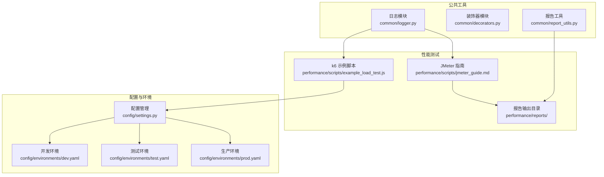
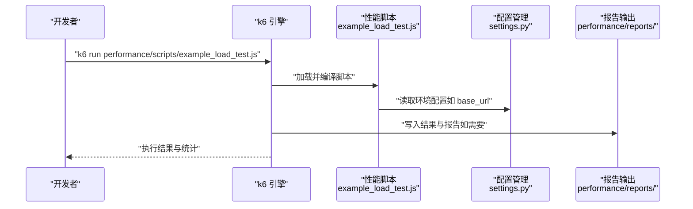
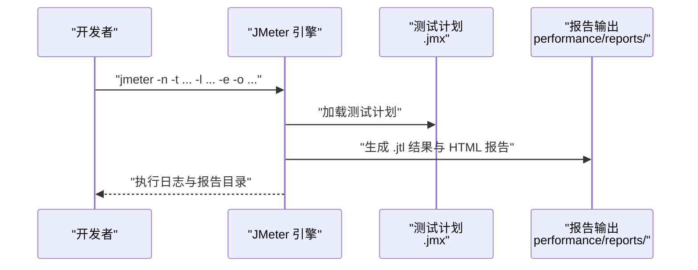
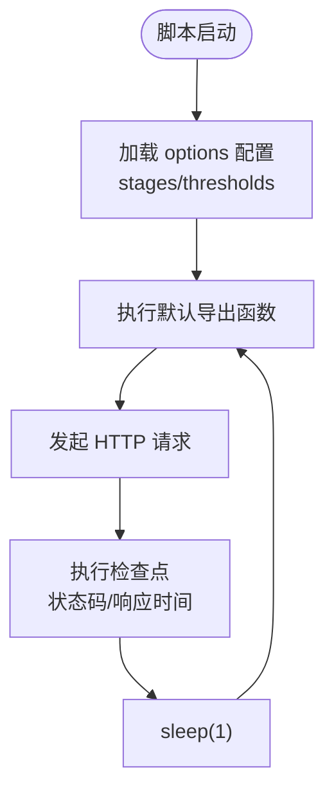
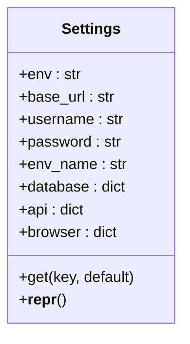
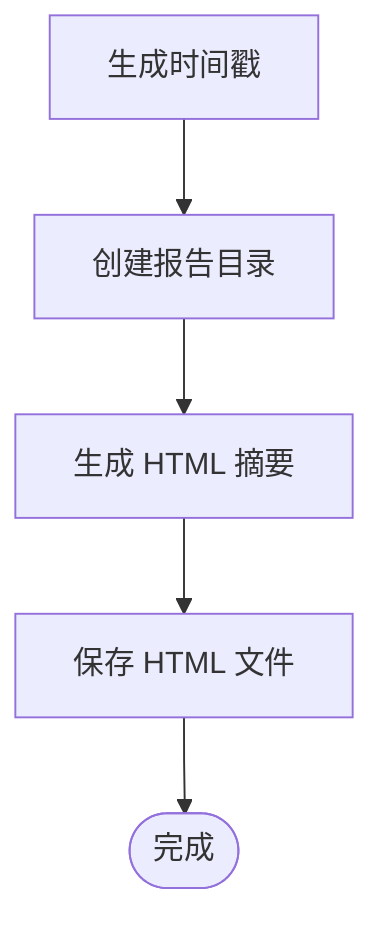
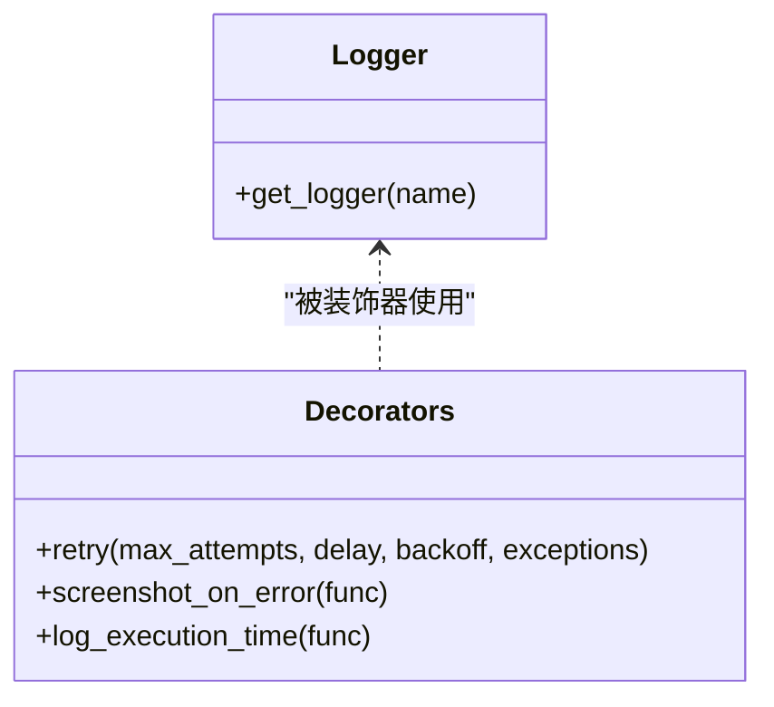
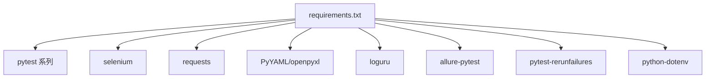

# 性能测试问题

<cite>
**本文引用的文件**
- [example_load_test.js](file://performance/scripts/example_load_test.js)
- [jmeter_guide.md](file://performance/scripts/jmeter_guide.md)
- [report_utils.py](file://common/report_utils.py)
- [settings.py](file://config/settings.py)
- [dev.yaml](file://config/environments/dev.yaml)
- [test.yaml](file://config/environments/test.yaml)
- [prod.yaml](file://config/environments/prod.yaml)
- [logger.py](file://common/logger.py)
- [decorators.py](file://common/decorators.py)
- [getting_started.md](file://docs/getting_started.md)
- [requirements.txt](file://requirements.txt)
- [README.md](file://README.md)
</cite>

## 目录
1. [引言](#引言)
2. [项目结构](#项目结构)
3. [核心组件](#核心组件)
4. [架构总览](#架构总览)
5. [详细组件分析](#详细组件分析)
6. [依赖分析](#依赖分析)
7. [性能考虑](#性能考虑)
8. [故障排除指南](#故障排除指南)
9. [结论](#结论)
10. [附录](#附录)

## 引言
本指南面向性能测试框架使用者，聚焦于以下关键问题：
- k6 脚本编译错误、语法解析失败与模块导入问题的诊断与修复
- 性能测试执行失败（资源限制、内存不足、CPU 使用率过高、网络带宽限制）的定位与缓解
- 性能指标采集异常（采样频率配置错误、数据聚合问题、统计计算偏差）的排查策略
- 性能报告生成失败（文件权限、磁盘空间、格式转换）的处理方法
- JMeter 集成问题（插件安装失败、配置文件格式错误、测试计划执行异常）的排查步骤

本指南结合仓库中的示例脚本、配置与工具模块，提供可操作的排障流程与最佳实践。

## 项目结构
该项目采用分层模块化组织，性能测试相关的核心位置如下：
- 性能脚本与报告：performance/scripts/ 与 performance/reports/
- 配置管理：config/settings.py 与 config/environments/*.yaml
- 报告工具：common/report_utils.py
- 日志与装饰器：common/logger.py 与 common/decorators.py
- 快速上手与依赖：docs/getting_started.md 与 requirements.txt

图表来源
- [example_load_test.js:1-33](file://performance/scripts/example_load_test.js#L1-L33)
- [jmeter_guide.md:1-98](file://performance/scripts/jmeter_guide.md#L1-L98)
- [settings.py:1-104](file://config/settings.py#L1-L104)
- [dev.yaml:1-31](file://config/environments/dev.yaml#L1-L31)
- [test.yaml:1-31](file://config/environments/test.yaml#L1-L31)
- [prod.yaml:1-31](file://config/environments/prod.yaml#L1-L31)
- [logger.py:1-76](file://common/logger.py#L1-L76)
- [decorators.py:1-83](file://common/decorators.py#L1-L83)
- [report_utils.py:1-143](file://common/report_utils.py#L1-L143)

章节来源
- [README.md:1-123](file://README.md#L1-L123)
- [getting_started.md:1-91](file://docs/getting_started.md#L1-L91)

## 核心组件
- k6 示例脚本：包含阶梯式负载配置、阈值与检查点，是性能测试执行入口之一
- JMeter 指南：提供脚本存放、命令行执行、报告生成与注意事项
- 配置管理：通过环境变量切换不同环境配置，提供基础 URL、超时、账号等
- 报告工具：提供时间戳生成、报告目录创建、HTML 报告片段生成与保存
- 日志与装饰器：统一日志输出、异常时截图、执行时间记录与指数退避重试

章节来源
- [example_load_test.js:1-33](file://performance/scripts/example_load_test.js#L1-L33)
- [jmeter_guide.md:1-98](file://performance/scripts/jmeter_guide.md#L1-L98)
- [settings.py:1-104](file://config/settings.py#L1-L104)
- [report_utils.py:1-143](file://common/report_utils.py#L1-L143)
- [logger.py:1-76](file://common/logger.py#L1-L76)
- [decorators.py:1-83](file://common/decorators.py#L1-L83)

## 架构总览
性能测试执行链路概览（k6 与 JMeter 两条路径）：

图表来源
- [example_load_test.js:1-33](file://performance/scripts/example_load_test.js#L1-L33)
- [settings.py:1-104](file://config/settings.py#L1-L104)

图表来源
- [jmeter_guide.md:1-98](file://performance/scripts/jmeter_guide.md#L1-L98)

## 详细组件分析

### k6 示例脚本分析
- 负载配置：包含阶梯式阶段目标与持续时间，适合渐进式压测
- 阈值：针对 p95 响应时间与失败率设定阈值，便于自动化判定
- 检查点：对状态码与响应时间进行断言
- 环境变量：脚本中使用了示例基础 URL，建议通过配置管理模块注入真实地址

图表来源
- [example_load_test.js:1-33](file://performance/scripts/example_load_test.js#L1-L33)

章节来源
- [example_load_test.js:1-33](file://performance/scripts/example_load_test.js#L1-L33)

### JMeter 指南分析
- 脚本存放：要求将 .jmx 放入 performance/scripts/ 目录
- 命令行参数：非 GUI 模式、测试计划路径、结果日志、引擎日志、生成报告与输出目录
- 报告生成：支持从结果文件单独生成 HTML 报告
- 注意事项：输出目录必须为空；结果文件格式需为 CSV；建议文件名含时间戳；建议将 .jtl 与报告目录加入 .gitignore

章节来源
- [jmeter_guide.md:1-98](file://performance/scripts/jmeter_guide.md#L1-L98)

### 配置管理分析
- 环境切换：通过环境变量 TEST_ENV 选择 dev/test/prod
- 配置项：基础 URL、账号、数据库、API、浏览器等
- 错误处理：当配置文件不存在时抛出异常，便于早期发现配置缺失

图表来源
- [settings.py:1-104](file://config/settings.py#L1-L104)

章节来源
- [settings.py:1-104](file://config/settings.py#L1-L104)
- [dev.yaml:1-31](file://config/environments/dev.yaml#L1-L31)
- [test.yaml:1-31](file://config/environments/test.yaml#L1-L31)
- [prod.yaml:1-31](file://config/environments/prod.yaml#L1-L31)

### 报告工具分析
- 时间戳生成：支持多种格式，便于报告命名与归档
- 目录创建：自动创建带时间戳的报告目录
- HTML 报告片段：生成包含用例总数、通过/失败/跳过与通过率的摘要
- 保存：确保目录存在后写入文件

图表来源
- [report_utils.py:1-143](file://common/report_utils.py#L1-L143)

章节来源
- [report_utils.py:1-143](file://common/report_utils.py#L1-L143)

### 日志与装饰器分析
- 日志：统一控制台与文件输出，按天轮转，保留 7 天
- 装饰器：重试（指数退避）、异常截图、执行时间记录

图表来源
- [logger.py:1-76](file://common/logger.py#L1-L76)
- [decorators.py:1-83](file://common/decorators.py#L1-L83)

章节来源
- [logger.py:1-76](file://common/logger.py#L1-L76)
- [decorators.py:1-83](file://common/decorators.py#L1-L83)

## 依赖分析
- 测试框架与工具：pytest、pytest-html、pytest-xdist、loguru、allure-pytest、pytest-rerunfailures、python-dotenv
- Web UI 自动化：selenium
- 接口测试：requests
- 数据处理：PyYAML、openpyxl

图表来源
- [requirements.txt:1-25](file://requirements.txt#L1-L25)

章节来源
- [requirements.txt:1-25](file://requirements.txt#L1-L25)

## 性能考虑
- 资源限制：k6 与 JMeter 的并发线程/虚拟用户数应与目标系统能力匹配，避免超出 CPU/内存/网络上限
- 内存与 CPU：监控执行期间的资源占用，必要时降低并发或缩短压测时长
- 网络带宽：关注外部依赖（如第三方服务）的带宽与延迟，避免成为瓶颈
- 采样频率：k6 默认采样粒度较细，长时间压测可能产生大量数据，需评估存储与后续聚合成本
- 报告生成：JMeter 生成 HTML 报告时需保证输出目录可用且为空，避免因权限或磁盘空间导致失败

[本节为通用指导，无需特定文件引用]

## 故障排除指南

### k6 脚本编译错误与语法解析失败
- 症状
  - 编译阶段报错，无法启动
  - 语法高亮或静态检查工具提示错误
- 诊断步骤
  - 检查脚本是否符合 k6 ESModule 规范（如导入语句、导出函数）
  - 确认 options 配置语法正确（stages、thresholds）
  - 校验检查点与断言语法
- 修复建议
  - 使用编辑器的 k6/ESLint 插件进行语法校验
  - 将示例脚本作为基准逐项比对
  - 确保导入模块路径正确（如 k6/http）

章节来源
- [example_load_test.js:1-33](file://performance/scripts/example_load_test.js#L1-L33)

### k6 模块导入问题
- 症状
  - 导入语句报错（如找不到模块）
- 诊断步骤
  - 确认 k6 版本支持所需模块
  - 检查脚本中导入路径是否与 k6 内置模块一致
- 修复建议
  - 参考官方模块清单，修正导入语句
  - 如需自定义模块，确认打包与路径配置

章节来源
- [example_load_test.js:1-33](file://performance/scripts/example_load_test.js#L1-L33)

### 性能测试执行失败（资源限制）
- 症状
  - 执行中断、进程被杀、结果异常
- 诊断步骤
  - 监控 CPU、内存、磁盘 IO、网络带宽
  - 检查目标系统健康状况与限流策略
- 修复建议
  - 降低并发或缩短压测时长
  - 分批执行，避开业务高峰期
  - 优化被测接口，减少不必要的资源消耗

[本小节为通用指导，无需特定文件引用]

### 内存不足
- 症状
  - 执行过程中 OOM 或频繁 GC
- 诊断步骤
  - 查看系统内存曲线与 k6/JMeter 的内存占用
- 修复建议
  - 减少并发、缩短采样周期或降低数据量
  - 调整 JVM/k6 的堆大小参数（如适用）

[本小节为通用指导，无需特定文件引用]

### CPU 使用率过高
- 症状
  - CPU 占用接近 100%，系统卡顿
- 诊断步骤
  - 识别热点线程与调用栈
- 修复建议
  - 降低并发、合并请求、减少重计算
  - 优化被测应用的 CPU 密集型逻辑

[本小节为通用指导，无需特定文件引用]

### 网络带宽限制
- 症状
  - 响应时间抖动大、吞吐量下降
- 诊断步骤
  - 监控网络上下行速率与丢包
- 修复建议
  - 优化请求体大小与压缩策略
  - 使用本地化测试环境或 CDN 缓存

[本小节为通用指导，无需特定文件引用]

### 性能指标采集异常
- 采样频率配置错误
  - 症状：数据稀疏或过于密集，影响分析
  - 修复：根据场景调整采样粒度，平衡精度与开销
- 数据聚合问题
  - 症状：聚合结果不一致或缺失
  - 修复：核对聚合维度与时间窗口，确保数据完整性
- 统计计算偏差
  - 症状：p95/p99 偏离预期
  - 修复：检查极端值剔除策略与样本数量

[本小节为通用指导，无需特定文件引用]

### 性能报告生成失败
- 文件权限问题
  - 症状：无法写入 reports 目录
  - 修复：授予写权限或切换到有权限的用户
- 磁盘空间不足
  - 症状：写入失败或中途停止
  - 修复：清理磁盘或扩大容量
- 报告格式转换错误（JMeter）
  - 症状：生成 HTML 报告时报错
  - 修复：确保 jmeter.properties 中输出格式为 CSV，且输出目录为空

章节来源
- [jmeter_guide.md:92-98](file://performance/scripts/jmeter_guide.md#L92-L98)

### JMeter 集成问题
- 插件安装失败
  - 症状：缺少监听器或聚合报告插件
  - 修复：使用 JMeter 官方插件管理器安装所需插件
- 配置文件格式错误
  - 症状：加载 .jmx 失败或执行异常
  - 修复：使用 JMeter 自带校验功能，确保 XML 结构与字段正确
- 测试计划执行异常
  - 症状：结果文件为空或报告目录不存在
  - 修复：遵循指南中的参数与目录约定，确保输出路径存在且为空

章节来源
- [jmeter_guide.md:1-98](file://performance/scripts/jmeter_guide.md#L1-L98)

### 环境配置相关问题
- 症状：脚本使用了错误的基础 URL 或超时设置
- 诊断步骤：检查环境变量 TEST_ENV 与对应 YAML 文件
- 修复建议：在 config/environments/ 下创建或修正对应环境文件，并设置 TEST_ENV

章节来源
- [settings.py:1-104](file://config/settings.py#L1-L104)
- [dev.yaml:1-31](file://config/environments/dev.yaml#L1-L31)
- [test.yaml:1-31](file://config/environments/test.yaml#L1-L31)
- [prod.yaml:1-31](file://config/environments/prod.yaml#L1-L31)

### 日志与可观测性辅助
- 使用统一日志模块输出关键事件，便于回溯
- 对关键流程添加执行时间记录与异常截图装饰器，提升定位效率

章节来源
- [logger.py:1-76](file://common/logger.py#L1-L76)
- [decorators.py:1-83](file://common/decorators.py#L1-L83)

## 结论
本指南提供了从脚本编写、执行到报告生成的全链路排障思路。建议在执行前明确目标系统边界与资源上限，合理设置并发与采样策略，并通过日志与装饰器增强可观测性。遇到问题时，优先从环境配置、资源限制与报告输出三个维度入手排查，结合示例脚本与指南文档快速定位并修复。

[本节为总结，无需特定文件引用]

## 附录
- 快速上手与依赖安装参考：[getting_started.md:1-91](file://docs/getting_started.md#L1-L91)，[requirements.txt:1-25](file://requirements.txt#L1-L25)
- 项目结构与模块说明参考：[README.md:1-123](file://README.md#L1-L123)

[本节为补充信息，无需特定文件引用]