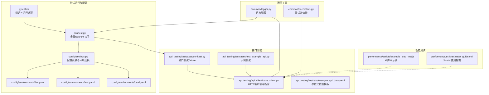
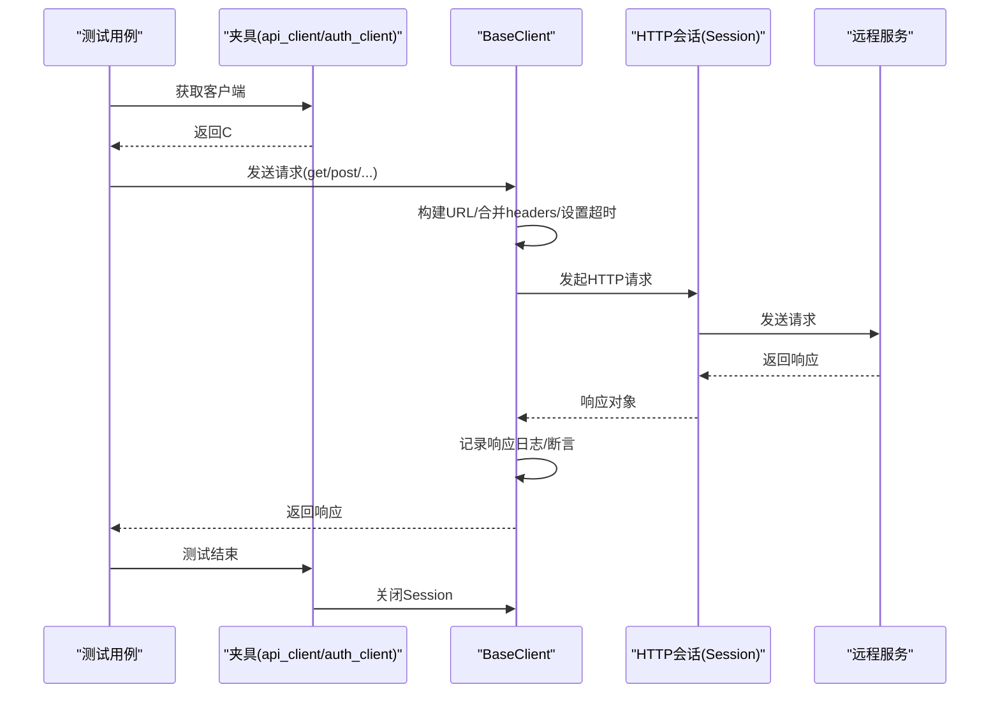
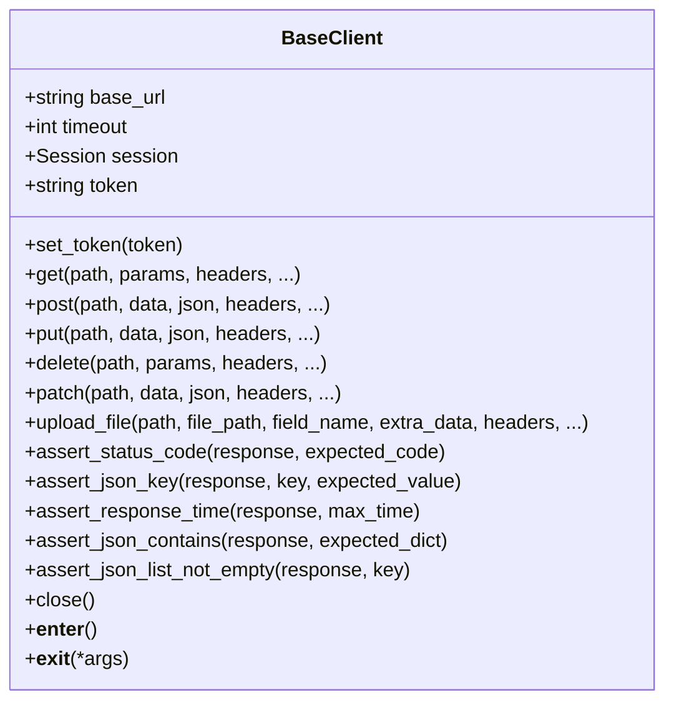
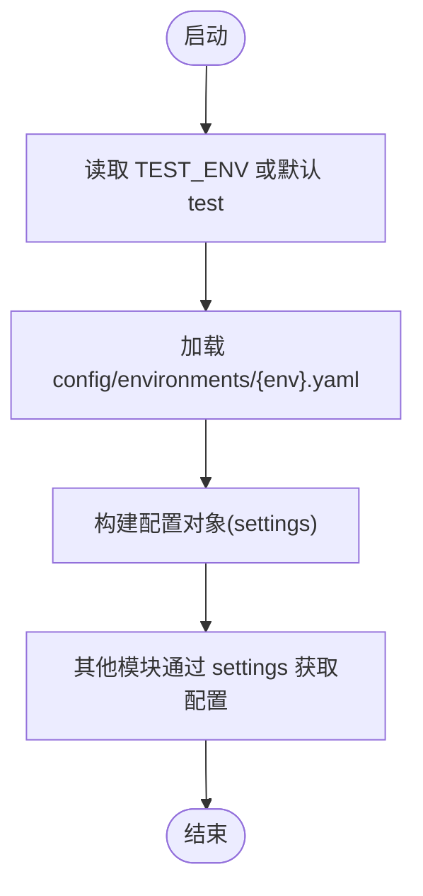
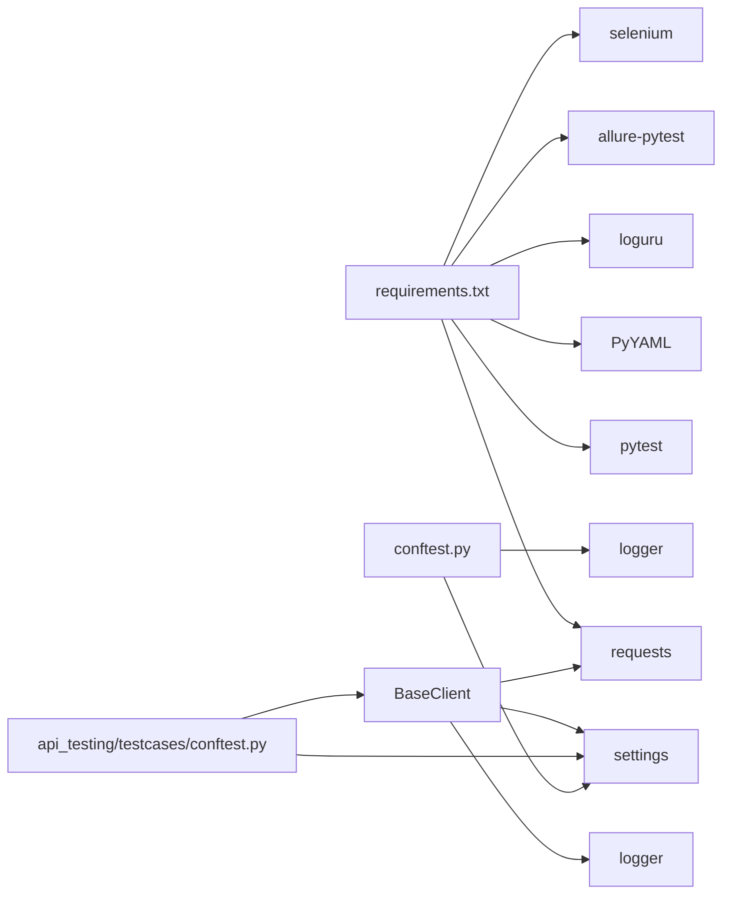

# 接口测试问题

<cite>
**本文引用的文件**
- [README.md](file://README.md)
- [requirements.txt](file://requirements.txt)
- [pytest.ini](file://pytest.ini)
- [conftest.py](file://conftest.py)
- [config/settings.py](file://config/settings.py)
- [config/environments/dev.yaml](file://config/environments/dev.yaml)
- [config/environments/test.yaml](file://config/environments/test.yaml)
- [config/environments/prod.yaml](file://config/environments/prod.yaml)
- [common/logger.py](file://common/logger.py)
- [api_testing/api_client/base_client.py](file://api_testing/api_client/base_client.py)
- [api_testing/testcases/conftest.py](file://api_testing/testcases/conftest.py)
- [api_testing/testcases/test_example_api.py](file://api_testing/testcases/test_example_api.py)
- [api_testing/testdata/example_api_data.yaml](file://api_testing/testdata/example_api_data.yaml)
- [performance/scripts/example_load_test.js](file://performance/scripts/example_load_test.js)
- [performance/scripts/jmeter_guide.md](file://performance/scripts/jmeter_guide.md)
- [common/decorators.py](file://common/decorators.py)
</cite>

## 目录
1. [引言](#引言)
2. [项目结构](#项目结构)
3. [核心组件](#核心组件)
4. [架构总览](#架构总览)
5. [详细组件分析](#详细组件分析)
6. [依赖分析](#依赖分析)
7. [性能考虑](#性能考虑)
8. [故障排除指南](#故障排除指南)
9. [结论](#结论)
10. [附录](#附录)

## 引言
本文件面向接口测试框架的使用者与维护者，聚焦于接口测试过程中常见的问题与排障方法，覆盖以下主题：
- HTTP请求失败：网络连接超时、DNS解析错误、SSL证书验证失败、代理配置问题
- 认证失败：Token过期、API密钥错误、OAuth流程异常、会话管理问题
- 响应数据解析错误：JSON格式错误、XML解析异常、编码问题、数据类型转换失败
- 断言失败：期望值配置错误、时间窗口设置不当、数据精度比较问题
- 并发问题、重试机制配置与超时设置优化的最佳实践

本指南结合代码库中的实现细节，提供可操作的定位思路与修复建议。

## 项目结构
该测试框架采用模块化组织，接口测试位于 api_testing 子目录，配置集中于 config，日志与通用工具位于 common，性能测试位于 performance，UI自动化位于 ui_automation。pytest 作为测试运行器，支持标记化运行与并行执行。

**图表来源**
- [pytest.ini:1-12](file://pytest.ini#L1-L12)
- [conftest.py:1-148](file://conftest.py#L1-L148)
- [config/settings.py:1-104](file://config/settings.py#L1-L104)
- [config/environments/dev.yaml:1-31](file://config/environments/dev.yaml#L1-L31)
- [config/environments/test.yaml:1-31](file://config/environments/test.yaml#L1-L31)
- [config/environments/prod.yaml:1-31](file://config/environments/prod.yaml#L1-L31)
- [api_testing/api_client/base_client.py:1-308](file://api_testing/api_client/base_client.py#L1-L308)
- [api_testing/testcases/conftest.py:1-80](file://api_testing/testcases/conftest.py#L1-L80)
- [api_testing/testcases/test_example_api.py:1-167](file://api_testing/testcases/test_example_api.py#L1-L167)
- [api_testing/testdata/example_api_data.yaml:1-116](file://api_testing/testdata/example_api_data.yaml#L1-L116)
- [common/logger.py:1-77](file://common/logger.py#L1-L77)
- [common/decorators.py:1-42](file://common/decorators.py#L1-L42)
- [performance/scripts/example_load_test.js:1-33](file://performance/scripts/example_load_test.js#L1-L33)
- [performance/scripts/jmeter_guide.md:1-98](file://performance/scripts/jmeter_guide.md#L1-L98)

**章节来源**
- [README.md:1-123](file://README.md#L1-L123)
- [pytest.ini:1-12](file://pytest.ini#L1-L12)
- [conftest.py:1-148](file://conftest.py#L1-L148)
- [config/settings.py:1-104](file://config/settings.py#L1-L104)

## 核心组件
- 配置系统：通过 Settings 类按环境读取 YAML 配置，提供 base_url、api、browser 等配置项；支持 TEST_ENV 环境变量切换。
- 日志系统：基于 loguru，统一控制台与文件输出，便于定位问题。
- 接口客户端：BaseClient 封装 HTTP 请求、Session 管理、Token 认证、请求/响应日志、断言工具与异常处理。
- 测试夹具：api_testing/testcases/conftest.py 提供无认证与带 Token 的客户端夹具，自动关闭连接。
- 断言工具：内置状态码、JSON键、响应时间、JSON子集匹配、列表非空等断言方法。
- 重试机制：通用装饰器提供指数退避重试能力，可用于外部扩展或业务层包装。

**章节来源**
- [config/settings.py:1-104](file://config/settings.py#L1-L104)
- [common/logger.py:1-77](file://common/logger.py#L1-L77)
- [api_testing/api_client/base_client.py:1-308](file://api_testing/api_client/base_client.py#L1-L308)
- [api_testing/testcases/conftest.py:1-80](file://api_testing/testcases/conftest.py#L1-L80)
- [common/decorators.py:1-42](file://common/decorators.py#L1-L42)

## 架构总览
接口测试的整体流程如下：测试用例通过夹具获取 BaseClient，构造请求并发送；客户端负责拼接URL、设置超时、记录日志、捕获异常；断言方法对响应进行校验；配置系统决定基础URL与超时等参数；日志系统输出请求/响应详情与异常信息。

**图表来源**
- [api_testing/testcases/conftest.py:16-71](file://api_testing/testcases/conftest.py#L16-L71)
- [api_testing/api_client/base_client.py:91-134](file://api_testing/api_client/base_client.py#L91-L134)
- [api_testing/api_client/base_client.py:296-308](file://api_testing/api_client/base_client.py#L296-L308)

## 详细组件分析

### BaseClient 组件分析
- 职责：封装HTTP请求、Session管理、Token认证、请求/响应日志、断言工具、异常处理。
- 关键点：
  - URL拼接与路径规范化，避免重复斜杠。
  - 超时设置优先级：调用方覆盖 > 客户端默认 > 配置。
  - headers合并策略：自定义headers覆盖默认headers中的同名字段。
  - 异常捕获：Timeout、ConnectionError、RequestException分别记录与抛出。
  - 断言方法：状态码、JSON键存在与值匹配、响应时间、JSON子集匹配、列表非空。
  - 文件上传：multipart/form-data，自动移除Content-Type以让requests正确设置。

**图表来源**
- [api_testing/api_client/base_client.py:18-308](file://api_testing/api_client/base_client.py#L18-L308)

**章节来源**
- [api_testing/api_client/base_client.py:1-308](file://api_testing/api_client/base_client.py#L1-L308)

### 配置与环境切换
- Settings 类按 TEST_ENV 读取对应 YAML 文件，提供 base_url、api、browser 等属性访问。
- api_testing/testcases/conftest.py 中的 auth_client 可从配置读取 token，或预留登录获取 token 的扩展点。

**图表来源**
- [config/settings.py:26-48](file://config/settings.py#L26-L48)
- [config/environments/dev.yaml:19-24](file://config/environments/dev.yaml#L19-L24)
- [config/environments/test.yaml:19-24](file://config/environments/test.yaml#L19-L24)
- [config/environments/prod.yaml:19-24](file://config/environments/prod.yaml#L19-L24)
- [api_testing/testcases/conftest.py:45-67](file://api_testing/testcases/conftest.py#L45-L67)

**章节来源**
- [config/settings.py:1-104](file://config/settings.py#L1-L104)
- [api_testing/testcases/conftest.py:1-80](file://api_testing/testcases/conftest.py#L1-L80)

### 日志与报告
- 日志：统一控制台(INFO及以上)与文件(DEBUG及以上，按天轮转，保留7天)输出，模块名绑定，便于定位。
- 报告：pytest.ini 配置 HTML 报告输出路径，pytest-html 生成测试报告。

**章节来源**
- [common/logger.py:1-77](file://common/logger.py#L1-L77)
- [pytest.ini:6-6](file://pytest.ini#L6-L6)

## 依赖分析
- 运行时依赖：pytest、requests、PyYAML、loguru、allure-pytest、selenium 等。
- 组件耦合：
  - BaseClient 依赖 requests、config.settings、common.logger。
  - 夹具依赖 BaseClient 与 settings。
  - 全局 conftest 依赖 settings 与 logger，并提供 UI 自动化 driver 与失败截图钩子。

**图表来源**
- [requirements.txt:1-21](file://requirements.txt#L1-L21)
- [api_testing/api_client/base_client.py:5-15](file://api_testing/api_client/base_client.py#L5-L15)
- [api_testing/testcases/conftest.py:11-13](file://api_testing/testcases/conftest.py#L11-L13)
- [conftest.py:19-22](file://conftest.py#L19-L22)

**章节来源**
- [requirements.txt:1-21](file://requirements.txt#L1-L21)
- [api_testing/api_client/base_client.py:1-308](file://api_testing/api_client/base_client.py#L1-L308)
- [api_testing/testcases/conftest.py:1-80](file://api_testing/testcases/conftest.py#L1-L80)
- [conftest.py:1-148](file://conftest.py#L1-L148)

## 性能考虑
- 超时设置：客户端默认超时来自配置；可在请求调用时覆盖。合理设置有助于快速失败与资源回收。
- 并发与并行：pytest-xdist 支持并行执行；注意共享资源（如文件、端口）的隔离。
- 重试策略：通用装饰器提供指数退避重试，适合对外部不稳定因素（网络抖动）进行补偿。
- 性能测试：k6 与 JMeter 分别用于负载与压力测试，建议结合阈值与报告输出规范进行评估。

**章节来源**
- [api_testing/api_client/base_client.py:28-102](file://api_testing/api_client/base_client.py#L28-L102)
- [pytest.ini:4-6](file://pytest.ini#L4-L6)
- [common/decorators.py:16-42](file://common/decorators.py#L16-L42)
- [performance/scripts/example_load_test.js:1-33](file://performance/scripts/example_load_test.js#L1-L33)
- [performance/scripts/jmeter_guide.md:1-98](file://performance/scripts/jmeter_guide.md#L1-L98)

## 故障排除指南

### 一、HTTP请求失败

#### 1. 网络连接超时
- 现象：日志出现“请求超时”错误，响应耗时接近或超过超时阈值。
- 排查步骤：
  - 检查客户端超时设置是否合理；确认调用方是否覆盖默认超时。
  - 检查网络连通性与目标服务可用性。
  - 观察日志中“耗时”字段，确认是否为服务端处理慢导致。
- 修复建议：
  - 适当增大超时阈值；对关键接口设置更短超时以快速失败。
  - 使用重试装饰器对外部不稳定因素进行补偿。

**章节来源**
- [api_testing/api_client/base_client.py:122-125](file://api_testing/api_client/base_client.py#L122-L125)
- [api_testing/api_client/base_client.py:101-102](file://api_testing/api_client/base_client.py#L101-L102)
- [common/decorators.py:16-42](file://common/decorators.py#L16-L42)

#### 2. DNS解析错误
- 现象：日志出现“连接错误”，通常伴随域名无法解析。
- 排查步骤：
  - 确认 base_url 配置正确；检查环境切换是否符合预期。
  - 在测试机上使用 nslookup/dig 或 ping 验证域名解析。
- 修复建议：
  - 使用IP直连或更新DNS；修正配置文件中的 base_url。

**章节来源**
- [config/settings.py:34-48](file://config/settings.py#L34-L48)
- [config/environments/dev.yaml:5-5](file://config/environments/dev.yaml#L5-L5)
- [config/environments/test.yaml:5-5](file://config/environments/test.yaml#L5-L5)
- [config/environments/prod.yaml:5-5](file://config/environments/prod.yaml#L5-L5)

#### 3. SSL证书验证失败
- 现象：HTTPS请求报证书相关错误。
- 排查步骤：
  - 确认目标服务证书有效且受信任。
  - 如为自签证书，需在测试环境中正确配置信任链。
- 修复建议：
  - 更新系统/浏览器信任存储；或在测试环境中禁用严格校验（不推荐用于生产）。

[本小节为通用指导，无需特定文件引用]

#### 4. 代理配置问题
- 现象：通过代理访问外部服务失败。
- 排查步骤：
  - 检查系统/IDE/终端代理设置是否生效。
  - 确认 requests 会话未被意外覆盖代理配置。
- 修复建议：
  - 显式在请求头中添加代理相关字段或在系统层正确配置。

[本小节为通用指导，无需特定文件引用]

### 二、认证失败

#### 1. Token过期
- 现象：401/403，响应体提示令牌无效或过期。
- 排查步骤：
  - 检查 auth_client 是否正确设置了 token；确认 token 生命周期。
  - 若使用登录接口获取 token，确认登录流程与响应结构。
- 修复建议：
  - 在测试夹具中增加 token 刷新逻辑；或在用例中显式重新登录获取新 token。

**章节来源**
- [api_testing/testcases/conftest.py:45-70](file://api_testing/testcases/conftest.py#L45-L70)
- [api_testing/api_client/base_client.py:41-44](file://api_testing/api_client/base_client.py#L41-L44)

#### 2. API密钥错误
- 现象：401/403，服务端拒绝访问。
- 排查步骤：
  - 检查配置文件中的密钥是否正确；确认是否混用了不同环境的密钥。
- 修复建议：
  - 使用 TEST_ENV 切换到正确环境；核对密钥有效期与权限范围。

**章节来源**
- [config/settings.py:34-48](file://config/settings.py#L34-L48)

#### 3. OAuth流程异常
- 现象：授权码/令牌交换失败，返回错误码。
- 排查步骤：
  - 检查回调地址、作用域、客户端凭证是否一致。
  - 查看授权服务器日志与重定向行为。
- 修复建议：
  - 在测试夹具中补充授权流程或使用预置的短期令牌。

[本小节为通用指导，无需特定文件引用]

#### 4. 会话管理问题
- 现象：跨请求丢失会话状态，导致鉴权失败。
- 排查步骤：
  - 确认 BaseClient 使用 Session 保持连接与Cookie。
  - 避免在测试间复用同一客户端实例引发状态污染。
- 修复建议：
  - 每个测试使用独立客户端实例；测试结束后主动关闭 Session。

**章节来源**
- [api_testing/api_client/base_client.py:29-298](file://api_testing/api_client/base_client.py#L29-L298)
- [api_testing/testcases/conftest.py:26-29](file://api_testing/testcases/conftest.py#L26-L29)

### 三、响应数据解析错误

#### 1. JSON格式错误
- 现象：断言 response.json() 失败，抛出 JSONDecodeError。
- 排查步骤：
  - 查看响应体文本日志，确认是否为HTML或其他格式。
  - 检查 Content-Type 是否为 application/json。
- 修复建议：
  - 在断言前先判断响应类型；必要时使用自定义解析器或降级方案。

**章节来源**
- [api_testing/api_client/base_client.py:84-89](file://api_testing/api_client/base_client.py#L84-L89)
- [api_testing/api_client/base_client.py:251-255](file://api_testing/api_client/base_client.py#L251-L255)

#### 2. XML解析异常
- 现象：服务端返回XML但测试按JSON解析。
- 排查步骤：
  - 检查 Accept/Content-Type 是否匹配。
- 修复建议：
  - 使用合适的解析库或在断言前判断响应格式。

[本小节为通用指导，无需特定文件引用]

#### 3. 编码问题
- 现象：中文乱码或解析异常。
- 排查步骤：
  - 确认响应头 Content-Type 中的 charset 设置。
  - 检查日志中响应体文本长度与截断情况。
- 修复建议：
  - 显式设置请求头 Accept-Charset；或在解析前按正确编码解码。

**章节来源**
- [api_testing/api_client/base_client.py:84-89](file://api_testing/api_client/base_client.py#L84-L89)

#### 4. 数据类型转换失败
- 现象：断言期望值与实际值类型不一致（如字符串与数字）。
- 排查步骤：
  - 使用断言工具时明确期望类型；或在断言前进行显式转换。
- 修复建议：
  - 在断言前统一数据类型；对数值比较使用容差范围。

**章节来源**
- [api_testing/api_client/base_client.py:251-255](file://api_testing/api_client/base_client.py#L251-L255)
- [api_testing/api_client/base_client.py:274-278](file://api_testing/api_client/base_client.py#L274-L278)

### 四、断言失败

#### 1. 期望值配置错误
- 现象：断言 key 值不匹配。
- 排查步骤：
  - 对照接口文档与实际响应，核对期望值。
  - 使用断言工具查看实际值与类型。
- 修复建议：
  - 更新期望值；或在断言前进行数据清洗与类型转换。

**章节来源**
- [api_testing/api_client/base_client.py:251-255](file://api_testing/api_client/base_client.py#L251-L255)
- [api_testing/api_client/base_client.py:274-278](file://api_testing/api_client/base_client.py#L274-L278)

#### 2. 时间窗口设置不当
- 现象：assert_response_time 失败。
- 排查步骤：
  - 检查 max_time 是否过严；观察日志中的响应耗时。
- 修复建议：
  - 根据接口SLA调整阈值；对慢接口单独标注。

**章节来源**
- [api_testing/api_client/base_client.py:258-265](file://api_testing/api_client/base_client.py#L258-L265)

#### 3. 数据精度比较问题
- 现象：浮点数比较失败。
- 排查步骤：
  - 对数值型字段使用容差比较或四舍五入。
- 修复建议：
  - 在断言前进行精度对齐；或使用近似相等断言。

[本小节为通用指导，无需特定文件引用]

### 五、并发问题、重试机制与超时优化

#### 1. 并发问题
- 现象：并行执行时资源竞争、状态污染。
- 排查步骤：
  - 检查是否共享了全局状态（如全局客户端实例）。
- 修复建议：
  - 使用函数级/会话级夹具；避免跨用例共享可变状态。

**章节来源**
- [api_testing/testcases/conftest.py:26-29](file://api_testing/testcases/conftest.py#L26-L29)
- [conftest.py:141-147](file://conftest.py#L141-L147)

#### 2. 重试机制配置
- 现象：网络抖动导致偶发失败。
- 排查步骤：
  - 使用重试装饰器包裹不稳定操作；观察重试日志。
- 修复建议：
  - 合理设置最大重试次数与退避间隔；仅对幂等操作使用重试。

**章节来源**
- [common/decorators.py:16-42](file://common/decorators.py#L16-L42)

#### 3. 超时设置优化
- 现象：超时过短导致误判，过长导致资源占用。
- 排查步骤：
  - 结合接口SLA与历史耗时，设定合理阈值。
- 修复建议：
  - 对关键接口设置更短超时；对批量/IO密集接口放宽。

**章节来源**
- [api_testing/api_client/base_client.py:28-102](file://api_testing/api_client/base_client.py#L28-L102)

## 结论
本指南基于现有代码实现，总结了接口测试中常见问题的定位与修复方法。建议在日常测试实践中：
- 严格区分环境配置与请求参数，避免误用不同环境的凭据与URL。
- 使用统一的日志与断言工具，确保问题可追溯、可复现。
- 对不稳定因素采用重试与超时优化策略，提升测试稳定性。
- 在并发场景下遵循“每用例独立实例”的原则，避免状态污染。

## 附录

### A. 常用命令与标记
- 运行全部测试、冒烟测试、接口测试、UI自动化测试、并行执行等命令参考项目说明。

**章节来源**
- [README.md:64-81](file://README.md#L64-L81)

### B. 参数化数据模板
- 使用 example_api_data.yaml 进行参数化测试，便于覆盖多种输入与期望。

**章节来源**
- [api_testing/testdata/example_api_data.yaml:1-116](file://api_testing/testdata/example_api_data.yaml#L1-L116)

### C. 性能测试参考
- k6 与 JMeter 的脚本与报告生成参考文档。

**章节来源**
- [performance/scripts/example_load_test.js:1-33](file://performance/scripts/example_load_test.js#L1-L33)
- [performance/scripts/jmeter_guide.md:1-98](file://performance/scripts/jmeter_guide.md#L1-L98)