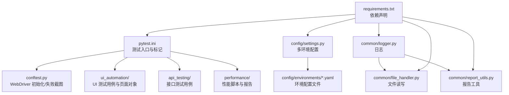
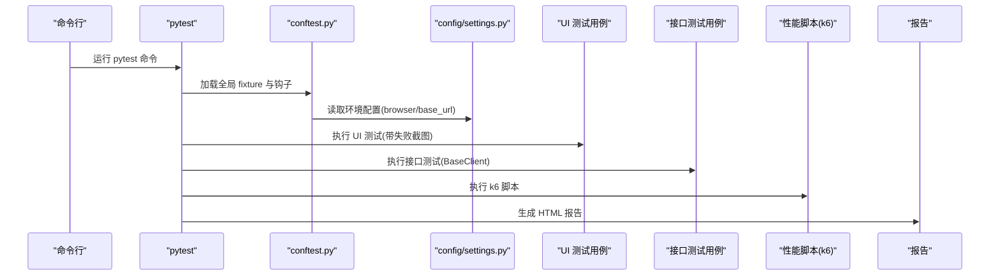
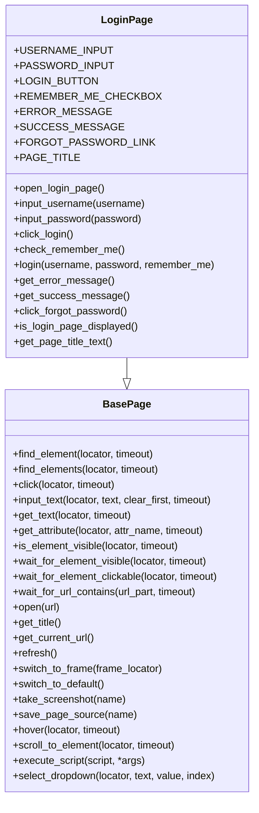
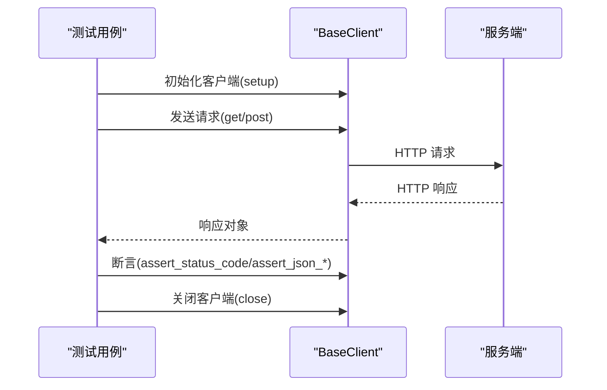
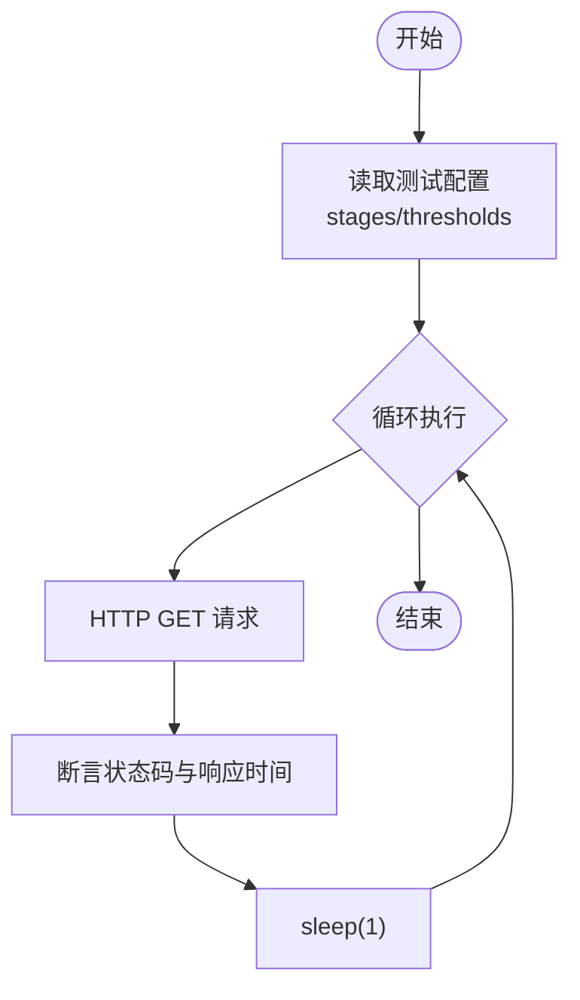
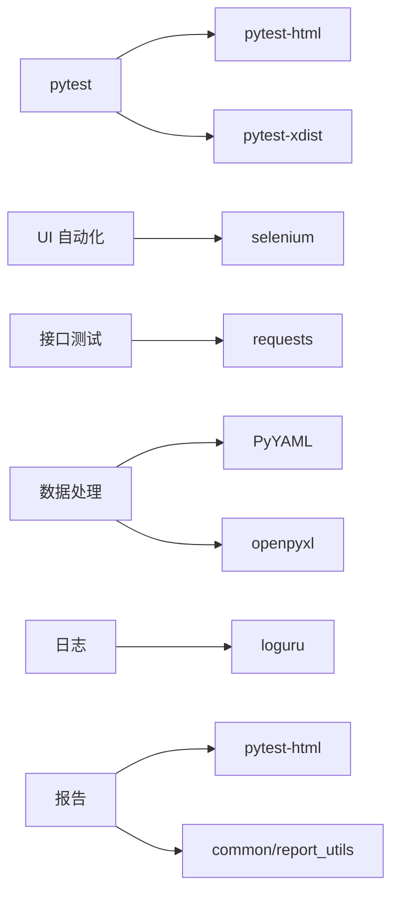

# 故障排除与FAQ

<cite>
**本文引用的文件**
- [README.md](file://README.md)
- [pytest.ini](file://pytest.ini)
- [requirements.txt](file://requirements.txt)
- [conftest.py](file://conftest.py)
- [config/settings.py](file://config/settings.py)
- [config/environments/dev.yaml](file://config/environments/dev.yaml)
- [config/environments/test.yaml](file://config/environments/test.yaml)
- [config/environments/prod.yaml](file://config/environments/prod.yaml)
- [common/logger.py](file://common/logger.py)
- [common/file_handler.py](file://common/file_handler.py)
- [common/report_utils.py](file://common/report_utils.py)
- [ui_automation/pages/base_page.py](file://ui_automation/pages/base_page.py)
- [ui_automation/pages/example_page.py](file://ui_automation/pages/example_page.py)
- [ui_automation/testcases/test_example.py](file://ui_automation/testcases/test_example.py)
- [api_testing/testcases/test_example_api.py](file://api_testing/testcases/test_example_api.py)
- [performance/scripts/example_load_test.js](file://performance/scripts/example_load_test.js)
</cite>

## 目录
1. [简介](#简介)
2. [项目结构](#项目结构)
3. [核心组件](#核心组件)
4. [架构总览](#架构总览)
5. [详细组件分析](#详细组件分析)
6. [依赖关系分析](#依赖关系分析)
7. [性能注意事项](#性能注意事项)
8. [故障排除指南](#故障排除指南)
9. [结论](#结论)
10. [附录](#附录)

## 简介
本文件面向测试工程师与开发者，提供本测试自动化工作区的系统化故障排除与常见问题解答。内容覆盖：
- 环境搭建与配置问题
- UI 自动化测试中的元素定位失败、页面加载超时、浏览器兼容性问题
- 接口测试中的网络错误、认证失败、响应解析问题
- 性能测试中的脚本错误、资源不足、报告生成失败
- 调试工具使用、日志分析方法与社区支持渠道

## 项目结构
项目采用模块化组织，包含配置、UI 自动化、接口测试、性能测试、公共工具与文档等模块。pytest 作为统一测试入口，支持标记运行与并行执行。

图表来源
- [pytest.ini:1-12](file://pytest.ini#L1-L12)
- [conftest.py:1-122](file://conftest.py#L1-L122)
- [config/settings.py:1-104](file://config/settings.py#L1-L104)
- [common/logger.py:1-77](file://common/logger.py#L1-L77)
- [common/file_handler.py:1-217](file://common/file_handler.py#L1-L217)
- [common/report_utils.py:1-143](file://common/report_utils.py#L1-L143)
- [requirements.txt:1-21](file://requirements.txt#L1-L21)

章节来源
- [README.md:1-123](file://README.md#L1-L123)
- [pytest.ini:1-12](file://pytest.ini#L1-L12)
- [requirements.txt:1-21](file://requirements.txt#L1-L21)

## 核心组件
- 配置管理：通过环境变量切换 dev/test/prod，集中提供 base_url、账号、数据库、API、浏览器等配置。
- UI 自动化：基于 Selenium 的 Page Object 模式，封装元素查找、等待、截图与高级交互。
- 接口测试：基于 Requests 的客户端封装，提供断言与会话管理。
- 性能测试：k6 脚本示例，包含阶梯式负载与阈值配置。
- 公共工具：日志、文件处理（YAML/Excel）、报告工具。

章节来源
- [config/settings.py:13-104](file://config/settings.py#L13-L104)
- [ui_automation/pages/base_page.py:24-499](file://ui_automation/pages/base_page.py#L24-L499)
- [api_testing/testcases/test_example_api.py:18-167](file://api_testing/testcases/test_example_api.py#L18-L167)
- [performance/scripts/example_load_test.js:1-33](file://performance/scripts/example_load_test.js#L1-L33)
- [common/logger.py:1-77](file://common/logger.py#L1-L77)
- [common/file_handler.py:13-217](file://common/file_handler.py#L13-L217)
- [common/report_utils.py:13-143](file://common/report_utils.py#L13-L143)

## 架构总览
测试执行流程概览：pytest 读取配置与标记，加载全局 fixture（WebDriver 初始化、失败截图），按模块运行 UI/接口/性能测试，并生成 HTML 报告。

图表来源
- [pytest.ini:1-12](file://pytest.ini#L1-L12)
- [conftest.py:25-122](file://conftest.py#L25-L122)
- [config/settings.py:26-104](file://config/settings.py#L26-L104)
- [ui_automation/testcases/test_example.py:31-161](file://ui_automation/testcases/test_example.py#L31-L161)
- [api_testing/testcases/test_example_api.py:18-167](file://api_testing/testcases/test_example_api.py#L18-L167)
- [performance/scripts/example_load_test.js:1-33](file://performance/scripts/example_load_test.js#L1-L33)

## 详细组件分析

### UI 自动化测试组件
- 页面对象基类封装了元素查找、等待、截图、滚动、下拉选择、JS 执行等常用操作，并在关键失败点自动截图与记录日志。
- LoginPage 示例展示了如何继承基类并封装页面元素与操作。
- 测试用例通过 driver 与 base_url fixture 获取浏览器实例与环境地址，使用 Page Object 编排步骤并断言结果。

图表来源
- [ui_automation/pages/base_page.py:24-499](file://ui_automation/pages/base_page.py#L24-L499)
- [ui_automation/pages/example_page.py:12-161](file://ui_automation/pages/example_page.py#L12-L161)

章节来源
- [ui_automation/pages/base_page.py:44-499](file://ui_automation/pages/base_page.py#L44-L499)
- [ui_automation/pages/example_page.py:38-161](file://ui_automation/pages/example_page.py#L38-L161)
- [ui_automation/testcases/test_example.py:31-161](file://ui_automation/testcases/test_example.py#L31-L161)
- [conftest.py:25-111](file://conftest.py#L25-L111)

### 接口测试组件
- BaseClient 封装了 GET/POST 等请求与断言方法，支持设置 token、自定义 headers、会话管理与资源清理。
- 测试用例通过 setup fixture 初始化客户端并在测试结束后关闭，确保资源释放。

图表来源
- [api_testing/testcases/test_example_api.py:18-167](file://api_testing/testcases/test_example_api.py#L18-L167)

章节来源
- [api_testing/testcases/test_example_api.py:18-167](file://api_testing/testcases/test_example_api.py#L18-L167)

### 性能测试组件
- k6 脚本示例定义了阶梯式负载与阈值，包含 GET 请求、状态码与响应时间断言。
- 建议在本地或 CI 中安装 k6 并按需调整目标地址与阈值。

图表来源
- [performance/scripts/example_load_test.js:5-33](file://performance/scripts/example_load_test.js#L5-L33)

章节来源
- [performance/scripts/example_load_test.js:1-33](file://performance/scripts/example_load_test.js#L1-L33)

## 依赖关系分析
- pytest 与插件：pytest-html 生成 HTML 报告，pytest-xdist 支持并行执行。
- UI 自动化：selenium 驱动浏览器，Chrome/Firefox 选项由配置决定。
- 接口测试：requests 发起 HTTP 请求。
- 数据处理：PyYAML/openpyxl 处理配置与测试数据。
- 日志：loguru 统一输出至控制台与文件。
- 报告：pytest-html 与 common/report_utils 提供报告能力。

图表来源
- [requirements.txt:1-21](file://requirements.txt#L1-L21)
- [pytest.ini:6-11](file://pytest.ini#L6-L11)

章节来源
- [requirements.txt:1-21](file://requirements.txt#L1-L21)
- [pytest.ini:1-12](file://pytest.ini#L1-L12)

## 性能注意事项
- UI 自动化：合理设置隐式等待与页面加载超时，避免过长等待影响整体吞吐。
- 接口测试：使用会话复用与合理的重试策略，避免频繁握手与资源浪费。
- 性能测试：k6 阶梯式负载与阈值需结合目标系统容量评估，逐步逼近压力点。
- 报告与日志：HTML 报告与日志文件过大时，建议定期清理或压缩。

## 故障排除指南

### 一、环境搭建与配置问题
- 症状：找不到配置文件或环境变量未生效
  - 排查要点：
    - 确认环境变量 TEST_ENV 是否设置为 dev/test/prod
    - 确认对应 config/environments/{env}.yaml 存在且可读
    - 确认 config/settings.py 能正常加载 YAML
  - 参考路径：
    - [config/settings.py:37-48](file://config/settings.py#L37-L48)
    - [config/environments/dev.yaml:1-31](file://config/environments/dev.yaml#L1-L31)
    - [config/environments/test.yaml:1-31](file://config/environments/test.yaml#L1-L31)
    - [config/environments/prod.yaml:1-31](file://config/environments/prod.yaml#L1-L31)

- 症状：依赖安装失败或版本冲突
  - 排查要点：
    - 使用隔离虚拟环境安装 requirements.txt
    - 确认 Python 版本与依赖兼容
  - 参考路径：
    - [requirements.txt:1-21](file://requirements.txt#L1-L21)

- 症状：pytest 无法识别标记或报告生成失败
  - 排查要点：
    - 确认 pytest.ini 中 markers 与 testpaths 配置
    - 确认报告输出目录可写
  - 参考路径：
    - [pytest.ini:1-12](file://pytest.ini#L1-L12)
    - [common/report_utils.py:62-65](file://common/report_utils.py#L62-L65)

### 二、UI 自动化测试问题
- 症状：元素定位失败（TimeoutException）
  - 排查要点：
    - 检查定位器是否随页面变化而失效
    - 适当提高显式等待超时
    - 在 BasePage 的元素查找处查看截图与日志
  - 参考路径：
    - [ui_automation/pages/base_page.py:44-68](file://ui_automation/pages/base_page.py#L44-L68)

- 症状：页面加载超时
  - 排查要点：
    - 调整 config/environments/{env}.yaml 中的 page_load_timeout
    - 检查网络状况与目标站点可用性
  - 参考路径：
    - [config/environments/dev.yaml:25-31](file://config/environments/dev.yaml#L25-L31)
    - [config/environments/test.yaml:25-31](file://config/environments/test.yaml#L25-L31)
    - [config/environments/prod.yaml:25-31](file://config/environments/prod.yaml#L25-L31)

- 症状：浏览器兼容性问题（Chrome/Firefox）
  - 排查要点：
    - 确认已安装对应驱动（chromedriver/geckodriver）
    - 检查 config/settings.py 中 browser.type/headless 配置
    - 在 conftest.py 中确认 WebDriver 初始化逻辑
  - 参考路径：
    - [config/settings.py:81-83](file://config/settings.py#L81-L83)
    - [conftest.py:25-69](file://conftest.py#L25-L69)

- 症状：失败自动截图未生成
  - 排查要点：
    - 确认 evidence 目录存在且可写
    - 检查 conftest.py 的 pytest_runtest_makereport 钩子
  - 参考路径：
    - [conftest.py:80-110](file://conftest.py#L80-L110)
    - [ui_automation/pages/base_page.py:354-378](file://ui_automation/pages/base_page.py#L354-L378)

### 三、接口测试问题
- 症状：网络错误（连接超时/DNS 解析失败）
  - 排查要点：
    - 检查 API 基础地址与代理设置
    - 使用 requests 的超时参数与重试策略
  - 参考路径：
    - [config/environments/dev.yaml:20-23](file://config/environments/dev.yaml#L20-L23)
    - [config/environments/test.yaml:20-23](file://config/environments/test.yaml#L20-L23)
    - [config/environments/prod.yaml:20-23](file://config/environments/prod.yaml#L20-L23)

- 症状：认证失败（Token 无效/Headers 缺失）
  - 排查要点：
    - 确认登录流程与 token 设置
    - 检查自定义 headers 是否覆盖默认值
  - 参考路径：
    - [api_testing/testcases/test_example_api.py:147-166](file://api_testing/testcases/test_example_api.py#L147-L166)

- 症状：响应解析失败（JSON 结构不符）
  - 排查要点：
    - 使用断言方法逐层校验 key 与结构
    - 对比实际响应与期望结构
  - 参考路径：
    - [api_testing/testcases/test_example_api.py:99-128](file://api_testing/testcases/test_example_api.py#L99-L128)

### 四、性能测试问题
- 症状：k6 脚本执行报错
  - 排查要点：
    - 检查脚本语法与导出配置
    - 确认目标地址与鉴权（如有）
  - 参考路径：
    - [performance/scripts/example_load_test.js:5-33](file://performance/scripts/example_load_test.js#L5-L33)

- 症状：资源不足（CPU/内存/文件句柄）
  - 排查要点：
    - 降低并发与样本量，观察系统资源曲线
    - 优化阈值与断言，减少不必要的检查
  - 参考路径：
    - [performance/scripts/example_load_test.js:7-18](file://performance/scripts/example_load_test.js#L7-L18)

- 症状：报告生成失败
  - 排查要点：
    - 确认输出目录存在且可写
    - 检查 HTML 报告生成逻辑
  - 参考路径：
    - [common/report_utils.py:125-143](file://common/report_utils.py#L125-L143)

### 五、调试与日志分析
- 日志配置：统一输出至控制台与按天轮转的文件，模块名自动绑定，便于定位来源。
- 日志使用：在各模块通过 get_logger("模块名") 获取 logger 实例，记录 INFO/DEBUG 级别消息。
- 建议排查步骤：
  - 提升日志级别至 DEBUG 观察细节
  - 结合截图与页面源码定位问题
  - 使用最小化用例复现问题

章节来源
- [common/logger.py:14-77](file://common/logger.py#L14-L77)
- [conftest.py:22-22](file://conftest.py#L22-L22)
- [ui_automation/pages/base_page.py:379-404](file://ui_automation/pages/base_page.py#L379-L404)

### 六、社区支持与参考
- 快速开始与技术栈说明可参考项目 README
- 常用命令与标记运行方式可参考 README 的“快速开始”部分

章节来源
- [README.md:45-123](file://README.md#L45-L123)

## 结论
本故障排除与 FAQ 覆盖了从环境配置、UI 自动化、接口测试到性能测试的常见问题与解决思路。建议在日常工作中：
- 坚持最小化用例与可重复执行
- 使用统一日志与证据收集机制
- 依据阈值与报告持续优化测试策略
- 借助社区与官方文档进行深度排查

## 附录
- 常用命令参考（来自 README）
  - 运行全部测试、冒烟测试、接口测试、UI 自动化测试、并行执行
- 依赖清单参考（来自 requirements.txt）
  - pytest、pytest-html、pytest-xdist、selenium、requests、PyYAML、openpyxl、loguru、allure-pytest

章节来源
- [README.md:64-81](file://README.md#L64-L81)
- [requirements.txt:1-21](file://requirements.txt#L1-L21)