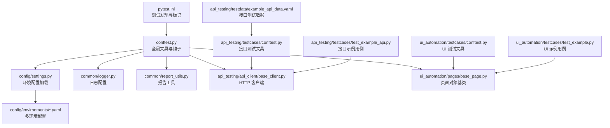
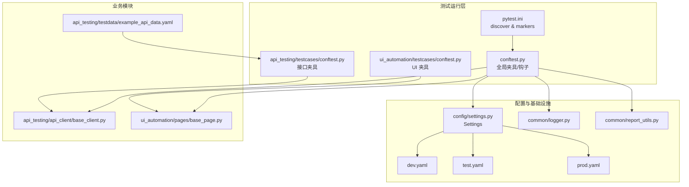
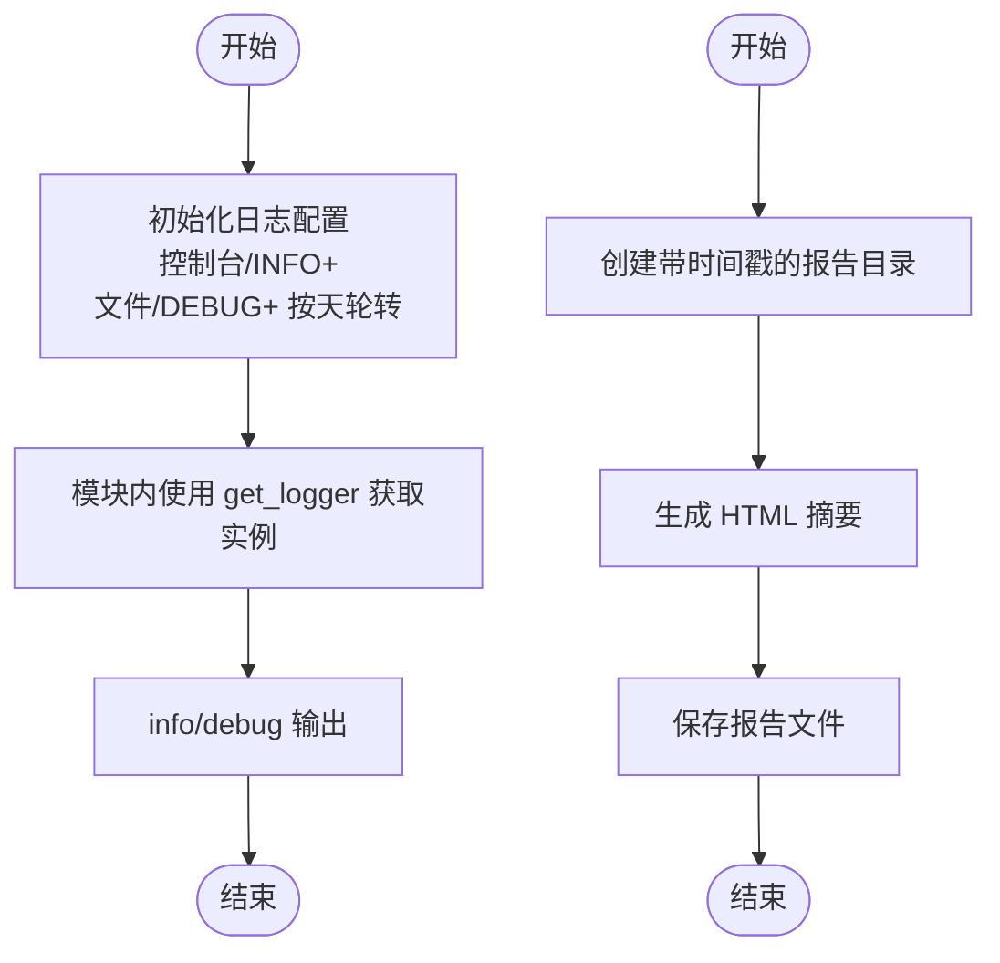
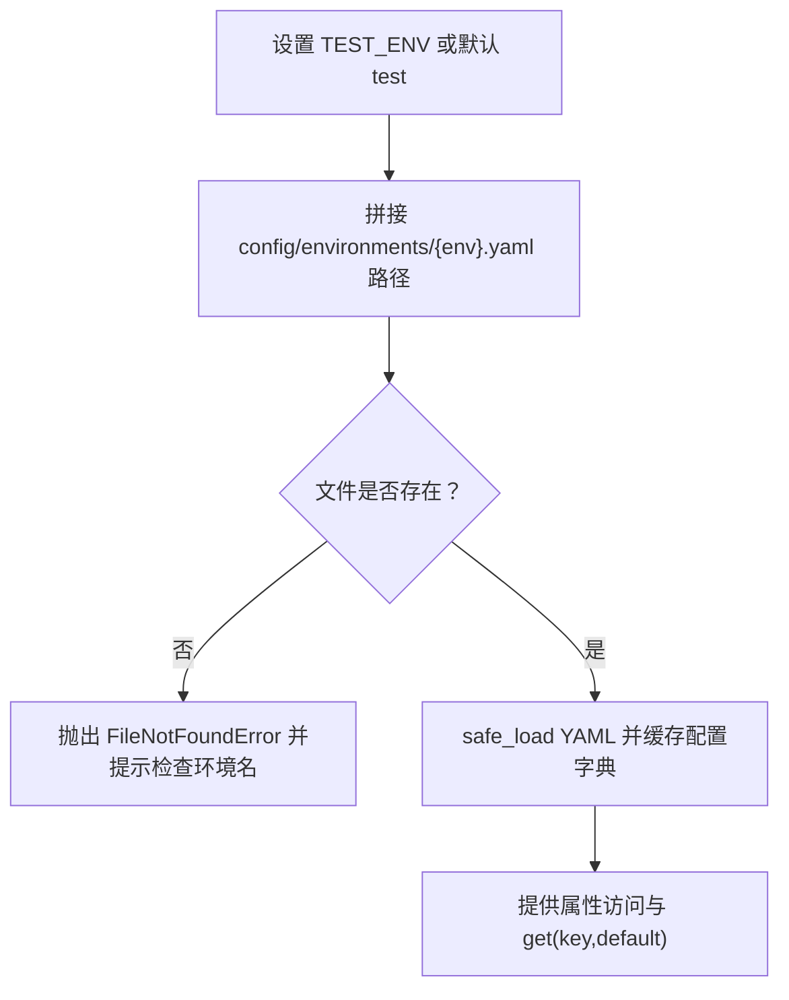
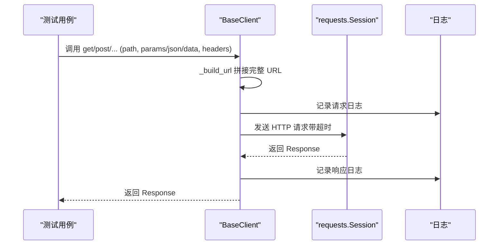
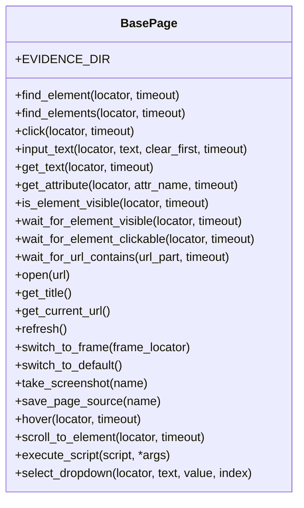
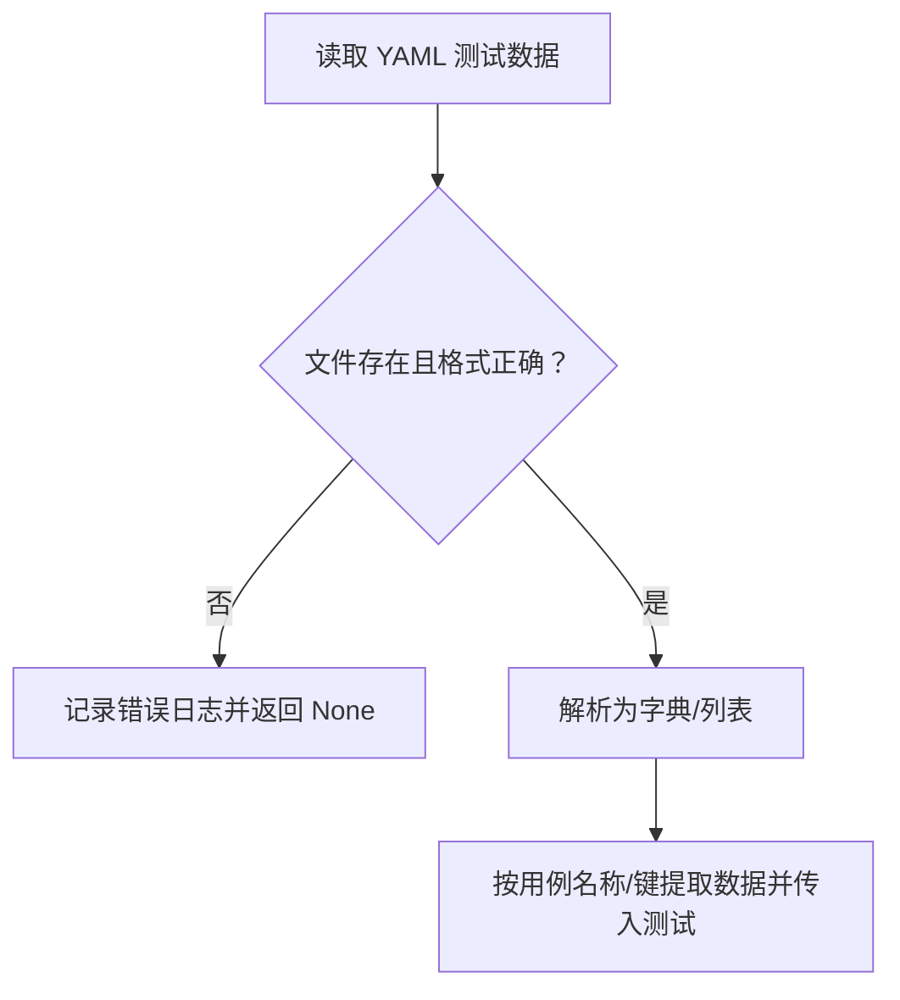
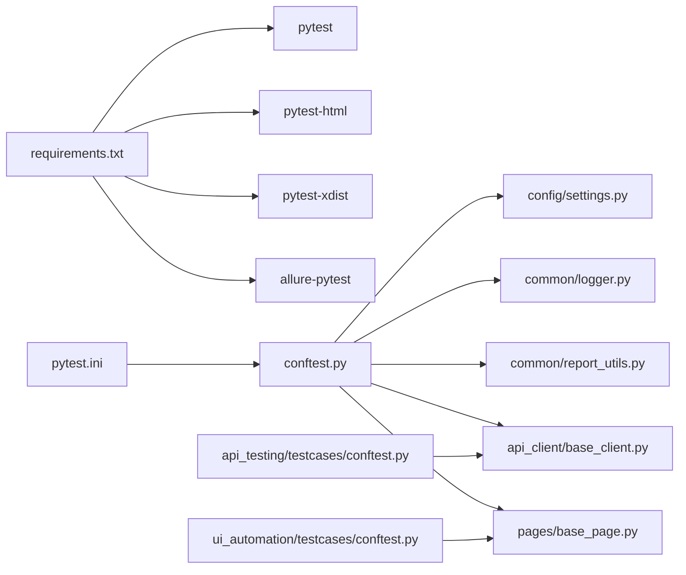

# 通用故障排除

<cite>
**本文引用的文件**
- [README.md](file://README.md)
- [pytest.ini](file://pytest.ini)
- [requirements.txt](file://requirements.txt)
- [conftest.py](file://conftest.py)
- [common/logger.py](file://common/logger.py)
- [config/settings.py](file://config/settings.py)
- [config/environments/dev.yaml](file://config/environments/dev.yaml)
- [config/environments/test.yaml](file://config/environments/test.yaml)
- [config/environments/prod.yaml](file://config/environments/prod.yaml)
- [api_testing/testcases/conftest.py](file://api_testing/testcases/conftest.py)
- [ui_automation/testcases/conftest.py](file://ui_automation/testcases/conftest.py)
- [api_testing/testdata/example_api_data.yaml](file://api_testing/testdata/example_api_data.yaml)
- [api_testing/testcases/test_example_api.py](file://api_testing/testcases/test_example_api.py)
- [ui_automation/testcases/test_example.py](file://ui_automation/testcases/test_example.py)
- [common/file_handler.py](file://common/file_handler.py)
- [common/report_utils.py](file://common/report_utils.py)
- [api_testing/api_client/base_client.py](file://api_testing/api_client/base_client.py)
- [ui_automation/pages/base_page.py](file://ui_automation/pages/base_page.py)
</cite>

## 目录
1. [简介](#简介)
2. [项目结构](#项目结构)
3. [核心组件](#核心组件)
4. [架构总览](#架构总览)
5. [详细组件分析](#详细组件分析)
6. [依赖关系分析](#依赖关系分析)
7. [性能注意事项](#性能注意事项)
8. [故障排除指南](#故障排除指南)
9. [结论](#结论)
10. [附录](#附录)

## 简介
本指南面向跨模块的通用故障排除场景，聚焦以下方面：
- 日志系统配置错误、文件权限问题与报告生成失败的诊断
- pytest 插件加载失败、测试夹具配置错误与并行执行异常的排查
- 依赖包管理问题（版本冲突、安装失败、环境隔离）
- 测试数据管理问题（YAML 格式错误、数据加载异常、参数化执行失败）
- 项目结构相关问题（模块导入错误、路径配置、IDE 集成）
- 调试工具与日志分析技巧，帮助快速定位与修复问题

## 项目结构
项目采用按功能域划分的模块化组织方式，包含配置、公共工具、UI 自动化、接口测试、性能测试与用例生成器等模块。pytest 作为统一测试入口，通过全局与模块级 conftest 配置实现跨模块的夹具与钩子。

**图表来源**
- [pytest.ini:1-16](file://pytest.ini#L1-L16)
- [conftest.py:1-148](file://conftest.py#L1-L148)
- [config/settings.py:1-104](file://config/settings.py#L1-L104)
- [config/environments/dev.yaml:1-31](file://config/environments/dev.yaml#L1-L31)
- [config/environments/test.yaml:1-31](file://config/environments/test.yaml#L1-L31)
- [config/environments/prod.yaml:1-31](file://config/environments/prod.yaml#L1-L31)
- [common/logger.py:1-77](file://common/logger.py#L1-L77)
- [common/report_utils.py:1-143](file://common/report_utils.py#L1-L143)
- [api_testing/api_client/base_client.py:1-308](file://api_testing/api_client/base_client.py#L1-L308)
- [ui_automation/pages/base_page.py:1-515](file://ui_automation/pages/base_page.py#L1-L515)
- [api_testing/testcases/conftest.py:1-80](file://api_testing/testcases/conftest.py#L1-L80)
- [ui_automation/testcases/conftest.py:1-78](file://ui_automation/testcases/conftest.py#L1-L78)
- [api_testing/testdata/example_api_data.yaml:1-116](file://api_testing/testdata/example_api_data.yaml#L1-L116)
- [api_testing/testcases/test_example_api.py:1-167](file://api_testing/testcases/test_example_api.py#L1-L167)
- [ui_automation/testcases/test_example.py:1-161](file://ui_automation/testcases/test_example.py#L1-L161)

**章节来源**
- [README.md:1-123](file://README.md#L1-L123)
- [pytest.ini:1-16](file://pytest.ini#L1-L16)
- [conftest.py:1-148](file://conftest.py#L1-L148)

## 核心组件
- 配置管理：通过环境变量选择环境，读取 YAML 配置并提供属性访问与通用 get 方法。
- 日志系统：统一使用 loguru，控制台 INFO+ 输出与文件 DEBUG+ 输出（按天轮转、保留 7 天）。
- 报告工具：提供时间戳生成、报告目录创建与简单 HTML 摘要生成。
- HTTP 客户端：封装 requests，支持会话复用、超时、Token 认证、自定义 Header、断言工具与日志记录。
- 页面对象基类：封装 Selenium 常用操作、显式等待、截图与页面源码保存等能力。

**章节来源**
- [config/settings.py:13-104](file://config/settings.py#L13-L104)
- [common/logger.py:1-77](file://common/logger.py#L1-L77)
- [common/report_utils.py:1-143](file://common/report_utils.py#L1-L143)
- [api_testing/api_client/base_client.py:18-308](file://api_testing/api_client/base_client.py#L18-L308)
- [ui_automation/pages/base_page.py:36-515](file://ui_automation/pages/base_page.py#L36-L515)

## 架构总览
pytest 作为统一入口，通过全局与模块级 conftest 注入夹具与钩子，驱动各模块的测试执行。配置模块提供环境变量与 YAML 配置读取，日志模块提供统一输出，报告工具负责产出报告。

**图表来源**
- [pytest.ini:1-16](file://pytest.ini#L1-L16)
- [conftest.py:1-148](file://conftest.py#L1-L148)
- [config/settings.py:1-104](file://config/settings.py#L1-L104)
- [config/environments/dev.yaml:1-31](file://config/environments/dev.yaml#L1-L31)
- [config/environments/test.yaml:1-31](file://config/environments/test.yaml#L1-L31)
- [config/environments/prod.yaml:1-31](file://config/environments/prod.yaml#L1-L31)
- [common/logger.py:1-77](file://common/logger.py#L1-L77)
- [common/report_utils.py:1-143](file://common/report_utils.py#L1-L143)
- [api_testing/api_client/base_client.py:1-308](file://api_testing/api_client/base_client.py#L1-L308)
- [ui_automation/pages/base_page.py:1-515](file://ui_automation/pages/base_page.py#L1-L515)
- [api_testing/testdata/example_api_data.yaml:1-116](file://api_testing/testdata/example_api_data.yaml#L1-L116)

## 详细组件分析

### 日志系统与报告工具
- 日志配置：控制台 INFO+ 输出、文件 DEBUG+ 输出（按天轮转、保留 7 天），统一模块名绑定，避免未绑定报错。
- 报告工具：生成时间戳目录、HTML 摘要与保存，确保目录存在后再写入。

**图表来源**
- [common/logger.py:1-77](file://common/logger.py#L1-L77)
- [common/report_utils.py:42-143](file://common/report_utils.py#L42-L143)

**章节来源**
- [common/logger.py:1-77](file://common/logger.py#L1-L77)
- [common/report_utils.py:1-143](file://common/report_utils.py#L1-L143)

### 配置管理与环境切换
- 通过环境变量选择环境，读取对应 YAML 文件，提供属性访问与 get 方法。
- 缺少配置文件或键缺失时，抛出明确错误或返回默认值。

**图表来源**
- [config/settings.py:26-48](file://config/settings.py#L26-L48)
- [config/environments/dev.yaml:1-31](file://config/environments/dev.yaml#L1-L31)
- [config/environments/test.yaml:1-31](file://config/environments/test.yaml#L1-L31)
- [config/environments/prod.yaml:1-31](file://config/environments/prod.yaml#L1-L31)

**章节来源**
- [config/settings.py:13-104](file://config/settings.py#L13-L104)
- [config/environments/dev.yaml:1-31](file://config/environments/dev.yaml#L1-L31)
- [config/environments/test.yaml:1-31](file://config/environments/test.yaml#L1-L31)
- [config/environments/prod.yaml:1-31](file://config/environments/prod.yaml#L1-L31)

### HTTP 客户端与断言工具
- 支持 GET/POST/PUT/DELETE/PATCH/上传文件，自动合并自定义 Header，记录请求与响应日志。
- 提供断言工具：状态码、JSON 键存在与值、响应时间、列表非空等。
- 超时与连接异常捕获并记录，便于定位网络问题。

**图表来源**
- [api_testing/api_client/base_client.py:91-187](file://api_testing/api_client/base_client.py#L91-L187)
- [api_testing/api_client/base_client.py:233-295](file://api_testing/api_client/base_client.py#L233-L295)

**章节来源**
- [api_testing/api_client/base_client.py:18-308](file://api_testing/api_client/base_client.py#L18-L308)

### 页面对象与 UI 自动化
- 封装元素查找、点击、输入、等待、URL 等常用操作，统一截图与页面源码保存。
- 通过显式等待与异常日志，提升稳定性与可观测性。

**图表来源**
- [ui_automation/pages/base_page.py:36-515](file://ui_automation/pages/base_page.py#L36-L515)

**章节来源**
- [ui_automation/pages/base_page.py:1-515](file://ui_automation/pages/base_page.py#L1-L515)

### 测试数据与参数化
- YAML 数据模板用于接口测试参数化，包含 endpoint、method、cases 等字段。
- UI 测试通过模块级 conftest 提供数据加载夹具，按需读取测试数据。

**图表来源**
- [api_testing/testdata/example_api_data.yaml:1-116](file://api_testing/testdata/example_api_data.yaml#L1-L116)
- [ui_automation/testcases/conftest.py:20-29](file://ui_automation/testcases/conftest.py#L20-L29)

**章节来源**
- [api_testing/testdata/example_api_data.yaml:1-116](file://api_testing/testdata/example_api_data.yaml#L1-L116)
- [ui_automation/testcases/conftest.py:1-78](file://ui_automation/testcases/conftest.py#L1-L78)

## 依赖关系分析
- pytest 与插件：pytest.ini 声明插件与标记，requirements.txt 明确版本。
- 全局夹具依赖配置与日志模块，模块级夹具依赖全局设置。
- 客户端与页面对象依赖日志模块，确保可观测性。

**图表来源**
- [requirements.txt:1-25](file://requirements.txt#L1-L25)
- [pytest.ini:1-16](file://pytest.ini#L1-L16)
- [conftest.py:1-148](file://conftest.py#L1-L148)
- [config/settings.py:1-104](file://config/settings.py#L1-L104)
- [common/logger.py:1-77](file://common/logger.py#L1-L77)
- [common/report_utils.py:1-143](file://common/report_utils.py#L1-L143)
- [api_testing/api_client/base_client.py:1-308](file://api_testing/api_client/base_client.py#L1-L308)
- [ui_automation/pages/base_page.py:1-515](file://ui_automation/pages/base_page.py#L1-L515)
- [api_testing/testcases/conftest.py:1-80](file://api_testing/testcases/conftest.py#L1-L80)
- [ui_automation/testcases/conftest.py:1-78](file://ui_automation/testcases/conftest.py#L1-L78)

**章节来源**
- [requirements.txt:1-25](file://requirements.txt#L1-L25)
- [pytest.ini:1-16](file://pytest.ini#L1-L16)
- [conftest.py:1-148](file://conftest.py#L1-L148)

## 性能注意事项
- 使用 requests 会话复用减少连接开销。
- 合理设置隐式等待与显式等待，避免过长等待影响整体吞吐。
- 并行执行时注意资源竞争与共享状态，必要时使用会话级夹具隔离。
- 日志级别与文件轮转策略平衡可观测性与磁盘占用。

[本节为通用指导，无需“章节来源”]

## 故障排除指南

### 一、日志系统配置错误
- 症状
  - 控制台无日志输出或输出级别不符合预期
  - 文件日志未生成或路径不存在
  - 日志重复输出或模块名缺失
- 诊断步骤
  - 检查日志初始化是否执行（移除默认 handler、配置 stdout 与文件 handler）
  - 确认日志目录存在且具备写权限
  - 校验模块名绑定是否正确
- 解决方案
  - 确保在模块导入前初始化日志配置
  - 使用统一的 get_logger 获取实例，避免重复添加 handler
  - 如需调整级别或格式，修改日志配置参数

**章节来源**
- [common/logger.py:34-56](file://common/logger.py#L34-L56)
- [common/logger.py:74-77](file://common/logger.py#L74-L77)

### 二、文件权限问题
- 症状
  - 日志文件无法写入
  - 报告目录创建失败
  - YAML/Excel 文件读写失败
- 诊断步骤
  - 检查 logs 与 reports 目录是否存在与权限
  - 检查测试数据文件是否存在与编码正确
  - 检查 Excel 文件是否被占用或只读
- 解决方案
  - 在运行前确保目录存在并具备写权限
  - 使用 UTF-8 编码读写文本文件
  - 关闭占用 Excel 文件的进程或以可写方式打开

**章节来源**
- [common/logger.py:31-32](file://common/logger.py#L31-L32)
- [common/report_utils.py:57-65](file://common/report_utils.py#L57-L65)
- [common/file_handler.py:23-36](file://common/file_handler.py#L23-L36)
- [common/file_handler.py:93-95](file://common/file_handler.py#L93-L95)

### 三、报告生成失败
- 症状
  - 报告目录创建失败
  - HTML 摘要保存异常
- 诊断步骤
  - 检查报告根目录路径与权限
  - 检查 HTML 内容生成与文件写入流程
- 解决方案
  - 使用 create_report_dir 创建带时间戳的目录
  - 确保目录存在后再写入文件

**章节来源**
- [common/report_utils.py:42-65](file://common/report_utils.py#L42-L65)
- [common/report_utils.py:125-142](file://common/report_utils.py#L125-L142)

### 四、pytest 插件加载失败
- 症状
  - 插件未生效或报导入错误
  - 并行执行 n/auto 失败
- 诊断步骤
  - 检查 requirements.txt 版本与安装状态
  - 检查 pytest.ini 中插件声明与选项
- 解决方案
  - 清理虚拟环境后重新安装依赖
  - 使用 pip install -r requirements.txt 确保版本一致

**章节来源**
- [requirements.txt:2-4](file://requirements.txt#L2-L4)
- [pytest.ini:6](file://pytest.ini#L6)

### 五、测试夹具配置错误
- 症状
  - driver 未初始化或关闭异常
  - base_url 为空或无效
  - UI 自动化失败但无截图
- 诊断步骤
  - 检查全局 conftest 中 driver 与 base_url 夹具
  - 检查模块级 conftest 中数据加载与前置条件
  - 检查证据目录是否存在
- 解决方案
  - 确保浏览器配置正确（类型、headless、等待时间）
  - 确保证据目录存在并具备写权限
  - 使用失败钩子自动截图并附加到报告

**章节来源**
- [conftest.py:25-74](file://conftest.py#L25-L74)
- [conftest.py:84-125](file://conftest.py#L84-L125)
- [ui_automation/testcases/conftest.py:16-29](file://ui_automation/testcases/conftest.py#L16-L29)

### 六、并行执行异常
- 症状
  - 多进程间资源竞争导致失败
  - 测试间共享状态污染
- 诊断步骤
  - 检查是否使用会话级夹具隔离状态
  - 检查是否有共享文件/端口/临时目录
- 解决方案
  - 使用会话级夹具与独立资源分配
  - 避免共享可变状态，必要时使用锁或临时命名空间

[本小节为通用指导，无需“章节来源”]

### 七、依赖包管理问题
- 症状
  - 版本冲突导致导入失败
  - 安装失败或环境隔离问题
- 诊断步骤
  - 检查 requirements.txt 与当前环境版本
  - 检查虚拟环境激活状态
- 解决方案
  - 使用虚拟环境隔离依赖
  - 清理缓存后重新安装：pip install --no-cache-dir -r requirements.txt

**章节来源**
- [requirements.txt:1-25](file://requirements.txt#L1-L25)
- [README.md:54-62](file://README.md#L54-L62)

### 八、测试数据管理问题
- 症状
  - YAML 格式错误导致解析失败
  - 数据加载异常或键缺失
  - 参数化执行失败
- 诊断步骤
  - 使用 YAMLHandler.read_all 或 safe_load 验证格式
  - 检查键名大小写与嵌套层级
  - 检查数据文件路径与编码
- 解决方案
  - 修正 YAML 缩进与特殊字符
  - 使用 get(key, default) 提供默认值
  - 确保数据文件 UTF-8 编码

**章节来源**
- [common/file_handler.py:16-37](file://common/file_handler.py#L16-L37)
- [common/file_handler.py:58-77](file://common/file_handler.py#L58-L77)
- [api_testing/testdata/example_api_data.yaml:1-116](file://api_testing/testdata/example_api_data.yaml#L1-L116)

### 九、项目结构相关问题
- 模块导入错误
  - 症状：ImportError 或 ModuleNotFoundError
  - 诊断：检查 sys.path 插入与相对路径
  - 解决：确保项目根目录在 sys.path 中
- 路径配置问题
  - 症状：日志目录、报告目录、证据目录不存在
  - 诊断：检查 os.path.join 与相对路径
  - 解决：使用 os.makedirs(exist_ok=True) 创建目录
- IDE 集成故障
  - 症状：无法识别模块或运行配置不生效
  - 诊断：确认工作目录与 Python 解释器
  - 解决：在 IDE 中设置正确的运行配置与解释器

**章节来源**
- [conftest.py:14-17](file://conftest.py#L14-L17)
- [common/logger.py:31-32](file://common/logger.py#L31-L32)
- [common/report_utils.py:57-65](file://common/report_utils.py#L57-L65)
- [ui_automation/pages/base_page.py:39-52](file://ui_automation/pages/base_page.py#L39-L52)

### 十、调试工具与日志分析技巧
- 使用日志级别区分问题范围（INFO/DEBUG/ERROR）
- 结合截图与页面源码定位 UI 问题
- 使用断言工具快速暴露响应异常
- 通过超时与连接异常日志定位网络问题

**章节来源**
- [common/logger.py:40-56](file://common/logger.py#L40-L56)
- [ui_automation/pages/base_page.py:370-421](file://ui_automation/pages/base_page.py#L370-L421)
- [api_testing/api_client/base_client.py:122-133](file://api_testing/api_client/base_client.py#L122-L133)

## 结论
通过统一的日志、配置与报告工具，结合 pytest 的夹具与钩子机制，本项目提供了跨模块的可观测性与可维护性。遇到问题时，建议按照“配置—日志—数据—执行—报告”的顺序逐层排查，优先利用内置日志与截图能力定位根因。

[本节为总结，无需“章节来源”]

## 附录

### 常见问题清单与快速定位
- 配置文件不存在：检查 TEST_ENV 与 YAML 文件名
- 日志目录无权限：确保 logs 目录存在且可写
- 报告保存失败：确认 reports 目录存在
- YAML 解析失败：检查缩进与特殊字符
- 浏览器驱动问题：确认浏览器类型与 headless 配置
- 并行执行冲突：避免共享状态，使用会话级夹具

[本节为通用指导，无需“章节来源”]