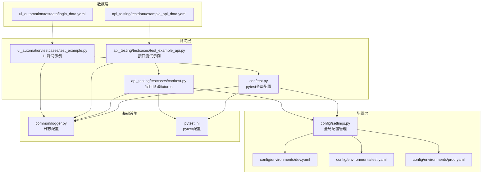
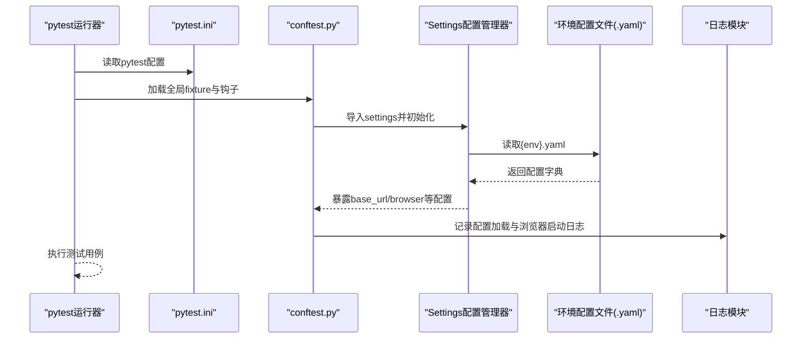
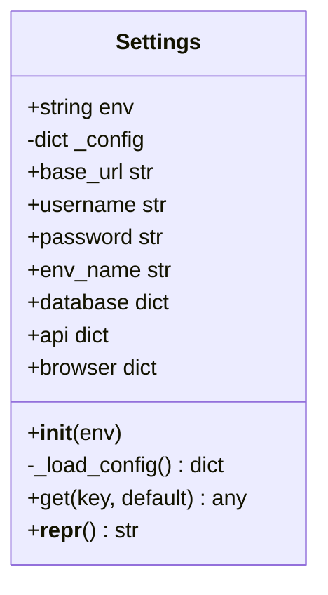
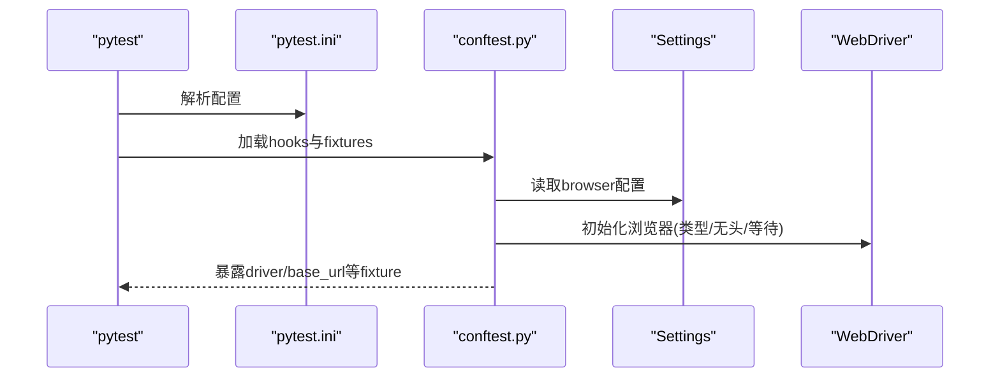
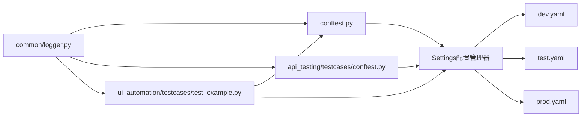

# 配置问题排查

<cite>
**本文档引用的文件**
- [config/settings.py](file://config/settings.py)
- [config/environments/dev.yaml](file://config/environments/dev.yaml)
- [config/environments/prod.yaml](file://config/environments/prod.yaml)
- [config/environments/test.yaml](file://config/environments/test.yaml)
- [pytest.ini](file://pytest.ini)
- [conftest.py](file://conftest.py)
- [api_testing/testcases/conftest.py](file://api_testing/testcases/conftest.py)
- [api_testing/testcases/test_example_api.py](file://api_testing/testcases/test_example_api.py)
- [api_testing/testdata/example_api_data.yaml](file://api_testing/testdata/example_api_data.yaml)
- [ui_automation/testcases/test_example.py](file://ui_automation/testcases/test_example.py)
- [ui_automation/testdata/login_data.yaml](file://ui_automation/testdata/login_data.yaml)
- [common/logger.py](file://common/logger.py)
</cite>

## 目录
1. [简介](#简介)
2. [项目结构](#项目结构)
3. [核心组件](#核心组件)
4. [架构总览](#架构总览)
5. [详细组件分析](#详细组件分析)
6. [依赖分析](#依赖分析)
7. [性能考虑](#性能考虑)
8. [故障排除指南](#故障排除指南)
9. [结论](#结论)
10. [附录](#附录)

## 简介
本指南聚焦于配置管理模块的故障排除与最佳实践，涵盖环境配置加载失败、配置文件格式错误、环境变量未生效等常见问题的诊断与修复；同时提供多环境配置切换的常见陷阱与规避策略，以及配置验证工具的使用方法（配置加载测试、环境变量检查、配置文件语法验证）。此外，还包含 pytest 配置问题的排查方法，包括插件加载失败、标记系统异常和并行执行配置错误的解决策略。

## 项目结构
本项目采用“按功能域划分”的组织方式，配置相关的核心文件集中在 config 目录，测试层通过 conftest.py 与配置模块耦合，形成清晰的配置-测试分离架构。

图表来源
- [config/settings.py:1-104](file://config/settings.py#L1-L104)
- [config/environments/dev.yaml:1-31](file://config/environments/dev.yaml#L1-L31)
- [config/environments/test.yaml:1-31](file://config/environments/test.yaml#L1-L31)
- [config/environments/prod.yaml:1-31](file://config/environments/prod.yaml#L1-L31)
- [conftest.py:1-122](file://conftest.py#L1-L122)
- [api_testing/testcases/conftest.py:1-80](file://api_testing/testcases/conftest.py#L1-L80)
- [api_testing/testcases/test_example_api.py:1-167](file://api_testing/testcases/test_example_api.py#L1-L167)
- [ui_automation/testcases/test_example.py:1-161](file://ui_automation/testcases/test_example.py#L1-L161)
- [api_testing/testdata/example_api_data.yaml:1-116](file://api_testing/testdata/example_api_data.yaml#L1-L116)
- [ui_automation/testdata/login_data.yaml:1-19](file://ui_automation/testdata/login_data.yaml#L1-L19)
- [common/logger.py:1-77](file://common/logger.py#L1-L77)
- [pytest.ini:1-12](file://pytest.ini#L1-L12)

章节来源
- [config/settings.py:1-104](file://config/settings.py#L1-L104)
- [conftest.py:1-122](file://conftest.py#L1-L122)
- [pytest.ini:1-12](file://pytest.ini#L1-L12)

## 核心组件
- 全局配置管理器：负责根据环境变量加载对应 YAML 配置文件，并提供属性与字典风格的访问方法。
- 环境配置文件：dev/test/prod 三套环境配置，分别定义基础 URL、账号信息、数据库、API、浏览器等配置项。
- pytest 配置与钩子：集中注册自定义标记、注入基础 URL 与浏览器驱动等 fixture，实现配置与测试的无缝衔接。
- 日志模块：统一日志输出与落盘，便于定位配置加载与测试执行过程中的问题。

章节来源
- [config/settings.py:13-104](file://config/settings.py#L13-L104)
- [config/environments/dev.yaml:1-31](file://config/environments/dev.yaml#L1-L31)
- [config/environments/test.yaml:1-31](file://config/environments/test.yaml#L1-L31)
- [config/environments/prod.yaml:1-31](file://config/environments/prod.yaml#L1-L31)
- [conftest.py:112-122](file://conftest.py#L112-L122)
- [common/logger.py:1-77](file://common/logger.py#L1-L77)

## 架构总览
配置管理与测试执行的交互流程如下：

图表来源
- [pytest.ini:1-12](file://pytest.ini#L1-L12)
- [conftest.py:1-122](file://conftest.py#L1-L122)
- [config/settings.py:26-48](file://config/settings.py#L26-L48)
- [config/environments/test.yaml:1-31](file://config/environments/test.yaml#L1-L31)
- [common/logger.py:1-77](file://common/logger.py#L1-L77)

## 详细组件分析

### 配置管理器（Settings）
- 功能要点
  - 通过环境变量 TEST_ENV 切换环境，默认 test。
  - 从 config/environments 下按 {env}.yaml 加载配置。
  - 提供属性访问（如 base_url、database、browser）与通用 get 方法。
- 关键行为
  - 配置文件不存在时抛出异常，便于快速定位环境名或路径错误。
  - 使用安全解析 YAML，避免注入风险。
- 典型问题与修复
  - 环境变量未设置：显式设置 TEST_ENV 或在 pytest.ini 中通过 addopts 传入。
  - 配置文件路径错误：确保 config/environments 下存在 {env}.yaml。
  - 配置项缺失：使用 get(key, default) 提供默认值，避免 KeyError。

图表来源
- [config/settings.py:13-104](file://config/settings.py#L13-L104)

章节来源
- [config/settings.py:26-96](file://config/settings.py#L26-L96)

### pytest 配置与钩子
- 全局配置
  - testpaths、python_*、addopts 等定义了测试发现、命名规则与 HTML 报告生成。
  - markers 注册了 ui、smoke、regression、api 等自定义标记。
- 钩子与 fixture
  - 注册自定义 marker，避免 pytest 警告。
  - driver fixture 根据 settings.browser 初始化浏览器，支持 chrome/firefox、headless、隐式等待与页面加载超时。
  - base_url fixture 提供当前环境的基础 URL。
- 典型问题与修复
  - 插件加载失败：确认 pytest-html 插件安装与版本兼容。
  - 标记系统异常：确保 markers 在 pytest.ini 与 conftest.py 中一致注册。
  - 并行执行配置错误：addopts 中的并发参数需与 pytest-html 兼容，必要时移除或调整。

图表来源
- [pytest.ini:1-12](file://pytest.ini#L1-L12)
- [conftest.py:25-78](file://conftest.py#L25-L78)
- [config/settings.py:80-83](file://config/settings.py#L80-L83)

章节来源
- [pytest.ini:1-12](file://pytest.ini#L1-L12)
- [conftest.py:112-122](file://conftest.py#L112-L122)

### 接口测试配置（api_testing/testcases/conftest.py）
- 功能要点
  - 提供 api_client 与 auth_client 两个 fixture。
  - auth_client 优先从配置文件读取 token，若为空可扩展为登录获取。
  - base_url fixture 从 settings.api.base_url 获取。
- 典型问题与修复
  - 配置项缺失：确保 api.base_url 与 api.token 存在于当前环境配置中。
  - 路径问题：确认 sys.path 已插入项目根目录，避免导入失败。

章节来源
- [api_testing/testcases/conftest.py:16-80](file://api_testing/testcases/conftest.py#L16-L80)

### UI 自动化测试配置（ui_automation/testcases/test_example.py）
- 功能要点
  - 使用 driver 与 base_url fixture，结合 Page Object 模式进行登录测试。
  - 通过 settings.base_url 与 settings.browser 驱动浏览器行为。
- 典型问题与修复
  - 测试被跳过：示例测试默认跳过，请替换为实际环境地址与页面元素定位器。
  - 浏览器类型不支持：确保 settings.browser.type 为 chrome 或 firefox。

章节来源
- [ui_automation/testcases/test_example.py:31-161](file://ui_automation/testcases/test_example.py#L31-L161)
- [conftest.py:25-78](file://conftest.py#L25-L78)

## 依赖分析
- 配置依赖
  - Settings 依赖环境变量 TEST_ENV 与 YAML 文件。
  - conftest.py 依赖 Settings 提供的 base_url 与 browser 配置。
  - api_testing/testcases/conftest.py 依赖 Settings 提供的 api 配置。
- 外部依赖
  - pytest-html 插件用于生成 HTML 报告。
  - loguru 用于统一日志输出与落盘。

图表来源
- [config/settings.py:37-48](file://config/settings.py#L37-L48)
- [conftest.py:19-78](file://conftest.py#L19-L78)
- [api_testing/testcases/conftest.py:13-79](file://api_testing/testcases/conftest.py#L13-L79)
- [ui_automation/testcases/test_example.py:14-16](file://ui_automation/testcases/test_example.py#L14-L16)
- [common/logger.py:1-77](file://common/logger.py#L1-L77)

章节来源
- [config/settings.py:37-48](file://config/settings.py#L37-L48)
- [conftest.py:19-78](file://conftest.py#L19-L78)
- [api_testing/testcases/conftest.py:13-79](file://api_testing/testcases/conftest.py#L13-L79)
- [ui_automation/testcases/test_example.py:14-16](file://ui_automation/testcases/test_example.py#L14-L16)
- [common/logger.py:1-77](file://common/logger.py#L1-L77)

## 性能考虑
- 配置加载
  - Settings 在进程启动时一次性加载并缓存配置字典，后续访问为 O(1)。
  - 建议避免在热路径频繁切换环境，尽量在进程启动时确定环境。
- 测试执行
  - 浏览器初始化成本较高，driver fixture 作用域为 function，避免跨用例共享实例导致状态污染。
  - 合理设置 implicit_wait 与 page_load_timeout，平衡稳定性与性能。

[本节为通用建议，无需特定文件引用]

## 故障排除指南

### 环境配置加载失败
- 症状
  - 抛出“配置文件不存在”异常，提示检查环境名称。
- 根因
  - 环境变量 TEST_ENV 未设置或拼写错误。
  - config/environments 下缺少 {env}.yaml。
- 诊断步骤
  - 检查环境变量 TEST_ENV 是否设置为 dev/test/prod。
  - 确认 config/environments 下存在对应文件。
  - 使用日志确认 Settings 初始化时的 env 与 config_file 路径。
- 修复方法
  - 显式设置 TEST_ENV 或在 pytest.ini 的 addopts 中传入。
  - 创建缺失的 {env}.yaml 文件，参考现有模板。
  - 如需自定义路径，可在 Settings._load_config 中调整路径逻辑。

章节来源
- [config/settings.py:37-48](file://config/settings.py#L37-L48)

### 配置文件格式错误（YAML 语法错误）
- 症状
  - YAML 解析异常或配置项缺失。
- 根因
  - 缩进错误、非法字符、键重复或类型不匹配。
- 诊断步骤
  - 使用在线 YAML 校验工具或本地编辑器的 YAML 语法高亮。
  - 在 Settings._load_config 中增加 try/except 输出详细错误上下文。
- 修复方法
  - 对齐缩进，避免混合空格与 Tab。
  - 确保键值类型与预期一致（字符串、数字、布尔、嵌套字典）。
  - 参考现有模板文件修正格式。

章节来源
- [config/settings.py:47-48](file://config/settings.py#L47-L48)

### 环境变量未生效
- 症状
  - 未按预期加载目标环境配置。
- 根因
  - 环境变量未导出或作用域不正确。
- 诊断步骤
  - 在 shell 中 echo $TEST_ENV 确认值。
  - 在 Settings.__init__ 中打印 self.env 与 self._config.keys()。
- 修复方法
  - 在当前 shell 会话中导出 TEST_ENV，或在 IDE 的运行配置中设置。
  - 在 pytest.ini 的 addopts 中临时传入 --env 参数（如需扩展）。

章节来源
- [config/settings.py:34-35](file://config/settings.py#L34-L35)

### 多环境配置切换常见陷阱
- 配置文件路径错误
  - 症状：找不到配置文件。
  - 修复：确保 config/environments 下存在 {env}.yaml。
- YAML 语法错误
  - 症状：解析失败或部分配置丢失。
  - 修复：使用校验工具修正缩进与键值类型。
- 配置项缺失
  - 症状：KeyError 或默认值未生效。
  - 修复：使用 get(key, default) 提供默认值，或在配置文件中补齐。

章节来源
- [config/settings.py:85-96](file://config/settings.py#L85-L96)

### 配置验证工具使用指南
- 配置加载测试
  - 在 conftest.py 中添加最小化测试用例，导入 settings 并断言关键配置项存在且非空。
  - 示例路径：[配置加载测试示例:1-122](file://conftest.py#L1-L122)
- 环境变量检查
  - 在 Settings.__init__ 中记录 TEST_ENV 与 config_file 路径，便于定位问题。
  - 示例路径：[环境变量与路径记录:34-40](file://config/settings.py#L34-L40)
- 配置文件语法验证
  - 使用在线 YAML 校验工具或编辑器插件。
  - 参考现有模板文件修正格式。
  - 示例模板路径：
    - [dev.yaml:1-31](file://config/environments/dev.yaml#L1-L31)
    - [test.yaml:1-31](file://config/environments/test.yaml#L1-L31)
    - [prod.yaml:1-31](file://config/environments/prod.yaml#L1-L31)

章节来源
- [config/settings.py:34-48](file://config/settings.py#L34-L48)
- [config/environments/dev.yaml:1-31](file://config/environments/dev.yaml#L1-L31)
- [config/environments/test.yaml:1-31](file://config/environments/test.yaml#L1-L31)
- [config/environments/prod.yaml:1-31](file://config/environments/prod.yaml#L1-L31)

### pytest 配置问题排查
- 插件加载失败
  - 症状：HTML 报告生成失败或报错。
  - 诊断：确认 pytest-html 已安装且版本兼容。
  - 修复：pip install -U pytest-html 或降级至兼容版本。
- 标记系统异常
  - 症状：pytest 警告“unknown mark”。
  - 诊断：检查 pytest.ini 与 conftest.py 中 markers 是否一致。
  - 修复：确保两者都注册了 ui、smoke、regression、api。
  - 参考路径：
    - [pytest.ini markers:7-11](file://pytest.ini#L7-L11)
    - [conftest.py 注册markers:112-122](file://conftest.py#L112-L122)
- 并行执行配置错误
  - 症状：并发参数与 pytest-html 冲突。
  - 诊断：检查 addopts 中的并发参数。
  - 修复：移除或调整并发参数，确保报告生成正常。

章节来源
- [pytest.ini:6-11](file://pytest.ini#L6-L11)
- [conftest.py:112-122](file://conftest.py#L112-L122)

### 测试用例跳过与环境不匹配
- 症状：UI 测试默认跳过。
- 根因：示例测试使用 skip 标记。
- 修复：替换示例中的 base_url 与页面元素定位器为实际环境地址与真实页面。

章节来源
- [ui_automation/testcases/test_example.py:36-161](file://ui_automation/testcases/test_example.py#L36-L161)

## 结论
通过明确的配置加载机制、完善的 pytest 配置与日志体系，本项目实现了稳定的多环境配置管理与测试执行。遇到配置问题时，建议按照“环境变量→配置文件→配置项→pytest 配置”的顺序逐层排查，并利用日志与最小化验证用例快速定位根因。

[本节为总结性内容，无需特定文件引用]

## 附录

### 常见配置项对照
- 基础 URL：settings.base_url
- 账号信息：settings.username、settings.password
- 数据库配置：settings.database
- API 配置：settings.api（含 base_url、timeout、token）
- 浏览器配置：settings.browser（type、headless、implicit_wait、page_load_timeout）

章节来源
- [config/settings.py:50-83](file://config/settings.py#L50-L83)
- [config/environments/dev.yaml:4-31](file://config/environments/dev.yaml#L4-L31)
- [config/environments/test.yaml:4-31](file://config/environments/test.yaml#L4-L31)
- [config/environments/prod.yaml:4-31](file://config/environments/prod.yaml#L4-L31)

### 配置文件模板参考
- 开发环境模板：[dev.yaml:1-31](file://config/environments/dev.yaml#L1-L31)
- 测试环境模板：[test.yaml:1-31](file://config/environments/test.yaml#L1-L31)
- 生产环境模板：[prod.yaml:1-31](file://config/environments/prod.yaml#L1-L31)

章节来源
- [config/environments/dev.yaml:1-31](file://config/environments/dev.yaml#L1-L31)
- [config/environments/test.yaml:1-31](file://config/environments/test.yaml#L1-L31)
- [config/environments/prod.yaml:1-31](file://config/environments/prod.yaml#L1-L31)