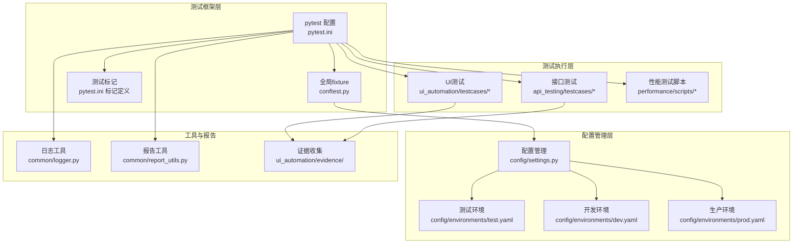
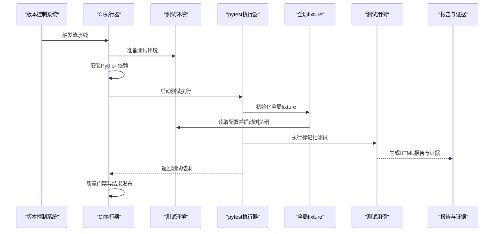
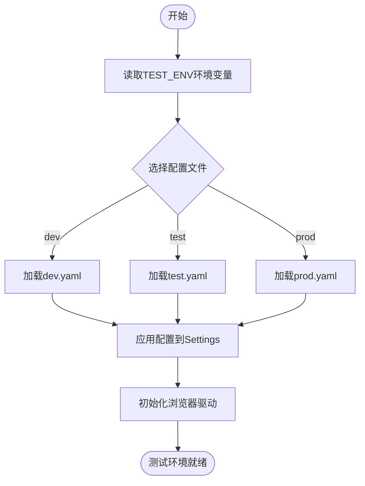
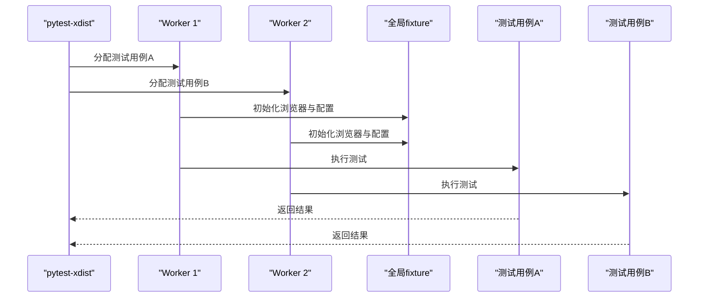
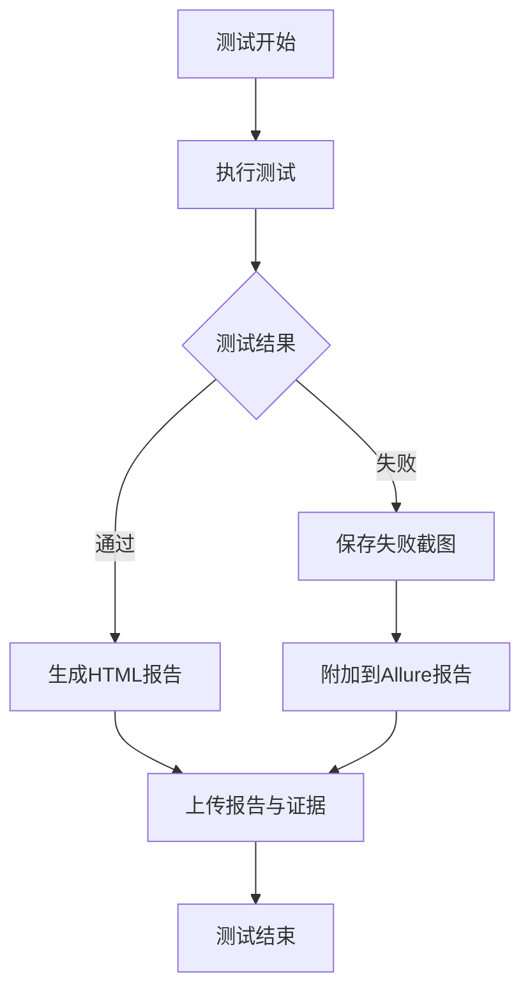
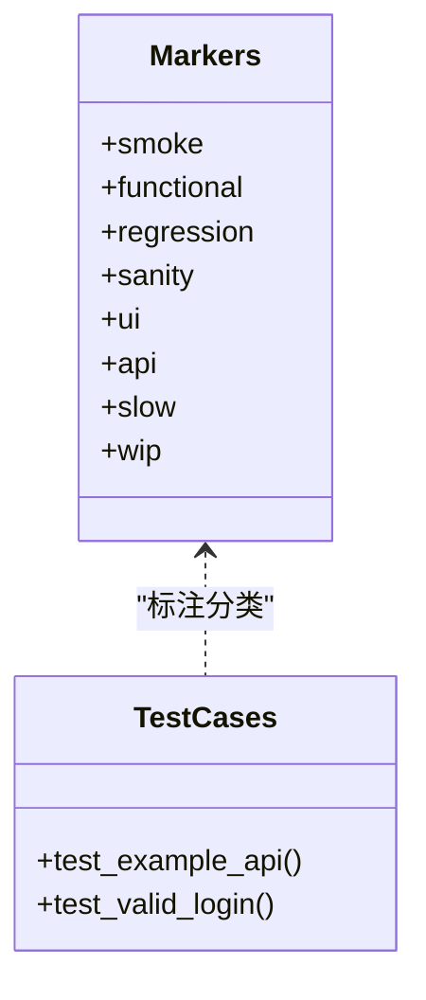
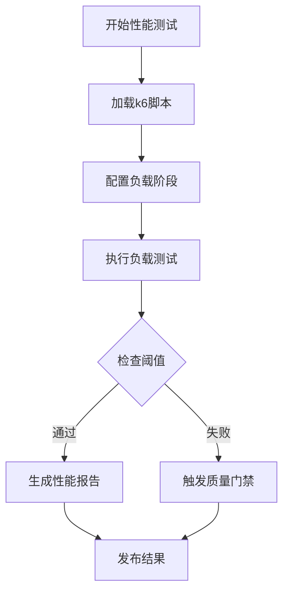
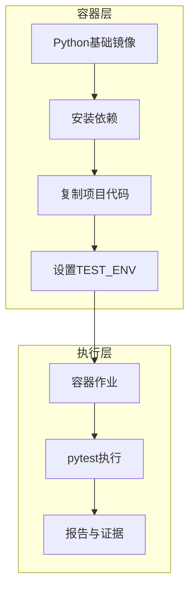
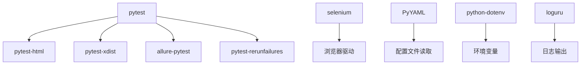

# CI/CD集成配置

<cite>
**本文档引用的文件**
- [README.md](file://README.md)
- [pytest.ini](file://pytest.ini)
- [conftest.py](file://conftest.py)
- [requirements.txt](file://requirements.txt)
- [config/settings.py](file://config/settings.py)
- [config/environments/test.yaml](file://config/environments/test.yaml)
- [config/environments/dev.yaml](file://config/environments/dev.yaml)
- [config/environments/prod.yaml](file://config/environments/prod.yaml)
- [common/report_utils.py](file://common/report_utils.py)
- [common/logger.py](file://common/logger.py)
- [api_testing/testcases/test_example_api.py](file://api_testing/testcases/test_example_api.py)
- [api_testing/testcases/conftest.py](file://api_testing/testcases/conftest.py)
- [ui_automation/testcases/test_example.py](file://ui_automation/testcases/test_example.py)
- [ui_automation/pages/base_page.py](file://ui_automation/pages/base_page.py)
- [performance/scripts/example_load_test.js](file://performance/scripts/example_load_test.js)
</cite>

## 目录
1. [简介](#简介)
2. [项目结构](#项目结构)
3. [核心组件](#核心组件)
4. [架构概览](#架构概览)
5. [详细组件分析](#详细组件分析)
6. [依赖关系分析](#依赖关系分析)
7. [性能考虑](#性能考虑)
8. [故障排除指南](#故障排除指南)
9. [结论](#结论)
10. [附录](#附录)

## 简介
本文件为测试自动化工作区的CI/CD集成配置技术文档，面向持续集成与持续部署场景，系统化阐述测试框架在流水线中的集成方式、测试执行环境配置、并行测试运行与报告收集机制，以及容器化部署、Docker配置与云平台集成方案。文档同时覆盖测试结果聚合、代码覆盖率上传与质量门禁设置，并提供GitHub Actions、Jenkins等主流CI工具的配置示例与最佳实践。

## 项目结构
该项目采用模块化组织方式，包含UI自动化、接口测试、性能测试、测试用例生成、公共工具与配置管理等模块。核心测试框架基于pytest，支持标记化测试分类、并行执行与报告生成；配置管理通过YAML文件实现多环境切换；日志系统统一输出到控制台与文件；证据收集机制在失败时自动截图并附加到报告。

**图表来源**
- [pytest.ini:1-16](file://pytest.ini#L1-L16)
- [conftest.py:1-148](file://conftest.py#L1-L148)
- [config/settings.py:1-104](file://config/settings.py#L1-L104)
- [config/environments/test.yaml:1-31](file://config/environments/test.yaml#L1-L31)
- [config/environments/dev.yaml:1-31](file://config/environments/dev.yaml#L1-L31)
- [config/environments/prod.yaml:1-31](file://config/environments/prod.yaml#L1-L31)
- [common/report_utils.py:1-143](file://common/report_utils.py#L1-L143)
- [common/logger.py:1-77](file://common/logger.py#L1-L77)

**章节来源**
- [README.md:1-123](file://README.md#L1-L123)
- [pytest.ini:1-16](file://pytest.ini#L1-L16)
- [conftest.py:1-148](file://conftest.py#L1-L148)
- [config/settings.py:1-104](file://config/settings.py#L1-L104)

## 核心组件
- 测试框架与标记系统：基于pytest的标记系统实现测试分类（冒烟、功能、回归、UI、API等），并通过命令行筛选执行不同类型的测试。
- 配置管理：通过Settings类读取YAML配置文件，支持多环境切换（dev/test/prod），提供base_url、数据库、API、浏览器等配置项。
- 全局fixture：提供WebDriver初始化、失败自动截图、环境配置注入等功能，确保测试执行的一致性与可追溯性。
- 报告与日志：统一的日志输出策略与HTML报告生成工具，便于在CI环境中收集测试结果与证据。
- 测试数据与页面对象：UI测试采用Page Object模式，结合测试数据文件实现可维护的测试用例。

**章节来源**
- [pytest.ini:7-16](file://pytest.ini#L7-L16)
- [config/settings.py:13-104](file://config/settings.py#L13-L104)
- [conftest.py:25-148](file://conftest.py#L25-L148)
- [common/report_utils.py:13-143](file://common/report_utils.py#L13-L143)
- [common/logger.py:59-77](file://common/logger.py#L59-L77)

## 架构概览
下图展示了CI/CD流水线中测试执行的关键环节：环境准备、依赖安装、测试执行、并行运行、报告与证据收集、质量门禁与结果发布。

**图表来源**
- [requirements.txt:1-25](file://requirements.txt#L1-L25)
- [conftest.py:25-148](file://conftest.py#L25-L148)
- [pytest.ini:1-16](file://pytest.ini#L1-L16)

## 详细组件分析

### 测试执行环境配置
- 多环境配置：通过YAML文件定义不同环境的base_url、数据库、API与浏览器配置，运行时根据TEST_ENV环境变量选择对应配置。
- 环境切换：在CI环境中可通过设置TEST_ENV变量切换到dev/test/prod，确保测试在目标环境执行。
- 浏览器配置：支持Chrome/Firefox，可配置headless模式、隐式等待与页面加载超时，满足本地与CI环境差异。

**图表来源**
- [config/settings.py:26-48](file://config/settings.py#L26-L48)
- [config/environments/dev.yaml:1-31](file://config/environments/dev.yaml#L1-L31)
- [config/environments/test.yaml:1-31](file://config/environments/test.yaml#L1-L31)
- [config/environments/prod.yaml:1-31](file://config/environments/prod.yaml#L1-L31)

**章节来源**
- [config/settings.py:26-96](file://config/settings.py#L26-L96)
- [config/environments/dev.yaml:1-31](file://config/environments/dev.yaml#L1-L31)
- [config/environments/test.yaml:1-31](file://config/environments/test.yaml#L1-L31)
- [config/environments/prod.yaml:1-31](file://config/environments/prod.yaml#L1-L31)

### 并行测试运行机制
- 并行执行：通过pytest-xdist插件实现并行测试运行，提升执行效率。
- 并行策略：支持auto模式自动根据CPU核数分配worker，减少CI执行时间。
- 会话级配置：全局fixture提供会话级环境配置，避免重复初始化。

**图表来源**
- [requirements.txt:4](file://requirements.txt#L4)
- [conftest.py:25-74](file://conftest.py#L25-L74)

**章节来源**
- [requirements.txt:4](file://requirements.txt#L4)
- [conftest.py:25-74](file://conftest.py#L25-L74)

### 报告收集与证据管理
- 失败自动截图：测试失败时自动保存截图到ui_automation/evidence/目录，并可附加到Allure报告。
- HTML报告：pytest-html生成详细HTML报告，配合pytest-xdist可聚合多worker结果。
- 报告工具：提供时间戳生成、报告目录创建与HTML摘要生成工具，便于CI中统一处理。

**图表来源**
- [conftest.py:84-125](file://conftest.py#L84-L125)
- [common/report_utils.py:42-143](file://common/report_utils.py#L42-L143)

**章节来源**
- [conftest.py:84-125](file://conftest.py#L84-L125)
- [common/report_utils.py:42-143](file://common/report_utils.py#L42-L143)

### 测试标记与分类
- 标记定义：在pytest.ini中定义smoke、functional、regression、sanity、ui、api、slow、wip等标记，便于按需执行。
- 标记使用：测试用例通过@pytest.mark.*标注所属类别，支持组合标记与条件执行。
- 标记筛选：在CI中可通过-m参数筛选执行特定标记的测试集。

**图表来源**
- [pytest.ini:7-16](file://pytest.ini#L7-L16)
- [api_testing/testcases/test_example_api.py:33-167](file://api_testing/testcases/test_example_api.py#L33-L167)
- [ui_automation/testcases/test_example.py:31-161](file://ui_automation/testcases/test_example.py#L31-L161)

**章节来源**
- [pytest.ini:7-16](file://pytest.ini#L7-L16)
- [api_testing/testcases/test_example_api.py:33-167](file://api_testing/testcases/test_example_api.py#L33-L167)
- [ui_automation/testcases/test_example.py:31-161](file://ui_automation/testcases/test_example.py#L31-L161)

### 性能测试集成
- k6脚本：提供示例k6负载测试脚本，包含阶梯式负载与阈值配置，可直接在CI中执行。
- 阈值设置：通过阈值控制响应时间与错误率，作为质量门禁的一部分。
- 结果聚合：性能测试结果可与功能测试报告一起收集与发布。

**图表来源**
- [performance/scripts/example_load_test.js:5-33](file://performance/scripts/example_load_test.js#L5-L33)

**章节来源**
- [performance/scripts/example_load_test.js:5-33](file://performance/scripts/example_load_test.js#L5-L33)

### 容器化部署与云平台集成
- Docker镜像：建议基于官方Python镜像构建测试执行环境，安装依赖并复制项目代码。
- 环境变量：在容器启动时设置TEST_ENV以选择目标环境配置。
- 云平台集成：可在GitHub Actions或Jenkins中使用容器作业，挂载报告与证据目录，实现跨平台一致性。

**图表来源**
- [requirements.txt:1-25](file://requirements.txt#L1-L25)
- [config/settings.py:34](file://config/settings.py#L34)

**章节来源**
- [requirements.txt:1-25](file://requirements.txt#L1-L25)
- [config/settings.py:34](file://config/settings.py#L34)

## 依赖关系分析
- 测试框架依赖：pytest为核心，配合pytest-html、pytest-xdist、allure-pytest等插件实现报告与并行执行。
- UI自动化依赖：selenium驱动浏览器，支持Chrome/Firefox，需在CI中安装对应驱动。
- 数据处理与日志：PyYAML、openpyxl用于数据处理，loguru提供统一日志输出。
- 配置依赖：PyYAML用于读取YAML配置文件，python-dotenv用于环境变量管理。

**图表来源**
- [requirements.txt:2-25](file://requirements.txt#L2-L25)

**章节来源**
- [requirements.txt:2-25](file://requirements.txt#L2-L25)

## 性能考虑
- 并行执行：合理设置worker数量，避免过度并发导致资源争用。
- 资源管理：在全局fixture中统一管理浏览器生命周期，避免内存泄漏。
- 报告生成：在CI中启用轻量报告生成，减少磁盘I/O压力。
- 缓存策略：利用pytest缓存与依赖缓存，缩短重复执行时间。

## 故障排除指南
- 浏览器驱动问题：确保CI环境中安装了对应浏览器驱动，并与selenium版本兼容。
- 配置文件缺失：检查TEST_ENV是否正确，确认对应YAML配置文件存在且格式正确。
- 失败截图异常：检查证据目录权限与磁盘空间，确保截图能够正常保存。
- 日志输出异常：确认loguru配置与日志目录权限，避免因权限问题导致日志丢失。

**章节来源**
- [conftest.py:96-125](file://conftest.py#L96-L125)
- [common/logger.py:34-56](file://common/logger.py#L34-L56)

## 结论
本技术文档系统化阐述了测试框架在CI/CD流水线中的集成方式，包括环境配置、并行执行、报告收集与证据管理、容器化部署与云平台集成、质量门禁与结果发布等关键环节。通过标记化测试分类与多环境配置，项目能够在不同环境下稳定执行；通过并行执行与统一报告工具，显著提升CI效率与可观测性；通过容器化与云平台集成，实现跨平台一致性与可扩展性。

## 附录
- GitHub Actions配置要点：设置TEST_ENV、安装依赖、并行执行、收集报告与证据、质量门禁。
- Jenkins配置要点：使用容器作业、参数化构建、并行执行、报告聚合与通知。
- 代码覆盖率：建议在CI中集成覆盖率工具，将覆盖率结果作为质量门禁指标之一。