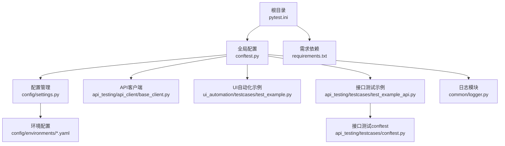
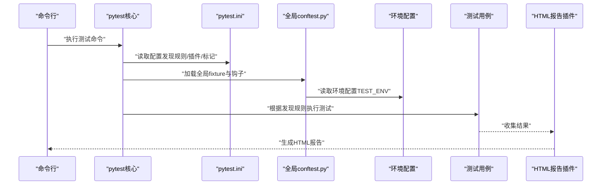
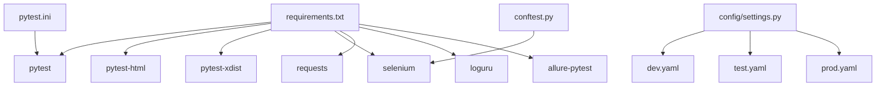

# pytest配置文件

<cite>
**本文引用的文件**
- [pytest.ini](file://pytest.ini)
- [conftest.py](file://conftest.py)
- [api_testing/testcases/conftest.py](file://api_testing/testcases/conftest.py)
- [requirements.txt](file://requirements.txt)
- [config/settings.py](file://config/settings.py)
- [config/environments/dev.yaml](file://config/environments/dev.yaml)
- [config/environments/test.yaml](file://config/environments/test.yaml)
- [config/environments/prod.yaml](file://config/environments/prod.yaml)
- [api_testing/api_client/base_client.py](file://api_testing/api_client/base_client.py)
- [api_testing/testcases/test_example_api.py](file://api_testing/testcases/test_example_api.py)
- [ui_automation/testcases/test_example.py](file://ui_automation/testcases/test_example.py)
- [common/logger.py](file://common/logger.py)
</cite>

## 目录
1. [简介](#简介)
2. [项目结构](#项目结构)
3. [核心组件](#核心组件)
4. [架构总览](#架构总览)
5. [详细组件分析](#详细组件分析)
6. [依赖分析](#依赖分析)
7. [性能考虑](#性能考虑)
8. [故障排除指南](#故障排除指南)
9. [结论](#结论)
10. [附录](#附录)

## 简介
本文件面向pytest配置与测试工程化落地，围绕pytest.ini中的配置选项进行系统化技术文档化，涵盖测试发现规则、插件配置、标记过滤、报告生成、测试目录结构与命名约定、测试类/方法发现机制、HTML报告配置、覆盖率统计与并行执行设置、配置优先级与环境变量覆盖、配置验证方法以及最佳实践与故障排除建议。本文所有内容均基于仓库中现有文件进行归纳总结，确保可追溯性与可操作性。

## 项目结构
该项目采用多模块分层组织，pytest配置集中在根目录的配置文件中，并通过全局与局部的conftest.py实现跨模块的fixture与钩子注入；配置管理由settings模块统一读取环境配置文件；API测试与UI自动化分别位于独立子目录，便于隔离与扩展。

图表来源
- [pytest.ini:1-12](file://pytest.ini#L1-L12)
- [conftest.py:1-122](file://conftest.py#L1-L122)
- [requirements.txt:1-21](file://requirements.txt#L1-L21)
- [config/settings.py:1-104](file://config/settings.py#L1-L104)
- [config/environments/dev.yaml:1-31](file://config/environments/dev.yaml#L1-L31)
- [config/environments/test.yaml:1-31](file://config/environments/test.yaml#L1-L31)
- [config/environments/prod.yaml:1-31](file://config/environments/prod.yaml#L1-L31)
- [api_testing/api_client/base_client.py:1-308](file://api_testing/api_client/base_client.py#L1-L308)
- [api_testing/testcases/test_example_api.py:1-167](file://api_testing/testcases/test_example_api.py#L1-L167)
- [ui_automation/testcases/test_example.py:1-161](file://ui_automation/testcases/test_example.py#L1-L161)
- [common/logger.py:1-77](file://common/logger.py#L1-L77)
- [api_testing/testcases/conftest.py:1-80](file://api_testing/testcases/conftest.py#L1-L80)

章节来源
- [pytest.ini:1-12](file://pytest.ini#L1-L12)
- [conftest.py:1-122](file://conftest.py#L1-L122)
- [requirements.txt:1-21](file://requirements.txt#L1-L21)

## 核心组件
- 测试发现与执行
  - 测试路径与命名规则：通过配置文件指定扫描目录与文件/类/函数命名模式，确保pytest能正确发现测试用例。
  - 插件与报告：内置HTML报告插件，支持生成自包含的HTML报告。
  - 标记过滤：预定义多种测试标记，便于按类别筛选执行。
- 配置管理
  - 环境切换：通过环境变量选择不同环境配置文件，集中管理基础URL、浏览器与API参数等。
  - 全局fixture：提供WebDriver生命周期管理、失败截图、基础URL注入等能力。
- 测试支撑
  - API客户端：封装HTTP请求、断言与日志，统一接口测试体验。
  - UI自动化：示例测试用例展示Page Object模式与标记使用。
  - 日志系统：统一控制台与文件日志输出，便于问题定位与审计。

章节来源
- [pytest.ini:1-12](file://pytest.ini#L1-L12)
- [conftest.py:1-122](file://conftest.py#L1-L122)
- [config/settings.py:1-104](file://config/settings.py#L1-L104)
- [api_testing/api_client/base_client.py:1-308](file://api_testing/api_client/base_client.py#L1-L308)
- [ui_automation/testcases/test_example.py:1-161](file://ui_automation/testcases/test_example.py#L1-L161)
- [api_testing/testcases/test_example_api.py:1-167](file://api_testing/testcases/test_example_api.py#L1-L167)
- [common/logger.py:1-77](file://common/logger.py#L1-L77)

## 架构总览
下图展示了从pytest配置到测试执行、报告生成与配置加载的整体流程。

图表来源
- [pytest.ini:1-12](file://pytest.ini#L1-L12)
- [conftest.py:112-122](file://conftest.py#L112-L122)
- [config/settings.py:26-48](file://config/settings.py#L26-L48)
- [requirements.txt:2-4](file://requirements.txt#L2-L4)

## 详细组件分析

### pytest.ini配置详解
- 测试发现规则
  - testpaths：指定pytest扫描的测试目录，避免在大型项目中全量扫描，提升发现效率。
  - python_files/python_classes/python_functions：限定文件、类、函数命名模式，确保只有符合规范的测试被识别。
- 插件与报告
  - addopts：追加命令行参数，此处启用详细输出与HTML报告生成，并使用自包含模式减少外部依赖。
- 标记过滤
  - markers：预定义冒烟、回归、接口、UI等标记，便于按需筛选执行。

章节来源
- [pytest.ini:1-12](file://pytest.ini#L1-L12)

### 全局conftest.py（全局配置与钩子）
- WebDriver生命周期管理
  - driver fixture：按配置文件中的浏览器类型、无头模式、隐式等待与页面加载超时初始化与销毁浏览器实例。
  - base_url fixture：提供当前环境的基础URL，便于测试用例直接使用。
- 失败自动截图钩子
  - 在测试执行阶段失败时，自动保存截图至证据目录，便于问题复现与定位。
- 自定义标记注册
  - 在pytest_configure中注册UI、冒烟、回归、接口等标记，避免警告并统一标记体系。

章节来源
- [conftest.py:25-70](file://conftest.py#L25-L70)
- [conftest.py:80-110](file://conftest.py#L80-L110)
- [conftest.py:112-122](file://conftest.py#L112-L122)

### 接口测试conftest.py（接口测试公共fixture）
- api_client与auth_client：提供基础与带Token认证的API客户端fixture，自动关闭连接，避免资源泄漏。
- base_url：从配置中读取API基础地址，便于接口测试统一入口。

章节来源
- [api_testing/testcases/conftest.py:16-30](file://api_testing/testcases/conftest.py#L16-L30)
- [api_testing/testcases/conftest.py:32-71](file://api_testing/testcases/conftest.py#L32-L71)
- [api_testing/testcases/conftest.py:73-80](file://api_testing/testcases/conftest.py#L73-L80)

### 配置管理（settings与环境配置）
- Settings类
  - 通过环境变量TEST_ENV选择环境配置文件，支持属性访问与字典风格get方法。
  - 提供base_url、username、password、database、api、browser等便捷属性。
- 环境配置文件
  - dev/test/prod三套环境，分别定义基础URL、账号、数据库、API与浏览器配置。
- 使用方式
  - 全局与局部conftest.py均通过settings读取配置，确保一致性。

章节来源
- [config/settings.py:13-104](file://config/settings.py#L13-L104)
- [config/environments/dev.yaml:1-31](file://config/environments/dev.yaml#L1-L31)
- [config/environments/test.yaml:1-31](file://config/environments/test.yaml#L1-L31)
- [config/environments/prod.yaml:1-31](file://config/environments/prod.yaml#L1-L31)

### API客户端（BaseClient）
- 功能特性
  - 统一封装HTTP请求方法（GET/POST/PUT/DELETE/PATCH/上传），支持自定义Headers与超时。
  - 统一日志记录：请求与响应详情，便于调试与审计。
  - 断言辅助：状态码、JSON键、响应时间、列表非空、键值包含等断言方法。
  - Session管理与资源释放：自动关闭Session，避免连接泄漏。
- 使用建议
  - 在接口测试中优先使用该客户端，统一行为与断言风格。

章节来源
- [api_testing/api_client/base_client.py:18-308](file://api_testing/api_client/base_client.py#L18-L308)

### UI自动化示例（测试用例）
- 标记使用
  - 通过@pytest.mark.ui与@pytest.mark.smoke等标记区分测试类型与优先级。
- Page Object模式
  - 通过页面对象封装元素定位与操作，提升可维护性。
- 失败处理
  - 示例中使用skip标记占位，避免误执行；实际使用时替换为真实地址与断言。

章节来源
- [ui_automation/testcases/test_example.py:31-161](file://ui_automation/testcases/test_example.py#L31-L161)

### 接口测试示例（测试用例）
- 断言示例
  - 展示健康检查、GET/POST请求、响应断言、自定义Headers与Token认证等典型场景。
- 标记使用
  - 通过@pytest.mark.api标记统一筛选接口测试。

章节来源
- [api_testing/testcases/test_example_api.py:33-167](file://api_testing/testcases/test_example_api.py#L33-L167)

### 日志系统（统一日志）
- 输出策略
  - 控制台输出INFO及以上级别，文件输出DEBUG及以上级别，按天轮转并保留7天。
- 使用方式
  - 通过get_logger(name)绑定模块名，便于区分来源。

章节来源
- [common/logger.py:1-77](file://common/logger.py#L1-L77)

## 依赖分析
- 插件依赖
  - pytest-html：生成HTML报告。
  - pytest-xdist：并行执行（需配合命令行参数）。
  - selenium：UI自动化浏览器驱动。
  - requests：接口测试HTTP客户端。
  - loguru：统一日志输出。
  - allure-pytest：可选的报告插件。
- 配置依赖
  - pytest.ini决定发现规则与默认参数。
  - conftest.py注入全局fixture与钩子。
  - settings.py与环境配置文件提供运行时配置。

图表来源
- [requirements.txt:1-21](file://requirements.txt#L1-L21)
- [pytest.ini:1-12](file://pytest.ini#L1-L12)
- [conftest.py:1-122](file://conftest.py#L1-L122)
- [config/settings.py:1-104](file://config/settings.py#L1-L104)
- [config/environments/dev.yaml:1-31](file://config/environments/dev.yaml#L1-L31)
- [config/environments/test.yaml:1-31](file://config/environments/test.yaml#L1-L31)
- [config/environments/prod.yaml:1-31](file://config/environments/prod.yaml#L1-L31)

章节来源
- [requirements.txt:1-21](file://requirements.txt#L1-L21)
- [pytest.ini:1-12](file://pytest.ini#L1-L12)
- [conftest.py:1-122](file://conftest.py#L1-L122)
- [config/settings.py:1-104](file://config/settings.py#L1-L104)

## 性能考虑
- 测试发现优化
  - 通过testpaths精准限定扫描范围，减少扫描时间。
  - 使用python_files/python_classes/python_functions限制命名模式，避免误发现。
- 并行执行
  - requirements中包含pytest-xdist，可通过命令行参数启用并行，建议结合标记过滤与无状态测试使用。
- 资源管理
  - 全局与局部conftest中均实现资源释放（浏览器、Session），避免内存与连接泄漏。
- 日志级别
  - 控制台INFO级别与文件DEBUG级别分离，避免过多I/O影响性能。

[本节为通用指导，无需特定文件引用]

## 故障排除指南
- HTML报告无法生成
  - 确认已安装pytest-html且addopts中包含HTML相关参数。
  - 检查报告输出路径是否存在权限问题。
- 测试未被发现
  - 检查testpaths是否包含目标目录，文件/类/函数命名是否符合python_files/python_classes/python_functions约定。
- 标记过滤无效
  - 确认pytest.ini中markers已定义，或在conftest.py中注册了相应标记。
- 浏览器初始化失败
  - 检查环境变量TEST_ENV指向的环境配置文件是否存在，浏览器类型与驱动版本是否匹配。
- 接口测试超时或连接错误
  - 检查API基础URL与超时配置，必要时调整超时参数或网络环境。
- 失败截图未生成
  - 确认钩子已在conftest.py中注册，且测试确实在执行阶段失败。

章节来源
- [pytest.ini:1-12](file://pytest.ini#L1-L12)
- [conftest.py:80-110](file://conftest.py#L80-L110)
- [config/settings.py:26-48](file://config/settings.py#L26-L48)
- [api_testing/api_client/base_client.py:120-134](file://api_testing/api_client/base_client.py#L120-L134)

## 结论
本项目通过明确的pytest.ini配置、统一的配置管理与丰富的fixture/钩子，构建了可扩展、可维护的测试工程化体系。结合HTML报告与日志系统，能够高效地完成接口与UI自动化测试，并为后续扩展（如并行执行、覆盖率统计）提供良好基础。建议在团队内统一标记与命名规范，持续完善环境配置与测试数据管理。

[本节为总结性内容，无需特定文件引用]

## 附录

### 配置优先级与环境变量覆盖
- 配置来源优先级（从高到低）
  - 命令行参数（覆盖默认配置）
  - pytest.ini中的addopts（默认追加参数）
  - 环境变量（如TEST_ENV）
  - 全局/局部conftest.py（fixture与钩子）
  - 环境配置文件（YAML）
- 环境变量覆盖
  - TEST_ENV用于选择环境配置文件，从而影响基础URL、浏览器与API参数等。

章节来源
- [pytest.ini:6-6](file://pytest.ini#L6-L6)
- [config/settings.py:26-48](file://config/settings.py#L26-L48)

### 测试目录结构与命名约定
- 目录结构
  - ui_automation/testcases：UI自动化测试用例
  - api_testing/testcases：接口测试用例
  - api_testing/api_client：接口测试客户端封装
  - config/environments：环境配置文件
  - common：通用工具（日志等）
- 命名约定
  - 文件：test_*.py
  - 类：Test*
  - 方法：test_*

章节来源
- [pytest.ini:2-5](file://pytest.ini#L2-L5)
- [ui_automation/testcases/test_example.py:31-161](file://ui_automation/testcases/test_example.py#L31-L161)
- [api_testing/testcases/test_example_api.py:18-167](file://api_testing/testcases/test_example_api.py#L18-L167)

### 标记过滤与筛选
- 预定义标记
  - smoke：冒烟测试
  - regression：回归测试
  - api：接口测试
  - ui：UI自动化测试
- 使用方式
  - 通过命令行-m参数按标记筛选，如-m "api" 或 -m "ui and smoke"。

章节来源
- [pytest.ini:7-12](file://pytest.ini#L7-L12)
- [conftest.py:118-121](file://conftest.py#L118-L121)
- [ui_automation/testcases/test_example.py:31-31](file://ui_automation/testcases/test_example.py#L31-L31)
- [api_testing/testcases/test_example_api.py:33-33](file://api_testing/testcases/test_example_api.py#L33-L33)

### HTML报告配置与生成
- 生成方式
  - addopts中启用HTML报告与自包含模式，自动输出到指定路径。
- 报告内容
  - 包含测试结果、日志与截图（若启用失败截图）。

章节来源
- [pytest.ini:6-6](file://pytest.ini#L6-L6)
- [conftest.py:80-110](file://conftest.py#L80-L110)

### 覆盖率统计与并行执行设置
- 覆盖率统计
  - 本仓库未包含覆盖率插件与配置，如需启用可在requirements中添加覆盖率相关插件并在命令行或配置中启用。
- 并行执行
  - requirements中包含pytest-xdist，可通过命令行参数启用并行执行，建议结合标记过滤与无状态测试使用。

章节来源
- [requirements.txt:4-4](file://requirements.txt#L4-L4)
- [requirements.txt:19-21](file://requirements.txt#L19-L21)

### 配置验证方法
- 命令行验证
  - 使用--collect-only查看pytest发现的测试集合，确认命名与路径符合预期。
  - 使用--markers查看已注册的标记，确认是否包含预期标记。
- 环境验证
  - 通过打印settings属性或在测试中断言基础URL，确认环境配置正确加载。

章节来源
- [conftest.py:118-121](file://conftest.py#L118-L121)
- [config/settings.py:50-83](file://config/settings.py#L50-L83)

### 常见配置场景最佳实践
- 多环境并行执行
  - 使用TEST_ENV切换环境，结合-m标记按环境筛选测试，避免跨环境污染。
- UI自动化稳定性
  - 在浏览器配置中设置合理的隐式等待与页面加载超时，必要时开启无头模式。
- 接口测试健壮性
  - 使用BaseClient统一请求与断言，合理设置超时与重试策略。
- 报告与证据
  - 启用HTML报告与失败截图，确保问题可复现与可追踪。

章节来源
- [config/environments/dev.yaml:25-31](file://config/environments/dev.yaml#L25-L31)
- [config/environments/test.yaml:25-31](file://config/environments/test.yaml#L25-L31)
- [config/environments/prod.yaml:25-31](file://config/environments/prod.yaml#L25-L31)
- [api_testing/api_client/base_client.py:21-44](file://api_testing/api_client/base_client.py#L21-L44)
- [conftest.py:80-110](file://conftest.py#L80-L110)