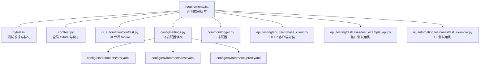
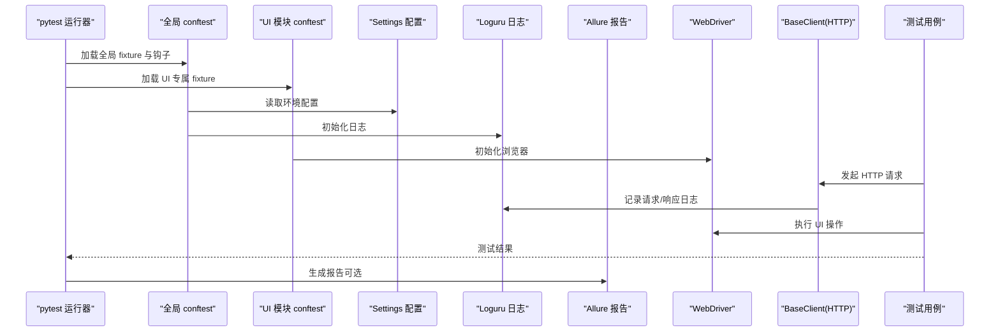
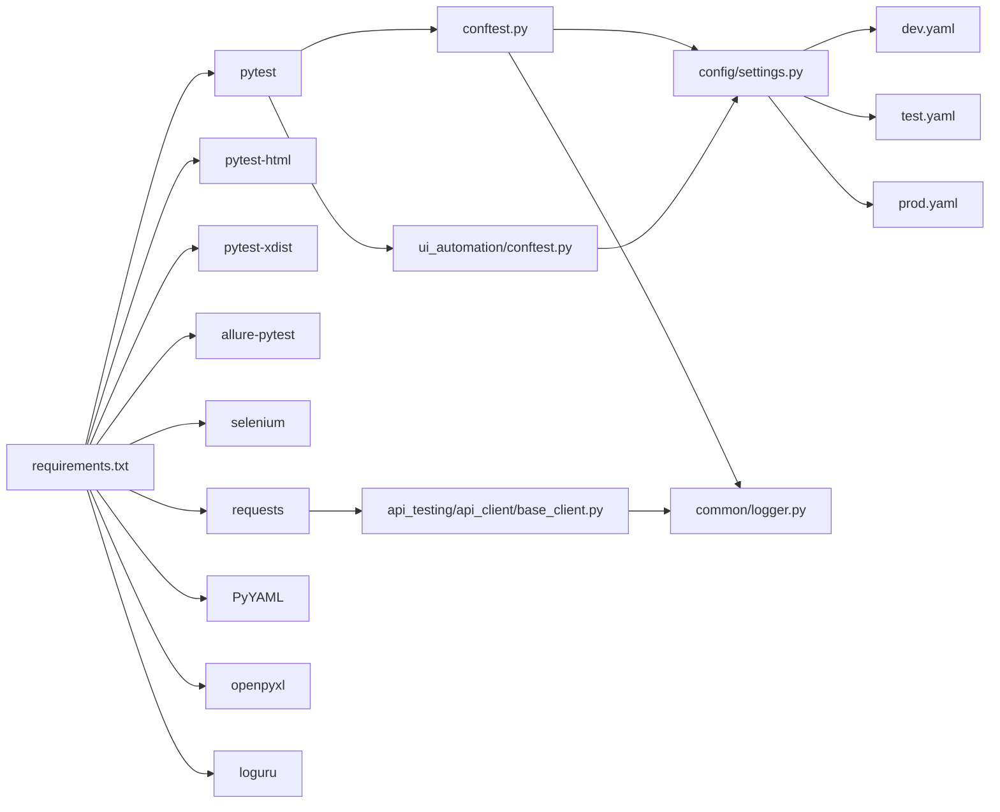
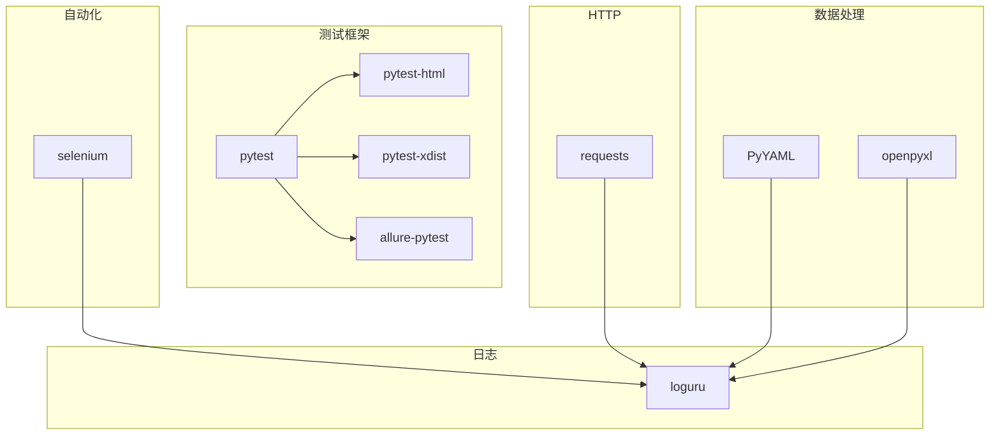

# 依赖管理

<cite>
**本文引用的文件**
- [requirements.txt](file://requirements.txt)
- [pytest.ini](file://pytest.ini)
- [conftest.py](file://conftest.py)
- [config/settings.py](file://config/settings.py)
- [config/environments/dev.yaml](file://config/environments/dev.yaml)
- [config/environments/test.yaml](file://config/environments/test.yaml)
- [config/environments/prod.yaml](file://config/environments/prod.yaml)
- [common/logger.py](file://common/logger.py)
- [ui_automation/conftest.py](file://ui_automation/conftest.py)
- [api_testing/api_client/base_client.py](file://api_testing/api_client/base_client.py)
- [api_testing/testcases/test_example_api.py](file://api_testing/testcases/test_example_api.py)
- [ui_automation/testcases/test_example.py](file://ui_automation/testcases/test_example.py)
- [README.md](file://README.md)
</cite>

## 目录
1. [引言](#引言)
2. [项目结构](#项目结构)
3. [核心组件](#核心组件)
4. [架构总览](#架构总览)
5. [详细组件分析](#详细组件分析)
6. [依赖关系分析](#依赖关系分析)
7. [性能考量](#性能考量)
8. [故障排除指南](#故障排除指南)
9. [结论](#结论)
10. [附录](#附录)

## 引言
本文件系统性梳理并文档化该项目的依赖管理体系，重点覆盖以下方面：
- requirements.txt 中各依赖包的功能定位、版本要求与兼容性
- 依赖层次结构、版本约束与潜在冲突的识别与化解策略
- 开发、测试、生产三类环境的依赖差异与配置联动
- 依赖更新流程、安全漏洞检查与锁定版本管理建议
- 虚拟环境配置、依赖安装优化与常见问题排查

## 项目结构
该项目采用分层模块化组织，核心测试能力由 pytest 驱动，结合 Selenium（UI 自动化）、Requests（接口测试）、Loguru（日志）、PyYAML/openpyxl（数据处理）以及可选 Allure 报告等组成。配置通过 YAML 文件按环境拆分，统一由 Settings 类集中管理。

图表来源
- [requirements.txt:1-21](file://requirements.txt#L1-L21)
- [pytest.ini:1-12](file://pytest.ini#L1-L12)
- [conftest.py:1-148](file://conftest.py#L1-L148)
- [ui_automation/conftest.py:1-99](file://ui_automation/conftest.py#L1-L99)
- [config/settings.py:1-104](file://config/settings.py#L1-L104)
- [config/environments/dev.yaml:1-31](file://config/environments/dev.yaml#L1-L31)
- [config/environments/test.yaml:1-31](file://config/environments/test.yaml#L1-L31)
- [config/environments/prod.yaml:1-31](file://config/environments/prod.yaml#L1-L31)
- [common/logger.py:1-77](file://common/logger.py#L1-L77)
- [api_testing/api_client/base_client.py:1-308](file://api_testing/api_client/base_client.py#L1-L308)
- [api_testing/testcases/test_example_api.py:1-167](file://api_testing/testcases/test_example_api.py#L1-L167)
- [ui_automation/testcases/test_example.py:1-161](file://ui_automation/testcases/test_example.py#L1-L161)

章节来源
- [README.md:1-123](file://README.md#L1-L123)
- [requirements.txt:1-21](file://requirements.txt#L1-L21)

## 核心组件
- 测试框架与并行执行
  - pytest：测试发现、标记、HTML 报告、并行执行（xdist）
  - pytest-html：生成 HTML 报告
  - pytest-xdist：分布式并行执行
- Web UI 自动化
  - selenium：WebDriver 管理、浏览器选项、失败截图与 Allure 附件
- 接口测试
  - requests：HTTP 客户端封装、会话复用、断言工具
- 数据处理
  - PyYAML：测试数据与配置文件解析
  - openpyxl：Excel 数据处理（用于数据驱动或报告）
- 日志
  - loguru：统一日志输出、文件轮转与级别控制
- 报告（可选）
  - allure-pytest：测试失败自动附加截图作为附件

章节来源
- [requirements.txt:1-21](file://requirements.txt#L1-L21)
- [pytest.ini:1-12](file://pytest.ini#L1-L12)
- [conftest.py:84-125](file://conftest.py#L84-L125)
- [common/logger.py:1-77](file://common/logger.py#L1-L77)
- [api_testing/api_client/base_client.py:18-308](file://api_testing/api_client/base_client.py#L18-L308)

## 架构总览
下图展示了依赖在运行期的交互关系：pytest 通过 conftest 注入全局与模块级 fixture；UI 与 API 测试分别消费这些 fixture；配置由 Settings 从 YAML 环境文件读取；日志由 loguru 统一输出；可选 Allure 在失败时附加截图。

图表来源
- [conftest.py:25-74](file://conftest.py#L25-L74)
- [ui_automation/conftest.py:23-64](file://ui_automation/conftest.py#L23-L64)
- [config/settings.py:37-48](file://config/settings.py#L37-L48)
- [common/logger.py:40-56](file://common/logger.py#L40-L56)
- [api_testing/api_client/base_client.py:91-134](file://api_testing/api_client/base_client.py#L91-L134)
- [pytest.ini:6](file://pytest.ini#L6)

## 详细组件分析

### 依赖清单与版本要求
- 测试框架与报告
  - pytest：版本固定，确保测试行为一致
  - pytest-html：生成 HTML 报告
  - pytest-xdist：并行执行，提升吞吐
  - allure-pytest：可选，失败时自动附加截图
- Web UI 自动化
  - selenium：版本固定，配合浏览器驱动
- 接口测试
  - requests：版本固定，HTTP 客户端封装
- 数据处理
  - PyYAML：YAML 解析
  - openpyxl：Excel 处理
- 日志
  - loguru：统一日志输出与轮转

章节来源
- [requirements.txt:1-21](file://requirements.txt#L1-L21)

### 依赖层次结构与耦合关系
- 运行期依赖链
  - pytest 依赖 pytest-html/xdist/allure-pytest（可选）
  - selenium 依赖浏览器驱动（需与浏览器版本匹配）
  - requests 为 HTTP 客户端，被 BaseClient 封装
  - loguru 为日志基础设施，被各模块共享
  - PyYAML/openpyxl 为数据处理工具，被配置与测试数据读取使用
- 配置与环境
  - Settings 从 YAML 环境文件读取 base_url、API 配置、浏览器配置等
  - conftest 与 UI 模块 conftest 读取 Settings 并初始化 WebDriver
- 测试用例消费
  - UI 与 API 测试用例通过 pytest 标记与 fixture 进行组织与执行

图表来源
- [requirements.txt:1-21](file://requirements.txt#L1-L21)
- [conftest.py:19-22](file://conftest.py#L19-L22)
- [ui_automation/conftest.py:14-20](file://ui_automation/conftest.py#L14-L20)
- [config/settings.py:37-48](file://config/settings.py#L37-L48)
- [config/environments/dev.yaml:1-31](file://config/environments/dev.yaml#L1-L31)
- [config/environments/test.yaml:1-31](file://config/environments/test.yaml#L1-L31)
- [config/environments/prod.yaml:1-31](file://config/environments/prod.yaml#L1-L31)
- [common/logger.py:12](file://common/logger.py#L12)
- [api_testing/api_client/base_client.py:5-13](file://api_testing/api_client/base_client.py#L5-L13)

### 版本兼容性与冲突策略
- 版本锁定
  - 通过 requirements.txt 明确各依赖版本，避免升级导致的破坏性变化
- 浏览器与驱动
  - selenium 版本与浏览器驱动需匹配，建议在 CI/CD 中统一镜像与驱动版本
- pytest 插件
  - pytest-html、pytest-xdist、allure-pytest 与 pytest 版本需兼容，建议遵循官方兼容矩阵
- requests 与 urllib3
  - requests 依赖 urllib3，若出现 SSL/TLS 或连接池问题，需关注 requests 与 urllib3 的兼容性
- 日志与并发
  - loguru 在多线程/并行场景下表现稳定，但需避免重复 handler 导致的日志重复输出（已在 logger 初始化中移除默认 handler）

章节来源
- [requirements.txt:1-21](file://requirements.txt#L1-L21)
- [common/logger.py:35](file://common/logger.py#L35)

### 开发、测试、生产环境的依赖差异
- 环境配置
  - dev/test/prod 三套 YAML 配置，分别提供 base_url、API 配置、浏览器配置（headless 等）
- 运行差异
  - dev/test：headless=false，便于本地调试
  - prod：headless=true，减少资源占用
- 依赖一致性
  - 三套环境共享同一组依赖，差异体现在配置而非依赖本身

章节来源
- [config/environments/dev.yaml:25-31](file://config/environments/dev.yaml#L25-L31)
- [config/environments/test.yaml:25-31](file://config/environments/test.yaml#L25-L31)
- [config/environments/prod.yaml:25-31](file://config/environments/prod.yaml#L25-L31)

### 依赖更新流程与锁定版本管理
- 更新流程建议
  - 本地隔离：在独立分支进行依赖升级验证
  - 逐项升级：先升级次要版本，再验证 UI/接口测试
  - 回归测试：运行冒烟测试与回归测试，确保稳定性
  - 记录变更：更新 requirements.txt 并在变更日志中标注
- 锁定版本管理
  - 使用 requirements.txt 固定版本，避免意外升级
  - CI 中使用 pip-tools 或 pipenv 管理锁定文件，确保构建一致性
- 安全扫描
  - 使用 pip-audit 或 pipenv 的安全检查功能定期扫描
  - 关注 CVE 与第三方依赖的安全公告，及时修复

章节来源
- [requirements.txt:1-21](file://requirements.txt#L1-L21)
- [README.md:64-81](file://README.md#L64-L81)

### 虚拟环境配置与安装优化
- 虚拟环境
  - 使用 python -m venv 创建 venv，激活后安装 requirements.txt
- 安装优化
  - 使用缓存与离线源：pip install -r requirements.txt --cache-dir ~/.cache/pip
  - 并行安装：pip install -r requirements.txt -n auto（需 pytest-xdist）
- 依赖顺序
  - 先安装编译型依赖（如 lxml、numpy），再安装 Python 包，减少编译失败

章节来源
- [README.md:54-62](file://README.md#L54-L62)

## 依赖关系分析
- 直接依赖
  - pytest 依赖 pytest-html/xdist/allure-pytest（可选）
  - selenium 依赖浏览器驱动
  - requests 为 HTTP 客户端
  - loguru 为日志基础设施
  - PyYAML/openpyxl 为数据处理
- 间接依赖
  - requests 依赖 urllib3、certifi 等
  - selenium 依赖 webdriver-manager（可选，用于自动下载驱动）
- 潜在循环依赖
  - 未见循环依赖迹象；配置与日志模块为基础设施，被上层模块使用

图表来源
- [requirements.txt:1-21](file://requirements.txt#L1-L21)

章节来源
- [requirements.txt:1-21](file://requirements.txt#L1-L21)

## 性能考量
- 并行执行
  - 使用 pytest-xdist 进行进程级并行，提升整体吞吐
- HTTP 客户端
  - BaseClient 使用 requests.Session 复用连接，降低握手开销
- 日志输出
  - 控制台 INFO 级别与文件 DEBUG 级别分离，避免过多 IO 影响性能
- UI 自动化
  - 生产环境 headless=true，减少图形开销；合理设置隐式等待与页面加载超时

章节来源
- [pytest.ini:6](file://pytest.ini#L6)
- [api_testing/api_client/base_client.py:29](file://api_testing/api_client/base_client.py#L29)
- [common/logger.py:40-56](file://common/logger.py#L40-L56)
- [config/environments/prod.yaml:28](file://config/environments/prod.yaml#L28)

## 故障排除指南
- 浏览器驱动问题
  - 症状：启动 WebDriver 失败或报错
  - 排查：确认 selenium 版本与浏览器驱动匹配；在 CI 中使用固定驱动版本
- 报告生成失败
  - 症状：pytest-html 或 allure 无法生成报告
  - 排查：确认插件版本与 pytest 兼容；检查报告输出路径权限
- 日志重复或缺失
  - 症状：控制台重复输出或日志文件未生成
  - 排查：确认已移除默认 handler；检查日志目录权限与轮转配置
- 并行执行异常
  - 症状：多进程间资源竞争或不稳定
  - 排查：避免共享状态；使用会话级 fixture；限制并发度
- 配置读取错误
  - 症状：找不到配置文件或环境变量无效
  - 排查：确认 TEST_ENV 环境变量；检查 YAML 文件语法与路径

章节来源
- [common/logger.py:35](file://common/logger.py#L35)
- [config/settings.py:42-48](file://config/settings.py#L42-L48)
- [conftest.py:127-138](file://conftest.py#L127-L138)

## 结论
本项目通过明确的依赖清单、清晰的环境配置与统一的日志体系，构建了稳定可靠的测试自动化平台。建议持续遵循“锁定版本 + 安全扫描 + 有序更新”的流程，确保在快速迭代的同时保持测试稳定性与可追溯性。

## 附录
- 快速开始与运行示例
  - 创建虚拟环境并安装依赖
  - 运行全部测试、按标记运行、并行执行
- 依赖清单参考
  - 测试框架：pytest、pytest-html、pytest-xdist、allure-pytest
  - UI 自动化：selenium
  - 接口测试：requests
  - 数据处理：PyYAML、openpyxl
  - 日志：loguru

章节来源
- [README.md:54-81](file://README.md#L54-L81)
- [requirements.txt:1-21](file://requirements.txt#L1-L21)