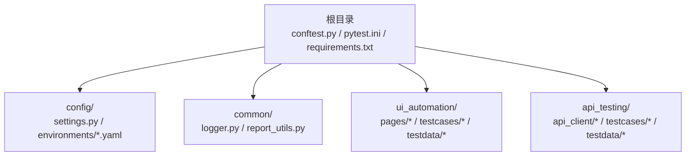
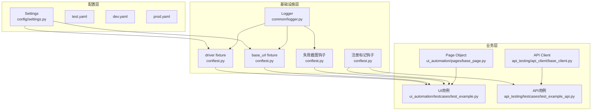
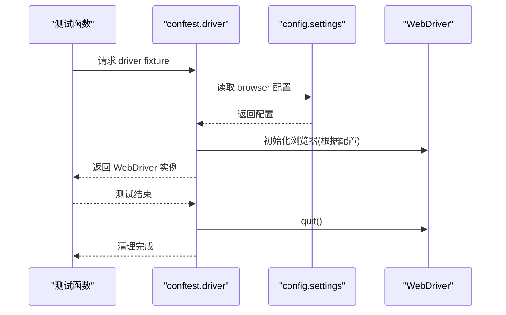
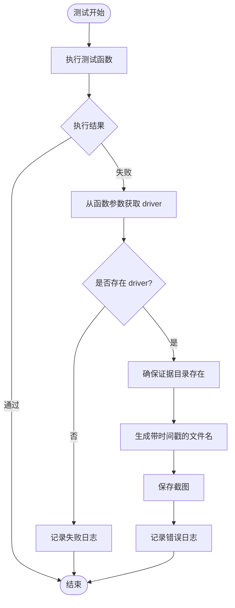
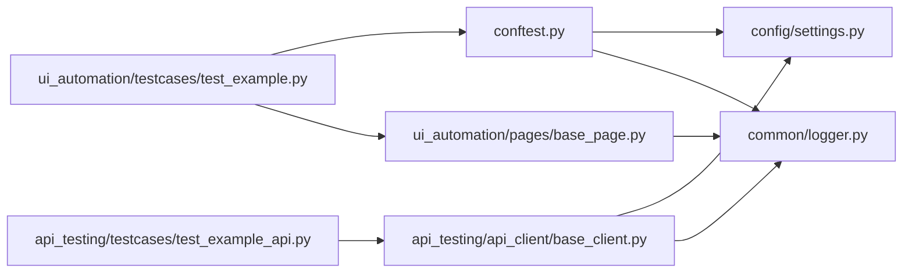

# 全局fixture管理

<cite>
**本文引用的文件**
- [conftest.py](file://conftest.py)
- [pytest.ini](file://pytest.ini)
- [requirements.txt](file://requirements.txt)
- [config/settings.py](file://config/settings.py)
- [common/logger.py](file://common/logger.py)
- [config/environments/test.yaml](file://config/environments/test.yaml)
- [config/environments/dev.yaml](file://config/environments/dev.yaml)
- [config/environments/prod.yaml](file://config/environments/prod.yaml)
- [ui_automation/testcases/test_example.py](file://ui_automation/testcases/test_example.py)
- [api_testing/testcases/test_example_api.py](file://api_testing/testcases/test_example_api.py)
- [ui_automation/pages/base_page.py](file://ui_automation/pages/base_page.py)
- [api_testing/api_client/base_client.py](file://api_testing/api_client/base_client.py)
- [common/report_utils.py](file://common/report_utils.py)
</cite>

## 目录
1. [简介](#简介)
2. [项目结构](#项目结构)
3. [核心组件](#核心组件)
4. [架构总览](#架构总览)
5. [详细组件分析](#详细组件分析)
6. [依赖分析](#依赖分析)
7. [性能考虑](#性能考虑)
8. [故障排查指南](#故障排查指南)
9. [结论](#结论)
10. [附录](#附录)

## 简介
本文件系统性地文档化了全局fixture管理的设计与实现，重点覆盖以下方面：
- 在 conftest.py 中定义的 driver 浏览器实例 fixture、base_url 基础URL fixture 以及测试钩子函数
- fixture 的作用域、生命周期管理与依赖注入机制
- WebDriver 初始化流程、浏览器配置选项与资源清理策略
- 失败自动截图钩子的工作原理、证据收集机制与调试信息记录
- fixture 扩展、自定义配置与性能优化建议

该文档旨在帮助测试工程师快速理解并高效扩展全局fixture体系，确保跨模块的一致性与可维护性。

## 项目结构
该项目采用分层+功能域划分的组织方式：
- 根目录包含全局配置与测试入口
- config 子目录提供多环境配置与settings管理
- common 子目录提供日志、报告等通用能力
- ui_automation 与 api_testing 分别承载UI自动化与接口测试的用例与基础设施
- pytest.ini 定义pytest运行参数与标记

图表来源
- [conftest.py:1-122](file://conftest.py#L1-L122)
- [pytest.ini:1-12](file://pytest.ini#L1-L12)
- [config/settings.py:1-104](file://config/settings.py#L1-L104)
- [common/logger.py:1-77](file://common/logger.py#L1-L77)
- [ui_automation/testcases/test_example.py:1-161](file://ui_automation/testcases/test_example.py#L1-L161)
- [api_testing/testcases/test_example_api.py:1-167](file://api_testing/testcases/test_example_api.py#L1-L167)

章节来源
- [conftest.py:1-122](file://conftest.py#L1-L122)
- [pytest.ini:1-12](file://pytest.ini#L1-L12)

## 核心组件
本节聚焦于全局fixture与钩子的核心实现，包括：
- driver 浏览器实例 fixture：按环境配置动态初始化Chrome/Firefox，设置隐式等待与页面加载超时，并在测试结束时自动清理
- base_url 基础URL fixture：从全局settings中读取当前环境的基础URL
- pytest_runtest_makereport 钩子：在测试失败时自动截图并记录日志
- pytest_configure 钩子：注册UI/冒烟/回归/API等自定义标记，避免pytest警告

章节来源
- [conftest.py:25-78](file://conftest.py#L25-L78)
- [conftest.py:80-122](file://conftest.py#L80-L122)
- [config/settings.py:13-104](file://config/settings.py#L13-L104)

## 架构总览
全局fixture管理贯穿“配置-日志-驱动-用例”的链路，形成如下架构视图：

图表来源
- [config/settings.py:13-104](file://config/settings.py#L13-L104)
- [common/logger.py:1-77](file://common/logger.py#L1-77)
- [conftest.py:25-122](file://conftest.py#L25-L122)
- [ui_automation/testcases/test_example.py:1-161](file://ui_automation/testcases/test_example.py#L1-L161)
- [api_testing/testcases/test_example_api.py:1-167](file://api_testing/testcases/test_example_api.py#L1-L167)
- [ui_automation/pages/base_page.py:1-499](file://ui_automation/pages/base_page.py#L1-L499)
- [api_testing/api_client/base_client.py:1-308](file://api_testing/api_client/base_client.py#L1-L308)

## 详细组件分析

### driver 浏览器实例 fixture
- 作用域与生命周期
  - 作用域为 function，即每个测试函数独立获得一个浏览器实例
  - 测试结束后通过yield后的清理逻辑自动关闭浏览器，避免资源泄漏
- 初始化流程
  - 从全局settings读取browser配置（type/headless/implicit_wait/page_load_timeout）
  - 根据type选择Chrome或Firefox，并应用headless等选项
  - 设置隐式等待与页面加载超时
  - 记录启动与关闭日志
- 依赖注入
  - 测试函数可通过形参接收driver，无需手动管理生命周期
- 资源清理
  - 使用driver.quit()确保进程退出
  - 日志记录便于问题定位

图表来源
- [conftest.py:25-78](file://conftest.py#L25-L78)
- [config/settings.py:80-83](file://config/settings.py#L80-L83)

章节来源
- [conftest.py:25-78](file://conftest.py#L25-L78)
- [config/settings.py:80-83](file://config/settings.py#L80-L83)

### base_url 基础URL fixture
- 作用域与生命周期
  - 作用域为 function，每次测试函数都会重新获取当前环境的base_url
- 数据来源
  - 从全局settings读取，确保与环境配置一致
- 依赖注入
  - 测试函数通过形参接收base_url，便于页面对象或API客户端拼接URL

章节来源
- [conftest.py:72-78](file://conftest.py#L72-L78)
- [config/settings.py:50-53](file://config/settings.py#L50-L53)

### 失败自动截图钩子
- 触发条件
  - 仅在测试执行阶段（call）失败时触发
- 截图流程
  - 从测试项的函数参数中获取driver
  - 确保证据目录存在（ui_automation/evidence）
  - 生成带时间戳的文件名并保存截图
  - 记录错误日志
- 证据收集与调试
  - 截图文件命名包含测试名与时间戳，便于定位
  - 结合日志与页面源码，形成完整的调试证据链

图表来源
- [conftest.py:80-110](file://conftest.py#L80-L110)

章节来源
- [conftest.py:80-110](file://conftest.py#L80-L110)

### 注册自定义标记钩子
- 功能
  - 在pytest_configure阶段注册UI/冒烟/回归/API等标记，避免pytest警告
- 影响
  - 使测试用例能够通过@pytest.mark标注分类，便于筛选与报告

章节来源
- [conftest.py:112-122](file://conftest.py#L112-L122)
- [pytest.ini:7-11](file://pytest.ini#L7-L11)

### Page Object 与证据收集协同
- BasePage
  - 封装常用元素操作、等待、截图与页面源码保存
  - 截图与页面源码均保存至 ui_automation/evidence 目录
  - 异常时自动截图，提升调试效率
- 与driver的协作
  - 通过driver.save_screenshot与driver.page_source进行证据采集
  - 与conftest的失败截图钩子形成互补

章节来源
- [ui_automation/pages/base_page.py:24-499](file://ui_automation/pages/base_page.py#L24-L499)

### API客户端与配置联动
- BaseClient
  - 从settings读取API基础URL与超时配置
  - 提供统一的HTTP请求封装与断言工具
  - 与UI用例共享环境配置，保持一致性

章节来源
- [api_testing/api_client/base_client.py:18-308](file://api_testing/api_client/base_client.py#L18-L308)
- [config/settings.py:75-78](file://config/settings.py#L75-L78)

## 依赖分析
- 组件耦合
  - conftest依赖config.settings与common.logger，提供全局fixture与钩子
  - UI用例与API用例分别依赖各自的基础设施（Page Object与BaseClient）
  - Page Object与BaseClient均依赖common.logger进行日志记录
- 外部依赖
  - pytest、selenium、requests、loguru、PyYAML等
- 环境配置
  - 通过TEST_ENV切换不同环境配置文件，影响driver与base_url等行为

图表来源
- [conftest.py:19-22](file://conftest.py#L19-L22)
- [config/settings.py:13-104](file://config/settings.py#L13-L104)
- [common/logger.py:1-77](file://common/logger.py#L1-77)
- [ui_automation/testcases/test_example.py:14-18](file://ui_automation/testcases/test_example.py#L14-L18)
- [api_testing/testcases/test_example_api.py:14-15](file://api_testing/testcases/test_example_api.py#L14-L15)
- [ui_automation/pages/base_page.py:16-21](file://ui_automation/pages/base_page.py#L16-L21)
- [api_testing/api_client/base_client.py:11-13](file://api_testing/api_client/base_client.py#L11-L13)

章节来源
- [requirements.txt:1-21](file://requirements.txt#L1-L21)
- [config/environments/test.yaml:25-31](file://config/environments/test.yaml#L25-L31)

## 性能考虑
- 浏览器初始化
  - 无头模式(headless)可显著降低资源占用，适合CI环境
  - 隐式等待与页面加载超时需结合页面特性合理设置，避免过长等待
- 资源清理
  - 使用function作用域的driver确保每个测试独立且资源及时释放
  - BaseClient使用Session复用连接，减少TCP握手开销
- 日志与报告
  - 使用loguru按天轮转日志，避免磁盘膨胀
  - pytest-html生成HTML报告，便于团队共享结果

章节来源
- [conftest.py:36-61](file://conftest.py#L36-L61)
- [api_testing/api_client/base_client.py:28-36](file://api_testing/api_client/base_client.py#L28-L36)
- [common/logger.py:34-56](file://common/logger.py#L34-L56)
- [pytest.ini:6](file://pytest.ini#L6)

## 故障排查指南
- 浏览器无法启动
  - 检查环境配置中的browser.type与headless设置
  - 确认Chrome/Firefox驱动版本与selenium兼容
- 截图失败
  - 确认证据目录存在且有写权限
  - 检查driver实例是否可用（仅在测试执行阶段失败时才触发）
- 日志缺失
  - 确认loguru配置已正确初始化
  - 检查日志输出级别与文件轮转策略
- 环境切换问题
  - 确认TEST_ENV环境变量或配置文件路径正确
  - 检查对应环境的base_url与browser配置

章节来源
- [conftest.py:92-110](file://conftest.py#L92-L110)
- [common/logger.py:34-56](file://common/logger.py#L34-L56)
- [config/environments/test.yaml:25-31](file://config/environments/test.yaml#L25-L31)

## 结论
全局fixture管理通过集中化的driver与base_url配置、完善的失败截图钩子与日志记录，实现了UI自动化测试的高一致性与可观测性。配合多环境配置与自定义标记，能够灵活适配不同场景。建议在CI环境中启用headless模式与合理的超时设置，持续优化资源占用与执行效率。

## 附录

### 环境配置示例
- 测试环境(test.yaml)、开发(dev.yaml)、生产(prod.yaml)均包含browser与base_url配置，便于按需切换
- 通过TEST_ENV环境变量选择具体环境文件

章节来源
- [config/environments/test.yaml:1-31](file://config/environments/test.yaml#L1-L31)
- [config/environments/dev.yaml:1-31](file://config/environments/dev.yaml#L1-L31)
- [config/environments/prod.yaml:1-31](file://config/environments/prod.yaml#L1-L31)

### 用例示例与标记
- UI用例通过@pytest.mark.ui与@pytest.mark.smoke等标记分类
- API用例通过@pytest.mark.api标记分类

章节来源
- [ui_automation/testcases/test_example.py:31-161](file://ui_automation/testcases/test_example.py#L31-L161)
- [api_testing/testcases/test_example_api.py:18-167](file://api_testing/testcases/test_example_api.py#L18-L167)
- [pytest.ini:7-11](file://pytest.ini#L7-L11)