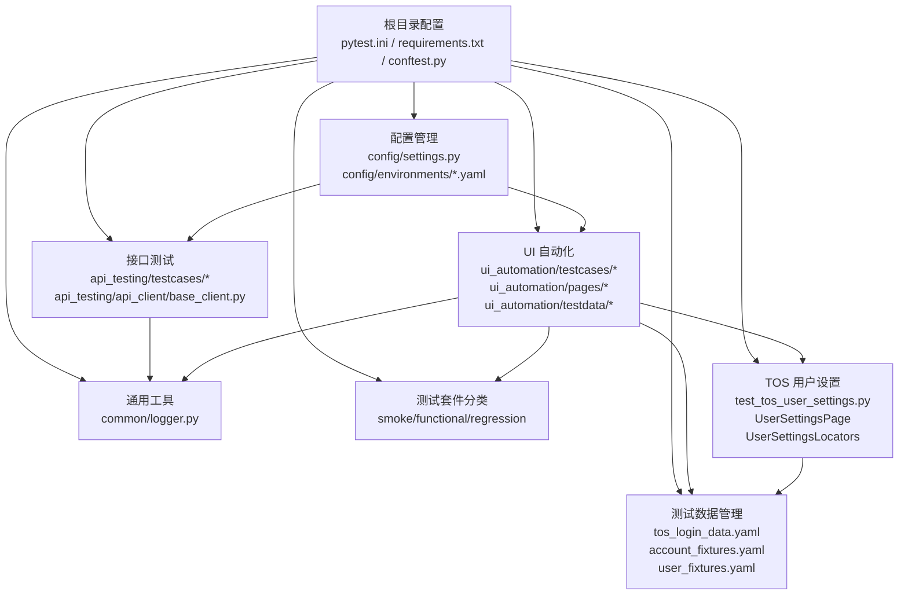
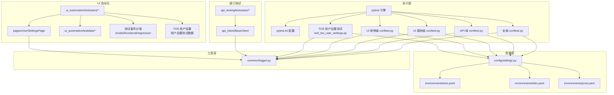
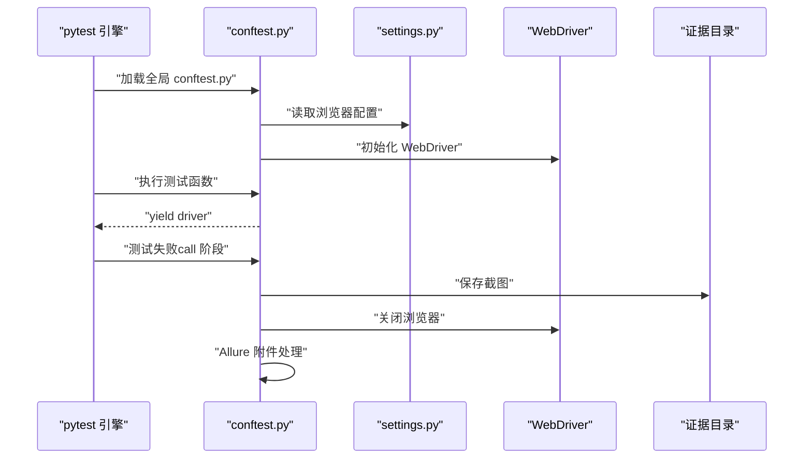
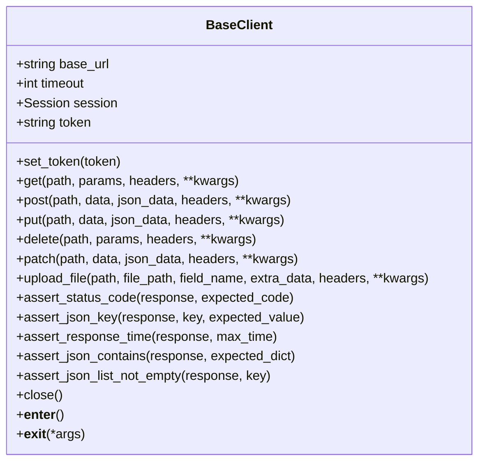
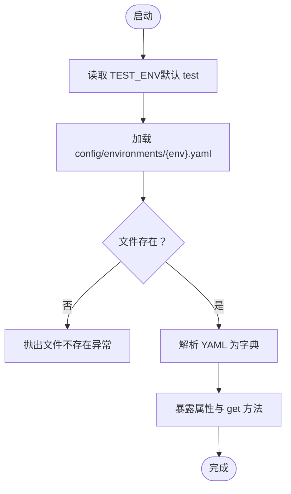
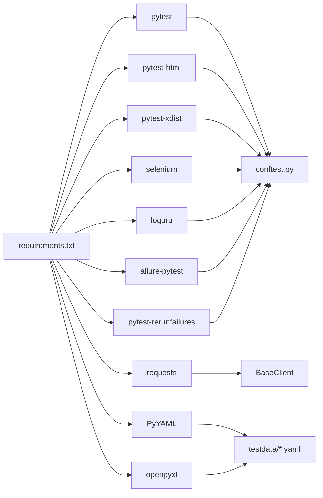

# 测试框架配置

<cite>
**本文档引用的文件**
- [pytest.ini](file://pytest.ini)
- [conftest.py](file://conftest.py)
- [requirements.txt](file://requirements.txt)
- [config/settings.py](file://config/settings.py)
- [config/environments/test.yaml](file://config/environments/test.yaml)
- [config/environments/dev.yaml](file://config/environments/dev.yaml)
- [config/environments/prod.yaml](file://config/environments/prod.yaml)
- [api_testing/testcases/conftest.py](file://api_testing/testcases/conftest.py)
- [api_testing/testcases/test_example_api.py](file://api_testing/testcases/test_example_api.py)
- [api_testing/api_client/base_client.py](file://api_testing/api_client/base_client.py)
- [ui_automation/testcases/conftest.py](file://ui_automation/testcases/conftest.py)
- [ui_automation/testcases/smoke/test_tos_user_settings.py](file://ui_automation/testcases/smoke/test_tos_user_settings.py)
- [ui_automation/pages/pages/tos_user_settings_page.py](file://ui_automation/pages/pages/tos_user_settings_page.py)
- [ui_automation/pages/locators/tos_user_settings_locators.py](file://ui_automation/pages/locators/tos_user_settings_locators.py)
- [ui_automation/testdata/tos_login_data.yaml](file://ui_automation/testdata/tos_login_data.yaml)
- [ui_automation/testdata/fixtures/account_fixtures.yaml](file://ui_automation/testdata/fixtures/account_fixtures.yaml)
- [ui_automation/testdata/fixtures/user_fixtures.yaml](file://ui_automation/testdata/fixtures/user_fixtures.yaml)
- [common/logger.py](file://common/logger.py)
- [ui_automation/conftest.py](file://ui_automation/conftest.py)
- [ui_automation/testcases/functional/conftest.py](file://ui_automation/testcases/functional/conftest.py)
- [ui_automation/testcases/regression/conftest.py](file://ui_automation/testcases/regression/conftest.py)
</cite>

## 更新摘要
**所做更改**
- 新增了 TOS 用户设置相关测试配置，包括专门的测试用例、页面对象和定位器
- 更新了测试套件组织结构，新增了 TOS 用户设置相关的测试分类
- 完善了测试数据管理，新增了用户设置相关的数据文件和夹具
- 优化了测试套件的模块化组织，支持更细粒度的功能测试分类

## 目录
1. [简介](#简介)
2. [项目结构](#项目结构)
3. [核心组件](#核心组件)
4. [架构总览](#架构总览)
5. [详细组件分析](#详细组件分析)
6. [依赖关系分析](#依赖关系分析)
7. [性能考虑](#性能考虑)
8. [故障排除指南](#故障排除指南)
9. [结论](#结论)
10. [附录](#附录)

## 简介
本文件面向测试框架配置与使用，系统性阐述 pytest 配置、全局 fixture、测试标记系统、浏览器启动与生命周期管理、依赖与版本控制、并行执行、报告生成以及 CI/CD 集成方案，并提供优化建议、故障排除与扩展指南。内容基于仓库中的实际配置与实现进行归纳总结，帮助不同技术背景的读者快速上手并高效维护测试体系。

**更新** 本次更新重点反映了测试套件重构，新增了 TOS 用户设置相关测试配置，完善了测试数据管理体系，优化了测试套件的模块化组织结构。

## 项目结构
该测试框架采用分层与按功能域划分的组织方式：
- 根目录配置：pytest.ini、requirements.txt、顶层 conftest.py
- 功能域划分：api_testing（接口测试）、ui_automation（UI 自动化）、config（配置管理）、common（通用工具）
- 环境配置：config/environments 下的 dev/test/prod.yaml
- 测试套件分类：按测试类型组织的 smoke、functional、regression 等测试套件
- 新增 TOS 用户设置测试域：专门针对 TOS 用户设置功能的测试配置
- 测试数据管理：分离的测试数据文件和夹具配置

**图表来源**
- [pytest.ini:1-23](file://pytest.ini#L1-L23)
- [conftest.py:1-148](file://conftest.py#L1-L148)
- [config/settings.py:1-104](file://config/settings.py#L1-L104)
- [api_testing/api_client/base_client.py:1-308](file://api_testing/api_client/base_client.py#L1-L308)
- [ui_automation/testcases/smoke/test_tos_user_settings.py:1-200](file://ui_automation/testcases/smoke/test_tos_user_settings.py#L1-L200)
- [ui_automation/pages/pages/tos_user_settings_page.py:1-250](file://ui_automation/pages/pages/tos_user_settings_page.py#L1-L250)
- [ui_automation/testdata/tos_login_data.yaml:1-50](file://ui_automation/testdata/tos_login_data.yaml#L1-L50)

**章节来源**
- [pytest.ini:1-23](file://pytest.ini#L1-L23)
- [conftest.py:1-148](file://conftest.py#L1-L148)
- [config/settings.py:1-104](file://config/settings.py#L1-L104)

## 核心组件
- pytest 配置与标记系统：集中于 pytest.ini，定义测试发现规则、HTML 报告输出与自定义标记
- 全局 fixture：顶层 conftest.py 提供浏览器驱动、基础 URL、失败截图等
- UI 自动化配置：ui_automation/conftest.py 提供模块级浏览器配置
- 测试用例配置：ui_automation/testcases/conftest.py 提供测试前置条件和数据加载
- 接口测试 fixture：api_testing/testcases/conftest.py 提供无认证与带 Token 的 API 客户端
- 配置中心：config/settings.py 读取环境配置，支持多环境切换
- 日志系统：common/logger.py 统一日志输出与轮转
- **新增** TOS 用户设置测试域：专门针对 TOS 用户设置功能的测试配置和页面对象

**章节来源**
- [pytest.ini:1-23](file://pytest.ini#L1-L23)
- [conftest.py:25-148](file://conftest.py#L25-L148)
- [ui_automation/conftest.py:23-64](file://ui_automation/conftest.py#L23-L64)
- [ui_automation/testcases/conftest.py:20-78](file://ui_automation/testcases/conftest.py#L20-L78)
- [api_testing/testcases/conftest.py:16-80](file://api_testing/testcases/conftest.py#L16-L80)
- [config/settings.py:13-104](file://config/settings.py#L13-L104)
- [common/logger.py:1-77](file://common/logger.py#L1-L77)

## 架构总览
整体架构围绕"配置中心 + 通用工具 + 功能域测试"的分层设计展开。pytest 作为测试执行引擎，通过全局与功能域的 conftest.py 注入 fixture 与钩子；配置中心提供跨域共享的环境参数；日志系统贯穿所有组件，保障可观测性。新增的 TOS 用户设置测试域进一步完善了测试框架的功能覆盖。

**图表来源**
- [pytest.ini:1-23](file://pytest.ini#L1-L23)
- [conftest.py:1-148](file://conftest.py#L1-L148)
- [ui_automation/conftest.py:1-99](file://ui_automation/conftest.py#L1-L99)
- [ui_automation/testcases/conftest.py:1-78](file://ui_automation/testcases/conftest.py#L1-L78)
- [config/settings.py:1-104](file://config/settings.py#L1-L104)
- [config/environments/test.yaml:1-31](file://config/environments/test.yaml#L1-L31)
- [config/environments/dev.yaml:1-31](file://config/environments/dev.yaml#L1-L31)
- [config/environments/prod.yaml:1-31](file://config/environments/prod.yaml#L1-L31)
- [common/logger.py:1-77](file://common/logger.py#L1-L77)
- [api_testing/api_client/base_client.py:1-308](file://api_testing/api_client/base_client.py#L1-L308)
- [ui_automation/testcases/smoke/test_tos_user_settings.py:1-200](file://ui_automation/testcases/smoke/test_tos_user_settings.py#L1-L200)
- [ui_automation/pages/pages/tos_user_settings_page.py:1-250](file://ui_automation/pages/pages/tos_user_settings_page.py#L1-L250)

## 详细组件分析

### pytest 配置与测试标记系统
- 测试发现与过滤
  - testpaths 指定扫描目录，确保 UI 与 API 测试用例被自动发现
  - python_files/classes/functions 约束命名规范，提升可维护性
- 报告与输出
  - addopts 启用详细输出、严格标记模式与 HTML 报告生成，支持自包含 HTML
  - 新增 Allure 报告目录配置注释，支持可选的 Allure 集成
- 自定义标记系统
  - 新增完整的测试标记分类：smoke、functional、regression、sanity、ui、api、slow、wip
  - 支持测试类型细分和优先级管理
  - 通过 markers 配置块统一声明所有自定义标记

**更新** 新增了 Allure 报告支持和完整的测试标记分类体系，提供了更精细的测试管理和执行控制能力。

**章节来源**
- [pytest.ini:1-23](file://pytest.ini#L1-L23)

### 全局 fixture 与生命周期管理（conftest.py）
- driver fixture（函数级作用域）
  - 根据配置选择浏览器类型与无头模式，设置隐式等待与页面加载超时
  - 测试结束后自动关闭浏览器，避免资源泄漏
  - 新增 Allure 报告附件支持，在测试失败时自动添加失败截图
- base_url fixture（函数级作用域）
  - 提供当前环境的基础 URL，供 UI 与 API 测试使用
- 失败自动截图钩子
  - 在测试执行阶段失败时，自动保存截图至 ui_automation/evidence 目录
  - 通过 driver 参数获取 WebDriver 实例，生成带时间戳的文件名
  - 集成 Allure 报告附件功能，支持可视化报告展示
- pytest_configure 注册自定义标记
  - 避免 pytest 对未注册标记的警告
  - 统一注册所有测试标记类型

**图表来源**
- [conftest.py:25-148](file://conftest.py#L25-L148)
- [config/settings.py:13-104](file://config/settings.py#L13-L104)

**章节来源**
- [conftest.py:25-148](file://conftest.py#L25-L148)

### UI 自动化模块级配置（ui_automation/conftest.py）
- 模块级 driver fixture（函数级作用域）
  - 提供 UI 测试专用的浏览器配置，包含更完善的选项设置
  - 支持 --headless=new 无头模式，提高测试稳定性
  - 集成 --disable-gpu 等优化选项，减少资源消耗
  - 统一设置窗口大小和超时参数
- base_url fixture（会话级作用域）
  - 提供测试环境 URL，支持会话级别的复用
- 清理 cookies fixture
  - 在测试结束后自动清理浏览器 cookies，确保测试隔离
- 失败截图 fixture
  - 提供更灵活的失败截图机制，支持按需启用

**更新** 新增了专门的 UI 自动化模块级配置，提供了更完善和稳定的浏览器管理能力。

**章节来源**
- [ui_automation/conftest.py:23-99](file://ui_automation/conftest.py#L23-L99)

### UI 测试用例级配置（ui_automation/testcases/conftest.py）
- 测试数据加载 fixture
  - 提供通用测试数据加载功能，支持 YAML 数据文件
  - 支持按需加载特定数据文件和键值
- 登录凭证 fixture
  - 从配置中心获取登录凭证，支持多环境切换
- 预登录用户 fixture
  - 自动完成用户登录流程，提供已登录状态的测试前置条件
  - 支持页面对象模式的登录验证
- 干净页面 fixture
  - 确保测试从干净的页面状态开始
  - 自动清理 cookies 和刷新页面

**更新** 新增了测试用例级配置，提供了更高级别的测试前置条件管理和数据加载能力。

**章节来源**
- [ui_automation/testcases/conftest.py:20-78](file://ui_automation/testcases/conftest.py#L20-L78)

### 接口测试 fixture 与客户端（api_testing/testcases/conftest.py 与 api_client/BaseClient）
- api_client fixture（函数级作用域）
  - 提供无认证的 BaseClient 实例，测试结束后自动关闭连接
- auth_client fixture（函数级作用域）
  - 支持从配置读取 token 或预留登录流程（可扩展）
  - 测试结束后自动关闭连接
- BaseClient 能力
  - 支持 GET/POST/PUT/DELETE/PATCH/上传文件等常用方法
  - 统一日志记录（请求/响应/耗时/异常）
  - 断言辅助：状态码、JSON 键、响应时间、列表非空、键值包含等
  - Session 管理与 Token 设置

**图表来源**
- [api_testing/api_client/base_client.py:18-308](file://api_testing/api_client/base_client.py#L18-L308)

**章节来源**
- [api_testing/testcases/conftest.py:16-80](file://api_testing/testcases/conftest.py#L16-L80)
- [api_testing/api_client/base_client.py:18-308](file://api_testing/api_client/base_client.py#L18-L308)

### 配置中心与环境隔离（config/settings.py 与 environments/*.yaml）
- Settings 类
  - 通过环境变量 TEST_ENV 切换环境，默认 test
  - 读取 config/environments 下的 YAML 文件，提供属性与 get 方法访问
  - 暴露 base_url、username、password、database、api、browser 等配置
- 环境配置
  - test.yaml、dev.yaml、prod.yaml 分别定义基础 URL、账号、数据库、API、浏览器等参数
  - 生产环境默认 headless=true，提高稳定性

**图表来源**
- [config/settings.py:26-96](file://config/settings.py#L26-L96)
- [config/environments/test.yaml:1-31](file://config/environments/test.yaml#L1-L31)
- [config/environments/dev.yaml:1-31](file://config/environments/dev.yaml#L1-L31)
- [config/environments/prod.yaml:1-31](file://config/environments/prod.yaml#L1-L31)

**章节来源**
- [config/settings.py:13-104](file://config/settings.py#L13-L104)
- [config/environments/test.yaml:1-31](file://config/environments/test.yaml#L1-L31)
- [config/environments/dev.yaml:1-31](file://config/environments/dev.yaml#L1-L31)
- [config/environments/prod.yaml:1-31](file://config/environments/prod.yaml#L1-L31)

### 测试套件分类与组织
- 测试套件结构
  - smoke/：冒烟测试套件，验证核心功能快速验证
  - functional/：功能测试套件，验证完整功能流程
  - regression/：回归测试套件，验证全量回归测试
- **新增** TOS 用户设置测试套件
  - 专门针对 TOS 用户设置功能的测试用例
  - 包含用户设置页面的完整测试流程
  - 支持用户设置相关的数据管理和夹具
- 测试用例示例
  - 冒烟测试：test_login_smoke.py 展示登录功能的快速验证
  - 功能测试：test_user_operations.py 展示用户操作的完整流程
  - **新增** TOS 用户设置测试：test_tos_user_settings.py 验证用户设置功能
- 标记系统应用
  - 每个测试类都标注了相应的测试类型标记
  - 支持组合标记，如同时标注 @pytest.mark.smoke 和 @pytest.mark.ui

**更新** 新增了完整的测试套件分类体系，特别是 TOS 用户设置相关的测试配置，提供了更精细的测试组织和管理方式。

**章节来源**
- [ui_automation/testcases/smoke/test_tos_user_settings.py:1-200](file://ui_automation/testcases/smoke/test_tos_user_settings.py#L1-L200)

### TOS 用户设置测试域
- **新增** 用户设置测试用例
  - test_tos_user_settings.py：验证 TOS 用户设置功能的完整测试流程
  - 支持用户设置页面的各种操作和验证
  - 集成用户设置相关的数据文件和夹具
- **新增** 用户设置页面对象
  - tos_user_settings_page.py：实现用户设置页面的页面对象模式
  - 提供用户设置相关的元素定位和操作方法
  - 支持用户设置页面的完整交互流程
- **新增** 用户设置定位器
  - tos_user_settings_locators.py：定义用户设置页面的所有定位器
  - 支持用户设置页面元素的稳定定位
  - 提供用户设置相关的元素查找方法
- **新增** 用户设置测试数据
  - tos_login_data.yaml：用户登录相关的测试数据
  - account_fixtures.yaml：账户相关的测试夹具
  - user_fixtures.yaml：用户相关的测试夹具
- **新增** 测试套件组织
  - 新增 functional、regression 子套件的 conftest.py 配置
  - 支持更细粒度的测试套件管理

**更新** 新增了完整的 TOS 用户设置测试域，包括测试用例、页面对象、定位器和测试数据管理。

**章节来源**
- [ui_automation/testcases/smoke/test_tos_user_settings.py:1-200](file://ui_automation/testcases/smoke/test_tos_user_settings.py#L1-L200)
- [ui_automation/pages/pages/tos_user_settings_page.py:1-250](file://ui_automation/pages/pages/tos_user_settings_page.py#L1-L250)
- [ui_automation/pages/locators/tos_user_settings_locators.py:1-150](file://ui_automation/pages/locators/tos_user_settings_locators.py#L1-L150)
- [ui_automation/testdata/tos_login_data.yaml:1-50](file://ui_automation/testdata/tos_login_data.yaml#L1-L50)
- [ui_automation/testdata/fixtures/account_fixtures.yaml:1-100](file://ui_automation/testdata/fixtures/account_fixtures.yaml#L1-L100)
- [ui_automation/testdata/fixtures/user_fixtures.yaml:1-100](file://ui_automation/testdata/fixtures/user_fixtures.yaml#L1-L100)

### 日志系统（common/logger.py）
- 统一日志配置
  - 控制台 INFO 级别及以上输出，彩色显示
  - 文件 DEBUG 级别及以上输出，按天轮转，保留 7 天
  - 通过 get_logger(name) 绑定模块名，便于追踪来源
- 与各组件协作
  - conftest.py、BaseClient、LoginPage 等均使用 get_logger 获取实例

**章节来源**
- [common/logger.py:1-77](file://common/logger.py#L1-L77)

## 依赖关系分析
- 依赖管理
  - requirements.txt 明确列出 pytest、pytest-html、pytest-xdist、selenium、requests、PyYAML、openpyxl、loguru、allure-pytest 等
  - 新增 pytest-rerunfailures 重试机制支持
- 版本控制与环境隔离
  - 通过 config/settings.py 与环境 YAML 文件实现配置隔离
  - 顶层 conftest.py 与 api_testing/testcases/conftest.py 分别注入全局与功能域的 fixture
  - ui_automation/conftest.py 和 ui_automation/testcases/conftest.py 提供模块级和用例级配置
- 外部集成点
  - pytest-html 生成 HTML 报告
  - pytest-xdist 支持并行执行
  - allure-pytest 可选用于更丰富的报告
  - pytest-rerunfailures 支持失败重试

**图表来源**
- [requirements.txt:1-25](file://requirements.txt#L1-L25)
- [conftest.py:1-148](file://conftest.py#L1-L148)
- [api_testing/api_client/base_client.py:1-308](file://api_testing/api_client/base_client.py#L1-L308)
- [ui_automation/testdata/tos_login_data.yaml:1-50](file://ui_automation/testdata/tos_login_data.yaml#L1-L50)

**章节来源**
- [requirements.txt:1-25](file://requirements.txt#L1-L25)

## 性能考虑
- 浏览器启动成本
  - 使用函数级 driver fixture，避免跨用例共享导致状态污染；在生产环境可开启 headless 降低资源占用
  - UI 自动化模块级配置提供了更优化的浏览器启动参数
- 请求与会话
  - BaseClient 使用 requests.Session 复用连接，减少握手开销；合理设置超时与重试策略
- 并行执行
  - pytest-xdist 支持多进程并行，需确保测试用例无共享状态且资源隔离
  - 结合 pytest-rerunfailures 实现智能重试机制
- 报告生成
  - pytest-html 生成自包含 HTML 报告，便于离线查看；在 CI 环境可结合 allure-pytest 生成更丰富的报告
  - Allure 报告支持可视化测试结果展示和趋势分析

**更新** 新增了 pytest-rerunfailures 重试机制和更完善的报告生成支持。

## 故障排除指南
- 浏览器启动失败
  - 检查浏览器类型与驱动版本是否匹配；确认配置中 browser.type/headless 设置
  - 查看日志输出定位具体错误
  - 确认 UI 自动化模块级配置的浏览器选项兼容性
- 测试失败截图未生成
  - 确认钩子在 call 阶段触发；检查证据目录权限与路径
  - 验证 Allure 报告附件功能是否正常工作
- 环境配置读取异常
  - 核对 TEST_ENV 环境变量与 config/environments 下的 YAML 文件是否存在
- 接口请求超时或连接错误
  - 检查 BaseClient 的 base_url 与 timeout；关注网络连通性与目标服务状态
- 并行执行冲突
  - 确保测试用例无共享状态；避免依赖全局变量或文件系统
- Allure 报告生成问题
  - 确认 allure-pytest 依赖已正确安装
  - 检查报告目录权限和磁盘空间
- **新增** TOS 用户设置测试问题
  - 检查用户设置页面对象是否正确初始化
  - 验证用户设置定位器是否与页面元素匹配
  - 确认用户设置测试数据文件格式正确

**更新** 新增了 Allure 报告相关的故障排除指导和 TOS 用户设置测试相关的故障排除。

**章节来源**
- [conftest.py:80-148](file://conftest.py#L80-L148)
- [config/settings.py:37-48](file://config/settings.py#L37-L48)
- [api_testing/api_client/base_client.py:122-133](file://api_testing/api_client/base_client.py#L122-L133)

## 结论
该测试框架通过清晰的配置中心、统一的日志系统与分层的 fixture 设计，实现了 UI 与接口测试的高内聚低耦合。配合 pytest 的标记系统、HTML 报告与可选的并行执行，能够满足从冒烟到回归的多层级测试需求。新增的 Allure 集成支持、完整的测试标记分类体系和模块化的测试套件组织，进一步提升了测试管理的精细化程度和执行效率。**新增的 TOS 用户设置测试域完善了测试框架的功能覆盖，提供了更全面的用户设置功能测试能力。** 建议在 CI/CD 中结合环境变量与报告产物进行自动化质量门禁。

**更新** 本次更新显著增强了测试框架的功能性和可维护性，特别是在测试管理、报告生成、执行效率和功能覆盖方面。

## 附录

### 测试标记与筛选
- 标记定义与用途
  - smoke：冒烟测试，快速验证主流程
  - functional：功能测试，验证完整功能流程
  - regression：回归测试，覆盖关键路径
  - sanity：健全性测试，基础健全性检查
  - ui：UI 自动化测试用例
  - api：接口测试用例
  - slow：执行较慢的测试
  - wip：正在开发中的测试（Work In Progress）
- 执行示例
  - 仅执行 UI 测试：pytest -m ui
  - 执行冒烟与回归：pytest -m "smoke or regression"
  - 执行功能测试套件：pytest ui_automation/testcases/functional/

**更新** 新增了完整的测试标记分类体系，提供了更精细的测试执行控制能力。

**章节来源**
- [pytest.ini:14-22](file://pytest.ini#L14-L22)

### 并行执行配置与报告生成
- 并行执行
  - 使用 pytest-xdist 实现多进程并行；建议结合 --maxfail 控制中断策略
  - 支持与 pytest-rerunfailures 结合使用，实现智能重试
- 报告生成
  - pytest-html 自动生成 HTML 报告；可配置报告路径与样式
  - 可选 allure-pytest 生成交互式报告，支持可视化展示
  - Allure 报告支持测试结果的趋势分析和历史对比
- 日志配置
  - 详细的日志输出配置，支持控制台和文件双重输出
  - 按天轮转的日志文件管理，便于问题排查

**更新** 新增了 Allure 报告支持和更完善的日志配置选项。

**章节来源**
- [requirements.txt:3-4](file://requirements.txt#L3-L4)
- [pytest.ini:6](file://pytest.ini#L6)
- [pytest.ini:8-13](file://pytest.ini#L8-L13)

### CI/CD 集成方案
- 环境变量
  - 设置 TEST_ENV 选择 dev/test/prod
- 依赖安装
  - 使用 requirements.txt 安装依赖，包括 Allure 和重试机制支持
- 执行与报告
  - 执行 pytest 并生成 HTML 报告
  - 可选执行 Allure 报告生成和聚合
  - 将报告与证据目录上传为构建工件
- 并行策略
  - 在 CI 环境中启用并行执行，结合资源池与超时控制
  - 支持失败重试机制，提高测试稳定性
- 测试套件管理
  - 支持按测试类型和优先级的分层执行
  - 便于在不同阶段执行不同范围的测试

**更新** 新增了 Allure 报告集成和测试套件管理的 CI/CD 集成方案。

**章节来源**
- [config/settings.py:26-34](file://config/settings.py#L26-L34)
- [requirements.txt:1-25](file://requirements.txt#L1-L25)
- [pytest.ini:6](file://pytest.ini#L6)
- [pytest.ini:8](file://pytest.ini#L8)

### 测试套件组织最佳实践
- 套件分类原则
  - smoke：核心功能快速验证，执行时间短
  - functional：完整功能流程验证，覆盖主要业务场景
  - regression：全量回归测试，确保变更不影响现有功能
- 标记使用规范
  - 每个测试类至少标注一个测试类型标记
  - 支持组合标记，如 @pytest.mark.smoke @pytest.mark.ui
  - 使用 slow 标记标识执行时间较长的测试
- 数据管理
  - 测试数据与测试代码分离，便于维护和复用
  - 支持多环境数据配置和切换
  - **新增** 用户设置相关的测试数据管理
- 前置条件管理
  - 使用 fixture 管理测试前置条件
  - 支持预登录、数据准备等复杂前置条件
  - 确保测试的独立性和可重复性

**更新** 新增了完整的测试套件组织和管理最佳实践指导，包括用户设置相关的测试数据管理。

**章节来源**
- [ui_automation/testcases/smoke/test_tos_user_settings.py:1-200](file://ui_automation/testcases/smoke/test_tos_user_settings.py#L1-L200)
- [ui_automation/testcases/conftest.py:20-78](file://ui_automation/testcases/conftest.py#L20-L78)

### TOS 用户设置测试最佳实践
- **新增** 用户设置测试套件组织
  - 按功能域划分的测试套件结构
  - 支持用户设置相关的数据管理和夹具
- **新增** 用户设置页面对象设计
  - 采用页面对象模式实现用户设置页面的封装
  - 提供用户设置相关的元素定位和操作方法
- **新增** 用户设置测试数据管理
  - 分离的测试数据文件管理
  - 支持用户设置相关的测试夹具
- **新增** 用户设置测试执行策略
  - 支持用户设置功能的完整测试流程
  - 集成用户设置相关的验证逻辑

**更新** 新增了完整的 TOS 用户设置测试最佳实践指导。

**章节来源**
- [ui_automation/testcases/smoke/test_tos_user_settings.py:1-200](file://ui_automation/testcases/smoke/test_tos_user_settings.py#L1-L200)
- [ui_automation/pages/pages/tos_user_settings_page.py:1-250](file://ui_automation/pages/pages/tos_user_settings_page.py#L1-L250)
- [ui_automation/testdata/tos_login_data.yaml:1-50](file://ui_automation/testdata/tos_login_data.yaml#L1-L50)