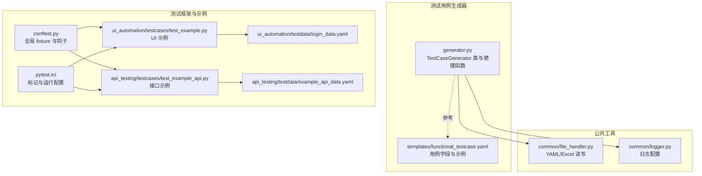
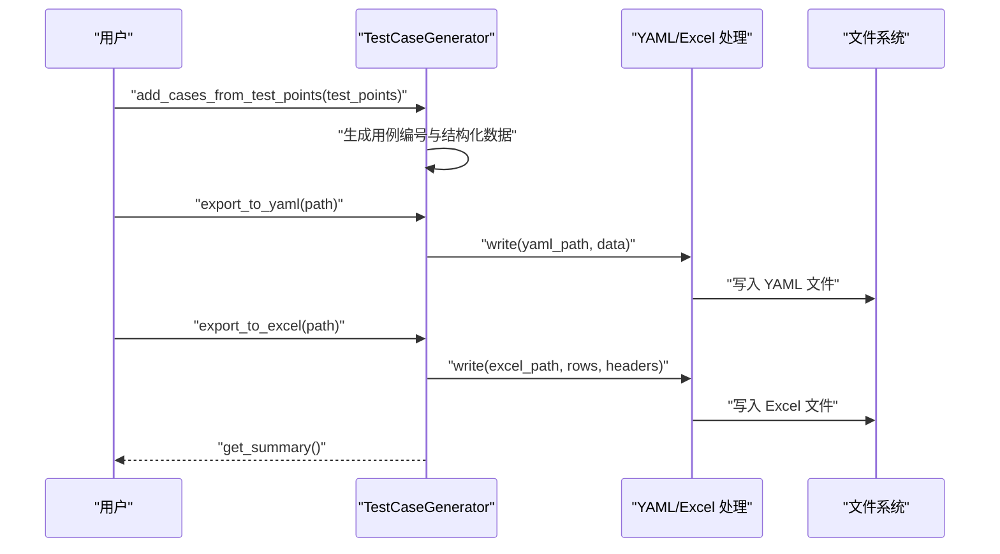
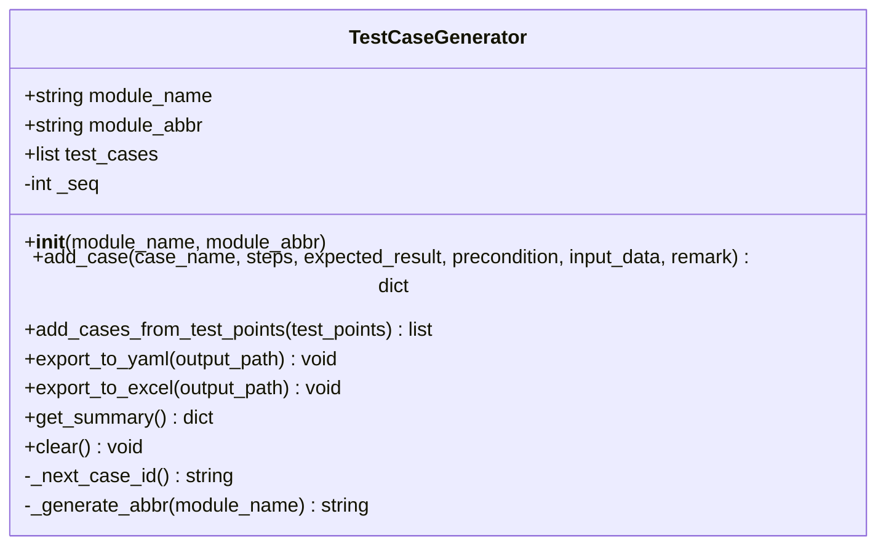
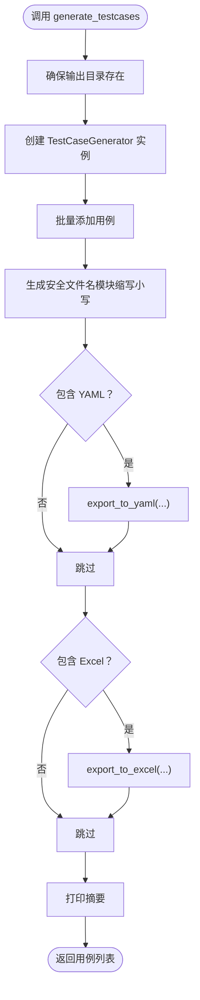
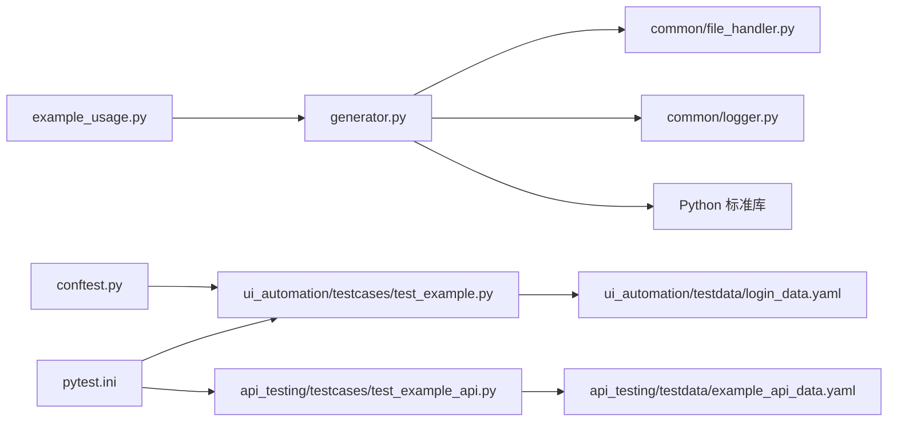

# 使用示例

<cite>
**本文引用的文件**
- [generator.py](file://testcase_generator/generator.py)
- [example_usage.py](file://testcase_generator/example_usage.py)
- [functional_testcase.yaml](file://testcase_generator/templates/functional_testcase.yaml)
- [file_handler.py](file://common/file_handler.py)
- [logger.py](file://common/logger.py)
- [test_example_api.py](file://api_testing/testcases/test_example_api.py)
- [test_example.py](file://ui_automation/testcases/test_example.py)
- [login_data.yaml](file://ui_automation/testdata/login_data.yaml)
- [example_api_data.yaml](file://api_testing/testdata/example_api_data.yaml)
- [requirements.txt](file://requirements.txt)
- [pytest.ini](file://pytest.ini)
- [conftest.py](file://conftest.py)
- [README.md](file://README.md)
</cite>

## 目录
1. [简介](#简介)
2. [项目结构](#项目结构)
3. [核心组件](#核心组件)
4. [架构总览](#架构总览)
5. [详细组件分析](#详细组件分析)
6. [依赖分析](#依赖分析)
7. [性能考虑](#性能考虑)
8. [故障排除指南](#故障排除指南)
9. [结论](#结论)
10. [附录](#附录)

## 简介
本文件面向“测试用例生成器”的使用者，提供从基础使用到高级定制的完整示例与最佳实践。内容涵盖：
- 单个用例添加与批量测试点生成
- 便捷函数的使用与参数配置
- 导出为 YAML 与 Excel 的流程与预期结果
- 常见使用模式、最佳实践与反模式
- 与现有测试框架（pytest、UI 自动化、接口测试）的集成方式
- 故障排除清单与性能优化建议

## 项目结构
测试用例生成器位于 testcase_generator 模块，核心文件与模板如下：
- 生成器核心：testcase_generator/generator.py
- 使用示例：testcase_generator/example_usage.py
- 模板：testcase_generator/templates/functional_testcase.yaml
- 文件处理工具：common/file_handler.py（YAML/Excel）
- 日志工具：common/logger.py
- UI 自动化示例：ui_automation/testcases/test_example.py
- 接口测试示例：api_testing/testcases/test_example_api.py
- UI/接口测试数据：ui_automation/testdata/login_data.yaml、api_testing/testdata/example_api_data.yaml
- 测试框架配置：pytest.ini、conftest.py、requirements.txt、README.md

图表来源
- [generator.py:1-263](file://testcase_generator/generator.py#L1-L263)
- [file_handler.py:1-217](file://common/file_handler.py#L1-L217)
- [logger.py:1-77](file://common/logger.py#L1-L77)
- [functional_testcase.yaml:1-61](file://testcase_generator/templates/functional_testcase.yaml#L1-L61)
- [pytest.ini:1-16](file://pytest.ini#L1-L16)
- [conftest.py:1-148](file://conftest.py#L1-L148)
- [test_example.py:1-161](file://ui_automation/testcases/test_example.py#L1-L161)
- [test_example_api.py:1-167](file://api_testing/testcases/test_example_api.py#L1-L167)
- [login_data.yaml:1-19](file://ui_automation/testdata/login_data.yaml#L1-L19)
- [example_api_data.yaml:1-116](file://api_testing/testdata/example_api_data.yaml#L1-L116)

章节来源
- [README.md:1-123](file://README.md#L1-L123)

## 核心组件
- TestCaseGenerator：负责用例生成、批量导入、导出与统计摘要。支持模块名与缩写、用例编号生成、Excel/YAML 导出、清空与统计。
- 便捷函数 generate_testcases：一键从测试点生成并导出 YAML/Excel，适合快速落地。
- 模板与字段：functional_testcase.yaml 定义了用例字段、默认值与示例，便于理解与扩展。
- 文件处理与日志：file_handler.py 提供 YAML/Excel 读写；logger.py 提供统一日志输出。

章节来源
- [generator.py:17-263](file://testcase_generator/generator.py#L17-L263)
- [functional_testcase.yaml:1-61](file://testcase_generator/templates/functional_testcase.yaml#L1-L61)
- [file_handler.py:13-217](file://common/file_handler.py#L13-L217)
- [logger.py:59-77](file://common/logger.py#L59-L77)

## 架构总览
生成器的核心流程：接收测试点 -> 生成用例 -> 导出 YAML/Excel -> 输出摘要。日志贯穿各环节，便于问题定位。

图表来源
- [generator.py:100-181](file://testcase_generator/generator.py#L100-L181)
- [file_handler.py:38-174](file://common/file_handler.py#L38-L174)

## 详细组件分析

### 组件一：TestCaseGenerator 类
- 关键职责
  - 用例编号生成：TC_{模块缩写}_{序号}
  - 批量导入：add_cases_from_test_points
  - 导出：export_to_yaml、export_to_excel
  - 统计：get_summary
  - 清空：clear
- 模块缩写策略：优先英文部分大写；纯中文取拼音首字母映射；去除“模块”后缀
- Excel 表头：用例编号、模块、用例名称、前置条件、操作步骤、输入数据、预期结果、测试结果、备注
- 日志：初始化、添加用例、导出、清空均有日志记录

图表来源
- [generator.py:17-187](file://testcase_generator/generator.py#L17-L187)

章节来源
- [generator.py:17-187](file://testcase_generator/generator.py#L17-L187)

### 组件二：便捷函数 generate_testcases
- 参数
  - module_name：模块名
  - test_points：测试点列表
  - output_dir：输出目录（默认当前目录）
  - formats：导出格式列表，如 ["yaml", "excel"]（默认两者）
- 行为
  - 自动创建输出目录
  - 生成用例并导出
  - 返回生成的用例列表
  - 打印摘要

图表来源
- [generator.py:225-263](file://testcase_generator/generator.py#L225-L263)

章节来源
- [generator.py:225-263](file://testcase_generator/generator.py#L225-L263)

### 组件三：模板与字段规范
- 字段说明：用例编号、模块、用例名称、前置条件、操作步骤（列表）、输入数据、预期结果、测试结果（默认未执行）、备注
- 示例用例：展示 TC_LOGIN_001 的完整结构
- 适用场景：作为生成器导出的 YAML/Excel 的字段依据，便于后续工具链消费

章节来源
- [functional_testcase.yaml:1-61](file://testcase_generator/templates/functional_testcase.yaml#L1-L61)

### 组件四：文件处理与日志
- YAMLHandler：读取/写入 YAML，支持多文档读取
- ExcelHandler：读取/写入 Excel，支持追加行
- logger：统一日志格式与输出，控制台 INFO+，文件 DEBUG+，按天轮转

章节来源
- [file_handler.py:13-217](file://common/file_handler.py#L13-L217)
- [logger.py:59-77](file://common/logger.py#L59-L77)

## 依赖分析
- TestCaseGenerator 依赖
  - common.logger：日志
  - common.file_handler：YAML/Excel 写入
  - Python 标准库：datetime、re、os、sys
- 便捷函数 generate_testcases 依赖 TestCaseGenerator
- 测试框架与示例
  - pytest.ini 定义标记与运行路径
  - conftest.py 提供 driver/base_url 等 fixture 与失败截图钩子
  - UI/接口示例展示如何结合数据驱动与断言

图表来源
- [generator.py:10-14](file://testcase_generator/generator.py#L10-L14)
- [example_usage.py:11](file://testcase_generator/example_usage.py#L11)
- [test_example.py:14-16](file://ui_automation/testcases/test_example.py#L14-L16)
- [test_example_api.py:14-15](file://api_testing/testcases/test_example_api.py#L14-L15)
- [pytest.ini:1-16](file://pytest.ini#L1-L16)
- [conftest.py:19-22](file://conftest.py#L19-L22)

章节来源
- [requirements.txt:1-25](file://requirements.txt#L1-L25)
- [pytest.ini:1-16](file://pytest.ini#L1-L16)
- [conftest.py:1-148](file://conftest.py#L1-L148)

## 性能考虑
- 批量生成：使用 add_cases_from_test_points 一次性导入测试点，减少多次调用开销
- 导出策略：YAML/Excel 写入为一次性写入，避免频繁 I/O
- 日志级别：生产环境建议保持 INFO 级别，避免过多 DEBUG 输出影响性能
- 模块缩写：中文映射为拼音首字母，复杂度低，不影响生成速度
- Excel 导出：将步骤合并为字符串，避免嵌套结构导致的列数膨胀

## 故障排除指南
- 无用例可导出
  - 现象：导出前日志警告“没有可导出的测试用例”
  - 处理：确认已调用 add_case 或 add_cases_from_test_points
- YAML/Excel 写入失败
  - 现象：写入异常日志
  - 处理：检查输出路径权限、磁盘空间、文件被占用情况
- Excel 读取异常
  - 现象：读取返回 None 或异常日志
  - 处理：确认文件存在、工作表名称正确、文件未被占用
- 模块缩写不符合预期
  - 现象：用例编号缩写与期望不符
  - 处理：提供 module_abbr 参数或调整模块名结构（去除“模块”后缀）
- 便捷函数未生成文件
  - 现象：未生成 YAML/Excel
  - 处理：确认 formats 包含对应格式；确认 output_dir 存在且可写
- 日志未输出
  - 现象：控制台无日志
  - 处理：确认 logger 配置与模块绑定；检查日志目录权限

章节来源
- [generator.py:132-134](file://testcase_generator/generator.py#L132-L134)
- [file_handler.py:23-36](file://common/file_handler.py#L23-L36)
- [file_handler.py:92-129](file://common/file_handler.py#L92-L129)
- [logger.py:40-56](file://common/logger.py#L40-L56)

## 结论
测试用例生成器提供了从需求/测试点到结构化用例的高效通道，支持 YAML/Excel 导出与便捷函数一键生成。结合模板与日志工具，可快速落地到现有测试框架中，并通过批量导入与导出提升团队协作效率。

## 附录

### 使用示例与最佳实践

- 基础使用：单个用例添加
  - 适用场景：少量用例手写或临时补充
  - 关键步骤：初始化生成器 -> add_case -> 导出 -> 查看摘要
  - 参考路径：[generator.py:72-98](file://testcase_generator/generator.py#L72-L98)
  - 预期结果：生成结构化用例，导出文件存在，摘要包含模块与数量

- 批量测试点生成
  - 适用场景：需求评审后批量产出用例
  - 关键步骤：准备测试点列表 -> add_cases_from_test_points -> 导出
  - 参考路径：[generator.py:100-125](file://testcase_generator/generator.py#L100-L125)
  - 预期结果：批量生成用例，导出文件包含全部用例

- 便捷函数使用
  - 适用场景：快速落地，无需手动导出
  - 关键步骤：调用 generate_testcases -> 指定模块名与测试点 -> 指定输出目录与格式
  - 参考路径：[generator.py:225-263](file://testcase_generator/generator.py#L225-L263)
  - 预期结果：自动生成 YAML/Excel，返回用例列表，打印摘要

- 与 UI 自动化集成
  - 使用思路：将生成的用例映射到 UI 测试数据文件（如 login_data.yaml），在测试中读取并断言
  - 参考路径：[test_example.py:24-132](file://ui_automation/testcases/test_example.py#L24-L132)，[login_data.yaml:1-19](file://ui_automation/testdata/login_data.yaml#L1-L19)
  - 最佳实践：用例名称与测试数据 key 对齐，断言信息与预期结果一致

- 与接口测试集成
  - 使用思路：将生成的用例映射到接口测试数据模板（如 example_api_data.yaml），在测试中构造请求并断言
  - 参考路径：[test_example_api.py:18-166](file://api_testing/testcases/test_example_api.py#L18-L166)，[example_api_data.yaml:1-116](file://api_testing/testdata/example_api_data.yaml#L1-L116)
  - 最佳实践：用例编号与接口数据 key 对齐，断言状态码与响应体字段

- 常见使用模式与反模式
  - 模式
    - 使用模块缩写：明确模块边界，便于跨模块管理
    - 批量导入：集中维护测试点，减少重复劳动
    - 导出双格式：YAML 便于版本管理，Excel 便于评审与填写
  - 反模式
    - 忽视日志：无法定位导出失败原因
    - 不设置输出目录：默认当前目录，易造成混乱
    - 不清理历史用例：导致用例编号重复或统计不准

- 运行与调试技巧
  - 运行方式：使用 pytest 标记运行 UI/接口测试
    - 参考路径：[pytest.ini:7-15](file://pytest.ini#L7-L15)
  - 调试技巧
    - 在 example_usage.py 中设置输出目录并运行，查看生成文件
      - 参考路径：[example_usage.py:42-84](file://testcase_generator/example_usage.py#L42-L84)
    - 检查日志：关注 TestCaseGenerator 与 FileHandler 的日志输出
      - 参考路径：[logger.py:40-56](file://common/logger.py#L40-L56)

章节来源
- [example_usage.py:13-84](file://testcase_generator/example_usage.py#L13-L84)
- [test_example.py:24-132](file://ui_automation/testcases/test_example.py#L24-L132)
- [test_example_api.py:18-166](file://api_testing/testcases/test_example_api.py#L18-L166)
- [pytest.ini:7-15](file://pytest.ini#L7-L15)
- [logger.py:40-56](file://common/logger.py#L40-L56)