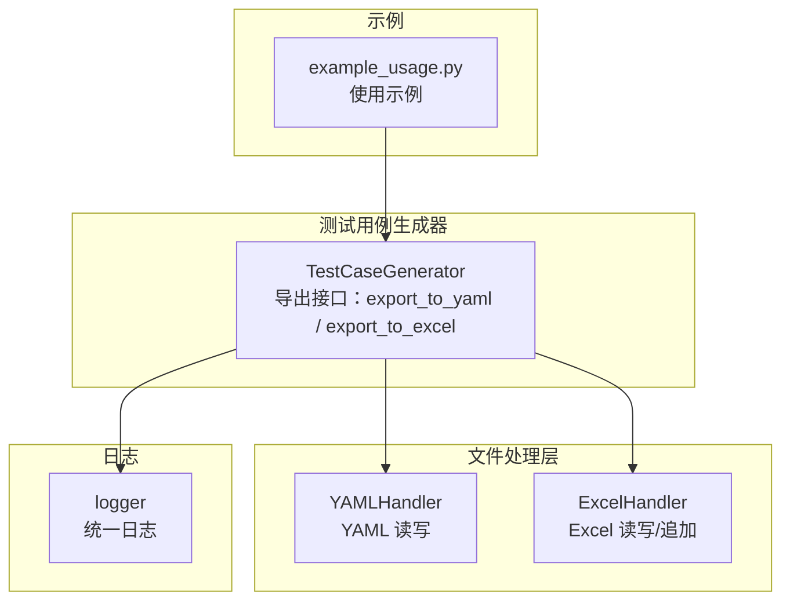
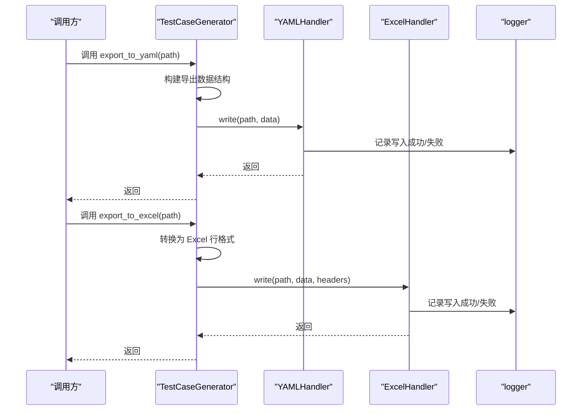
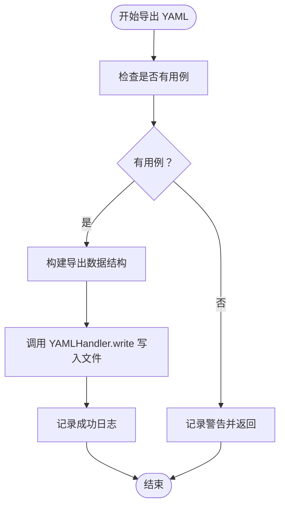
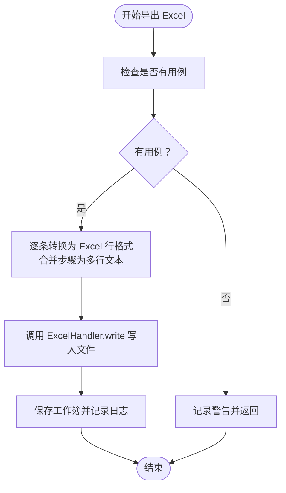
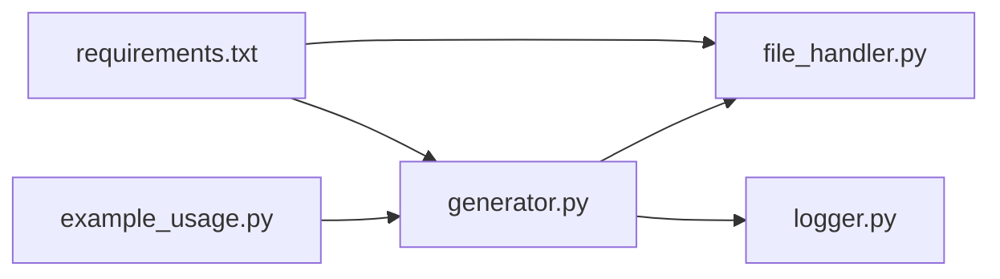

# 导出功能

<cite>
**本文引用的文件**
- [generator.py](file://testcase_generator/generator.py)
- [file_handler.py](file://common/file_handler.py)
- [logger.py](file://common/logger.py)
- [example_usage.py](file://testcase_generator/example_usage.py)
- [functional_testcase.yaml](file://testcase_generator/templates/functional_testcase.yaml)
- [login_testcases.yaml](file://testcase_generator/output/login_testcases.yaml)
- [requirements.txt](file://requirements.txt)
</cite>

## 目录
1. [简介](#简介)
2. [项目结构](#项目结构)
3. [核心组件](#核心组件)
4. [架构总览](#架构总览)
5. [详细组件分析](#详细组件分析)
6. [依赖分析](#依赖分析)
7. [性能考虑](#性能考虑)
8. [故障排查指南](#故障排查指南)
9. [结论](#结论)
10. [附录](#附录)

## 简介
本技术文档围绕测试用例导出功能展开，重点解释两个导出方法的实现机制与数据转换流程：
- export_to_yaml：将测试用例结构化数据导出为 YAML 文件
- export_to_excel：将测试用例转换为 Excel 表格并保存

文档同时涵盖：
- Excel 导出的表头映射、数据格式化与单元格处理
- YAML 导出的数据结构、嵌套层级与序列化过程
- 性能优化建议、错误处理与异常恢复机制
- 导出配置选项、文件命名规则与批量导出策略
- 实际使用示例与最佳实践

## 项目结构
导出功能主要分布在以下模块：
- 测试用例生成器：负责构建测试用例数据结构，并提供导出接口
- 文件处理器：封装 YAML 与 Excel 的读写能力
- 日志模块：统一记录导出过程中的关键事件与错误
- 示例脚本：展示如何调用导出接口并生成文件

图表来源
- [generator.py:17-187](file://testcase_generator/generator.py#L17-L187)
- [file_handler.py:13-217](file://common/file_handler.py#L13-L217)
- [logger.py:59-77](file://common/logger.py#L59-L77)
- [example_usage.py:11-83](file://testcase_generator/example_usage.py#L11-L83)

章节来源
- [generator.py:17-187](file://testcase_generator/generator.py#L17-L187)
- [file_handler.py:13-217](file://common/file_handler.py#L13-L217)
- [logger.py:59-77](file://common/logger.py#L59-L77)
- [example_usage.py:11-83](file://testcase_generator/example_usage.py#L11-L83)

## 核心组件
- 测试用例生成器（TestCaseGenerator）
  - 负责生成测试用例数据结构，提供导出接口
  - 内置 Excel 表头映射，确保导出列顺序一致
  - 支持便捷函数一键生成并导出多种格式
- 文件处理器（YAMLHandler、ExcelHandler）
  - YAMLHandler：提供安全读取与写入，支持多文档读取
  - ExcelHandler：提供读取、写入与追加行能力，支持表头推断与数据格式化
- 日志模块（logger）
  - 统一 INFO/DEBUG 级别日志输出，便于追踪导出状态与异常

章节来源
- [generator.py:17-187](file://testcase_generator/generator.py#L17-L187)
- [file_handler.py:13-217](file://common/file_handler.py#L13-L217)
- [logger.py:59-77](file://common/logger.py#L59-L77)

## 架构总览
导出流程分为两条主线：YAML 导出与 Excel 导出。二者均以 TestCaseGenerator 为核心入口，分别委托给 YAMLHandler 或 ExcelHandler 完成底层文件操作。

图表来源
- [generator.py:127-173](file://testcase_generator/generator.py#L127-L173)
- [file_handler.py:39-55](file://common/file_handler.py#L39-L55)
- [file_handler.py:132-173](file://common/file_handler.py#L132-L173)
- [logger.py:59-77](file://common/logger.py#L59-L77)

## 详细组件分析

### YAML 导出：export_to_yaml
- 数据结构设计
  - 导出顶层包含模块信息、生成时间与用例总数，便于审计与溯源
  - 用例数组保持原始字段，包括用例编号、模块、名称、前置条件、步骤、输入数据、预期结果、测试结果与备注
- 序列化过程
  - 使用 YAMLHandler.write 完成序列化，启用 Unicode 支持与按键排序关闭，保证人类可读性与一致性
- 错误处理
  - 当无用例时记录警告并提前返回
  - 写入异常会记录错误并抛出，便于上层捕获与恢复

图表来源
- [generator.py:127-145](file://testcase_generator/generator.py#L127-L145)
- [file_handler.py:39-55](file://common/file_handler.py#L39-L55)

章节来源
- [generator.py:127-145](file://testcase_generator/generator.py#L127-L145)
- [file_handler.py:39-55](file://common/file_handler.py#L39-L55)

### Excel 导出：export_to_excel
- 表头映射
  - 固定表头顺序为：用例编号、模块、用例名称、前置条件、操作步骤、输入数据、预期结果、测试结果、备注
  - 该顺序在类变量中定义，确保不同模块导出的一致性
- 数据格式化
  - 操作步骤字段在导出前被合并为多行文本，便于 Excel 查看
  - 其他字段保持原样，确保兼容性
- 单元格处理
  - 使用 ExcelHandler.write 写入，自动推断表头（当数据为字典列表时）
  - 写入完成后保存工作簿，记录成功日志
- 错误处理
  - 无用例时记录警告并返回
  - 写入异常记录错误并抛出

图表来源
- [generator.py:147-173](file://testcase_generator/generator.py#L147-L173)
- [file_handler.py:132-173](file://common/file_handler.py#L132-L173)

章节来源
- [generator.py:147-173](file://testcase_generator/generator.py#L147-L173)
- [file_handler.py:132-173](file://common/file_handler.py#L132-L173)

### 文件命名规则与批量导出策略
- 文件命名规则
  - 便捷函数 generate_testcases 会根据模块缩写生成安全文件名（去除“模块”后缀并小写化），并自动拼接后缀
  - 默认输出目录为当前工作目录，可通过参数指定
- 批量导出策略
  - 支持同时导出 YAML 与 Excel，也可仅导出其中一种
  - 生成完成后打印摘要，便于快速确认导出结果

章节来源
- [generator.py:225-262](file://testcase_generator/generator.py#L225-L262)

### 使用示例与最佳实践
- 示例脚本展示了两种使用方式：
  - 直接使用 TestCaseGenerator 类：先生成用例，再分别导出 YAML 与 Excel
  - 使用便捷函数 generate_testcases：一步完成生成与导出
- 最佳实践
  - 在导出前确保输出目录存在，避免写入失败
  - 对于大量用例，建议分批导出或在独立线程中执行，避免阻塞主流程
  - 导出后建议校验生成文件的完整性与可读性

章节来源
- [example_usage.py:42-83](file://testcase_generator/example_usage.py#L42-L83)
- [generator.py:225-262](file://testcase_generator/generator.py#L225-L262)

## 依赖分析
- 导出功能依赖关系
  - TestCaseGenerator 依赖 YAMLHandler 与 ExcelHandler 完成文件写入
  - 日志模块为导出过程提供统一的日志输出
  - 示例脚本演示了导出功能的典型用法
- 外部依赖
  - PyYAML：YAML 序列化与反序列化
  - openpyxl：Excel 读写与工作簿操作

图表来源
- [generator.py:10-14](file://testcase_generator/generator.py#L10-L14)
- [file_handler.py:5-8](file://common/file_handler.py#L5-L8)
- [requirements.txt:13-14](file://requirements.txt#L13-L14)

章节来源
- [generator.py:10-14](file://testcase_generator/generator.py#L10-L14)
- [file_handler.py:5-8](file://common/file_handler.py#L5-L8)
- [requirements.txt:13-14](file://requirements.txt#L13-L14)

## 性能考虑
- 写入性能
  - YAMLHandler.write 与 ExcelHandler.write 均在本地磁盘进行一次性写入，适合中小规模用例集
  - 对于大规模用例，建议：
    - 分批写入：将用例分组，多次调用导出接口，降低单次内存占用
    - 异步写入：在后台线程或进程池中执行写入，避免阻塞主线程
- I/O 优化
  - 确保输出目录存在，减少异常重试带来的额外 I/O
  - 避免频繁切换工作表或重复打开/关闭工作簿
- 内存占用
  - ExcelHandler.write 会将全部数据写入内存后再保存，注意控制单次导出的数据量
  - 若步骤列表较长，建议在导出前进行必要的裁剪或压缩

## 故障排查指南
- 常见问题与处理
  - 无用例可导出：导出会记录警告并返回，无需异常处理
  - 文件写入失败：YAMLHandler.write 与 ExcelHandler.write 会在异常时记录错误并抛出，建议捕获并重试或回退到其他存储介质
  - Excel 工作表不存在：ExcelHandler.read/append 会检查工作表名称并记录错误，需确保工作表名称正确
  - YAML 文件解析失败：YAMLHandler.read/ read_all 会记录解析错误并返回 None，建议检查文件编码与格式
- 日志定位
  - 使用 logger 绑定模块名，便于在日志中快速定位导出来源
  - 日志级别 INFO 以上在控制台可见，DEBUG 以上在文件中轮转保存

章节来源
- [file_handler.py:23-36](file://common/file_handler.py#L23-L36)
- [file_handler.py:92-129](file://common/file_handler.py#L92-L129)
- [file_handler.py:171-216](file://common/file_handler.py#L171-L216)
- [logger.py:40-56](file://common/logger.py#L40-L56)

## 结论
测试用例导出功能通过 TestCaseGenerator 将测试用例结构化为 YAML 与 Excel 两种格式，具备清晰的数据结构、稳定的表头映射与完善的错误处理机制。结合便捷函数与示例脚本，用户可以快速完成从测试点到可执行用例再到导出文件的完整流程。对于大规模数据，建议采用分批与异步策略提升性能与稳定性。

## 附录
- YAML 导出示例文件结构参考
  - 模板字段说明与示例用例可参考模板文件
  - 实际导出文件示例可参考输出目录中的 YAML 文件
- 关键实现位置
  - YAML 导出：[export_to_yaml:127-145](file://testcase_generator/generator.py#L127-L145)
  - Excel 导出：[export_to_excel:147-173](file://testcase_generator/generator.py#L147-L173)
  - YAMLHandler 写入：[YAMLHandler.write:39-55](file://common/file_handler.py#L39-L55)
  - ExcelHandler 写入：[ExcelHandler.write:132-173](file://common/file_handler.py#L132-L173)
  - 示例脚本：[example_usage.py:42-83](file://testcase_generator/example_usage.py#L42-L83)
  - 模板文件：[functional_testcase.yaml:1-61](file://testcase_generator/templates/functional_testcase.yaml#L1-L61)
  - 导出示例文件：[login_testcases.yaml:1-57](file://testcase_generator/output/login_testcases.yaml#L1-L57)