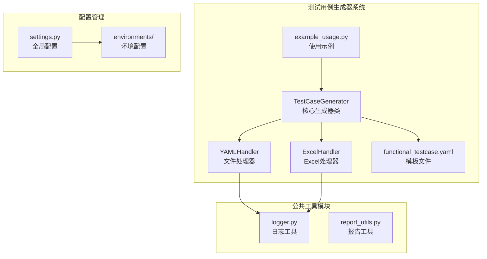
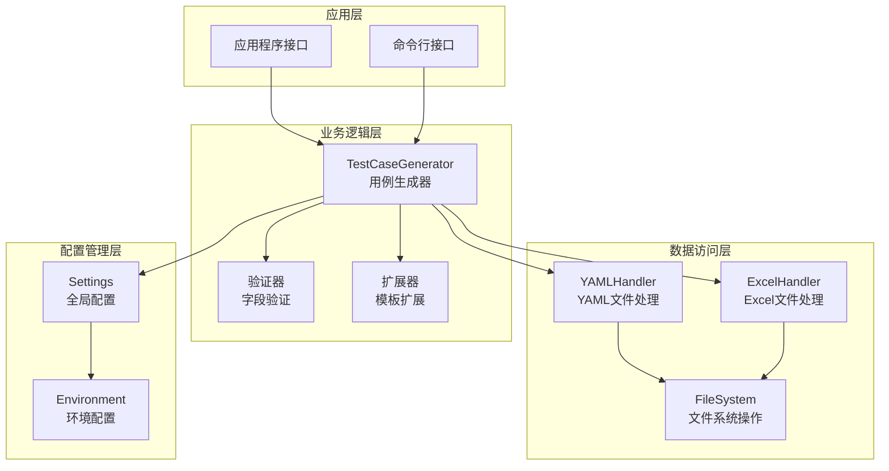
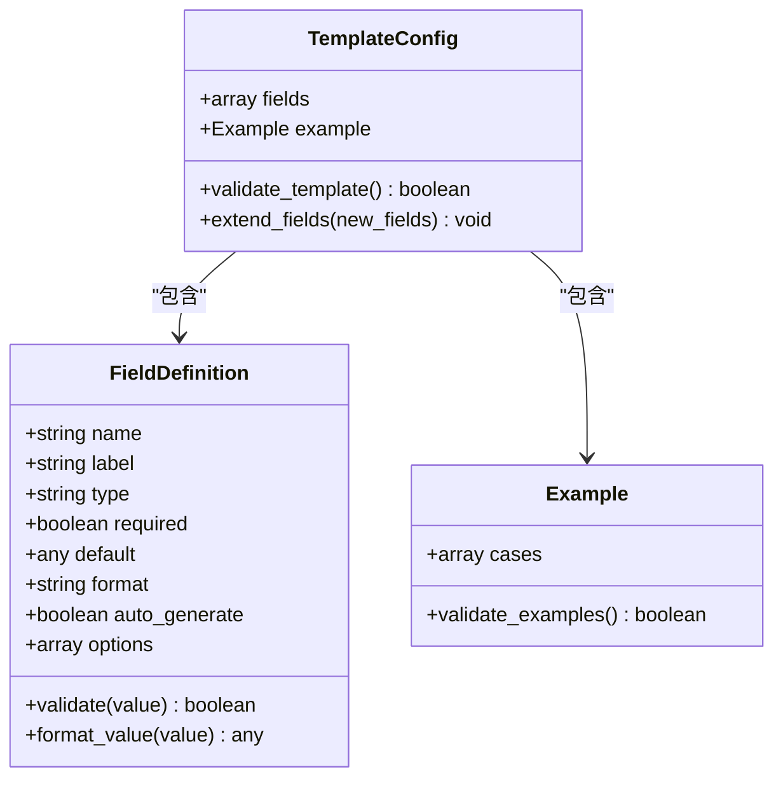
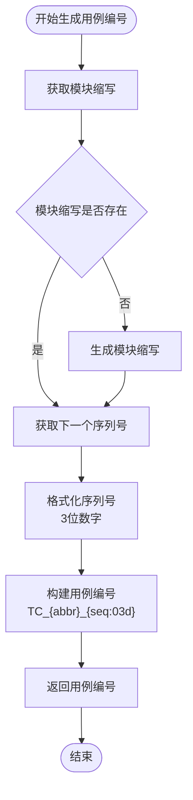
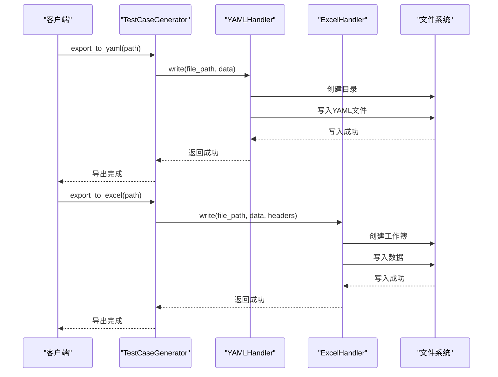
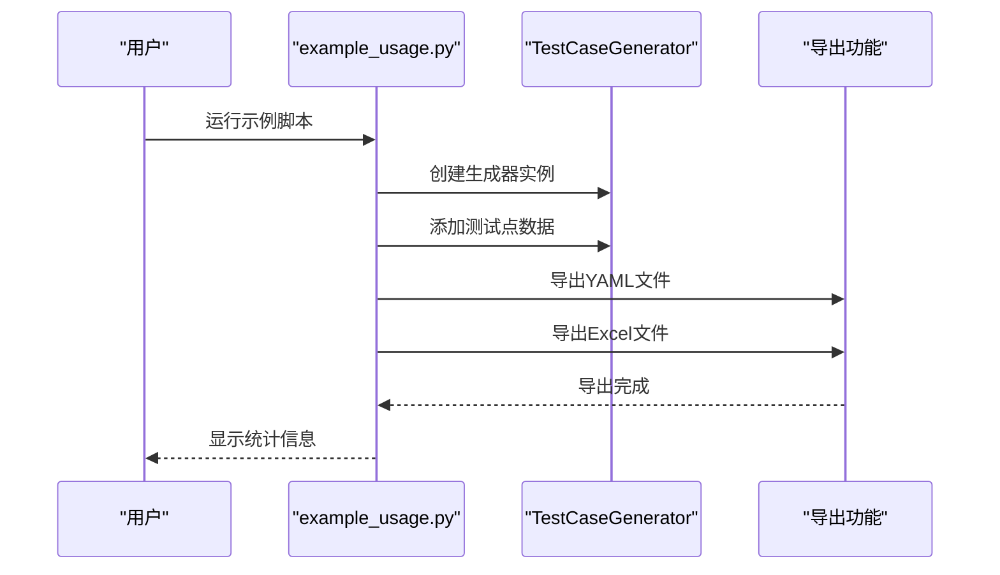
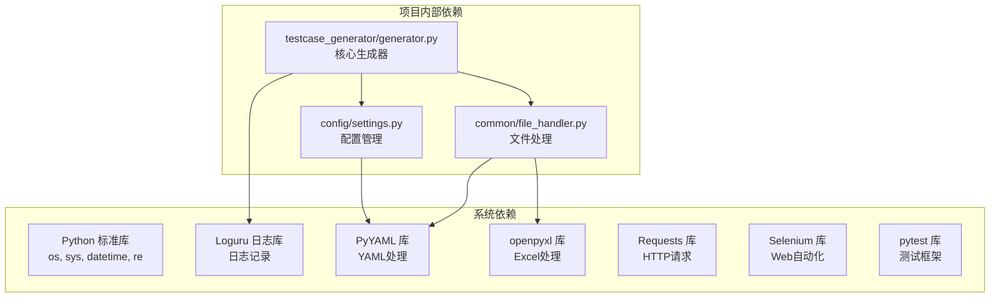

# 模板系统

<cite>
**本文引用的文件**
- [functional_testcase.yaml](file://testcase_generator/templates/functional_testcase.yaml)
- [generator.py](file://testcase_generator/generator.py)
- [example_usage.py](file://testcase_generator/example_usage.py)
- [file_handler.py](file://common/file_handler.py)
- [settings.py](file://config/settings.py)
- [example_api_data.yaml](file://api_testing/testdata/example_api_data.yaml)
- [login_data.yaml](file://ui_automation/testdata/login_data.yaml)
- [README.md](file://README.md)
- [requirements.txt](file://requirements.txt)
</cite>

## 目录
1. [简介](#简介)
2. [项目结构](#项目结构)
3. [核心组件](#核心组件)
4. [架构概览](#架构概览)
5. [详细组件分析](#详细组件分析)
6. [依赖分析](#依赖分析)
7. [性能考虑](#性能考虑)
8. [故障排除指南](#故障排除指南)
9. [结论](#结论)
10. [附录](#附录)

## 简介

测试用例模板系统是一个专门设计的功能测试用例生成和管理框架，旨在为测试团队提供标准化、可扩展的测试用例模板解决方案。该系统的核心是 `functional_testcase.yaml` 模板文件，它定义了功能测试用例的标准结构和字段规范。

系统的主要特点包括：
- **标准化模板结构**：提供统一的测试用例字段定义和数据类型约束
- **自动编号生成**：基于模块缩写的智能用例编号生成机制
- **多格式导出**：支持 YAML 和 Excel 格式的测试用例导出
- **灵活扩展机制**：支持模板字段的自定义扩展和版本管理
- **完整的生命周期管理**：从用例生成到导出的全流程支持

## 项目结构

测试用例模板系统位于 `testcase_generator` 目录中，采用模块化设计，主要包含以下组件：

**图表来源**
- [generator.py:17-263](file://testcase_generator/generator.py#L17-L263)
- [file_handler.py:13-217](file://common/file_handler.py#L13-L217)
- [functional_testcase.yaml:1-61](file://testcase_generator/templates/functional_testcase.yaml#L1-L61)

**章节来源**
- [README.md:34-42](file://README.md#L34-L42)
- [generator.py:17-34](file://testcase_generator/generator.py#L17-L34)

## 核心组件

### TestCaseGenerator 核心类

`TestCaseGenerator` 是整个模板系统的核心组件，负责测试用例的生成、管理和导出。该类提供了完整的测试用例生命周期管理功能。

#### 主要功能特性：
- **用例生成**：从测试点列表批量生成测试用例
- **自动编号**：基于模块缩写的智能用例编号生成
- **格式导出**：支持 YAML 和 Excel 格式的测试用例导出
- **数据验证**：内置字段验证和默认值处理
- **统计摘要**：提供用例生成的统计信息

#### 关键方法：
- `add_case()`: 添加单条测试用例
- `add_cases_from_test_points()`: 从测试点批量生成用例
- `export_to_yaml()`: 导出为 YAML 格式
- `export_to_excel()`: 导出为 Excel 格式
- `get_summary()`: 获取用例统计摘要

**章节来源**
- [generator.py:17-187](file://testcase_generator/generator.py#L17-L187)

### 模板文件结构

`functional_testcase.yaml` 定义了测试用例的标准模板结构，包含字段定义和示例数据。

#### 模板字段定义：
- **template.fields**: 字段定义数组
- **example**: 示例用例数据
- **字段属性**: name、label、type、required、default、options 等

**章节来源**
- [functional_testcase.yaml:13-44](file://testcase_generator/templates/functional_testcase.yaml#L13-L44)

## 架构概览

系统采用分层架构设计，确保各组件职责清晰、耦合度低：

**图表来源**
- [generator.py:17-263](file://testcase_generator/generator.py#L17-L263)
- [file_handler.py:13-217](file://common/file_handler.py#L13-L217)
- [settings.py:13-104](file://config/settings.py#L13-L104)

## 详细组件分析

### 模板字段定义详解

#### 字段元数据结构

每个模板字段都包含丰富的元数据信息，用于定义字段的行为和约束：

**图表来源**
- [functional_testcase.yaml:14-44](file://testcase_generator/templates/functional_testcase.yaml#L14-L44)

#### 字段类型和约束

系统支持多种字段类型和约束机制：

| 字段类型 | 用途 | 约束 | 示例 |
|---------|------|------|------|
| `string` | 文本字段 | required、default、format | case_name |
| `list` | 步骤列表 | required | steps |
| `enum` | 枚举值 | options 数组 | test_result |
| `auto_generate` | 自动生成 | format 模板 | case_id |

**章节来源**
- [functional_testcase.yaml:15-44](file://testcase_generator/templates/functional_testcase.yaml#L15-L44)

### 用例编号生成机制

用例编号生成是系统的核心功能之一，采用智能算法确保编号的唯一性和可读性：

**图表来源**
- [generator.py:67-70](file://testcase_generator/generator.py#L67-L70)
- [generator.py:35-65](file://testcase_generator/generator.py#L35-L65)

#### 模块缩写生成规则

模块缩写生成采用多级判断策略：

1. **英文字符提取**：优先提取英文部分并大写
2. **中文拼音映射**：对中文字符使用拼音首字母映射
3. **字符过滤**：移除常见后缀如"模块"
4. **默认回退**：使用"MOD"作为默认缩写

**章节来源**
- [generator.py:35-65](file://testcase_generator/generator.py#L35-L65)

### 文件处理机制

系统提供完整的文件处理能力，支持多种格式的测试用例存储和读取：

**图表来源**
- [generator.py:127-173](file://testcase_generator/generator.py#L127-L173)
- [file_handler.py:38-55](file://common/file_handler.py#L38-L55)

**章节来源**
- [file_handler.py:13-217](file://common/file_handler.py#L13-L217)

### 使用示例分析

系统提供了完整的使用示例，展示如何从测试点生成测试用例：

#### 基础使用模式

**图表来源**
- [example_usage.py:42-84](file://testcase_generator/example_usage.py#L42-L84)

**章节来源**
- [example_usage.py:13-84](file://testcase_generator/example_usage.py#L13-L84)

## 依赖分析

系统依赖关系相对简单，主要依赖于标准库和第三方库：

**图表来源**
- [requirements.txt:1-21](file://requirements.txt#L1-L21)
- [generator.py:6-14](file://testcase_generator/generator.py#L6-L14)

### 外部依赖分析

系统对外部依赖的使用遵循最小化原则：

| 依赖库 | 版本 | 用途 | 必需性 |
|--------|------|------|--------|
| pytest | 7.4.4 | 测试框架 | 必需 |
| PyYAML | 6.0.1 | YAML文件处理 | 必需 |
| openpyxl | 3.1.2 | Excel文件处理 | 可选 |
| loguru | 0.7.2 | 日志记录 | 必需 |
| requests | 2.31.0 | HTTP请求 | 可选 |
| selenium | 4.16.0 | Web自动化 | 可选 |

**章节来源**
- [requirements.txt:1-21](file://requirements.txt#L1-21)

## 性能考虑

系统在设计时充分考虑了性能优化：

### 内存使用优化
- **增量导出**：支持批量处理大量测试用例
- **流式处理**：Excel导出采用流式写入减少内存占用
- **缓存机制**：模块缩写生成结果缓存避免重复计算

### 处理效率优化
- **批量操作**：支持从测试点列表批量生成用例
- **异步处理**：导出操作独立执行，不影响主流程
- **错误恢复**：文件操作具备完善的错误处理机制

### 扩展性考虑
- **插件架构**：支持自定义字段类型和验证规则
- **模板继承**：支持模板的层次化扩展
- **配置驱动**：通过配置文件控制行为参数

## 故障排除指南

### 常见问题及解决方案

#### 模板加载失败
**问题症状**：模板文件无法读取或解析
**可能原因**：
- 文件路径错误
- YAML语法错误
- 编码格式问题

**解决步骤**：
1. 验证文件路径是否正确
2. 检查YAML语法格式
3. 确认文件编码为UTF-8

#### 用例编号冲突
**问题症状**：生成的用例编号重复
**可能原因**：
- 模块缩写相同
- 序列号重置
- 并发生成导致的竞争条件

**解决步骤**：
1. 检查模块缩写生成逻辑
2. 确保序列号正确递增
3. 实施并发控制机制

#### 文件导出错误
**问题症状**：导出文件失败或格式错误
**可能原因**：
- 目标目录权限不足
- 文件被其他程序占用
- 数据格式不符合要求

**解决步骤**：
1. 检查目标目录写入权限
2. 关闭占用文件的程序
3. 验证数据格式完整性

**章节来源**
- [file_handler.py:23-36](file://common/file_handler.py#L23-L36)
- [generator.py:132-134](file://testcase_generator/generator.py#L132-L134)

## 结论

测试用例模板系统是一个设计精良、功能完备的测试用例生成和管理框架。系统通过标准化的模板结构、智能的用例编号生成机制和灵活的扩展能力，为测试团队提供了高效的测试用例管理解决方案。

### 主要优势
- **标准化程度高**：统一的模板结构确保测试用例的一致性
- **自动化程度高**：从生成到导出的全流程自动化
- **扩展性强**：支持模板字段的自定义扩展
- **易用性好**：提供简洁的API和详细的使用示例

### 发展方向
- **版本管理**：增强模板版本控制和兼容性处理
- **验证机制**：引入更严格的字段验证和约束检查
- **集成能力**：与其他测试工具的深度集成
- **协作功能**：支持多人协作和版本控制

## 附录

### 模板字段完整说明

#### 基础字段
| 字段名 | 类型 | 必填 | 默认值 | 说明 |
|--------|------|------|--------|------|
| case_id | string | 是 | 自动生成 | 用例唯一标识符 |
| module | string | 是 | 无 | 所属功能模块 |
| case_name | string | 是 | 无 | 用例名称 |
| precondition | string | 否 | "无" | 测试前置条件 |
| steps | list | 是 | 无 | 操作步骤列表 |
| input_data | string | 否 | "无" | 输入数据描述 |
| expected_result | string | 是 | 无 | 预期结果描述 |
| test_result | enum | 否 | "未执行" | 测试执行结果状态 |
| remark | string | 否 | "" | 备注信息 |

#### 字段验证规则
- **必填字段**：case_id、module、case_name、steps、expected_result
- **枚举值限制**：test_result 只能取特定值
- **格式约束**：case_id 遵循特定格式规范
- **数据类型**：steps 必须为列表类型

### 最佳实践指南

#### 模板创建最佳实践
1. **字段命名规范**：使用清晰、简洁的字段名称
2. **默认值设置**：为可选字段设置合理的默认值
3. **验证规则**：为关键字段设置适当的验证规则
4. **文档说明**：为复杂字段提供详细的说明文档

#### 模板扩展最佳实践
1. **向后兼容**：新增字段时保持向后兼容性
2. **版本控制**：使用版本号管理模板变更
3. **测试验证**：扩展后进行全面的功能测试
4. **文档更新**：及时更新相关技术文档

#### 使用示例参考
系统提供了完整的使用示例，展示了从测试点到最终导出的完整流程。这些示例涵盖了常见的使用场景，为用户快速上手提供了很好的参考。

**章节来源**
- [functional_testcase.yaml:46-60](file://testcase_generator/templates/functional_testcase.yaml#L46-L60)
- [example_usage.py:13-84](file://testcase_generator/example_usage.py#L13-L84)