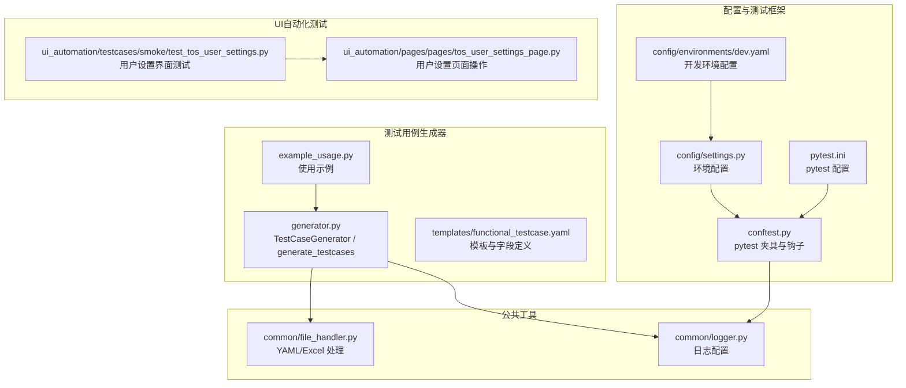
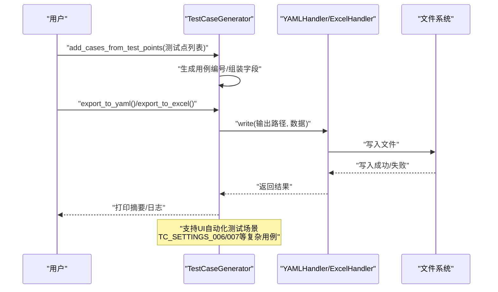
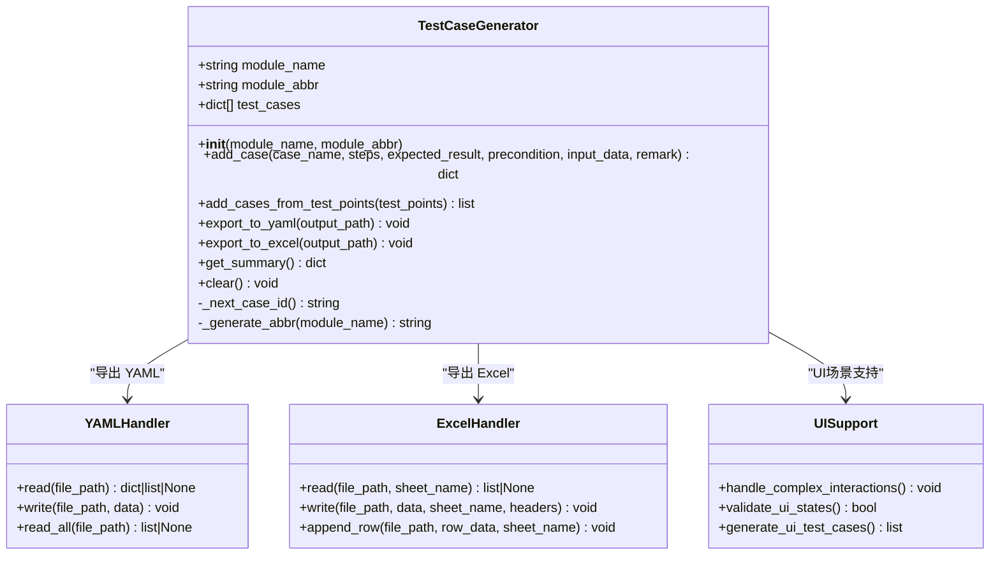
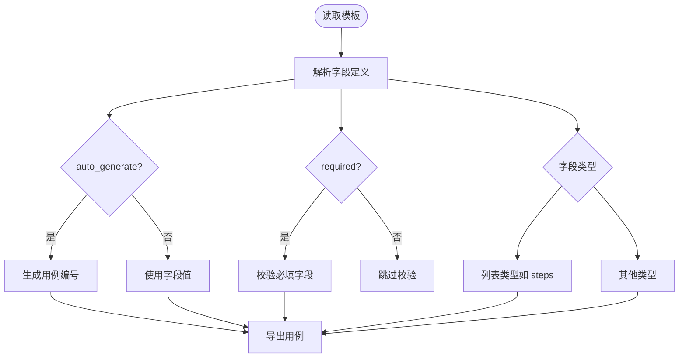
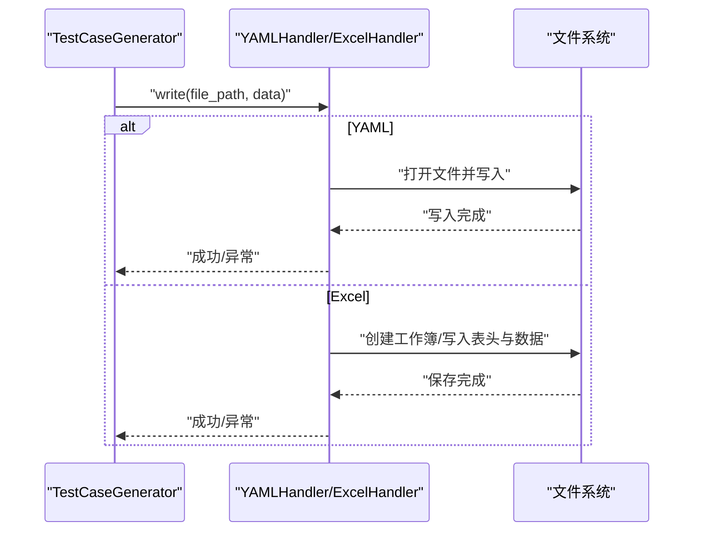
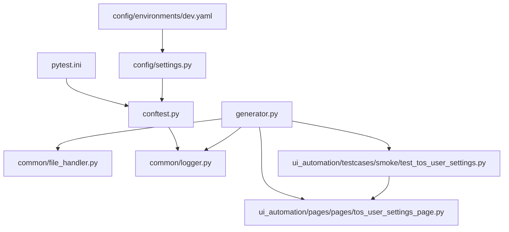

# 测试用例生成器

<cite>
**本文引用的文件**
- [generator.py](file://testcase_generator/generator.py)
- [functional_testcase.yaml](file://testcase_generator/templates/functional_testcase.yaml)
- [example_usage.py](file://testcase_generator/example_usage.py)
- [file_handler.py](file://common/file_handler.py)
- [logger.py](file://common/logger.py)
- [settings.py](file://config/settings.py)
- [dev.yaml](file://config/environments/dev.yaml)
- [conftest.py](file://conftest.py)
- [pytest.ini](file://pytest.ini)
- [README.md](file://README.md)
- [requirements.txt](file://requirements.txt)
- [test_tos_user_settings.py](file://ui_automation/testcases/smoke/test_tos_user_settings.py)
- [tos_user_settings_page.py](file://ui_automation/pages/pages/tos_user_settings_page.py)
</cite>

## 目录
1. [引言](#引言)
2. [项目结构](#项目结构)
3. [核心组件](#核心组件)
4. [架构总览](#架构总览)
5. [详细组件分析](#详细组件分析)
6. [依赖关系分析](#依赖关系分析)
7. [性能考虑](#性能考虑)
8. [故障排除指南](#故障排除指南)
9. [结论](#结论)
10. [附录](#附录)

## 引言
本技术文档面向"测试用例生成器"，系统性阐述其架构设计、模板系统与自动化生成流程。文档重点包括：
- 模板系统：functional_testcase.yaml 的字段定义、扩展机制与使用方式
- 核心算法：用例编号生成、模块缩写策略、批量导入与导出流程
- 数据处理：YAML 与 Excel 的读写封装、错误处理与日志记录
- 多格式导出：YAML 与 Excel 的输出规范与兼容性
- 使用示例：从测试点到生成文件的完整流程
- 最佳实践：模板定制、字段扩展、环境配置与性能优化
- 故障排除：常见问题定位与修复建议

**更新** 本次更新反映了新增TC_SETTINGS_006和TC_SETTINGS_007测试用例，扩展了用户设置界面测试覆盖范围，增强了测试用例生成器对UI自动化测试场景的支持。

## 项目结构
测试用例生成器位于 testcase_generator 目录，配合 common、config 等模块共同构成测试自动化工作区的一部分。关键文件与职责如下：
- generator.py：生成器核心类与便捷函数，负责用例构建、编号生成、导出
- templates/functional_testcase.yaml：功能测试用例模板，定义字段、默认值与示例
- example_usage.py：使用示例，演示两种生成方式（类方式与便捷函数）
- common/file_handler.py：YAML/Excel 文件读写封装，提供统一的错误处理与日志
- common/logger.py：统一日志配置，控制台与文件双通道输出
- config/settings.py 与 environments/dev.yaml：环境配置加载与浏览器配置
- conftest.py 与 pytest.ini：pytest 配置与 UI 自动化测试夹具
- README.md 与 requirements.txt：项目概览与依赖清单
- ui_automation/testcases/smoke/test_tos_user_settings.py：用户设置界面冒烟测试用例
- ui_automation/pages/pages/tos_user_settings_page.py：用户设置页面操作封装

**图表来源**
- [generator.py:1-263](file://testcase_generator/generator.py#L1-L263)
- [functional_testcase.yaml:1-61](file://testcase_generator/templates/functional_testcase.yaml#L1-L61)
- [example_usage.py:1-84](file://testcase_generator/example_usage.py#L1-L84)
- [file_handler.py:1-217](file://common/file_handler.py#L1-L217)
- [logger.py:1-77](file://common/logger.py#L1-L77)
- [settings.py:1-104](file://config/settings.py#L1-L104)
- [dev.yaml:1-31](file://config/environments/dev.yaml#L1-L31)
- [conftest.py:1-122](file://conftest.py#L1-L122)
- [pytest.ini:1-12](file://pytest.ini#L1-L12)
- [test_tos_user_settings.py:1-250](file://ui_automation/testcases/smoke/test_tos_user_settings.py#L1-L250)
- [tos_user_settings_page.py:200-250](file://ui_automation/pages/pages/tos_user_settings_page.py#L200-L250)

**章节来源**
- [README.md:1-123](file://README.md#L1-L123)
- [requirements.txt:1-21](file://requirements.txt#L1-L21)

## 核心组件
- TestCaseGenerator：核心生成器类，负责用例构建、编号生成、批量导入与导出
- YAMLHandler/ExcelHandler：文件处理工具，封装 YAML/Excel 的读写与错误处理
- 日志系统：统一日志配置，支持 INFO+ 控制台输出与 DEBUG+ 文件轮转输出
- 模板系统：functional_testcase.yaml 定义字段、默认值、必填项与选项集
- 便捷函数：generate_testcases，一键从测试点生成并导出 YAML 与 Excel
- UI自动化测试集成：支持用户设置界面等复杂交互场景的测试用例生成

**更新** 新增对UI自动化测试场景的支持，特别是用户设置界面的复杂交互测试用例生成。

**章节来源**
- [generator.py:17-263](file://testcase_generator/generator.py#L17-L263)
- [file_handler.py:13-217](file://common/file_handler.py#L13-L217)
- [logger.py:59-77](file://common/logger.py#L59-L77)
- [functional_testcase.yaml:13-61](file://testcase_generator/templates/functional_testcase.yaml#L13-L61)

## 架构总览
生成器采用"模板驱动 + 文件处理"的架构：
- 模板层：定义字段结构、默认值与约束
- 业务层：生成器类负责用例组装、编号生成与批量导入
- 数据层：文件处理器负责 YAML/Excel 的读写与错误处理
- 日志层：统一日志输出，便于调试与审计
- UI集成层：支持复杂交互场景的测试用例生成与管理

**图表来源**
- [generator.py:100-173](file://testcase_generator/generator.py#L100-L173)
- [file_handler.py:39-173](file://common/file_handler.py#L39-L173)
- [test_tos_user_settings.py:149-218](file://ui_automation/testcases/smoke/test_tos_user_settings.py#L149-L218)

## 详细组件分析

### 生成器类：TestCaseGenerator
- 用例编号生成：基于模块缩写与递增序号，格式为 TC_{模块缩写}_{三位序号}
- 模块缩写策略：优先提取英文部分并大写；若纯中文，使用拼音首字母映射（简化实现）
- 批量导入：add_cases_from_test_points 从测试点字典列表批量生成用例
- 导出能力：export_to_yaml 与 export_to_excel，分别输出结构化 YAML 与 Excel 表格
- 统计摘要：get_summary 返回模块、数量与时点信息
- 清空功能：clear 重置用例集合与序号
- UI场景支持：增强对复杂交互场景的测试用例生成能力

**更新** 新增对复杂UI交互场景的支持，能够处理多步骤、多状态切换的测试用例生成。

**图表来源**
- [generator.py:17-187](file://testcase_generator/generator.py#L17-L187)
- [file_handler.py:13-217](file://common/file_handler.py#L13-L217)

**章节来源**
- [generator.py:23-187](file://testcase_generator/generator.py#L23-L187)

### 模板系统：functional_testcase.yaml
- 字段定义：case_id、module、case_name、precondition、steps、input_data、expected_result、test_result、remark
- 字段特性：
  - auto_generate：case_id 自动编号
  - required：必填字段（如 case_name、steps、expected_result）
  - default：默认值（如 precondition、input_data、test_result）
  - options：枚举值（test_result 可选值集合）
  - type：steps 为列表类型
- 示例用例：提供标准用例样例，便于理解字段取值与结构
- UI场景扩展：支持复杂交互步骤的结构化描述

**更新** 模板系统现已支持更复杂的UI交互场景描述，能够处理多步骤、多状态切换的测试用例。

**图表来源**
- [functional_testcase.yaml:13-61](file://testcase_generator/templates/functional_testcase.yaml#L13-L61)

**章节来源**
- [functional_testcase.yaml:1-61](file://testcase_generator/templates/functional_testcase.yaml#L1-L61)

### 文件处理：YAMLHandler 与 ExcelHandler
- YAMLHandler：
  - read：安全读取 YAML，支持多文档（safe_load_all）
  - write：写入 YAML，自动创建目录，保留中文编码
  - 错误处理：捕获解析与 IO 异常，记录日志
- ExcelHandler：
  - read：读取 Excel，首行作为表头，返回字典列表
  - write：写入 Excel，支持表头与多种数据类型
  - append_row：追加一行数据，自动推断表头顺序

**图表来源**
- [file_handler.py:39-173](file://common/file_handler.py#L39-L173)

**章节来源**
- [file_handler.py:13-217](file://common/file_handler.py#L13-L217)

### 日志系统：统一日志配置
- 控制台输出：INFO 级别及以上，彩色输出，包含时间、级别、模块名与消息
- 文件输出：DEBUG 级别及以上，按天轮转，保留 7 天，UTF-8 编码
- get_logger：按模块名绑定日志上下文，便于区分不同组件输出

**章节来源**
- [logger.py:14-77](file://common/logger.py#L14-L77)

### 使用示例与最佳实践
- 示例用法：example_usage.py 展示两类用法
  - 类方式：手动创建生成器，批量导入测试点，分别导出 YAML 与 Excel，并打印摘要
  - 便捷函数：generate_testcases 一键生成并导出，自动选择输出目录与格式
- 最佳实践：
  - 在生成前确保输出目录存在
  - 使用模块缩写时保持唯一性，避免编号冲突
  - 对于复杂步骤，建议将 steps 设为列表，便于后续处理
  - 使用默认值与选项集减少手工填写错误
  - 结合 pytest 与 conftest 配置，统一环境与浏览器设置
- UI自动化集成：支持复杂交互场景的测试用例生成，如用户设置界面的多步骤操作

**更新** 新增UI自动化测试场景的最佳实践，特别针对用户设置界面等复杂交互场景的测试用例生成。

**章节来源**
- [example_usage.py:13-84](file://testcase_generator/example_usage.py#L13-L84)
- [conftest.py:25-70](file://conftest.py#L25-L70)
- [pytest.ini:1-12](file://pytest.ini#L1-L12)

### 新增测试用例场景分析
基于TC_SETTINGS_006和TC_SETTINGS_007测试用例，展示生成器对复杂UI场景的支持：

**TC_SETTINGS_006 - 编辑用户信息并保存**
- 场景特点：多字段编辑、应用按钮提交、成功提示验证
- 复杂度：涉及多个输入框操作和状态验证
- 生成要点：需要支持多步骤操作和状态检查

**TC_SETTINGS_007 - 其他Tab复选框操作**
- 场景特点：复选框状态管理、批量操作、应用按钮提交
- 复杂度：涉及多个元素的状态切换和批量操作
- 生成要点：需要支持元素状态检查和批量操作序列

**章节来源**
- [test_tos_user_settings.py:149-218](file://ui_automation/testcases/smoke/test_tos_user_settings.py#L149-L218)
- [tos_user_settings_page.py:209-238](file://ui_automation/pages/pages/tos_user_settings_page.py#L209-L238)

## 依赖关系分析
- 生成器依赖公共工具模块：
  - common/file_handler.py：YAML/Excel 文件读写
  - common/logger.py：日志输出
- 配置模块：
  - config/settings.py：环境配置加载
  - config/environments/dev.yaml：开发环境配置
- 测试框架：
  - conftest.py：pytest 夹具与失败截图钩子
  - pytest.ini：pytest 配置与标记注册
- UI自动化测试：
  - ui_automation/testcases/smoke/test_tos_user_settings.py：用户设置界面测试
  - ui_automation/pages/pages/tos_user_settings_page.py：用户设置页面操作封装

**更新** 新增对UI自动化测试模块的依赖关系分析，展示测试用例生成器与UI测试场景的集成。

**图表来源**
- [generator.py:10-14](file://testcase_generator/generator.py#L10-L14)
- [file_handler.py:1-10](file://common/file_handler.py#L1-L10)
- [logger.py:8-12](file://common/logger.py#L8-L12)
- [settings.py:37-48](file://config/settings.py#L37-L48)
- [dev.yaml:1-31](file://config/environments/dev.yaml#L1-L31)
- [conftest.py:19-22](file://conftest.py#L19-L22)
- [pytest.ini:1-12](file://pytest.ini#L1-L12)
- [test_tos_user_settings.py:1-250](file://ui_automation/testcases/smoke/test_tos_user_settings.py#L1-L250)
- [tos_user_settings_page.py:200-250](file://ui_automation/pages/pages/tos_user_settings_page.py#L200-L250)

**章节来源**
- [requirements.txt:1-21](file://requirements.txt#L1-L21)

## 性能考虑
- 导出性能：
  - YAML 写入：一次性 dump，适合中小规模用例
  - Excel 写入：逐行写入，适合结构化表格导出
- 日志性能：
  - 控制台 INFO 级别输出，文件 DEBUG 级别轮转，避免高频日志影响性能
- 模块缩写生成：
  - 中文拼音首字母映射为 O(n) 操作，n 为模块名长度；建议在生成前预估模块数量，避免过多中文模块导致映射冲突
- 批量导入：
  - add_cases_from_test_points 为线性遍历，建议在生成前进行数据清洗，减少无效字段
- UI场景处理：
  - 复杂交互场景的测试用例生成可能增加处理时间，建议分批处理大量UI测试用例

**更新** 新增对UI复杂场景处理的性能考虑，建议合理安排UI测试用例的生成批次。

## 故障排除指南
- YAML/Excel 写入失败
  - 检查输出路径是否存在且可写
  - 查看日志中错误信息，确认异常类型（IO/编码/权限）
- Excel 文件读取异常
  - 确认工作表名称是否存在
  - 检查文件是否被占用或损坏
- 模块缩写冲突
  - 自定义 module_abbr 参数，避免默认缩写重复
- 用例编号重复
  - 清空生成器缓存后重新生成，或调整模块缩写
- 日志未输出
  - 确认日志目录存在且具有写权限
  - 检查日志级别过滤设置
- UI场景生成异常
  - 检查UI元素定位是否正确
  - 验证复杂交互步骤的执行顺序
  - 确认页面状态检查的准确性

**更新** 新增UI场景相关的故障排除指导，帮助解决复杂交互测试用例生成中的常见问题。

**章节来源**
- [file_handler.py:23-36](file://common/file_handler.py#L23-L36)
- [file_handler.py:92-129](file://common/file_handler.py#L92-L129)
- [logger.py:40-56](file://common/logger.py#L40-L56)

## 结论
测试用例生成器以模板驱动为核心，结合统一的日志与文件处理能力，实现了从测试点到结构化用例的自动化生成与多格式导出。通过合理的字段定义、默认值与选项集，以及便捷的批量导入与导出流程，显著提升了测试用例的标准化与可维护性。

**更新** 本次更新进一步增强了对复杂UI交互场景的支持，特别是用户设置界面等多步骤、多状态切换的测试用例生成能力。通过TC_SETTINGS_006和TC_SETTINGS_007等实际用例的集成，展示了生成器在UI自动化测试场景中的强大适应性和扩展性。建议在实际使用中遵循最佳实践，结合环境配置与测试框架，进一步提升团队协作效率与质量保障水平。

## 附录

### 模板字段定义与扩展指南
- 字段定义参考：functional_testcase.yaml
- 扩展机制：
  - 新增字段：在 template.fields 中添加新条目，设置 label、type、default、options 等
  - 自动编号：为 case_id 设置 auto_generate 与 format 模板
  - 必填校验：为关键字段设置 required
  - 示例用例：在 example 下补充示例数据，便于理解字段取值
- UI场景扩展：支持复杂交互步骤的结构化描述，适用于用户设置界面等多步骤操作场景

**更新** 新增UI场景相关的模板扩展指南，帮助开发者更好地描述复杂交互测试用例。

**章节来源**
- [functional_testcase.yaml:13-61](file://testcase_generator/templates/functional_testcase.yaml#L13-L61)

### 配置选项与环境设置
- 环境配置：通过 config/settings.py 与 config/environments/*.yaml 加载
- 浏览器配置：在 dev.yaml 中设置浏览器类型、无头模式、隐式等待等
- pytest 配置：pytest.ini 注册标记，conftest.py 提供夹具与失败截图
- UI测试配置：支持用户设置界面等复杂交互场景的测试环境配置

**更新** 新增UI测试相关的环境配置说明，确保复杂交互场景的测试环境一致性。

**章节来源**
- [settings.py:26-48](file://config/settings.py#L26-L48)
- [dev.yaml:25-31](file://config/environments/dev.yaml#L25-L31)
- [pytest.ini:7-12](file://pytest.ini#L7-L12)
- [conftest.py:25-70](file://conftest.py#L25-L70)

### 依赖与安装
- 依赖清单：requirements.txt
- 建议使用虚拟环境安装依赖，确保版本一致
- UI测试依赖：额外支持UI自动化测试框架的依赖包

**更新** 新增UI测试相关的依赖说明，确保测试环境的完整性。

**章节来源**
- [requirements.txt:1-21](file://requirements.txt#L1-L21)

### 新增测试用例场景详解
基于TC_SETTINGS_006和TC_SETTINGS_007的实际应用场景，展示生成器的增强功能：

**TC_SETTINGS_006 - 用户信息编辑场景**
- 多字段输入：描述、邮箱、电话号码的同步编辑
- 状态验证：应用按钮后的成功提示验证
- 时间戳处理：动态生成唯一标识符确保测试独立性

**TC_SETTINGS_007 - 复选框批量操作场景**
- 批量状态管理：取消所有勾选和勾选所有复选框
- 应用按钮验证：两次操作后的成功提示验证
- 元素状态检查：确保复选框状态的准确性和一致性

**章节来源**
- [test_tos_user_settings.py:149-218](file://ui_automation/testcases/smoke/test_tos_user_settings.py#L149-L218)
- [tos_user_settings_page.py:209-238](file://ui_automation/pages/pages/tos_user_settings_page.py#L209-L238)