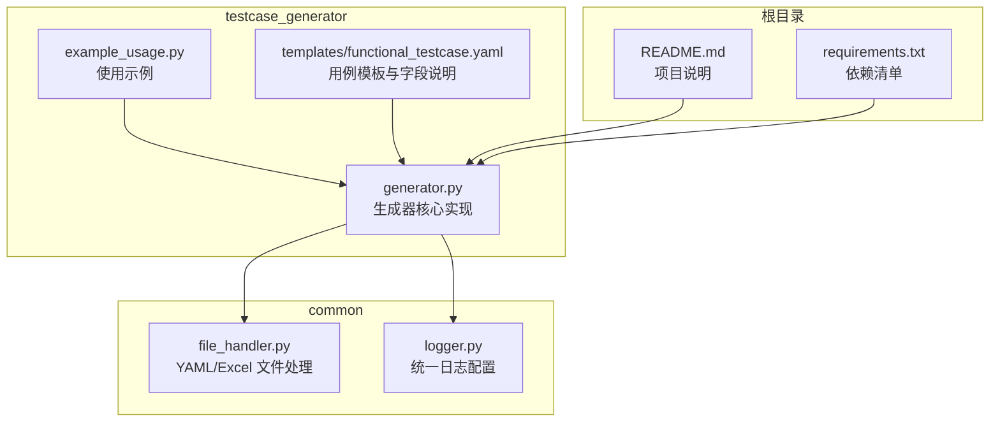
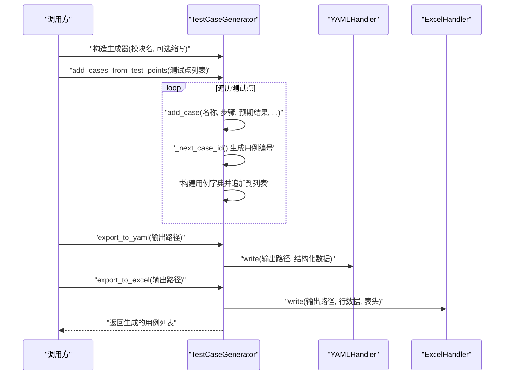
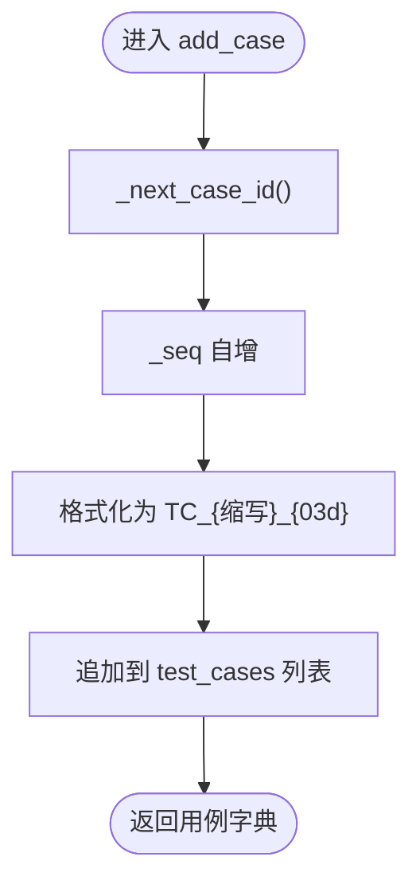
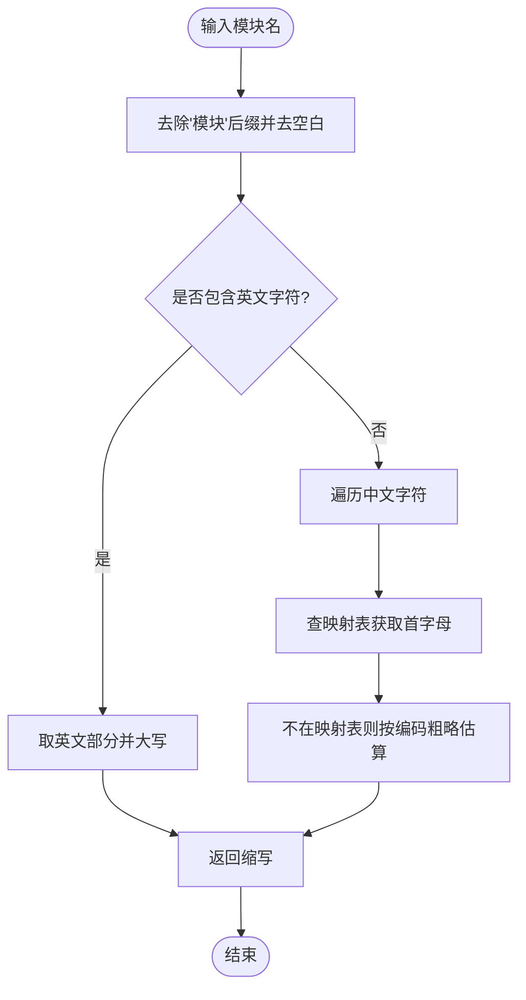
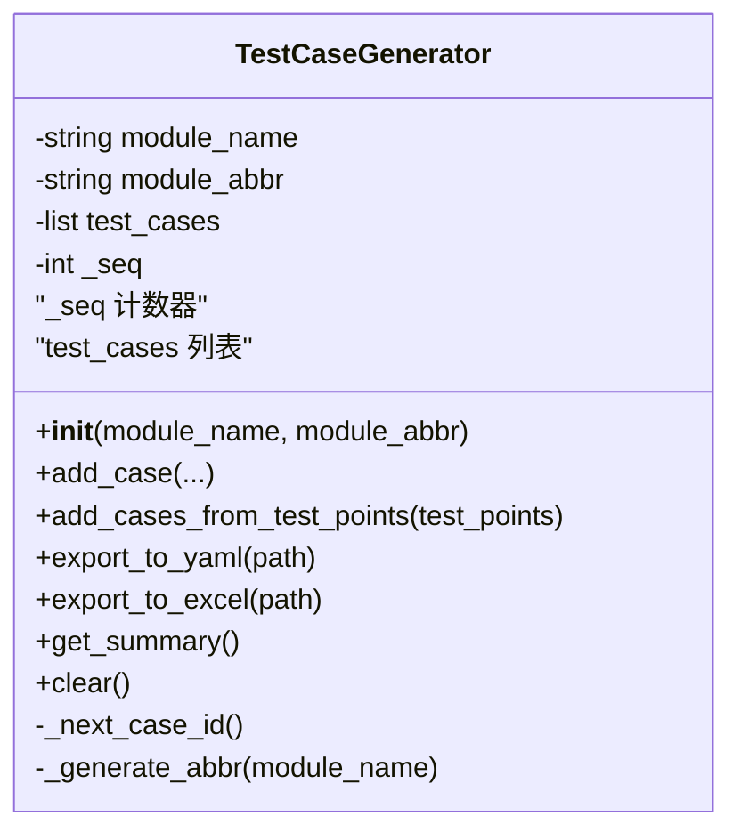
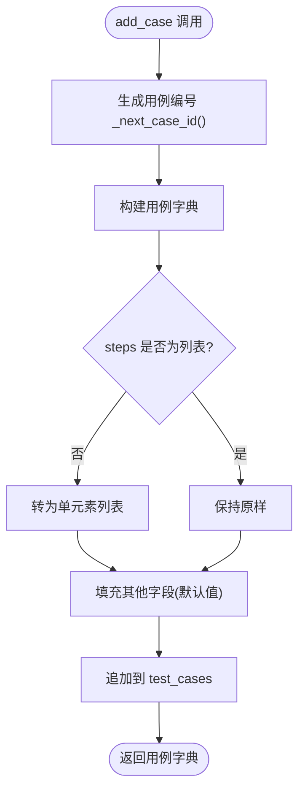
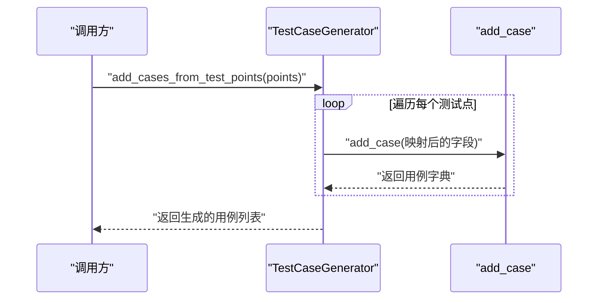
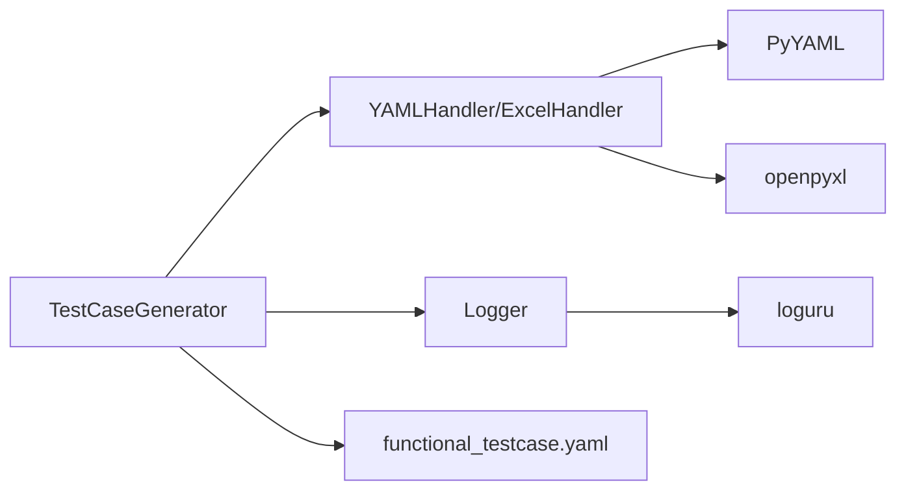

# 生成算法

<cite>
**本文引用的文件**
- [generator.py](file://testcase_generator/generator.py)
- [example_usage.py](file://testcase_generator/example_usage.py)
- [functional_testcase.yaml](file://testcase_generator/templates/functional_testcase.yaml)
- [file_handler.py](file://common/file_handler.py)
- [logger.py](file://common/logger.py)
- [README.md](file://README.md)
- [requirements.txt](file://requirements.txt)
</cite>

## 目录
1. [引言](#引言)
2. [项目结构](#项目结构)
3. [核心组件](#核心组件)
4. [架构总览](#架构总览)
5. [详细组件分析](#详细组件分析)
6. [依赖分析](#依赖分析)
7. [性能考量](#性能考量)
8. [故障排除指南](#故障排除指南)
9. [结论](#结论)
10. [附录](#附录)

## 引言
本技术文档围绕测试用例生成算法展开，重点剖析 TestCaseGenerator 类的核心实现，包括用例编号生成规则、模块缩写算法、序列号管理机制，以及 add_case 与 add_cases_from_test_points 方法的参数处理与数据验证策略。文档还涵盖生成器的内部状态管理、内存优化与性能考虑，并给出时间/空间复杂度分析、扩展性设计建议与故障排除方法，帮助读者在实际工程中高效、稳定地使用该生成器。

## 项目结构
本项目采用“功能模块+通用工具”的分层组织方式，测试用例生成器位于 testcase_generator 子目录，通用工具位于 common 子目录，便于复用与维护。

图表来源
- [generator.py:1-263](file://testcase_generator/generator.py#L1-L263)
- [file_handler.py:1-217](file://common/file_handler.py#L1-L217)
- [logger.py:1-77](file://common/logger.py#L1-L77)
- [README.md:1-123](file://README.md#L1-L123)
- [requirements.txt:1-21](file://requirements.txt#L1-L21)

章节来源
- [README.md:1-123](file://README.md#L1-L123)

## 核心组件
- TestCaseGenerator：测试用例生成器主体，负责模块缩写生成、用例编号序列管理、用例构建与导出。
- YAMLHandler/ExcelHandler：封装 YAML 与 Excel 文件读写，提供统一的导出能力。
- 日志系统：基于 loguru 的统一日志配置，便于调试与审计。
- 模板系统：functional_testcase.yaml 定义了用例字段规范与默认值，指导生成器输出结构化数据。

章节来源
- [generator.py:17-263](file://testcase_generator/generator.py#L17-L263)
- [file_handler.py:13-217](file://common/file_handler.py#L13-L217)
- [logger.py:59-77](file://common/logger.py#L59-L77)
- [functional_testcase.yaml:1-61](file://testcase_generator/templates/functional_testcase.yaml#L1-L61)

## 架构总览
生成器以“面向对象 + 模板驱动”的方式组织，核心流程如下：
- 初始化阶段：接收模块名称与可选模块缩写，若未提供则自动生成。
- 用例生成阶段：逐条构建用例字典，填充字段并维护序列号。
- 导出阶段：将生成的用例分别导出为 YAML 与 Excel，遵循模板与表头规范。
- 日志与错误处理：贯穿各阶段，确保可观测性与可恢复性。

图表来源
- [generator.py:23-125](file://testcase_generator/generator.py#L23-L125)
- [generator.py:127-173](file://testcase_generator/generator.py#L127-L173)
- [file_handler.py:38-55](file://common/file_handler.py#L38-L55)
- [file_handler.py:131-173](file://common/file_handler.py#L131-L173)

## 详细组件分析

### 用例编号生成规则
- 编号格式：TC_{模块缩写}_{三位递增序列号}（例如 TC_LOGIN_001）。
- 序列号管理：内部使用整型计数器自增，保证全局唯一且有序。
- 生成时机：在 add_case 内部调用 _next_case_id 生成，确保每次新增用例都有唯一编号。

图表来源
- [generator.py:67-71](file://testcase_generator/generator.py#L67-L71)
- [generator.py:84-98](file://testcase_generator/generator.py#L84-L98)

章节来源
- [generator.py:67-71](file://testcase_generator/generator.py#L67-L71)
- [generator.py:84-98](file://testcase_generator/generator.py#L84-L98)

### 模块缩写算法
- 生成策略：
  - 去除“模块”后缀并去空白。
  - 若包含英文字符，直接取英文部分并大写。
  - 若纯中文，采用拼音首字母映射（内置映射表）；若不在映射表中，则通过字符编码粗略估算生成一个大写字母。
  - 若最终为空，回退为默认缩写。
- 作用域：仅在未显式提供 module_abbr 时生效；显式传入将直接使用。

图表来源
- [generator.py:35-66](file://testcase_generator/generator.py#L35-L66)
- [generator.py:192-221](file://testcase_generator/generator.py#L192-L221)

章节来源
- [generator.py:35-66](file://testcase_generator/generator.py#L35-L66)
- [generator.py:192-221](file://testcase_generator/generator.py#L192-L221)

### 序列号管理机制
- 内部状态：_seq 整型计数器，初始为 0。
- 生命周期：随生成器实例存在，清空前持续增长；清空时重置为 0。
- 并发注意：当前实现为单线程计数，未做并发保护；在多线程场景需外部同步。

图表来源
- [generator.py:23-33](file://testcase_generator/generator.py#L23-L33)
- [generator.py:67-71](file://testcase_generator/generator.py#L67-L71)

章节来源
- [generator.py:23-33](file://testcase_generator/generator.py#L23-L33)
- [generator.py:67-71](file://testcase_generator/generator.py#L67-L71)

### add_case 方法实现逻辑
- 参数处理与默认值：
  - steps 支持字符串或列表，内部统一转为列表。
  - 其他字段提供默认值（如前置条件、输入数据、备注）。
- 数据验证与健壮性：
  - 对步骤进行类型检查与归一化，避免后续导出时的格式问题。
  - 用例字典包含固定键集合，确保导出一致性。
- 返回值：返回完整用例字典，便于链式调用或二次处理。

图表来源
- [generator.py:72-98](file://testcase_generator/generator.py#L72-L98)

章节来源
- [generator.py:72-98](file://testcase_generator/generator.py#L72-L98)

### add_cases_from_test_points 方法实现逻辑
- 输入规范：测试点列表，每项字典包含 name、steps、expected 等键。
- 参数映射：将测试点字段映射到用例字典，同时设置默认值与可选字段。
- 批量处理：循环调用 add_case，累计生成结果并返回。
- 可扩展性：支持在循环内加入校验、过滤或转换逻辑，便于对接上游数据源。

图表来源
- [generator.py:100-125](file://testcase_generator/generator.py#L100-L125)

章节来源
- [generator.py:100-125](file://testcase_generator/generator.py#L100-L125)

### 导出机制与模板契合
- YAML 导出：将模块信息、生成时间、总数与用例列表打包，交由 YAMLHandler 写入文件。
- Excel 导出：将用例列表转换为行数据，按固定表头写入工作表。
- 模板一致性：模板定义了字段含义与默认值，生成器输出严格遵循模板结构，确保下游消费一致。

章节来源
- [generator.py:127-173](file://testcase_generator/generator.py#L127-L173)
- [file_handler.py:38-55](file://common/file_handler.py#L38-L55)
- [file_handler.py:131-173](file://common/file_handler.py#L131-L173)
- [functional_testcase.yaml:1-61](file://testcase_generator/templates/functional_testcase.yaml#L1-L61)

### 内部状态管理与内存优化
- 状态字段：module_name、module_abbr、test_cases、_seq。
- 内存占用：用例列表按条目存储，每条用例为字典，内存开销与用例数量线性相关。
- 清理策略：clear() 会重置列表与计数器，适合在大规模生成后释放内存。
- 建议：对于超大规模生成任务，可考虑分批导出或增量写入，减少峰值内存占用。

章节来源
- [generator.py:23-33](file://testcase_generator/generator.py#L23-L33)
- [generator.py:183-187](file://testcase_generator/generator.py#L183-L187)

## 依赖分析
- 外部依赖：PyYAML、openpyxl、loguru。
- 内部依赖：生成器依赖文件处理器与日志模块；模板文件提供字段规范。
- 耦合关系：生成器与文件处理器解耦，通过统一接口交互；日志模块提供横切关注点。

图表来源
- [generator.py:10-14](file://testcase_generator/generator.py#L10-L14)
- [file_handler.py:6-8](file://common/file_handler.py#L6-L8)
- [logger.py:12-17](file://common/logger.py#L12-L17)
- [requirements.txt:12-17](file://requirements.txt#L12-L17)

章节来源
- [requirements.txt:1-21](file://requirements.txt#L1-L21)

## 性能考量
- 时间复杂度
  - add_case：O(1)，主要为字典构建与列表追加。
  - add_cases_from_test_points：O(n)，n 为测试点数量，线性遍历。
  - export_to_yaml：O(m)，m 为用例数量，序列化与写盘。
  - export_to_excel：O(m)，m 为用例数量，行数据转换与写盘。
- 空间复杂度
  - O(m)，m 为用例数量，存储在内存列表中。
- I/O 特性
  - YAML/Excel 写入为磁盘 I/O，受磁盘性能影响；建议批量写入或异步导出以提升吞吐。
- 并发与线程安全
  - 当前实现未做并发保护，多线程场景需外部加锁或拆分实例。
- 扩展性设计
  - 可增加用例去重、字段校验、模板动态加载等功能。
  - 可引入流式写入或分页导出，降低内存峰值。

[本节为通用性能讨论，无需特定文件引用]

## 故障排除指南
- 无用例可导出
  - 现象：导出前日志警告“没有可导出的测试用例”。
  - 处理：确认已通过 add_case 或 add_cases_from_test_points 生成用例。
- YAML/Excel 写入失败
  - 现象：写入异常日志与异常堆栈。
  - 处理：检查输出路径权限、磁盘空间、文件被占用情况；必要时捕获异常并重试。
- 模块缩写异常
  - 现象：生成的缩写不符合预期。
  - 处理：显式传入 module_abbr；或扩展拼音映射表以覆盖更多汉字。
- 步骤格式不一致
  - 现象：导出 Excel 时步骤显示异常。
  - 处理：确保测试点中的 steps 为列表；生成器内部会将其转为列表，但上游数据应保持一致。
- 日志定位
  - 使用统一日志模块，结合模块名与级别快速定位问题。

章节来源
- [generator.py:132-134](file://testcase_generator/generator.py#L132-L134)
- [generator.py:152-154](file://testcase_generator/generator.py#L152-L154)
- [file_handler.py:53-55](file://common/file_handler.py#L53-L55)
- [file_handler.py:171-173](file://common/file_handler.py#L171-L173)
- [logger.py:40-56](file://common/logger.py#L40-L56)

## 结论
TestCaseGenerator 以简洁的面向对象设计实现了从测试点到结构化用例的自动化生成，具备清晰的编号规则、稳健的模块缩写算法与高效的批量处理能力。通过模板与文件处理器的配合，生成器能够稳定地输出 YAML 与 Excel 格式的用例，满足日常测试用例管理需求。建议在大规模场景下结合分批导出、增量写入与并发控制，进一步提升性能与稳定性。

[本节为总结性内容，无需特定文件引用]

## 附录
- 使用示例参考：示例脚本展示了两种使用方式（类实例与便捷函数），便于快速上手。
- 模板字段参考：模板文件明确了字段含义、默认值与选项，有助于统一团队标准。

章节来源
- [example_usage.py:1-84](file://testcase_generator/example_usage.py#L1-L84)
- [functional_testcase.yaml:1-61](file://testcase_generator/templates/functional_testcase.yaml#L1-L61)