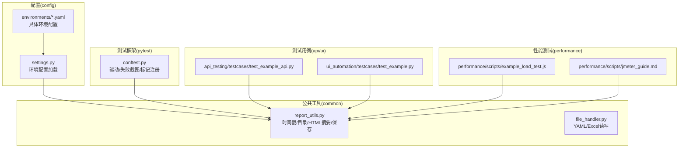
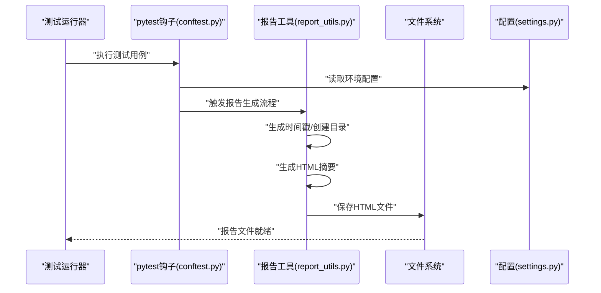
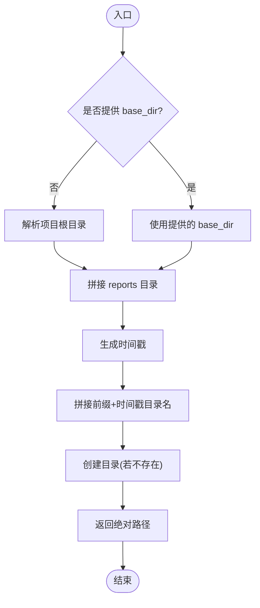
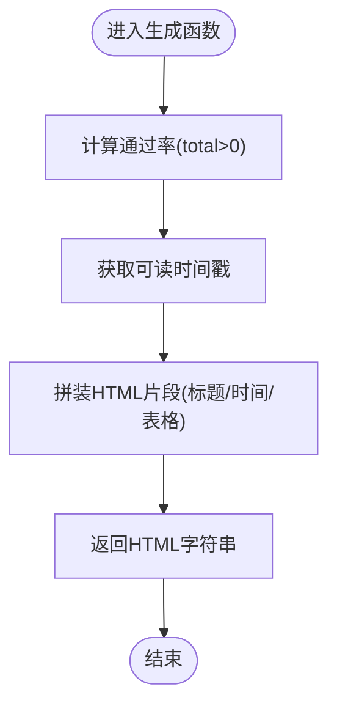
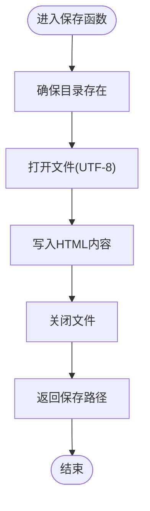
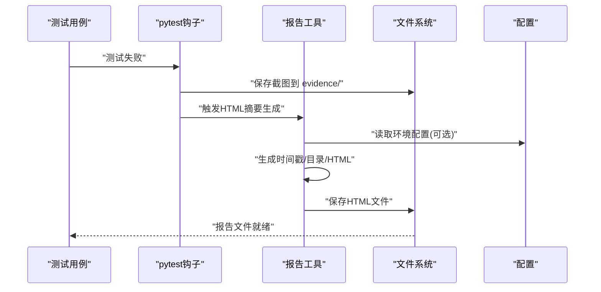
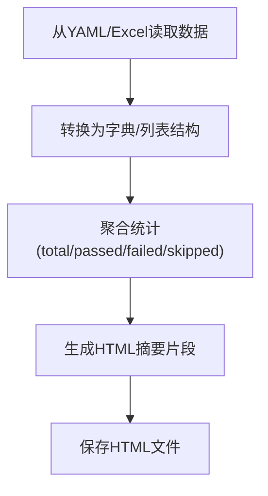
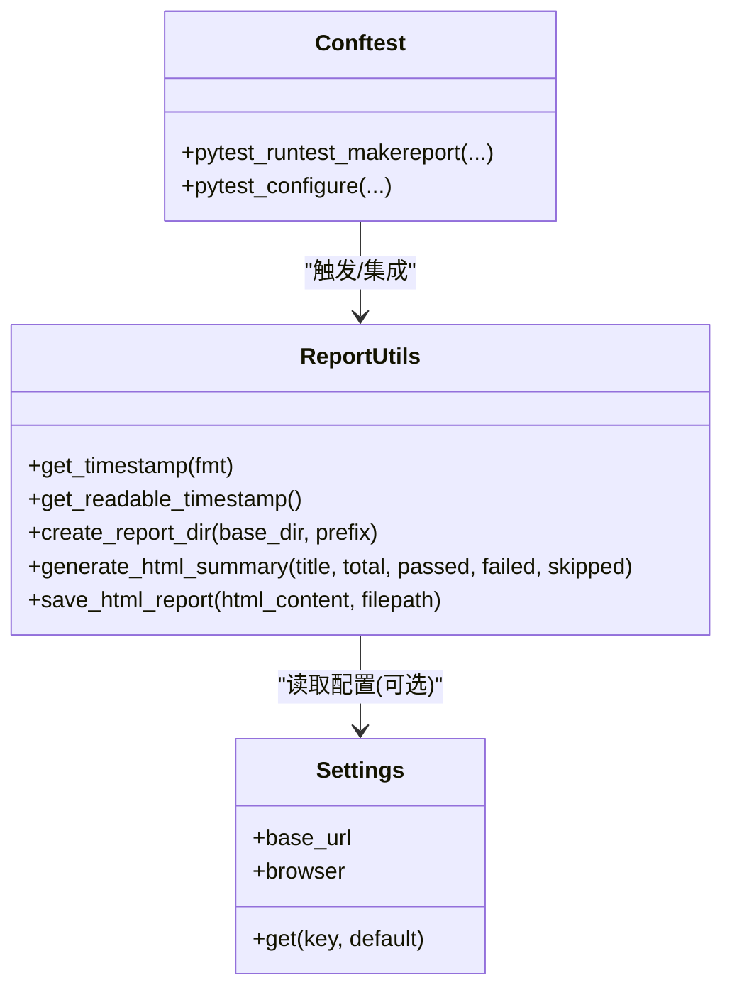
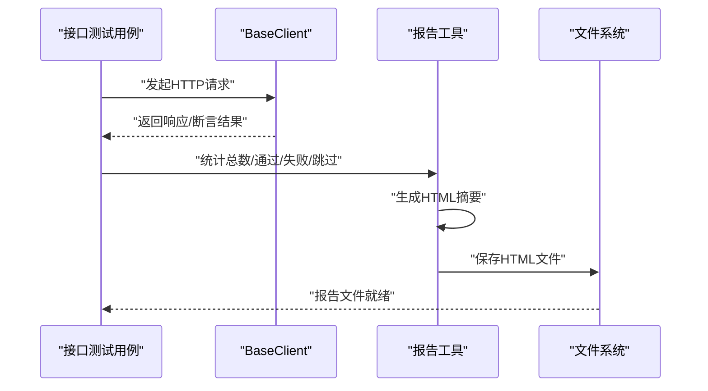
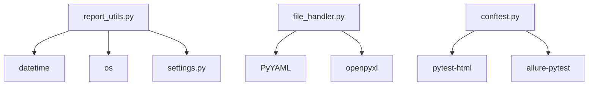

# 报告生成工具

<cite>
**本文引用的文件**
- [report_utils.py](file://common/report_utils.py)
- [file_handler.py](file://common/file_handler.py)
- [settings.py](file://config/settings.py)
- [conftest.py](file://conftest.py)
- [test_example_api.py](file://api_testing/testcases/test_example_api.py)
- [test_example.py](file://ui_automation/testcases/test_example.py)
- [test.yaml](file://config/environments/test.yaml)
- [requirements.txt](file://requirements.txt)
- [base_client.py](file://api_testing/api_client/base_client.py)
- [example_load_test.js](file://performance/scripts/example_load_test.js)
- [jmeter_guide.md](file://performance/scripts/jmeter_guide.md)
</cite>

## 目录
1. [引言](#引言)
2. [项目结构](#项目结构)
3. [核心组件](#核心组件)
4. [架构总览](#架构总览)
5. [详细组件分析](#详细组件分析)
6. [依赖分析](#依赖分析)
7. [性能考虑](#性能考虑)
8. [故障排查指南](#故障排查指南)
9. [结论](#结论)
10. [附录](#附录)

## 引言
本文件面向“报告生成工具”模块，系统化梳理 common/report_utils.py 提供的报告生成功能，包括时间戳生成、报告目录创建、HTML 报告摘要片段生成与保存。文档重点解释：
- 报告工具的架构设计与职责边界
- 支持的报告格式与输出选项配置
- 报告生成流程控制、数据聚合方法与格式转换逻辑
- 报告定制化扩展方法（模板、样式、内容过滤）
- 实际应用示例与最佳实践
- 报告优化与性能调优建议

## 项目结构
报告生成工具位于 common/report_utils.py，围绕时间戳、目录创建、HTML 摘要生成与保存四个核心能力展开。结合配置模块 config/settings.py 与 pytest 钩子 conftest.py，形成从环境配置到测试执行再到报告产出的闭环。

图表来源
- [report_utils.py:1-143](file://common/report_utils.py#L1-L143)
- [settings.py:13-104](file://config/settings.py#L13-L104)
- [conftest.py:127-148](file://conftest.py#L127-L148)
- [test_example_api.py:1-167](file://api_testing/testcases/test_example_api.py#L1-L167)
- [test_example.py:1-161](file://ui_automation/testcases/test_example.py#L1-L161)
- [example_load_test.js:1-33](file://performance/scripts/example_load_test.js#L1-L33)
- [jmeter_guide.md:69-98](file://performance/scripts/jmeter_guide.md#L69-L98)

章节来源
- [report_utils.py:1-143](file://common/report_utils.py#L1-L143)
- [settings.py:13-104](file://config/settings.py#L13-L104)
- [conftest.py:127-148](file://conftest.py#L127-L148)

## 核心组件
- 时间戳生成：提供固定格式与可读格式两种时间戳，用于报告命名与记录生成时间。
- 报告目录创建：根据项目根目录与前缀生成带时间戳的报告输出目录，确保目录存在。
- HTML 报告摘要：生成简洁的 HTML 摘要片段，包含用例总数、通过/失败/跳过数量与通过率。
- HTML 报告保存：将 HTML 内容写入文件，确保父目录存在。

章节来源
- [report_utils.py:13-29](file://common/report_utils.py#L13-L29)
- [report_utils.py:32-39](file://common/report_utils.py#L32-L39)
- [report_utils.py:42-65](file://common/report_utils.py#L42-L65)
- [report_utils.py:68-122](file://common/report_utils.py#L68-L122)
- [report_utils.py:125-142](file://common/report_utils.py#L125-L142)

## 架构总览
报告生成工具采用“轻量工具函数”设计，不引入外部复杂渲染引擎，专注于：
- 低耦合：仅依赖标准库 datetime 与 os
- 可组合：与配置模块、测试框架钩子、文件处理模块协同工作
- 可扩展：通过函数参数与外部配置实现灵活定制

图表来源
- [conftest.py:84-126](file://conftest.py#L84-L126)
- [report_utils.py:42-65](file://common/report_utils.py#L42-L65)
- [report_utils.py:68-122](file://common/report_utils.py#L68-L122)
- [report_utils.py:125-142](file://common/report_utils.py#L125-L142)
- [settings.py:37-48](file://config/settings.py#L37-L48)

## 详细组件分析

### 组件一：时间戳与目录管理
- get_timestamp(fmt)：生成指定格式的时间戳字符串，默认为紧凑型日期时间。
- get_readable_timestamp()：生成人类可读的时间戳字符串，用于报告正文中的生成时间。
- create_report_dir(base_dir, prefix)：在项目根目录下创建 reports 子目录，结合前缀与时间戳生成唯一报告目录，确保目录存在。

图表来源
- [report_utils.py:42-65](file://common/report_utils.py#L42-L65)

章节来源
- [report_utils.py:13-29](file://common/report_utils.py#L13-L29)
- [report_utils.py:32-39](file://common/report_utils.py#L32-L39)
- [report_utils.py:42-65](file://common/report_utils.py#L42-L65)

### 组件二：HTML 报告摘要生成
- generate_html_summary(title, total, passed, failed, skipped)：生成 HTML 摘要片段，包含标题、生成时间、统计指标与通过率。通过内联样式实现基础视觉区分（通过/失败/跳过）。

图表来源
- [report_utils.py:68-122](file://common/report_utils.py#L68-L122)

章节来源
- [report_utils.py:68-122](file://common/report_utils.py#L68-L122)

### 组件三：HTML 报告保存
- save_html_report(html_content, filepath)：确保父目录存在后，将 HTML 内容写入文件并返回实际保存路径。

图表来源
- [report_utils.py:125-142](file://common/report_utils.py#L125-L142)

章节来源
- [report_utils.py:125-142](file://common/report_utils.py#L125-L142)

### 组件四：与配置与测试框架的集成
- 配置集成：report_utils.py 通过 settings.py 读取环境配置（如 base_url、browser 等），在需要时可扩展为从配置读取报告输出根目录、样式模板路径等。
- 测试框架集成：conftest.py 在测试失败时自动截图并可附加到 Allure 报告；report_utils.py 可作为补充的 HTML 报告生成工具，与 pytest-html 或 Allure 协同使用。

图表来源
- [conftest.py:84-126](file://conftest.py#L84-L126)
- [report_utils.py:42-65](file://common/report_utils.py#L42-L65)
- [report_utils.py:68-122](file://common/report_utils.py#L68-L122)
- [report_utils.py:125-142](file://common/report_utils.py#L125-L142)
- [settings.py:37-48](file://config/settings.py#L37-L48)

章节来源
- [conftest.py:84-126](file://conftest.py#L84-L126)
- [settings.py:37-48](file://config/settings.py#L37-L48)

### 组件五：数据转换与聚合
- 报告摘要的数据聚合：generate_html_summary 聚合 total/passed/failed/skipped，计算 pass_rate，形成表格数据。
- 文件处理工具：file_handler.py 提供 YAML/Excel 读写能力，可用于从数据源读取测试结果并转换为 HTML 摘要所需的数据结构。

图表来源
- [file_handler.py:13-78](file://common/file_handler.py#L13-L78)
- [file_handler.py:80-217](file://common/file_handler.py#L80-L217)
- [report_utils.py:68-122](file://common/report_utils.py#L68-L122)
- [report_utils.py:125-142](file://common/report_utils.py#L125-L142)

章节来源
- [file_handler.py:13-78](file://common/file_handler.py#L13-L78)
- [file_handler.py:80-217](file://common/file_handler.py#L80-L217)
- [report_utils.py:68-122](file://common/report_utils.py#L68-L122)
- [report_utils.py:125-142](file://common/report_utils.py#L125-L142)

### 组件六：报告定制化扩展
- 自定义模板：当前为内联样式 HTML 片段，可通过扩展函数参数（如标题、样式类名、表格列）实现模板化。
- 样式配置：可在 generate_html_summary 中注入外部 CSS 路径或内联样式，或通过 save_html_report 保存为完整 HTML 页面（含 head/body）。
- 内容过滤：在生成摘要前，可对数据进行过滤（如排除跳过用例、按标签筛选），再传入 generate_html_summary。

图表来源
- [report_utils.py:13-142](file://common/report_utils.py#L13-L142)
- [settings.py:13-104](file://config/settings.py#L13-L104)
- [conftest.py:84-126](file://conftest.py#L84-L126)

章节来源
- [report_utils.py:13-142](file://common/report_utils.py#L13-L142)
- [settings.py:13-104](file://config/settings.py#L13-L104)
- [conftest.py:84-126](file://conftest.py#L84-L126)

### 组件七：实际应用示例
- 接口测试场景：在接口测试用例中，结合 API 客户端与 report_utils，统计用例总数、通过/失败/跳过数量，生成 HTML 摘要并保存到 reports 目录。
- UI 自动化场景：在 UI 测试失败时，结合 conftest 的截图钩子与 report_utils 的 HTML 摘要，快速生成失败用例的可视化报告。
- 性能测试场景：在性能测试（如 k6/JMeter）完成后，使用 report_utils 生成简要汇总报告，或与现有性能报告工具配合使用。

图表来源
- [test_example_api.py:1-167](file://api_testing/testcases/test_example_api.py#L1-L167)
- [base_client.py:18-308](file://api_testing/api_client/base_client.py#L18-L308)
- [report_utils.py:68-122](file://common/report_utils.py#L68-L122)
- [report_utils.py:125-142](file://common/report_utils.py#L125-L142)

章节来源
- [test_example_api.py:1-167](file://api_testing/testcases/test_example_api.py#L1-L167)
- [base_client.py:18-308](file://api_testing/api_client/base_client.py#L18-L308)
- [report_utils.py:68-122](file://common/report_utils.py#L68-L122)
- [report_utils.py:125-142](file://common/report_utils.py#L125-L142)

## 依赖分析
- 内部依赖：report_utils.py 仅依赖标准库 datetime 与 os，无第三方渲染依赖，具备良好的可移植性与运行时稳定性。
- 外部依赖：pytest-html、Allure 等报告插件与 report_utils 可并行使用；file_handler.py 提供 YAML/Excel 读写能力，便于从数据源生成报告。
- 配置依赖：settings.py 提供环境配置读取，report_utils 可通过其扩展读取报告输出根目录等配置。

图表来源
- [report_utils.py:9-10](file://common/report_utils.py#L9-L10)
- [settings.py:9-10](file://config/settings.py#L9-L10)
- [file_handler.py:5-7](file://common/file_handler.py#L5-L7)
- [requirements.txt:1-21](file://requirements.txt#L1-L21)
- [conftest.py:1-148](file://conftest.py#L1-L148)

章节来源
- [report_utils.py:9-10](file://common/report_utils.py#L9-L10)
- [settings.py:9-10](file://config/settings.py#L9-L10)
- [file_handler.py:5-7](file://common/file_handler.py#L5-L7)
- [requirements.txt:1-21](file://requirements.txt#L1-L21)
- [conftest.py:1-148](file://conftest.py#L1-L148)

## 性能考虑
- I/O 操作：save_html_report 与 create_report_dir 均涉及文件系统操作，建议批量生成报告时减少频繁的目录创建与文件写入。
- 字符编码：统一使用 UTF-8 编码写入 HTML 文件，避免跨平台字符问题。
- 报告体积：HTML 摘要为精简片段，适合快速浏览；如需详细报告，建议与 pytest-html 或 Allure 配合，或在 report_utils 基础上扩展为完整 HTML 页面。
- 并发与并行：pytest-xdist 支持并行执行测试，报告生成应避免竞态条件，确保目录与文件名唯一性（时间戳已内置）。

## 故障排查指南
- 报告目录创建失败：检查 base_dir 权限与路径是否存在，确保 create_report_dir 的父目录可写。
- HTML 保存异常：确认 filepath 所在目录存在或可创建，save_html_report 会自动创建父目录。
- 环境配置读取失败：检查 TEST_ENV 环境变量与 config/environments 下的 YAML 文件是否存在且格式正确。
- 失败截图与报告冲突：conftest 的截图钩子与 report_utils 的 HTML 摘要可并行使用，注意报告命名与目录结构避免覆盖。

章节来源
- [report_utils.py:42-65](file://common/report_utils.py#L42-L65)
- [report_utils.py:125-142](file://common/report_utils.py#L125-L142)
- [settings.py:37-48](file://config/settings.py#L37-L48)
- [conftest.py:84-126](file://conftest.py#L84-L126)

## 结论
report_utils.py 提供了简洁高效的报告生成能力，聚焦于时间戳、目录与 HTML 摘要的核心需求。通过与 settings.py、conftest.py、file_handler.py 的协作，可满足多种测试场景的报告产出需求。建议在现有基础上扩展为可配置的模板化报告生成器，并与 pytest-html、Allure 等工具协同，以获得更丰富的报告形态与更好的可维护性。

## 附录
- 环境配置示例：config/environments/test.yaml 展示了基础 URL、账号、数据库、API 与浏览器配置，可作为 report_utils 扩展读取的基础。
- 性能测试报告：performance/scripts/jmeter_guide.md 与 example_load_test.js 提供了性能测试报告的生成思路与输出规范，可与 report_utils 的摘要生成形成互补。

章节来源
- [test.yaml:1-31](file://config/environments/test.yaml#L1-L31)
- [jmeter_guide.md:69-98](file://performance/scripts/jmeter_guide.md#L69-L98)
- [example_load_test.js:1-33](file://performance/scripts/example_load_test.js#L1-L33)