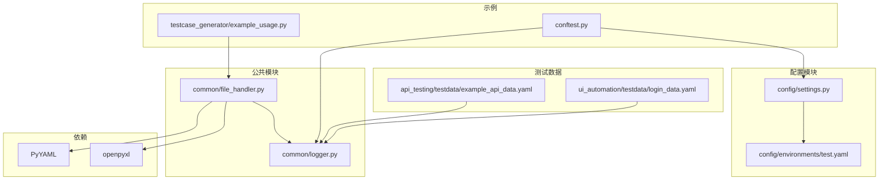
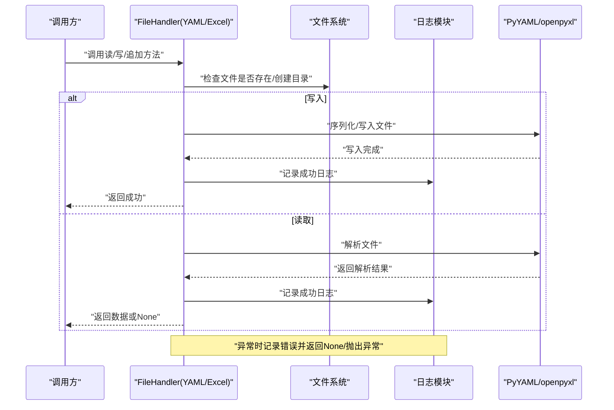
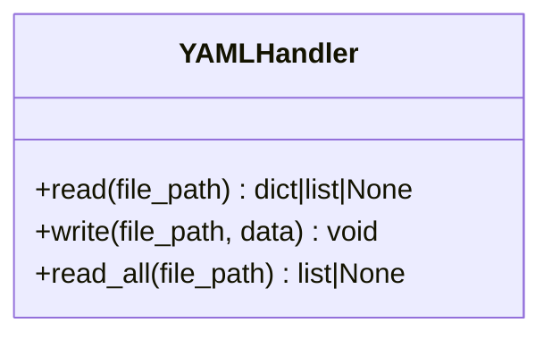
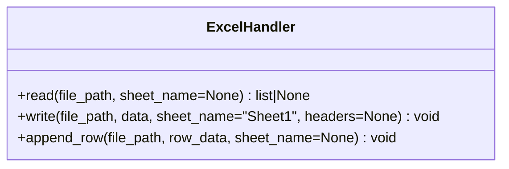
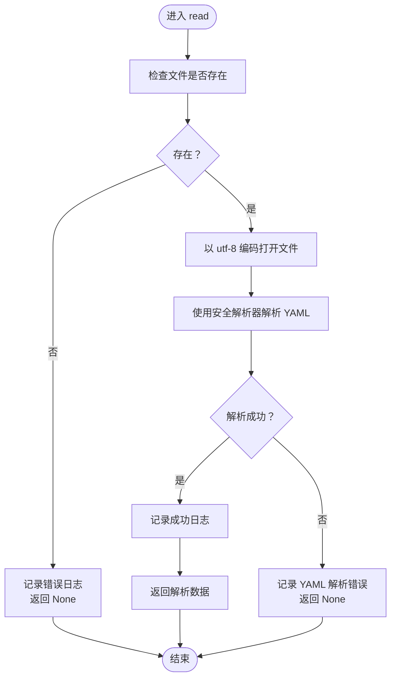
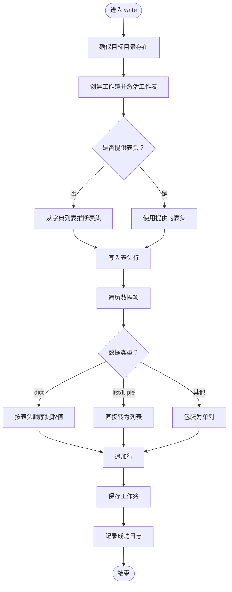
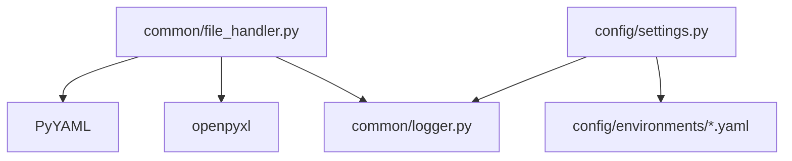

# 文件处理工具

<cite>
**本文引用的文件**
- [file_handler.py](file://common/file_handler.py)
- [logger.py](file://common/logger.py)
- [settings.py](file://config/settings.py)
- [requirements.txt](file://requirements.txt)
- [example_api_data.yaml](file://api_testing/testdata/example_api_data.yaml)
- [login_data.yaml](file://ui_automation/testdata/login_data.yaml)
- [test.yaml](file://config/environments/test.yaml)
- [example_usage.py](file://testcase_generator/example_usage.py)
- [conftest.py](file://conftest.py)
</cite>

## 目录
1. [简介](#简介)
2. [项目结构](#项目结构)
3. [核心组件](#核心组件)
4. [架构总览](#架构总览)
5. [详细组件分析](#详细组件分析)
6. [依赖分析](#依赖分析)
7. [性能考虑](#性能考虑)
8. [故障排查指南](#故障排查指南)
9. [结论](#结论)
10. [附录](#附录)

## 简介
本文件处理工具模块位于 common/file_handler.py，提供两类文件处理能力：
- YAML 文件处理：读取、写入、批量读取多文档 YAML
- Excel 文件处理：读取、写入、向已有 Excel 追加一行

该模块与日志模块 common/logger.py 协作，统一记录读写过程中的信息与错误；与配置模块 config/settings.py 协同，支持从多环境配置文件中读取数据；与项目依赖 requirements.txt 中的 PyYAML、openpyxl 等库配合，完成数据解析与写入。

## 项目结构
文件处理工具所在目录与相关模块的关系如下：
- common/file_handler.py：文件处理核心实现
- common/logger.py：统一日志配置与输出
- config/settings.py：多环境配置读取
- requirements.txt：PyYAML、openpyxl 等依赖声明
- api_testing/testdata/example_api_data.yaml：接口测试数据示例
- ui_automation/testdata/login_data.yaml：UI 测试数据示例
- config/environments/test.yaml：测试环境配置示例
- testcase_generator/example_usage.py：用例生成器导出 YAML/Excel 的示例
- conftest.py：pytest 配置，展示路径与数据文件的使用方式

图表来源
- [file_handler.py](file://common/file_handler.py)
- [logger.py](file://common/logger.py)
- [settings.py](file://config/settings.py)
- [requirements.txt](file://requirements.txt)
- [example_api_data.yaml](file://api_testing/testdata/example_api_data.yaml)
- [login_data.yaml](file://ui_automation/testdata/login_data.yaml)
- [test.yaml](file://config/environments/test.yaml)
- [example_usage.py](file://testcase_generator/example_usage.py)
- [conftest.py](file://conftest.py)

章节来源
- [file_handler.py](file://common/file_handler.py)
- [logger.py](file://common/logger.py)
- [settings.py](file://config/settings.py)
- [requirements.txt](file://requirements.txt)

## 核心组件
- YAMLHandler：提供 YAML 文件的读取、写入与多文档读取能力
  - read(file_path)：读取单文档 YAML，返回解析后的数据或 None
  - write(file_path, data)：写入 YAML 文件，自动创建目录
  - read_all(file_path)：读取多文档 YAML（由多个 --- 分隔），返回文档列表或 None
- ExcelHandler：提供 Excel 文件的读取、写入与追加能力
  - read(file_path, sheet_name=None)：读取 Excel，返回字典列表（首行为表头），失败返回 None
  - write(file_path, data, sheet_name="Sheet1", headers=None)：写入 Excel，自动创建目录
  - append_row(file_path, row_data, sheet_name=None)：向已有 Excel 追加一行，支持字典或列表

章节来源
- [file_handler.py](file://common/file_handler.py)

## 架构总览
文件处理工具的调用流程与依赖关系如下：
- YAMLHandler/ExcelHandler 在执行读写前，均会进行文件存在性检查与目录创建
- 写入操作会确保目标目录存在，避免因目录缺失导致写入失败
- 读取操作在解析失败时返回 None，并通过日志模块记录错误
- 写入操作在异常时记录错误并抛出异常，便于上层捕获与处理

图表来源
- [file_handler.py](file://common/file_handler.py)
- [logger.py](file://common/logger.py)

## 详细组件分析

### YAMLHandler 组件分析
YAMLHandler 提供三类操作：
- 单文档读取：读取 YAML 文件，返回解析后的数据结构；若文件不存在或解析失败，返回 None 并记录错误
- 单文档写入：将数据写入 YAML 文件，自动创建目标目录；异常时记录错误并抛出
- 多文档读取：读取包含多个 --- 分隔的文档，返回文档列表；异常时返回 None 并记录错误

图表来源
- [file_handler.py](file://common/file_handler.py)

章节来源
- [file_handler.py](file://common/file_handler.py)

### ExcelHandler 组件分析
ExcelHandler 提供三类操作：
- 读取：支持指定工作表名称或默认活动工作表；将首行作为表头，逐行转为字典列表；空文件返回空列表；异常返回 None 并记录错误
- 写入：自动创建目录；支持显式表头或从字典列表推断表头；支持字典/列表/元组三种数据形式；异常时记录错误并抛出
- 追加：向已有 Excel 文件追加一行；支持字典按表头顺序提取值；异常时记录错误并抛出

图表来源
- [file_handler.py](file://common/file_handler.py)

章节来源
- [file_handler.py](file://common/file_handler.py)

### 读取流程（以 YAMLHandler.read 为例）

图表来源
- [file_handler.py](file://common/file_handler.py)

章节来源
- [file_handler.py](file://common/file_handler.py)

### 写入流程（以 ExcelHandler.write 为例）

图表来源
- [file_handler.py](file://common/file_handler.py)

章节来源
- [file_handler.py](file://common/file_handler.py)

## 依赖分析
- 外部依赖
  - PyYAML：用于 YAML 文件的安全解析与序列化
  - openpyxl：用于 Excel 文件的读取与写入
- 内部依赖
  - common/logger.py：统一日志输出，包含控制台与文件轮转
  - config/settings.py：提供多环境配置读取，支持从 YAML 文件加载配置

图表来源
- [file_handler.py](file://common/file_handler.py)
- [logger.py](file://common/logger.py)
- [settings.py](file://config/settings.py)
- [requirements.txt](file://requirements.txt)

章节来源
- [requirements.txt](file://requirements.txt)
- [logger.py](file://common/logger.py)
- [settings.py](file://config/settings.py)

## 性能考虑
- 读取 Excel 时使用只读模式，降低内存占用
- 写入 Excel 时逐行追加，避免一次性构造大对象
- 写入前确保目录存在，减少异常重试成本
- YAML 写入使用允许 Unicode、禁用流式风格、保持键顺序，提升可读性与兼容性

## 故障排查指南
- YAML 文件不存在
  - 现象：read/read_all 返回 None
  - 处理：确认文件路径正确，检查权限
- YAML 解析失败
  - 现象：read/read_all 返回 None，日志记录解析错误
  - 处理：检查 YAML 语法，确保缩进与字符集正确
- Excel 文件不存在
  - 现象：read/append_row 抛出 FileNotFoundError 或返回 None
  - 处理：确认文件路径正确，检查文件是否被其他程序占用
- 工作表不存在
  - 现象：read 返回 None，日志记录工作表不存在
  - 处理：确认 sheet_name 是否正确，或使用默认活动工作表
- 写入异常
  - 现象：write/append_row 抛出异常
  - 处理：检查磁盘空间、权限与文件锁；查看日志定位具体错误

章节来源
- [file_handler.py](file://common/file_handler.py)
- [logger.py](file://common/logger.py)

## 结论
文件处理工具模块提供了稳定、易用的 YAML 与 Excel 文件读写能力，结合统一日志与多环境配置，能够满足测试项目中数据管理与文件操作的需求。通过合理的异常处理与资源管理策略，能够在不同环境下可靠地执行文件操作。

## 附录

### 使用示例与最佳实践
- 读取接口测试数据（YAML）
  - 示例路径：api_testing/testdata/example_api_data.yaml
  - 最佳实践：使用 YAMLHandler.read 读取测试数据，失败时记录错误并回退到本地数据
- 写入用例数据（Excel/YAML）
  - 示例路径：testcase_generator/example_usage.py
  - 最佳实践：写入前确保输出目录存在；写入完成后记录成功日志
- 追加测试结果（Excel）
  - 使用 ExcelHandler.append_row，支持字典按表头顺序提取值
- 跨平台路径处理
  - 建议使用 os.path.join 构建路径，避免硬编码分隔符
- 异常处理与资源管理
  - 读取/写入异常时记录错误并抛出，便于上层统一处理
  - 写入前自动创建目录，避免因目录缺失导致失败

章节来源
- [example_api_data.yaml](file://api_testing/testdata/example_api_data.yaml)
- [login_data.yaml](file://ui_automation/testdata/login_data.yaml)
- [test.yaml](file://config/environments/test.yaml)
- [example_usage.py](file://testcase_generator/example_usage.py)
- [conftest.py](file://conftest.py)