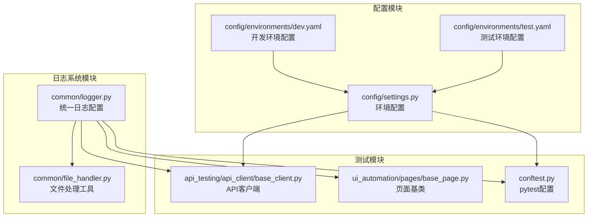
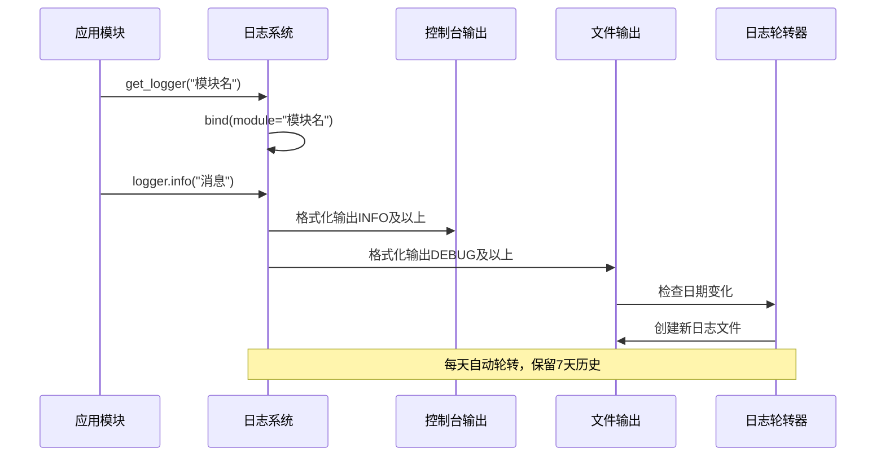
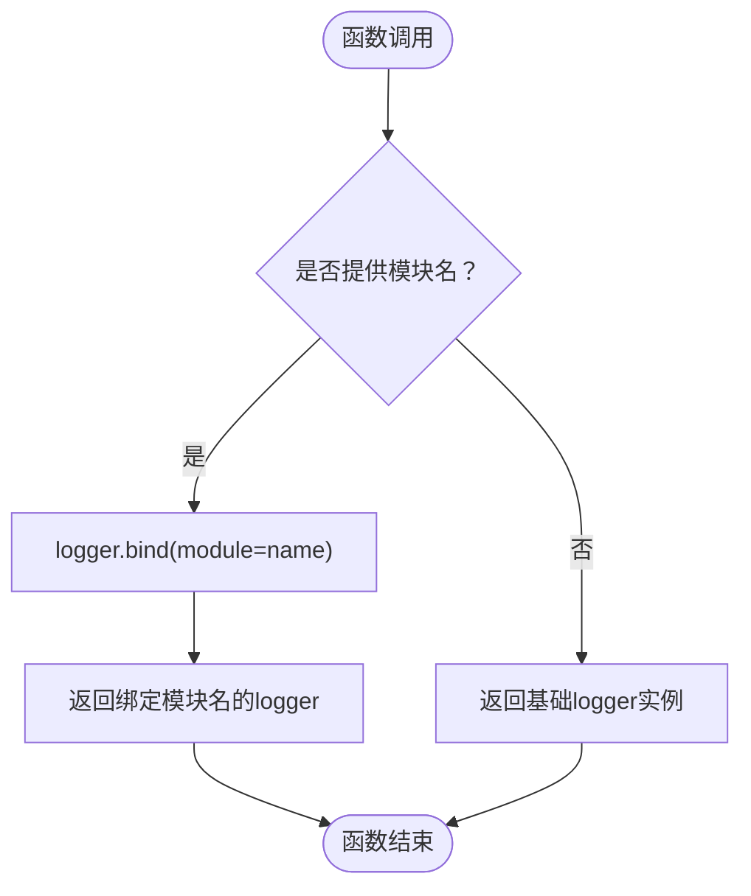
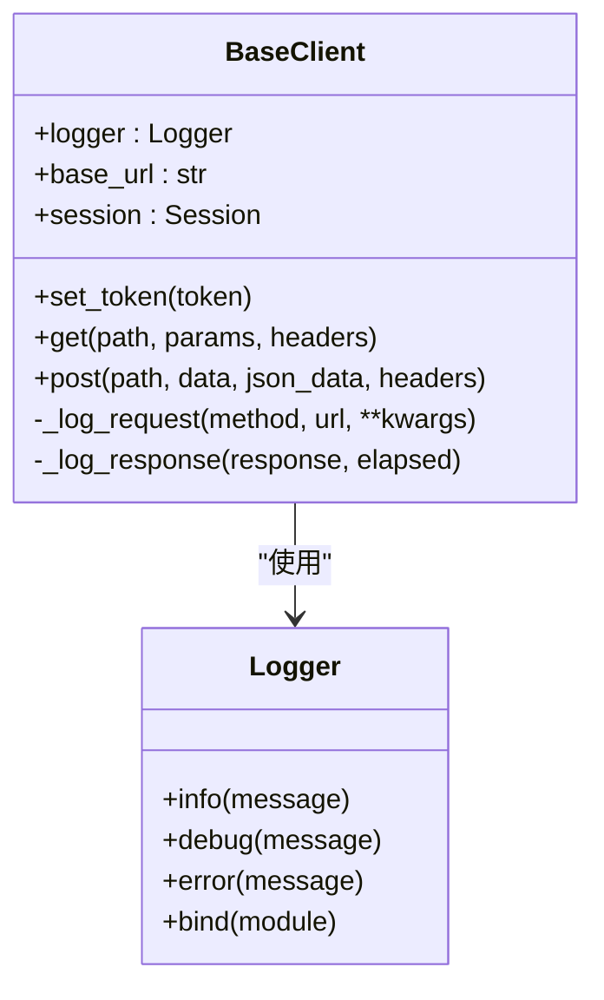
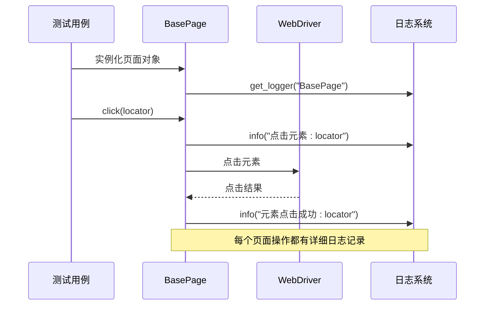
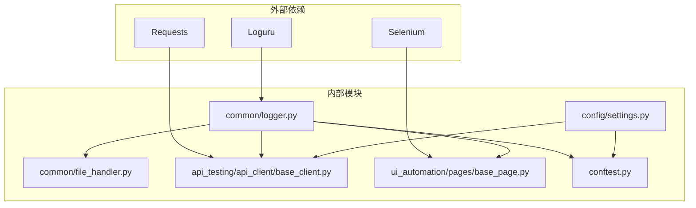

# 日志系统

<cite>
**本文档引用的文件**
- [common/logger.py](file://common/logger.py)
- [common/file_handler.py](file://common/file_handler.py)
- [api_testing/api_client/base_client.py](file://api_testing/api_client/base_client.py)
- [ui_automation/pages/base_page.py](file://ui_automation/pages/base_page.py)
- [conftest.py](file://conftest.py)
- [config/settings.py](file://config/settings.py)
- [config/environments/dev.yaml](file://config/environments/dev.yaml)
- [config/environments/test.yaml](file://config/environments/test.yaml)
</cite>

## 目录
1. [简介](#简介)
2. [项目结构](#项目结构)
3. [核心组件](#核心组件)
4. [架构概览](#架构概览)
5. [详细组件分析](#详细组件分析)
6. [依赖关系分析](#依赖关系分析)
7. [性能考虑](#性能考虑)
8. [故障排除指南](#故障排除指南)
9. [结论](#结论)

## 简介

本项目采用 Loguru 日志框架构建统一的日志管理系统，实现了控制台输出和文件输出的双重配置机制。该系统提供了灵活的日志级别管理、模块标识绑定、时间戳格式化和日志轮转策略，能够满足接口测试、UI自动化测试等多种场景的记录需求。

Loguru 是一个现代化的 Python 日志库，相比标准库 logging 具有更简洁的 API、更好的性能和更丰富的功能特性。本系统通过统一的配置模块，为整个项目提供了一致的日志体验。

## 项目结构

日志系统在项目中的组织结构如下：



**图表来源**
- [common/logger.py:1-77](file://common/logger.py#L1-L77)
- [api_testing/api_client/base_client.py:1-308](file://api_testing/api_client/base_client.py#L1-L308)
- [ui_automation/pages/base_page.py:1-499](file://ui_automation/pages/base_page.py#L1-L499)
- [conftest.py:1-122](file://conftest.py#L1-L122)

**章节来源**
- [common/logger.py:1-77](file://common/logger.py#L1-L77)
- [config/settings.py:1-104](file://config/settings.py#L1-L104)

## 核心组件

### 统一日志配置模块

`common/logger.py` 是整个日志系统的核心，负责：

- **双重输出配置**：同时配置控制台和文件输出
- **格式化规则**：定义了彩色控制台输出和纯文本文件输出的格式
- **模块绑定机制**：通过 `get_logger()` 函数实现模块级别的日志标识
- **日志级别管理**：控制台输出 INFO 级别及以上，文件输出 DEBUG 级别及以上

### 日志格式化规则

系统实现了两套不同的日志格式：

**控制台输出格式（彩色）**：
- 时间戳：绿色显示，格式为 `YYYY-MM-DD HH:mm:ss.SSS`
- 日志级别：左对齐，宽度为8字符
- 模块标识：青色显示，来自 `extra[module]`
- 日志消息：根据级别着色显示

**文件输出格式（纯文本）**：
- 时间戳：`YYYY-MM-DD HH:mm:ss.SSS`
- 日志级别：左对齐，宽度为8字符
- 模块标识：来自 `extra[module]`
- 日志消息：纯文本格式

### 日志轮转策略

系统采用按天轮转的策略，具体配置：
- **轮转频率**：每天生成新的日志文件
- **文件命名**：`{time:YYYY-MM-DD}.log`
- **保留周期**：7天
- **编码设置**：UTF-8

**章节来源**
- [common/logger.py:14-56](file://common/logger.py#L14-L56)

## 架构概览



**图表来源**
- [common/logger.py:59-77](file://common/logger.py#L59-L77)
- [common/logger.py:48-56](file://common/logger.py#L48-L56)

## 详细组件分析

### get_logger() 函数详解

`get_logger()` 函数是日志系统的入口点，提供了灵活的模块绑定机制：



**图表来源**
- [common/logger.py:59-77](file://common/logger.py#L59-L77)

#### 使用方法

1. **基础使用**：
   ```python
   from common.logger import get_logger
   logger = get_logger()
   ```

2. **模块绑定**：
   ```python
   from common.logger import get_logger
   logger = get_logger("APIClient")
   ```

3. **在类中使用**：
   ```python
   class APIClient:
       def __init__(self):
           self.logger = get_logger("APIClient")
   ```

#### 模块绑定机制

通过 `logger.bind(module="模块名")` 实现：
- 每个模块拥有独立的日志标识
- 在日志输出中自动包含模块名
- 支持动态修改模块名
- 防止未绑定时的错误

**章节来源**
- [common/logger.py:59-77](file://common/logger.py#L59-L77)

### API客户端日志集成

`api_testing/api_client/base_client.py` 展示了日志系统的实际应用：



**图表来源**
- [api_testing/api_client/base_client.py:18-308](file://api_testing/api_client/base_client.py#L18-L308)
- [common/logger.py:59-77](file://common/logger.py#L59-L77)

#### 请求日志记录

API客户端实现了完整的请求-响应日志记录：

1. **请求日志**：
   - HTTP方法和URL
   - 查询参数
   - 请求体（JSON/表单）
   - 请求头信息

2. **响应日志**：
   - 状态码和耗时
   - 响应体（JSON格式化）
   - 文本响应体（截断）

3. **异常日志**：
   - 超时异常
   - 连接错误
   - 其他请求异常

**章节来源**
- [api_testing/api_client/base_client.py:60-134](file://api_testing/api_client/base_client.py#L60-L134)

### UI自动化页面日志集成

`ui_automation/pages/base_page.py` 展示了UI测试场景的日志使用：



**图表来源**
- [ui_automation/pages/base_page.py:93-115](file://ui_automation/pages/base_page.py#L93-L115)

#### 页面操作日志

页面基类记录了所有关键操作：
- 元素查找和定位
- 点击、输入、获取文本等操作
- 等待操作（可见性、可点击性）
- URL变化监控
- 截图和错误处理

**章节来源**
- [ui_automation/pages/base_page.py:44-499](file://ui_automation/pages/base_page.py#L44-L499)

### pytest集成

`conftest.py` 展示了日志系统在测试框架中的集成：

```mermaid
flowchart TD
Pytest[pytest运行] --> Fixture[WebDriver Fixture]
Fixture --> Logger[get_logger("conftest")]
Logger --> Config[配置日志系统]
Config --> Info[记录浏览器启动信息]
Config --> Debug[记录测试执行过程]
Pytest --> Hook[失败截图Hook]
Hook --> Error[记录截图保存错误]
```

**图表来源**
- [conftest.py:22-122](file://conftest.py#L22-L122)

#### 测试钩子日志

系统集成了多个测试钩子：
- **浏览器生命周期管理**：启动和关闭时的日志记录
- **失败自动截图**：测试失败时自动保存截图并记录错误
- **自定义标记注册**：避免pytest警告

**章节来源**
- [conftest.py:80-122](file://conftest.py#L80-L122)

## 依赖关系分析



**图表来源**
- [common/logger.py:12](file://common/logger.py#L12)
- [api_testing/api_client/base_client.py:5](file://api_testing/api_client/base_client.py#L5)
- [ui_automation/pages/base_page.py:6](file://ui_automation/pages/base_page.py#L6)

### 关键依赖关系

1. **Loguru核心依赖**：所有日志功能的基础
2. **模块间依赖**：
   - `common/logger.py` 被所有模块依赖
   - `api_testing/api_client/base_client.py` 依赖 `requests`
   - `ui_automation/pages/base_page.py` 依赖 `selenium`
   - `config/settings.py` 提供配置支持

3. **循环依赖避免**：
   - 通过模块导入避免循环引用
   - 使用延迟导入减少耦合

**章节来源**
- [common/logger.py:9-12](file://common/logger.py#L9-L12)
- [api_testing/api_client/base_client.py:5](file://api_testing/api_client/base_client.py#L5)

## 性能考虑

### 日志级别优化

系统采用了分层的日志级别策略：

- **控制台输出**：INFO及以上级别
  - 减少控制台输出量，提高交互效率
  - 适合开发调试和生产监控

- **文件输出**：DEBUG及以上级别  
  - 详细记录所有操作，便于问题排查
  - 仅在需要时启用，避免性能影响

### 日志轮转性能

1. **按天轮转**：减少文件大小，提高读取效率
2. **7天保留**：平衡存储空间和历史记录需求
3. **异步写入**：Loguru的异步特性确保高并发场景下的性能

### 内存管理

- **模块绑定**：通过 `extra` 字段避免重复创建
- **文件句柄管理**：Loguru自动管理文件句柄
- **内存泄漏防护**：定期轮转避免内存累积

## 故障排除指南

### 常见问题及解决方案

#### 1. 日志未显示在控制台

**症状**：只看到文件日志，控制台没有输出

**原因**：
- 控制台级别设置过高
- 日志处理器配置错误

**解决方案**：
```python
# 检查控制台处理器配置
logger.remove(handler_id=None)  # 移除所有处理器
logger.add(sys.stdout, level="INFO")  # 重新添加控制台处理器
```

#### 2. 模块标识缺失

**症状**：日志中看不到模块名

**原因**：
- 未正确绑定模块名
- `extra[module]` 字段未设置

**解决方案**：
```python
# 确保正确使用 get_logger
logger = get_logger("MyModule")
# 或者手动绑定
logger = logger.bind(module="MyModule")
```

#### 3. 文件权限问题

**症状**：日志文件无法创建或写入

**原因**：
- 日志目录权限不足
- 磁盘空间不足

**解决方案**：
```python
import os
log_dir = os.path.join(os.path.dirname(os.path.dirname(__file__)), "logs")
os.makedirs(log_dir, exist_ok=True)  # 确保目录存在
```

#### 4. 日志轮转异常

**症状**：日志文件未按预期轮转

**原因**：
- 系统时间设置错误
- 文件被其他进程占用

**解决方案**：
```python
# 检查轮转配置
logger.add(
    os.path.join(LOG_DIR, "{time:YYYY-MM-DD}.log"),
    rotation="1 day",
    retention="7 days"
)
```

**章节来源**
- [common/logger.py:30-38](file://common/logger.py#L30-L38)

### 调试技巧

1. **临时提高日志级别**：
   ```python
   # 在测试中临时启用详细日志
   logger.remove()
   logger.add(sys.stdout, level="DEBUG")
   ```

2. **检查日志配置**：
   ```python
   # 查看当前日志配置
   print(logger._core.handlers)
   ```

3. **验证模块绑定**：
   ```python
   # 检查模块标识
   logger.info("测试日志")
   ```

## 结论

本日志系统通过 Loguru 框架实现了现代化、高性能的日志管理方案。系统的主要优势包括：

1. **统一配置**：通过单一模块管理所有日志配置
2. **灵活绑定**：支持模块级别的日志标识
3. **双重输出**：同时满足开发调试和生产监控需求
4. **智能轮转**：自动按天轮转，7天历史保留
5. **易于扩展**：清晰的架构便于功能扩展

该系统为项目的接口测试、UI自动化测试提供了完善的日志支持，能够有效提升问题诊断效率和系统可观测性。通过合理的配置和使用，可以满足不同场景下的日志记录需求。