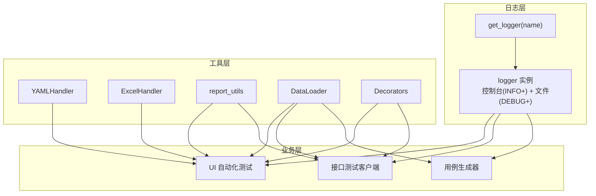
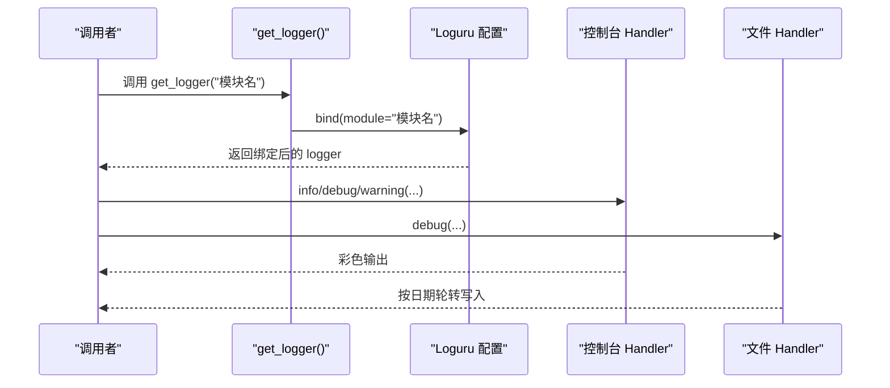
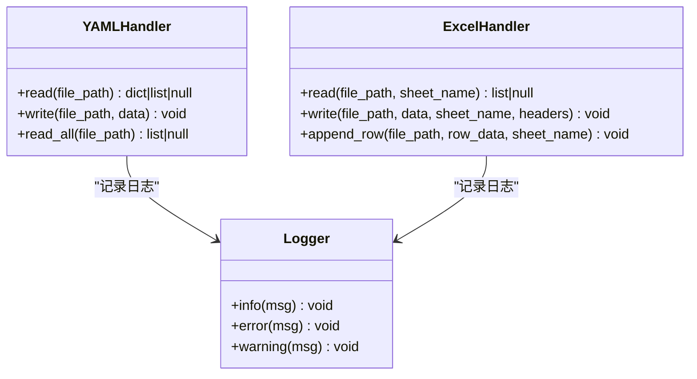
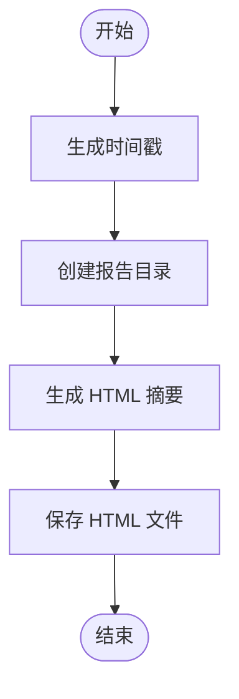
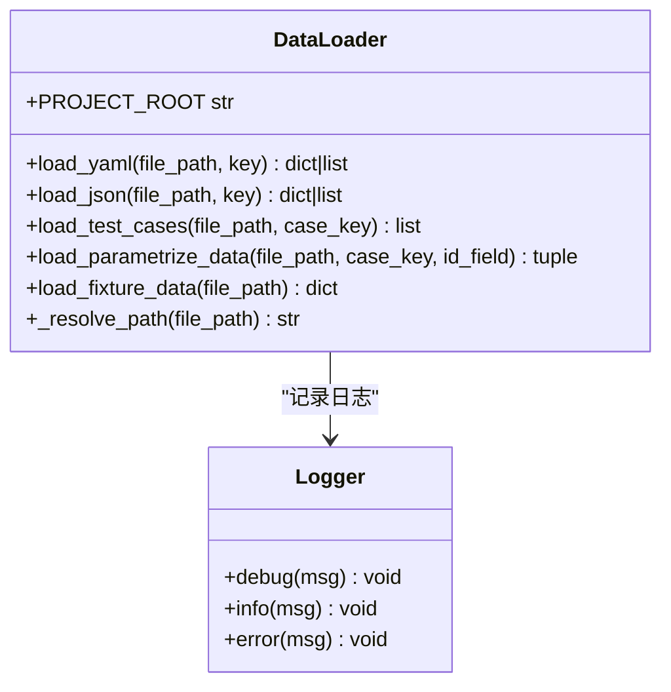
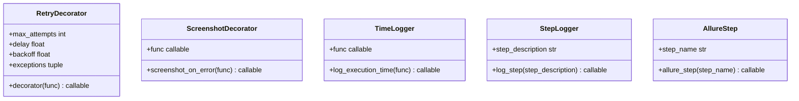
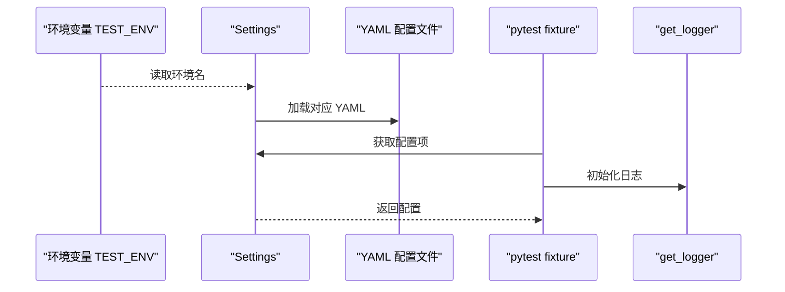
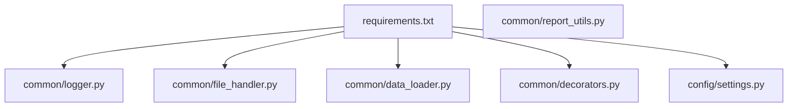

# 通用工具模块

<cite>
**本文引用的文件**
- [common/logger.py](file://common/logger.py)
- [common/file_handler.py](file://common/file_handler.py)
- [common/report_utils.py](file://common/report_utils.py)
- [common/data_loader.py](file://common/data_loader.py)
- [common/decorators.py](file://common/decorators.py)
- [config/settings.py](file://config/settings.py)
- [config/environments/dev.yaml](file://config/environments/dev.yaml)
- [config/environments/test.yaml](file://config/environments/test.yaml)
- [config/environments/prod.yaml](file://config/environments/prod.yaml)
- [requirements.txt](file://requirements.txt)
- [conftest.py](file://conftest.py)
- [api_testing/api_client/base_client.py](file://api_testing/api_client/base_client.py)
- [ui_automation/testcases/test_example.py](file://ui_automation/testcases/test_example.py)
- [testcase_generator/example_usage.py](file://testcase_generator/example_usage.py)
- [api_testing/testdata/example_api_data.yaml](file://api_testing/testdata/example_api_data.yaml)
- [ui_automation/testdata/login_data.yaml](file://ui_automation/testdata/login_data.yaml)
- [testcase_generator/output/login_testcases.yaml](file://testcase_generator/output/login_testcases.yaml)
</cite>

## 目录
1. [引言](#引言)
2. [项目结构](#项目结构)
3. [核心组件](#核心组件)
4. [架构总览](#架构总览)
5. [详细组件分析](#详细组件分析)
6. [依赖分析](#依赖分析)
7. [性能考虑](#性能考虑)
8. [故障排查指南](#故障排查指南)
9. [结论](#结论)
10. [附录](#附录)

## 引言
本文件面向通用工具模块，聚焦以下目标：
- 深入解释日志系统的设计架构、Loguru 集成与日志配置管理
- 详细分析 file_handler.py 的文件操作功能、路径管理与服务工具
- 文档化 report_utils.py 的报告生成工具、格式转换与输出管理
- 新增：DataLoader数据加载器的统一数据访问、参数化支持与便捷函数
- 新增：Decorators装饰器系统的重试、截图、计时、步骤日志与Allure兼容功能
- 提供各工具类的使用示例、配置选项与扩展方法
- 给出工具模块的集成指南、最佳实践与性能优化建议

## 项目结构
通用工具模块位于 common/ 目录，现已扩展为包含五个核心文件：
- 日志模块：common/logger.py
- 文件处理模块：common/file_handler.py
- 报告工具模块：common/report_utils.py
- 数据加载模块：common/data_loader.py
- 装饰器模块：common/decorators.py

此外，配置模块 config/ 提供多环境配置管理，requirements.txt 定义依赖，conftest.py 在 pytest 中统一注入日志与配置。

```mermaid
graph TB
subgraph "通用工具模块"
L["common/logger.py"]
F["common/file_handler.py"]
R["common/report_utils.py"]
DL["common/data_loader.py"]
DC["common/decorators.py"]
end
subgraph "配置模块"
S["config/settings.py"]
D["config/environments/dev.yaml"]
T["config/environments/test.yaml"]
P["config/environments/prod.yaml"]
end
subgraph "测试与集成"
C["conftest.py"]
BC["api_testing/api_client/base_client.py"]
UE["ui_automation/testcases/test_example.py"]
TU["testcase_generator/example_usage.py"]
AD["api_testing/testdata/example_api_data.yaml"]
UD["ui_automation/testdata/login_data.yaml"]
TD["testcase_generator/output/login_testcases.yaml"]
end
L --> BC
L --> UE
L --> C
S --> BC
S --> C
S --> UE
F --> UE
R --> UE
R --> BC
TU --> F
DL --> AD
DL --> UD
DL --> TD
DC --> UE
DC --> BC
```

**图表来源**
- [common/logger.py:1-77](file://common/logger.py#L1-L77)
- [common/file_handler.py:1-217](file://common/file_handler.py#L1-L217)
- [common/report_utils.py:1-143](file://common/report_utils.py#L1-L143)
- [common/data_loader.py:1-115](file://common/data_loader.py#L1-L115)
- [common/decorators.py:1-124](file://common/decorators.py#L1-L124)
- [config/settings.py:1-104](file://config/settings.py#L1-L104)
- [config/environments/dev.yaml:1-31](file://config/environments/dev.yaml#L1-L31)
- [config/environments/test.yaml:1-31](file://config/environments/test.yaml#L1-L31)
- [config/environments/prod.yaml:1-31](file://config/environments/prod.yaml#L1-L31)
- [conftest.py:1-122](file://conftest.py#L1-L122)
- [api_testing/api_client/base_client.py:1-308](file://api_testing/api_client/base_client.py#L1-L308)
- [ui_automation/testcases/test_example.py:1-161](file://ui_automation/testcases/test_example.py#L1-L161)
- [testcase_generator/example_usage.py:1-84](file://testcase_generator/example_usage.py#L1-L84)

**章节来源**
- [common/logger.py:1-77](file://common/logger.py#L1-L77)
- [common/file_handler.py:1-217](file://common/file_handler.py#L1-L217)
- [common/report_utils.py:1-143](file://common/report_utils.py#L1-L143)
- [common/data_loader.py:1-115](file://common/data_loader.py#L1-L115)
- [common/decorators.py:1-124](file://common/decorators.py#L1-L124)
- [config/settings.py:1-104](file://config/settings.py#L1-L104)
- [requirements.txt:1-25](file://requirements.txt#L1-L25)

## 核心组件
- 日志系统：基于 Loguru 的统一日志配置，提供控制台与文件双通道输出，支持模块级绑定与自动轮转
- 文件处理：YAML 与 Excel 的读写与追加能力，内置路径创建与错误日志
- 报告工具：时间戳生成、报告目录创建、HTML 摘要片段生成与保存
- 数据加载器：统一的YAML/JSON/Excel数据加载，支持pytest参数化与便捷函数
- 装饰器系统：重试、截图、执行时间记录、测试步骤日志与Allure兼容装饰器

**章节来源**
- [common/logger.py:1-77](file://common/logger.py#L1-L77)
- [common/file_handler.py:13-217](file://common/file_handler.py#L13-L217)
- [common/report_utils.py:1-143](file://common/report_utils.py#L1-L143)
- [common/data_loader.py:14-115](file://common/data_loader.py#L14-L115)
- [common/decorators.py:16-124](file://common/decorators.py#L16-L124)

## 架构总览
通用工具模块通过 get_logger() 为各业务模块提供一致的日志入口；file_handler.py、report_utils.py、data_loader.py、decorators.py 作为纯工具函数/类，被上层模块（如 UI 自动化、接口测试、用例生成）复用。新增的数据加载器专门处理测试数据的统一访问，装饰器系统为所有测试操作提供横切关注点。

**图表来源**
- [common/logger.py:59-77](file://common/logger.py#L59-L77)
- [common/file_handler.py:13-217](file://common/file_handler.py#L13-L217)
- [common/report_utils.py:1-143](file://common/report_utils.py#L1-L143)
- [common/data_loader.py:14-115](file://common/data_loader.py#L14-L115)
- [common/decorators.py:16-124](file://common/decorators.py#L16-L124)
- [api_testing/api_client/base_client.py:15-15](file://api_testing/api_client/base_client.py#L15-L15)
- [ui_automation/testcases/test_example.py:16-18](file://ui_automation/testcases/test_example.py#L16-L18)
- [testcase_generator/example_usage.py:11-11](file://testcase_generator/example_usage.py#L11-L11)

## 详细组件分析

### 日志系统设计与 Loguru 集成
- 统一格式与级别
  - 控制台输出：INFO 及以上级别，彩色输出，包含时间、级别、模块名与消息
  - 文件输出：DEBUG 及以上级别，按天轮转，保留 7 天，UTF-8 编码
- 模块绑定
  - get_logger(name) 返回绑定模块名的 logger 实例，便于区分来源
- 目录与初始化
  - 日志目录位于项目根/logs，首次使用自动创建
  - 移除默认 handler，避免重复输出

**图表来源**
- [common/logger.py:59-77](file://common/logger.py#L59-L77)
- [common/logger.py:40-56](file://common/logger.py#L40-L56)

**章节来源**
- [common/logger.py:1-77](file://common/logger.py#L1-L77)

### 文件处理工具（YAML 与 Excel）
- YAMLHandler
  - 读取单文档 YAML：安全解析，异常记录日志，返回 None 并记录错误
  - 写入 YAML：自动创建目录，支持 Unicode、排序键与流式风格
  - 读取多文档 YAML：逐文档解析，返回文档列表
- ExcelHandler
  - 读取：支持指定工作表或活动表，首行作为表头，返回字典列表；空文件返回空列表
  - 写入：自动创建目录，支持字典/列表/元组数据，自动推断表头
  - 追加：向现有文件追加一行，支持字典按表头顺序映射

**图表来源**
- [common/file_handler.py:13-217](file://common/file_handler.py#L13-L217)
- [common/logger.py:10-10](file://common/logger.py#L10-L10)

**章节来源**
- [common/file_handler.py:13-217](file://common/file_handler.py#L13-L217)

### 报告生成工具
- 时间戳生成：支持自定义格式，默认紧凑型时间戳与可读格式
- 报告目录创建：默认在项目根 reports/ 下创建带时间戳的子目录
- HTML 摘要：生成简洁的 HTML 摘要片段，包含通过/失败/跳过计数与通过率
- HTML 保存：确保目录存在后写入 UTF-8 文件

**图表来源**
- [common/report_utils.py:13-143](file://common/report_utils.py#L13-L143)

**章节来源**
- [common/report_utils.py:1-143](file://common/report_utils.py#L1-L143)

### 数据加载器（DataLoader）
- 统一数据访问：支持 YAML、JSON、Excel 格式的测试数据加载
- 项目根目录解析：自动解析相对路径到项目根目录
- 测试用例参数化：专为 pytest.mark.parametrize 设计的数据格式
- 便捷函数：提供直接可用的函数式接口

**图表来源**
- [common/data_loader.py:14-115](file://common/data_loader.py#L14-L115)
- [common/logger.py:11-11](file://common/logger.py#L11-L11)

**章节来源**
- [common/data_loader.py:14-115](file://common/data_loader.py#L14-L115)

### 装饰器系统
- 重试装饰器：指数退避重试，支持自定义最大次数、初始延迟和异常类型
- 异常截图装饰器：自动捕获异常并尝试截图，适用于 Page Object 模式
- 执行时间记录：精确测量方法执行时间，记录开始和结束日志
- 测试步骤日志：标记测试步骤的开始和结束，便于调试和审计
- Allure兼容：优雅降级到普通日志，确保在无 Allure 环境下正常运行

**图表来源**
- [common/decorators.py:16-124](file://common/decorators.py#L16-L124)

**章节来源**
- [common/decorators.py:16-124](file://common/decorators.py#L16-L124)

### 配置管理与环境切换
- Settings 类
  - 通过环境变量 TEST_ENV 选择 dev/test/prod
  - 读取 config/environments/*.yaml，提供属性与 get() 访问
- conftest.py 注入
  - 在 pytest 中注入 settings 与 get_logger，统一浏览器配置与日志

**图表来源**
- [config/settings.py:26-48](file://config/settings.py#L26-L48)
- [config/environments/dev.yaml:1-31](file://config/environments/dev.yaml#L1-L31)
- [config/environments/test.yaml:1-31](file://config/environments/test.yaml#L1-L31)
- [config/environments/prod.yaml:1-31](file://config/environments/prod.yaml#L1-L31)
- [conftest.py:19-22](file://conftest.py#L19-L22)

**章节来源**
- [config/settings.py:1-104](file://config/settings.py#L1-L104)
- [conftest.py:19-22](file://conftest.py#L19-L22)

## 依赖分析
- 日志依赖：loguru
- 文件处理依赖：PyYAML、openpyxl
- 报告工具：标准库 datetime、os
- 数据加载器：PyYAML、json
- 装饰器系统：标准库 functools、time、os、sys
- 配置依赖：PyYAML
- 测试框架：pytest

**图表来源**
- [requirements.txt:1-25](file://requirements.txt#L1-L25)
- [common/logger.py:12-12](file://common/logger.py#L12-L12)
- [common/file_handler.py:5-8](file://common/file_handler.py#L5-L8)
- [common/report_utils.py:9-10](file://common/report_utils.py#L9-L10)
- [common/data_loader.py:6-9](file://common/data_loader.py#L6-L9)
- [common/decorators.py:5-11](file://common/decorators.py#L5-L11)
- [config/settings.py:9-11](file://config/settings.py#L9-L11)

**章节来源**
- [requirements.txt:1-25](file://requirements.txt#L1-L25)

## 性能考虑
- 日志
  - 控制台 INFO 级别减少冗余输出；文件 DEBUG 级别按需开启
  - 按天轮转与保留策略平衡磁盘占用
- 文件处理
  - Excel 读取使用只读模式与迭代行，降低内存占用
  - 写入前确保目录存在，避免多次异常重试
- 报告生成
  - HTML 生成为纯文本拼接，适合小到中等规模报告；大规模报告建议分片或外部模板引擎
- 数据加载器
  - YAML/JSON 解析使用安全加载器，避免代码执行风险
  - 支持相对路径解析，减少硬编码配置
- 装饰器系统
  - 重试装饰器采用指数退避，避免频繁重试造成系统压力
  - 执行时间记录仅在必要时启用，避免影响性能

## 故障排查指南
- 日志问题
  - 若日志未输出：确认 get_logger 调用与模块绑定；检查日志目录权限
  - 控制台/文件重复输出：确认是否重复添加 handler（初始化已移除默认 handler）
- YAML/Excel 读写
  - 文件不存在：检查路径与权限；YAML/ExcelHandler 已记录错误并返回 None
  - 工作表不存在：ExcelHandler 会记录错误并返回 None
  - 写入异常：YAML/ExcelHandler 会抛出异常，结合日志定位
- 报告保存
  - 保存失败：确认目标目录存在且有写权限；report_utils 已确保目录存在
- 配置加载
  - 环境文件缺失：Settings 抛出 FileNotFoundError，检查 TEST_ENV 与文件名
- 数据加载器
  - 文件路径解析失败：检查相对路径是否正确；DataLoader 自动解析到项目根目录
  - YAML/JSON 解析错误：检查文件格式和编码；DataLoader 记录详细错误信息
- 装饰器系统
  - 重试装饰器：检查异常类型是否在允许范围内；查看重试日志了解失败原因
  - 截图装饰器：确认 Page Object 实例具有 take_screenshot 方法
  - Allure装饰器：在无 Allure 环境下会优雅降级为普通日志

**章节来源**
- [common/logger.py:34-39](file://common/logger.py#L34-L39)
- [common/file_handler.py:23-36](file://common/file_handler.py#L23-L36)
- [common/file_handler.py:92-105](file://common/file_handler.py#L92-L105)
- [common/file_handler.py:183-194](file://common/file_handler.py#L183-L194)
- [common/report_utils.py:136-142](file://common/report_utils.py#L136-L142)
- [config/settings.py:42-48](file://config/settings.py#L42-L48)
- [common/data_loader.py:37-42](file://common/data_loader.py#L37-L42)
- [common/data_loader.py:55-57](file://common/data_loader.py#L55-L57)
- [common/decorators.py:32-42](file://common/decorators.py#L32-L42)
- [common/decorators.py:54-63](file://common/decorators.py#L54-L63)

## 结论
通用工具模块现已扩展为包含日志、文件处理、报告生成、数据加载和装饰器五大核心功能的完整工具集。通过统一的 DataLoader 和装饰器系统，工具模块能够更好地支持各类测试场景，提供更好的可维护性和扩展性。新增的功能包括：

- **DataLoader**：统一的测试数据访问接口，支持多种格式和参数化
- **Decorators**：丰富的横切关注点装饰器，提升测试代码的健壮性和可观测性
- **增强的集成能力**：与 pytest、Allure 等测试框架深度集成

这些改进使得工具模块更加完善，能够满足现代测试自动化项目的多样化需求。

## 附录

### 使用示例与集成要点
- 日志使用
  - 在任意模块导入 get_logger 并绑定模块名，随后使用 info/debug/error 等方法
  - 示例参考：UI 自动化测试与接口客户端均通过 get_logger 获取日志器
- 文件处理
  - YAML：读取单/多文档；写入时自动创建目录
  - Excel：读取为字典列表；写入支持字典/列表；追加一行
  - 示例参考：用例生成器导出 YAML/Excel
- 报告生成
  - 生成时间戳与报告目录；生成 HTML 摘要并保存
- 数据加载器使用
  - YAML数据加载：DataLoader.load_yaml(file_path, key)
  - 测试用例参数化：DataLoader.load_parametrize_data(file_path)
  - 便捷函数：load_yaml_data、load_test_cases、load_parametrize
  - 示例参考：接口测试数据和UI测试数据的加载
- 装饰器使用
  - 重试装饰器：@retry(max_attempts=3, delay=1)
  - 异常截图：@screenshot_on_error
  - 执行时间记录：@log_execution_time
  - 测试步骤：@log_step("步骤描述")
  - Allure兼容：@allure_step("步骤名称")

**章节来源**
- [ui_automation/testcases/test_example.py:16-18](file://ui_automation/testcases/test_example.py#L16-L18)
- [api_testing/api_client/base_client.py:15-15](file://api_testing/api_client/base_client.py#L15-L15)
- [testcase_generator/example_usage.py:47-83](file://testcase_generator/example_usage.py#L47-L83)
- [common/report_utils.py:42-65](file://common/report_utils.py#L42-L65)
- [common/report_utils.py:68-122](file://common/report_utils.py#L68-L122)
- [common/report_utils.py:125-142](file://common/report_utils.py#L125-L142)
- [common/data_loader.py:21-42](file://common/data_loader.py#L21-L42)
- [common/data_loader.py:74-83](file://common/data_loader.py#L74-L83)
- [common/data_loader.py:104-114](file://common/data_loader.py#L104-L114)
- [common/decorators.py:16-42](file://common/decorators.py#L16-L42)
- [common/decorators.py:45-63](file://common/decorators.py#L45-L63)
- [common/decorators.py:66-83](file://common/decorators.py#L66-L83)
- [common/decorators.py:86-104](file://common/decorators.py#L86-L104)
- [common/decorators.py:107-123](file://common/decorators.py#L107-L123)

### 配置选项与扩展方法
- 日志
  - 可通过 get_logger(name) 绑定模块名；若需自定义级别/格式，可在初始化处调整
- 文件处理
  - YAMLHandler：可扩展为支持更多编码或流式写入
  - ExcelHandler：可扩展为批量写入、样式设置、多工作表管理
- 报告工具
  - 可扩展为模板化 HTML、嵌入图表、生成多种格式（JSON/XML）
- 数据加载器
  - 可扩展为支持更多文件格式（CSV、XML等）
  - 可扩展为缓存机制，提升重复数据访问性能
  - 可扩展为数据验证和转换功能
- 装饰器系统
  - 可扩展为更多类型的横切关注点装饰器
  - 可扩展为配置化参数，支持动态调整重试策略
  - 可扩展为链式装饰器组合使用

**章节来源**
- [common/logger.py:59-77](file://common/logger.py#L59-L77)
- [common/file_handler.py:13-217](file://common/file_handler.py#L13-L217)
- [common/report_utils.py:1-143](file://common/report_utils.py#L1-L143)
- [common/data_loader.py:14-115](file://common/data_loader.py#L14-L115)
- [common/decorators.py:16-124](file://common/decorators.py#L16-L124)